# Operations Runbook

← [Deployment Architecture](07-deployment-architecture.md) | [Index](README.md) | [Glossary →](09-glossary.md)

---

The Operations Runbook provides actionable guidance for operating, monitoring, and troubleshooting the Azure Logic Apps Monitoring Solution in production environments. This document consolidates operational knowledge—from routine health checks and performance monitoring to incident response procedures and escalation paths—enabling SRE and DevOps teams to maintain service reliability with confidence.

Beyond reactive troubleshooting, this runbook establishes proactive operational patterns: scheduled maintenance windows, capacity planning thresholds, and alerting configurations that provide early warning of potential issues. The document includes ready-to-use KQL queries for common investigation scenarios, step-by-step diagnostic procedures for each service component, and a decision tree for escalation when issues exceed standard operational scope.

## Table of Contents

- [🎯 1. Operational Overview](#1-operational-overview)
  - [📊 Service Health Dashboard](#service-health-dashboard)
  - [🔑 Key Operational Contacts](#key-operational-contacts)
- [💚 2. Health Check Procedures](#2-health-check-procedures)
  - [🔄 Daily Health Checks](#daily-health-checks)
  - [📋 Weekly Health Checks](#weekly-health-checks)
  - [📈 Monthly Reviews](#monthly-reviews)
- [🔍 3. Common Troubleshooting Scenarios](#3-common-troubleshooting-scenarios)
  - [🌐 Web App Issues](#web-app-issues)
  - [📡 Orders API Issues](#orders-api-issues)
  - [📨 Service Bus Issues](#service-bus-issues)
  - [🔄 Logic Apps Issues](#logic-apps-issues)
  - [🗄️ Database Issues](#database-issues)
- [📊 4. KQL Query Library](#4-kql-query-library)
  - [🔴 Error Analysis](#error-analysis)
  - [⏱️ Performance Analysis](#performance-analysis)
  - [🔗 Distributed Trace Analysis](#distributed-trace-analysis)
  - [📈 Business Metrics](#business-metrics)
- [🚨 5. Incident Response](#5-incident-response)
  - [📋 Incident Severity Levels](#incident-severity-levels)
  - [🔄 Incident Response Workflow](#incident-response-workflow)
  - [📞 Escalation Matrix](#escalation-matrix)
- [🛠️ 6. Maintenance Procedures](#6-maintenance-procedures)
  - [📦 Container App Updates](#container-app-updates)
  - [🗄️ Database Maintenance](#database-maintenance)
  - [🔄 Logic Apps Updates](#logic-apps-updates)
- [📈 7. Capacity Planning](#7-capacity-planning)
  - [📊 Resource Thresholds](#resource-thresholds)
  - [⚠️ Scaling Triggers](#scaling-triggers)
- [🔗 Cross-Architecture Relationships](#cross-architecture-relationships)
- [📚 Related Documents](#related-documents)

---

## 1. Operational Overview

### Service Health Dashboard

| Service              | Health Endpoint                     | Expected Response      | Check Frequency |
| -------------------- | ----------------------------------- | ---------------------- | --------------- |
| **eShop.Web.App**    | `https://{web-app-url}/health`      | `200 OK`               | 30 seconds      |
| **eShop.Orders.API** | `https://{api-url}/health`          | `200 OK`               | 30 seconds      |
| **eShop.Orders.API** | `https://{api-url}/alive`           | `200 OK`               | 10 seconds      |
| **Logic Apps**       | Azure Portal → Logic App → Overview | Running                | 5 minutes       |
| **Service Bus**      | Azure Portal → Metrics              | Active Messages < 1000 | 1 minute        |
| **SQL Database**     | Connection test                     | Connected              | 1 minute        |

### Key Operational Contacts

| Role                 | Responsibility                 | Escalation Trigger          |
| -------------------- | ------------------------------ | --------------------------- |
| **On-Call Engineer** | First response, initial triage | All alerts                  |
| **Platform Team**    | Infrastructure issues, scaling | Container Apps, networking  |
| **Database Team**    | SQL performance, schema issues | Query timeouts, deadlocks   |
| **Application Team** | Business logic, API issues     | 4xx/5xx errors, data issues |

---

## 2. Health Check Procedures

### Daily Health Checks

```mermaid
%%{init: {'theme': 'base', 'themeVariables': { 'fontSize': '14px'}}}%%
flowchart LR
    subgraph Morning["🌅 Morning Checks (08:00)"]
        direction TB
        M1["Check overnight alerts"]
        M2["Review error rates"]
        M3["Verify all services running"]
        M4["Check queue depths"]
    end

    subgraph Midday["☀️ Midday Checks (12:00)"]
        direction TB
        D1["Review performance metrics"]
        D2["Check Logic App run history"]
        D3["Verify order processing"]
    end

    subgraph Evening["🌙 Evening Checks (18:00)"]
        direction TB
        E1["Review daily summary"]
        E2["Check for failed runs"]
        E3["Handoff to on-call"]
    end

    Morning --> Midday --> Evening

    classDef check fill:#e8f5e9,stroke:#2e7d32,stroke-width:2px,color:#1b5e20
    class M1,M2,M3,M4,D1,D2,D3,E1,E2,E3 check
```



**Morning Checklist:**

- [ ] Review Application Insights → Failures blade for overnight errors
- [ ] Check Service Bus → Metrics → Active Messages (should be near 0)
- [ ] Verify Container Apps → Replicas are running (min 1 each)
- [ ] Review Logic Apps → Run History for failed runs
- [ ] Check SQL Database → Query Performance Insight for slow queries

### Weekly Health Checks

| Check                             | Location               | Action if Abnormal            |
| --------------------------------- | ---------------------- | ----------------------------- |
| **Log Analytics retention**       | Log Analytics → Usage  | Archive or increase retention |
| **Container image versions**      | ACR → Repositories     | Plan update cycle             |
| **SQL DTU consumption**           | SQL Database → Metrics | Consider tier upgrade         |
| **Service Bus message volume**    | Service Bus → Metrics  | Review topic partitioning     |
| **Application Insights sampling** | App Insights → Usage   | Adjust sampling rate          |

### Monthly Reviews

- **Capacity Planning Review:** Analyze growth trends, plan scaling
- **Cost Analysis:** Review Azure Cost Management for optimization
- **Security Review:** Check RBAC assignments, review access logs
- **Performance Baseline Update:** Update SLO thresholds based on data

---

## 3. Common Troubleshooting Scenarios

### Web App Issues

#### Symptom: Web App Not Loading


**Commands:**

```powershell
# Check Container App status
az containerapp show --name "web-app" --resource-group "rg-{env}" --query "properties.runningStatus"

# View recent logs
az containerapp logs show --name "web-app" --resource-group "rg-{env}" --tail 100

# Restart Container App
az containerapp revision restart --name "web-app" --resource-group "rg-{env}" --revision "{revision-name}"
```

### Orders API Issues

#### Symptom: 500 Internal Server Error

**Diagnostic Steps:**

1. **Check Application Insights exceptions:**

   ```kql
   exceptions
   | where timestamp > ago(1h)
   | where cloud_RoleName == "orders-api"
   | project timestamp, problemId, outerMessage, innermostMessage
   | order by timestamp desc
   ```

2. **Check dependency failures:**

   ```kql
   dependencies
   | where timestamp > ago(1h)
   | where cloud_RoleName == "orders-api"
   | where success == false
   | summarize count() by target, resultCode
   ```

3. **Verify database connectivity:**
   ```powershell
   # Test SQL connection
   $connectionString = az sql db show-connection-string --server "{server}" --name "orderDb" --client ado.net
   Test-NetConnection -ComputerName "{server}.database.windows.net" -Port 1433
   ```

#### Symptom: Slow API Response Times

**Diagnostic Steps:**

1. **Identify slow operations:**

   ```kql
   requests
   | where timestamp > ago(1h)
   | where cloud_RoleName == "orders-api"
   | where duration > 5000  // > 5 seconds
   | project timestamp, name, duration, resultCode
   | order by duration desc
   ```

2. **Check SQL query performance:**
   ```kql
   dependencies
   | where timestamp > ago(1h)
   | where type == "SQL"
   | summarize avg(duration), max(duration), count() by data
   | order by avg_duration desc
   ```

### Service Bus Issues

#### Symptom: Messages Not Processing


**Commands:**

```powershell
# Check topic message count
az servicebus topic show --namespace-name "{namespace}" --name "ordersplaced" --resource-group "rg-{env}" --query "countDetails"

# Check subscription status
az servicebus topic subscription show --namespace-name "{namespace}" --topic-name "ordersplaced" --name "orderprocessingsub" --resource-group "rg-{env}"

# View dead-letter messages (if any)
az servicebus topic subscription show --namespace-name "{namespace}" --topic-name "ordersplaced" --name "orderprocessingsub" --resource-group "rg-{env}" --query "countDetails.deadLetterMessageCount"
```

### Logic Apps Issues

#### Symptom: Workflow Runs Failing

**Diagnostic Steps:**

1. **Check run history in Azure Portal:**

   - Navigate to Logic App → Workflows → ProcessingOrdersPlaced → Run History
   - Filter by Status = Failed
   - Click on failed run to see action-level details

2. **Query Logic Apps diagnostics:**

   ```kql
   AzureDiagnostics
   | where ResourceProvider == "MICROSOFT.WEB"
   | where Resource contains "logicapp"
   | where status_s == "Failed"
   | project TimeGenerated, workflowName_s, runId_s, error_message_s
   | order by TimeGenerated desc
   ```

3. **Common failure patterns:**

| Error               | Cause                           | Resolution                   |
| ------------------- | ------------------------------- | ---------------------------- |
| `Unauthorized`      | Managed Identity not configured | Verify RBAC role assignments |
| `ServiceBusTimeout` | Network or throttling           | Check Service Bus metrics    |
| `HTTP 404`          | API endpoint changed            | Update workflow action URL   |
| `HTTP 500`          | API internal error              | Check Orders API logs        |

### Database Issues

#### Symptom: Query Timeouts

```kql
// Find slow queries in Application Insights
dependencies
| where timestamp > ago(24h)
| where type == "SQL"
| where duration > 30000  // > 30 seconds
| project timestamp, data, duration, success
| order by duration desc
| take 20
```

**Remediation:**

1. **Check for blocking:**

   ```sql
   SELECT
       blocking_session_id,
       wait_type,
       wait_time,
       session_id
   FROM sys.dm_exec_requests
   WHERE blocking_session_id > 0;
   ```

2. **Review execution plans** via Azure Portal → SQL Database → Query Performance Insight

3. **Consider index optimization:**
   ```sql
   -- Check missing indexes
   SELECT * FROM sys.dm_db_missing_index_details
   WHERE database_id = DB_ID();
   ```

---

## 4. KQL Query Library

### Error Analysis

#### All Errors by Service (Last Hour)

```kql
union requests, dependencies, exceptions
| where timestamp > ago(1h)
| where success == false or severityLevel >= 3
| summarize ErrorCount = count() by cloud_RoleName, bin(timestamp, 5m)
| render timechart
```

#### Exception Details with Stack Traces

```kql
exceptions
| where timestamp > ago(4h)
| project
    timestamp,
    cloud_RoleName,
    problemId,
    outerType,
    outerMessage,
    details = tostring(details[0].parsedStack)
| order by timestamp desc
```

#### Failed HTTP Requests by Endpoint

```kql
requests
| where timestamp > ago(1h)
| where success == false
| summarize
    FailedCount = count(),
    AvgDuration = avg(duration)
    by name, resultCode
| order by FailedCount desc
```

### Performance Analysis

#### P95 Response Times by Operation

```kql
requests
| where timestamp > ago(24h)
| summarize
    P50 = percentile(duration, 50),
    P95 = percentile(duration, 95),
    P99 = percentile(duration, 99),
    Count = count()
    by name
| order by P95 desc
```

#### Dependency Performance Breakdown

```kql
dependencies
| where timestamp > ago(1h)
| summarize
    AvgDuration = avg(duration),
    MaxDuration = max(duration),
    FailureRate = 100.0 * countif(success == false) / count()
    by type, target
| order by AvgDuration desc
```

#### Container App Resource Usage

```kql
ContainerAppConsoleLogs_CL
| where TimeGenerated > ago(1h)
| where Log_s contains "memory" or Log_s contains "cpu"
| project TimeGenerated, ContainerAppName_s, Log_s
```

### Distributed Trace Analysis

#### End-to-End Transaction Trace

```kql
// Find all operations for a specific order
let orderId = "{order-id}";
union requests, dependencies, traces
| where timestamp > ago(24h)
| where customDimensions contains orderId or message contains orderId
| project timestamp, itemType, name, duration, success, operation_Id
| order by timestamp asc
```

#### Cross-Service Latency Breakdown

```kql
// Trace flow: Web App → API → SQL → Service Bus
requests
| where timestamp > ago(1h)
| where name == "POST /api/orders"
| project operation_Id, ApiDuration = duration
| join kind=inner (
    dependencies
    | where type == "SQL"
    | project operation_Id, SqlDuration = duration
) on operation_Id
| join kind=inner (
    dependencies
    | where type == "Azure Service Bus"
    | project operation_Id, ServiceBusDuration = duration
) on operation_Id
| project operation_Id, ApiDuration, SqlDuration, ServiceBusDuration
| extend TotalOverhead = ApiDuration - SqlDuration - ServiceBusDuration
```

#### Failed Trace Investigation

```kql
// Find traces with errors and their full context
let failedOperations = requests
| where timestamp > ago(1h)
| where success == false
| distinct operation_Id;
union requests, dependencies, exceptions, traces
| where operation_Id in (failedOperations)
| project timestamp, itemType, name, message, success, severityLevel, operation_Id
| order by operation_Id, timestamp asc
```

### Business Metrics

#### Orders Placed Per Hour

```kql
customMetrics
| where timestamp > ago(24h)
| where name == "eShop.orders.placed"
| summarize OrdersPlaced = sum(valueSum) by bin(timestamp, 1h)
| render timechart
```

#### Order Processing Duration Distribution

```kql
customMetrics
| where timestamp > ago(24h)
| where name == "eShop.orders.processing.duration"
| summarize
    P50 = percentile(valueSum, 50),
    P95 = percentile(valueSum, 95),
    P99 = percentile(valueSum, 99)
    by bin(timestamp, 1h)
| render timechart
```

#### Error Rate Trend

```kql
customMetrics
| where timestamp > ago(7d)
| where name == "eShop.orders.processing.errors"
| summarize Errors = sum(valueSum) by bin(timestamp, 1d)
| render columnchart
```

---

## 5. Incident Response

### Incident Severity Levels

| Severity  | Impact                       | Response Time     | Examples                                |
| --------- | ---------------------------- | ----------------- | --------------------------------------- |
| **SEV-1** | Complete service outage      | < 15 minutes      | All orders failing, no user access      |
| **SEV-2** | Major functionality degraded | < 30 minutes      | Slow response times, partial failures   |
| **SEV-3** | Minor functionality affected | < 2 hours         | Single endpoint errors, cosmetic issues |
| **SEV-4** | No user impact               | Next business day | Log warnings, minor anomalies           |

### Incident Response Workflow

```mermaid
%%{init: {'theme': 'base', 'themeVariables': { 'fontSize': '14px'}}}%%
flowchart TB
    subgraph Detection["🔔 Detection"]
        Alert["Alert Triggered"]
        Manual["Manual Report"]
    end

    subgraph Triage["🔍 Triage (< 5 min)"]
        Assess["Assess Impact"]
        Severity["Assign Severity"]
        Notify["Notify Stakeholders"]
    end

    subgraph Investigate["🔬 Investigation"]
        Logs["Review Logs"]
        Metrics["Check Metrics"]
        Trace["Trace Requests"]
    end

    subgraph Mitigate["🛠️ Mitigation"]
        Identify["Identify Root Cause"]
        Fix["Apply Fix"]
        Verify["Verify Resolution"]
    end

    subgraph Resolve["✅ Resolution"]
        Document["Document Incident"]
        RCA["Root Cause Analysis"]
        Improve["Implement Improvements"]
    end

    Alert --> Assess
    Manual --> Assess
    Assess --> Severity
    Severity --> Notify
    Notify --> Logs
    Logs --> Metrics
    Metrics --> Trace
    Trace --> Identify
    Identify --> Fix
    Fix --> Verify
    Verify --> Document
    Document --> RCA
    RCA --> Improve

    classDef detect fill:#ffcdd2,stroke:#c62828,stroke-width:2px,color:#b71c1c
    classDef triage fill:#fff3e0,stroke:#e65100,stroke-width:2px,color:#bf360c
    classDef investigate fill:#e3f2fd,stroke:#1565c0,stroke-width:2px,color:#0d47a1
    classDef mitigate fill:#e8f5e9,stroke:#2e7d32,stroke-width:2px,color:#1b5e20
    classDef resolve fill:#f3e5f5,stroke:#7b1fa2,stroke-width:2px,color:#4a148c

    class Alert,Manual detect
    class Assess,Severity,Notify triage
    class Logs,Metrics,Trace investigate
    class Identify,Fix,Verify mitigate
    class Document,RCA,Improve resolve

    %% Subgraph container styling for visual phase grouping
    style Detection fill:#ffcdd222,stroke:#c62828,stroke-width:2px
    style Triage fill:#fff3e022,stroke:#e65100,stroke-width:2px
    style Investigate fill:#e3f2fd22,stroke:#1565c0,stroke-width:2px
    style Mitigate fill:#e8f5e922,stroke:#2e7d32,stroke-width:2px
    style Resolve fill:#f3e5f522,stroke:#7b1fa2,stroke-width:2px
```



### Escalation Matrix

| Condition                    | Escalate To         | Contact Method   |
| ---------------------------- | ------------------- | ---------------- |
| SEV-1 not resolved in 30 min | Engineering Manager | Phone + Slack    |
| Database issues              | DBA On-Call         | PagerDuty        |
| Network/Infrastructure       | Platform Team       | Teams channel    |
| Security incident            | Security Team       | Security hotline |
| Customer impact confirmed    | Customer Success    | Email + Slack    |

---

## 6. Maintenance Procedures

### Container App Updates

**Rolling Update (Zero Downtime):**

```powershell
# Deploy new revision
az containerapp update \
    --name "orders-api" \
    --resource-group "rg-{env}" \
    --image "{acr}.azurecr.io/orders-api:v2.0.0"

# Monitor revision deployment
az containerapp revision list \
    --name "orders-api" \
    --resource-group "rg-{env}" \
    --query "[].{Name:name, Active:active, TrafficWeight:trafficWeight}"

# Rollback if needed
az containerapp ingress traffic set \
    --name "orders-api" \
    --resource-group "rg-{env}" \
    --revision-weight "{previous-revision}=100"
```

### Database Maintenance

**Index Maintenance:**

```sql
-- Rebuild fragmented indexes (run during maintenance window)
ALTER INDEX ALL ON dbo.Orders REBUILD;
ALTER INDEX ALL ON dbo.OrderProducts REBUILD;

-- Update statistics
UPDATE STATISTICS dbo.Orders;
UPDATE STATISTICS dbo.OrderProducts;
```

**Data Cleanup:**

```sql
-- Archive old orders (example: > 1 year)
-- WARNING: Test in non-production first
BEGIN TRANSACTION;
DELETE FROM dbo.OrderProducts
WHERE OrderId IN (SELECT Id FROM dbo.Orders WHERE CreatedAt < DATEADD(year, -1, GETDATE()));
DELETE FROM dbo.Orders WHERE CreatedAt < DATEADD(year, -1, GETDATE());
COMMIT;
```

### Logic Apps Updates

**Workflow Deployment:**

```powershell
# Use the deploy-workflow.ps1 hook
./hooks/deploy-workflow.ps1 -Force -Verbose

# Or deploy via Azure CLI
az logicapp deployment source config-zip \
    --name "{logic-app-name}" \
    --resource-group "rg-{env}" \
    --src "workflows/OrdersManagement/OrdersManagementLogicApp.zip"
```

---

## 7. Capacity Planning

### Resource Thresholds

| Resource                 | Metric          | Warning         | Critical  | Action                       |
| ------------------------ | --------------- | --------------- | --------- | ---------------------------- |
| **Container Apps**       | CPU %           | > 70%           | > 85%     | Scale out replicas           |
| **Container Apps**       | Memory %        | > 75%           | > 90%     | Scale out or increase limits |
| **SQL Database**         | DTU %           | > 80%           | > 95%     | Upgrade tier                 |
| **Service Bus**          | Active Messages | > 1000          | > 5000    | Check consumer health        |
| **Application Insights** | Data Ingestion  | > 80% cap       | > 95% cap | Increase daily cap           |
| **Log Analytics**        | Storage         | > 80% retention | > 90%     | Archive or purge             |

### Scaling Triggers

**Container Apps Auto-scaling (Recommended):**

```bicep
// Add to Container App configuration
scale: {
  minReplicas: 1
  maxReplicas: 10
  rules: [
    {
      name: 'http-scaling'
      http: {
        metadata: {
          concurrentRequests: '100'
        }
      }
    }
    {
      name: 'cpu-scaling'
      custom: {
        type: 'cpu'
        metadata: {
          type: 'Utilization'
          value: '70'
        }
      }
    }
  ]
}
```

---

## Cross-Architecture Relationships

| Relationship                     | Document                                                             | Purpose                 |
| -------------------------------- | -------------------------------------------------------------------- | ----------------------- |
| **Observability Implementation** | [05-observability-architecture.md](05-observability-architecture.md) | Telemetry configuration |
| **Deployment Procedures**        | [07-deployment-architecture.md](07-deployment-architecture.md)       | CI/CD and rollback      |
| **Security Controls**            | [06-security-architecture.md](06-security-architecture.md)           | Access management       |
| **Infrastructure Details**       | [04-technology-architecture.md](04-technology-architecture.md)       | Azure resource specs    |

---

## Related Documents

- [Observability Architecture](05-observability-architecture.md) - Telemetry and monitoring setup
- [Deployment Architecture](07-deployment-architecture.md) - Deployment procedures
- [Glossary](09-glossary.md) - Term definitions

---

<div align="center">

**Made with ❤️ by Evilazaro | Principal Cloud Solution Architect | Microsoft**

[⬆ Back to Top](#operations-runbook)

</div>
