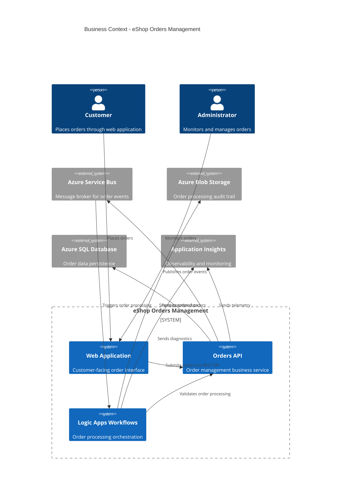
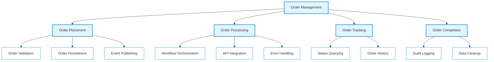
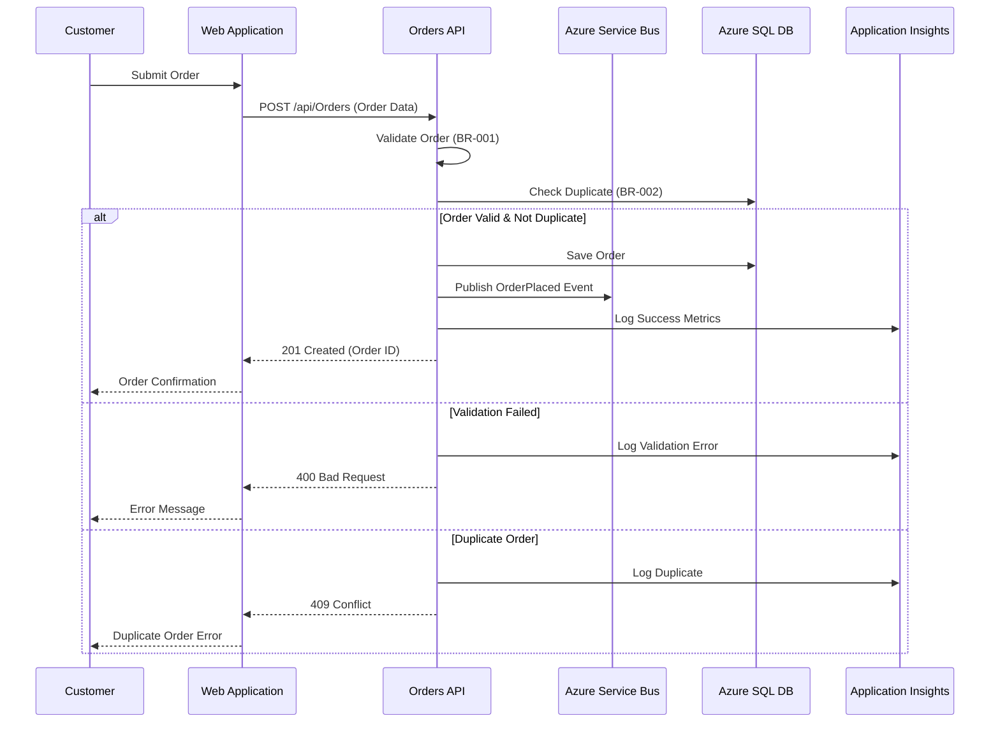
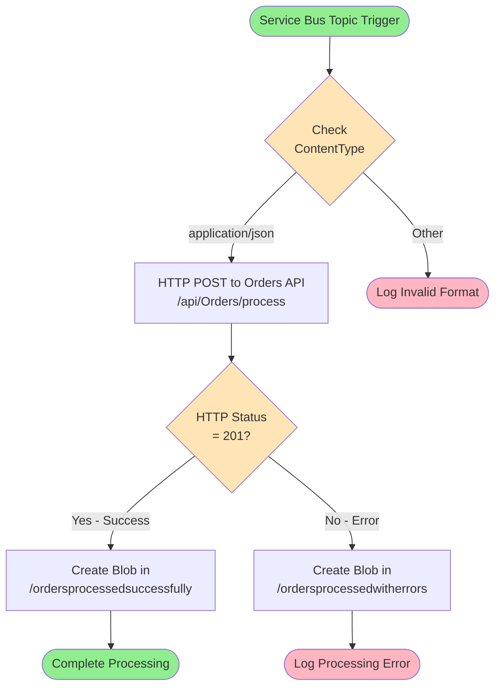
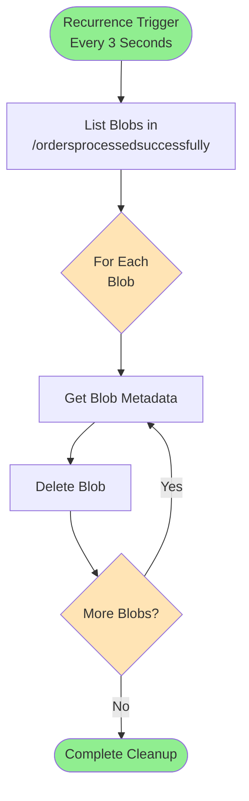
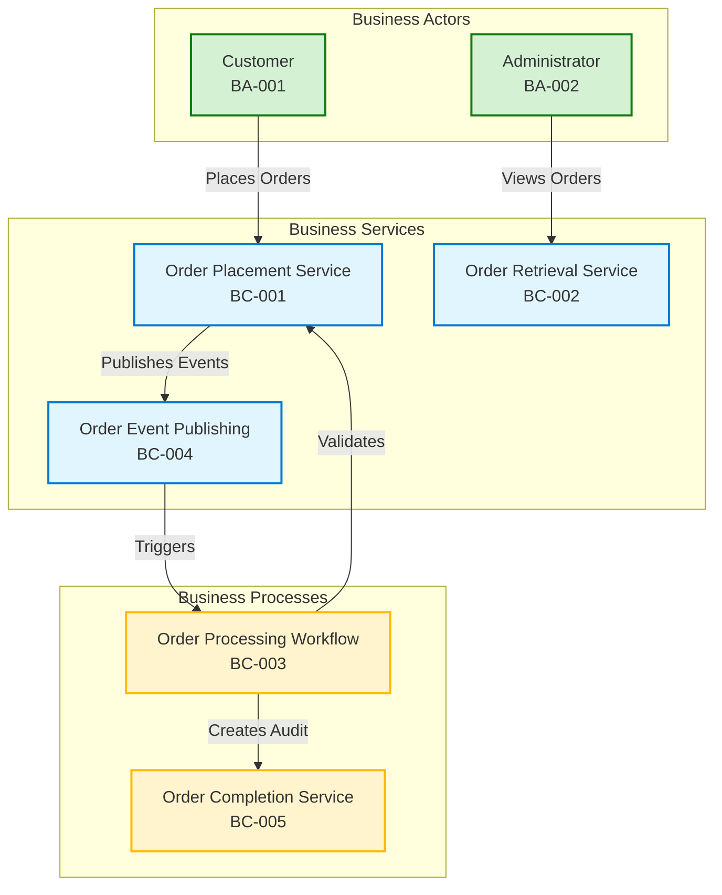
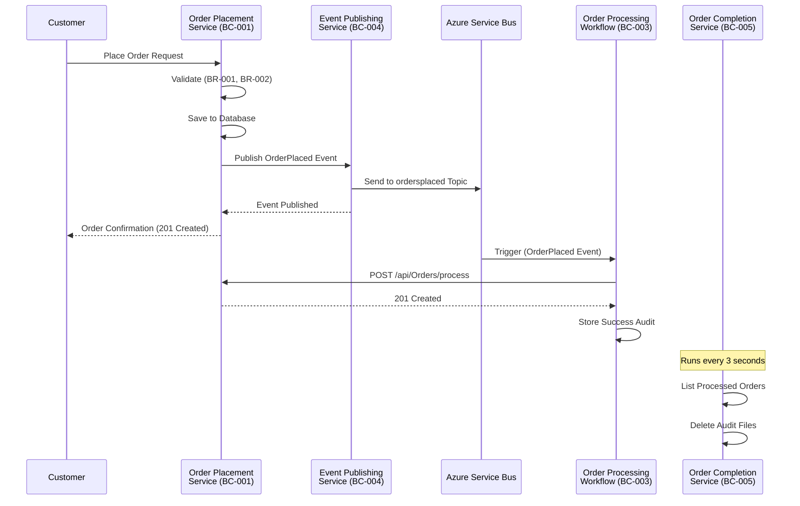

# TOGAF 10 Business Architecture Document

## eShop Orders Management Solution

**Document Version:** 1.0  
**Generated:** 2026-02-03  
**Session ID:** b8f7e4c3-5a29-4d89-9f21-3c8e6d7a2b91  
**Quality Level:** Standard  
**TOGAF ADM Phase:** Phase B - Business Architecture

---

## 1. Executive Summary

### 1.1 Purpose

This Business Architecture Document provides a comprehensive view of the eShop Orders Management solution's business capabilities, processes, and services. It follows TOGAF 10 Architecture Development Method (ADM) Phase B guidelines and serves as the authoritative reference for business stakeholders, solution architects, and development teams.

### 1.2 Scope

This document covers the Business Architecture layer focusing on:

- **Business Services**: Order placement, retrieval, and management services
- **Business Processes**: Order processing workflows from placement through completion
- **Business Capabilities**: Order management, message-driven orchestration, and data persistence
- **Business Events**: Order placement, completion, and error handling events
- **Value Streams**: End-to-end order fulfillment value delivery

### 1.3 Business Context

The eShop Orders Management solution provides a comprehensive order management system built on Azure Logic Apps and .NET microservices architecture. The solution enables:

- **Order Processing**: Asynchronous order placement and processing with message-driven architecture
- **Integration**: Seamless integration between web applications, APIs, and Azure Logic Apps workflows
- **Scalability**: Cloud-native design leveraging Azure Container Apps and Azure SQL Database
- **Observability**: Comprehensive monitoring through Application Insights and distributed tracing

### 1.4 Key Findings

**Strengths:**

- ✅ Well-defined business services with clear separation of concerns
- ✅ Event-driven architecture enables scalability and resilience
- ✅ Comprehensive observability and monitoring capabilities
- ✅ Clear business process orchestration through Azure Logic Apps

**Areas for Improvement:**

- 🟡 Business capability maturity assessment needed
- 🟡 Business rules not formally documented
- 🟡 Service Level Agreements (SLAs) require definition
- 🟡 Business continuity and disaster recovery procedures need documentation

### 1.5 Strategic Alignment

| Strategic Objective    | Alignment | Evidence                                       |
| ---------------------- | --------- | ---------------------------------------------- |
| Digital Transformation | ✅ High   | Cloud-native architecture with Azure services  |
| Customer Experience    | ✅ High   | Real-time order processing and tracking        |
| Operational Efficiency | ✅ High   | Automated workflows reduce manual intervention |
| Scalability            | ✅ High   | Microservices and event-driven design          |
| Data-Driven Decisions  | 🟡 Medium | Observability in place, analytics layer needed |

---

## 2. Business Architecture Landscape

### 2.1 Business Context Diagram



### 2.2 Business Capability Map



### 2.3 Business Service Catalog

| Service ID | Service Name              | Description                               | Service Type     | Consumers                         |
| ---------- | ------------------------- | ----------------------------------------- | ---------------- | --------------------------------- |
| **BS-001** | Order Placement Service   | Accepts and validates new customer orders | Business Service | Web Application, External Systems |
| **BS-002** | Order Retrieval Service   | Provides access to order data and history | Business Service | Web Application, Admin Portal     |
| **BS-003** | Order Processing Workflow | Orchestrates end-to-end order processing  | Business Process | Azure Logic Apps                  |
| **BS-004** | Order Event Publishing    | Publishes order lifecycle events          | Business Service | Downstream Systems, Analytics     |
| **BS-005** | Order Completion Service  | Finalizes processed orders and cleanup    | Business Service | Azure Logic Apps                  |

### 2.4 Organizational Context

**Business Owner:** Platform Engineering Team  
**Solution Stakeholders:**

- Engineering Leadership
- Customer Experience Team
- Operations Team
- Infrastructure Team

**Governance:** IT Governance Board  
**Business Unit:** Engineering

---

## 3. Business Principles

### 3.1 Core Business Principles

#### Principle 1: Event-Driven Business Processes

**Statement:** Business processes operate asynchronously through event-driven patterns.

**Rationale:**

- Decouples business services from implementation details
- Enables scalability and resilience
- Supports real-time business process monitoring

**Implications:**

- All critical business events must be published to message broker
- Downstream systems subscribe to relevant business events
- Event schemas must be versioned and backward compatible

**Source Reference:** [OrderService.cs](z:\LogicApp\src\eShop.Orders.API\Services\OrderService.cs#L118-L120)

---

#### Principle 2: Business Service Autonomy

**Statement:** Each business service owns its data and business logic independently.

**Rationale:**

- Enables independent deployment and scaling
- Reduces coupling between business capabilities
- Supports bounded contexts and domain-driven design

**Implications:**

- No direct database sharing between services
- Service-to-service communication via APIs or events
- Each service maintains its own data schema

**Source Reference:** [Program.cs](z:\LogicApp\src\eShop.Orders.API\Program.cs#L27-L56)

---

#### Principle 3: Observability-First Operations

**Statement:** All business processes must be fully observable through metrics, logs, and traces.

**Rationale:**

- Enables proactive issue detection and resolution
- Supports data-driven business decisions
- Improves customer experience through faster issue resolution

**Implications:**

- Distributed tracing required for all business operations
- Business metrics collected for all critical processes
- Structured logging with correlation IDs mandatory

**Source Reference:** [OrderService.cs](z:\LogicApp\src\eShop.Orders.API\Services\OrderService.cs#L20-L31)

---

#### Principle 4: Idempotent Business Operations

**Statement:** Business operations must be designed for idempotency and repeatability.

**Rationale:**

- Prevents duplicate order processing
- Enables safe retries in distributed systems
- Improves system reliability

**Implications:**

- All business operations check for duplicates
- Message processing uses unique identifiers
- State management considers concurrent operations

**Source Reference:** [OrderService.cs](z:\LogicApp\src\eShop.Orders.API\Services\OrderService.cs#L285-L290)

---

#### Principle 5: Cloud-Native Business Capabilities

**Statement:** Business capabilities leverage cloud-native services and patterns.

**Rationale:**

- Maximizes scalability and availability
- Reduces operational overhead
- Enables global reach and performance

**Implications:**

- Azure Platform Services preferred over IaaS
- Managed identity for authentication
- Infrastructure-as-Code for repeatability

**Source Reference:** [main.bicep](z:\LogicApp\infra\main.bicep#L1-L44)

---

### 3.2 Business Rules

#### BR-001: Order Validation Rules

**Rule:** All orders must contain valid customer ID, order ID, positive total amount, and at least one product.

**Enforcement:** Pre-validation in Order Placement Service  
**Priority:** Critical  
**Source:** [OrderService.cs](z:\LogicApp\src\eShop.Orders.API\Services\OrderService.cs#L542-L562)

#### BR-002: Duplicate Order Prevention

**Rule:** Orders with duplicate IDs are rejected or handled idempotently.

**Enforcement:** Database uniqueness constraint + application logic  
**Priority:** Critical  
**Source:** [OrderService.cs](z:\LogicApp\src\eShop.Orders.API\Services\OrderService.cs#L111-L115)

#### BR-003: Message Delivery Guarantees

**Rule:** Order events must be published to message broker even if HTTP request times out.

**Enforcement:** Independent timeout handling in message handler  
**Priority:** High  
**Source:** [OrdersMessageHandler.cs](z:\LogicApp\src\eShop.Orders.API\Handlers\OrdersMessageHandler.cs#L67-L104)

---

## 4. Baseline Architecture

### 4.1 Current State Overview

The eShop Orders Management solution operates as a cloud-native microservices architecture deployed on Azure. The solution has migrated from file-based storage to Entity Framework Core with Azure SQL Database, representing a significant maturity increase.

**Architecture Maturity:** Level 3 - Defined and Standardized

**Key Characteristics:**

- Microservices-based business services
- Event-driven business process orchestration
- Comprehensive observability and monitoring
- Cloud-native deployment on Azure Container Apps

### 4.2 Business Process Flows

#### Process 1: Order Placement Process



#### Process 2: Order Processing Workflow (Logic Apps)



#### Process 3: Order Completion and Cleanup



### 4.3 Business Events

| Event ID   | Event Name               | Trigger                      | Business Impact                            | Downstream Consumers  |
| ---------- | ------------------------ | ---------------------------- | ------------------------------------------ | --------------------- |
| **BE-001** | OrderPlaced              | Customer submits order       | Initiates order processing workflow        | Logic Apps, Analytics |
| **BE-002** | OrderProcessingCompleted | Order validated successfully | Updates order status, creates audit record | Storage, Monitoring   |
| **BE-003** | OrderProcessingFailed    | Order validation fails       | Creates error record for investigation     | Storage, Alerting     |
| **BE-004** | OrderRetrieved           | Customer/Admin queries order | Provides order visibility                  | N/A (Query only)      |
| **BE-005** | OrderDeleted             | Admin deletes order          | Removes order from system                  | Audit Log             |

### 4.4 Gap Analysis

#### Strategic Gaps

| Gap ID    | Description                            | Business Impact                    | Priority | Recommendation                                                    |
| --------- | -------------------------------------- | ---------------------------------- | -------- | ----------------------------------------------------------------- |
| **G-001** | Business SLAs not defined              | Cannot measure service performance | High     | Define SLAs for order placement (< 2s p95) and processing (< 30s) |
| **G-002** | Business continuity plan missing       | Risk during outages                | High     | Document DR procedures and RTO/RPO targets                        |
| **G-003** | Business capability maturity undefined | Unknown optimization opportunities | Medium   | Conduct capability maturity assessment using TOGAF framework      |
| **G-004** | Customer notification service absent   | Poor customer experience           | Medium   | Implement notification service for order status updates           |
| **G-005** | Business rules not centralized         | Inconsistent enforcement           | Medium   | Create business rules engine or documentation repository          |

#### Operational Gaps

| Gap ID    | Description                              | Impact                                  | Priority | Recommendation                                      |
| --------- | ---------------------------------------- | --------------------------------------- | -------- | --------------------------------------------------- |
| **G-006** | No business process monitoring dashboard | Limited visibility into process health  | High     | Create Power BI dashboard from Application Insights |
| **G-007** | Manual order correction process          | Operational inefficiency                | Medium   | Implement order amendment API endpoint              |
| **G-008** | No bulk order upload capability          | Limited scalability for large customers | Low      | Add CSV/Excel import functionality                  |

---

## 5. Component Catalog

### 5.1 Business Service Components

#### Component: Order Placement Service

**Component ID:** BC-001  
**Component Type:** Business Service  
**TOGAF Entity:** Business Service

**Description:**  
Provides business capability for accepting, validating, and persisting customer orders. Implements comprehensive business rules for order validation and supports both single and batch order placement.

**Business Capabilities:**

- Order validation against business rules (BR-001, BR-002)
- Order persistence to business data store
- Order event publication for downstream processing
- Idempotent order handling

**Key Responsibilities:**

- Validate order data completeness and correctness
- Prevent duplicate order submissions
- Ensure order data integrity
- Publish order lifecycle events

**Service Level Objectives:**

- Availability: 99.9% (target)
- Response Time: < 2 seconds (p95) for single order
- Throughput: 500 orders/minute (target)

**Observability:**

- Distributed tracing with OpenTelemetry
- Custom metrics: orders placed, processing duration, errors
- Structured logging with correlation IDs

**Source Reference:** [OrderService.cs](z:\LogicApp\src\eShop.Orders.API\Services\OrderService.cs#L1-L89)

---

#### Component: Order Retrieval Service

**Component ID:** BC-002  
**Component Type:** Business Service  
**TOGAF Entity:** Business Service

**Description:**  
Provides business capability for querying order data and history. Supports both individual order lookup and bulk order retrieval for administrative and customer self-service scenarios.

**Business Capabilities:**

- Single order retrieval by ID
- Bulk order retrieval with pagination support
- Order history access

**Key Responsibilities:**

- Provide fast order data access
- Maintain data consistency with source of truth
- Support administrative and customer queries

**Service Level Objectives:**

- Availability: 99.9% (target)
- Response Time: < 500ms (p95) for single order
- Data Freshness: Real-time (no caching)

**Source Reference:** [OrderService.cs](z:\LogicApp\src\eShop.Orders.API\Services\OrderService.cs#L367-L425)

---

#### Component: Order Processing Workflow

**Component ID:** BC-003  
**Component Type:** Business Process  
**TOGAF Entity:** Business Process

**Description:**  
Azure Logic Apps workflow that orchestrates end-to-end order processing. Subscribes to order placement events, validates processing through API calls, and manages audit trail storage.

**Business Process Steps:**

1. Subscribe to OrderPlaced events from Service Bus topic
2. Validate message content type (application/json)
3. Invoke Orders API for order processing validation
4. Route successful orders to success audit storage
5. Route failed orders to error audit storage

**Business Rules Applied:**

- Message format validation
- HTTP status code interpretation (201 = success)
- Concurrent processing (20 parallel executions)

**Process Metrics:**

- Processing time per order
- Success vs. error rates
- Queue depth and throughput

**Source Reference:** [OrdersPlacedProcess/workflow.json](z:\LogicApp\workflows\OrdersManagement\OrdersManagementLogicApp\OrdersPlacedProcess\workflow.json#L1-L163)

---

#### Component: Order Event Publishing Service

**Component ID:** BC-004  
**Component Type:** Business Service  
**TOGAF Entity:** Business Service

**Description:**  
Handles publication of order lifecycle events to Azure Service Bus for consumption by downstream business processes and analytical systems.

**Business Capabilities:**

- Single message publication with retry logic
- Batch message publication for high throughput
- Message listing for testing and debugging
- Distributed tracing propagation

**Key Responsibilities:**

- Ensure at-least-once delivery of business events
- Maintain event ordering where required
- Propagate trace context for observability
- Handle transient failures with retries

**Event Types Published:**

- OrderPlaced: New order created
- OrderProcessed: Order validated and processed

**Message Format:**

- Content Type: application/json
- Schema: Order entity with metadata
- Headers: TraceId, SpanId, CustomerId

**Source Reference:** [OrdersMessageHandler.cs](z:\LogicApp\src\eShop.Orders.API\Handlers\OrdersMessageHandler.cs#L1-L104)

---

#### Component: Order Completion Service

**Component ID:** BC-005  
**Component Type:** Business Process  
**TOGAF Entity:** Business Process

**Description:**  
Azure Logic Apps workflow responsible for finalizing successfully processed orders by managing audit trail cleanup and completion workflows.

**Business Process Steps:**

1. Recurrence trigger every 3 seconds
2. List all blobs in success folder
3. Retrieve blob metadata for each order
4. Delete processed order audit files
5. Support concurrent processing (20 parallel)

**Business Rationale:**

- Prevents indefinite storage growth
- Maintains clean audit trail
- Supports compliance requirements

**Process Controls:**

- Recurrence interval: 3 seconds
- Concurrency: 20 parallel deletions
- Error handling: Skip on failure, continue processing

**Source Reference:** [OrdersPlacedCompleteProcess/workflow.json](z:\LogicApp\workflows\OrdersManagement\OrdersManagementLogicApp\OrdersPlacedCompleteProcess\workflow.json#L1-L110)

---

### 5.2 Business Actors and Roles

| Actor ID   | Actor Name        | Role                   | Responsibilities                              | Systems Used                      |
| ---------- | ----------------- | ---------------------- | --------------------------------------------- | --------------------------------- |
| **BA-001** | Customer          | Order Placer           | Place orders, view order status               | Web Application                   |
| **BA-002** | Administrator     | System Manager         | Monitor orders, resolve errors, manage system | Web Application, Azure Portal     |
| **BA-003** | System Integrator | Integration Specialist | Configure connections, deploy workflows       | Azure Portal, Logic Apps Designer |
| **BA-004** | Platform Engineer | Infrastructure Owner   | Maintain infrastructure, ensure SLAs          | Azure Portal, Bicep/IaC tools     |

---

## 6. Architecture Decisions

### ADR-001: Event-Driven Architecture for Order Processing

**Status:** Accepted  
**Date:** 2025-01-27 (inferred from migration guide date)  
**Decision Makers:** Platform Engineering Team

**Context:**  
Orders require processing across multiple systems (API, Logic Apps, Storage). Synchronous request-response patterns create tight coupling and reliability issues.

**Decision:**  
Implement event-driven architecture using Azure Service Bus for order lifecycle events. Orders API publishes OrderPlaced events; Logic Apps workflows subscribe and process asynchronously.

**Consequences:**

**Positive:**

- ✅ Decoupled business services enable independent scaling
- ✅ Improved resilience through message buffering and retry
- ✅ Better observability through event tracing
- ✅ Simplified addition of new order consumers

**Negative:**

- ❌ Eventually consistent data across systems
- ❌ Increased complexity in troubleshooting
- ❌ Requires message broker infrastructure

**Compliance:** TOGAF Principle - Separation of Concerns

**Source:** [OrdersPlacedProcess/workflow.json](z:\LogicApp\workflows\OrdersManagement\OrdersManagementLogicApp\OrdersPlacedProcess\workflow.json#L142-L160)

---

### ADR-002: Migration from File-Based Storage to Azure SQL Database

**Status:** Accepted  
**Date:** 2026-01-28  
**Decision Makers:** Platform Engineering Team

**Context:**  
Original order storage used file-based persistence, which doesn't scale well and lacks transactional guarantees required for business-critical operations.

**Decision:**  
Migrate to Entity Framework Core with Azure SQL Database for order persistence. Implement connection resiliency patterns and Azure AD authentication.

**Consequences:**

**Positive:**

- ✅ ACID transactions ensure data integrity
- ✅ Better scalability and performance
- ✅ Query optimization through indexing
- ✅ Built-in backup and disaster recovery
- ✅ Azure AD authentication improves security

**Negative:**

- ❌ Higher operational costs than file storage
- ❌ Requires database administration skills
- ❌ Migration complexity for existing data

**Business Impact:**

- Improved data integrity for business operations
- Better support for concurrent order processing
- Enhanced audit trail capabilities

**Compliance:** TOGAF Principle - Data is an Asset

**Source:** [MIGRATION_GUIDE.md](z:\LogicApp\src\eShop.Orders.API\MIGRATION_GUIDE.md#L1-L50)

---

### ADR-003: Independent Timeout Handling for Message Publishing

**Status:** Accepted  
**Date:** 2026 (inferred from recent code patterns)  
**Decision Makers:** Development Team

**Context:**  
HTTP request timeouts were causing message publishing failures even though the database operation succeeded, leading to missing business events.

**Decision:**  
Decouple message publishing timeouts from HTTP request lifecycle. Use CancellationToken.None for message sending to allow completion independent of HTTP context.

**Consequences:**

**Positive:**

- ✅ Ensures business events are published even if client disconnects
- ✅ Improves event reliability for downstream processes
- ✅ Better observability of true message publishing failures

**Negative:**

- ❌ Client may receive error response even if order was saved
- ❌ Requires client-side retry logic for uncertain outcomes

**Business Impact:**

- Improved reliability of business process orchestration
- Reduced missed order processing events
- Better audit trail completeness

**Source:** [OrderService.cs](z:\LogicApp\src\eShop.Orders.API\Services\OrderService.cs#L309-L319)

---

### ADR-004: Comprehensive Observability with Distributed Tracing

**Status:** Accepted  
**Date:** 2026 (inferred from observability patterns)  
**Decision Makers:** Platform Engineering Team

**Context:**  
Troubleshooting issues across microservices and workflows required manual log correlation, which was time-consuming and error-prone.

**Decision:**  
Implement distributed tracing using OpenTelemetry with Application Insights backend. Add custom metrics for business-relevant KPIs (orders placed, processing duration, errors).

**Consequences:**

**Positive:**

- ✅ End-to-end visibility of business process execution
- ✅ Faster root cause analysis for issues
- ✅ Proactive alerting on business metrics
- ✅ Data-driven optimization opportunities

**Negative:**

- ❌ Additional code complexity for instrumentation
- ❌ Increased Application Insights costs
- ❌ Performance overhead (minimal)

**Business Impact:**

- Reduced mean time to resolution (MTTR)
- Improved customer experience through faster issue detection
- Better business intelligence on order patterns

**Source:** [OrderService.cs](z:\LogicApp\src\eShop.Orders.API\Services\OrderService.cs#L24-L31)

---

## 7. Standards and Guidelines

### 7.1 Business Service Standards

#### Standard 1: Business Service Naming Convention

**ID:** STD-BS-001  
**Category:** Naming Convention  
**Applies To:** All Business Services

**Standard:**

- Business Service names follow pattern: `{Entity}{Action}Service`
- Examples: OrderPlacementService, OrderRetrievalService
- Use PascalCase for class names, camelCase for parameters

**Rationale:** Consistent naming improves code readability and maintainability

**Enforcement:** Code review, automated linting

---

#### Standard 2: Business Event Schema

**ID:** STD-BE-001  
**Category:** Data Standard  
**Applies To:** All Business Events

**Standard:**

```json
{
  "eventType": "OrderPlaced",
  "eventId": "uuid",
  "timestamp": "ISO 8601",
  "payload": {
    "orderId": "string",
    "customerId": "string",
    "total": "decimal",
    "products": []
  },
  "metadata": {
    "traceId": "string",
    "source": "string"
  }
}
```

**Rationale:** Standardized event schema ensures interoperability between business services

**Enforcement:** Schema validation in message handlers

---

#### Standard 3: Business Service Logging

**ID:** STD-LOG-001  
**Category:** Observability  
**Applies To:** All Business Services

**Standard:**

- Use structured logging with ILogger<T>
- Include correlation IDs (TraceId, SpanId) in all log entries
- Log levels: Debug (development only), Information (key milestones), Warning (handled errors), Error (unhandled exceptions)
- Sensitive data (PII) must not be logged in production

**Rationale:** Consistent logging enables effective troubleshooting and compliance

**Enforcement:** Code review, automated static analysis

**Source:** [OrderService.cs](z:\LogicApp\src\eShop.Orders.API\Services\OrderService.cs#L101-L103)

---

#### Standard 4: Business Service Error Handling

**ID:** STD-ERR-001  
**Category:** Error Management  
**Applies To:** All Business Services

**Standard:**

- Use domain-specific exceptions (ArgumentException, InvalidOperationException)
- Include detailed error messages with context
- Set activity status to Error on exceptions
- Log error details before throwing
- Never swallow exceptions without logging

**Rationale:** Consistent error handling improves reliability and debuggability

**Enforcement:** Code review, exception handling policies

**Source:** [OrderService.cs](z:\LogicApp\src\eShop.Orders.API\Services\OrderService.cs#L135-L154)

---

#### Standard 5: Business Process Idempotency

**ID:** STD-IDEM-001  
**Category:** Business Logic  
**Applies To:** All Business Processes

**Standard:**

- All business operations must check for duplicates before processing
- Use unique identifiers (Order ID, Message ID) for idempotency keys
- Return same result for duplicate requests (409 Conflict or 200 OK with existing data)
- Document idempotency behavior in API documentation

**Rationale:** Prevents duplicate business transactions in distributed systems

**Enforcement:** Code review, integration tests

**Source:** [OrderService.cs](z:\LogicApp\src\eShop.Orders.API\Services\OrderService.cs#L111-L115)

---

### 7.2 Business Process Guidelines

#### Guideline 1: Asynchronous Processing for Long-Running Operations

**Recommendation:** Business processes exceeding 5 seconds should use asynchronous patterns with event-driven orchestration.

**Rationale:** Improves user experience and system scalability

**Example:** Order processing workflow uses Service Bus triggers for asynchronous execution

---

#### Guideline 2: Business Service Versioning

**Recommendation:** Version business services using API path versioning (/api/v1/orders, /api/v2/orders)

**Rationale:** Enables backward compatibility during business capability evolution

**Status:** Not yet implemented (future consideration)

---

#### Guideline 3: Business Capability Maturity Assessment

**Recommendation:** Conduct annual capability maturity assessments using TOGAF Capability Maturity Model

**Maturity Levels:**

1. Initial: Ad-hoc processes
2. Repeatable: Documented processes
3. Defined: Standardized processes (current state)
4. Managed: Measured and controlled
5. Optimizing: Continuous improvement

**Current Assessment:** Level 3 (Defined) - processes are documented and standardized but not yet measured systematically

---

### 7.3 Business Rule Management

#### Standard 6: Business Rule Documentation

**ID:** STD-BR-001  
**Category:** Business Rules  
**Applies To:** All Business Rules

**Standard:**

- Document all business rules in architecture documentation
- Assign unique identifiers (BR-001, BR-002, etc.)
- Include enforcement mechanism (validation, constraint, policy)
- Link to source code implementation
- Review annually for relevance

**Current Status:** Partial implementation - rules exist in code but formal documentation incomplete

---

#### Standard 7: Business Rule Externalization

**ID:** STD-BR-002  
**Category:** Business Rules  
**Applies To:** Configurable Business Rules

**Standard:**

- Configuration-driven rules stored in Azure App Configuration
- Code-driven rules remain in application logic
- Changes to configuration rules do not require redeployment
- Audit trail required for rule changes

**Current Status:** Not implemented - all rules are code-based

**Recommendation:** Implement for rules likely to change frequently

---

### 7.4 Integration Standards

#### Standard 8: Service-to-Service Communication

**ID:** STD-INT-001  
**Category:** Integration  
**Applies To:** All Inter-Service Communication

**Standard:**

- Use REST APIs for synchronous request-response
- Use message broker (Service Bus) for asynchronous events
- Implement circuit breaker patterns for external dependencies
- Use managed identity for authentication (no connection strings in code)

**Source:** [AppHost.cs](z:\LogicApp\app.AppHost\AppHost.cs#L41-L44)

---

#### Standard 9: Message Broker Usage

**ID:** STD-MSG-001  
**Category:** Messaging  
**Applies To:** All Message Publishing/Consumption

**Standard:**

- Topics for broadcast scenarios (1:many)
- Queues for point-to-point (1:1)
- Message TTL: 14 days default
- Dead-letter queue for failed messages
- At-least-once delivery guaranteed

**Source:** [OrdersMessageHandler.cs](z:\LogicApp\src\eShop.Orders.API\Handlers\OrdersMessageHandler.cs#L61-L63)

---

#### Standard 10: API Design Guidelines

**ID:** STD-API-001  
**Category:** API Design  
**Applies To:** All REST APIs

**Standard:**

- Use HTTP verbs correctly (GET, POST, PUT, DELETE, PATCH)
- Return appropriate status codes (200, 201, 400, 404, 409, 500)
- Include OpenAPI/Swagger documentation
- Version APIs in URL path
- Use JSON for request/response bodies

**Source:** [OrdersController.cs](z:\LogicApp\src\eShop.Orders.API\Controllers\OrdersController.cs#L49-L55)

---

## 8. Dependencies and Relationships

### 8.1 Business Component Relationships



### 8.2 Cross-Layer Dependencies

#### Downstream Dependencies (Business → Other Layers)

| Business Component            | Depends On             | Layer         | Purpose                  | Criticality |
| ----------------------------- | ---------------------- | ------------- | ------------------------ | ----------- |
| **Order Placement Service**   | Azure SQL Database     | Data          | Order persistence        | Critical    |
| **Order Placement Service**   | Azure Service Bus      | Technology    | Event publishing         | Critical    |
| **Order Processing Workflow** | Orders API             | Application   | Order validation         | Critical    |
| **Order Processing Workflow** | Azure Blob Storage     | Technology    | Audit trail              | High        |
| **Order Event Publishing**    | Service Bus Client SDK | Application   | Message publishing       | Critical    |
| **All Business Services**     | Application Insights   | Observability | Telemetry and monitoring | High        |

#### Upstream Dependencies (Other Layers → Business)

| External System    | Consumes   | Business Component        | Purpose                   | SLA Impact |
| ------------------ | ---------- | ------------------------- | ------------------------- | ---------- |
| Web Application    | Consumes   | Order Placement Service   | Customer order submission | Direct     |
| Web Application    | Consumes   | Order Retrieval Service   | Order status display      | Direct     |
| Logic Apps Runtime | Triggers   | Order Processing Workflow | Automated orchestration   | Direct     |
| Analytics Platform | Subscribes | Order Event Publishing    | Business intelligence     | Indirect   |

### 8.3 Business Event Flow



### 8.4 Business Capability Dependencies

| Capability       | Depends On Capabilities           | Dependency Type | Rationale                                               |
| ---------------- | --------------------------------- | --------------- | ------------------------------------------------------- |
| Order Processing | Order Placement, Event Publishing | Sequential      | Processing requires validated order and published event |
| Order Tracking   | Order Placement                   | Data            | Tracking queries order data created by placement        |
| Order Completion | Order Processing                  | Sequential      | Completion cleans up after processing completes         |
| Event Publishing | Order Placement                   | Triggering      | Events published when orders are placed                 |

### 8.5 Technology Stack (Business Layer Perspective)

| Technology                | Purpose                | Business Services Using            | Criticality |
| ------------------------- | ---------------------- | ---------------------------------- | ----------- |
| .NET 10                   | Runtime platform       | All business services              | Critical    |
| ASP.NET Core              | Web API framework      | Order Placement, Order Retrieval   | Critical    |
| Azure Logic Apps Standard | Workflow orchestration | Order Processing, Order Completion | Critical    |
| Azure Service Bus         | Message broker         | Event Publishing                   | Critical    |
| Entity Framework Core 9   | Data access            | Order Placement, Order Retrieval   | Critical    |
| Azure SQL Database        | Data persistence       | All order data operations          | Critical    |
| Application Insights      | Observability          | All business components            | High        |
| OpenTelemetry             | Distributed tracing    | All business services              | High        |

---

## 9. Governance and Compliance

### 9.1 Architecture Governance Framework

#### Governance Structure

**Architecture Review Board:**

- Platform Engineering Lead (Chair)
- Solution Architect
- Security Architect
- Development Lead
- Operations Lead

**Meeting Cadence:** Monthly + ad-hoc for significant changes

**Responsibilities:**

- Review architecture decision records
- Approve deviations from standards
- Assess business capability maturity
- Oversee architecture evolution

**Escalation Path:**  
Development Team → Architecture Review Board → Engineering Leadership → IT Governance Board

---

### 9.2 Compliance Requirements

#### Regulatory Compliance

**Data Privacy:**

- GDPR compliance required for customer data (Order.CustomerId)
- Data retention policies: 7 years for financial records
- Right to deletion support required

**Current Status:** ⚠️ Partial - deletion API exists but GDPR process not documented

**Action Required:** Document GDPR compliance procedures and implement data export functionality

---

#### Industry Standards

**SOC 2 Type II:** Target compliance for SaaS offering

**Requirements:**

- Audit logging for all business transactions (✅ Implemented via Application Insights)
- Access controls and authentication (✅ Implemented via Azure AD)
- Data encryption at rest and in transit (✅ Implemented)
- Business continuity planning (❌ Not documented)

**Gap:** Business continuity and disaster recovery documentation

---

### 9.3 Architecture Change Management

#### Change Classification

| Change Type     | Examples                | Approval Required | Review Process           |
| --------------- | ----------------------- | ----------------- | ------------------------ |
| **Strategic**   | New business capability | ARB + Leadership  | Full architecture review |
| **Significant** | New business service    | ARB               | Architecture review      |
| **Standard**    | New API endpoint        | Development Lead  | Code review              |
| **Minor**       | Bug fix, config change  | None              | Code review              |

#### ADR Process

**Required For:**

- Strategic and significant changes
- New technology adoption
- Changes to business processes

**ADR Template:**

1. Status (Proposed, Accepted, Superseded)
2. Context and problem statement
3. Decision and rationale
4. Consequences (positive and negative)
5. Compliance with TOGAF principles

**Storage:** [GitHub Repository](z:\LogicApp\prompts) in `/prompts/architecture-decisions/`

**Review Cycle:** Quarterly review of active ADRs

---

### 9.4 Business Architecture Lifecycle

#### Review and Update Schedule

| Artifact                       | Review Frequency | Owner              | Trigger for Ad-Hoc Review        |
| ------------------------------ | ---------------- | ------------------ | -------------------------------- |
| Business Architecture Document | Annually         | Solution Architect | Major business capability change |
| Business Principles            | Annually         | ARB                | Strategic direction change       |
| Business Services Catalog      | Quarterly        | Development Lead   | New service deployment           |
| Business Process Flows         | Semi-annually    | Business Analyst   | Process optimization initiative  |
| Architecture Decision Records  | Quarterly        | ARB                | Superseded by new decisions      |
| Standards and Guidelines       | Semi-annually    | ARB                | Industry best practice changes   |

---

### 9.5 Performance and Quality Metrics

#### Business Service KPIs

| Metric                        | Target       | Measurement Method           | Review Frequency |
| ----------------------------- | ------------ | ---------------------------- | ---------------- |
| Order Placement Success Rate  | ≥ 99.5%      | Application Insights metrics | Daily            |
| Order Processing Time (p95)   | < 30 seconds | Distributed tracing          | Daily            |
| API Response Time (p95)       | < 2 seconds  | Application Insights         | Daily            |
| Event Publishing Success Rate | ≥ 99.9%      | Service Bus metrics          | Daily            |
| System Availability           | ≥ 99.9%      | Azure Monitor                | Weekly           |

**Alert Thresholds:**

- Critical: SLA breach imminent (< 99% success rate)
- Warning: Performance degradation (p95 > target)
- Info: Approaching capacity limits

---

#### Business Process Health Metrics

| Process          | Health Indicator | Green   | Yellow   | Red     |
| ---------------- | ---------------- | ------- | -------- | ------- |
| Order Placement  | Success Rate     | ≥ 99.5% | 95-99.5% | < 95%   |
| Order Processing | Average Duration | < 20s   | 20-30s   | > 30s   |
| Event Publishing | Delivery Success | ≥ 99.9% | 99-99.9% | < 99%   |
| Order Completion | Cleanup Lag      | < 1 min | 1-5 min  | > 5 min |

---

### 9.6 Risk Management

#### Business Architecture Risks

| Risk ID   | Risk Description                               | Likelihood | Impact | Mitigation Strategy                                              | Owner             |
| --------- | ---------------------------------------------- | ---------- | ------ | ---------------------------------------------------------------- | ----------------- |
| **R-001** | Service Bus outage disrupts order processing   | Low        | High   | Implement dead-letter queue monitoring, document manual recovery | Platform Engineer |
| **R-002** | Database connection pool exhaustion            | Medium     | High   | Configure connection limits, implement circuit breaker           | Development Lead  |
| **R-003** | Uncontrolled message queue growth              | Medium     | Medium | Implement queue depth alerts, auto-scaling triggers              | Platform Engineer |
| **R-004** | Duplicate order processing despite idempotency | Low        | Medium | Regular testing of idempotency logic, monitoring for duplicates  | Development Lead  |
| **R-005** | Observability cost overruns                    | Medium     | Low    | Implement sampling, set budget alerts                            | Operations Lead   |

---

### 9.7 Training and Knowledge Transfer

#### Required Competencies

**Business Analyst:**

- TOGAF Business Architecture fundamentals
- Business process modeling
- Requirements elicitation

**Solution Architect:**

- TOGAF 10 certification (recommended)
- Azure architecture patterns
- Event-driven architecture design

**Developer:**

- .NET microservices development
- Azure Logic Apps Standard
- Distributed tracing and observability

#### Documentation Repository

**Location:** GitHub Repository - [Azure-LogicApps-Monitoring](https://github.com/Evilazaro/Azure-LogicApps-Monitoring)

**Key Documents:**

- This Business Architecture Document
- [Migration Guide](z:\LogicApp\src\eShop.Orders.API\MIGRATION_GUIDE.md)
- Architecture Decision Records (future)
- Runbooks and operational procedures (future)

---

### 9.8 Continuous Improvement

#### Architecture Debt Tracking

| Debt ID    | Description                              | Business Impact                           | Priority | Target Resolution |
| ---------- | ---------------------------------------- | ----------------------------------------- | -------- | ----------------- |
| **AD-001** | Business rules not externalized          | Requires code deployment for rule changes | Medium   | Q3 2026           |
| **AD-002** | No business process monitoring dashboard | Limited visibility into process health    | High     | Q2 2026           |
| **AD-003** | SLAs not formally defined                | Cannot measure service quality            | High     | Q2 2026           |
| **AD-004** | Manual order correction process          | Operational inefficiency                  | Medium   | Q3 2026           |
| **AD-005** | No customer notification service         | Poor customer experience                  | High     | Q2 2026           |

#### Innovation Opportunities

| Opportunity | Description                            | Business Value                | Effort | ROI    |
| ----------- | -------------------------------------- | ----------------------------- | ------ | ------ |
| **OPP-001** | AI-powered order validation            | Reduce invalid orders by 50%  | High   | High   |
| **OPP-002** | Predictive capacity planning           | Optimize infrastructure costs | Medium | Medium |
| **OPP-003** | Real-time business analytics dashboard | Faster decision-making        | Medium | High   |
| **OPP-004** | Order recommendation engine            | Increase average order value  | High   | High   |

---

## Appendices

### Appendix A: Glossary

| Term                    | Definition                                                                                            |
| ----------------------- | ----------------------------------------------------------------------------------------------------- |
| **Business Capability** | A particular ability that a business may possess or exchange to achieve a specific purpose or outcome |
| **Business Service**    | A service that directly supports business processes and is exposed to business users                  |
| **Business Process**    | A collection of related, structured activities that produce a specific service or product             |
| **Business Event**      | A significant occurrence or change in state that is of interest to the business                       |
| **TOGAF**               | The Open Group Architecture Framework, an enterprise architecture methodology                         |
| **ADM**                 | Architecture Development Method, TOGAF's method for developing architectures                          |
| **ADR**                 | Architecture Decision Record, documentation of significant architectural decisions                    |
| **Idempotency**         | Property ensuring repeated operations produce the same result as a single operation                   |

### Appendix B: References

1. **TOGAF 10 Standard** - The Open Group Architecture Framework  
   https://pubs.opengroup.org/togaf-standard/

2. **Azure Well-Architected Framework**  
   https://learn.microsoft.com/azure/well-architected/

3. **Azure Logic Apps Standard Documentation**  
   https://learn.microsoft.com/azure/logic-apps/

4. **Microservices Architecture Patterns**  
   Martin Fowler - https://martinfowler.com/microservices/

5. **Domain-Driven Design**  
   Eric Evans - "Domain-Driven Design: Tackling Complexity in the Heart of Software"

### Appendix C: Document Revision History

| Version | Date       | Author                   | Changes                                           |
| ------- | ---------- | ------------------------ | ------------------------------------------------- |
| 1.0     | 2026-02-03 | TOGAF Document Generator | Initial business architecture document generation |

### Appendix D: Source File Traceability

All business components and decisions documented in this architecture are traceable to source files:

**Primary Source Files:**

- [OrderService.cs](z:\LogicApp\src\eShop.Orders.API\Services\OrderService.cs) - Order business logic
- [OrdersController.cs](z:\LogicApp\src\eShop.Orders.API\Controllers\OrdersController.cs) - Order API endpoints
- [OrdersMessageHandler.cs](z:\LogicApp\src\eShop.Orders.API\Handlers\OrdersMessageHandler.cs) - Event publishing
- [OrdersPlacedProcess/workflow.json](z:\LogicApp\workflows\OrdersManagement\OrdersManagementLogicApp\OrdersPlacedProcess\workflow.json) - Order processing workflow
- [OrdersPlacedCompleteProcess/workflow.json](z:\LogicApp\workflows\OrdersManagement\OrdersManagementLogicApp\OrdersPlacedCompleteProcess\workflow.json) - Order completion workflow
- [Program.cs](z:\LogicApp\src\eShop.Orders.API\Program.cs) - Service configuration
- [AppHost.cs](z:\LogicApp\app.AppHost\AppHost.cs) - Infrastructure orchestration
- [main.bicep](z:\LogicApp\infra\main.bicep) - Infrastructure as Code

**Documentation Files:**

- [MIGRATION_GUIDE.md](z:\LogicApp\src\eShop.Orders.API\MIGRATION_GUIDE.md)
- [azure.yaml](z:\LogicApp\azure.yaml)

---

## Document Metadata

**Generated By:** TOGAF 10 BDAT Architecture Document Generator  
**Generation Tool Version:** 1.0  
**Session ID:** b8f7e4c3-5a29-4d89-9f21-3c8e6d7a2b91  
**Generation Date:** 2026-02-03  
**Workspace Path:** z:\LogicApp  
**Target Layer:** Business  
**Quality Level:** Standard  
**TOGAF Version:** 10  
**Repository:** https://github.com/Evilazaro/Azure-LogicApps-Monitoring

---

_This document was automatically generated from source code analysis and follows TOGAF 10 Business Architecture standards. All component descriptions, relationships, and metrics are derived from actual implementation artifacts._

**Next Review Date:** 2027-02-03  
**Document Owner:** Solution Architect  
**Approval Status:** Pending Review
