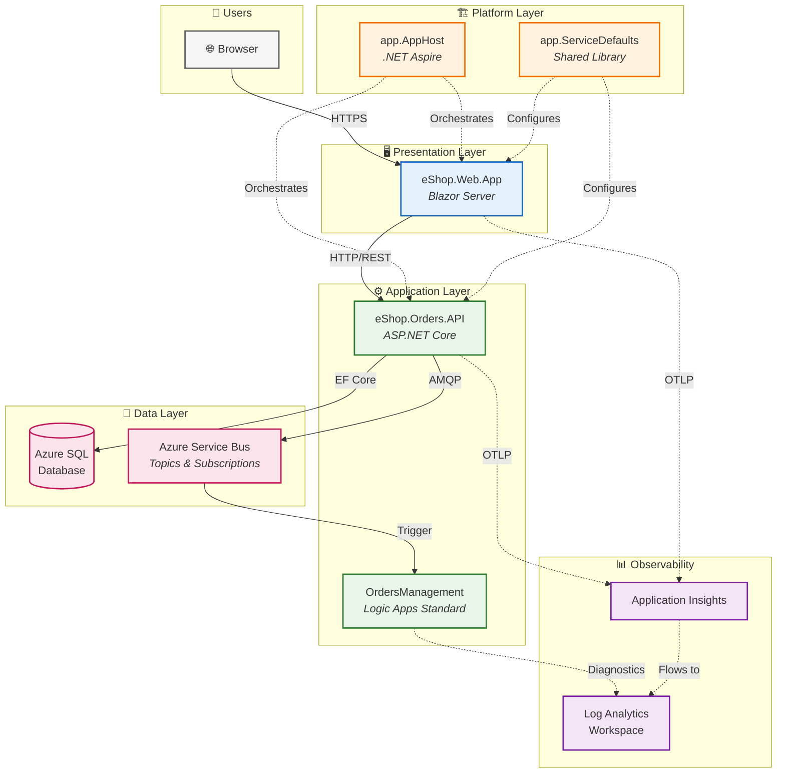

# Azure Logic Apps Monitoring Solution - Architecture Overview

← [Repository Root](../../README.md) | **Index** | [Business Architecture →](01-business-architecture.md)

---

## Executive Summary

The **Azure Logic Apps Monitoring Solution** is a cloud-native reference architecture demonstrating enterprise-grade observability patterns for distributed applications on Azure. Built around an eShop order management scenario, this solution showcases how to implement comprehensive monitoring, distributed tracing, and automated workflow processing using modern .NET technologies and Azure PaaS services.

**Key Architectural Highlights:**
- **.NET Aspire** orchestration for unified local development and cloud deployment
- **Event-driven architecture** with Azure Service Bus for decoupled, scalable processing
- **Azure Logic Apps Standard** for automated workflow orchestration triggered by domain events
- **End-to-end observability** with OpenTelemetry, Application Insights, and Azure Monitor
- **Infrastructure as Code** using Bicep with Azure Developer CLI (azd) lifecycle automation

**Target Deployment Environments:**
- **Local Development**: Containerized dependencies (SQL Server, Service Bus Emulator) via .NET Aspire
- **Azure Cloud**: Container Apps, Azure SQL, Service Bus, Logic Apps Standard

---

## High-Level Architecture Diagram



---

## Service Inventory

| Service | Type | Responsibility | Technology |
|---------|------|----------------|------------|
| **eShop.Web.App** | Web UI | Interactive order management interface | Blazor Server, Fluent UI, SignalR |
| **eShop.Orders.API** | REST API | Order CRUD, batch processing, event publishing | ASP.NET Core 10, EF Core, OpenAPI |
| **OrdersManagement** | Workflow | Automated order processing triggered by Service Bus events | Logic Apps Standard |
| **app.AppHost** | Orchestrator | Service orchestration, Azure resource wiring, local emulator configuration | .NET Aspire 9.x |
| **app.ServiceDefaults** | Library | Cross-cutting concerns: telemetry, resilience, health checks | .NET Class Library |

---

## Document Navigation

| Document | Description | Primary Audience |
|----------|-------------|------------------|
| [01-business-architecture.md](01-business-architecture.md) | Business context, capabilities, value streams | Solution Architects, Business Analysts |
| [02-data-architecture.md](02-data-architecture.md) | Data domains, flows, telemetry mapping | Data Architects, Platform Engineers |
| [03-application-architecture.md](03-application-architecture.md) | Service decomposition, APIs, integration patterns | Developers, Technical Leads |
| [04-technology-architecture.md](04-technology-architecture.md) | Azure infrastructure, platform services, IaC | Platform Engineers, DevOps |
| [05-observability-architecture.md](05-observability-architecture.md) | Distributed tracing, metrics, logging, alerting | SRE, DevOps, Developers |
| [06-security-architecture.md](06-security-architecture.md) | Identity, authentication, data protection | Security Engineers, Architects |
| [07-deployment-architecture.md](07-deployment-architecture.md) | CI/CD pipeline, azd workflow, environments | DevOps, Platform Engineers |
| [adr/README.md](adr/README.md) | Architecture Decision Records index | All Technical Audiences |

### Reading Order by Audience

| Audience | Recommended Path |
|----------|------------------|
| **Cloud Solution Architects** | README → Business → Application → Technology → Observability |
| **Platform Engineers** | README → Technology → Deployment → Observability → Data |
| **Developers** | README → Application → Data → Observability → ADRs |
| **DevOps/SRE Teams** | README → Observability → Deployment → Technology → Security |

---

## Quick Reference

### Key Azure Resources

| Resource | Purpose | SKU/Tier | Module Location |
|----------|---------|----------|-----------------|
| Azure Container Apps | Microservices hosting | Consumption | [infra/workload/services/main.bicep](../../infra/workload/services/main.bicep) |
| Azure SQL Database | Order data persistence | General Purpose | [infra/shared/data/main.bicep](../../infra/shared/data/main.bicep) |
| Azure Service Bus | Async messaging | Standard | [infra/workload/messaging/main.bicep](../../infra/workload/messaging/main.bicep) |
| Azure Logic Apps | Workflow automation | WorkflowStandard WS1 | [infra/workload/logic-app.bicep](../../infra/workload/logic-app.bicep) |
| Application Insights | APM and telemetry | Workspace-based | [infra/shared/monitoring/app-insights.bicep](../../infra/shared/monitoring/app-insights.bicep) |
| Log Analytics | Centralized logging | Standard | [infra/shared/monitoring/log-analytics-workspace.bicep](../../infra/shared/monitoring/log-analytics-workspace.bicep) |
| Container Registry | Image storage | Premium | [infra/workload/services/main.bicep](../../infra/workload/services/main.bicep) |
| Managed Identity | Passwordless auth | User-assigned | [infra/shared/identity/main.bicep](../../infra/shared/identity/main.bicep) |

### Repository Structure

```
azure-logicapps-monitoring/
├── app.AppHost/                 # .NET Aspire orchestrator
├── app.ServiceDefaults/         # Shared cross-cutting concerns
├── src/
│   ├── eShop.Orders.API/        # Orders REST API
│   └── eShop.Web.App/           # Blazor web frontend
├── workflows/
│   └── OrdersManagement/        # Logic Apps workflows
├── infra/                       # Bicep IaC templates
│   ├── main.bicep               # Entry point
│   ├── shared/                  # Identity, monitoring, data
│   └── workload/                # Container services, messaging, Logic Apps
├── hooks/                       # azd lifecycle scripts
├── docs/
│   └── architecture/            # This documentation
└── azure.yaml                   # azd configuration
```

---

## Related Documents

- [Developer Inner Loop Workflow](../hooks/README.md) - Local development and azd hooks
- [Migration Guide](../../src/eShop.Orders.API/MIGRATION_GUIDE.md) - EF Core migration documentation

---

← [Repository Root](../../README.md) | **Index** | [Business Architecture →](01-business-architecture.md)
