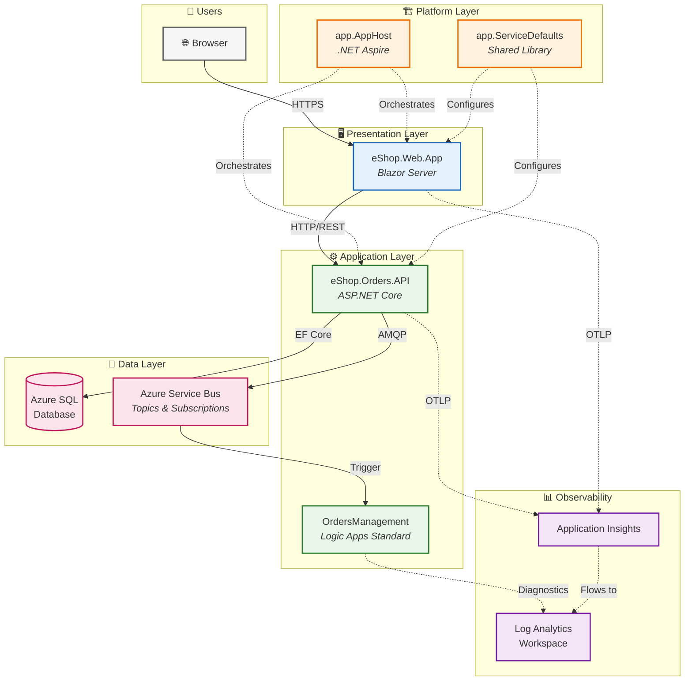

# Azure Logic Apps Monitoring Solution - Architecture Overview

← [Repository Root](../../README.md) | **Index** | [Business Architecture →](01-business-architecture.md)

---

## Executive Summary

The **Azure Logic Apps Monitoring Solution** is a cloud-native reference architecture demonstrating enterprise-grade observability patterns for distributed applications on Azure. Built around an eShop order management scenario, this solution showcases how to implement comprehensive monitoring, distributed tracing, and automated workflow processing using modern .NET technologies and Azure PaaS services.

**Key Architectural Highlights:**
- **.NET Aspire** orchestration for unified local development and cloud deployment
- **Event-driven architecture** with Azure Service Bus for decoupled, scalable processing
- **Azure Logic Apps Standard** for automated workflow orchestration triggered by domain events
- **End-to-end observability** with OpenTelemetry, Application Insights, and Azure Monitor
- **Infrastructure as Code** using Bicep with Azure Developer CLI (azd) lifecycle automation

**Target Deployment Environments:**
- **Local Development**: Containerized dependencies (SQL Server, Service Bus Emulator) via .NET Aspire
- **Azure Cloud**: Container Apps, Azure SQL, Service Bus, Logic Apps Standard

---

## High-Level Architecture Diagram



---

## Service Inventory

| Service | Type | Responsibility | Technology |
|---------|------|----------------|------------|
| **eShop.Web.App** | Web UI | Interactive order management interface | Blazor Server, Fluent UI, SignalR |
| **eShop.Orders.API** | REST API | Order CRUD, batch processing, event publishing | ASP.NET Core 10, EF Core, OpenAPI |
| **OrdersManagement** | Workflow | Automated order processing triggered by Service Bus events | Logic Apps Standard |
| **app.AppHost** | Orchestrator | Service orchestration, Azure resource wiring, local emulator configuration | .NET Aspire 9.x |
| **app.ServiceDefaults** | Library | Cross-cutting concerns: telemetry, resilience, health checks | .NET Class Library |

---

## Document Navigation

| Document | Description | Primary Audience |
|----------|-------------|------------------|
| [01-business-architecture.md](01-business-architecture.md) | Business context, capabilities, value streams | Solution Architects, Business Analysts |
| [02-data-architecture.md](02-data-architecture.md) | Data domains, flows, telemetry mapping | Data Architects, Platform Engineers |
| [03-application-architecture.md](03-application-architecture.md) | Service decomposition, APIs, integration patterns | Developers, Technical Leads |
| [04-technology-architecture.md](04-technology-architecture.md) | Azure infrastructure, platform services, IaC | Platform Engineers, DevOps |
| [05-observability-architecture.md](05-observability-architecture.md) | Distributed tracing, metrics, logging, alerting | SRE, DevOps, Developers |
| [06-security-architecture.md](06-security-architecture.md) | Identity, authentication, data protection | Security Engineers, Architects |
| [07-deployment-architecture.md](07-deployment-architecture.md) | CI/CD pipeline, azd workflow, environments | DevOps, Platform Engineers |
| [adr/README.md](adr/README.md) | Architecture Decision Records index | All Technical Audiences |

### Reading Order by Audience

| Audience | Recommended Path |
|----------|------------------|
| **Cloud Solution Architects** | README → Business → Application → Technology → Observability |
| **Platform Engineers** | README → Technology → Deployment → Observability → Data |
| **Developers** | README → Application → Data → Observability → ADRs |
| **DevOps/SRE Teams** | README → Observability → Deployment → Technology → Security |

---

## Quick Reference

### Key Azure Resources

| Resource | Purpose | SKU/Tier | Module Location |
|----------|---------|----------|-----------------|
| Azure Container Apps | Microservices hosting | Consumption | [infra/workload/services/main.bicep](../../infra/workload/services/main.bicep) |
| Azure SQL Database | Order data persistence | General Purpose | [infra/shared/data/main.bicep](../../infra/shared/data/main.bicep) |
| Azure Service Bus | Async messaging | Standard | [infra/workload/messaging/main.bicep](../../infra/workload/messaging/main.bicep) |
| Azure Logic Apps | Workflow automation | WorkflowStandard WS1 | [infra/workload/logic-app.bicep](../../infra/workload/logic-app.bicep) |
| Application Insights | APM and telemetry | Workspace-based | [infra/shared/monitoring/app-insights.bicep](../../infra/shared/monitoring/app-insights.bicep) |
| Log Analytics | Centralized logging | Standard | [infra/shared/monitoring/log-analytics-workspace.bicep](../../infra/shared/monitoring/log-analytics-workspace.bicep) |
| Container Registry | Image storage | Premium | [infra/workload/services/main.bicep](../../infra/workload/services/main.bicep) |
| Managed Identity | Passwordless auth | User-assigned | [infra/shared/identity/main.bicep](../../infra/shared/identity/main.bicep) |

### Repository Structure

```
azure-logicapps-monitoring/
│
│   ══════════════════════════════════════════════════════════════════════════
│   GITHUB CONFIGURATION
│   CI/CD workflows and repository settings
│   ══════════════════════════════════════════════════════════════════════════
│
├── 📁 .github/                          # GitHub configuration
│   └── workflows/                       # CI/CD pipeline definitions (GitHub Actions)
│
│   ══════════════════════════════════════════════════════════════════════════
│   .NET ASPIRE PLATFORM LAYER
│   Orchestration and shared cross-cutting concerns for all services
│   ══════════════════════════════════════════════════════════════════════════
│
├── 📁 app.AppHost/                      # .NET Aspire Orchestrator
│   │                                    # Defines service dependencies, resource wiring,
│   │                                    # and local development environment setup
│   ├── AppHost.cs                       # Service orchestration & Azure resource wiring
│   ├── app.AppHost.csproj               # Project file with Aspire SDK references
│   ├── appsettings.json                 # Base configuration (connection strings, etc.)
│   ├── appsettings.Development.json     # Local development overrides (emulators, etc.)
│   └── Properties/
│       └── launchSettings.json          # Debug launch profiles for VS/VS Code
│
├── 📁 app.ServiceDefaults/              # Shared Cross-Cutting Concerns Library
│   │                                    # Reusable configurations applied to all services
│   ├── app.ServiceDefaults.csproj       # Class library project file
│   ├── Extensions.cs                    # OpenTelemetry setup, health checks, HTTP resilience
│   └── CommonTypes.cs                   # Shared DTOs, enums, and type definitions
│
│   ══════════════════════════════════════════════════════════════════════════
│   APPLICATION SOURCE CODE
│   Microservices implementing business logic and user interfaces
│   ══════════════════════════════════════════════════════════════════════════
│
├── 📁 src/                              # Application Source Code
│   │
│   ├── 📁 eShop.Orders.API/             # Orders REST API Service
│   │   │                                # ASP.NET Core Web API handling order operations
│   │   │                                # Publishes events to Service Bus for async processing
│   │   │
│   │   ├── Program.cs                   # Application entry point, DI container setup
│   │   ├── eShop.Orders.API.csproj      # Project file with NuGet dependencies
│   │   ├── eShop.Orders.API.http        # HTTP request samples for REST Client testing
│   │   ├── MIGRATION_GUIDE.md           # EF Core migration instructions & best practices
│   │   ├── Setup-Database.ps1           # Database initialization & seeding script
│   │   ├── appsettings.json             # Base configuration (logging, features)
│   │   ├── appsettings.Development.json # Development overrides (local SQL, emulators)
│   │   │
│   │   ├── 📁 Controllers/              # API Endpoints (HTTP request handlers)
│   │   │   ├── OrdersController.cs      # Order CRUD: GET, POST, PUT, DELETE operations
│   │   │   └── WeatherForecastController.cs # Sample controller for health/demo purposes
│   │   │
│   │   ├── 📁 Services/                 # Business Logic Layer (use case implementations)
│   │   │   ├── OrderService.cs          # Order processing, validation, event publishing
│   │   │   └── OrdersWrapper.cs         # Service Bus message envelope/wrapper
│   │   │
│   │   ├── 📁 Repositories/             # Data Access Layer (persistence abstractions)
│   │   │   └── OrderRepository.cs       # EF Core implementation for order CRUD
│   │   │
│   │   ├── 📁 Interfaces/               # Abstractions (contracts for DI)
│   │   │   ├── IOrderRepository.cs      # Repository pattern contract
│   │   │   ├── IOrderService.cs         # Business service contract
│   │   │   └── IOrdersMessageHandler.cs # Message handler contract for Service Bus
│   │   │
│   │   ├── 📁 Handlers/                 # Message Handlers (async event processing)
│   │   │   ├── OrdersMessageHandler.cs  # Processes messages from Service Bus topics
│   │   │   ├── NoOpOrdersMessageHandler.cs # No-op stub for local dev without Service Bus
│   │   │   └── OrderMessageWithMetadata.cs # Message envelope with correlation/trace IDs
│   │   │
│   │   ├── 📁 HealthChecks/             # Health Check Implementations (readiness/liveness)
│   │   │   ├── DbContextHealthCheck.cs  # Validates SQL database connectivity
│   │   │   └── ServiceBusHealthCheck.cs # Validates Service Bus connectivity
│   │   │
│   │   ├── 📁 Migrations/               # EF Core Database Migrations (schema versioning)
│   │   ├── 📁 data/                     # Seed data and sample JSON payloads
│   │   └── 📁 Properties/               # Assembly metadata and launch settings
│   │
│   └── 📁 eShop.Web.App/                # Blazor Web Frontend
│       │                                # Server-side Blazor app with Fluent UI components
│       │                                # Communicates with Orders API via HTTP
│       │
│       ├── Program.cs                   # Application entry point, service registration
│       ├── eShop.Web.App.csproj         # Project file with Blazor SDK references
│       ├── appsettings.json             # Base configuration (API endpoints)
│       ├── appsettings.Development.json # Development overrides (local API URLs)
│       │
│       ├── 📁 Components/               # Blazor Components (UI building blocks)
│       │   ├── App.razor                # Root component, app shell
│       │   ├── Routes.razor             # Client-side routing configuration
│       │   ├── _Imports.razor           # Global using directives for all components
│       │   │
│       │   ├── 📁 Layout/               # Layout Components (page structure)
│       │   │   ├── MainLayout.razor     # Main page layout with header/sidebar
│       │   │   ├── MainLayout.razor.css # Scoped CSS for main layout
│       │   │   ├── NavMenu.razor        # Side navigation menu component
│       │   │   └── NavMenu.razor.css    # Scoped CSS for navigation
│       │   │
│       │   ├── 📁 Pages/                # Page Components (routable views)
│       │   │   ├── Home.razor           # Dashboard with order statistics
│       │   │   ├── ListAllOrders.razor  # Paginated order list with filtering
│       │   │   ├── PlaceOrder.razor     # Single order creation form
│       │   │   ├── PlaceOrdersBatch.razor # Bulk order creation for testing
│       │   │   ├── ViewOrder.razor      # Order details and status view
│       │   │   ├── WeatherForecasts.razor # Demo page for API connectivity test
│       │   │   └── Error.razor          # Error boundary and error display page
│       │   │
│       │   ├── 📁 Services/             # Client-side services (API clients, state)
│       │   └── 📁 Shared/               # Shared UI components (buttons, modals, etc.)
│       │
│       ├── 📁 wwwroot/                  # Static assets served directly (CSS, JS, images)
│       └── 📁 Properties/               # Assembly metadata and launch settings
│
│   ══════════════════════════════════════════════════════════════════════════
│   LOGIC APPS WORKFLOWS
│   Serverless workflow automation triggered by Service Bus events
│   ══════════════════════════════════════════════════════════════════════════
│
├── 📁 workflows/                        # Logic Apps Workflows
│   └── 📁 OrdersManagement/             # Order Processing Workflow Project
│       │                                # Automates order fulfillment and notifications
│       │
│       ├── OrdersManagement.code-workspace # VS Code workspace for Logic Apps extension
│       └── 📁 OrdersManagementLogicApp/ # Logic App Standard Project
│           │                            # Deployed to Azure Logic Apps Standard (WS1)
│           │
│           ├── host.json                # Logic App host configuration (runtime settings)
│           ├── .funcignore              # Files to exclude from deployment package
│           └── 📁 ProcessingOrdersPlaced/ # Workflow Definition
│               └── workflow.json        # Visual designer JSON (triggers, actions, conditions)
│
│   ══════════════════════════════════════════════════════════════════════════
│   INFRASTRUCTURE AS CODE (Bicep)
│   Azure resource definitions using modular Bicep templates
│   ══════════════════════════════════════════════════════════════════════════
│
├── 📁 infra/                            # Infrastructure as Code (Bicep)
│   │                                    # Modular templates for Azure resource provisioning
│   │
│   ├── main.bicep                       # 🎯 ENTRY POINT - Orchestrates all modules
│   │                                    # Called by `azd provision` command
│   ├── main.parameters.json             # Environment-specific parameter values
│   ├── types.bicep                      # Shared user-defined types for consistency
│   │
│   ├── 📁 data/                         # Sample/Seed Data for Testing
│   │   └── ordersBatch.json             # Sample batch of orders for load testing
│   │
│   ├── 📁 shared/                       # Shared Infrastructure Resources
│   │   │                                # Resources used by multiple workloads
│   │   │
│   │   ├── main.bicep                   # Orchestrator for all shared resources
│   │   │
│   │   ├── 📁 identity/                 # Identity Management
│   │   │   └── main.bicep               # User-assigned managed identity for workloads
│   │   │                                # Enables passwordless auth to Azure services
│   │   │
│   │   ├── 📁 monitoring/               # Observability Infrastructure
│   │   │   ├── main.bicep               # Orchestrator for monitoring resources
│   │   │   ├── log-analytics-workspace.bicep # Central log aggregation workspace
│   │   │   ├── app-insights.bicep       # APM: traces, metrics, dependencies
│   │   │   └── azure-monitor-health-model.bicep # Alert rules and health model
│   │   │
│   │   └── 📁 data/                     # Data Infrastructure
│   │       └── main.bicep               # Azure SQL Database (serverless tier)
│   │                                    # Stores order and customer data
│   │
│   └── 📁 workload/                     # Workload-Specific Resources
│       │                                # Resources specific to this application
│       │
│       ├── main.bicep                   # Orchestrator for workload resources
│       ├── logic-app.bicep              # Logic Apps Standard (WorkflowStandard WS1)
│       │                                # Hosts automated workflow processing
│       │
│       ├── 📁 messaging/                # Messaging Infrastructure
│       │   └── main.bicep               # Service Bus namespace with topics/subscriptions
│       │                                # Topics: orders-placed, orders-processed
│       │
│       └── 📁 services/                 # Container Services
│           └── main.bicep               # Container Apps Environment + Container Registry
│                                        # Hosts API and Web App containers
│
│   ══════════════════════════════════════════════════════════════════════════
│   AZURE DEVELOPER CLI (azd) LIFECYCLE HOOKS
│   Scripts executed during azd provision/deploy lifecycle
│   ══════════════════════════════════════════════════════════════════════════
│
├── 📁 hooks/                            # Azure Developer CLI Lifecycle Scripts
│   │                                    # Executed automatically by azd at specific stages
│   │
│   │   # ─── Pre-Provisioning (runs before `azd provision`) ───
│   ├── preprovision.ps1                 # Validates prerequisites, installs tools (PowerShell)
│   ├── preprovision.sh                  # Validates prerequisites, installs tools (Bash)
│   │
│   │   # ─── Post-Provisioning (runs after `azd provision`) ───
│   ├── postprovision.ps1                # Configures Azure resources, seeds data (PowerShell)
│   ├── postprovision.sh                 # Configures Azure resources, seeds data (Bash)
│   │
│   │   # ─── Utility Scripts ───
│   ├── clean-secrets.ps1                # Removes .NET user secrets for clean state (PowerShell)
│   ├── clean-secrets.sh                 # Removes .NET user secrets for clean state (Bash)
│   ├── check-dev-workstation.ps1        # Validates local dev environment setup (PowerShell)
│   ├── check-dev-workstation.sh         # Validates local dev environment setup (Bash)
│   ├── configure-logic-app.ps1          # Deploys Logic App workflows and connections
│   ├── sql-managed-identity-config.ps1  # Grants managed identity SQL access (PowerShell)
│   ├── sql-managed-identity-config.sh   # Grants managed identity SQL access (Bash)
│   ├── Generate-Orders.ps1              # Creates test orders via API (PowerShell)
│   └── Generate-Orders.sh               # Creates test orders via API (Bash)
│
│   ══════════════════════════════════════════════════════════════════════════
│   DOCUMENTATION
│   Architecture documentation, ADRs, and developer guides
│   ══════════════════════════════════════════════════════════════════════════
│
├── 📁 docs/                             # Documentation
│   │
│   ├── 📁 architecture/                 # Architecture Documentation (TOGAF-inspired)
│   │   │                                # Comprehensive technical documentation
│   │   │
│   │   ├── README.md                    # 📍 YOU ARE HERE - Architecture overview & index
│   │   ├── 01-business-architecture.md  # Business context, capabilities, value streams
│   │   ├── 02-data-architecture.md      # Data domains, entities, flows, telemetry
│   │   ├── 03-application-architecture.md # Service decomposition, APIs, integration
│   │   ├── 04-technology-architecture.md # Azure services, infrastructure, IaC patterns
│   │   ├── 05-observability-architecture.md # Distributed tracing, metrics, logging, alerts
│   │   ├── 06-security-architecture.md  # Identity, authentication, data protection
│   │   ├── 07-deployment-architecture.md # CI/CD pipelines, environments, azd workflow
│   │   │
│   │   └── 📁 adr/                      # Architecture Decision Records (ADRs)
│   │       │                            # Documented decisions with context & rationale
│   │       ├── README.md                # ADR index and template guide
│   │       ├── ADR-001-aspire-orchestration.md # Why .NET Aspire for orchestration
│   │       ├── ADR-002-service-bus-messaging.md # Why Service Bus over alternatives
│   │       └── ADR-003-observability-strategy.md # OpenTelemetry + App Insights approach
│   │
│   └── 📁 hooks/                        # Hook Script Documentation
│       │                                # Detailed guides for each lifecycle script
│       ├── README.md                    # Hooks overview and execution order
│       ├── check-dev-workstation.md     # Prerequisites validation documentation
│       ├── clean-secrets.md             # User secrets cleanup guide
│       ├── Generate-Orders.md           # Test data generation instructions
│       ├── postprovision.md             # Post-deployment configuration guide
│       └── VALIDATION-WORKFLOW.md       # End-to-end validation workflow
│
│   ══════════════════════════════════════════════════════════════════════════
│   ROOT CONFIGURATION FILES
│   Solution and repository-level configuration
│   ══════════════════════════════════════════════════════════════════════════
│
├── 📄 azure.yaml                        # 🎯 Azure Developer CLI (azd) configuration
│                                        # Defines services, hooks, and Azure mappings
├── 📄 app.sln                           # Visual Studio/Rider solution file
│                                        # Groups all .NET projects for IDE support
├── 📄 README.md                         # Repository documentation (getting started)
├── 📄 CONTRIBUTING.md                   # How to contribute (PRs, issues, code style)
├── 📄 CODE_OF_CONDUCT.md                # Community behavior expectations
├── 📄 LICENSE                           # MIT License file
├── 📄 LICENSE.md                        # License details and attribution
├── 📄 SECURITY.md                       # Security vulnerability reporting policy
└── 📄 .gitignore                        # Git ignore patterns (bin/, obj/, .env, etc.)
```

#### Directory Legend

| Icon | Meaning |
|------|---------|
| 📁 | Directory/folder |
| 📄 | File |
| 🎯 | Key entry point (start here) |
| 📍 | Current location in docs |

#### Section Separators

The `══════` lines in the structure above denote major architectural layers:

| Section | Purpose |
|---------|---------|
| **GitHub Configuration** | CI/CD and repository automation |
| **.NET Aspire Platform Layer** | Service orchestration and shared concerns |
| **Application Source Code** | Business logic and user interfaces |
| **Logic Apps Workflows** | Serverless event-driven automation |
| **Infrastructure as Code** | Azure resource definitions (Bicep) |
| **azd Lifecycle Hooks** | Deployment automation scripts |
| **Documentation** | Architecture docs and developer guides |
| **Root Configuration** | Solution and repository settings |

---

## Related Documents

- [Developer Inner Loop Workflow](../hooks/README.md) - Local development and azd hooks
- [Migration Guide](../../src/eShop.Orders.API/MIGRATION_GUIDE.md) - EF Core migration documentation

---

← [Repository Root](../../README.md) | **Index** | [Business Architecture →](01-business-architecture.md)
