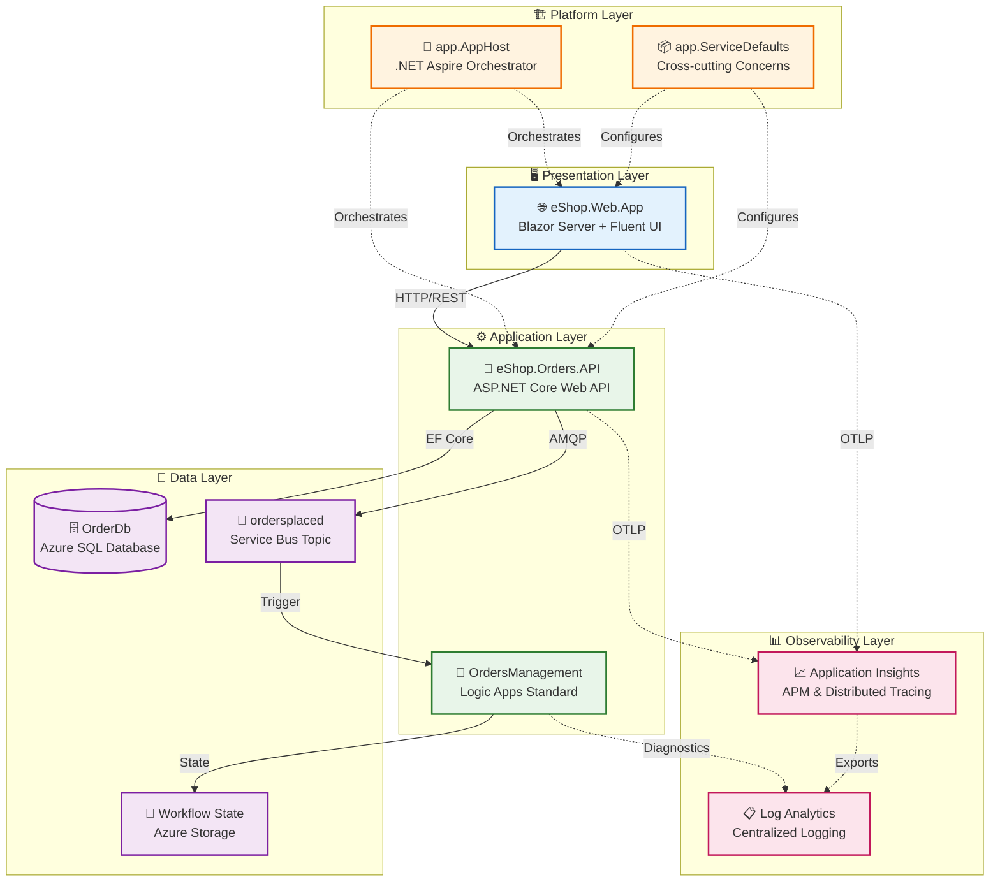

# Azure Logic Apps Monitoring - Architecture Overview

← [Repository Root](../../README.md) | **Index** | [Business Architecture →](01-business-architecture.md)

---

## Executive Summary

The **Azure Logic Apps Monitoring Solution** is a cloud-native distributed application that demonstrates enterprise-grade observability patterns for Azure Logic Apps Standard workflows. Built on .NET Aspire orchestration, it provides a complete reference implementation for monitoring event-driven applications using Azure's native observability stack.

The solution uses an **eShop order management system** as the business scenario, showcasing how orders flow from a Blazor web frontend through an ASP.NET Core API, into Azure SQL Database, then published to Azure Service Bus for asynchronous processing by Logic Apps workflows. Every component is instrumented with OpenTelemetry for end-to-end distributed tracing.

**Key Architectural Highlights:**
- **Event-Driven Architecture** using Azure Service Bus pub/sub patterns
- **Distributed Tracing** with W3C Trace Context propagation across all service boundaries
- **Infrastructure as Code** using modular Bicep templates with Azure Developer CLI
- **Managed Identity Authentication** eliminating secrets for all Azure service connections
- **Local Development Parity** via .NET Aspire emulators and containers

---

## High-Level Architecture Diagram



---

## Service Inventory

| Service | Type | Responsibility | Technology | Port |
|---------|------|----------------|------------|------|
| **eShop.Web.App** | Web UI | Interactive order management dashboard | Blazor Server, Fluent UI, SignalR | 5002 |
| **eShop.Orders.API** | REST API | Order CRUD, batch processing, event publishing | ASP.NET Core 10, EF Core, OpenTelemetry | 5001 |
| **OrdersManagement** | Workflow | Service Bus-triggered order processing automation | Logic Apps Standard, Stateful Workflows | N/A |
| **app.AppHost** | Orchestrator | Service orchestration, dependency wiring | .NET Aspire 9.x | N/A |
| **app.ServiceDefaults** | Library | Telemetry, resilience, health checks | OpenTelemetry, Polly, Azure SDK | N/A |

---

## Document Navigation

### TOGAF BDAT Layer Documents

| Document | Description | Primary Audience |
|----------|-------------|------------------|
| [01-business-architecture.md](01-business-architecture.md) | Business capabilities, value streams, stakeholder analysis | Solution Architects, Business Analysts |
| [02-data-architecture.md](02-data-architecture.md) | Data domains, stores, flows, telemetry mapping | Data Architects, Platform Engineers |
| [03-application-architecture.md](03-application-architecture.md) | Service catalog, APIs, communication patterns | Developers, Technical Leads |
| [04-technology-architecture.md](04-technology-architecture.md) | Azure resources, infrastructure topology | Platform Engineers, DevOps |
| [05-observability-architecture.md](05-observability-architecture.md) | Distributed tracing, metrics, alerting | SRE, Operations Teams |
| [06-security-architecture.md](06-security-architecture.md) | Managed identity, RBAC, data protection | Security Engineers, Architects |
| [07-deployment-architecture.md](07-deployment-architecture.md) | CI/CD, azd workflows, environment strategy | DevOps, Platform Engineers |

### Architecture Decision Records

| ADR | Decision | Status |
|-----|----------|--------|
| [ADR-001](adr/ADR-001-aspire-orchestration.md) | .NET Aspire for service orchestration | Accepted |
| [ADR-002](adr/ADR-002-service-bus-messaging.md) | Azure Service Bus for async messaging | Accepted |
| [ADR-003](adr/ADR-003-observability-strategy.md) | OpenTelemetry + Application Insights | Accepted |

### Reading Order by Audience

| Audience | Recommended Path |
|----------|------------------|
| **Cloud Architects** | README → Business → Technology → Observability → ADRs |
| **Platform Engineers** | README → Technology → Deployment → Observability |
| **Developers** | README → Application → Data → Observability |
| **DevOps/SRE** | README → Deployment → Observability → Technology |

---

## Quick Reference

### Key Azure Resources

| Resource | Type | Purpose |
|----------|------|---------|
| `rg-orders-{env}-{region}` | Resource Group | Contains all solution resources |
| `{name}-{suffix}-appinsights` | Application Insights | APM and distributed tracing |
| `{name}-{suffix}-loganalytics` | Log Analytics Workspace | Centralized log aggregation |
| `{name}-{suffix}-sql` | Azure SQL Server | Order data persistence |
| `{name}sb{suffix}` | Service Bus Namespace | Message brokering |
| `{name}-{suffix}-acr` | Container Registry | Container image storage |
| `{name}-{suffix}-cae` | Container Apps Environment | Serverless container hosting |
| `{name}-{suffix}-logicapp` | Logic Apps Standard | Workflow automation |
| `{name}-{suffix}-mi` | Managed Identity | Passwordless authentication |

### Repository Structure

```
azure-logicapps-monitoring/
├── app.AppHost/                    # .NET Aspire orchestration
├── app.ServiceDefaults/            # Shared cross-cutting concerns
├── src/
│   ├── eShop.Orders.API/          # Order management API
│   └── eShop.Web.App/             # Blazor web frontend
├── workflows/
│   └── OrdersManagement/          # Logic Apps workflows
├── infra/
│   ├── main.bicep                 # Root deployment template
│   ├── shared/                    # Identity, monitoring, data modules
│   └── workload/                  # Messaging, services, Logic Apps
├── hooks/                         # azd lifecycle scripts
└── docs/
    └── architecture/              # This documentation
```

---

## Related Documents

- [Business Architecture](01-business-architecture.md) - Start here for business context
- [ADR Index](adr/README.md) - Key architectural decisions

---

> 💡 **Tip:** Use the navigation links at the top of each document to move between BDAT layers sequentially.
