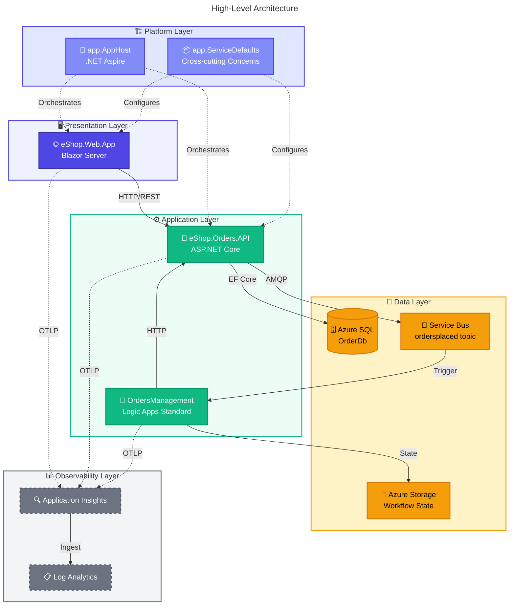

# 🏗️ Architecture Overview

> [!NOTE]
> **Target Audience:** Cloud Solution Architects, Platform Engineers, Developers  
> **Reading Time:** ~10 minutes

<details>
<summary>📖 <strong>Navigation</strong></summary>

| Previous                           |      Index       |                                                   Next |
| :--------------------------------- | :--------------: | -----------------------------------------------------: |
| [Documentation Home](../README.md) | **You are here** | [Business Architecture →](01-business-architecture.md) |

</details>

---

## 📑 Table of Contents

- [📋 Executive Summary](#-executive-summary)
- [🗺️ High-Level Architecture](#️-high-level-architecture)
- [📦 Service Inventory](#-service-inventory)
- [🧭 Document Navigation](#-document-navigation)
- [⚡ Quick Reference](#-quick-reference)
- [🔗 Related Documentation](#-related-documentation)

---

## 📋 Executive Summary

The **Azure Logic Apps Monitoring Solution** is a cloud-native reference architecture demonstrating enterprise-grade observability patterns for distributed applications on Azure. Built around an eShop order management scenario, this solution showcases how to implement end-to-end monitoring, distributed tracing, and event-driven automation using Azure's native services.

**Key Architectural Highlights:**

- **.NET Aspire orchestration** for seamless local development and Azure deployment
- **Event-driven architecture** with Azure Service Bus for asynchronous order processing
- **Logic Apps Standard** workflows for automated order validation and routing
- **Comprehensive observability** through Application Insights with W3C Trace Context correlation

---

<div align="right"><a href="#-table-of-contents">⬆️ Back to top</a></div>

## 🗺️ High-Level Architecture



---

<div align="right"><a href="#-table-of-contents">⬆️ Back to top</a></div>

## 📦 Service Inventory

| Service                 | Type         | Responsibility                                 | Technology               |
| ----------------------- | ------------ | ---------------------------------------------- | ------------------------ |
| **eShop.Web.App**       | Frontend     | Order management UI, real-time updates         | Blazor Server, Fluent UI |
| **eShop.Orders.API**    | Backend API  | Order CRUD, batch processing, event publishing | ASP.NET Core, EF Core    |
| **OrdersManagement**    | Workflow     | Order validation, routing, blob storage        | Logic Apps Standard      |
| **app.AppHost**         | Orchestrator | Service composition, Azure resource wiring     | .NET Aspire              |
| **app.ServiceDefaults** | Library      | Telemetry, resilience, health checks           | OpenTelemetry, Polly     |

---

<div align="right"><a href="#-table-of-contents">⬆️ Back to top</a></div>

## 🧭 Document Navigation

This architecture documentation follows the **TOGAF BDAT framework**, organized into modular, cross-referenced documents:

### 📚 BDAT Layer Documents

| Document                                                            | Description                               | Primary Audience            |
| ------------------------------------------------------------------- | ----------------------------------------- | --------------------------- |
| [01 - Business Architecture](01-business-architecture.md)           | Capabilities, value streams, stakeholders | Architects, Product Owners  |
| [02 - Data Architecture](02-data-architecture.md)                   | Data stores, flows, telemetry mapping     | Data Architects, Developers |
| [03 - Application Architecture](03-application-architecture.md)     | Services, APIs, integration patterns      | Developers, Tech Leads      |
| [04 - Technology Architecture](04-technology-architecture.md)       | Azure services, infrastructure, IaC       | Platform Engineers, SREs    |
| [05 - Observability Architecture](05-observability-architecture.md) | Tracing, metrics, alerting                | SREs, DevOps Engineers      |
| [06 - Security Architecture](06-security-architecture.md)           | Identity, secrets, network security       | Security Engineers          |
| [07 - Deployment Architecture](07-deployment-architecture.md)       | CI/CD, environments, IaC                  | DevOps Engineers            |

### 📝 Architecture Decision Records

| ADR                                              | Title                                   | Status   |
| ------------------------------------------------ | --------------------------------------- | -------- |
| [ADR-001](adr/ADR-001-aspire-orchestration.md)   | .NET Aspire for Service Orchestration   | Accepted |
| [ADR-002](adr/ADR-002-service-bus-messaging.md)  | Azure Service Bus for Async Messaging   | Accepted |
| [ADR-003](adr/ADR-003-observability-strategy.md) | OpenTelemetry with Application Insights | Accepted |

### 👥 Reading Order by Audience

| Audience                      | Recommended Path             |
| ----------------------------- | ---------------------------- |
| **Cloud Solution Architects** | README → 01 → 04 → 05 → ADRs |
| **Platform Engineers**        | README → 04 → 07 → 06        |
| **Developers**                | README → 03 → 02 → 05        |
| **DevOps/SRE Teams**          | README → 07 → 05 → 04        |

---

<div align="right"><a href="#-table-of-contents">⬆️ Back to top</a></div>

## ⚡ Quick Reference

> [!TIP]
> Use the tables below for quick reference when navigating the Azure portal or reviewing infrastructure code.

### ☁️ Key Azure Resources

| Resource             | Purpose                   | Tier          |
| -------------------- | ------------------------- | ------------- |
| Azure Container Apps | Hosts API and Web App     | Consumption   |
| Azure SQL Database   | Order data persistence    | Standard S1   |
| Azure Service Bus    | Event messaging           | Standard      |
| Logic Apps Standard  | Workflow automation       | WS1           |
| Application Insights | Distributed tracing & APM | Standard      |
| Log Analytics        | Centralized logging       | Pay-as-you-go |

### 📁 Repository Structure

```text
Azure-LogicApps-Monitoring/
├── app.AppHost/              # .NET Aspire orchestration
├── app.ServiceDefaults/      # Shared cross-cutting concerns
├── src/
│   ├── eShop.Orders.API/     # REST API for order management
│   ├── eShop.Web.App/        # Blazor Server frontend
│   └── tests/                # Unit and integration tests
├── workflows/
│   └── OrdersManagement/     # Logic Apps Standard workflows
├── infra/                    # Bicep IaC templates
│   ├── shared/               # Shared infrastructure modules
│   └── workload/             # Workload-specific resources
├── hooks/                    # azd lifecycle scripts
├── docs/
│   ├── architecture/         # This documentation
│   ├── devops/               # CI/CD documentation
│   └── hooks/                # Hook script guides
└── .github/workflows/        # GitHub Actions CI/CD
```

---

<div align="right"><a href="#-table-of-contents">⬆️ Back to top</a></div>

## 🔗 Related Documentation

- [DevOps Documentation](../devops/README.md) - CI/CD pipeline details
- [Hook Scripts Guide](../hooks/README.md) - Automation scripts documentation
- [Azure Developer CLI](https://learn.microsoft.com/azure/developer/azure-developer-cli/) - Official azd documentation

---

<div align="center">

| Previous                           |           Index           |                                                   Next |
| :--------------------------------- | :-----------------------: | -----------------------------------------------------: |
| [Documentation Home](../README.md) | **Architecture Overview** | [Business Architecture →](01-business-architecture.md) |

</div>

---

_Last Updated: January 2026_
