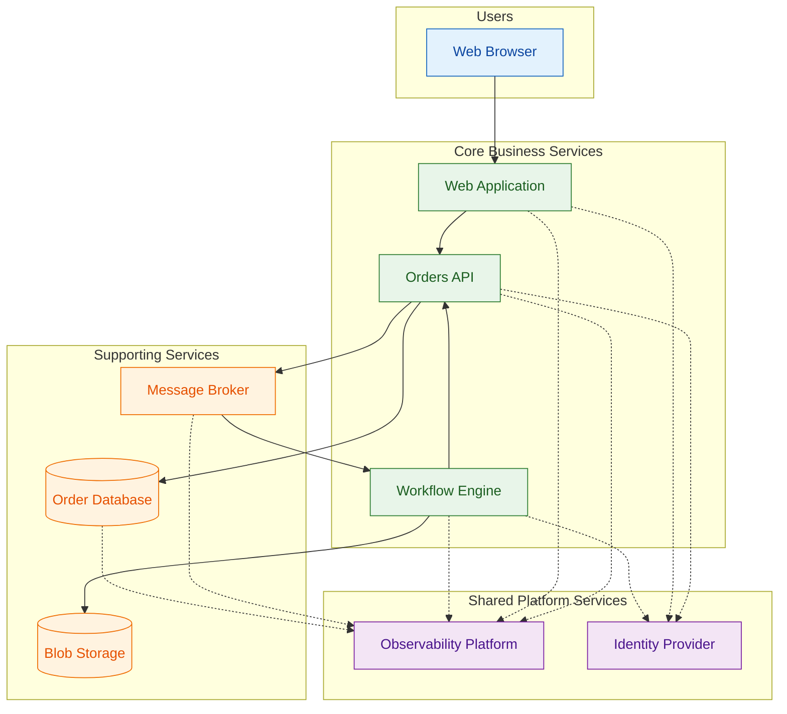

# Architecture Overview

## Executive Summary

The Azure Logic Apps Monitoring Solution provides a reference architecture for implementing enterprise-grade observability in cloud-native distributed systems. The solution demonstrates end-to-end monitoring patterns across microservices, event-driven messaging, and workflow automation using an eShop order management business scenario.

**Primary Business Value:**

- Reduced mean time to resolution through correlated distributed tracing
- Operational visibility across service boundaries with unified telemetry
- Zero-secrets architecture enabling secure, auditable deployments

**Key Architectural Decisions:**

1. **Event-Driven Decoupling** — Service Bus topics separate order capture from workflow processing, enabling independent scaling and fault isolation
2. **Unified Observability** — OpenTelemetry instrumentation with Azure Monitor provides correlated traces, metrics, and logs across all components
3. **Managed Identity Security** — User-assigned managed identity eliminates credential management for all Azure service authentication
4. **.NET Aspire Orchestration** — Declarative service composition simplifies both local development and cloud deployment
5. **Modular Infrastructure** — Bicep templates organized by responsibility (shared, workload) enable selective deployment and reuse

**Target Deployment:** Azure public cloud, single-region deployment with multi-region capability through Azure Service Bus and Container Apps.

---

## High-Level Architecture



---

## Service Inventory

| Service                | Type            | Responsibility                                         | Technology                 |
| ---------------------- | --------------- | ------------------------------------------------------ | -------------------------- |
| Web Application        | Frontend        | Order entry, status viewing, batch operations          | Blazor Server, Fluent UI   |
| Orders API             | Backend Service | Order lifecycle management, validation, persistence    | ASP.NET Core Web API       |
| Workflow Engine        | Integration     | Asynchronous order processing, status archival         | Logic Apps Standard        |
| Message Broker         | Messaging       | Event distribution, guaranteed delivery                | Topic/Subscription pattern |
| Order Database         | Data Store      | Order and product persistence, transactional integrity | Relational database        |
| Blob Storage           | Data Store      | Processed order archival, audit trail                  | Object storage             |
| Observability Platform | Platform        | Telemetry collection, distributed tracing, alerting    | Log aggregation, APM       |
| Identity Provider      | Platform        | Authentication, authorization, credential management   | Managed identity           |

---

## Document Navigation

### BDAT Layer Documents

| Layer       | Document                                                   | Description                                       |
| ----------- | ---------------------------------------------------------- | ------------------------------------------------- |
| Business    | [01-business-architecture.md](01-business-architecture.md) | Capabilities, value streams, stakeholder concerns |
| Data        | [02-data-architecture.md](02-data-architecture.md)         | Data domains, flows, telemetry mapping            |
| Application | 03-application-architecture.md                             | Service boundaries, integration patterns          |
| Technology  | 04-technology-architecture.md                              | Infrastructure components, deployment topology    |

### Recommended Reading Order

| Audience       | Recommended Path                                    |
| -------------- | --------------------------------------------------- |
| **Executives** | README → Business Architecture                      |
| **Architects** | README → Business → Data → Application → Technology |
| **Engineers**  | README → Application → Technology → Data            |

---

## Quick Reference

### Platform Resources

| Resource                   | Purpose                                | Module             |
| -------------------------- | -------------------------------------- | ------------------ |
| Container Apps Environment | Microservice hosting with auto-scaling | workload/services  |
| Container Registry         | Container image storage                | workload/services  |
| Service Bus Namespace      | Message brokering with topics          | workload/messaging |
| Logic Apps Standard        | Workflow automation engine             | workload/logic-app |
| SQL Database               | Order data persistence                 | shared/data        |
| Storage Account            | Workflow state, processed orders       | shared/data        |
| Application Insights       | APM, distributed tracing               | shared/monitoring  |
| Log Analytics Workspace    | Centralized log aggregation            | shared/monitoring  |
| Managed Identity           | Service authentication                 | shared/identity    |

### Repository Structure

```
├── app.AppHost/           # .NET Aspire orchestration
├── app.ServiceDefaults/   # Cross-cutting concerns (telemetry, resilience)
├── src/
│   ├── eShop.Orders.API/  # Order management REST API
│   └── eShop.Web.App/     # Blazor Server frontend
├── workflows/
│   └── OrdersManagement/  # Logic Apps Standard workflows
├── infra/
│   ├── shared/            # Identity, monitoring, data infrastructure
│   └── workload/          # Messaging, services, Logic Apps
├── hooks/                 # azd lifecycle automation scripts
└── docs/                  # Architecture documentation
```

| Folder                       | Contents                                                                    |
| ---------------------------- | --------------------------------------------------------------------------- |
| `app.AppHost`                | Service composition, Azure resource wiring, local emulator configuration    |
| `app.ServiceDefaults`        | OpenTelemetry setup, health checks, HTTP resilience policies, shared types  |
| `src/eShop.Orders.API`       | Controllers, services, repositories, EF Core migrations, health checks      |
| `src/eShop.Web.App`          | Razor components, API client service, Fluent UI pages                       |
| `workflows/OrdersManagement` | Workflow definitions, connections, parameters                               |
| `infra/shared`               | Managed identity, Log Analytics, Application Insights, SQL Server, storage  |
| `infra/workload`             | Container Apps, Container Registry, Service Bus, Logic Apps                 |
| `hooks`                      | Pre/post provisioning, deployment, secrets management, test data generation |
