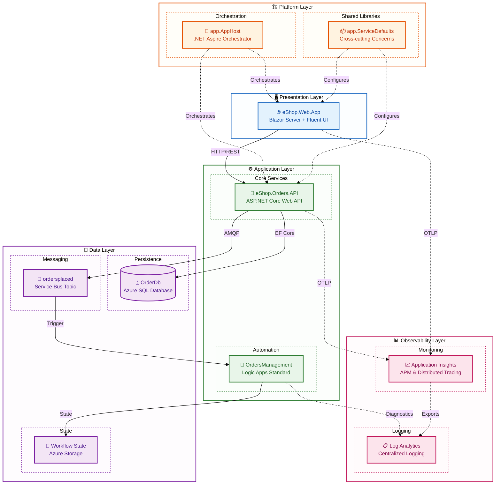

# Azure Logic Apps Monitoring - Architecture Overview

← [Repository Root](../../README.md) | **Index** | [Business Architecture →](01-business-architecture.md)

---

## Executive Summary

The **Azure Logic Apps Monitoring Solution** is a cloud-native distributed application that demonstrates enterprise-grade observability patterns for Azure Logic Apps Standard workflows. Built on .NET Aspire orchestration, it provides a complete reference implementation for monitoring event-driven applications using Azure's native observability stack.

The solution uses an **eShop order management system** as the business scenario, showcasing how orders flow from a Blazor web frontend through an ASP.NET Core API, into Azure SQL Database, then published to Azure Service Bus for asynchronous processing by Logic Apps workflows. Every component is instrumented with OpenTelemetry for end-to-end distributed tracing.

**Key Architectural Highlights:**
- **Event-Driven Architecture** using Azure Service Bus pub/sub patterns
- **Distributed Tracing** with W3C Trace Context propagation across all service boundaries
- **Infrastructure as Code** using modular Bicep templates with Azure Developer CLI
- **Managed Identity Authentication** eliminating secrets for all Azure service connections
- **Local Development Parity** via .NET Aspire emulators and containers

---

## High-Level Architecture Diagram



---

## Service Inventory

| Service | Type | Responsibility | Technology | Port |
|---------|------|----------------|------------|------|
| **eShop.Web.App** | Web UI | Interactive order management dashboard | Blazor Server, Fluent UI, SignalR | 5002 |
| **eShop.Orders.API** | REST API | Order CRUD, batch processing, event publishing | ASP.NET Core 10, EF Core, OpenTelemetry | 5001 |
| **OrdersManagement** | Workflow | Service Bus-triggered order processing automation | Logic Apps Standard, Stateful Workflows | N/A |
| **app.AppHost** | Orchestrator | Service orchestration, dependency wiring | .NET Aspire 9.x | N/A |
| **app.ServiceDefaults** | Library | Telemetry, resilience, health checks | OpenTelemetry, Polly, Azure SDK | N/A |

---

## Document Navigation

### TOGAF BDAT Layer Documents

| Document | Description | Primary Audience |
|----------|-------------|------------------|
| [01-business-architecture.md](01-business-architecture.md) | Business capabilities, value streams, stakeholder analysis | Solution Architects, Business Analysts |
| [02-data-architecture.md](02-data-architecture.md) | Data domains, stores, flows, telemetry mapping | Data Architects, Platform Engineers |
| [03-application-architecture.md](03-application-architecture.md) | Service catalog, APIs, communication patterns | Developers, Technical Leads |
| [04-technology-architecture.md](04-technology-architecture.md) | Azure resources, infrastructure topology | Platform Engineers, DevOps |
| [05-observability-architecture.md](05-observability-architecture.md) | Distributed tracing, metrics, alerting | SRE, Operations Teams |
| [06-security-architecture.md](06-security-architecture.md) | Managed identity, RBAC, data protection | Security Engineers, Architects |
| [07-deployment-architecture.md](07-deployment-architecture.md) | CI/CD, azd workflows, environment strategy | DevOps, Platform Engineers |

### Architecture Decision Records

| ADR | Decision | Status |
|-----|----------|--------|
| [ADR-001](adr/ADR-001-aspire-orchestration.md) | .NET Aspire for service orchestration | Accepted |
| [ADR-002](adr/ADR-002-service-bus-messaging.md) | Azure Service Bus for async messaging | Accepted |
| [ADR-003](adr/ADR-003-observability-strategy.md) | OpenTelemetry + Application Insights | Accepted |

### Reading Order by Audience

| Audience | Recommended Path |
|----------|------------------|
| **Cloud Architects** | README → Business → Technology → Observability → ADRs |
| **Platform Engineers** | README → Technology → Deployment → Observability |
| **Developers** | README → Application → Data → Observability |
| **DevOps/SRE** | README → Deployment → Observability → Technology |

---

## Quick Reference

### Key Azure Resources

| Resource | Type | Purpose |
|----------|------|---------|
| `rg-orders-{env}-{region}` | Resource Group | Contains all solution resources |
| `{name}-{suffix}-appinsights` | Application Insights | APM and distributed tracing |
| `{name}-{suffix}-loganalytics` | Log Analytics Workspace | Centralized log aggregation |
| `{name}-{suffix}-sql` | Azure SQL Server | Order data persistence |
| `{name}sb{suffix}` | Service Bus Namespace | Message brokering |
| `{name}-{suffix}-acr` | Container Registry | Container image storage |
| `{name}-{suffix}-cae` | Container Apps Environment | Serverless container hosting |
| `{name}-{suffix}-logicapp` | Logic Apps Standard | Workflow automation |
| `{name}-{suffix}-mi` | Managed Identity | Passwordless authentication |

### Repository Structure

```
Azure-LogicApps-Monitoring/
│
├── 📁 .github/                          # GitHub configuration
│   └── workflows/                       # CI/CD pipeline definitions
│
├── 📁 .vscode/                          # VS Code workspace settings
│   ├── launch.json                      # Debug configurations
│   ├── settings.json                    # Editor settings
│   └── tasks.json                       # Build/run tasks
│
├── 📁 app.AppHost/                      # 🎯 .NET Aspire Orchestrator
│   ├── AppHost.cs                       # Service orchestration entry point
│   ├── app.AppHost.csproj               # Project file
│   ├── appsettings.json                 # Production configuration
│   ├── appsettings.Development.json     # Development overrides
│   └── Properties/
│       └── launchSettings.json          # Debug launch profiles
│
├── 📁 app.ServiceDefaults/              # 📦 Shared Cross-cutting Concerns
│   ├── app.ServiceDefaults.csproj       # Project file
│   ├── CommonTypes.cs                   # Shared DTOs and types
│   └── Extensions.cs                    # OpenTelemetry, resilience, health checks
│
├── 📁 src/                              # 🔧 Application Source Code
│   │
│   ├── 📁 eShop.Orders.API/             # 📡 Orders REST API (ASP.NET Core)
│   │   ├── Program.cs                   # API entry point & DI configuration
│   │   ├── eShop.Orders.API.csproj      # Project file
│   │   ├── eShop.Orders.API.http        # HTTP request samples
│   │   ├── appsettings.json             # Production configuration
│   │   ├── appsettings.Development.json # Development overrides
│   │   ├── Setup-Database.ps1           # Local database setup script
│   │   ├── MIGRATION_GUIDE.md           # EF Core migration documentation
│   │   │
│   │   ├── 📁 Controllers/              # REST API endpoints
│   │   │   ├── OrdersController.cs      # Order CRUD operations
│   │   │   └── WeatherForecastController.cs
│   │   │
│   │   ├── 📁 Services/                 # Business logic layer
│   │   │   ├── OrderService.cs          # Order processing service
│   │   │   └── OrdersWrapper.cs         # Service Bus publishing wrapper
│   │   │
│   │   ├── 📁 Repositories/             # Data access layer
│   │   ├── 📁 Interfaces/               # Service contracts
│   │   ├── 📁 Handlers/                 # Message/event handlers
│   │   ├── 📁 HealthChecks/             # Custom health check implementations
│   │   ├── 📁 Migrations/               # EF Core database migrations
│   │   ├── 📁 data/                     # Seed data files
│   │   └── 📁 Properties/
│   │       └── launchSettings.json      # Debug launch profiles
│   │
│   └── 📁 eShop.Web.App/                # 🌐 Blazor Web Frontend
│       ├── Program.cs                   # Web app entry point
│       ├── eShop.Web.App.csproj         # Project file
│       ├── appsettings.json             # Production configuration
│       ├── appsettings.Development.json # Development overrides
│       │
│       ├── 📁 Components/               # Blazor components
│       │   ├── App.razor                # Root application component
│       │   ├── Routes.razor             # Routing configuration
│       │   ├── _Imports.razor           # Global using directives
│       │   ├── 📁 Layout/               # Layout components
│       │   ├── 📁 Pages/                # Page components
│       │   ├── 📁 Services/             # Client-side services
│       │   └── 📁 Shared/               # Reusable components
│       │
│       ├── 📁 Shared/                   # Additional shared components
│       ├── 📁 wwwroot/                  # Static assets (CSS, JS, images)
│       └── 📁 Properties/
│           └── launchSettings.json      # Debug launch profiles
│
├── 📁 workflows/                        # 🔄 Logic Apps Workflows
│   └── 📁 OrdersManagement/             # Order processing workflow project
│       ├── OrdersManagement.code-workspace  # VS Code workspace
│       └── 📁 OrdersManagementLogicApp/ # Logic App Standard project
│           ├── host.json                # Logic Apps host configuration
│           ├── .funcignore              # Deployment ignore patterns
│           └── 📁 ProcessingOrdersPlaced/  # Workflow definition
│               └── workflow.json        # Service Bus-triggered workflow
│
├── 📁 infra/                            # 🏗️ Infrastructure as Code (Bicep)
│   ├── main.bicep                       # Root deployment orchestrator
│   ├── main.parameters.json             # Environment parameters
│   ├── types.bicep                      # Custom type definitions
│   │
│   ├── 📁 data/                         # Sample/seed data
│   │   └── ordersBatch.json             # Batch order test data
│   │
│   ├── 📁 shared/                       # Shared infrastructure modules
│   │   ├── main.bicep                   # Shared resources orchestrator
│   │   ├── 📁 identity/
│   │   │   └── main.bicep               # Managed Identity configuration
│   │   ├── 📁 monitoring/
│   │   │   ├── main.bicep               # Monitoring resources orchestrator
│   │   │   ├── app-insights.bicep       # Application Insights
│   │   │   ├── log-analytics-workspace.bicep  # Log Analytics
│   │   │   └── azure-monitor-health-model.bicep  # Health model
│   │   └── 📁 data/
│   │       └── main.bicep               # Data resources (SQL, Storage)
│   │
│   └── 📁 workload/                     # Workload-specific modules
│       ├── main.bicep                   # Workload resources orchestrator
│       ├── logic-app.bicep              # Logic Apps Standard deployment
│       ├── 📁 messaging/
│       │   └── main.bicep               # Service Bus namespace & topics
│       └── 📁 services/
│           └── main.bicep               # Container Apps & ACR
│
├── 📁 hooks/                            # 🔧 Azure Developer CLI Lifecycle Scripts
│   ├── preprovision.ps1                 # Pre-deployment validation (Windows)
│   ├── preprovision.sh                  # Pre-deployment validation (Linux/Mac)
│   ├── postprovision.ps1                # Post-deployment configuration (Windows)
│   ├── postprovision.sh                 # Post-deployment configuration (Linux/Mac)
│   ├── deploy-workflows.ps1             # Logic Apps workflow deployment
│   ├── sql-managed-identity-config.ps1  # SQL managed identity setup (Windows)
│   ├── sql-managed-identity-config.sh   # SQL managed identity setup (Linux/Mac)
│   ├── check-dev-workstation.ps1        # Dev environment validation (Windows)
│   ├── check-dev-workstation.sh         # Dev environment validation (Linux/Mac)
│   ├── clean-secrets.ps1                # Secret cleanup utility (Windows)
│   ├── clean-secrets.sh                 # Secret cleanup utility (Linux/Mac)
│   ├── Generate-Orders.ps1              # Test order generation (Windows)
│   └── Generate-Orders.sh               # Test order generation (Linux/Mac)
│
├── 📁 docs/                             # 📚 Documentation
│   ├── 📁 architecture/                 # Architecture documentation (TOGAF BDAT)
│   │   ├── README.md                    # This file - Architecture overview
│   │   ├── 01-business-architecture.md  # Business capabilities & value streams
│   │   ├── 02-data-architecture.md      # Data domains & telemetry mapping
│   │   ├── 03-application-architecture.md  # Service catalog & APIs
│   │   ├── 04-technology-architecture.md   # Azure infrastructure topology
│   │   ├── 05-observability-architecture.md  # Distributed tracing & metrics
│   │   ├── 06-security-architecture.md  # Identity & access management
│   │   ├── 07-deployment-architecture.md  # CI/CD & deployment strategy
│   │   └── 📁 adr/                      # Architecture Decision Records
│   │       ├── README.md                # ADR index
│   │       ├── ADR-001-aspire-orchestration.md
│   │       ├── ADR-002-service-bus-messaging.md
│   │       └── ADR-003-observability-strategy.md
│   │
│   └── 📁 hooks/                        # Hook script documentation
│       ├── README.md                    # Hooks overview
│       ├── preprovision.md              # Pre-provision hook details
│       ├── postprovision.md             # Post-provision hook details
│       ├── check-dev-workstation.md     # Environment validation docs
│       ├── clean-secrets.md             # Secret cleanup docs
│       ├── sql-managed-identity-config.md  # SQL MI configuration docs
│       ├── Generate-Orders.md           # Order generation docs
│       └── VALIDATION-WORKFLOW.md       # Validation workflow guide
│
├── 📄 app.sln                           # .NET Solution file
├── 📄 azure.yaml                        # Azure Developer CLI configuration
├── 📄 .gitignore                        # Git ignore patterns
├── 📄 CODE_OF_CONDUCT.md                # Community guidelines
├── 📄 CONTRIBUTING.md                   # Contribution guidelines
├── 📄 LICENSE                           # MIT License
├── 📄 LICENSE.md                        # License details
└── 📄 SECURITY.md                       # Security policy
```

#### Key Directory Descriptions

| Directory | Purpose |
|-----------|---------|
| `app.AppHost/` | .NET Aspire orchestrator that wires up all services, emulators, and dependencies |
| `app.ServiceDefaults/` | Shared library with OpenTelemetry, resilience policies, and health checks |
| `src/eShop.Orders.API/` | ASP.NET Core Web API for order management with EF Core and Service Bus integration |
| `src/eShop.Web.App/` | Blazor Server frontend with Fluent UI components |
| `workflows/` | Logic Apps Standard workflows triggered by Service Bus messages |
| `infra/` | Modular Bicep templates following separation of concerns |
| `hooks/` | Azure Developer CLI lifecycle scripts for automation |
| `docs/architecture/` | TOGAF BDAT architecture documentation with Mermaid diagrams |

---

## Related Documents

- [Business Architecture](01-business-architecture.md) - Start here for business context
- [ADR Index](adr/README.md) - Key architectural decisions

---

> 💡 **Tip:** Use the navigation links at the top of each document to move between BDAT layers sequentially.

---

**Made with ❤️ by Evilazaro | Principal Cloud Solution Architect | Microsoft**
