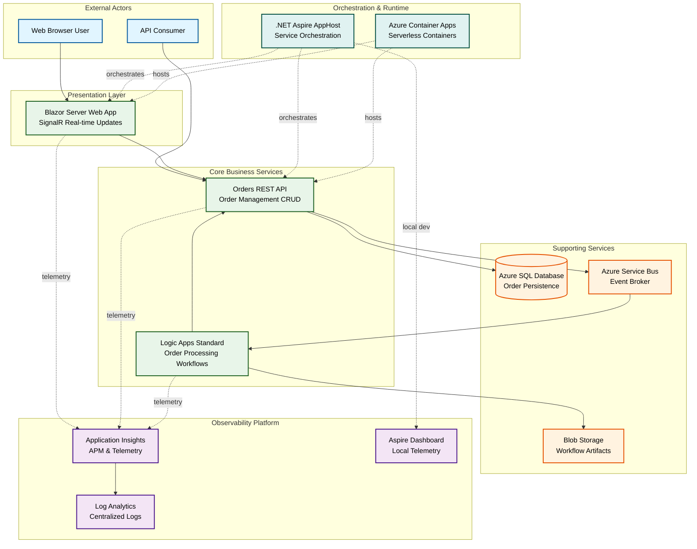

# Azure Logic Apps Monitoring Solution - Architecture Documentation

## 1. Executive Summary

The Azure Logic Apps Monitoring Solution demonstrates enterprise-grade observability patterns for cloud-native distributed applications on Microsoft Azure. This reference architecture addresses the critical challenge of end-to-end visibility across microservices, serverless workflows, and event-driven systems.

The solution delivers measurable business value through:

- **Proactive Issue Detection**: Comprehensive telemetry collection and correlation across all application tiers enables early identification of performance degradation and failures before customer impact
- **Operational Excellence**: Standardized monitoring patterns reduce mean time to resolution (MTTR) by providing distributed trace context that spans HTTP calls, database operations, and message queue interactions
- **Zero-Secret Architecture**: Managed Identity integration eliminates credential management overhead and security risks associated with connection strings and API keys
- **Development Velocity**: Local development parity through .NET Aspire orchestration enables full-fidelity testing without Azure dependencies, accelerating inner-loop development cycles
- **Cloud-Native Scalability**: Azure Container Apps provide automatic horizontal scaling with built-in ingress, while Logic Apps Standard offers visual workflow design with enterprise integration capabilities

Key architectural decisions include:

- W3C Trace Context propagation for distributed correlation across HTTP, Service Bus, and SQL boundaries
- OpenTelemetry as the vendor-neutral instrumentation layer, ensuring portability and future-proofing telemetry investments
- Subscription-scoped Bicep orchestration with modular separation of shared infrastructure, workload resources, and monitoring components
- Event-driven decoupling via Service Bus topics enabling independent service evolution and horizontal scalability
- Infrastructure as Code with lifecycle hooks automating environment validation, secret management, and database configuration

Target deployment environments span Azure regions worldwide with support for multi-region active-active topologies through Azure Front Door integration.

## 2. High-Level Architecture Diagram



## 3. Service Inventory

| Service                        | Type                               | Responsibility                                                                             | Technology                 |
| ------------------------------ | ---------------------------------- | ------------------------------------------------------------------------------------------ | -------------------------- |
| **Orders API**                 | REST API                           | Order lifecycle management including creation, retrieval, validation, and event publishing | ASP.NET Core 10.0 Web API  |
| **Web App**                    | User Interface                     | Customer-facing order management interface with real-time updates                          | Blazor Server with SignalR |
| **Order Processing Workflows** | Workflow Automation                | Asynchronous order validation, enrichment, and routing based on business rules             | Azure Logic Apps Standard  |
| **Order Database**             | Relational Data Store              | Transactional storage for order entities with ACID guarantees                              | Azure SQL Database         |
| **Message Broker**             | Event Bus                          | Reliable asynchronous message delivery with topic-based pub/sub                            | Azure Service Bus          |
| **Application Insights**       | Application Performance Management | Distributed tracing, metrics collection, and anomaly detection                             | Azure Monitor component    |
| **Log Analytics**              | Log Aggregation                    | Centralized query engine for structured logs and custom analytics                          | Azure Monitor component    |
| **Container Registry**         | Artifact Repository                | Secure storage for container images with vulnerability scanning                            | Azure Container Registry   |
| **Container Environment**      | Compute Platform                   | Serverless container hosting with auto-scaling and ingress management                      | Azure Container Apps       |
| **AppHost Orchestrator**       | Development Orchestration          | Local service discovery and dependency orchestration for inner-loop development            | .NET Aspire 9.x            |

## 4. Document Navigation

This architecture documentation follows the TOGAF Building Blocks for Distributed Applications (BDAT) framework, organizing content into four logical layers with supporting cross-cutting documents.

### Recommended Reading Order

**For Executives and Enterprise Architects:**

1. README.md (this document) - Executive summary and system context
2. [Business Architecture](01-business-architecture.md) - Business capabilities and value streams
3. [Security Architecture](06-security-architecture.md) - Security controls and compliance

**For Solution Architects:**

1. README.md - System context and high-level design
2. [Business Architecture](01-business-architecture.md) - Requirements and quality attributes
3. [Application Architecture](03-application-architecture.md) - Service design and integration patterns
4. [Data Architecture](02-data-architecture.md) - Data flows and persistence patterns
5. [Technology Architecture](04-technology-architecture.md) - Technology stack and deployment topology

**For Platform Engineers and DevOps:**

1. [Technology Architecture](04-technology-architecture.md) - Infrastructure components
2. [Deployment Architecture](07-deployment-architecture.md) - CI/CD pipelines and deployment patterns
3. [Security Architecture](06-security-architecture.md) - Security tooling and practices

**For Application Developers:**

1. [Application Architecture](03-application-architecture.md) - Service contracts and APIs
2. [Data Architecture](02-data-architecture.md) - Data models and access patterns
3. [Observability Architecture](05-observability-architecture.md) - Instrumentation and monitoring

### BDAT Layer Documents

| Layer           | Document                                                         | Focus Areas                                                                         |
| --------------- | ---------------------------------------------------------------- | ----------------------------------------------------------------------------------- |
| **Business**    | [01-business-architecture.md](01-business-architecture.md)       | Business capabilities, stakeholder concerns, value streams, quality attributes      |
| **Data**        | [02-data-architecture.md](02-data-architecture.md)               | Data domains, ownership, flows, telemetry mapping, persistence patterns             |
| **Application** | [03-application-architecture.md](03-application-architecture.md) | Service boundaries, integration patterns, API contracts, workflow design            |
| **Technology**  | [04-technology-architecture.md](04-technology-architecture.md)   | Technology stack, infrastructure components, deployment topology, capacity planning |

### Cross-Cutting Concern Documents

| Concern           | Document                                                             | Scope                                                                                  |
| ----------------- | -------------------------------------------------------------------- | -------------------------------------------------------------------------------------- |
| **Observability** | [05-observability-architecture.md](05-observability-architecture.md) | Telemetry instrumentation, trace propagation, metrics, logging, alerting               |
| **Security**      | [06-security-architecture.md](06-security-architecture.md)           | Identity management, secrets handling, network security, compliance                    |
| **Deployment**    | [07-deployment-architecture.md](07-deployment-architecture.md)       | CI/CD pipelines, infrastructure automation, environment promotion, rollback strategies |

## 5. Quick Reference

### Key Platform Resources

| Resource Category | Primary Services                                                 | Purpose                                    |
| ----------------- | ---------------------------------------------------------------- | ------------------------------------------ |
| **Compute**       | Azure Container Apps, Logic Apps Standard (App Service Plan WS1) | Application hosting and workflow execution |
| **Data**          | Azure SQL Database (serverless tier), Blob Storage               | Transactional data and artifact storage    |
| **Messaging**     | Azure Service Bus (Standard tier with topics)                    | Asynchronous event-driven communication    |
| **Observability** | Application Insights, Log Analytics Workspace                    | Telemetry collection and analysis          |
| **Identity**      | User-Assigned Managed Identity                                   | Service authentication without secrets     |
| **Networking**    | Virtual Network integration, Private Endpoints (optional)        | Network isolation and secure communication |
| **Development**   | Azure Container Registry, .NET Aspire orchestration              | Container management and local development |

### Repository Structure

```
├── app.AppHost/               # .NET Aspire orchestration host
│   └── AppHost.cs             # Service configuration and dependency orchestration
├── app.ServiceDefaults/       # Shared cross-cutting concerns library
│   ├── Extensions.cs          # OpenTelemetry, health checks, resilience
│   └── CommonTypes.cs         # Shared domain models (Order, OrderProduct)
├── src/
│   ├── eShop.Orders.API/      # Order management REST API
│   │   ├── Controllers/       # API endpoints (CRUD operations)
│   │   ├── Services/          # Business logic with observability
│   │   ├── Repositories/      # EF Core data access layer
│   │   ├── Data/              # DbContext and entity configurations
│   │   ├── Handlers/          # Service Bus message publishing
│   │   └── HealthChecks/      # Custom health check implementations
│   └── eShop.Web.App/         # Blazor Server frontend
│       ├── Components/        # Razor components and pages
│       │   ├── Pages/         # Routable UI pages
│       │   └── Services/      # HTTP client services with Polly
│       └── Shared/            # Shared UI components
├── workflows/
│   └── OrdersManagement/
│       └── OrdersManagementLogicApp/
│           ├── OrdersPlacedProcess/         # Service Bus trigger workflow
│           │   └── workflow.json            # Workflow definition
│           ├── OrdersPlacedCompleteProcess/ # Completion workflow
│           │   └── workflow.json
│           └── connections.json             # Managed Identity API connections
├── infra/                     # Infrastructure as Code (Bicep)
│   ├── main.bicep             # Subscription-scope orchestrator
│   ├── types.bicep            # Shared type definitions
│   ├── shared/                # Shared infrastructure
│   │   ├── identity/          # Managed Identity and role assignments
│   │   ├── monitoring/        # Log Analytics, Application Insights
│   │   └── data/              # Storage accounts, SQL Server
│   └── workload/              # Workload infrastructure
│       ├── messaging/         # Service Bus namespace and topics
│       ├── services/          # Container Registry, Container Apps Environment
│       └── logic-app.bicep    # Logic Apps Standard deployment
├── hooks/                     # azd lifecycle automation scripts
│   ├── preprovision.ps1       # Pre-deployment validation
│   ├── postprovision.ps1      # Secret configuration
│   ├── sql-managed-identity-config.ps1  # Database Entra ID setup
│   ├── deploy-workflow.ps1    # Logic Apps deployment
│   └── Generate-Orders.ps1    # Test data generation
├── docs/
│   ├── architecture/          # This directory - TOGAF BDAT documentation
│   └── hooks/                 # Developer workflow guides
└── azure.yaml                 # Azure Developer CLI configuration
```

### Folder Descriptions

| Folder                   | Contents                           | Purpose                                                                                                |
| ------------------------ | ---------------------------------- | ------------------------------------------------------------------------------------------------------ |
| **app.AppHost**          | Aspire orchestration configuration | Defines service dependencies, Azure resource connections, and local/Azure deployment modes             |
| **app.ServiceDefaults**  | Cross-cutting concern library      | OpenTelemetry instrumentation, health checks, HTTP resilience, Service Bus client factory              |
| **src/eShop.Orders.API** | Order management microservice      | REST API for CRUD operations, EF Core persistence, Service Bus publishing, comprehensive observability |
| **src/eShop.Web.App**    | Customer-facing UI                 | Blazor Server with SignalR, Fluent UI components, typed HTTP clients with Polly resilience             |
| **workflows**            | Logic Apps Standard definitions    | Stateful workflows with Service Bus triggers, HTTP actions, Blob storage output                        |
| **infra/shared**         | Foundational infrastructure        | Identity, monitoring, and data resources shared across workloads                                       |
| **infra/workload**       | Application-specific resources     | Messaging, container services, and Logic Apps specific to this solution                                |
| **hooks**                | Deployment automation              | Cross-platform scripts for validation, configuration, and data seeding                                 |
| **docs**                 | Comprehensive documentation        | Architecture guides, developer workflows, script references, deployment procedures                     |

---

**Document Version:** 1.0.0  
**Last Updated:** 2026-01-07  
**Maintained By:** Platform Engineering Team  
**Review Cycle:** Quarterly or upon significant architectural changes
