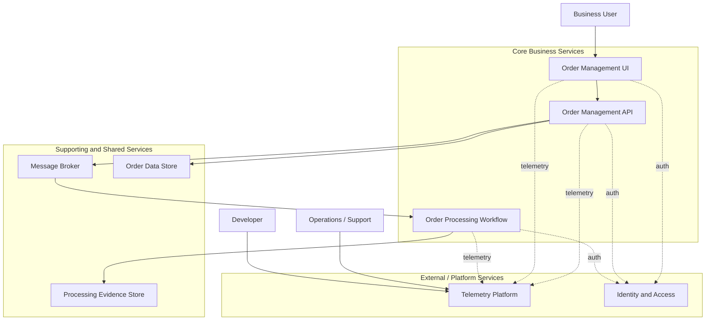

# Architecture Documentation (BDAT)

## 1. Executive Summary

This solution provides a reference architecture for monitoring and operating event-driven workflow automation in a cloud-native, distributed application. It uses an order-management scenario to demonstrate how business events flow from user interactions to APIs, through messaging, into workflow orchestration—while producing operational telemetry and auditable processing evidence.

Primary business value is reduced operational risk and faster incident response for workflow-driven processes. The architecture emphasizes traceability across services, consistent health signaling, and clear ownership boundaries between the user experience, transaction processing, workflow execution, and observability.

Key architectural decisions / differentiators:

- **Service-oriented boundaries**: UI, API, workflow engine, and shared platform concerns are separated into clear logical services.
- **Event-driven integration**: business events are published to a broker to decouple transaction processing from workflow execution.
- **Evidence-first processing**: workflow outcomes are recorded to a durable store to support auditability and troubleshooting.
- **Unified telemetry model**: traces, metrics, logs, and health probes are standardized across services for end-to-end correlation.
- **Infrastructure as Code + repeatable lifecycle**: environments are provisioned and updated using declarative templates and automated hooks.

Target deployment environments:

- **Cloud**: single-region deployment (extendable to multi-region patterns) using managed compute for containers and workflows.

## 2. High-Level Architecture Diagram



## 3. Service Inventory

| Service | Type | Responsibility | Technology |
| --- | --- | --- | --- |
| Order Management UI | User-facing | Enable users to create and view orders | Server-rendered web UI |
| Order Management API | Business service | Validate, persist, and publish order events | REST API service |
| Order Processing Workflow | Workflow | Execute automated order processing steps and record outcomes | Workflow runtime |
| Message Broker | Integration | Decouple API transactions from downstream workflow execution | Pub/sub messaging |
| Order Data Store | Data | System-of-record for orders and order line items | Relational database |
| Processing Evidence Store | Data | Durable record of workflow results (success/error) | Object storage |
| Telemetry Platform | Observability | Collect, correlate, and visualize logs/metrics/traces and health | Telemetry + dashboards |

## 4. Document Navigation

- [Business Architecture](01-business-architecture.md)
- [Data Architecture](02-data-architecture.md)
- Application Architecture (planned): `03-application-architecture.md`
- Technology Architecture (planned): `04-technology-architecture.md`

Recommended reading order:

- **Executives**: this overview → Business Architecture → Data Architecture
- **Architects**: this overview → Business → Data → (planned) Application → (planned) Technology
- **Engineers**: this overview → Data → Business → repository `src/` and `infra/` implementation

## 5. Quick Reference

### Key platform resources (high-level)

| Resource | Purpose |
| --- | --- |
| Container hosting environment | Runs the UI and API as containerized services |
| Workflow hosting plan + workflow app | Runs the workflow definitions and connectors |
| Message broker namespace + topic/subscription | Carries business events from API to workflow |
| Relational database | Stores orders and products (system-of-record) |
| Workflow storage account | Holds workflow runtime state and processing evidence |
| Central logging + telemetry store | Aggregates logs, traces, and metrics |
| Managed identity | Enables non-secret authentication between services |

### Repository layout (high-level)

```text
app.AppHost/           Aspire AppHost: local orchestration and resource wiring
app.ServiceDefaults/   Shared defaults: telemetry, health endpoints, resilience, service discovery
src/                   Application services (API + UI)
workflows/             Workflow definitions and local workflow host settings
infra/                 Infrastructure-as-Code templates (subscription + resource-group modules)
hooks/                 Lifecycle automation scripts (provision, configure, deploy workflows, test data)
docs/                  Documentation (including architecture)
```
