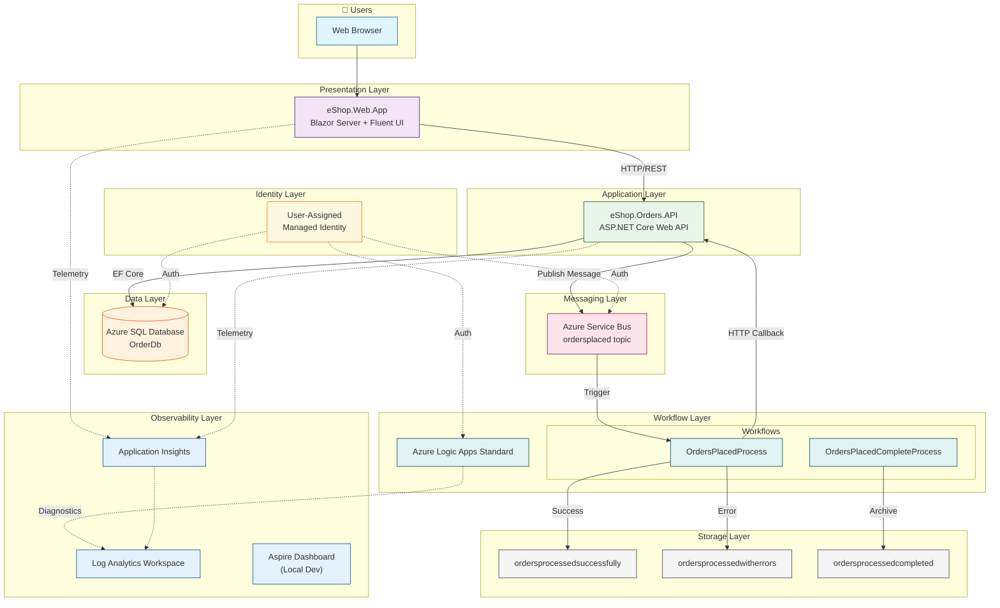

# Architecture Overview

## Executive Summary

The **Azure Logic Apps Monitoring Solution** is a cloud-native reference architecture demonstrating enterprise-grade observability patterns for distributed applications on Azure. This solution uses an eShop order management system as its business scenario, showcasing how to instrument event-driven architectures with OpenTelemetry and Azure Monitor for comprehensive distributed tracing.

Built on **.NET 10** and **.NET Aspire 9.x** orchestration, the solution provides a complete blueprint for achieving end-to-end traceability from user interactions through API calls, message processing, and workflow execution—critical for debugging, performance analysis, and compliance auditing in modern distributed systems.

**Key Architectural Highlights:**

| Capability                         | Implementation                                                                |
| ---------------------------------- | ----------------------------------------------------------------------------- |
| **Orchestration**                  | .NET Aspire AppHost with unified local/cloud development                      |
| **Event-Driven**                   | Azure Service Bus topics for reliable async messaging                         |
| **Serverless Workflows**           | Azure Logic Apps Standard for business process automation                     |
| **Defense-in-Depth Observability** | Four-layer telemetry (Sources → Instrumentation → Collection → Visualization) |
| **Zero-Secrets Architecture**      | Managed Identity authentication for all Azure services                        |
| **Infrastructure as Code**         | Modular Bicep templates with subscription-scope orchestration                 |

**Target Deployment Environments:** Azure Container Apps (production), Local Docker with .NET Aspire emulators (development)

---

## High-Level Architecture Diagram



---

## Service Inventory

| Service                         | Type           | Responsibility                                                          | Technology                              |
| ------------------------------- | -------------- | ----------------------------------------------------------------------- | --------------------------------------- |
| **eShop.Web.App**               | Frontend       | Blazor Server UI for order management with real-time updates            | Blazor Server, Fluent UI, SignalR       |
| **eShop.Orders.API**            | Backend API    | RESTful order CRUD operations, message publishing, data persistence     | ASP.NET Core 10, EF Core, OpenTelemetry |
| **OrdersPlacedProcess**         | Workflow       | Process Service Bus messages, call API, archive to blob storage         | Logic Apps Standard, Stateful           |
| **OrdersPlacedCompleteProcess** | Workflow       | Archive successfully processed orders from staging to completed         | Logic Apps Standard, Stateful           |
| **app.AppHost**                 | Orchestrator   | .NET Aspire host coordinating services, dependencies, and configuration | .NET Aspire 9.x                         |
| **app.ServiceDefaults**         | Shared Library | Cross-cutting concerns: OpenTelemetry, health checks, resilience        | .NET 10, Polly                          |

---

## Document Navigation

This architecture documentation follows **TOGAF BDAT (Business, Data, Application, Technology)** framework principles:

| Document                                                   | Description                                                                | Primary Audience                        |
| ---------------------------------------------------------- | -------------------------------------------------------------------------- | --------------------------------------- |
| [01-business-architecture.md](01-business-architecture.md) | Business context, capabilities, stakeholders, value streams, process flows | Enterprise Architects, Solution Architects |
| [02-data-architecture.md](02-data-architecture.md)         | Data stores, flows, telemetry mapping, monitoring data architecture        | Data Engineers, Platform Engineers, SRE |

### Reading Order by Audience

| Audience                      | Recommended Path         |
| ----------------------------- | ------------------------ |
| **Cloud Solution Architects** | README → Business → Data |
| **Platform Engineers**        | README → Data → Business |
| **Developers**                | README → Data            |
| **DevOps/SRE Teams**          | README → Data → Business |

---

## Quick Reference

### Key Azure Resources

| Resource                       | Purpose                                   | Naming Convention                |
| ------------------------------ | ----------------------------------------- | -------------------------------- |
| Resource Group                 | Container for all resources               | `rg-{solution}-{env}-{location}` |
| Application Insights           | APM and distributed tracing               | `{name}-{uniqueId}-appinsights`  |
| Log Analytics Workspace        | Centralized logging (30-day retention)    | `{name}-{uniqueId}-law`          |
| Azure SQL Server               | Order data persistence with Entra ID auth | `{name}server{uniqueId}`         |
| Service Bus Namespace          | Message brokering (Standard tier)         | `{name}sb{uniqueId}`             |
| Container Registry             | Container image storage (Premium tier)    | `{name}acr{uniqueId}`            |
| Container Apps Environment     | Microservices hosting                     | `{name}-{uniqueId}-cae`          |
| Logic App (Standard)           | Workflow automation (WS1 plan)            | `{name}-{uniqueId}-logicapp`     |
| Storage Account (Workflow)     | Logic App runtime + blob containers       | `{name}wsa{uniqueId}`            |
| User-Assigned Managed Identity | Zero-secrets authentication               | `{name}-{uniqueId}-identity`     |

### Repository Structure

```
Azure-LogicApps-Monitoring/
├── app.AppHost/                 # .NET Aspire orchestration
├── app.ServiceDefaults/         # Shared library (OpenTelemetry, health checks)
├── src/
│   ├── eShop.Orders.API/        # Backend API (Controllers, Services, Repositories)
│   └── eShop.Web.App/           # Blazor Server frontend
├── workflows/
│   └── OrdersManagement/        # Logic Apps Standard workflows
├── infra/
│   ├── main.bicep               # Subscription-scope orchestrator
│   ├── shared/                  # Identity, monitoring, data modules
│   └── workload/                # Messaging, services, Logic Apps modules
├── hooks/                       # azd lifecycle scripts (PowerShell + Bash)
├── docs/
│   └── architecture/            # TOGAF BDAT documentation
├── azure.yaml                   # Azure Developer CLI configuration
└── app.sln                      # .NET solution file
```

---

## Technology Stack Summary

| Layer             | Technology                    | Version  |
| ----------------- | ----------------------------- | -------- |
| **Runtime**       | .NET                          | 10.0     |
| **Orchestration** | .NET Aspire                   | 9.x      |
| **Frontend**      | Blazor Server + Fluent UI     | -        |
| **Backend**       | ASP.NET Core Web API          | 10.0     |
| **ORM**           | Entity Framework Core         | 10.0     |
| **Messaging**     | Azure Service Bus             | Standard |
| **Workflows**     | Azure Logic Apps Standard     | WS1      |
| **Database**      | Azure SQL Database            | -        |
| **Containers**    | Azure Container Apps          | -        |
| **Observability** | OpenTelemetry + Azure Monitor | -        |
| **IaC**           | Bicep                         | Latest   |
| **Deployment**    | Azure Developer CLI (azd)     | ≥1.9.0   |
