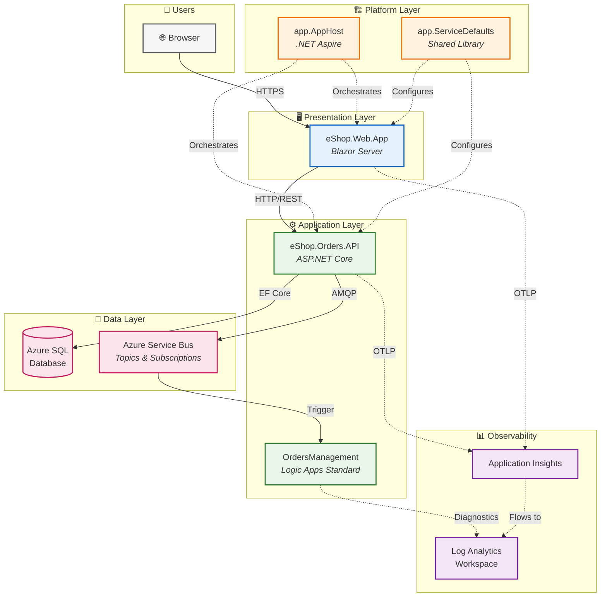

# Azure Logic Apps Monitoring Solution - Architecture Overview

← [Repository Root](../../README.md) | **Index** | [Business Architecture →](01-business-architecture.md)

---

## Executive Summary

The **Azure Logic Apps Monitoring Solution** is a cloud-native reference architecture demonstrating enterprise-grade observability patterns for distributed applications on Azure. Built around an eShop order management scenario, this solution showcases how to implement comprehensive monitoring, distributed tracing, and automated workflow processing using modern .NET technologies and Azure PaaS services.

**Key Architectural Highlights:**
- **.NET Aspire** orchestration for unified local development and cloud deployment
- **Event-driven architecture** with Azure Service Bus for decoupled, scalable processing
- **Azure Logic Apps Standard** for automated workflow orchestration triggered by domain events
- **End-to-end observability** with OpenTelemetry, Application Insights, and Azure Monitor
- **Infrastructure as Code** using Bicep with Azure Developer CLI (azd) lifecycle automation

**Target Deployment Environments:**
- **Local Development**: Containerized dependencies (SQL Server, Service Bus Emulator) via .NET Aspire
- **Azure Cloud**: Container Apps, Azure SQL, Service Bus, Logic Apps Standard

---

## High-Level Architecture Diagram



---

## Service Inventory

| Service | Type | Responsibility | Technology |
|---------|------|----------------|------------|
| **eShop.Web.App** | Web UI | Interactive order management interface | Blazor Server, Fluent UI, SignalR |
| **eShop.Orders.API** | REST API | Order CRUD, batch processing, event publishing | ASP.NET Core 10, EF Core, OpenAPI |
| **OrdersManagement** | Workflow | Automated order processing triggered by Service Bus events | Logic Apps Standard |
| **app.AppHost** | Orchestrator | Service orchestration, Azure resource wiring, local emulator configuration | .NET Aspire 9.x |
| **app.ServiceDefaults** | Library | Cross-cutting concerns: telemetry, resilience, health checks | .NET Class Library |

---

## Document Navigation

| Document | Description | Primary Audience |
|----------|-------------|------------------|
| [01-business-architecture.md](01-business-architecture.md) | Business context, capabilities, value streams | Solution Architects, Business Analysts |
| [02-data-architecture.md](02-data-architecture.md) | Data domains, flows, telemetry mapping | Data Architects, Platform Engineers |
| [03-application-architecture.md](03-application-architecture.md) | Service decomposition, APIs, integration patterns | Developers, Technical Leads |
| [04-technology-architecture.md](04-technology-architecture.md) | Azure infrastructure, platform services, IaC | Platform Engineers, DevOps |
| [05-observability-architecture.md](05-observability-architecture.md) | Distributed tracing, metrics, logging, alerting | SRE, DevOps, Developers |
| [06-security-architecture.md](06-security-architecture.md) | Identity, authentication, data protection | Security Engineers, Architects |
| [07-deployment-architecture.md](07-deployment-architecture.md) | CI/CD pipeline, azd workflow, environments | DevOps, Platform Engineers |
| [adr/README.md](adr/README.md) | Architecture Decision Records index | All Technical Audiences |

### Reading Order by Audience

| Audience | Recommended Path |
|----------|------------------|
| **Cloud Solution Architects** | README → Business → Application → Technology → Observability |
| **Platform Engineers** | README → Technology → Deployment → Observability → Data |
| **Developers** | README → Application → Data → Observability → ADRs |
| **DevOps/SRE Teams** | README → Observability → Deployment → Technology → Security |

---

## Quick Reference

### Key Azure Resources

| Resource | Purpose | SKU/Tier | Module Location |
|----------|---------|----------|-----------------|
| Azure Container Apps | Microservices hosting | Consumption | [infra/workload/services/main.bicep](../../infra/workload/services/main.bicep) |
| Azure SQL Database | Order data persistence | General Purpose | [infra/shared/data/main.bicep](../../infra/shared/data/main.bicep) |
| Azure Service Bus | Async messaging | Standard | [infra/workload/messaging/main.bicep](../../infra/workload/messaging/main.bicep) |
| Azure Logic Apps | Workflow automation | WorkflowStandard WS1 | [infra/workload/logic-app.bicep](../../infra/workload/logic-app.bicep) |
| Application Insights | APM and telemetry | Workspace-based | [infra/shared/monitoring/app-insights.bicep](../../infra/shared/monitoring/app-insights.bicep) |
| Log Analytics | Centralized logging | Standard | [infra/shared/monitoring/log-analytics-workspace.bicep](../../infra/shared/monitoring/log-analytics-workspace.bicep) |
| Container Registry | Image storage | Premium | [infra/workload/services/main.bicep](../../infra/workload/services/main.bicep) |
| Managed Identity | Passwordless auth | User-assigned | [infra/shared/identity/main.bicep](../../infra/shared/identity/main.bicep) |

### Repository Structure

```
azure-logicapps-monitoring/
│
├── 📁 .github/                          # GitHub configuration
│   └── workflows/                       # CI/CD pipeline definitions
│
├── 📁 app.AppHost/                      # .NET Aspire Orchestrator
│   ├── AppHost.cs                       # Service orchestration & resource wiring
│   ├── app.AppHost.csproj               # Project file with Aspire SDK
│   ├── appsettings.json                 # Base configuration
│   ├── appsettings.Development.json     # Local development overrides
│   └── Properties/
│       └── launchSettings.json          # Debug launch profiles
│
├── 📁 app.ServiceDefaults/              # Shared Cross-Cutting Concerns
│   ├── app.ServiceDefaults.csproj       # Shared library project
│   ├── Extensions.cs                    # OpenTelemetry, health checks, resilience
│   └── CommonTypes.cs                   # Shared DTOs and types
│
├── 📁 src/                              # Application Source Code
│   │
│   ├── 📁 eShop.Orders.API/             # Orders REST API Service
│   │   ├── Program.cs                   # Application entry point & DI setup
│   │   ├── eShop.Orders.API.csproj      # Project file
│   │   ├── eShop.Orders.API.http        # HTTP request samples for testing
│   │   ├── MIGRATION_GUIDE.md           # EF Core migration documentation
│   │   ├── Setup-Database.ps1           # Database initialization script
│   │   ├── appsettings.json             # Base configuration
│   │   ├── appsettings.Development.json # Development overrides
│   │   │
│   │   ├── 📁 Controllers/              # API Endpoints
│   │   │   ├── OrdersController.cs      # Order CRUD operations
│   │   │   └── WeatherForecastController.cs
│   │   │
│   │   ├── 📁 Services/                 # Business Logic Layer
│   │   │   ├── OrderService.cs          # Order processing logic
│   │   │   └── OrdersWrapper.cs         # Service Bus message wrapper
│   │   │
│   │   ├── 📁 Repositories/             # Data Access Layer
│   │   │   └── OrderRepository.cs       # EF Core order persistence
│   │   │
│   │   ├── 📁 Interfaces/               # Abstractions
│   │   │   ├── IOrderRepository.cs      # Repository contract
│   │   │   ├── IOrderService.cs         # Service contract
│   │   │   └── IOrdersMessageHandler.cs # Message handler contract
│   │   │
│   │   ├── 📁 Handlers/                 # Message Handlers
│   │   │   ├── OrdersMessageHandler.cs  # Service Bus message processing
│   │   │   ├── NoOpOrdersMessageHandler.cs # Stub for local dev
│   │   │   └── OrderMessageWithMetadata.cs # Message envelope
│   │   │
│   │   ├── 📁 HealthChecks/             # Health Check Implementations
│   │   │   ├── DbContextHealthCheck.cs  # SQL connectivity check
│   │   │   └── ServiceBusHealthCheck.cs # Service Bus connectivity check
│   │   │
│   │   ├── 📁 Migrations/               # EF Core Database Migrations
│   │   ├── 📁 data/                     # Seed data and samples
│   │   └── 📁 Properties/               # Assembly metadata
│   │
│   └── 📁 eShop.Web.App/                # Blazor Web Frontend
│       ├── Program.cs                   # Application entry point
│       ├── eShop.Web.App.csproj         # Project file
│       ├── appsettings.json             # Base configuration
│       ├── appsettings.Development.json # Development overrides
│       │
│       ├── 📁 Components/               # Blazor Components
│       │   ├── App.razor                # Root component
│       │   ├── Routes.razor             # Routing configuration
│       │   ├── _Imports.razor           # Global using directives
│       │   │
│       │   ├── 📁 Layout/               # Layout Components
│       │   │   ├── MainLayout.razor     # Main page layout
│       │   │   ├── MainLayout.razor.css # Layout styles
│       │   │   ├── NavMenu.razor        # Navigation menu
│       │   │   └── NavMenu.razor.css    # Navigation styles
│       │   │
│       │   ├── 📁 Pages/                # Page Components
│       │   │   ├── Home.razor           # Dashboard/home page
│       │   │   ├── ListAllOrders.razor  # Order list view
│       │   │   ├── PlaceOrder.razor     # Single order form
│       │   │   ├── PlaceOrdersBatch.razor # Batch order creation
│       │   │   ├── ViewOrder.razor      # Order details view
│       │   │   ├── WeatherForecasts.razor # Demo weather page
│       │   │   └── Error.razor          # Error page
│       │   │
│       │   ├── 📁 Services/             # Client-side services
│       │   └── 📁 Shared/               # Shared UI components
│       │
│       ├── 📁 wwwroot/                  # Static assets (CSS, JS, images)
│       └── 📁 Properties/               # Assembly metadata
│
├── 📁 workflows/                        # Logic Apps Workflows
│   └── 📁 OrdersManagement/             # Order Processing Workflows
│       ├── OrdersManagement.code-workspace # VS Code workspace
│       └── 📁 OrdersManagementLogicApp/ # Logic App Project
│           ├── host.json                # Logic App host configuration
│           ├── .funcignore              # Deployment ignore patterns
│           └── 📁 ProcessingOrdersPlaced/ # Workflow Definition
│               └── workflow.json        # Workflow designer JSON
│
├── 📁 infra/                            # Infrastructure as Code (Bicep)
│   ├── main.bicep                       # 🎯 Entry point - orchestrates all modules
│   ├── main.parameters.json             # Environment-specific parameters
│   ├── types.bicep                      # Shared type definitions
│   │
│   ├── 📁 data/                         # Sample/seed data
│   │   └── ordersBatch.json             # Sample batch orders
│   │
│   ├── 📁 shared/                       # Shared Infrastructure Resources
│   │   ├── main.bicep                   # Shared resources orchestrator
│   │   │
│   │   ├── 📁 identity/                 # Identity Management
│   │   │   └── main.bicep               # User-assigned managed identity
│   │   │
│   │   ├── 📁 monitoring/               # Observability Infrastructure
│   │   │   ├── main.bicep               # Monitoring orchestrator
│   │   │   ├── log-analytics-workspace.bicep # Log Analytics workspace
│   │   │   ├── app-insights.bicep       # Application Insights
│   │   │   └── azure-monitor-health-model.bicep # Health model alerts
│   │   │
│   │   └── 📁 data/                     # Data Infrastructure
│   │       └── main.bicep               # Azure SQL Database
│   │
│   └── 📁 workload/                     # Workload-Specific Resources
│       ├── main.bicep                   # Workload orchestrator
│       ├── logic-app.bicep              # Logic Apps Standard
│       │
│       ├── 📁 messaging/                # Messaging Infrastructure
│       │   └── main.bicep               # Service Bus namespace, topics, subscriptions
│       │
│       └── 📁 services/                 # Container Services
│           └── main.bicep               # Container Apps, Container Registry
│
├── 📁 hooks/                            # Azure Developer CLI Lifecycle Scripts
│   ├── preprovision.ps1                 # Pre-deployment validation (PowerShell)
│   ├── preprovision.sh                  # Pre-deployment validation (Bash)
│   ├── postprovision.ps1                # Post-deployment configuration (PowerShell)
│   ├── postprovision.sh                 # Post-deployment configuration (Bash)
│   ├── clean-secrets.ps1                # Clear user secrets (PowerShell)
│   ├── clean-secrets.sh                 # Clear user secrets (Bash)
│   ├── check-dev-workstation.ps1        # Validate dev environment (PowerShell)
│   ├── check-dev-workstation.sh         # Validate dev environment (Bash)
│   ├── configure-logic-app.ps1          # Logic App configuration
│   ├── sql-managed-identity-config.ps1  # SQL managed identity setup (PowerShell)
│   ├── sql-managed-identity-config.sh   # SQL managed identity setup (Bash)
│   ├── Generate-Orders.ps1              # Test data generation (PowerShell)
│   └── Generate-Orders.sh               # Test data generation (Bash)
│
├── 📁 docs/                             # Documentation
│   │
│   ├── 📁 architecture/                 # Architecture Documentation
│   │   ├── README.md                    # 📍 You are here - Architecture overview
│   │   ├── 01-business-architecture.md  # Business context & capabilities
│   │   ├── 02-data-architecture.md      # Data domains & flows
│   │   ├── 03-application-architecture.md # Service decomposition & APIs
│   │   ├── 04-technology-architecture.md # Azure infrastructure & IaC
│   │   ├── 05-observability-architecture.md # Tracing, metrics, logging
│   │   ├── 06-security-architecture.md  # Identity & data protection
│   │   ├── 07-deployment-architecture.md # CI/CD & environments
│   │   │
│   │   └── 📁 adr/                      # Architecture Decision Records
│   │       ├── README.md                # ADR index
│   │       ├── ADR-001-aspire-orchestration.md
│   │       ├── ADR-002-service-bus-messaging.md
│   │       └── ADR-003-observability-strategy.md
│   │
│   └── 📁 hooks/                        # Hook Script Documentation
│       ├── README.md                    # Hooks overview
│       ├── check-dev-workstation.md     # Dev workstation validation docs
│       ├── clean-secrets.md             # Secrets cleanup docs
│       ├── Generate-Orders.md           # Order generation docs
│       ├── postprovision.md             # Post-provisioning docs
│       └── VALIDATION-WORKFLOW.md       # Validation workflow guide
│
├── 📄 azure.yaml                        # 🎯 Azure Developer CLI configuration
├── 📄 app.sln                           # Visual Studio solution file
├── 📄 README.md                         # Repository root documentation
├── 📄 CONTRIBUTING.md                   # Contribution guidelines
├── 📄 CODE_OF_CONDUCT.md                # Community code of conduct
├── 📄 LICENSE                           # License file
├── 📄 LICENSE.md                        # License details
├── 📄 SECURITY.md                       # Security policy
└── 📄 .gitignore                        # Git ignore patterns
```

#### Directory Legend

| Icon | Meaning |
|------|---------|
| 📁 | Directory |
| 📄 | File |
| 🎯 | Key entry point |
| 📍 | Current location |

---

## Related Documents

- [Developer Inner Loop Workflow](../hooks/README.md) - Local development and azd hooks
- [Migration Guide](../../src/eShop.Orders.API/MIGRATION_GUIDE.md) - EF Core migration documentation

---

← [Repository Root](../../README.md) | **Index** | [Business Architecture →](01-business-architecture.md)
