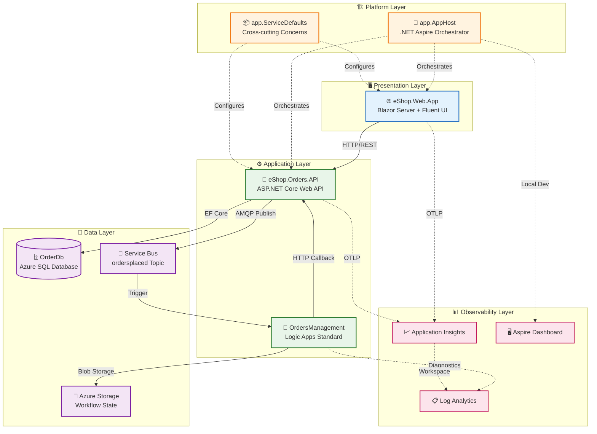

# Architecture Overview

[Index](README.md) | [Next →](01-business-architecture.md)

## Executive Summary

The **Azure Logic Apps Monitoring Solution** is a cloud-native distributed application demonstrating enterprise-grade observability patterns for Azure Logic Apps within an eShop order management context. Built on .NET 10 and .NET Aspire 9.x, the solution showcases comprehensive monitoring, distributed tracing, and event-driven architecture patterns that enable operations teams to gain deep visibility into automated business workflows.

**Key Architectural Highlights:**
- **Event-Driven Architecture:** Asynchronous order processing using Azure Service Bus pub/sub patterns with topic-based messaging
- **Distributed Tracing:** End-to-end correlation across HTTP, messaging, and Logic App boundaries using OpenTelemetry and W3C Trace Context
- **Infrastructure as Code:** Complete Azure deployment via modular Bicep templates with Azure Developer CLI (azd) orchestration
- **Local Development Parity:** .NET Aspire AppHost enables local development with emulators mirroring production topology

**Target Deployment Environments:**
- Local development with Docker containers and Service Bus emulator
- Azure Container Apps with managed identity authentication

---

## High-Level Architecture Diagram



---

## Service Inventory

| Service | Type | Responsibility | Technology | Port |
|---------|------|----------------|------------|------|
| **eShop.Web.App** | Web UI | Interactive order management frontend | Blazor Server, Fluent UI, SignalR | 5002 |
| **eShop.Orders.API** | REST API | Order CRUD, batch processing, event publishing | ASP.NET Core 10, EF Core | 5001 |
| **OrdersManagement** | Workflow | Event-driven order processing automation | Logic Apps Standard | N/A |
| **app.AppHost** | Orchestrator | Service orchestration, local dev configuration | .NET Aspire 9.x | 15888 |
| **app.ServiceDefaults** | Library | Telemetry, resilience, health checks | OpenTelemetry, Polly | N/A |

---

## Document Navigation

### TOGAF BDAT Framework Documents

| Document | Description | Primary Audience |
|----------|-------------|------------------|
| [01-business-architecture.md](01-business-architecture.md) | Business capabilities, value streams, stakeholders | Architects, Business Analysts |
| [02-data-architecture.md](02-data-architecture.md) | Data domains, stores, flows, telemetry mapping | Data Engineers, Developers |
| [03-application-architecture.md](03-application-architecture.md) | Services, APIs, communication patterns | Developers, Tech Leads |
| [04-technology-architecture.md](04-technology-architecture.md) | Azure resources, infrastructure topology | Platform Engineers, DevOps |
| [05-observability-architecture.md](05-observability-architecture.md) | Monitoring, tracing, alerting strategy | SRE, Operations |
| [06-security-architecture.md](06-security-architecture.md) | Identity, secrets, network security | Security Engineers |
| [07-deployment-architecture.md](07-deployment-architecture.md) | CI/CD, IaC, environment management | DevOps, Platform Engineers |
| [adr/README.md](adr/README.md) | Architecture Decision Records index | All Technical Staff |

### Reading Order by Audience

| Audience | Recommended Path |
|----------|------------------|
| **Cloud Solution Architects** | README → 01 → 04 → 05 → ADRs |
| **Platform Engineers** | README → 04 → 07 → 05 → 06 |
| **Developers** | README → 03 → 02 → 05 |
| **DevOps/SRE Teams** | README → 05 → 07 → 04 |

---

## Key Azure Resources

| Resource | Type | Purpose | SKU/Tier |
|----------|------|---------|----------|
| Container Apps Environment | Microsoft.App/managedEnvironments | Serverless container hosting | Consumption |
| Container Registry | Microsoft.ContainerRegistry/registries | Container image storage | Premium |
| SQL Database | Microsoft.Sql/servers/databases | Order data persistence | General Purpose |
| Service Bus | Microsoft.ServiceBus/namespaces | Event messaging | Standard |
| Application Insights | Microsoft.Insights/components | APM and distributed tracing | Standard |
| Log Analytics Workspace | Microsoft.OperationalInsights/workspaces | Centralized logging | PerGB2018 |
| Logic Apps | Microsoft.Web/sites | Workflow automation | WorkflowStandard WS1 |
| Storage Account | Microsoft.Storage/storageAccounts | Workflow state, processed orders | Standard LRS |
| Managed Identity | Microsoft.ManagedIdentity/userAssignedIdentities | Service authentication | N/A |

---

## Repository Structure

```
Azure-LogicApps-Monitoring/
├── app.AppHost/                    # .NET Aspire orchestrator
│   ├── AppHost.cs                  # Service composition and Azure configuration
│   └── appsettings.json            # Local development settings
├── app.ServiceDefaults/            # Shared cross-cutting concerns
│   ├── Extensions.cs               # OpenTelemetry, resilience, health checks
│   └── CommonTypes.cs              # Shared domain models (Order, OrderProduct)
├── src/
│   ├── eShop.Orders.API/           # Orders REST API
│   │   ├── Controllers/            # API endpoints
│   │   ├── Services/               # Business logic
│   │   ├── Repositories/           # Data access (EF Core)
│   │   ├── Handlers/               # Service Bus message handlers
│   │   └── HealthChecks/           # Database and Service Bus health
│   └── eShop.Web.App/              # Blazor Server frontend
│       ├── Components/             # Razor components and pages
│       └── Services/               # Typed HTTP clients
├── workflows/
│   └── OrdersManagement/           # Logic Apps Standard project
│       └── ProcessingOrdersPlaced/ # Order processing workflow
├── infra/                          # Bicep IaC templates
│   ├── main.bicep                  # Deployment orchestrator
│   ├── shared/                     # Identity, monitoring, data modules
│   └── workload/                   # Services, messaging, Logic Apps
├── hooks/                          # azd lifecycle scripts
│   ├── preprovision.ps1            # Environment validation
│   ├── postprovision.ps1           # Secret configuration
│   └── sql-managed-identity-config.ps1  # SQL Entra ID setup
└── docs/
    └── architecture/               # This documentation
```

---

## Related Documents

- [Developer Inner Loop Workflow](../hooks/README.md) - Development setup and automation
- [Azure Developer CLI Configuration](../../azure.yaml) - azd template definition

---

← Previous | [Index](README.md) | [Next →](01-business-architecture.md)
