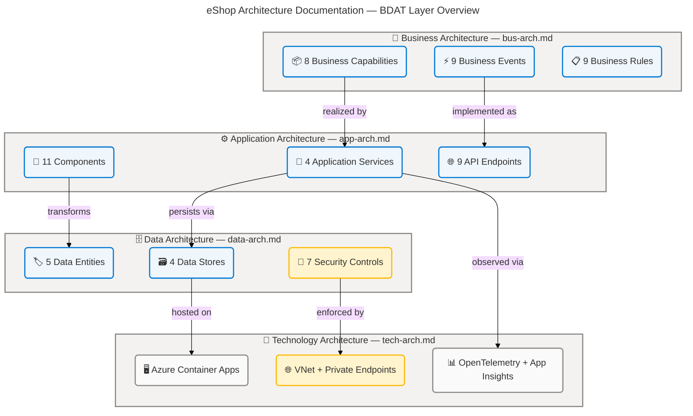

# Architecture Documentation

> [!NOTE]
> This folder is the **entry point** for the -aligned architecture documentation of the **eShop Azure Logic Apps Monitoring Solution** — a cloud-native order management platform built on .NET Aspire, Azure Container Apps, and Azure Logic Apps Standard.

## Table of Contents

- [Overview](#overview)
- [Architecture Documents](#architecture-documents)
- [Architecture Landscape](#architecture-landscape)
- [Document Coverage](#document-coverage)
- [Reading Prerequisites](#reading-prerequisites)
- [Navigation Guide](#navigation-guide)

## Overview

**Overview**

The `docs/architecture` folder provides four complementary architecture views of the **eShop Azure Logic Apps Monitoring Solution**. The four documents — Business, Application, Data, and Technology — each cover eleven component types from their respective layer's perspective and are structured identically: Executive Summary, Architecture Landscape, Architecture Principles, Current State Baseline, Component Catalog, and Dependencies & Integration.

> 💡 **Why This Matters**: **Consistent, evidence-based architecture documentation enables engineering teams, architects, and stakeholders to reason about any architectural concern** — business capability, application component, data flow, or platform infrastructure — without cross-reading unrelated layers. Each document is self-contained and citable.

> 📌 **How It Works**: The four layers build on each other in a realization chain. **Business capabilities define _what_ the system must do; Application components describe _how_ they are delivered; Data entities and flows define _what information_ moves through the system; and Technology infrastructure establishes _where and how_ everything runs.**

**Solution Highlights**

- **Three-tier microservices**: Blazor Server web app → ASP.NET Core REST API → Azure Logic Apps Standard
- **Event-driven integration**: Azure Service Bus `ordersplaced` topic decouples order placement from downstream processing
- **Infrastructure as Code**: Full Azure Bicep + `azd` coverage for every Azure resource in the solution
- **Observability-first**: OpenTelemetry distributed tracing baked into `app.ServiceDefaults` and exported to Application Insights from day one
- **Security-first**: User-Assigned Managed Identity, Entra ID-only SQL authentication, and private endpoints for all data services

### Solution at a Glance

| 🏷️ Attribute           | 📋 Value                                                       |
| ---------------------- | -------------------------------------------------------------- |
| 🖥️ Platform            | .NET Aspire v13, Azure Container Apps (Consumption)            |
| 💻 Language / Runtime  | C# on .NET 10                                                  |
| ⚡ Workflow Automation | Azure Logic Apps Standard (WorkflowStandard WS1)               |
| 🗄️ Primary Data Store  | Azure SQL Database, General Purpose Gen5 2 vCores              |
| 📨 Messaging           | Azure Service Bus Standard — `ordersplaced` topic              |
| 📄 IaC Toolchain       | Azure Developer CLI (`azd`) + Azure Bicep                      |
| 📊 Observability       | OpenTelemetry → Application Insights + Log Analytics Workspace |
| 🛡️ Security            | User-Assigned Managed Identity + Entra ID-only auth            |

## Architecture Documents

**Overview**

Four -aligned architecture documents are provided, each targeting a distinct architectural layer and structured using the BDAT framework. Every finding in each document is evidence-based: every component, relationship, and recommendation is cited to a specific source file and line range within this repository.

> [!IMPORTANT]
> **All four documents are generated from live source analysis. No speculative or fictional content is included.** Every component, relationship, and finding cites `file:line` evidence from the repository.

### Document Index

| 📄 Document                  | 🏛️ Layer    | 🎯 Primary Concerns                                                                              | 📊 Diagrams | 🔍 Sections |
| ---------------------------- | ----------- | ------------------------------------------------------------------------------------------------ | ----------- | ----------- |
| [app-arch.md](app-arch.md)   | Application | Application services, components, collaborations, API interactions, events, integration patterns | 2           | 6           |
| [bus-arch.md](bus-arch.md)   | Business    | Business capabilities, value streams, processes, roles, rules, events, and strategic alignment   | 3           | 6           |
| [data-arch.md](data-arch.md) | Data        | Data entities, stores, flows, governance, quality rules, security controls, and contracts        | 3           | 6           |
| [tech-arch.md](tech-arch.md) | Technology  | Compute hosting, storage, messaging, networking, identity, observability, and IaC toolchain      | 2           | 6           |

### Folder Structure

```text
docs/architecture/
├── README.md          ← You are here — entry point and navigation guide
├── app-arch.md        ← Application architecture (services, components, API)
├── bus-arch.md        ← Business architecture (capabilities, strategy, rules)
├── data-arch.md       ← Data architecture (entities, flows, governance)
└── tech-arch.md       ← Technology architecture (infrastructure, platform)
```

## Architecture Landscape

**Overview**

The four BDAT layers collectively describe an end-to-end cloud-native order management system. The diagram below shows each document's layer, its primary component groups, and the realization dependencies that connect the layers: business capabilities are realized by application services, which persist data to data stores, which are hosted on technology infrastructure.


```mermaid
---
title: "eShop Architecture Documentation — BDAT Layer Overview"
config:
  theme: base
  look: classic
  layout: dagre
  themeVariables:
    fontSize: '16px'
  flowchart:
    htmlLabels: true
---
flowchart TB
    accTitle: eShop Architecture Documentation BDAT Layer Overview
    accDescr: Four  architecture layers — Business, Application, Data, and Technology — showing each document's primary component groups and the cross-layer realization dependencies for the eShop Azure Logic Apps Monitoring Solution. Core=primary services (blue), neutral=supporting tools (grey), warning=security and data components (amber). WCAG AA compliant.

    %% ═══════════════════════════════════════════════════════════════════════════
    %% AZURE / FLUENT ARCHITECTURE PATTERN v2.0
    %% (Semantic + Structural + Font + Accessibility Governance)
    %% ═══════════════════════════════════════════════════════════════════════════
    %% PHASE 1 - FLUENT UI: All styling uses approved Fluent UI palette only
    %% PHASE 2 - GROUPS: Every subgraph has semantic color via style directive
    %% PHASE 3 - COMPONENTS: Every node has semantic classDef + icon prefix
    %% PHASE 4 - ACCESSIBILITY: accTitle/accDescr present, WCAG AA contrast
    %% PHASE 5 - STANDARD: Governance block present, classDefs centralized
    %% ═══════════════════════════════════════════════════════════════════════════

    subgraph bizLayer["🎯 Business Architecture — bus-arch.md"]
        BusCap("📦 8 Business Capabilities"):::core
        BusEvt("⚡ 9 Business Events"):::core
        BusRule("📋 9 Business Rules"):::core
    end

    subgraph appLayer["⚙️ Application Architecture — app-arch.md"]
        AppSvc("🏢 4 Application Services"):::core
        AppComp("🔧 11 Components"):::core
        AppAPI("🌐 9 API Endpoints"):::core
    end

    subgraph dataLayer["🗄️ Data Architecture — data-arch.md"]
        DataEnt("🏷️ 5 Data Entities"):::core
        DataStore("🗃️ 4 Data Stores"):::core
        DataSec("🔐 7 Security Controls"):::warning
    end

    subgraph techLayer["🔧 Technology Architecture — tech-arch.md"]
        TechComp("🖥️ Azure Container Apps"):::neutral
        TechNet("🌐 VNet + Private Endpoints"):::warning
        TechObs("📊 OpenTelemetry + App Insights"):::neutral
    end

    BusCap -->|"realized by"| AppSvc
    BusEvt -->|"implemented as"| AppAPI
    AppSvc -->|"persists via"| DataStore
    AppComp -->|"transforms"| DataEnt
    DataStore -->|"hosted on"| TechComp
    DataSec -->|"enforced by"| TechNet
    AppSvc -->|"observed via"| TechObs

    classDef core fill:#EFF6FC,stroke:#0078D4,stroke-width:2px,color:#323130
    classDef neutral fill:#FAFAFA,stroke:#8A8886,stroke-width:2px,color:#323130
    classDef warning fill:#FFF4CE,stroke:#FFB900,stroke-width:2px,color:#323130

    style bizLayer fill:#F3F2F1,stroke:#8A8886,stroke-width:2px,color:#323130
    style appLayer fill:#F3F2F1,stroke:#8A8886,stroke-width:2px,color:#323130
    style dataLayer fill:#F3F2F1,stroke:#8A8886,stroke-width:2px,color:#323130
    style techLayer fill:#F3F2F1,stroke:#8A8886,stroke-width:2px,color:#323130
```

### Layer Relationships

| 🔗 Cross-Layer Relationship                              | 📄 Source            | 📄 Target           | 🔍 Example                                             |
| -------------------------------------------------------- | -------------------- | ------------------- | ------------------------------------------------------ |
| Business capabilities → realized by application services | `bus-arch.md §2.2`   | `app-arch.md §2.1`  | Order Placement → `eShop.Orders.API` + `eShop.Web.App` |
| Business events → implemented as API interactions        | `bus-arch.md §2.9`   | `app-arch.md §2.6`  | `OrderPlaced` → `POST /api/orders`                     |
| Application services → persist data in data stores       | `app-arch.md §2.4`   | `data-arch.md §2.3` | EF Core → Azure SQL; Service Bus → Blob Storage        |
| Data stores → hosted on technology compute               | `data-arch.md §2.3`  | `tech-arch.md §2.1` | Azure SQL on Gen5, Logic Apps on WorkflowStandard WS1  |
| Data security → enforced by technology networking        | `data-arch.md §2.11` | `tech-arch.md §2.4` | Private endpoints + Entra ID-only SQL auth             |
| Application services → observed via technology platform  | `app-arch.md §2.7`   | `tech-arch.md §2.6` | OTel ActivitySource → Application Insights             |

## Document Coverage

**Overview**

Each architecture document catalogs eleven component types from that layer's perspective, using a consistent grid of subsection headings (e.g., `§2.1 Capabilities`, `§2.2 Strategy`, `§2.3 Value Streams`). The coverage tables below summarize the key findings from each document to help you choose which view answers your current question.

### Application Architecture (`app-arch.md`)

**Overview**

The Application Architecture describes the three deployable application units and their eleven supporting component types: controllers, services, repositories, handlers, interfaces, typed HTTP clients, and workflow definitions. It documents six inter-application collaborations and nine HTTP endpoint interactions.

| ✅ Component Type       | 📋 Key Findings                                                                                                                                                      |
| ----------------------- | -------------------------------------------------------------------------------------------------------------------------------------------------------------------- |
| 🏢 Application Services | `eShop.Orders.API`, `eShop.Web.App`, `OrdersManagementLogicApp`, `app.ServiceDefaults`                                                                               |
| 🔧 Components           | 11 components including `OrdersController`, `OrderService`, `OrderRepository`, `OrdersMessageHandler`, `OrdersAPIService`, `OrdersPlacedProcess`                     |
| 🔗 Collaborations       | 6 collaborations: Web → API (HTTPS REST), API → SQL (EF Core), API → Service Bus (JSON publish), Logic App → API (HTTP callback), Logic App → Blob Storage (archive) |
| 🌐 API Interactions     | 9 HTTP endpoints: `POST/GET/DELETE /api/orders`, `/api/orders/batch`, `/api/Orders/process`, `/api/orders/messages`                                                  |
| ⚡ App Events           | `OrderPlaced`, `OrderProcessed`, `OrderArchived`, `OrderProcessingFailed` + OTel spans and custom counters                                                           |
| 📉 Documented Gaps      | No API gateway, no formal API versioning, in-memory session state limits horizontal scaling                                                                          |

### Business Architecture (`bus-arch.md`)

**Overview**

The Business Architecture establishes the strategic context: five business strategies, eight business capabilities organized across three domains, nine business rules enforced at the API boundary, and the five primary business roles. This document is the recommended starting point for stakeholders and product owners.

| ✅ Component Type        | 📋 Key Findings                                                                                                                                |
| ------------------------ | ---------------------------------------------------------------------------------------------------------------------------------------------- |
| 🎯 Business Strategy     | Cloud-Native Order Management, Event-Driven Integration, Infrastructure as Code, Observability-First Design, Managed Identity Security         |
| ⚙️ Business Capabilities | 8 capabilities: Order Placement, Retrieval, Deletion, Event Publishing, Automated Processing, Archival, Health Monitoring, Distributed Tracing |
| 🏃 Value Streams         | Customer Order Fulfilment, Batch Order Ingestion, Order Monitoring & Observability                                                             |
| 📋 Business Rules        | 9 rules including Order Uniqueness (HTTP 409 Conflict), Session Idle Timeout (30 min), Processing Success = Blob Archive                       |
| 👤 Business Roles        | Customer, Operator/Administrator, Orders API Service (system), Logic Apps Engine (system), Managed Identity, Azure Developer CLI               |
| 📉 Documented Gaps       | Business rules embedded in service code, no BI dashboard, no customer identity management within solution boundary                             |

### Data Architecture (`data-arch.md`)

**Overview**

The Data Architecture governs all data assets across three domains — Transactional (SQL-backed orders), Event & Workflow (Service Bus + Blob archives), and Observability (Log Analytics + App Insights). It documents eight data quality rules enforced via `DataAnnotations` and EF Core Fluent API, and seven security controls eliminating all credential-based attack vectors.

| ✅ Component Type     | 📋 Key Findings                                                                                                                                     |
| --------------------- | --------------------------------------------------------------------------------------------------------------------------------------------------- |
| 🏷️ Data Entities      | `Order`, `OrderProduct`, `OrderEntity`, `OrderProductEntity`, `WeatherForecast` (health demo)                                                       |
| 🗃️ Data Stores        | Azure SQL DB (Confidential), Azure Blob Storage (workflow archives), Log Analytics Workspace (30-day), Application Insights                         |
| ➡️ Data Flows         | Order Placement Flow, Order Processing Flow, Order Completion Flow, Diagnostic Log Flow, Telemetry Flow                                             |
| ✅ Data Quality Rules | 8 rules: ID length (`MaxLength(100)`), address validation (`StringLength(500, min=5)`), total range `[Range(0.01, double.MaxValue)]`, min 1 product |
| 🔐 Data Security      | Entra ID-only SQL auth, Managed Identity for Service Bus + Blob, private endpoints (SQL + Blob), TLS 1.2 minimum enforcement                        |
| 📉 Documented Gaps    | No automated data lineage tracking, no formal schema registry, master data (product catalogue, customer identity) outside solution boundary         |

### Technology Architecture (`tech-arch.md`)

**Overview**

The Technology Architecture defines the complete Azure PaaS platform across eleven technology categories: compute, storage, messaging, networking, identity, observability, containers, IaC, CI/CD. It documents a `/16` virtual network segmented into four dedicated subnets with private endpoint access to all data services, achieving zero public internet exposure for the data plane.

| ✅ Component Type         | 📋 Key Findings                                                                                                                                    |
| ------------------------- | -------------------------------------------------------------------------------------------------------------------------------------------------- |
| 🖥️ Compute & Hosting      | Azure Container Apps (Consumption) for `eShop.Orders.API` + `eShop.Web.App`; Logic Apps Standard (WS1 elastic) for `OrdersManagementLogicApp`      |
| 🌐 Networking             | VNet `10.0.0.0/16`, 4 subnets: API `10.0.1.0/24`, Data `10.0.2.0/24`, Workflows `10.0.3.0/24`; private DNS zones for SQL + Storage                 |
| 🛡️ Identity & Security    | User-Assigned Managed Identity with `AcrPull`, `Storage Blob Data Contributor`, `Azure Service Bus Data Owner` RBAC role assignments               |
| 📊 Observability          | OpenTelemetry SDK → Application Insights (workspace-based) + Log Analytics Workspace (PerGB2018, 30-day retention); Aspire Dashboard for dev       |
| 📄 Infrastructure as Code | `azd` + Azure Bicep; full coverage of all Azure resources; standardized tagging — `Solution`, `Environment`, `CostCenter`, `Owner`, `BusinessUnit` |
| 📉 Documented Gaps        | No API Management gateway for routing/rate-limiting, in-memory session state, `deployHealthModel` flag defaults to opt-in                          |

## Reading Prerequisites

**Overview**

The architecture documents are designed to be read independently. The following knowledge prerequisites and recommended reading order will help you extract maximum value from each layer, whether you are an infrastructure engineer, application developer, data engineer, or architecture reviewer.

### Knowledge Prerequisites

| 📚 Topic                                             | 📄 Most Relevant Document                    | 🎯 Required Level     |
| ---------------------------------------------------- | -------------------------------------------- | --------------------- |
| 🏛️ or enterprise architecture concepts               | All documents                                | Helpful, not required |
| 💻 .NET / ASP.NET Core / Blazor Server               | `app-arch.md`                                | Intermediate          |
| ☁️ Azure services (Container Apps, SQL, Service Bus) | `app-arch.md`, `tech-arch.md`                | Intermediate          |
| ⚡ Azure Logic Apps Standard and workflows           | `app-arch.md`, `bus-arch.md`, `data-arch.md` | Beginner              |
| 🗄️ Entity Framework Core and SQL schemas             | `data-arch.md`                               | Intermediate          |
| 📄 Azure Bicep and Infrastructure as Code            | `tech-arch.md`                               | Beginner              |
| 📊 OpenTelemetry and distributed tracing             | `tech-arch.md`, `app-arch.md`                | Beginner              |

### Recommended Reading Order

The following sequence builds context from business intent to implementation detail:

```text
1. bus-arch.md   → Understand what the system does and why (strategy + capabilities)
2. app-arch.md   → See how the system is built (services, components, API)
3. data-arch.md  → Understand what data flows through the system (entities + governance)
4. tech-arch.md  → Learn where and how the system runs (platform + networking)
```

> [!TIP]
> **Infrastructure engineers**: Start with `tech-arch.md` Section 2.4 (Networking) and Section 2.5 (Identity & Security), then cross-reference `data-arch.md` Section 2.6 (Data Governance) for the private endpoint and Managed Identity configuration decisions.

> [!TIP]
> **Application developers**: Start with `app-arch.md` Section 2.1 (Application Services) and Section 2.6 (Application Interactions) for the API contract, then reference `data-arch.md` Section 2.10 (Data Contracts) for the C# interfaces and REST/Service Bus contracts you need to implement or extend.

## Navigation Guide

**Overview**

All four architecture documents share the same six-section structure. This consistent layout lets you jump directly to any component type — across all four documents — without reading each one in full. Use the cross-reference table below to trace any architectural concern from strategy through to platform infrastructure.

### Universal Document Structure

Every architecture document in this folder follows this structure:

| #   | 📑 Section                    | 🗂️ Contents                                                                                                              |
| --- | ----------------------------- | ------------------------------------------------------------------------------------------------------------------------ |
| 1   | 📋 Executive Summary          | Solution-level overview, key findings table (positive/gap/risk), and an executive Mermaid architecture diagram           |
| 2   | 🗺️ Architecture Landscape     | 11 subsections cataloguing each component type — tables with name, description, source citation, and supporting diagrams |
| 3   | 📐 Architecture Principles    | Governing principles for that architectural layer with rationale                                                         |
| 4   | 📊 Current State Baseline     | As-is assessment with maturity ratings (Levels 1–5) per capability area                                                  |
| 5   | 📦 Component Catalog          | Detailed specifications for individual components with evidence citations                                                |
| 6   | 🔗 Dependencies & Integration | Cross-layer dependencies and integration touch points                                                                    |

### Cross-Document Navigation Example

To trace a single concern — for example, _order placement_ — across all four architectural layers:

```text
Tracing "Order Placement" across all four BDAT documents:

  1. bus-arch.md  §2.4  → Business Process: "Place Single Order"
                           (validate payload → persist to SQL → publish to Service Bus)

  2. app-arch.md  §2.6  → API Interaction: "POST /api/orders"
                           (returns HTTP 201 Created with Order entity on success)

  3. data-arch.md §2.4  → Data Flow: "Order Placement Flow"
                           (eShop.Web.App → Orders API → SQL DB → Service Bus ordersplaced topic)

  4. tech-arch.md §2.1  → Compute: "eShop.Orders.API Container"
                           (Azure Container Apps, Consumption tier, pulls from Container Registry)
```

### Key Cross-References

| 🏛️ Architectural Concern               | 📄 From              | 📄 To                | 📑 Target Section                      |
| -------------------------------------- | -------------------- | -------------------- | -------------------------------------- |
| 📦 Order Placement end-to-end          | `bus-arch.md §2.4`   | `app-arch.md §2.6`   | POST `/api/orders` interaction         |
| 📨 Service Bus event contract          | `app-arch.md §2.7`   | `data-arch.md §2.10` | Service Bus Message Contract           |
| 🛡️ Managed Identity security           | `bus-arch.md §2.7`   | `tech-arch.md §2.5`  | Identity & Security Technologies       |
| 🗃️ Azure SQL schema and EF Core        | `data-arch.md §2.1`  | `tech-arch.md §2.2`  | Storage Technologies — Orders Database |
| 📊 OpenTelemetry distributed tracing   | `app-arch.md §2.7`   | `tech-arch.md §2.6`  | Observability Technologies             |
| ⚡ Logic App order processing workflow | `bus-arch.md §2.4`   | `data-arch.md §2.4`  | Order Processing Data Flow             |
| 🌐 VNet and private endpoint topology  | `data-arch.md §2.11` | `tech-arch.md §2.4`  | Networking Technologies                |

> [!NOTE]
> This documentation is part of the **eShop Azure Logic Apps Monitoring Solution** repository. The repository is open source and subject to the terms of the [`LICENSE`](../../LICENSE) file in the repository root.
