# Architecture Documentation

## 1. Executive Summary

The **Azure Logic Apps Monitoring Solution** demonstrates enterprise-grade observability patterns for distributed cloud-native applications on Microsoft Azure. This reference architecture implements comprehensive monitoring, distributed tracing, and telemetry collection across microservices, serverless workflows, and data platforms using an eShop order management system as the business scenario.

**Primary Business Value:**

- **Operational Excellence**: Proactive detection and resolution of system issues through distributed tracing, centralized logging, and real-time alerting with Application Insights and Log Analytics
- **Cost Optimization**: Right-sized infrastructure provisioning with Azure Container Apps consumption model and elastic scaling capabilities
- **Developer Productivity**: Accelerated development cycles with .NET Aspire orchestration, local emulator support, and automated deployment pipelines via Azure Developer CLI (azd)
- **Enterprise Readiness**: Production-grade security with managed identities, comprehensive diagnostic logging, and Infrastructure as Code (Bicep) for reproducible deployments

**Key Architectural Decisions:**

1. **.NET Aspire as Orchestration Layer**: Unified management of microservices, messaging, and observability configuration for both local development and Azure deployment
2. **Managed Identity Throughout**: Zero-credential authentication pattern across all Azure services (Container Apps, Logic Apps, Service Bus, SQL Database, Storage) eliminating secret sprawl
3. **Workspace-Based Application Insights**: Centralized telemetry collection with Log Analytics workspace integration enabling cross-service correlation and long-term analytics
4. **Event-Driven Architecture**: Azure Service Bus topic-based messaging decouples order placement from processing workflows, enabling scalability and resilience
5. **Infrastructure as Code**: Complete Bicep-based deployment with subscription-scoped orchestration, modular design, and azd lifecycle hooks for reproducibility

**Target Deployment Environment:** Multi-region Azure cloud deployment with support for local development using emulators (Service Bus, SQL Server, Azurite).

---

## 2. High-Level Architecture Diagram

```mermaid
flowchart TB
    subgraph Users["👥 Users & Systems"]
        WebUser["Web Users"]
        DevTeam["Development Team"]
        OpsTeam["Operations Team"]
    end

    subgraph FrontEnd["🌐 Presentation Layer"]
        WebApp["Blazor Server Web App<br/>(SignalR, Fluent UI)"]
    end

    subgraph AppLayer["⚙️ Application Layer"]
        OrdersAPI["Orders API<br/>(ASP.NET Core, EF Core)"]
        LogicApp["Logic Apps Standard<br/>(Workflow Engine)"]
    end

    subgraph Messaging["📬 Messaging Layer"]
        ServiceBus["Azure Service Bus<br/>(Topic: orders-placed)"]
    end

    subgraph DataLayer["💾 Data Layer"]
        SqlDB["Azure SQL Database<br/>(Orders, Products)"]
        BlobStorage["Blob Storage<br/>(Success/Error Logs)"]
    end

    subgraph Observability["📊 Observability Platform"]
        AppInsights["Application Insights<br/>(Telemetry, Traces)"]
        LogAnalytics["Log Analytics<br/>(Centralized Logs)"]
        AspireDashboard["Aspire Dashboard<br/>(Dev Observability)"]
    end

    subgraph Orchestration["🎭 Orchestration"]
        AspireHost[".NET Aspire AppHost<br/>(Local & Cloud)"]
    end

    subgraph Infrastructure["☁️ Infrastructure"]
        ContainerApps["Azure Container Apps<br/>(Microservices Hosting)"]
        ACR["Azure Container Registry<br/>(Image Repository)"]
        ManagedID["Managed Identity<br/>(Authentication)"]
    end

    subgraph Automation["🔧 Automation & IaC"]
        Bicep["Bicep Templates<br/>(Infrastructure)"]
        AZD["Azure Developer CLI<br/>(azd hooks)"]
    end

    WebUser --> WebApp
    DevTeam --> AspireHost
    OpsTeam --> AppInsights

    WebApp --> OrdersAPI
    OrdersAPI --> SqlDB
    OrdersAPI --> ServiceBus
    ServiceBus --> LogicApp
    LogicApp --> OrdersAPI
    LogicApp --> BlobStorage

    OrdersAPI -.telemetry.-> AppInsights
    WebApp -.telemetry.-> AppInsights
    LogicApp -.telemetry.-> AppInsights
    ServiceBus -.logs.-> LogAnalytics
    SqlDB -.logs.-> LogAnalytics

    AspireHost -.orchestrates.-> WebApp
    AspireHost -.orchestrates.-> OrdersAPI
    AspireHost -.configures.-> ServiceBus
    AspireHost -.configures.-> SqlDB
    AspireDashboard -.monitors.-> AspireHost

    ContainerApps -.hosts.-> WebApp
    ContainerApps -.hosts.-> OrdersAPI
    ACR -.supplies.-> ContainerApps
    ManagedID -.authenticates.-> ServiceBus
    ManagedID -.authenticates.-> SqlDB
    ManagedID -.authenticates.-> BlobStorage

    AZD -.deploys.-> Bicep
    Bicep -.provisions.-> Infrastructure

    classDef userStyle fill:#e1f5ff,stroke:#0078d4,stroke-width:2px
    classDef appStyle fill:#fff4e6,stroke:#ff8c00,stroke-width:2px
    classDef dataStyle fill:#e6f4ea,stroke:#34a853,stroke-width:2px
    classDef obsStyle fill:#f3e5f5,stroke:#9c27b0,stroke-width:2px
    classDef infraStyle fill:#fce4ec,stroke:#e91e63,stroke-width:2px

    class Users,WebUser,DevTeam,OpsTeam userStyle
    class FrontEnd,AppLayer,WebApp,OrdersAPI,LogicApp appStyle
    class DataLayer,SqlDB,BlobStorage,Messaging,ServiceBus dataStyle
    class Observability,AppInsights,LogAnalytics,AspireDashboard obsStyle
    class Infrastructure,Orchestration,Automation,ContainerApps,ACR,ManagedID,AspireHost,Bicep,AZD infraStyle
```



---

## 3. Service Inventory

| Service                  | Type                     | Responsibility                                                                                                | Technology                            |
| ------------------------ | ------------------------ | ------------------------------------------------------------------------------------------------------------- | ------------------------------------- |
| **Orders API**           | Business Service         | Order lifecycle management: CRUD operations, validation, persistence, and message publishing                  | ASP.NET Core 10, EF Core, SQL Server  |
| **Web Application**      | Presentation Service     | User interface for order placement, viewing, and batch operations with real-time updates                      | Blazor Server, SignalR, Fluent UI     |
| **Logic Apps Workflow**  | Integration Service      | Event-driven order processing: Service Bus message consumption, HTTP callouts, and audit logging              | Azure Logic Apps Standard             |
| **Application Insights** | Observability Service    | Distributed tracing, telemetry collection, and performance monitoring across all services                     | Azure Monitor, OpenTelemetry          |
| **Log Analytics**        | Observability Service    | Centralized log aggregation, query analytics, and long-term retention for compliance                          | Azure Monitor Logs, Kusto Query (KQL) |
| **Aspire Dashboard**     | Developer Tool           | Local development observability: trace visualization, metrics dashboards, and health monitoring               | .NET Aspire, OTLP                     |
| **Service Bus**          | Messaging Infrastructure | Asynchronous message brokering with topic-based publish-subscribe pattern for order events                    | Azure Service Bus                     |
| **SQL Database**         | Data Infrastructure      | Transactional data storage for orders and products with EF Core migrations                                    | Azure SQL Database                    |
| **Blob Storage**         | Data Infrastructure      | Audit trail storage for successfully processed and failed orders                                              | Azure Blob Storage                    |
| **Container Apps**       | Compute Infrastructure   | Serverless container hosting with automatic scaling, managed identity, and integrated observability           | Azure Container Apps                  |
| **Container Registry**   | Build Infrastructure     | Private container image repository with geo-replication and security scanning                                 | Azure Container Registry (Premium)    |
| **Managed Identity**     | Security Infrastructure  | Zero-credential authentication for all inter-service communication                                            | Azure Active Directory                |
| **Aspire AppHost**       | Orchestration            | Unified configuration management for local development and Azure deployment with service discovery            | .NET Aspire                           |
| **Azure Developer CLI**  | Deployment Automation    | End-to-end deployment orchestration: provisioning, configuration, and workflow deployment via lifecycle hooks | azd                                   |
| **Bicep Templates**      | Infrastructure as Code   | Declarative infrastructure provisioning with modular design and subscription-scoped deployment                | Azure Bicep                           |

---

## 4. Document Navigation

### Recommended Reading Order

#### For Executives & Decision Makers

1. **Start Here**: [Architecture Overview](#1-executive-summary) (this document)
2. **Business Context**: [Business Architecture](01-business-architecture.md) - Understand business value and capabilities

#### For Solution Architects

1. **Start Here**: [Architecture Overview](#1-executive-summary)
2. **Business Layer**: [Business Architecture](01-business-architecture.md) - Capabilities, stakeholders, value streams
3. **Data Layer**: [Data Architecture](02-data-architecture.md) _(coming soon)_ - Data flows, storage, and integration patterns
4. **Application Layer**: [Application Architecture](03-application-architecture.md) _(coming soon)_ - Service design, APIs, and integration
5. **Technology Layer**: [Technology Architecture](04-technology-architecture.md) _(coming soon)_ - Infrastructure, deployment, and operations

#### For Engineers & Developers

1. **Quick Start**: [Architecture Overview](#1-executive-summary) + [Service Inventory](#3-service-inventory)
2. **Application Details**: [Application Architecture](03-application-architecture.md) _(coming soon)_ - API contracts, patterns, code structure
3. **Technology Stack**: [Technology Architecture](04-technology-architecture.md) _(coming soon)_ - Deployment, monitoring, DevOps
4. **Data Access**: [Data Architecture](02-data-architecture.md) _(coming soon)_ - Schema, repositories, migrations

---

### BDAT Layer Documents

| Document                                                               | Focus Area        | Key Topics                                                                                 |
| ---------------------------------------------------------------------- | ----------------- | ------------------------------------------------------------------------------------------ |
| [Business Architecture](01-business-architecture.md)                   | Business Layer    | Capabilities, stakeholders, value streams, quality attributes, business processes          |
| [Data Architecture](02-data-architecture.md) _(planned)_               | Data Layer        | Data models, flows, storage patterns, integration, security                                |
| [Application Architecture](03-application-architecture.md) _(planned)_ | Application Layer | Service decomposition, API design, integration patterns, component interactions            |
| [Technology Architecture](04-technology-architecture.md) _(planned)_   | Technology Layer  | Infrastructure topology, deployment model, observability, security, operational procedures |

---

## 5. Quick Reference

### Key Azure Resources

| Resource Type                  | Purpose                         | Configuration Highlights                               |
| ------------------------------ | ------------------------------- | ------------------------------------------------------ |
| **Resource Group**             | Logical container               | Single RG per environment (dev, staging, prod)         |
| **Container Apps Environment** | Microservices hosting           | Consumption plan, Log Analytics integration            |
| **Container Registry**         | Image repository                | Premium SKU, managed identity authentication           |
| **Application Insights**       | Telemetry collection            | Workspace-based, OpenTelemetry integration             |
| **Log Analytics Workspace**    | Centralized logging             | 30-day retention, diagnostic settings on all resources |
| **Service Bus Namespace**      | Message broker                  | Standard SKU, topic-based messaging                    |
| **SQL Database**               | Transactional data              | General Purpose, Entra ID authentication               |
| **Storage Account (Workflow)** | Logic Apps runtime & audit logs | Standard LRS, private blob containers                  |
| **Logic App (Standard)**       | Workflow engine                 | App Service Plan WS1, managed identity                 |
| **Managed Identity**           | Authentication                  | User-assigned, role assignments for all services       |

---

### Repository Structure

```
📦 Azure-LogicApps-Monitoring
├── 📂 app.AppHost/                    # .NET Aspire orchestration host
│   └── AppHost.cs                     # Service configuration (local + Azure)
├── 📂 app.ServiceDefaults/            # Shared cross-cutting concerns
│   ├── Extensions.cs                  # OpenTelemetry, health checks, resilience
│   └── CommonTypes.cs                 # Shared domain models (Order, OrderProduct)
├── 📂 src/
│   ├── 📂 eShop.Orders.API/           # Order management microservice
│   │   ├── Program.cs                 # API startup and configuration
│   │   ├── Controllers/               # REST API endpoints
│   │   ├── Services/                  # Business logic layer
│   │   ├── Repositories/              # Data access layer
│   │   ├── Handlers/                  # Service Bus message handlers
│   │   └── Migrations/                # EF Core database migrations
│   └── 📂 eShop.Web.App/              # Blazor Server frontend
│       ├── Program.cs                 # Web app startup
│       ├── Components/                # Blazor components and pages
│       │   ├── Pages/                 # UI pages (Home, PlaceOrder, etc.)
│       │   └── Services/              # HTTP client services
│       └── wwwroot/                   # Static assets
├── 📂 workflows/
│   └── 📂 OrdersManagement/
│       └── 📂 OrdersManagementLogicApp/  # Logic Apps Standard project
│           ├── OrdersPlacedProcess/   # Main workflow definition
│           ├── connections.json       # API connections (Service Bus, Blob)
│           └── host.json              # Runtime configuration
├── 📂 infra/                          # Infrastructure as Code (Bicep)
│   ├── main.bicep                     # Subscription-scoped orchestrator
│   ├── types.bicep                    # Shared type definitions
│   ├── 📂 shared/                     # Shared infrastructure
│   │   ├── main.bicep                 # Shared module orchestrator
│   │   ├── 📂 identity/               # Managed identity + role assignments
│   │   ├── 📂 monitoring/             # Log Analytics + App Insights
│   │   └── 📂 data/                   # Storage accounts + SQL Database
│   └── 📂 workload/                   # Workload infrastructure
│       ├── main.bicep                 # Workload orchestrator
│       ├── logic-app.bicep            # Logic Apps Standard + App Service Plan
│       ├── 📂 messaging/              # Service Bus namespace + topics
│       └── 📂 services/               # Container Registry + Container Apps Environment
├── 📂 hooks/                          # Azure Developer CLI lifecycle scripts
│   ├── preprovision.ps1/.sh           # Pre-deployment validation
│   ├── postprovision.ps1/.sh          # Post-deployment configuration
│   ├── deploy-workflow.ps1/.sh        # Logic Apps workflow deployment
│   ├── Generate-Orders.ps1/.sh        # Test data generation
│   └── sql-managed-identity-config.*  # SQL Entra ID user provisioning
├── 📂 docs/                           # Documentation
│   ├── 📂 architecture/               # Architecture documentation (this folder)
│   └── 📂 hooks/                      # Developer workflow guides
├── azure.yaml                         # Azure Developer CLI configuration
└── app.sln                            # Visual Studio solution file
```

---

### Essential Configuration Files

| File                 | Purpose                     | Key Contents                                         |
| -------------------- | --------------------------- | ---------------------------------------------------- |
| **azure.yaml**       | azd project definition      | Services, infrastructure path, lifecycle hooks       |
| **AppHost.cs**       | Aspire orchestration        | Service references, Azure resource configuration     |
| **Extensions.cs**    | Service defaults            | OpenTelemetry setup, health checks, HTTP resilience  |
| **main.bicep**       | Infrastructure orchestrator | Resource group, shared/workload module deployment    |
| **connections.json** | Logic Apps API connections  | Service Bus and Blob Storage managed identity config |
| **appsettings.json** | Application configuration   | Logging levels, HTTP client timeouts                 |

---

## Key Design Principles

1. **Cloud-Native**: Built for Azure with serverless compute, managed services, and consumption-based pricing
2. **Observable by Default**: OpenTelemetry instrumentation, distributed tracing, and structured logging across all services
3. **Zero-Trust Security**: Managed identities eliminate credentials, Entra ID authentication, private networking ready
4. **Developer-Friendly**: Local-first development with emulators, rapid inner loop with hot reload, automated deployment
5. **Infrastructure as Code**: Complete Bicep templates, modular design, environment-agnostic, source-controlled
6. **Event-Driven**: Asynchronous messaging decouples services, enables scalability and resilience
7. **Resilience Built-In**: Retry policies, circuit breakers, timeouts, health checks, and graceful degradation

---

## Getting Started

### Prerequisites

- **.NET SDK 10.0+**: [Download](https://dotnet.microsoft.com/download)
- **Azure Developer CLI (azd)**: [Install Guide](https://learn.microsoft.com/azure/developer/azure-developer-cli/install-azd)
- **Azure CLI**: [Install Guide](https://learn.microsoft.com/cli/azure/install-azure-cli)
- **PowerShell 7.0+** (Windows/macOS/Linux): [Install Guide](https://learn.microsoft.com/powershell/scripting/install/installing-powershell)
- **Azure Subscription**: [Get Started](https://azure.microsoft.com/free/)

### Quick Deployment

```powershell
# 1. Clone the repository
git clone https://github.com/Evilazaro/Azure-LogicApps-Monitoring.git
cd Azure-LogicApps-Monitoring

# 2. Initialize Azure Developer CLI
azd auth login
azd init

# 3. Provision and deploy (runs all hooks automatically)
azd up
```

For detailed instructions, see [Developer Workflow Documentation](../hooks/README.md).

---

## Related Resources

- **Azure Well-Architected Framework**: [Logic Apps Guidance](https://learn.microsoft.com/azure/well-architected/service-guides/logic-apps)
- **.NET Aspire Documentation**: [Official Docs](https://learn.microsoft.com/dotnet/aspire/)
- **Azure Developer CLI**: [azd Documentation](https://learn.microsoft.com/azure/developer/azure-developer-cli/)
- **OpenTelemetry**: [.NET Instrumentation](https://opentelemetry.io/docs/languages/net/)

---

**Document Version**: 1.0.0  
**Last Updated**: January 7, 2026  
**Maintained By**: Platform Engineering Team
