# 🏗️ Azure Logic Apps Monitoring Solution - Architecture Overview

← [Project Root](../../README.md) | **Architecture Index** | [Business Architecture →](01-business-architecture.md)

---

## 📑 Table of Contents

- [Executive Summary](#-executive-summary)
- [High-Level Architecture](#️-high-level-architecture)
- [Service Inventory](#-service-inventory)
- [Azure Resource Inventory](#️-azure-resource-inventory)
- [Document Navigation](#️-document-navigation)
- [Reading Recommendations by Audience](#-reading-recommendations-by-audience)
- [Repository Structure](#-repository-structure)
- [Quick Links](#-quick-links)

---

## 📋 Executive Summary

The **Azure Logic Apps Monitoring Solution** is a cloud-native reference architecture demonstrating enterprise-grade observability patterns for distributed applications. Built on .NET 10 and .NET Aspire orchestration, the solution showcases a complete order management system with end-to-end distributed tracing, event-driven workflows, and comprehensive telemetry collection.

**Key Architectural Highlights:**

- **Event-Driven Architecture** with Azure Service Bus for decoupled, scalable messaging
- **Distributed Tracing** via OpenTelemetry with W3C Trace Context propagation across service boundaries
- **Infrastructure as Code** using Bicep templates with Azure Developer CLI (azd) for single-command deployments
- **Zero-Trust Security** through Managed Identity authentication eliminating stored credentials

**Target Deployment Environments:** Local development (emulators), Azure Container Apps (production)

---

[↑ Back to Top](#-azure-logic-apps-monitoring-solution---architecture-overview)

---

## 🏛️ High-Level Architecture

```mermaid
---
title: High-Level Architecture
---
flowchart TD
    %% ===== PRESENTATION LAYER =====
    subgraph Presentation["🖥️ Presentation Layer"]
        WebApp["🌐 eShop.Web.App<br/>Blazor Server"]
    end

    %% ===== APPLICATION LAYER =====
    subgraph Application["⚙️ Application Layer"]
        API["📡 eShop.Orders.API<br/>ASP.NET Core REST API"]
        LogicApp["🔄 OrdersManagement<br/>Logic Apps Standard"]
    end

    %% ===== PLATFORM LAYER =====
    subgraph Platform["🏗️ Platform Layer"]
        Aspire["🎯 app.AppHost<br/>.NET Aspire Orchestrator"]
        Defaults["📦 app.ServiceDefaults<br/>Cross-Cutting Concerns"]
    end

    %% ===== DATA LAYER =====
    subgraph Data["💾 Data Layer"]
        SQL[("🗄️ OrderDb<br/>Azure SQL Database")]
        ServiceBus["📨 ordersplaced<br/>Service Bus Topic"]
        Storage["📁 Workflow State<br/>Azure Storage"]
    end

    %% ===== OBSERVABILITY LAYER =====
    subgraph Observability["📊 Observability Layer"]
        AppInsights["📈 Application Insights<br/>Distributed Tracing"]
        LogAnalytics["📋 Log Analytics<br/>Centralized Logs"]
    end

    %% ===== CONNECTIONS =====
    WebApp -->|"HTTP/REST"| API
    API -->|"EF Core"| SQL
    API -->|"AMQP"| ServiceBus
    ServiceBus -->|"Trigger"| LogicApp
    LogicApp -->|"HTTP Callback"| API
    LogicApp -->|"Blob Storage"| Storage

    Aspire -.->|"Orchestrates"| WebApp
    Aspire -.->|"Orchestrates"| API
    Defaults -.->|"Configures"| WebApp
    Defaults -.->|"Configures"| API

    API -.->|"OTLP"| AppInsights
    WebApp -.->|"OTLP"| AppInsights
    LogicApp -.->|"Diagnostics"| LogAnalytics
    AppInsights -->|"Export"| LogAnalytics

    %% ===== STYLES - NODE CLASSES =====
    classDef primary fill:#4F46E5,stroke:#3730A3,color:#FFFFFF
    classDef secondary fill:#10B981,stroke:#059669,color:#FFFFFF
    classDef datastore fill:#F59E0B,stroke:#D97706,color:#000000
    classDef external fill:#6B7280,stroke:#4B5563,color:#FFFFFF,stroke-dasharray:5 5

    %% ===== CLASS ASSIGNMENTS =====
    class WebApp primary
    class API,LogicApp primary
    class Aspire,Defaults secondary
    class SQL,ServiceBus,Storage datastore
    class AppInsights,LogAnalytics external

    %% ===== SUBGRAPH STYLES =====
    style Presentation fill:#EEF2FF,stroke:#4F46E5,stroke-width:2px
    style Application fill:#E0E7FF,stroke:#4F46E5,stroke-width:2px
    style Platform fill:#ECFDF5,stroke:#10B981,stroke-width:2px
    style Data fill:#FEF3C7,stroke:#F59E0B,stroke-width:2px
    style Observability fill:#F3F4F6,stroke:#6B7280,stroke-width:2px
```



---

[↑ Back to Top](#-azure-logic-apps-monitoring-solution---architecture-overview)

---

## 📦 Service Inventory

| Service                 | Type         | Technology               | Responsibility                                                        | Port |
| ----------------------- | ------------ | ------------------------ | --------------------------------------------------------------------- | ---- |
| **eShop.Web.App**       | Frontend     | Blazor Server, Fluent UI | Interactive order management UI with real-time updates                | 5000 |
| **eShop.Orders.API**    | REST API     | ASP.NET Core 10          | Order CRUD operations, Service Bus publishing, EF Core persistence    | 5001 |
| **OrdersManagement**    | Workflow     | Logic Apps Standard      | Event-driven order processing automation                              | N/A  |
| **app.AppHost**         | Orchestrator | .NET Aspire              | Service discovery, resource wiring, local emulator configuration      | N/A  |
| **app.ServiceDefaults** | Library      | .NET Class Library       | OpenTelemetry, health checks, resilience patterns, Service Bus client | N/A  |

---

[↑ Back to Top](#-azure-logic-apps-monitoring-solution---architecture-overview)

---

## ☁️ Azure Resource Inventory

| Resource                       | Azure Service            | Purpose                                | SKU/Tier        |
| ------------------------------ | ------------------------ | -------------------------------------- | --------------- |
| **OrderDb**                    | Azure SQL Database       | Order persistence with ACID compliance | General Purpose |
| **ordersplaced**               | Service Bus Topic        | Asynchronous order event propagation   | Standard        |
| **orderprocessingsub**         | Service Bus Subscription | Logic App event consumption            | Standard        |
| **Application Insights**       | Application Insights     | Distributed tracing and APM            | Standard        |
| **Log Analytics**              | Log Analytics Workspace  | Centralized log aggregation            | Per-GB          |
| **Container Apps Environment** | Azure Container Apps     | Serverless container hosting           | Consumption     |
| **Logic App**                  | Logic Apps Standard      | Workflow automation engine             | WS1             |

---

[↑ Back to Top](#-azure-logic-apps-monitoring-solution---architecture-overview)

---

## 🗺️ Document Navigation

### TOGAF BDAT Layers

| Layer           | Document                                                         | Focus Areas                                                   |
| --------------- | ---------------------------------------------------------------- | ------------------------------------------------------------- |
| **Business**    | [01-business-architecture.md](01-business-architecture.md)       | Capabilities, value streams, stakeholders, quality attributes |
| **Data**        | [02-data-architecture.md](02-data-architecture.md)               | Data domains, flows, telemetry mapping, lifecycle             |
| **Application** | [03-application-architecture.md](03-application-architecture.md) | Service decomposition, APIs, integration patterns             |
| **Technology**  | [04-technology-architecture.md](04-technology-architecture.md)   | Infrastructure, platforms, deployment topology                |

### Cross-Cutting Concerns

| Domain            | Document                                                             | Focus Areas                                |
| ----------------- | -------------------------------------------------------------------- | ------------------------------------------ |
| **Observability** | [05-observability-architecture.md](05-observability-architecture.md) | Three pillars, tracing, metrics, alerting  |
| **Security**      | [06-security-architecture.md](06-security-architecture.md)           | Managed identity, RBAC, data protection    |
| **Deployment**    | [07-deployment-architecture.md](07-deployment-architecture.md)       | CI/CD, IaC, environments, automation hooks |

### Architecture Decisions

| Document                                         | Purpose                                         |
| ------------------------------------------------ | ----------------------------------------------- |
| [adr/README.md](adr/README.md)                   | Architecture Decision Records index             |
| [ADR-001](adr/ADR-001-aspire-orchestration.md)   | .NET Aspire orchestration selection             |
| [ADR-002](adr/ADR-002-service-bus-messaging.md)  | Azure Service Bus for async messaging           |
| [ADR-003](adr/ADR-003-observability-strategy.md) | OpenTelemetry and Application Insights strategy |

---

[↑ Back to Top](#-azure-logic-apps-monitoring-solution---architecture-overview)

---

## 👥 Reading Recommendations by Audience

| Audience                      | Recommended Path                                   |
| ----------------------------- | -------------------------------------------------- |
| **Cloud Solution Architects** | README → Technology → Observability → ADRs         |
| **Platform Engineers**        | Technology → Deployment → Security → Data          |
| **Developers**                | Application → Data → Observability → README        |
| **DevOps/SRE Teams**          | Deployment → Observability → Technology → Security |

---

[↑ Back to Top](#-azure-logic-apps-monitoring-solution---architecture-overview)

---

## 📁 Repository Structure

```text
Azure-LogicApps-Monitoring/
├── app.AppHost/                 # .NET Aspire orchestration
├── app.ServiceDefaults/         # Shared cross-cutting concerns
├── src/
│   ├── eShop.Orders.API/        # REST API service
│   ├── eShop.Web.App/           # Blazor frontend
│   └── tests/                   # Unit and integration tests
├── workflows/
│   └── OrdersManagement/        # Logic Apps workflows
├── infra/
│   ├── main.bicep               # Infrastructure entry point
│   ├── shared/                  # Identity, monitoring, network
│   └── workload/                # Logic App, messaging, services
├── hooks/                       # azd lifecycle automation
├── .github/workflows/           # CI/CD pipelines
└── docs/architecture/           # This documentation
```

---

[↑ Back to Top](#-azure-logic-apps-monitoring-solution---architecture-overview)

---

## 🔗 Quick Links

- **Source Code:** [app.sln](../../app.sln)
- **Infrastructure:** [infra/main.bicep](../../infra/main.bicep)
- **CI Pipeline:** [.github/workflows/ci-dotnet.yml](../../.github/workflows/ci-dotnet.yml)
- **CD Pipeline:** [.github/workflows/azure-dev.yml](../../.github/workflows/azure-dev.yml)
- **Azure Config:** [azure.yaml](../../azure.yaml)

---

_Last Updated: January 2026 | Version 1.0.0_
