# Azure Logic Apps Monitoring Solution - Architecture Overview

← [Documentation Index](../README.md) | **Architecture Overview** | [Business Architecture →](01-business-architecture.md)

---

## Executive Summary

The **Azure Logic Apps Monitoring Solution** is a cloud-native distributed application demonstrating enterprise-grade observability patterns for Azure Logic Apps Standard workflows. Built on .NET 10 and .NET Aspire, the solution provides a reference architecture for organizations seeking to implement comprehensive monitoring, tracing, and operational visibility across event-driven systems.

**Key Architectural Highlights:**

- **Event-driven architecture** using Azure Service Bus for decoupled, asynchronous communication
- **Distributed tracing** with W3C Trace Context propagation across all service boundaries
- **Infrastructure as Code** using Bicep with modular, subscription-scoped deployments
- **.NET Aspire orchestration** enabling seamless local development with Azure parity

**Target Deployment Environments:** Local development (emulators), Azure Container Apps (production)

---

## High-Level Architecture Diagram

```mermaid
flowchart TB
 subgraph Presentation["🖥️ Presentation Layer"]
        WebApp["🌐 eShop.Web.App<br>Blazor Server + Fluent UI"]
  end
 subgraph Application["⚙️ Application Layer"]
        API["📡 eShop.Orders.API<br>ASP.NET Core REST API"]
        LogicApp["🔄 OrdersManagement<br>Logic Apps Standard"]
  end
 subgraph Platform["🏗️ Platform Layer"]
        Aspire["🎯 app.AppHost<br>.NET Aspire Orchestrator"]
        Defaults["📦 app.ServiceDefaults<br>Shared Cross-cutting Concerns"]
  end
 subgraph Data["💾 Data Layer"]
        SQL[("🗄️ Azure SQL Database<br>Order Persistence")]
        ServiceBus["📨 Azure Service Bus<br>ordersplaced Topic"]
        Storage["📁 Azure Storage<br>Workflow State"]
  end
 subgraph Observability["📊 Observability Layer"]
        AppInsights["📈 Application Insights<br>Distributed Tracing"]
        LogAnalytics["📋 Log Analytics<br>Centralized Logs"]
  end
    WebApp -- HTTP/REST --> API
    API -- EF Core --> SQL
    API -- AMQP --> ServiceBus
    ServiceBus -- Trigger --> LogicApp
    LogicApp -- HTTP --> API
    LogicApp -- Blob API --> Storage
    Aspire -. Orchestrates .-> WebApp & API
    Defaults -. Configures .-> WebApp & API
    WebApp -. OTLP .-> AppInsights
    API -. OTLP .-> AppInsights
    LogicApp -. Diagnostics .-> LogAnalytics
    SQL -. Metrics .-> LogAnalytics
    ServiceBus -. Metrics .-> LogAnalytics

     WebApp:::presentation
     API:::application
     LogicApp:::application
     Aspire:::platform
     Defaults:::platform
     SQL:::data
     ServiceBus:::data
     Storage:::data
     AppInsights:::observability
     LogAnalytics:::observability
    classDef presentation fill:#e3f2fd,stroke:#1565c0,stroke-width:2px
    classDef application fill:#e8f5e9,stroke:#2e7d32,stroke-width:2px
    classDef platform fill:#fff3e0,stroke:#ef6c00,stroke-width:2px
    classDef data fill:#f3e5f5,stroke:#7b1fa2,stroke-width:2px
    classDef observability fill:#fce4ec,stroke:#c2185b,stroke-width:2px
    style Data fill:#FFFFFF,stroke:#000000
    style Platform fill:#FFFFFF,stroke:#000000
    style Application fill:#FFFFFF,stroke:#000000
    style Observability color:#000000,fill:#FFFFFF,stroke:#000000
    style Presentation stroke:#000000,fill:#FFFFFF
```



---

## Service Inventory

| Service                 | Type         | Technology               | Responsibility                                 | Port |
| ----------------------- | ------------ | ------------------------ | ---------------------------------------------- | ---- |
| **eShop.Web.App**       | Web UI       | Blazor Server, Fluent UI | Interactive order management frontend          | 5002 |
| **eShop.Orders.API**    | REST API     | ASP.NET Core 10          | Order CRUD, batch processing, event publishing | 5001 |
| **OrdersManagement**    | Workflow     | Logic Apps Standard      | Automated order processing and archival        | N/A  |
| **app.AppHost**         | Orchestrator | .NET Aspire              | Service composition, configuration, local dev  | N/A  |
| **app.ServiceDefaults** | Library      | .NET Class Library       | Telemetry, resilience, health checks           | N/A  |

---

## Document Navigation

### TOGAF BDAT Layers

| Document                                                            | Focus                                            | Recommended For                        |
| ------------------------------------------------------------------- | ------------------------------------------------ | -------------------------------------- |
| [01 - Business Architecture](01-business-architecture.md)           | Capabilities, value streams, stakeholders        | Solution Architects, Business Analysts |
| [02 - Data Architecture](02-data-architecture.md)                   | Data flows, stores, telemetry mapping            | Data Engineers, Platform Engineers     |
| [03 - Application Architecture](03-application-architecture.md)     | Service design, APIs, communication, **testing** | Developers, Technical Leads            |
| [04 - Technology Architecture](04-technology-architecture.md)       | Azure resources, infrastructure topology         | Platform Engineers, Cloud Architects   |
| [05 - Observability Architecture](05-observability-architecture.md) | Traces, metrics, logs, alerting                  | SRE Teams, DevOps Engineers            |
| [06 - Security Architecture](06-security-architecture.md)           | Identity, secrets, network controls              | Security Engineers, Compliance         |
| [07 - Deployment Architecture](07-deployment-architecture.md)       | CI/CD, IaC, environments                         | DevOps Engineers, Release Managers     |

### Architecture Decision Records

| ADR                                              | Decision                                | Status   |
| ------------------------------------------------ | --------------------------------------- | -------- |
| [ADR-001](adr/ADR-001-aspire-orchestration.md)   | .NET Aspire for service orchestration   | Accepted |
| [ADR-002](adr/ADR-002-service-bus-messaging.md)  | Azure Service Bus for async messaging   | Accepted |
| [ADR-003](adr/ADR-003-observability-strategy.md) | OpenTelemetry with Application Insights | Accepted |

---

## Quick Reference

### Key Azure Resources

| Resource                  | Purpose                          | SKU/Tier      |
| ------------------------- | -------------------------------- | ------------- |
| Azure Container Apps      | API and Web App hosting          | Consumption   |
| Azure SQL Database        | Order data persistence           | Standard S1   |
| Azure Service Bus         | Event messaging                  | Standard      |
| Azure Logic Apps Standard | Workflow automation              | WS1           |
| Application Insights      | APM and distributed tracing      | Standard      |
| Log Analytics Workspace   | Centralized logging              | Pay-as-you-go |
| Azure Container Registry  | Container image storage          | Basic         |
| Azure Storage             | Workflow state, processed orders | Standard LRS  |

### Repository Structure

```
├── 🎯 app.AppHost/              # .NET Aspire orchestrator
├── 📦 app.ServiceDefaults/      # Shared cross-cutting concerns
├── 📂 src/
│   ├── 📡 eShop.Orders.API/     # Orders REST API
│   ├── 🌐 eShop.Web.App/        # Blazor Server frontend
│   └── 🧪 tests/                # Unit test projects
│       └── eShop.Oders.API.Tests/  # MSTest + Moq + EF InMemory
├── 🔄 workflows/
│   └── OrdersManagement/        # Logic Apps workflows
├── 🏗️ infra/                    # Bicep IaC templates
│   ├── shared/                  # Monitoring, identity, networking
│   └── workload/                # Services, messaging, Logic Apps
├── 🔧 hooks/                    # azd lifecycle scripts
└── 📚 docs/
    └── architecture/            # This documentation
```

---

## Reading Order Recommendations

**For Cloud Solution Architects:** README → Business → Technology → Observability → ADRs

**For Developers:** README → Application → Data → Observability

**For DevOps/SRE Teams:** README → Deployment → Technology → Observability → Security

**For Platform Engineers:** README → Technology → Deployment → Application → ADRs

---

**Next:** [Business Architecture →](01-business-architecture.md)
