# 🏗️ Architecture Overview

← Previous | **Index** | [Business Architecture →](01-business-architecture.md)

---

## Executive Summary

The **Azure Logic Apps Monitoring Solution** is a cloud-native reference implementation demonstrating enterprise-grade observability patterns for Azure Logic Apps Standard workflows. Built on **.NET 10** and **.NET Aspire 9.x** orchestration, this solution provides a complete blueprint for instrumenting event-driven architectures with the **Three Pillars of Observability**—logs, metrics, and traces—using OpenTelemetry as the vendor-neutral instrumentation layer and Azure Monitor (Application Insights + Log Analytics) as the telemetry backend.

The architecture implements a **zero-secrets design** using Azure Managed Identity for all service-to-service authentication, **local development parity** with .NET Aspire emulators requiring no Azure subscription for development, and **one-command deployment** via Azure Developer CLI (`azd`). The eShop order management business scenario demonstrates realistic enterprise workflows: orders flow from a Blazor Server frontend through an ASP.NET Core REST API for validation and persistence in Azure SQL Database, then publish events to Azure Service Bus topics for asynchronous processing by Logic Apps Standard workflows.

**Key Architectural Highlights:**

- **Event-Driven Architecture** with Azure Service Bus pub/sub messaging
- **Distributed Tracing** via W3C Trace Context propagation across all boundaries
- **Infrastructure as Code** using modular Bicep templates at subscription scope
- **Container-Native Deployment** on Azure Container Apps with automatic scaling

---

## High-Level Architecture Diagram

```mermaid
%%{init: {'theme': 'base', 'themeVariables': {'fontSize': '14px'}}}%%
flowchart TB
    subgraph Presentation["🖥️ Presentation Layer"]
        WebApp["🌐 eShop.Web.App<br/>Blazor Server + Fluent UI"]
    end

    subgraph Application["⚙️ Application Layer"]
        API["📡 eShop.Orders.API<br/>ASP.NET Core Web API"]
        LogicApp["🔄 OrdersManagement<br/>Logic Apps Standard"]
    end

    subgraph Platform["🏗️ Platform Layer"]
        Aspire["🎯 app.AppHost<br/>.NET Aspire Orchestrator"]
        Defaults["📦 app.ServiceDefaults<br/>Cross-cutting Concerns"]
    end

    subgraph Data["💾 Data Layer"]
        SQL[("🗄️ OrderDb<br/>Azure SQL Database")]
        ServiceBus[["📨 ordersplaced<br/>Service Bus Topic"]]
        Storage[("📁 Workflow State<br/>Azure Storage")]
    end

    subgraph Observability["📊 Observability Layer"]
        AppInsights["📈 Application Insights<br/>APM & Distributed Tracing"]
        LogAnalytics["📋 Log Analytics<br/>Centralized Logging"]
    end

    %% Data flows
    WebApp -->|"HTTP/REST"| API
    API -->|"EF Core"| SQL
    API -->|"AMQP Publish"| ServiceBus
    ServiceBus -->|"Trigger"| LogicApp
    LogicApp -->|"State"| Storage

    %% Platform relationships
    Aspire -.->|"Orchestrates"| WebApp
    Aspire -.->|"Orchestrates"| API
    Defaults -.->|"Configures"| WebApp
    Defaults -.->|"Configures"| API

    %% Telemetry flows
    WebApp -.->|"OTLP"| AppInsights
    API -.->|"OTLP"| AppInsights
    LogicApp -.->|"Diagnostics"| LogAnalytics
    AppInsights -.->|"Export"| LogAnalytics

    classDef presentation fill:#e3f2fd,stroke:#1565c0,stroke-width:2px
    classDef application fill:#e8f5e9,stroke:#2e7d32,stroke-width:2px
    classDef platform fill:#fff3e0,stroke:#ef6c00,stroke-width:2px
    classDef data fill:#f3e5f5,stroke:#7b1fa2,stroke-width:2px
    classDef observability fill:#fce4ec,stroke:#c2185b,stroke-width:2px

    class WebApp presentation
    class API,LogicApp application
    class Aspire,Defaults platform
    class SQL,ServiceBus,Storage data
    class AppInsights,LogAnalytics observability
```



---

## Service Inventory

| Service                 | Type         | Technology                | Responsibility                                            | Port |
| ----------------------- | ------------ | ------------------------- | --------------------------------------------------------- | ---- |
| **eShop.Web.App**       | Frontend     | Blazor Server + Fluent UI | Interactive order management UI with real-time updates    | 5000 |
| **eShop.Orders.API**    | REST API     | ASP.NET Core 10           | Order CRUD operations, validation, Service Bus publishing | 5001 |
| **OrdersManagement**    | Workflow     | Logic Apps Standard       | Event-driven order processing with blob storage archival  | -    |
| **app.AppHost**         | Orchestrator | .NET Aspire 9.x           | Service orchestration, dependency injection, local dev    | -    |
| **app.ServiceDefaults** | Library      | .NET Class Library        | OpenTelemetry, health checks, resilience patterns         | -    |

---

## Key Azure Resources

| Resource                       | Azure Service        | Purpose                           | SKU/Tier        |
| ------------------------------ | -------------------- | --------------------------------- | --------------- |
| **OrderDb**                    | Azure SQL Database   | Order persistence with EF Core    | General Purpose |
| **ordersplaced**               | Service Bus Topic    | Async order event messaging       | Standard        |
| **Container Apps Environment** | Azure Container Apps | Containerized service hosting     | Consumption     |
| **Application Insights**       | Azure Monitor        | APM, distributed tracing, metrics | Standard        |
| **Log Analytics Workspace**    | Azure Monitor        | Centralized log aggregation       | Per-GB          |
| **Managed Identity**           | Azure Entra ID       | Zero-secrets authentication       | User-Assigned   |

---

## Repository Structure

```
Azure-LogicApps-Monitoring/
├── 📁 app.AppHost/              # .NET Aspire orchestration
├── 📁 app.ServiceDefaults/      # Shared cross-cutting concerns
├── 📁 src/
│   ├── 📁 eShop.Orders.API/     # Orders REST API
│   └── 📁 eShop.Web.App/        # Blazor frontend
├── 📁 workflows/
│   └── 📁 OrdersManagement/     # Logic Apps Standard workflows
├── 📁 infra/
│   ├── 📁 shared/               # Identity, monitoring, data modules
│   └── 📁 workload/             # Messaging, services, Logic Apps modules
├── 📁 hooks/                    # azd lifecycle automation scripts
├── 📁 docs/                     # Documentation hub
└── 📄 azure.yaml                # Azure Developer CLI configuration
```

---

## Document Navigation

### TOGAF BDAT Layers

| #   | Document                                                       | Focus             | Key Topics                                        |
| --- | -------------------------------------------------------------- | ----------------- | ------------------------------------------------- |
| 1   | [Business Architecture](01-business-architecture.md)           | Business Context  | Capabilities, value streams, stakeholder analysis |
| 2   | [Data Architecture](02-data-architecture.md)                   | Data Layer        | Entity models, data flows, telemetry mapping      |
| 3   | [Application Architecture](03-application-architecture.md)     | Application Layer | Service catalog, APIs, communication patterns     |
| 4   | [Technology Architecture](04-technology-architecture.md)       | Technology Layer  | Azure topology, Bicep modules, networking         |
| 5   | [Observability Architecture](05-observability-architecture.md) | Cross-cutting     | Distributed tracing, metrics, alerting            |
| 6   | [Security Architecture](06-security-architecture.md)           | Cross-cutting     | Managed Identity, RBAC, data protection           |
| 7   | [Deployment Architecture](07-deployment-architecture.md)       | DevOps            | CI/CD pipelines, environment strategy, azd hooks  |

### Architecture Decision Records

| ADR                                              | Decision                              | Status   |
| ------------------------------------------------ | ------------------------------------- | -------- |
| [ADR-001](adr/ADR-001-aspire-orchestration.md)   | .NET Aspire for service orchestration | Accepted |
| [ADR-002](adr/ADR-002-service-bus-messaging.md)  | Azure Service Bus for async messaging | Accepted |
| [ADR-003](adr/ADR-003-observability-strategy.md) | OpenTelemetry with Azure Monitor      | Accepted |

---

## Reading Paths by Audience

| Audience               | Recommended Path                                                    | Time   |
| ---------------------- | ------------------------------------------------------------------- | ------ |
| **Cloud Architects**   | README → Business → Technology → Observability → ADRs               | 45 min |
| **Platform Engineers** | README → Technology → Deployment → Security                         | 30 min |
| **Backend Developers** | README → Application → Data → Observability                         | 35 min |
| **DevOps Engineers**   | README → Deployment → Technology → [Hooks Docs](../hooks/README.md) | 25 min |
| **SRE Teams**          | README → Observability → Application → Deployment                   | 30 min |

---

## Related Documentation

- [Developer Hooks Documentation](../hooks/README.md) - azd lifecycle automation
- [Main README](../../README.md) - Quick start and setup guide
- [API Reference](../../src/eShop.Orders.API/eShop.Orders.API.http) - HTTP client examples

---

← Previous | **Index** | [Business Architecture →](01-business-architecture.md)
