# Azure Logic Apps Monitoring Solution - Architecture Overview

← [Repository Root](../../README.md) | **Index** | [Business Architecture →](01-business-architecture.md)

## Executive Summary

The **Azure Logic Apps Monitoring Solution** is a comprehensive, cloud-native reference application demonstrating best practices for observability, monitoring, and distributed tracing in Azure Logic Apps Standard workflows. Built on .NET Aspire orchestration, this solution showcases enterprise-grade patterns for building observable distributed systems on Azure.

### Purpose

This solution provides a **reference architecture** for implementing end-to-end observability in distributed applications that include Azure Logic Apps Standard workflows. The architecture addresses a common gap: while individual Azure services offer native monitoring, correlating traces across a Blazor frontend, ASP.NET Core APIs, Service Bus messaging, and Logic Apps workflows requires deliberate instrumentation. This implementation demonstrates OpenTelemetry-based distributed tracing with W3C trace context propagation, ensuring that a single user action can be traced through all system components in Application Insights.

From an architectural perspective, the solution showcases **modern cloud-native patterns**: .NET Aspire for service orchestration with environment parity between local development (using emulators) and Azure deployment; event-driven integration via Service Bus topics enabling loose coupling and future extensibility; modular Bicep infrastructure-as-code with subscription-scoped deployments; and zero-trust security through user-assigned managed identities eliminating credential management. The eShop order management domain provides a realistic bounded context to validate these patterns under representative load.

### Key Architectural Highlights

- **Modern Orchestration**: .NET Aspire AppHost provides unified service orchestration with automatic service discovery, health monitoring, and telemetry correlation
- **Event-Driven Architecture**: Azure Service Bus enables loose coupling between order processing and workflow automation
- **Full-Stack Observability**: Application Insights integration with distributed tracing across all components including Logic Apps workflows
- **Infrastructure as Code**: Modular Bicep templates with Azure Developer CLI (azd) for repeatable deployments
- **Cloud-Native Security**: Managed identities eliminate credential management with zero-trust principles

### Target Deployment Environments

| Environment | Purpose | Configuration |
|-------------|---------|---------------|
| Local Development | Developer inner loop with emulators | Aspire dashboard, SQL container, Service Bus emulator |
| Azure | Production-grade cloud deployment | Container Apps, Logic Apps Standard, Azure SQL |

---

## High-Level Architecture

```mermaid
flowchart TD
    subgraph Actors["👥 Actors"]
        User["🧑‍💼 Business User"]
        Ops["🔧 Operations Team"]
    end

    subgraph Solution["Azure Logic Apps Monitoring Solution"]
        subgraph Frontend["Presentation Layer"]
            WebApp["🌐 eShop Web App<br/>Blazor Server + Fluent UI"]
        end

        subgraph Backend["Application Layer"]
            API["⚙️ Orders API<br/>ASP.NET Core + OpenTelemetry"]
            ServiceDefaults["📦 Service Defaults<br/>Resilience + Health Checks"]
        end

        subgraph Orchestration["Orchestration Layer"]
            AppHost["🎯 .NET Aspire AppHost<br/>Service Discovery + Wiring"]
        end

        subgraph Workflows["Workflow Layer"]
            LogicApps["🔄 Logic Apps Workflows<br/>Order Processing Automation"]
        end
    end

    subgraph Azure["Azure Platform Services"]
        ServiceBus["📨 Service Bus<br/>ordersplaced topic"]
        SQL[("🗄️ Azure SQL<br/>Orders Database")]
        AppInsights["📊 Application Insights<br/>Distributed Tracing"]
        LogAnalytics["📋 Log Analytics<br/>Centralized Logs"]
    end

    %% Actor Interactions
    User -->|"HTTPS"| WebApp
    Ops -->|"Azure Portal"| AppInsights

    %% Application Flow
    WebApp -->|"REST/JSON"| API
    API -->|"EF Core"| SQL
    API -->|"Publish OrderPlaced"| ServiceBus
    ServiceBus -->|"Trigger"| LogicApps

    %% Orchestration
    AppHost -.->|"Configures"| WebApp
    AppHost -.->|"Configures"| API
    ServiceDefaults -.->|"Provides"| API
    ServiceDefaults -.->|"Provides"| WebApp

    %% Observability
    WebApp -->|"Telemetry"| AppInsights
    API -->|"Telemetry"| AppInsights
    LogicApps -->|"Telemetry"| AppInsights
    AppInsights -->|"Stores"| LogAnalytics

    %% Styling
    classDef actorStyle fill:#e1f5fe,stroke:#01579b,stroke-width:2px
    classDef frontendStyle fill:#e8f5e9,stroke:#2e7d32,stroke-width:2px
    classDef backendStyle fill:#fff3e0,stroke:#ef6c00,stroke-width:2px
    classDef workflowStyle fill:#f3e5f5,stroke:#7b1fa2,stroke-width:2px
    classDef azureStyle fill:#e3f2fd,stroke:#1565c0,stroke-width:2px
    classDef orchestrationStyle fill:#fce4ec,stroke:#c2185b,stroke-width:2px

    class User,Ops actorStyle
    class WebApp frontendStyle
    class API,ServiceDefaults backendStyle
    class LogicApps workflowStyle
    class ServiceBus,SQL,AppInsights,LogAnalytics azureStyle
    class AppHost orchestrationStyle
```



---

## Service Inventory

| Service | Type | Responsibility | Technology | Source |
|---------|------|----------------|------------|--------|
| **eShop.Web.App** | Frontend | Order management UI with real-time updates | Blazor Server, Fluent UI, SignalR | [src/eShop.Web.App/](../../src/eShop.Web.App/) |
| **eShop.Orders.API** | Backend API | Order CRUD, batch processing, event publishing | ASP.NET Core, EF Core, OpenTelemetry | [src/eShop.Orders.API/](../../src/eShop.Orders.API/) |
| **OrdersManagement** | Workflow | Order processing automation | Logic Apps Standard (Stateful) | [workflows/OrdersManagement/](../../workflows/OrdersManagement/) |
| **app.AppHost** | Orchestrator | Service composition and Azure resource wiring | .NET Aspire | [app.AppHost/](../../app.AppHost/) |
| **app.ServiceDefaults** | Library | Cross-cutting concerns: telemetry, resilience, health | .NET 10, OpenTelemetry, Polly | [app.ServiceDefaults/](../../app.ServiceDefaults/) |

---

## Azure Resources

| Resource | Azure Service | Purpose | Bicep Module |
|----------|---------------|---------|--------------|
| Container Apps Environment | Microsoft.App/managedEnvironments | Hosts containerized services | [services/main.bicep](../../infra/workload/services/) |
| Container Registry | Microsoft.ContainerRegistry/registries | Container image storage | [services/main.bicep](../../infra/workload/services/) |
| Service Bus Namespace | Microsoft.ServiceBus/namespaces | Async message brokering | [messaging/main.bicep](../../infra/workload/messaging/main.bicep) |
| Logic App (Standard) | Microsoft.Web/sites | Workflow automation | [logic-app.bicep](../../infra/workload/logic-app.bicep) |
| SQL Database | Microsoft.Sql/servers/databases | Order data persistence | [data/main.bicep](../../infra/shared/data/) |
| Application Insights | Microsoft.Insights/components | APM and distributed tracing | [app-insights.bicep](../../infra/shared/monitoring/app-insights.bicep) |
| Log Analytics Workspace | Microsoft.OperationalInsights/workspaces | Centralized logging | [log-analytics-workspace.bicep](../../infra/shared/monitoring/log-analytics-workspace.bicep) |
| User-Assigned Managed Identity | Microsoft.ManagedIdentity/userAssignedIdentities | Service authentication | [identity/main.bicep](../../infra/shared/identity/) |

---

## Document Navigation

| Document | Description | Audience |
|----------|-------------|----------|
| [01 - Business Architecture](01-business-architecture.md) | Business context, capabilities, value streams | Architects, Product Owners |
| [02 - Data Architecture](02-data-architecture.md) | Data stores, entities, messaging patterns | Architects, Developers |
| [03 - Application Architecture](03-application-architecture.md) | Service catalog, APIs, resilience patterns | Developers, Tech Leads |
| [04 - Technology Architecture](04-technology-architecture.md) | Azure resources, IaC, network topology | Platform Engineers, DevOps |
| [05 - Observability Architecture](05-observability-architecture.md) | Tracing, metrics, health monitoring | SRE, DevOps, Developers |
| [06 - Security Architecture](06-security-architecture.md) | Identity, secrets, network security | Security Engineers, Architects |
| [07 - Deployment Architecture](07-deployment-architecture.md) | CI/CD, azd workflows, environments | DevOps, Platform Engineers |
| [ADR Index](adr/README.md) | Architecture Decision Records | All technical stakeholders |

### Reading Order by Role

| Role | Recommended Path |
|------|------------------|
| **New Developer** | README → 03 (Application) → 05 (Observability) → 07 (Deployment) |
| **Cloud Architect** | README → 01 (Business) → 04 (Technology) → ADRs |
| **Platform Engineer** | README → 04 (Technology) → 07 (Deployment) → 06 (Security) |
| **SRE/DevOps** | README → 05 (Observability) → 07 (Deployment) → 04 (Technology) |

---

## Repository Structure

```
Azure-LogicApps-Monitoring/
├── app.AppHost/                 # .NET Aspire orchestrator
├── app.ServiceDefaults/         # Shared cross-cutting concerns
├── src/
│   ├── eShop.Orders.API/        # Orders backend API
│   └── eShop.Web.App/           # Blazor frontend
├── workflows/
│   └── OrdersManagement/        # Logic Apps workflows
├── infra/                       # Bicep IaC templates
│   ├── shared/                  # Shared infrastructure (identity, monitoring, data)
│   └── workload/                # Workload infrastructure (messaging, services, Logic Apps)
├── hooks/                       # azd lifecycle scripts
└── docs/architecture/           # This documentation
```

---

## Related Documents

- [CONTRIBUTING.md](../../CONTRIBUTING.md) - Contribution guidelines
- [hooks/README.md](../../hooks/README.md) - Developer workflow documentation
- [src/eShop.Orders.API/MIGRATION_GUIDE.md](../../src/eShop.Orders.API/MIGRATION_GUIDE.md) - Database migration guide

---

> **Note:** This documentation reflects the architecture as of December 2025. For the latest changes, refer to the source code and inline comments.
