# Azure Logic Apps Monitoring Solution - Architecture Overview

[Business Architecture →](01-business-architecture.md)

---

## Executive Summary

The **Azure Logic Apps Monitoring Solution** is a cloud-native distributed application that demonstrates enterprise-grade observability patterns for Azure Logic Apps Standard workflows. Built on **.NET Aspire** orchestration, this reference architecture showcases how to implement end-to-end distributed tracing, centralized logging, and comprehensive metrics collection across a microservices-based order management system.

The solution provides a practical implementation of monitoring patterns that enable organizations to gain full visibility into their Logic Apps workflows, correlate business events across service boundaries, and proactively detect and diagnose issues in production environments.

**Key Architectural Highlights:**

- **Unified Observability**: OpenTelemetry-based instrumentation with W3C Trace Context propagation across all services
- **Event-Driven Architecture**: Azure Service Bus for reliable, asynchronous order event processing
- **Infrastructure as Code**: Bicep templates with Azure Developer CLI (azd) for repeatable deployments
- **Zero-Secret Authentication**: Managed Identity for all service-to-service communication

---

## High-Level Architecture

```mermaid
flowchart TD
    subgraph Presentation["🖥️ Presentation Layer"]
        WebApp["🌐 eShop.Web.App<br/>Blazor Server"]
    end

    subgraph Application["⚙️ Application Layer"]
        API["📡 eShop.Orders.API<br/>ASP.NET Core"]
        LogicApp["🔄 OrdersManagement<br/>Logic Apps Standard"]
    end

    subgraph Platform["🏗️ Platform Layer"]
        Aspire["🎯 app.AppHost<br/>.NET Aspire"]
        Defaults["📦 app.ServiceDefaults<br/>Cross-cutting Concerns"]
    end

    subgraph Data["💾 Data Layer"]
        SQL[("🗄️ Azure SQL<br/>OrderDb")]
        SB["📨 Azure Service Bus<br/>ordersplaced topic"]
        Storage["📁 Azure Storage<br/>Workflow State"]
    end

    subgraph Observability["📊 Observability Layer"]
        AI["📈 Application Insights"]
        LAW["📋 Log Analytics"]
    end

    WebApp -->|"HTTP/REST"| API
    API -->|"EF Core"| SQL
    API -->|"AMQP"| SB
    SB -->|"Trigger"| LogicApp
    LogicApp -->|"HTTP"| API
    LogicApp --> Storage

    Aspire -.->|"Orchestrates"| WebApp
    Aspire -.->|"Orchestrates"| API
    Defaults -.->|"Configures"| WebApp
    Defaults -.->|"Configures"| API

    WebApp -.->|"OTLP"| AI
    API -.->|"OTLP"| AI
    LogicApp -.->|"Diagnostics"| LAW
    AI --> LAW

    classDef presentation fill:#e3f2fd,stroke:#1565c0,stroke-width:2px
    classDef application fill:#e8f5e9,stroke:#2e7d32,stroke-width:2px
    classDef platform fill:#fff3e0,stroke:#ef6c00,stroke-width:2px
    classDef data fill:#f3e5f5,stroke:#7b1fa2,stroke-width:2px
    classDef observability fill:#fce4ec,stroke:#c2185b,stroke-width:2px

    class WebApp presentation
    class API,LogicApp application
    class Aspire,Defaults platform
    class SQL,SB,Storage data
    class AI,LAW observability
```



---

## Service Inventory

| Service                 | Type         | Technology               | Responsibility                                 | Port |
| ----------------------- | ------------ | ------------------------ | ---------------------------------------------- | ---- |
| **eShop.Web.App**       | Frontend     | Blazor Server, Fluent UI | Order management UI with real-time updates     | 5000 |
| **eShop.Orders.API**    | REST API     | ASP.NET Core 10          | Order CRUD, batch processing, event publishing | 5001 |
| **OrdersManagement**    | Workflow     | Logic Apps Standard      | Order validation, processing automation        | N/A  |
| **app.AppHost**         | Orchestrator | .NET Aspire              | Service orchestration, configuration           | N/A  |
| **app.ServiceDefaults** | Library      | .NET Class Library       | OpenTelemetry, health checks, resilience       | N/A  |

---

## Document Navigation

| Document                                                             | TOGAF Layer   | Description                               | Primary Audience           |
| -------------------------------------------------------------------- | ------------- | ----------------------------------------- | -------------------------- |
| [01-business-architecture.md](01-business-architecture.md)           | Business      | Capabilities, value streams, stakeholders | Architects, Product Owners |
| [02-data-architecture.md](02-data-architecture.md)                   | Data          | Data stores, flows, telemetry mapping     | Architects, Data Engineers |
| [03-application-architecture.md](03-application-architecture.md)     | Application   | Services, APIs, integration patterns      | Developers, Tech Leads     |
| [04-technology-architecture.md](04-technology-architecture.md)       | Technology    | Azure resources, infrastructure           | Platform Engineers, DevOps |
| [05-observability-architecture.md](05-observability-architecture.md) | Cross-cutting | Tracing, metrics, logging strategy        | SRE, Developers            |
| [06-security-architecture.md](06-security-architecture.md)           | Cross-cutting | Identity, secrets, network security       | Security Engineers         |
| [07-deployment-architecture.md](07-deployment-architecture.md)       | Cross-cutting | CI/CD, environments, IaC                  | DevOps, Platform Engineers |
| [ADR Index](adr/README.md)                                           | Decisions     | Architecture Decision Records             | All Technical Staff        |

**Recommended Reading Order by Audience:**

- **Cloud Architects**: README → Business → Technology → Observability → ADRs
- **Developers**: README → Application → Data → Observability
- **DevOps/SRE**: README → Deployment → Observability → Technology
- **Platform Engineers**: README → Technology → Security → Deployment

---

## Key Azure Resources

| Resource                           | Purpose                     | SKU/Tier        | Location   |
| ---------------------------------- | --------------------------- | --------------- | ---------- |
| **Azure Container Apps**           | API and Web App hosting     | Consumption     | Configured |
| **Azure SQL Database**             | Order data persistence      | General Purpose | Configured |
| **Azure Service Bus**              | Order event messaging       | Standard        | Configured |
| **Logic Apps Standard**            | Workflow automation         | WS1             | Configured |
| **Application Insights**           | APM and distributed tracing | Standard        | Configured |
| **Log Analytics**                  | Centralized logging         | Pay-per-GB      | Configured |
| **User-Assigned Managed Identity** | Service authentication      | N/A             | Configured |

---

## Repository Structure

```
├── app.AppHost/                    # .NET Aspire orchestration
├── app.ServiceDefaults/            # Shared cross-cutting concerns
├── src/
│   ├── eShop.Orders.API/           # Orders REST API
│   │   ├── Controllers/            # API endpoints
│   │   ├── Services/               # Business logic
│   │   ├── Repositories/           # Data access
│   │   ├── Handlers/               # Message handlers
│   │   └── HealthChecks/           # Custom health checks
│   ├── eShop.Web.App/              # Blazor Server frontend
│   │   └── Components/             # Razor components
│   └── tests/                      # Unit and integration tests
├── workflows/
│   └── OrdersManagement/           # Logic Apps workflows
├── infra/                          # Bicep IaC templates
│   ├── shared/                     # Shared infrastructure
│   │   ├── identity/               # Managed identity
│   │   ├── monitoring/             # App Insights, Log Analytics
│   │   └── network/                # VNet configuration
│   └── workload/                   # Workload resources
│       ├── messaging/              # Service Bus
│       └── services/               # Container Apps
├── hooks/                          # azd lifecycle scripts
├── docs/
│   └── architecture/               # This documentation
└── .github/workflows/              # CI/CD pipelines
```

---

## Quick Start

```bash
# Prerequisites: Azure CLI, Azure Developer CLI (azd), .NET 10 SDK

# 1. Clone and navigate
git clone https://github.com/Evilazaro/Azure-LogicApps-Monitoring.git
cd Azure-LogicApps-Monitoring

# 2. Authenticate
azd auth login
az login

# 3. Initialize environment
azd env new dev

# 4. Provision and deploy
azd up

# 5. Local development (with emulators)
cd app.AppHost
dotnet run
```

---

## Related Documentation

- [Azure Logic Apps Documentation](https://learn.microsoft.com/azure/logic-apps/)
- [.NET Aspire Documentation](https://learn.microsoft.com/dotnet/aspire/)
- [OpenTelemetry .NET](https://opentelemetry.io/docs/instrumentation/net/)
- [Azure Developer CLI](https://learn.microsoft.com/azure/developer/azure-developer-cli/)

---

← Previous | **Index** | [Business Architecture →](01-business-architecture.md)
