# Architecture Overview

[← Documentation Index](../README.md) | **Architecture** | [Business →](01-business-architecture.md)

## Executive Summary

The **Azure Logic Apps Monitoring Solution** is a cloud-native distributed application demonstrating enterprise-grade observability patterns for Azure Logic Apps Standard. Built on .NET Aspire orchestration, it provides end-to-end monitoring capabilities through Application Insights, distributed tracing, and centralized logging.

The solution uses an **eShop order management system** as the business domain to showcase monitoring patterns in a realistic scenario. Orders flow from a Blazor Server frontend through an ASP.NET Core API, persisted to Azure SQL Database, and published to Azure Service Bus for asynchronous processing by Logic Apps workflows.

**Key Architectural Highlights:**

- **Zero-Secret Architecture**: Managed Identity for all Azure service authentication
- **Local Development Parity**: Emulators for Service Bus, SQL Server, and local debugging
- **Observability-First Design**: OpenTelemetry instrumentation with W3C Trace Context propagation
- **Infrastructure as Code**: Bicep templates with modular, subscription-scoped deployment

---

## High-Level Architecture

```mermaid
flowchart TB
    subgraph Presentation["🖥️ Presentation Layer"]
        WebApp["🌐 eShop.Web.App<br/>Blazor Server"]
    end

    subgraph Application["⚙️ Application Layer"]
        API["📡 eShop.Orders.API<br/>ASP.NET Core"]
        LogicApp["🔄 OrdersManagement<br/>Logic Apps Standard"]
    end

    subgraph Platform["🏗️ Platform Layer"]
        AppHost["🎯 app.AppHost<br/>.NET Aspire"]
        ServiceDefaults["📦 app.ServiceDefaults<br/>Shared Library"]
    end

    subgraph Data["💾 Data Layer"]
        SQL[("🗄️ OrderDb<br/>Azure SQL")]
        ServiceBus["📨 ordersplaced<br/>Service Bus Topic"]
        Storage["📁 Workflow State<br/>Azure Storage"]
    end

    subgraph Observability["📊 Observability Layer"]
        AppInsights["📈 Application Insights"]
        LogAnalytics["📋 Log Analytics"]
    end

    WebApp -->|"HTTP/REST"| API
    API -->|"EF Core"| SQL
    API -->|"AMQP"| ServiceBus
    ServiceBus -->|"Trigger"| LogicApp
    LogicApp --> Storage

    AppHost -.->|"Orchestrates"| WebApp
    AppHost -.->|"Orchestrates"| API
    ServiceDefaults -.->|"Configures"| WebApp
    ServiceDefaults -.->|"Configures"| API

    WebApp -.->|"OTLP"| AppInsights
    API -.->|"OTLP"| AppInsights
    LogicApp -.->|"Diagnostics"| LogAnalytics
    SQL -.->|"Metrics"| LogAnalytics

    classDef presentation fill:#e3f2fd,stroke:#1565c0,stroke-width:2px
    classDef application fill:#e8f5e9,stroke:#2e7d32,stroke-width:2px
    classDef platform fill:#fff3e0,stroke:#ef6c00,stroke-width:2px
    classDef data fill:#f3e5f5,stroke:#7b1fa2,stroke-width:2px
    classDef observability fill:#fce4ec,stroke:#c2185b,stroke-width:2px

    class WebApp presentation
    class API,LogicApp application
    class AppHost,ServiceDefaults platform
    class SQL,ServiceBus,Storage data
    class AppInsights,LogAnalytics observability
```



---

## Service Inventory

| Service                 | Type         | Technology               | Responsibility                                 | Port |
| ----------------------- | ------------ | ------------------------ | ---------------------------------------------- | ---- |
| **eShop.Web.App**       | Frontend     | Blazor Server, Fluent UI | User interface for order management            | 5002 |
| **eShop.Orders.API**    | REST API     | ASP.NET Core 10          | Order CRUD, batch processing, event publishing | 5001 |
| **OrdersManagement**    | Workflow     | Logic Apps Standard      | Async order processing automation              | N/A  |
| **app.AppHost**         | Orchestrator | .NET Aspire 13.1         | Local development orchestration                | N/A  |
| **app.ServiceDefaults** | Library      | .NET Class Library       | Cross-cutting concerns (telemetry, resilience) | N/A  |

---

## Document Navigation

### TOGAF BDAT Framework Documents

| Document                                                       | Layer         | Description                               | Primary Audience              |
| -------------------------------------------------------------- | ------------- | ----------------------------------------- | ----------------------------- |
| [Business Architecture](01-business-architecture.md)           | Business      | Capabilities, value streams, stakeholders | Architects, Business Analysts |
| [Data Architecture](02-data-architecture.md)                   | Data          | Data flows, stores, telemetry mapping     | Data Engineers, Developers    |
| [Application Architecture](03-application-architecture.md)     | Application   | Services, APIs, integration patterns      | Developers, Tech Leads        |
| [Technology Architecture](04-technology-architecture.md)       | Technology    | Infrastructure, platforms, standards      | Platform Engineers, DevOps    |
| [Observability Architecture](05-observability-architecture.md) | Cross-cutting | Traces, metrics, logs, alerting           | SRE, Operations               |
| [Security Architecture](06-security-architecture.md)           | Cross-cutting | Identity, secrets, network security       | Security Engineers            |
| [Deployment Architecture](07-deployment-architecture.md)       | Cross-cutting | CI/CD, IaC, environments                  | DevOps, Release Engineers     |

### Architecture Decision Records

| ADR                                              | Title                                   | Status   |
| ------------------------------------------------ | --------------------------------------- | -------- |
| [ADR-001](adr/ADR-001-aspire-orchestration.md)   | .NET Aspire for Service Orchestration   | Accepted |
| [ADR-002](adr/ADR-002-service-bus-messaging.md)  | Azure Service Bus for Async Messaging   | Accepted |
| [ADR-003](adr/ADR-003-observability-strategy.md) | OpenTelemetry with Application Insights | Accepted |

### Reading Order by Audience

| Audience                      | Recommended Path                                      |
| ----------------------------- | ----------------------------------------------------- |
| **Cloud Solution Architects** | README → Business → Technology → Observability → ADRs |
| **Platform Engineers**        | README → Technology → Deployment → Security → ADRs    |
| **Developers**                | README → Application → Data → Observability           |
| **DevOps/SRE Teams**          | README → Deployment → Observability → Technology      |

---

## Quick Reference

### Key Azure Resources

| Resource                       | Purpose                     | Tier            |
| ------------------------------ | --------------------------- | --------------- |
| Azure Container Apps           | Hosts API and Web App       | Consumption     |
| Azure SQL Database             | Order data persistence      | General Purpose |
| Azure Service Bus              | Async message broker        | Standard        |
| Application Insights           | APM and distributed tracing | Standard        |
| Log Analytics Workspace        | Centralized logging         | Pay-as-you-go   |
| Azure Logic Apps Standard      | Workflow automation         | WS1             |
| User-Assigned Managed Identity | Service authentication      | N/A             |

### Repository Structure

```
📁 Azure-LogicApps-Monitoring/
├── 📁 app.AppHost/              # .NET Aspire orchestrator
├── 📁 app.ServiceDefaults/      # Shared cross-cutting concerns
├── 📁 src/
│   ├── 📁 eShop.Orders.API/     # REST API service
│   ├── 📁 eShop.Web.App/        # Blazor Server frontend
│   └── 📁 tests/                # Unit and integration tests
├── 📁 workflows/
│   └── 📁 OrdersManagement/     # Logic Apps workflows
├── 📁 infra/                    # Bicep IaC templates
│   ├── 📄 main.bicep            # Deployment orchestrator
│   ├── 📁 shared/               # Identity, monitoring, data
│   └── 📁 workload/             # Container Apps, Logic Apps
├── 📁 hooks/                    # azd lifecycle scripts
├── 📁 .github/workflows/        # CI/CD pipelines
└── 📁 docs/
    └── 📁 architecture/         # This documentation
```

---

## Related Documentation

- [IP Security Restrictions](../IP-SECURITY-RESTRICTIONS.md) - Network security configuration
- [DevOps Workflows](../devops/README.md) - CI/CD pipeline documentation
- [Hook Scripts](../hooks/README.md) - azd lifecycle automation

---

_Last Updated: January 2026_
