# Architecture Overview

← [Documentation](../README.md) | **Index** | [Business Architecture →](01-business-architecture.md)

---

## Executive Summary

The **Azure Logic Apps Monitoring Solution** is a cloud-native reference architecture demonstrating enterprise-grade observability patterns for distributed applications on Azure. Built around an eShop order management domain, this solution showcases how to instrument, monitor, and operate modern microservices using .NET Aspire orchestration, Azure Container Apps compute, and Azure Monitor observability.

**Key Architectural Highlights:**
- **Event-driven architecture** using Azure Service Bus for loose coupling between services
- **End-to-end distributed tracing** with OpenTelemetry and Application Insights correlation
- **Infrastructure as Code** using modular Bicep templates with Azure Developer CLI integration
- **Local-to-cloud parity** through emulators and consistent service configuration

**Target Deployment Environments:** Local development (with emulators), Azure (Container Apps + Logic Apps Standard)

---

## High-Level Architecture

```mermaid
flowchart TD
    subgraph Presentation["🖥️ Presentation Layer"]
        WebApp["🌐 eShop.Web.App<br/>Blazor Server + Fluent UI"]
    end

    subgraph Application["⚙️ Application Layer"]
        API["📡 eShop.Orders.API<br/>ASP.NET Core Web API"]
        LogicApp["🔄 OrdersManagement<br/>Logic Apps Standard"]
    end

    subgraph Platform["🏗️ Platform Layer"]
        Aspire["🎯 app.AppHost<br/>.NET Aspire Orchestrator"]
        Defaults["📦 app.ServiceDefaults<br/>Shared Library"]
    end

    subgraph External["☁️ Azure Services"]
        SQL[("🗄️ Azure SQL Database<br/>Order Persistence")]
        ServiceBus["📨 Azure Service Bus<br/>Event Messaging"]
        AppInsights["📊 Application Insights<br/>Observability"]
        LogAnalytics["📋 Log Analytics<br/>Centralized Logging"]
    end

    WebApp -->|"HTTP/REST"| API
    API -->|"EF Core"| SQL
    API -->|"AMQP"| ServiceBus
    ServiceBus -->|"Trigger"| LogicApp

    Aspire -.->|"Orchestrates"| WebApp
    Aspire -.->|"Orchestrates"| API
    Defaults -.->|"Configures"| WebApp
    Defaults -.->|"Configures"| API

    WebApp -.->|"OTLP"| AppInsights
    API -.->|"OTLP"| AppInsights
    LogicApp -.->|"Diagnostics"| AppInsights
    AppInsights --> LogAnalytics

    classDef presentation fill:#e3f2fd,stroke:#1565c0,stroke-width:2px
    classDef application fill:#e8f5e9,stroke:#2e7d32,stroke-width:2px
    classDef platform fill:#fff3e0,stroke:#ef6c00,stroke-width:2px
    classDef external fill:#f3e5f5,stroke:#7b1fa2,stroke-width:2px

    class WebApp presentation
    class API,LogicApp application
    class Aspire,Defaults platform
    class SQL,ServiceBus,AppInsights,LogAnalytics external
```



---

## Service Inventory

| Service | Type | Responsibility | Technology | Port |
|---------|------|----------------|------------|------|
| **eShop.Web.App** | Web UI | Interactive order management interface | Blazor Server, Fluent UI, SignalR | 5002 |
| **eShop.Orders.API** | REST API | Order CRUD, validation, Service Bus publishing | ASP.NET Core 10, EF Core, OpenTelemetry | 5001 |
| **OrdersManagement** | Workflow | Automated order processing triggered by events | Logic Apps Standard, Service Bus Connector | N/A |
| **app.AppHost** | Orchestrator | Local dev orchestration, Azure resource configuration | .NET Aspire 9.x | N/A |
| **app.ServiceDefaults** | Library | Cross-cutting concerns: telemetry, resilience, health | .NET Class Library | N/A |

---

## Document Navigation

### TOGAF BDAT Framework Documents

| Document | Layer | Description | Primary Audience |
|----------|-------|-------------|------------------|
| [01-business-architecture.md](01-business-architecture.md) | Business | Capabilities, stakeholders, value streams | Architects, Product Owners |
| [02-data-architecture.md](02-data-architecture.md) | Data | Data domains, flows, telemetry mapping | Data Engineers, Architects |
| [03-application-architecture.md](03-application-architecture.md) | Application | Service design, APIs, integration | Developers, Tech Leads |
| [04-technology-architecture.md](04-technology-architecture.md) | Technology | Azure resources, infrastructure topology | Platform Engineers, DevOps |
| [05-observability-architecture.md](05-observability-architecture.md) | Cross-cutting | Tracing, metrics, logging, alerting | SRE, DevOps, Developers |
| [06-security-architecture.md](06-security-architecture.md) | Cross-cutting | Identity, secrets, network security | Security Engineers, Architects |
| [07-deployment-architecture.md](07-deployment-architecture.md) | Cross-cutting | CI/CD, azd workflow, environments | DevOps, Platform Engineers |

### Architecture Decision Records

| ADR | Title | Status |
|-----|-------|--------|
| [ADR-001](adr/ADR-001-aspire-orchestration.md) | .NET Aspire for Service Orchestration | Accepted |
| [ADR-002](adr/ADR-002-service-bus-messaging.md) | Azure Service Bus for Async Messaging | Accepted |
| [ADR-003](adr/ADR-003-observability-strategy.md) | OpenTelemetry + Application Insights Strategy | Accepted |

### Reading Order by Audience

| Audience | Recommended Path |
|----------|------------------|
| **Cloud Solution Architects** | README → Business → Application → Technology → Observability |
| **Platform Engineers** | README → Technology → Deployment → Security |
| **Developers** | README → Application → Data → Observability |
| **DevOps/SRE Teams** | README → Observability → Deployment → Technology |

---

## Quick Reference

### Key Azure Resources

| Resource | Azure Service | Purpose | SKU/Tier |
|----------|---------------|---------|----------|
| Container Apps Environment | Azure Container Apps | Application hosting | Consumption |
| Logic App | Logic Apps Standard | Workflow automation | WS1 |
| Service Bus Namespace | Azure Service Bus | Event messaging | Standard |
| SQL Database | Azure SQL Database | Order persistence | General Purpose |
| Application Insights | Azure Monitor | APM & distributed tracing | Standard |
| Log Analytics Workspace | Azure Monitor | Centralized logging | PerGB2018 |
| Container Registry | Azure Container Registry | Container images | Basic |

### Repository Structure

```
├── app.AppHost/              # .NET Aspire orchestrator
├── app.ServiceDefaults/      # Shared cross-cutting library
├── src/
│   ├── eShop.Orders.API/     # Order management REST API
│   └── eShop.Web.App/        # Blazor Server frontend
├── workflows/
│   └── OrdersManagement/     # Logic Apps workflows
├── infra/                    # Bicep IaC templates
│   ├── shared/               # Monitoring, identity, data
│   └── workload/             # Messaging, compute, Logic Apps
├── hooks/                    # azd lifecycle scripts
└── docs/
    └── architecture/         # This documentation
```

---

> **Note:** This documentation reflects the current implementation state. Architecture Decision Records capture the rationale behind key technical choices.
