# Architecture Overview

← [Project Root](../../README.md) | [Business Architecture](01-business-architecture.md) →

## Executive Summary

The **Azure Logic Apps Monitoring Solution** is a cloud-native distributed application that demonstrates enterprise-grade observability patterns for event-driven microservices architectures. The solution implements end-to-end order management capabilities using an eShop business scenario, while showcasing comprehensive monitoring, distributed tracing, and workflow automation patterns using Azure Logic Apps Standard.

**Key Architectural Highlights:**

- **Event-Driven Architecture**: Asynchronous order processing via Azure Service Bus topics/subscriptions
- **Distributed Tracing**: W3C Trace Context propagation across HTTP, messaging, and workflow boundaries
- **Infrastructure as Code**: Complete Bicep-based provisioning with Azure Developer CLI (azd) integration
- **Developer Experience**: Local development parity using emulators (.NET Aspire orchestration)
- **Cloud-Native Resilience**: Retry policies, circuit breakers, and health checks built-in

**Target Deployment Environments:**

- **Local Development**: Service emulators, SQL container, .NET Aspire AppHost orchestration
- **Azure Production**: Container Apps, Logic Apps Standard, Azure SQL, Service Bus

---

## High-Level Architecture

```mermaid
flowchart TB
    subgraph Users["👤 End Users"]
        Customer["Customer"]
    end

    subgraph Presentation["🖥️ Presentation Layer"]
        WebApp["🌐 eShop Web App<br/>Blazor Server<br/>Fluent UI"]
    end

    subgraph Application["⚙️ Application Layer"]
        API["📡 Orders API<br/>ASP.NET Core<br/>REST + SignalR"]
        Workflow["🔄 Logic App Workflow<br/>OrdersPlacedProcess"]
    end

    subgraph Messaging["📨 Messaging Layer"]
        ServiceBus["Service Bus Topic<br/>ordersplaced"]
    end

    subgraph Data["💾 Data Layer"]
        SQL[("🗄️ OrderDb<br/>Azure SQL")]
        Storage["📦 Workflow State<br/>Azure Storage"]
    end

    subgraph Platform["🏗️ Platform Layer"]
        Aspire["🎯 .NET Aspire<br/>AppHost"]
        ServiceDefaults["📦 ServiceDefaults<br/>Library"]
    end

    subgraph Observability["📊 Observability"]
        AppInsights["Application Insights<br/>Traces + Metrics + Logs"]
        LogAnalytics["Log Analytics<br/>Workspace"]
    end

    Customer --> WebApp
    WebApp -->|"HTTP/REST"| API
    API -->|"EF Core"| SQL
    API -->|"AMQP"| ServiceBus
    ServiceBus -->|"Trigger"| Workflow
    Workflow -->|"State"| Storage

    Aspire -.->|"Orchestrates"| WebApp
    Aspire -.->|"Orchestrates"| API
    ServiceDefaults -.->|"Configures"| WebApp
    ServiceDefaults -.->|"Configures"| API

    WebApp -.->|"OTLP"| AppInsights
    API -.->|"OTLP"| AppInsights
    Workflow -.->|"Diagnostics"| AppInsights
    ServiceBus -.->|"Platform Metrics"| AppInsights
    SQL -.->|"Platform Metrics"| AppInsights
    AppInsights --> LogAnalytics

    classDef presentation fill:#e3f2fd,stroke:#1565c0,stroke-width:2px
    classDef application fill:#e8f5e9,stroke:#2e7d32,stroke-width:2px
    classDef messaging fill:#fff3e0,stroke:#ef6c00,stroke-width:2px
    classDef data fill:#f3e5f5,stroke:#7b1fa2,stroke-width:2px
    classDef platform fill:#fce4ec,stroke:#c2185b,stroke-width:2px
    classDef observability fill:#e0f2f1,stroke:#00796b,stroke-width:2px

    class WebApp presentation
    class API,Workflow application
    class ServiceBus messaging
    class SQL,Storage data
    class Aspire,ServiceDefaults platform
    class AppInsights,LogAnalytics observability
```



---

## Service Inventory

| Service                  | Type                  | Responsibility                                                       | Technology                    | Port |
| ------------------------ | --------------------- | -------------------------------------------------------------------- | ----------------------------- | ---- |
| **eShop.Web.App**        | Frontend UI           | Customer-facing web interface for order management                   | Blazor Server, Fluent UI      | 5010 |
| **eShop.Orders.API**     | Backend API           | RESTful API for order CRUD, Service Bus publishing, batch processing | ASP.NET Core, EF Core         | 5001 |
| **OrdersPlacedProcess**  | Workflow Automation   | Event-driven order processing triggered by Service Bus               | Logic Apps Standard           | N/A  |
| **app.AppHost**          | Orchestration         | Local development orchestration and Azure deployment manifest        | .NET Aspire                   | N/A  |
| **app.ServiceDefaults**  | Shared Library        | Cross-cutting concerns (telemetry, resilience, health)               | .NET Class Library            | N/A  |
| **OrderDb**              | Data Store            | Transactional order and product data                                 | Azure SQL Database            | 1433 |
| **ordersplaced**         | Message Broker        | Order event distribution via pub/sub pattern                         | Azure Service Bus Topic       | N/A  |
| **Application Insights** | Observability Backend | Distributed traces, metrics, logs aggregation                        | Azure Monitor / App Insights  | N/A  |
| **Log Analytics**        | Log Aggregation       | Centralized KQL-queryable log store                                  | Azure Monitor / Log Analytics | N/A  |

---

## Document Navigation

### TOGAF BDAT Architecture Layers

This documentation follows the TOGAF Architecture Development Method (ADM) framework, organizing architecture artifacts into four domains:

| #     | Document                                                       | Description                                             | Audience                             |
| ----- | -------------------------------------------------------------- | ------------------------------------------------------- | ------------------------------------ |
| **1** | [Business Architecture](01-business-architecture.md)           | Business capabilities, value streams, stakeholder needs | Product Managers, Business Analysts  |
| **2** | [Data Architecture](02-data-architecture.md)                   | Data domains, flows, stores, telemetry mapping          | Data Architects, DBAs, SRE           |
| **3** | [Application Architecture](03-application-architecture.md)     | Service decomposition, APIs, integration patterns       | Software Architects, Developers      |
| **4** | [Technology Architecture](04-technology-architecture.md)       | Infrastructure, platforms, deployment topology          | Platform Engineers, Cloud Architects |
| **5** | [Observability Architecture](05-observability-architecture.md) | Tracing, metrics, logs, alerting strategy               | SRE, DevOps, Developers              |
| **6** | [Security Architecture](06-security-architecture.md)           | Authentication, authorization, data protection          | Security Architects, Compliance      |
| **7** | [Deployment Architecture](07-deployment-architecture.md)       | CI/CD pipelines, environments, automation               | DevOps Engineers, Release Managers   |

### Architecture Decision Records (ADRs)

| ID                                           | Title                                           | Status   | Date       |
| -------------------------------------------- | ----------------------------------------------- | -------- | ---------- |
| [001](adr/ADR-001-aspire-orchestration.md)   | .NET Aspire for Service Orchestration           | Accepted | 2025-12-30 |
| [002](adr/ADR-002-service-bus-messaging.md)  | Azure Service Bus for Asynchronous Messaging    | Accepted | 2025-12-30 |
| [003](adr/ADR-003-observability-strategy.md) | OpenTelemetry and Application Insights Strategy | Accepted | 2025-12-30 |

---

## Reading Order Recommendations

### For New Team Members (Onboarding)

1. **Start here**: Architecture Overview (this document)
2. [Business Architecture](01-business-architecture.md) - Understand business context
3. [Application Architecture](03-application-architecture.md) - Learn service boundaries
4. [Deployment Architecture](07-deployment-architecture.md) - Get local environment running

### For Cloud Solution Architects

1. [Technology Architecture](04-technology-architecture.md) - Azure resource topology
2. [Data Architecture](02-data-architecture.md) - Data flows and persistence
3. [Observability Architecture](05-observability-architecture.md) - Monitoring strategy
4. [Security Architecture](06-security-architecture.md) - Security controls

### For Platform Engineers

1. [Technology Architecture](04-technology-architecture.md) - Infrastructure components
2. [Deployment Architecture](07-deployment-architecture.md) - CI/CD and IaC
3. [Observability Architecture](05-observability-architecture.md) - Operational tooling

### For Developers

1. [Application Architecture](03-application-architecture.md) - APIs and services
2. [Data Architecture](02-data-architecture.md) - Data models and flows
3. [Observability Architecture](05-observability-architecture.md) - Instrumentation patterns
4. Review [ADRs](adr/README.md) - Key design decisions

---

## Key Azure Resources

| Resource Type              | Resource Name Pattern            | Purpose                   | Tier/SKU          |
| -------------------------- | -------------------------------- | ------------------------- | ----------------- |
| Resource Group             | `rg-{solution}-{env}-{location}` | Logical container         | N/A               |
| Container Apps Environment | `cae-{solution}-{env}`           | Managed container hosting | Consumption       |
| Container App (Web)        | `ca-web-{solution}-{env}`        | Blazor UI hosting         | Consumption       |
| Container App (API)        | `ca-api-{solution}-{env}`        | Orders API hosting        | Consumption       |
| App Service Plan           | `asp-{solution}-{env}`           | Logic App hosting         | Workflow Standard |
| Logic App                  | `logic-{solution}-{env}`         | Workflow automation       | Standard          |
| SQL Server                 | `sql-{solution}-{env}`           | Database server           | N/A               |
| SQL Database               | `sqldb-{solution}-{env}`         | Order data persistence    | General Purpose   |
| Service Bus Namespace      | `sbns-{solution}-{env}`          | Message broker            | Standard          |
| Service Bus Topic          | `ordersplaced`                   | Order events              | Standard          |
| Storage Account (Workflow) | `st{solution}{env}wf`            | Logic App state           | Standard LRS      |
| Storage Account (Logs)     | `st{solution}{env}logs`          | Diagnostic logs           | Standard LRS      |
| Application Insights       | `appi-{solution}-{env}`          | APM and tracing           | Standard          |
| Log Analytics Workspace    | `log-{solution}-{env}`           | Centralized logging       | Standard          |
| Managed Identity           | `id-{solution}-{env}`            | Workload identity         | N/A               |
| Container Registry         | `cr{solution}{env}`              | Container image registry  | Basic             |

---

## Repository Structure

```
d:\arch2\
├── app.AppHost/                    # .NET Aspire orchestration
│   ├── AppHost.cs                  # Service configuration
│   ├── appsettings.json            # Configuration settings
│   └── infra/                      # Container Apps manifests
├── app.ServiceDefaults/            # Shared library
│   ├── Extensions.cs               # Telemetry, resilience, health
│   └── CommonTypes.cs              # Shared DTOs
├── src/                            # Application code
│   ├── eShop.Orders.API/           # Orders REST API
│   │   ├── Controllers/            # API endpoints
│   │   ├── Services/               # Business logic
│   │   ├── Repositories/           # Data access
│   │   ├── Handlers/               # Message publishing
│   │   ├── Data/                   # EF Core context
│   │   ├── Migrations/             # Database schema
│   │   └── HealthChecks/           # Readiness probes
│   └── eShop.Web.App/              # Blazor frontend
│       ├── Components/             # Razor components
│       │   ├── Pages/              # Page routes
│       │   ├── Layout/             # Layout components
│       │   ├── Services/           # HTTP clients
│       │   └── Shared/             # Reusable components
│       └── wwwroot/                # Static assets
├── workflows/                      # Logic Apps
│   └── OrdersManagement/
│       └── OrdersManagementLogicApp/
│           ├── OrdersPlacedProcess/      # Main workflow
│           ├── connections.json          # API connections
│           └── host.json                 # Runtime config
├── infra/                          # Bicep IaC
│   ├── main.bicep                  # Entry point (subscription scope)
│   ├── shared/                     # Shared infrastructure
│   │   ├── identity/               # Managed identity
│   │   ├── monitoring/             # App Insights, Log Analytics
│   │   ├── network/                # Virtual Network, subnets
│   │   └── data/                   # Azure SQL Database
│   └── workload/                   # Workload infrastructure
│       ├── messaging/              # Service Bus
│       ├── services/               # Container Apps
│       └── logic-app.bicep         # Logic Apps Standard
├── hooks/                          # azd lifecycle scripts
│   ├── preprovision.ps1            # Prerequisites check
│   ├── postprovision.ps1           # Secrets configuration
│   └── deploy-workflow.ps1         # Logic App deployment
├── docs/                           # Documentation
│   ├── architecture/               # Architecture documentation (this folder)
│   └── hooks/                      # Script documentation
└── azure.yaml                      # azd configuration
```

---

## Quick Start

### Prerequisites

- **.NET 10 SDK** - [Download](https://dotnet.microsoft.com/download/dotnet/10.0)
- **Azure Developer CLI (azd)** - [Install](https://aka.ms/install-azd)
- **Docker Desktop** (for local emulators) - [Download](https://www.docker.com/products/docker-desktop)
- **Azure subscription** (for cloud deployment)
- **Visual Studio 2022** or **VS Code** with C# extension

### Local Development Setup

```powershell
# 1. Clone repository
git clone https://github.com/Evilazaro/Azure-LogicApps-Monitoring.git
cd Azure-LogicApps-Monitoring

# 2. Initialize environment
azd init

# 3. Run locally (starts emulators + services)
dotnet run --project app.AppHost

# 4. Access application
# Web UI: https://localhost:5010
# API: https://localhost:5001
# Aspire Dashboard: https://localhost:18888
```

### Azure Deployment

```powershell
# 1. Login to Azure
azd auth login

# 2. Provision infrastructure + deploy applications
azd up

# 3. Access deployed application
azd show
```

---

## Architecture Decision Records

Key decisions that shape this solution are documented in the [ADR folder](adr/README.md):

- **[ADR-001](adr/ADR-001-aspire-orchestration.md)**: Why we chose .NET Aspire for service orchestration
- **[ADR-002](adr/ADR-002-service-bus-messaging.md)**: Rationale for Azure Service Bus over alternatives
- **[ADR-003](adr/ADR-003-observability-strategy.md)**: OpenTelemetry and Application Insights strategy

---

## Key Patterns Implemented

| Pattern                            | Implementation                 | Purpose                                    |
| ---------------------------------- | ------------------------------ | ------------------------------------------ |
| **Event-Driven Architecture**      | Service Bus Topic/Subscription | Decoupling order placement from processing |
| **Distributed Tracing**            | W3C Trace Context propagation  | End-to-end request correlation             |
| **API Gateway Pattern**            | Web App → Orders API           | Single entry point for UI                  |
| **Retry with Exponential Backoff** | Polly resilience policies      | Transient fault handling                   |
| **Circuit Breaker**                | Polly circuit breaker          | Prevent cascading failures                 |
| **Health Checks**                  | ASP.NET Core health endpoints  | Container orchestration readiness          |
| **Infrastructure as Code**         | Bicep + azd                    | Repeatable deployments                     |
| **Managed Identity**               | Azure AD Workload Identity     | Passwordless authentication                |
| **Service Discovery**              | .NET Aspire / Container Apps   | Dynamic endpoint resolution                |

---

## Technology Stack Summary

| Layer             | Technology                 | Version | Purpose                     |
| ----------------- | -------------------------- | ------- | --------------------------- |
| **Runtime**       | .NET                       | 10.0    | Application framework       |
| **Frontend**      | Blazor Server              | 10.0    | Interactive web UI          |
| **UI Library**    | Fluent UI                  | Latest  | Microsoft design system     |
| **Backend**       | ASP.NET Core               | 10.0    | REST API framework          |
| **ORM**           | Entity Framework Core      | 10.0    | Data access                 |
| **Messaging**     | Azure.Messaging.ServiceBus | Latest  | Event publishing            |
| **Telemetry**     | OpenTelemetry              | Latest  | Distributed tracing         |
| **Orchestration** | .NET Aspire                | 9.x     | Local dev + deployment      |
| **Workflow**      | Logic Apps Standard        | Latest  | Event-driven automation     |
| **Database**      | Azure SQL Database         | Latest  | Relational data store       |
| **Observability** | Application Insights       | Latest  | APM platform                |
| **IaC**           | Bicep                      | Latest  | Infrastructure provisioning |
| **Deployment**    | Azure Developer CLI (azd)  | Latest  | Deployment automation       |

---

## Quality Attributes

| Attribute           | Target              | Current Implementation                       |
| ------------------- | ------------------- | -------------------------------------------- |
| **Availability**    | 99.9%               | Container Apps auto-scaling, health checks   |
| **Scalability**     | 1000 orders/min     | Horizontal scaling, queue-based processing   |
| **Observability**   | <5s to root cause   | Distributed tracing, structured logs         |
| **Maintainability** | <1 day onboarding   | Modular architecture, comprehensive docs     |
| **Security**        | Zero stored secrets | Managed Identity, Key Vault references       |
| **Deployability**   | <10 min deployment  | azd single-command deployment                |
| **Testability**     | >80% code coverage  | Unit tests, integration tests, health checks |

---

## Next Steps

- **Developers**: Proceed to [Application Architecture](03-application-architecture.md) to understand service APIs
- **Operators**: Review [Observability Architecture](05-observability-architecture.md) for monitoring setup
- **Architects**: Explore [Technology Architecture](04-technology-architecture.md) for Azure resource details

---

← [Project Root](../../README.md) | [Business Architecture](01-business-architecture.md) →
