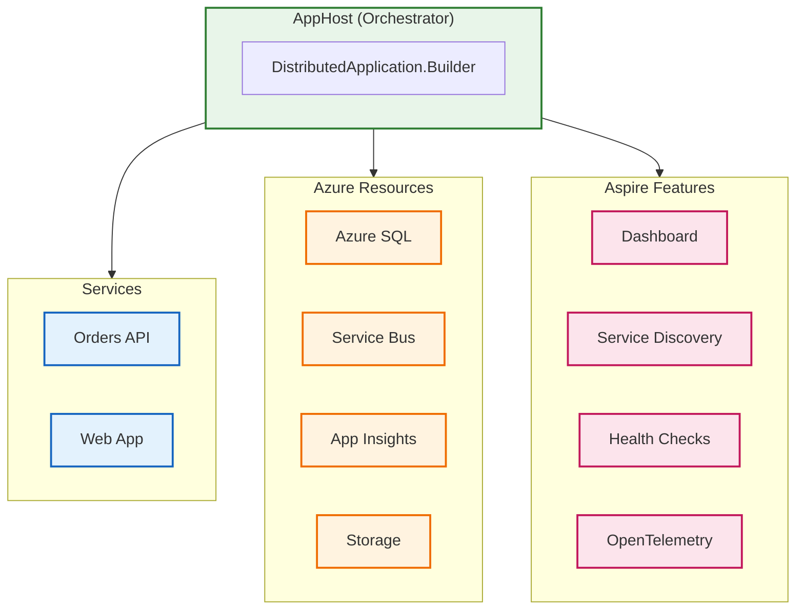

# ADR-001: .NET Aspire for Service Orchestration

[← ADR Index](README.md) | **ADR-001** | [ADR-002 →](ADR-002-service-bus-messaging.md)

---

## Metadata

| Field          | Value                                         |
| -------------- | --------------------------------------------- |
| **Status**     | ✅ Accepted                                   |
| **Date**       | 2024-01-01                                    |
| **Deciders**   | Architecture Team                             |
| **Categories** | Platform, Orchestration, Developer Experience |

---

## Context

### Problem Statement

The Azure Logic Apps Monitoring Solution requires orchestration of multiple interconnected services:

- **Orders API** (ASP.NET Core REST API)
- **Web App** (Blazor Server frontend)
- **Logic Apps** (Workflow automation)
- **Supporting infrastructure** (Service Bus, SQL Database, Application Insights)

Traditional approaches to local development and deployment involve:

1. Manual configuration of connection strings and endpoints
2. Docker Compose or Kubernetes for local orchestration
3. Separate deployment scripts for Azure resources
4. Manual correlation of observability data across services

### Requirements

| Requirement | Priority     | Description                               |
| ----------- | ------------ | ----------------------------------------- |
| **R1**      | Must Have    | Unified local development experience      |
| **R2**      | Must Have    | Seamless transition from local to Azure   |
| **R3**      | Should Have  | Built-in observability dashboard          |
| **R4**      | Should Have  | Service discovery without hard-coded URLs |
| **R5**      | Nice to Have | Support for Azure resource emulators      |

### Constraints

- Team expertise primarily in .NET ecosystem
- Existing codebase written in C#
- Azure as target cloud platform
- Requirement for both local and cloud deployment

---

## Decision

**We will use .NET Aspire 9.x as the service orchestration framework for local development and Azure deployment.**

### Implementation



### Key Implementation Details

1. **AppHost Project** ([app.AppHost/AppHost.cs](../../../app.AppHost/AppHost.cs))

   - Central orchestrator for all services
   - Configures Azure resource bindings
   - Manages local vs. Azure execution modes

2. **ServiceDefaults Library** ([app.ServiceDefaults/Extensions.cs](../../../app.ServiceDefaults/Extensions.cs))

   - Shared cross-cutting concerns
   - OpenTelemetry configuration
   - Health checks and resilience patterns

3. **Resource Configuration**

   ```csharp
   var builder = DistributedApplication.CreateBuilder(args);

   // Azure resources with local emulator fallback
   var sql = builder.AddAzureSqlServer("sql")
       .RunAsContainer()
       .AddDatabase("orderDb");

   var serviceBus = builder.AddAzureServiceBus("messaging")
       .AddTopic("ordersplaced");

   // Services with automatic discovery
   var api = builder.AddProject<Projects.eShop_Orders_API>("orders-api")
       .WithReference(sql)
       .WithReference(serviceBus);
   ```

---

## Consequences

### Positive

| Outcome                          | Impact | Measurement                                  |
| -------------------------------- | ------ | -------------------------------------------- |
| **Simplified local development** | High   | Single `dotnet run` starts all services      |
| **Automatic service discovery**  | High   | No manual URL configuration                  |
| **Built-in observability**       | High   | Aspire Dashboard shows traces, logs, metrics |
| **Azure-native deployment**      | Medium | Direct deployment to Container Apps          |
| **Reduced configuration drift**  | Medium | Same config for local and Azure              |

### Negative

| Outcome                      | Impact | Mitigation                          |
| ---------------------------- | ------ | ----------------------------------- |
| **Framework lock-in**        | Medium | Aspire is OSS and modular           |
| **Learning curve**           | Medium | Team training, documentation        |
| **Preview features**         | Low    | Using stable 9.x release            |
| **Limited non-.NET support** | Low    | Not applicable (pure .NET solution) |

### Risks

| Risk                 | Probability | Impact | Mitigation                       |
| -------------------- | ----------- | ------ | -------------------------------- |
| Aspire deprecation   | Low         | High   | Microsoft's strategic investment |
| Breaking changes     | Medium      | Medium | Pin to specific versions         |
| Performance overhead | Low         | Low    | Minimal runtime overhead         |

---

## Alternatives Considered

### Alternative 1: Docker Compose

| Aspect      | Assessment                                     |
| ----------- | ---------------------------------------------- |
| **Pros**    | Industry standard, language-agnostic           |
| **Cons**    | Manual service discovery, no Azure integration |
| **Verdict** | ❌ Rejected - Higher operational overhead      |

### Alternative 2: Kubernetes (Minikube/Kind)

| Aspect      | Assessment                                      |
| ----------- | ----------------------------------------------- |
| **Pros**    | Production-like environment                     |
| **Cons**    | Complex setup, resource-intensive               |
| **Verdict** | ❌ Rejected - Over-engineered for this use case |

### Alternative 3: Manual Configuration

| Aspect      | Assessment                              |
| ----------- | --------------------------------------- |
| **Pros**    | No additional dependencies              |
| **Cons**    | Error-prone, configuration drift        |
| **Verdict** | ❌ Rejected - Poor developer experience |

### Decision Matrix

| Criterion            | Weight | Aspire  | Docker Compose | Kubernetes | Manual |
| -------------------- | ------ | ------- | -------------- | ---------- | ------ |
| Developer Experience | 30%    | 5       | 3              | 2          | 2      |
| Azure Integration    | 25%    | 5       | 2              | 3          | 2      |
| Observability        | 20%    | 5       | 2              | 3          | 1      |
| Learning Curve       | 15%    | 4       | 4              | 2          | 5      |
| Flexibility          | 10%    | 3       | 4              | 5          | 3      |
| **Weighted Score**   |        | **4.6** | 2.9            | 2.7        | 2.4    |

---

## References

- [.NET Aspire Documentation](https://learn.microsoft.com/dotnet/aspire/)
- [AppHost.cs](../../../app.AppHost/AppHost.cs)
- [Extensions.cs](../../../app.ServiceDefaults/Extensions.cs)
- [Technology Architecture](../04-technology-architecture.md)

---

**Next:** [ADR-002: Azure Service Bus for Event-Driven Messaging →](ADR-002-service-bus-messaging.md)
