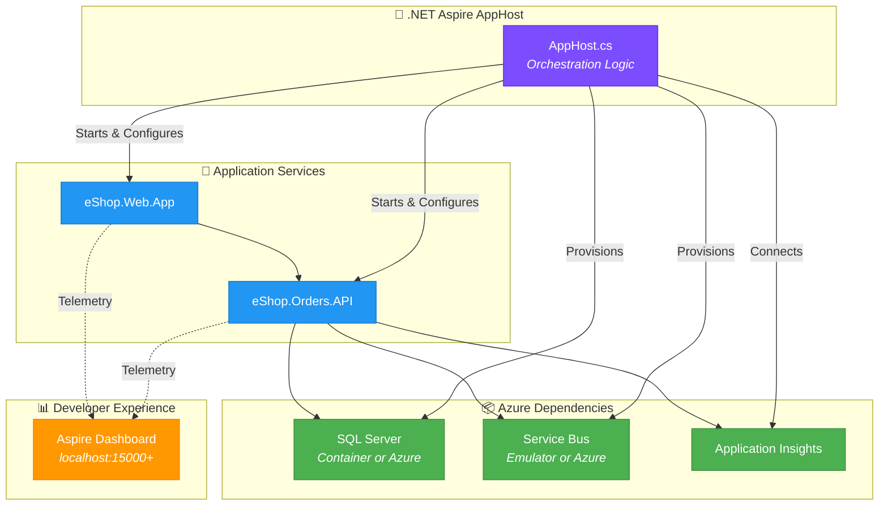

# ADR-001: .NET Aspire for Local Development Orchestration

## Status

**Accepted** - January 2025

## Context

The Azure Logic Apps Monitoring Solution is a cloud-native distributed application consisting of multiple services:
- **eShop.Orders.API** - REST API for order management
- **eShop.Web.App** - Blazor Server frontend
- **OrdersManagement Logic App** - Workflow automation
- **Azure SQL Database** - Order persistence
- **Azure Service Bus** - Asynchronous messaging

**Challenges faced during development:**
1. Starting multiple services manually is error-prone and time-consuming
2. Service discovery between components requires hardcoded URLs or configuration
3. Azure dependency emulation (SQL, Service Bus) requires manual Docker container management
4. Configuration management differs significantly between local and cloud environments
5. Debugging distributed issues is difficult without coordinated telemetry

**Requirements:**
- Single-command startup for all services
- Automatic service discovery without hardcoded URLs
- Local emulation of Azure services
- Consistent configuration management
- Integrated telemetry dashboard

## Decision

Adopt **.NET Aspire 9.x** as the local development orchestration framework.



**Key implementation patterns:**

1. **Service Registration:**
   ```csharp
   var api = builder.AddProject<Projects.eShop_Orders_API>("api");
   var web = builder.AddProject<Projects.eShop_Web_App>("web")
       .WithReference(api);
   ```

2. **Azure Resource Emulation:**
   ```csharp
   var sqlServer = builder.AddSqlServer("sql").RunAsContainer();
   var serviceBus = builder.AddAzureServiceBus("messaging").RunAsEmulator();
   ```

3. **Environment-Aware Configuration:**
   ```csharp
   if (useAzure)
       ConfigureSQLAzure(builder);
   else
       sqlServer.RunAsContainer();
   ```

## Consequences

### Positive

| Benefit | Impact |
|---------|--------|
| **Single-command startup** | `dotnet run` starts all services, databases, and message brokers |
| **Automatic service discovery** | No hardcoded URLs; Aspire injects connection strings automatically |
| **Integrated dashboard** | Real-time logs, traces, and metrics in one place |
| **Dev/prod parity** | Same configuration patterns locally and in Azure |
| **Container orchestration** | SQL Server and Service Bus emulators managed automatically |
| **Shared defaults** | `ServiceDefaults` project provides consistent cross-cutting concerns |

### Negative

| Tradeoff | Mitigation |
|----------|------------|
| **Preview technology** | Aspire 9.x is GA; monitor for breaking changes |
| **Learning curve** | Team requires training on Aspire patterns |
| **Windows Docker dependency** | Required for local emulators; CI/CD uses Azure |
| **IDE support** | Best experience in Visual Studio 2022+ or VS Code with C# Dev Kit |

### Neutral

- Aspire is optional for deployment—Azure resources deploy independently via Bicep
- Logic Apps workflows are not orchestrated by Aspire (deployed separately)

## Alternatives Considered

### 1. Docker Compose

**Description:** Use docker-compose.yml to define and run multi-container applications.

**Rejected because:**
- Manual service discovery configuration required
- No integrated telemetry dashboard
- Separate configuration files for local vs. cloud
- No native .NET integration

### 2. Kubernetes (minikube/kind)

**Description:** Run a local Kubernetes cluster for development.

**Rejected because:**
- Significant overhead for local development
- Complex configuration for simple scenarios
- Slow startup times
- Overkill for single-developer scenarios

### 3. Manual Process Management

**Description:** Developers start each service manually in separate terminals.

**Rejected because:**
- Error-prone and time-consuming
- No coordinated logging or tracing
- Difficult to ensure correct startup order
- Configuration drift between developers

### 4. Tye (Project Tye)

**Description:** Microsoft's predecessor to Aspire for microservice orchestration.

**Rejected because:**
- Project archived; no longer maintained
- Aspire is the official successor with broader capabilities
- Missing Azure resource integration

## References

- [.NET Aspire Documentation](https://learn.microsoft.com/dotnet/aspire/)
- [.NET Aspire GitHub Repository](https://github.com/dotnet/aspire)
- [AppHost Implementation](../../../app.AppHost/AppHost.cs)
- [ServiceDefaults Implementation](../../../app.ServiceDefaults/Extensions.cs)

---

← [ADR Index](README.md) | [ADR-002: Service Bus Messaging →](ADR-002-service-bus-messaging.md)
