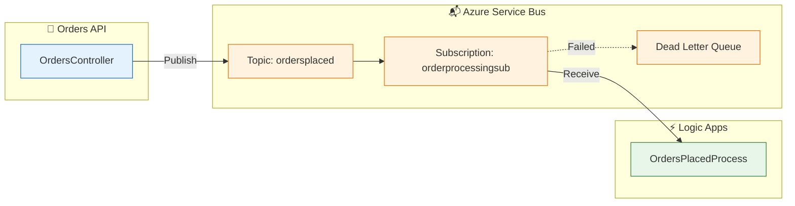

# ADR-002: Azure Service Bus for Asynchronous Messaging

← [ADR-001](ADR-001-aspire-orchestration.md) | [ADR Index](README.md) | [ADR-003 →](ADR-003-observability-strategy.md)

---

## Status

🟢 **Accepted** — January 2024

---

## Context

The order processing workflow requires **asynchronous communication** between:

1. **Orders API** — Creates orders and emits events
2. **Logic Apps** — Processes order events and performs downstream actions

**Requirements:**

- **Reliability** — Messages must not be lost during processing failures
- **Scalability** — Handle variable order volumes (batch operations)
- **Observability** — Trace messages end-to-end across services
- **Ordering** — Process messages in FIFO order when required (sessions)
- **Dead-lettering** — Capture failed messages for analysis
- **Local development** — Test messaging without Azure costs

**Question:** What messaging platform should we use for reliable, observable event-driven communication?

---

## Decision

**We will use Azure Service Bus with Topics and Subscriptions for event-driven messaging.**

### Implementation

#### Topic/Subscription Topology



#### Message Publishing (Orders API)

From [OrdersMessageHandler.cs](../../../src/eShop.Orders.API/Handlers/OrdersMessageHandler.cs):

```csharp
public async Task SendOrderCreatedMessageAsync(Order order)
{
    var message = new ServiceBusMessage(JsonSerializer.SerializeToUtf8Bytes(order))
    {
        ContentType = "application/json",
        Subject = "OrderCreated",
        MessageId = order.Id.ToString(),
        CorrelationId = Activity.Current?.TraceId.ToString()
    };

    // W3C Trace Context propagation
    if (Activity.Current != null)
    {
        message.ApplicationProperties["traceparent"] = Activity.Current.Id;
        message.ApplicationProperties["tracestate"] = Activity.Current.TraceStateString;
    }

    await _sender.SendMessageAsync(message);
}
```

#### Message Consumption (Logic Apps)

Defined in [workflow.json](../../../workflows/OrdersManagement/OrdersManagementLogicApp/OrdersPlacedProcess/workflow.json):

```json
{
  "triggers": {
    "When_messages_are_available_in_a_topic_subscription": {
      "type": "ServiceProvider",
      "inputs": {
        "parameters": {
          "topicName": "ordersplaced",
          "subscriptionName": "orderprocessingsub"
        },
        "serviceProviderConfiguration": {
          "operationId": "receiveTopicMessages"
        }
      }
    }
  }
}
```

### Key Decisions

| Aspect             | Decision               | Rationale                         |
| ------------------ | ---------------------- | --------------------------------- |
| **Pattern**        | Topics & Subscriptions | Pub/sub for multiple consumers    |
| **Tier**           | Standard               | Sessions, large messages support  |
| **Authentication** | Managed Identity       | No connection string secrets      |
| **Serialization**  | JSON                   | Human-readable, Logic Apps native |
| **Tracing**        | W3C Trace Context      | End-to-end correlation            |

---

## Consequences

### Positive

| Benefit            | Description                                |
| ------------------ | ------------------------------------------ |
| **Decoupling**     | API doesn't wait for Logic Apps processing |
| **Reliability**    | At-least-once delivery with retries        |
| **Observability**  | `traceparent` propagates through messages  |
| **Scalability**    | Logic Apps auto-scales with queue depth    |
| **Dead-lettering** | Failed messages captured for debugging     |
| **Local dev**      | Service Bus emulator via .NET Aspire       |

### Negative

| Drawback                 | Mitigation                              |
| ------------------------ | --------------------------------------- | ------------------------------ |
| **Eventual consistency** | API returns before processing completes | Acceptable for order events    |
| **Cost**                 | Per-message pricing                     | Standard tier optimizes costs  |
| **Complexity**           | Additional component to manage          | Bicep IaC handles provisioning |

### Neutral

- Messages are persisted for 14 days (default retention)
- Topic partitioning is disabled (not needed at current scale)
- Session support available but not currently used

---

## Alternatives Considered

### Alternative 1: Azure Storage Queues

```csharp
// Storage Queue approach
await queueClient.SendMessageAsync(JsonSerializer.Serialize(order));
```

| Criteria           | Assessment                                   |
| ------------------ | -------------------------------------------- |
| **Pros**           | Lower cost, simpler API                      |
| **Cons**           | No pub/sub, no dead-letter, limited features |
| **Why not chosen** | Need topic fanout and advanced features      |

### Alternative 2: Azure Event Grid

| Criteria           | Assessment                             |
| ------------------ | -------------------------------------- |
| **Pros**           | Push model, built-in Azure integration |
| **Cons**           | At-most-once delivery, no message peek |
| **Why not chosen** | Need at-least-once reliability         |

### Alternative 3: Azure Event Hubs

| Criteria           | Assessment                                     |
| ------------------ | ---------------------------------------------- |
| **Pros**           | High throughput, event streaming               |
| **Cons**           | Designed for big data, complex consumer groups |
| **Why not chosen** | Overkill for order event volumes               |

### Alternative 4: RabbitMQ (self-hosted)

| Criteria           | Assessment                               |
| ------------------ | ---------------------------------------- |
| **Pros**           | Open source, flexible routing            |
| **Cons**           | Operational overhead, no managed service |
| **Why not chosen** | Prefer managed services                  |

---

## Message Contract

### Order Created Event

```json
{
  "id": "c7d14f9e-3c4e-4f5a-9b2d-1234567890ab",
  "customerId": "CUST-001",
  "items": [
    {
      "productId": "PROD-001",
      "quantity": 2,
      "price": 29.99
    }
  ],
  "total": 59.98,
  "createdDate": "2024-01-15T10:30:00Z"
}
```

### Message Properties

| Property        | Value              | Purpose                   |
| --------------- | ------------------ | ------------------------- |
| `ContentType`   | `application/json` | Serialization format      |
| `Subject`       | `OrderCreated`     | Event type                |
| `MessageId`     | Order ID           | Deduplication             |
| `CorrelationId` | Trace ID           | Distributed tracing       |
| `traceparent`   | W3C format         | OpenTelemetry propagation |

---

## Validation

The decision is validated by:

1. **Reliability testing** — Messages survive API restarts
2. **Observability** — Traces flow from API → Service Bus → Logic Apps
3. **Local development** — Emulator provides realistic testing
4. **Production monitoring** — Dead-letter queue remains empty

---

## Related ADRs

- [ADR-001](ADR-001-aspire-orchestration.md) — Aspire orchestrates Service Bus emulator
- [ADR-003](ADR-003-observability-strategy.md) — Trace context propagation strategy

---

## References

- [Azure Service Bus Documentation](https://learn.microsoft.com/azure/service-bus-messaging/)
- [W3C Trace Context](https://www.w3.org/TR/trace-context/)
- [infra/workload/messaging/](../../../infra/workload/messaging/) — Bicep configuration

---

_Last Updated: January 2026_
