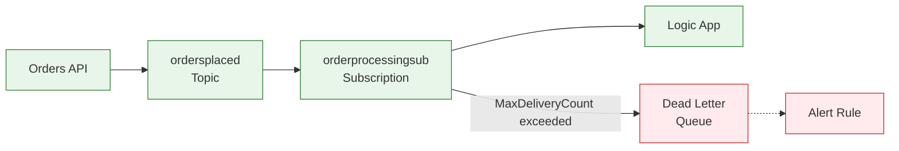

# ADR-002: Use Azure Service Bus for Async Messaging

← [ADR-001](ADR-001-aspire-orchestration.md) | **ADR-002** | [ADR-003 →](ADR-003-observability-strategy.md)

---

## Status

✅ **Accepted**

## Date

2025-01

## Context

The Azure Logic Apps Monitoring Solution requires asynchronous communication between:

- **Orders API** (message publisher)
- **Logic Apps** (message consumer and processor)

Key requirements:

1. **Reliability**: Messages must not be lost even during component failures
2. **Decoupling**: Publisher and consumer operate independently
3. **Scalability**: Handle variable message volumes
4. **Observability**: End-to-end tracing across async boundaries
5. **Azure Integration**: Native integration with Logic Apps

### Message Flow

```
Order Created → API publishes message → Service Bus → Logic App triggers → Process order
```

### Forces

| Force                    | Direction                              |
| ------------------------ | -------------------------------------- |
| Reliability requirements | ↗️ Enterprise-grade messaging          |
| Azure ecosystem          | ↗️ Native Azure service                |
| Cost optimization        | ↘️ Pay-per-message pricing             |
| Complexity               | ↘️ Additional infrastructure component |

## Decision

**Use Azure Service Bus Standard tier** with topic/subscription pattern for async messaging between the Orders API and Logic Apps.

### Implementation Details

1. **Namespace Configuration**:
   - SKU: Standard
   - Managed Identity authentication
   - Topic: `ordersplaced`
   - Subscription: `orderprocessingsub`

2. **Message Structure**:

```json
{
  "OrderId": "ORD-2025-001",
  "CreatedAt": "2025-01-20T10:30:00Z",
  "Status": "OrderPlaced",
  "CustomerDetails": { ... },
  "Total": 299.99
}
```

3. **Publishing Pattern** (from `OrdersMessageHandler.cs`):

```csharp
public async Task SendOrderPlacedMessageAsync(OrderEntity order)
{
    var message = new ServiceBusMessage(
        BinaryData.FromObjectAsJson(order))
    {
        ContentType = "application/json",
        MessageId = order.OrderId
    };

    // Trace context propagation
    message.ApplicationProperties["TraceId"] = Activity.Current?.TraceId.ToString();
    message.ApplicationProperties["SpanId"] = Activity.Current?.SpanId.ToString();

    await _sender.SendMessageAsync(message);
}
```

4. **Logic App Trigger**:

```json
{
  "triggers": {
    "When_a_message_is_received_in_a_topic_subscription": {
      "type": "ServiceProvider",
      "inputs": {
        "parameters": {
          "topicName": "ordersplaced",
          "subscriptionName": "orderprocessingsub"
        },
        "serviceProviderConfiguration": {
          "operationId": "receiveTopicMessages"
        }
      }
    }
  }
}
```

## Consequences

### Positive

| Benefit                        | Impact                                       |
| ------------------------------ | -------------------------------------------- |
| **At-Least-Once Delivery**     | Messages survive crashes and restarts        |
| **Topic/Subscription Model**   | Multiple consumers can process same messages |
| **Dead Letter Queue**          | Failed messages preserved for analysis       |
| **Native Logic App Connector** | Zero-code trigger configuration              |
| **Managed Identity Support**   | No secrets for authentication                |
| **Message Sessions**           | FIFO ordering when needed                    |

### Negative

| Tradeoff                 | Mitigation                                      |
| ------------------------ | ----------------------------------------------- |
| **Added Latency**        | Async pattern acceptable for order processing   |
| **Message Ordering**     | Use message sessions if strict ordering needed  |
| **Cost per Message**     | Standard tier pricing, monitor with cost alerts |
| **Eventual Consistency** | Design workflows to handle idempotency          |

### Neutral

- Message size limit (256 KB Standard) sufficient for order payloads
- 14-day message retention adequate for processing
- Topic/subscription matches pub/sub requirements

## Alternatives Considered

### 1. Azure Storage Queues

**Description**: Simple queue service built on Azure Storage

**Why Not Chosen**:

- No topic/subscription pattern
- Limited message features (no dead-lettering)
- No native Logic App trigger
- Less suitable for enterprise messaging

### 2. Azure Event Grid

**Description**: Event-driven routing service

**Why Not Chosen**:

- Push-based, not pull-based
- Best for event notification, not message processing
- Less control over consumption patterns
- Different reliability model

### 3. Azure Event Hubs

**Description**: Big data streaming platform

**Why Not Chosen**:

- Optimized for high-volume streaming
- Consumer group model more complex
- Overkill for order processing volumes
- Higher cost at low volumes

### 4. Direct HTTP Calls

**Description**: API calls Logic App directly

**Why Not Chosen**:

- Tight coupling between services
- No retry/reliability guarantees
- Synchronous blocking
- No message buffering during outages

## Message Patterns

### Dead Letter Handling



### Retry Configuration

| Setting             | Value     | Purpose                        |
| ------------------- | --------- | ------------------------------ |
| Max Delivery Count  | 10        | Attempts before dead-lettering |
| Lock Duration       | 5 minutes | Processing time before requeue |
| Auto-delete on idle | Disabled  | Preserve for monitoring        |

## Related Decisions

- [ADR-001: Aspire Orchestration](ADR-001-aspire-orchestration.md) - Service Bus configured via Aspire
- [ADR-003: Observability Strategy](ADR-003-observability-strategy.md) - Trace context propagation in messages

## References

- [Azure Service Bus Documentation](https://learn.microsoft.com/azure/service-bus-messaging/)
- [Service Bus Topics and Subscriptions](https://learn.microsoft.com/azure/service-bus-messaging/service-bus-queues-topics-subscriptions)
- [Logic Apps Service Bus Connector](https://learn.microsoft.com/azure/connectors/connectors-create-api-servicebus)

---

_← [ADR-001](ADR-001-aspire-orchestration.md) | [ADR-003 →](ADR-003-observability-strategy.md)_
