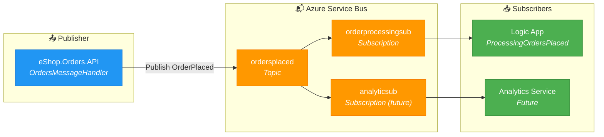

# ADR-002: Azure Service Bus for Asynchronous Messaging

## Status

**Accepted** - January 2025

## Context

The eShop order management system requires a reliable mechanism to notify downstream systems when orders are created or modified. The workflow requirements include:

1. **Decoupled processing:** Order API should not block waiting for downstream processing
2. **Reliable delivery:** Order events must not be lost during processing failures
3. **Multiple consumers:** Different systems may need to react to the same order event
4. **Ordered processing:** Order events should be processed in creation sequence when possible
5. **Observability:** End-to-end tracing across service boundaries

**Business scenarios:**
- Order confirmation emails
- Inventory updates
- Shipping label generation
- Analytics and reporting
- Logic App workflow automation

**Technical constraints:**
- Must integrate with Azure ecosystem
- Support for managed identity authentication
- Compatible with .NET Aspire local development
- Observable via OpenTelemetry

## Decision

Adopt **Azure Service Bus** with **Topics and Subscriptions** for publish-subscribe messaging.



**Key implementation patterns:**

1. **Topic/Subscription Model:**
   ```csharp
   // Configure in AppHost
   var messaging = builder.AddAzureServiceBus("messaging")
       .AddTopic("ordersplaced", topic =>
       {
           topic.AddSubscription("orderprocessingsub");
       });
   ```

2. **Managed Identity Authentication:**
   ```csharp
   services.AddAzureServiceBusClient(settings =>
   {
       settings.FullyQualifiedNamespace = config["ServiceBusNamespace"];
       settings.Credential = new DefaultAzureCredential();
   });
   ```

3. **Trace Context Propagation:**
   ```csharp
   var activity = Activity.Current;
   if (activity != null)
   {
       message.ApplicationProperties["traceparent"] = activity.Id;
       message.ApplicationProperties["tracestate"] = activity.TraceStateString;
   }
   ```

## Consequences

### Positive

| Benefit | Impact |
|---------|--------|
| **Decoupled architecture** | Order API responds immediately; processing happens asynchronously |
| **Fan-out capability** | Multiple subscriptions can process the same message independently |
| **Reliable delivery** | Built-in dead-letter queues handle processing failures |
| **Session support** | Optional message ordering by session ID (e.g., OrderId) |
| **Managed identity** | No connection strings or secrets to manage |
| **Native emulator** | Local development without Azure costs |
| **Trace context** | W3C traceparent propagation enables end-to-end tracing |

### Negative

| Tradeoff | Mitigation |
|----------|------------|
| **Eventual consistency** | UI must handle "processing" state; use polling or SignalR |
| **Message ordering** | Sessions add complexity; evaluate if ordering is truly required |
| **Cost** | Standard tier required for Topics; ~$10/month base |
| **Operational complexity** | Dead-letter queue monitoring required |

### Neutral

- Messages are JSON-serialized Order objects
- Maximum message size is 256 KB (Standard tier)
- Message TTL is 14 days (configurable)

## Message Schema

```json
{
  "Order": {
    "Id": 1,
    "CustomerName": "John Doe",
    "CustomerEmail": "john@example.com",
    "ShippingAddress": "123 Main St",
    "Total": 99.99,
    "Status": "Placed",
    "CreatedAt": "2025-01-15T10:30:00Z",
    "Products": [
      {
        "OrderProductId": 1,
        "ProductId": 101,
        "ProductName": "Widget",
        "Quantity": 2,
        "UnitPrice": 49.99
      }
    ]
  }
}
```

## Alternatives Considered

### 1. Azure Queue Storage

**Description:** Simple queue storage for point-to-point messaging.

**Rejected because:**
- No pub-sub capability (no topics/subscriptions)
- Limited dead-letter queue support
- No message sessions
- Basic SLA compared to Service Bus

### 2. Azure Event Grid

**Description:** Event routing service for reactive event-driven architectures.

**Rejected because:**
- Push-based delivery requires exposed HTTP endpoints
- Less suitable for workflow-style processing
- Message retention limited to 24 hours
- Better suited for infrastructure events than business events

### 3. Azure Event Hubs

**Description:** Big data streaming platform for high-throughput event ingestion.

**Rejected because:**
- Optimized for streaming, not message queuing
- Consumer must track offsets
- Overkill for order-scale volumes (~1000s/day)
- Higher cost for low-throughput scenarios

### 4. RabbitMQ

**Description:** Open-source message broker with AMQP support.

**Rejected because:**
- Requires self-hosting or third-party managed service
- No native Azure integration
- Additional operational burden
- Missing Azure-native features (managed identity, diagnostics)

### 5. Direct HTTP Calls

**Description:** Order API calls downstream services synchronously.

**Rejected because:**
- Tight coupling between services
- Cascading failures affect order creation
- No retry/resilience without custom implementation
- Poor scalability under load

## References

- [Azure Service Bus Documentation](https://learn.microsoft.com/azure/service-bus-messaging/)
- [Service Bus Topics and Subscriptions](https://learn.microsoft.com/azure/service-bus-messaging/service-bus-queues-topics-subscriptions)
- [OrdersMessageHandler Implementation](../../../src/eShop.Orders.API/Handlers/OrdersMessageHandler.cs)
- [Messaging Infrastructure](../../../infra/workload/messaging/main.bicep)

---

← [ADR-001: Aspire Orchestration](ADR-001-aspire-orchestration.md) | [ADR-003: Observability Strategy →](ADR-003-observability-strategy.md)
