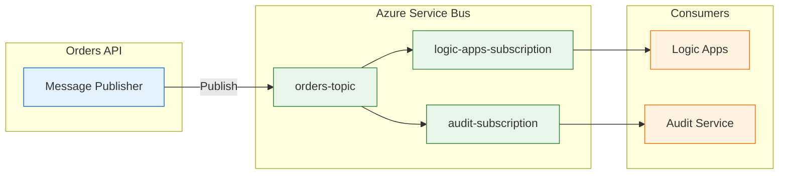
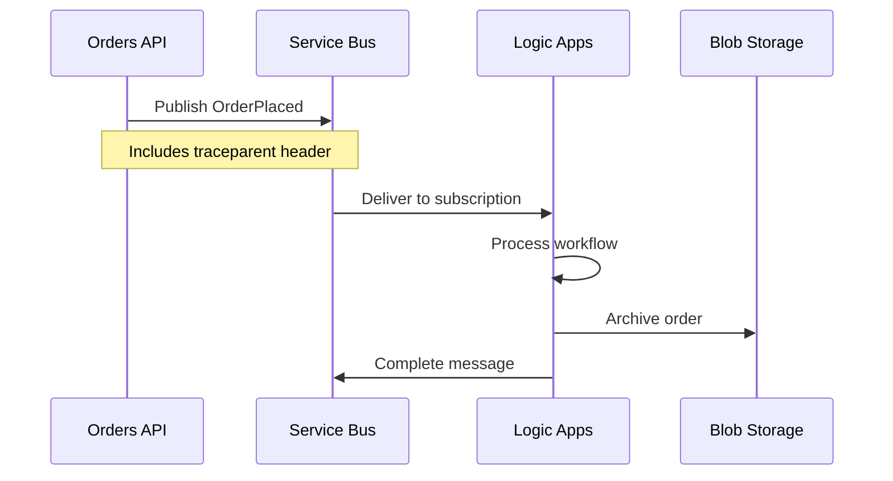

# ADR-002: Azure Service Bus for Asynchronous Messaging

[← ADR-001](ADR-001-aspire-orchestration.md) | [ADR Index](README.md) | [ADR-003 →](ADR-003-observability-strategy.md)

## Status

**Accepted** (January 2026)

## Context

The order management system requires communication between the Orders API and downstream workflow processors. Orders placed through the API must trigger Logic Apps workflows for further processing (validation, notification, archival).

### Requirements

1. **Decoupling**: API and workflows should not be tightly coupled
2. **Reliability**: Messages must not be lost during processing
3. **Ordering**: Order processing should maintain sequence when required
4. **Scalability**: Handle varying load without message loss
5. **Observability**: Message flow must be traceable end-to-end

### Communication Patterns Needed

| Pattern           | Use Case                             |
| ----------------- | ------------------------------------ |
| **Pub/Sub**       | Multiple subscribers to order events |
| **Request/Reply** | Not required                         |
| **Queue**         | Single consumer processing           |
| **Dead Letter**   | Failed message handling              |

### Options Considered

| Option                   | Pros                                      | Cons                                   |
| ------------------------ | ----------------------------------------- | -------------------------------------- |
| **Azure Service Bus**    | Enterprise-grade, Topics/Queues, Sessions | Cost at scale                          |
| **Azure Storage Queues** | Simple, cheap                             | No topics, limited features            |
| **Azure Event Grid**     | Event-driven, serverless                  | Not for messaging workloads            |
| **Azure Event Hubs**     | High throughput                           | Optimized for streaming, not messaging |
| **RabbitMQ**             | Feature-rich, portable                    | Self-managed, operational overhead     |

## Decision

**We will use Azure Service Bus (Standard tier) for asynchronous messaging.**

### Rationale

1. **Topic-Subscription Model**: Enables pub/sub pattern where multiple subscribers (Logic Apps, future services) can receive order events
2. **Message Sessions**: Maintains order processing sequence when required
3. **Dead Letter Queues**: Built-in handling for failed messages
4. **Managed Identity Support**: No connection strings needed
5. **Aspire Integration**: Native support in .NET Aspire with local emulation
6. **Logic Apps Connector**: First-class integration with Logic Apps Standard

### Topic/Subscription Design



### Implementation

**Message Handler with Trace Context Propagation:**

```csharp
// OrdersMessageHandler.cs
public async Task SendOrderPlacedMessageAsync(Order order)
{
    var message = new ServiceBusMessage(
        JsonSerializer.SerializeToUtf8Bytes(order))
    {
        ContentType = "application/json",
        Subject = "OrderPlaced",
        MessageId = Guid.NewGuid().ToString()
    };

    // Propagate W3C Trace Context
    if (Activity.Current != null)
    {
        message.ApplicationProperties["traceparent"] =
            Activity.Current.Id;
        message.ApplicationProperties["tracestate"] =
            Activity.Current.TraceStateString ?? "";
    }

    await _sender.SendMessageAsync(message);
}
```

**Service Bus Client Configuration:**

```csharp
// Extensions.cs
public static IHostApplicationBuilder AddAzureServiceBusClient(
    this IHostApplicationBuilder builder,
    string connectionName = "messaging")
{
    var credential = new DefaultAzureCredential();

    builder.Services.AddSingleton(sp =>
    {
        var hostName = builder.Configuration[$"Azure:ServiceBus:HostName"];
        return new ServiceBusClient(hostName, credential, new ServiceBusClientOptions
        {
            TransportType = ServiceBusTransportType.AmqpWebSockets,
            RetryOptions = new ServiceBusRetryOptions
            {
                MaxRetries = 3,
                Delay = TimeSpan.FromSeconds(1)
            }
        });
    });

    return builder;
}
```

### Message Contract

| Property                            | Type   | Description                                |
| ----------------------------------- | ------ | ------------------------------------------ |
| `MessageId`                         | string | Unique message identifier                  |
| `Subject`                           | string | Message type (OrderPlaced, OrderCompleted) |
| `ContentType`                       | string | application/json                           |
| `Body`                              | Order  | Serialized order data                      |
| `ApplicationProperties.traceparent` | string | W3C trace context                          |
| `ApplicationProperties.tracestate`  | string | Trace state                                |

## Consequences

### Positive

| Benefit            | Impact                                   |
| ------------------ | ---------------------------------------- |
| **Loose coupling** | API independent of workflow processing   |
| **Reliability**    | At-least-once delivery guarantees        |
| **Scalability**    | Handle traffic spikes without data loss  |
| **Traceability**   | End-to-end correlation via trace context |
| **Extensibility**  | Add new subscribers without API changes  |

### Negative

| Trade-off                | Mitigation                                 |
| ------------------------ | ------------------------------------------ |
| **Cost**                 | Standard tier sufficient; monitor usage    |
| **Complexity**           | Dead letter monitoring, retry logic needed |
| **Eventual consistency** | Acceptable for this use case               |
| **Message ordering**     | Use sessions when strict ordering required |

### Neutral

- Messages limited to 256 KB (Standard tier) - sufficient for order data
- 14-day message retention (configurable)
- Requires Service Bus namespace management

## Message Flow Sequence



## Related Decisions

- [ADR-001](ADR-001-aspire-orchestration.md) - Aspire provides Service Bus emulation
- [ADR-003](ADR-003-observability-strategy.md) - Trace context propagation strategy

## References

- [Azure Service Bus Documentation](https://learn.microsoft.com/en-us/azure/service-bus-messaging/)
- [src/eShop.Orders.API/Handlers/OrdersMessageHandler.cs](../../src/eShop.Orders.API/Handlers/OrdersMessageHandler.cs)
- [workflows/OrdersManagement/OrdersPlacedProcess/workflow.json](../../workflows/OrdersManagement/OrdersPlacedProcess/workflow.json)
- [Data Architecture](../02-data-architecture.md)

---

_Last Updated: January 2026_
