# ADR-002: Azure Service Bus for Event Messaging

## Status

**Accepted** - January 2024

## Context

The eShop Orders Management solution requires asynchronous communication between services:

- **Orders API** needs to notify downstream systems when orders are placed
- **Logic Apps** workflows need to process order events
- The system must support multiple subscribers to order events
- Message delivery must be reliable with at-least-once semantics

### Requirements

| Requirement                | Priority | Description                               |
| -------------------------- | -------- | ----------------------------------------- |
| **Pub/Sub Pattern**        | High     | Multiple subscribers to order events      |
| **Reliable Delivery**      | High     | At-least-once message delivery            |
| **Azure Native**           | High     | First-party Azure service for integration |
| **Managed Identity**       | High     | No credential storage                     |
| **Logic Apps Integration** | Medium   | Native connector support                  |
| **Cost Effective**         | Medium   | Development workload pricing              |

### Options Considered

| Option                     | Pros                                                                | Cons                                           |
| -------------------------- | ------------------------------------------------------------------- | ---------------------------------------------- |
| **Azure Service Bus**      | Native Logic Apps connector, Topics/Subscriptions, Managed Identity | Learning curve, Basic tier limitations         |
| **Azure Event Grid**       | Push-based, serverless pricing                                      | Less control over delivery, no message queuing |
| **Azure Event Hubs**       | High throughput, partitioning                                       | Overkill for order volumes, retention limits   |
| **Azure Storage Queues**   | Simple, cheap                                                       | No pub/sub, no Logic Apps trigger              |
| **RabbitMQ (self-hosted)** | Full control, feature-rich                                          | Operational overhead, no managed service       |

## Decision

We will use **Azure Service Bus (Basic tier)** with Topics and Subscriptions for event messaging.

### Implementation

**Topic/Subscription Structure:**

```
Service Bus Namespace
└── ordersplaced (Topic)
    └── orderprocessingsub (Subscription)
        └── Logic Apps Trigger
```

**Infrastructure:** [infra/workload/messaging/main.bicep](../../../infra/workload/messaging/main.bicep)

```bicep
resource serviceBusNamespace 'Microsoft.ServiceBus/namespaces@2022-10-01-preview' = {
  name: serviceBusName
  location: location
  sku: { name: 'Basic', tier: 'Basic' }
}

resource ordersPlacedTopic 'Microsoft.ServiceBus/namespaces/topics@2022-10-01-preview' = {
  parent: serviceBusNamespace
  name: 'ordersplaced'
}

resource orderProcessingSubscription 'Microsoft.ServiceBus/namespaces/topics/subscriptions@2022-10-01-preview' = {
  parent: ordersPlacedTopic
  name: 'orderprocessingsub'
}
```

**Message Publishing:** [src/eShop.Orders.API/Handlers/OrdersMessageHandler.cs](../../../src/eShop.Orders.API/Handlers/OrdersMessageHandler.cs)

```csharp
public async Task PublishOrderPlacedAsync(Order order)
{
    var message = new ServiceBusMessage(JsonSerializer.SerializeToUtf8Bytes(order))
    {
        ContentType = "application/json",
        Subject = "OrderPlaced",
        MessageId = Guid.NewGuid().ToString()
    };

    // Propagate trace context for distributed tracing
    if (Activity.Current != null)
    {
        message.ApplicationProperties["traceparent"] = Activity.Current.Id;
    }

    await _sender.SendMessageAsync(message);
}
```

**Logic Apps Trigger:** [workflows/OrdersManagement/ProcessingOrdersPlaced/workflow.json](../../../workflows/OrdersManagement/OrdersManagementLogicApp/ProcessingOrdersPlaced/workflow.json)

```json
"triggers": {
  "When_messages_are_available_in_a_topic_subscription_(peek-lock)": {
    "type": "ServiceProvider",
    "inputs": {
      "parameters": {
        "topicName": "ordersplaced",
        "subscriptionName": "orderprocessingsub"
      }
    }
  }
}
```

### Authentication

All Service Bus access uses **Managed Identity** with RBAC:

| Role                            | Principal  | Purpose          |
| ------------------------------- | ---------- | ---------------- |
| Azure Service Bus Data Sender   | Orders API | Publish messages |
| Azure Service Bus Data Receiver | Logic Apps | Receive messages |

## Consequences

### Positive

1. **Native Azure Integration** - First-party service with Logic Apps connector
2. **Pub/Sub Pattern** - Topics allow multiple subscribers without sender changes
3. **Reliable Delivery** - At-least-once semantics with dead-letter queue support
4. **Managed Identity** - No connection string secrets in application code
5. **Distributed Tracing** - Trace context propagation via application properties
6. **Local Development** - Service Bus Emulator available via .NET Aspire

### Negative

1. **Basic Tier Limitations**:
   - No Sessions (ordered processing)
   - No Partitioning (scale limits)
   - Limited message size (256 KB)
   - No duplicate detection
2. **Cost at Scale** - Per-message pricing can increase with volume
3. **Regional Dependency** - Single-region deployment (no geo-DR)

### Tier Selection Rationale

**Basic tier** was chosen for this development/demo workload because:

- Lower cost for development
- Sufficient features for simple pub/sub
- Easy upgrade path to Standard/Premium

**Production Recommendation:** Upgrade to **Standard** or **Premium** tier for:

- Larger message sizes
- Duplicate detection
- Message sessions
- Geo-disaster recovery

### Production Tier Upgrade Decision Matrix

Use the following decision matrix to determine when to upgrade from Basic tier:

```mermaid
%%{init: {'theme': 'base', 'themeVariables': { 'fontSize': '14px'}}}%%
flowchart TB
    Start["🤔 Evaluate Service Bus Tier"] --> Q1{"Message size > 256 KB?"}
    Q1 -->|Yes| Premium["💎 Premium Tier"]
    Q1 -->|No| Q2{"Need ordered processing<br/>(Sessions)?"}
    Q2 -->|Yes| Standard["⭐ Standard Tier"]
    Q2 -->|No| Q3{"Need duplicate detection?"}
    Q3 -->|Yes| Standard
    Q3 -->|No| Q4{"Message volume<br/>> 10K/day?"}
    Q4 -->|Yes| Q5{"Need geo-DR or<br/>Private Endpoints?"}
    Q4 -->|No| Basic["📦 Basic Tier"]
    Q5 -->|Yes| Premium
    Q5 -->|No| Standard

    classDef basic fill:#e8f5e9,stroke:#2e7d32,stroke-width:2px,color:#1b5e20
    classDef standard fill:#fff3e0,stroke:#e65100,stroke-width:2px,color:#bf360c
    classDef premium fill:#f3e5f5,stroke:#7b1fa2,stroke-width:2px,color:#4a148c
    classDef decision fill:#e3f2fd,stroke:#1565c0,stroke-width:2px,color:#0d47a1

    class Basic basic
    class Standard standard
    class Premium premium
    class Q1,Q2,Q3,Q4,Q5 decision
```



### Tier Comparison Matrix

| Feature                   | Basic         | Standard      | Premium     |
| ------------------------- | ------------- | ------------- | ----------- |
| **Max Message Size**      | 256 KB        | 256 KB        | 100 MB      |
| **Topics/Subscriptions**  | ✅            | ✅            | ✅          |
| **Message Sessions**      | ❌            | ✅            | ✅          |
| **Duplicate Detection**   | ❌            | ✅            | ✅          |
| **Transactions**          | ❌            | ✅            | ✅          |
| **Auto-forwarding**       | ❌            | ✅            | ✅          |
| **Scheduled Messages**    | ❌            | ✅            | ✅          |
| **Dead-letter Queue**     | ✅            | ✅            | ✅          |
| **Geo-DR**                | ❌            | ✅ (Metadata) | ✅ (Full)   |
| **Private Endpoints**     | ❌            | ❌            | ✅          |
| **Customer-managed Keys** | ❌            | ❌            | ✅          |
| **Dedicated Capacity**    | ❌            | ❌            | ✅          |
| **Pricing Model**         | Per operation | Per operation | Per MU/hour |

### Upgrade Triggers

Upgrade to **Standard** tier when:

- [ ] Message ordering is required (Sessions)
- [ ] Duplicate detection needed for idempotency
- [ ] Scheduled/deferred messages required
- [ ] Auto-forwarding between queues/topics
- [ ] Transaction support needed
- [ ] Metadata-level geo-disaster recovery

Upgrade to **Premium** tier when:

- [ ] Messages exceed 256 KB
- [ ] Private network isolation required
- [ ] Predictable performance needed (dedicated resources)
- [ ] Customer-managed encryption keys required
- [ ] Full geo-disaster recovery with data replication
- [ ] High-throughput scenarios (> 1000 msg/sec sustained)

### Migration Path

```powershell
# Step 1: Create new Standard/Premium namespace
az servicebus namespace create \
    --name "{namespace}-standard" \
    --resource-group "rg-{env}" \
    --sku Standard \
    --location "{location}"

# Step 2: Recreate topic and subscription
az servicebus topic create \
    --namespace-name "{namespace}-standard" \
    --name "ordersplaced" \
    --resource-group "rg-{env}"

az servicebus topic subscription create \
    --namespace-name "{namespace}-standard" \
    --topic-name "ordersplaced" \
    --name "orderprocessingsub" \
    --resource-group "rg-{env}"

# Step 3: Update RBAC assignments for Managed Identity
# Step 4: Update application configuration
# Step 5: Drain old namespace and switch traffic
# Step 6: Delete old Basic namespace
```

## Message Contract

### OrderPlaced Message

```json
{
  "Id": "guid",
  "CustomerId": "string",
  "OrderDate": "datetime",
  "TotalPrice": "decimal",
  "Status": "string",
  "Products": [
    {
      "Id": "guid",
      "ProductId": "string",
      "ProductName": "string",
      "Quantity": "int",
      "Price": "decimal"
    }
  ]
}
```

### Message Properties

| Property      | Value              | Purpose             |
| ------------- | ------------------ | ------------------- |
| `ContentType` | `application/json` | Message format      |
| `Subject`     | `OrderPlaced`      | Event type          |
| `MessageId`   | GUID               | Idempotency key     |
| `traceparent` | W3C Trace Context  | Distributed tracing |

---

## Related Decisions

- [ADR-003: Observability Strategy](ADR-003-observability-strategy.md) - Trace context propagation

## References

- [Azure Service Bus Documentation](https://learn.microsoft.com/azure/service-bus-messaging/)
- [Service Bus Tiers Comparison](https://learn.microsoft.com/azure/service-bus-messaging/service-bus-premium-messaging)
- [W3C Trace Context](https://www.w3.org/TR/trace-context/)

---

<div align="center">

**Made with ❤️ by Evilazaro | Principal Cloud Solution Architect | Microsoft**

[⬆ Back to Top](#adr-002-azure-service-bus-for-event-messaging)

</div>
