# ADR-002: Azure Service Bus for Event-Driven Messaging

[← ADR-001](ADR-001-aspire-orchestration.md) | **ADR-002** | [ADR-003 →](ADR-003-observability-strategy.md)

---

## Metadata

| Field          | Value                              |
| -------------- | ---------------------------------- |
| **Status**     | ✅ Accepted                        |
| **Date**       | 2024-01-01                         |
| **Deciders**   | Architecture Team                  |
| **Categories** | Messaging, Integration, Decoupling |

---

## Context

### Problem Statement

The Orders API needs to communicate order events to downstream systems (Logic Apps workflows) for asynchronous processing. Key challenges include:

1. **Tight coupling** - Direct HTTP calls create runtime dependencies
2. **Failure propagation** - API failures cascade to workflows
3. **Scalability limits** - Synchronous processing limits throughput
4. **Observability gaps** - Difficult to trace requests across HTTP boundaries

### Requirements

| Requirement | Priority    | Description                                |
| ----------- | ----------- | ------------------------------------------ |
| **R1**      | Must Have   | Asynchronous, non-blocking event delivery  |
| **R2**      | Must Have   | At-least-once delivery guarantee           |
| **R3**      | Must Have   | Message ordering within partition          |
| **R4**      | Should Have | Dead-letter queue for failed messages      |
| **R5**      | Should Have | Support for multiple subscribers (fan-out) |
| **R6**      | Should Have | Distributed trace context propagation      |

### Integration Points


---

## Decision

**We will use Azure Service Bus with Topics and Subscriptions for event-driven messaging between the Orders API and Logic Apps.**

### Architecture

```mermaid
flowchart TB
    subgraph Producer["📤 Producer"]
        API["Orders API"]
        Handler["OrdersMessageHandler"]
    end

    subgraph ServiceBus["📬 Azure Service Bus"]
        Topic["Topic: ordersplaced"]
        Sub1["Subscription: logic-app"]
        DLQ["Dead Letter Queue"]
    end

    subgraph Consumer["📥 Consumer"]
        LA["Logic App"]
        Workflow["OrdersPlacedProcess"]
    end

    API --> Handler
    Handler -->|"Publish"| Topic
    Topic --> Sub1
    Sub1 --> LA
    LA --> Workflow
    Sub1 -->|"Failed"| DLQ

    classDef producer fill:#e3f2fd,stroke:#1565c0,stroke-width:2px
    classDef bus fill:#fff3e0,stroke:#ef6c00,stroke-width:2px
    classDef consumer fill:#e8f5e9,stroke:#2e7d32,stroke-width:2px

    class API,Handler producer
    class Topic,Sub1,DLQ bus
    class LA,Workflow consumer
```



### Message Contract

```json
{
  "orderId": "ORD-2024-001",
  "customerId": "CUST-001",
  "orderTotal": 299.99,
  "timestamp": "2024-01-15T10:30:00Z"
}
```

### Message Properties

| Property                            | Type   | Purpose                         |
| ----------------------------------- | ------ | ------------------------------- |
| `ContentType`                       | string | `application/json`              |
| `MessageId`                         | string | Unique message identifier       |
| `CorrelationId`                     | string | Business correlation (Order ID) |
| `ApplicationProperties.traceparent` | string | W3C Trace Context               |
| `ApplicationProperties.TraceId`     | string | OpenTelemetry Trace ID          |
| `ApplicationProperties.SpanId`      | string | OpenTelemetry Span ID           |

### Implementation

**Publisher** ([OrdersMessageHandler.cs](../../../src/eShop.Orders.API/Handlers/OrdersMessageHandler.cs)):

```csharp
public async Task PublishOrderCreatedAsync(Order order)
{
    var activity = Activity.Current;
    var message = new ServiceBusMessage(JsonSerializer.SerializeToUtf8Bytes(order))
    {
        ContentType = "application/json",
        MessageId = Guid.NewGuid().ToString(),
        CorrelationId = order.OrderId
    };

    // Propagate trace context
    if (activity != null)
    {
        message.ApplicationProperties["TraceId"] = activity.TraceId.ToString();
        message.ApplicationProperties["SpanId"] = activity.SpanId.ToString();
        message.ApplicationProperties["traceparent"] = $"00-{activity.TraceId}-{activity.SpanId}-01";
    }

    await _sender.SendMessageAsync(message);
}
```

**Subscriber** ([workflow.json](../../../workflows/OrdersManagement/OrdersManagementLogicApp/OrdersPlacedProcess/workflow.json)):

- Logic App triggers on Service Bus subscription
- Processes message and archives to Blob Storage
- Routes to success/error folders based on outcome

---

## Consequences

### Positive

| Outcome                | Impact | Measurement                            |
| ---------------------- | ------ | -------------------------------------- |
| **Loose coupling**     | High   | API and Logic App evolve independently |
| **Reliable delivery**  | High   | At-least-once with retry and DLQ       |
| **Scalability**        | High   | Parallel subscription processing       |
| **Fan-out capability** | Medium | Multiple subscribers per topic         |
| **Trace propagation**  | High   | End-to-end distributed tracing         |

### Negative

| Outcome                  | Impact | Mitigation                       |
| ------------------------ | ------ | -------------------------------- |
| **Added complexity**     | Medium | Managed service, minimal ops     |
| **Eventual consistency** | Medium | Design for idempotency           |
| **Additional cost**      | Low    | Standard tier, pay-per-operation |
| **Message ordering**     | Medium | Session-based ordering if needed |

### Operational Considerations

| Aspect                 | Configuration | Rationale                         |
| ---------------------- | ------------- | --------------------------------- |
| **Tier**               | Standard      | Topics/subscriptions, DLQ support |
| **Max Delivery Count** | 10            | Balance retries vs. fast failure  |
| **Lock Duration**      | 5 minutes     | Allow for workflow processing     |
| **TTL**                | 14 days       | Standard retention                |

---

## Alternatives Considered

### Alternative 1: Azure Event Grid

| Aspect      | Assessment                                     |
| ----------- | ---------------------------------------------- |
| **Pros**    | Serverless, event-native, cheaper at scale     |
| **Cons**    | At-most-once delivery, no DLQ built-in         |
| **Verdict** | ❌ Rejected - Reliability requirements not met |

### Alternative 2: Azure Event Hubs

| Aspect      | Assessment                                                  |
| ----------- | ----------------------------------------------------------- |
| **Pros**    | High throughput, partitioned streams                        |
| **Cons**    | Over-provisioned for order volumes, complex consumer groups |
| **Verdict** | ❌ Rejected - Wrong fit for message-based workloads         |

### Alternative 3: Direct HTTP Calls

| Aspect      | Assessment                                        |
| ----------- | ------------------------------------------------- |
| **Pros**    | Simple, synchronous, immediate feedback           |
| **Cons**    | Tight coupling, failure propagation, no buffering |
| **Verdict** | ❌ Rejected - Violates decoupling principles      |

### Alternative 4: Azure Storage Queues

| Aspect      | Assessment                                      |
| ----------- | ----------------------------------------------- |
| **Pros**    | Simple, cost-effective                          |
| **Cons**    | No topics/subscriptions, limited features       |
| **Verdict** | ❌ Rejected - Fan-out requirement not supported |

### Decision Matrix

| Criterion             | Weight | Service Bus | Event Grid | Event Hubs | Storage Queue |
| --------------------- | ------ | ----------- | ---------- | ---------- | ------------- |
| Reliability           | 30%    | 5           | 3          | 5          | 4             |
| Fan-out               | 25%    | 5           | 4          | 3          | 1             |
| Logic App Integration | 20%    | 5           | 4          | 3          | 4             |
| Cost Efficiency       | 15%    | 4           | 5          | 2          | 5             |
| Complexity            | 10%    | 4           | 4          | 2          | 5             |
| **Weighted Score**    |        | **4.75**    | 3.85       | 3.35       | 3.4           |

---

## Message Flow Sequence


---

## References

- [Azure Service Bus Documentation](https://learn.microsoft.com/azure/service-bus-messaging/)
- [OrdersMessageHandler.cs](../../../src/eShop.Orders.API/Handlers/OrdersMessageHandler.cs)
- [workflow.json](../../../workflows/OrdersManagement/OrdersManagementLogicApp/OrdersPlacedProcess/workflow.json)
- [Data Architecture - Message Flow](../02-data-architecture.md)

---

**Next:** [ADR-003: OpenTelemetry-Based Observability Strategy →](ADR-003-observability-strategy.md)
