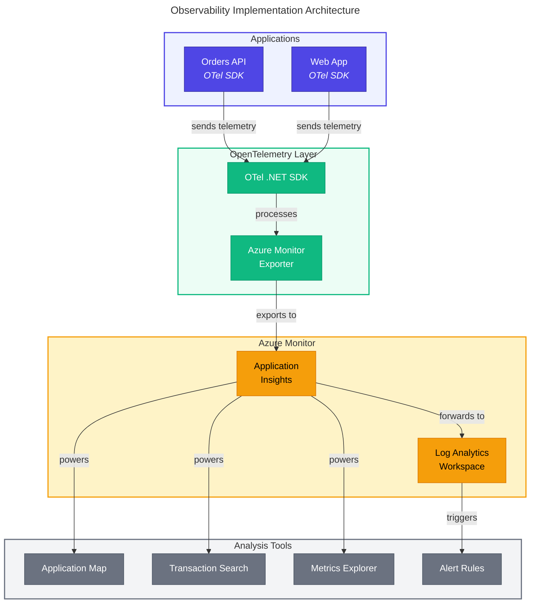
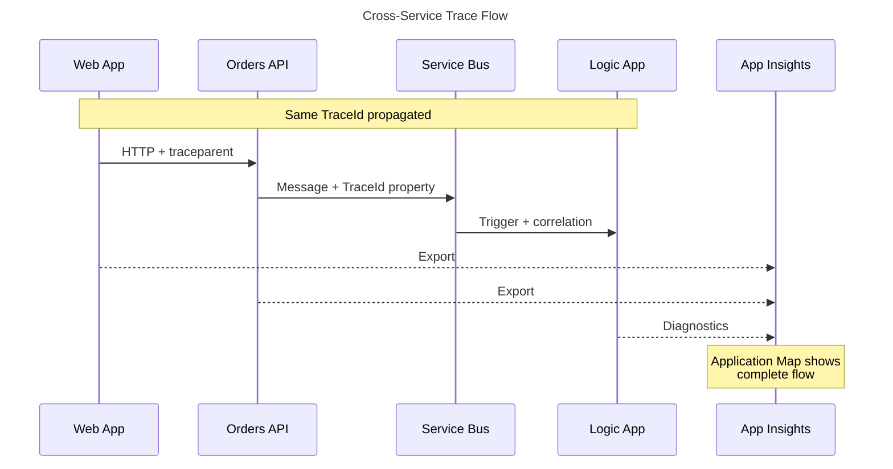

# 📊 ADR-003: OpenTelemetry + Application Insights for Observability

← [ADR-002](ADR-002-service-bus-messaging.md) | **ADR-003** | [ADR Index](README.md)

---

## 📑 Table of Contents

- [Status](#-status)
- [Date](#-date)
- [Context](#-context)
- [Decision](#-decision)
- [Consequences](#-consequences)
- [Telemetry Matrix](#-telemetry-matrix)
- [Alternatives Considered](#-alternatives-considered)
- [Correlation Strategy](#-correlation-strategy)
- [Related Decisions](#-related-decisions)
- [References](#-references)

---

## ✅ Status

✅ **Accepted**

## Date

2025-01

## Context

The Azure Logic Apps Monitoring Solution requires comprehensive observability across:

- **Orders API** (.NET Web API)
- **Web App** (.NET Blazor)
- **Logic Apps** (Azure Logic Apps Standard)
- **Infrastructure** (Service Bus, SQL Database, Container Apps)

Key requirements:

1. **Distributed Tracing**: End-to-end visibility across services and message queues
2. **Metrics Collection**: Application and business KPIs
3. **Log Aggregation**: Centralized logging with correlation
4. **Alerting**: Proactive notification of issues
5. **Dashboards**: Visual analysis and troubleshooting

### Forces

| Force                  | Direction                             |
| ---------------------- | ------------------------------------- |
| Vendor flexibility     | ↗️ Avoid observability vendor lock-in |
| Azure integration      | ↗️ Leverage native Azure tools        |
| Standards adoption     | ↗️ Industry-standard telemetry        |
| Operational simplicity | ↘️ Single platform preferred          |

---


---

## 🛠️ Decision

**Adopt OpenTelemetry SDK for instrumentation** with **Azure Monitor (Application Insights)** as the backend, providing vendor-neutral telemetry collection with Azure-native analysis capabilities.

### Implementation Architecture



### Implementation Details

1. **OpenTelemetry Configuration** (`Extensions.cs`):

```csharp
public static IHostApplicationBuilder ConfigureOpenTelemetry(
    this IHostApplicationBuilder builder)
{
    builder.Logging.AddOpenTelemetry(logging =>
    {
        logging.IncludeFormattedMessage = true;
        logging.IncludeScopes = true;
    });

    builder.Services.AddOpenTelemetry()
        .WithMetrics(metrics =>
        {
            metrics.AddAspNetCoreInstrumentation()
                   .AddHttpClientInstrumentation()
                   .AddRuntimeInstrumentation()
                   .AddMeter("eShop.Orders.API");
        })
        .WithTracing(tracing =>
        {
            tracing.AddSource(builder.Environment.ApplicationName)
                   .AddAspNetCoreInstrumentation()
                   .AddHttpClientInstrumentation()
                   .AddSqlClientInstrumentation();
        });

    builder.AddOpenTelemetryExporters();
    return builder;
}
```

2. **Custom Metrics** (`OrderService.cs`):

```csharp
private static readonly Meter _meter = new("eShop.Orders.API");
private static readonly Counter<int> _ordersPlaced =
    _meter.CreateCounter<int>("eShop.orders.placed");
private static readonly Histogram<double> _orderDuration =
    _meter.CreateHistogram<double>("eShop.orders.processing.duration");
```

3. **Trace Context Propagation** (`OrdersMessageHandler.cs`):

```csharp
// Propagate trace context to Service Bus messages
message.ApplicationProperties["TraceId"] = Activity.Current?.TraceId.ToString();
message.ApplicationProperties["SpanId"] = Activity.Current?.SpanId.ToString();
message.ApplicationProperties["traceparent"] =
    $"00-{Activity.Current?.TraceId}-{Activity.Current?.SpanId}-01";
```

## Consequences

### Positive

| Benefit                       | Impact                                       |
| ----------------------------- | -------------------------------------------- |
| **Vendor Neutrality**         | Can switch backends without re-instrumenting |
| **Standards Compliance**      | W3C Trace Context for correlation            |
| **Rich Auto-instrumentation** | ASP.NET Core, HTTP, SQL, EF Core automatic   |
| **Custom Metrics**            | Business KPIs alongside technical metrics    |
| **Azure Integration**         | Application Map, Transaction Search, Alerts  |
| **Local Development**         | Aspire Dashboard for local OTLP              |

### Negative

| Tradeoff              | Mitigation                                           |
| --------------------- | ---------------------------------------------------- |
| **Two Concepts**      | OTel for collection, Azure for analysis - documented |
| **Learning Curve**    | Team training on both OTel and Azure Monitor         |
| **Data Volume Costs** | Sampling strategies, retention policies              |
| **Logic App Gaps**    | Logic Apps use built-in diagnostics, not OTel        |

### Neutral

- Application Insights pricing model unchanged
- Existing Azure Monitor skills transfer
- KQL queries remain the analysis language

---


---

## 📱 Telemetry Matrix

| Component    | Traces | Metrics | Logs | Method            |
| ------------ | ------ | ------- | ---- | ----------------- |
| Orders API   | ✅     | ✅      | ✅   | OTel SDK          |
| Web App      | ✅     | ✅      | ✅   | OTel SDK          |
| Logic Apps   | ✅     | ✅      | ✅   | Azure Diagnostics |
| Service Bus  | ✅     | ✅      | ✅   | Azure Diagnostics |
| SQL Database | ✅     | ✅      | ✅   | Azure Diagnostics |

---


---

## 🔍 Alternatives Considered

### 1. Application Insights SDK Only

**Description**: Use classic Application Insights .NET SDK

**Why Not Chosen**:

- Vendor lock-in to Azure Monitor
- Harder to migrate to other backends
- Less alignment with industry standards
- Classic SDK being deprecated in favor of OTel

### 2. Jaeger/Zipkin

**Description**: Self-hosted open-source tracing backends

**Why Not Chosen**:

- Operational overhead of hosting
- No native Azure integration
- Separate tools for metrics and logs
- Additional infrastructure to manage

### 3. Datadog/New Relic/Dynatrace

**Description**: Third-party commercial APM platforms

**Why Not Chosen**:

- Additional licensing costs
- Data egress from Azure
- Duplicate capabilities with Azure Monitor
- Extra vendor relationship to manage

### 4. Azure Monitor Agent Only

**Description**: Use Azure Monitor agent without OTel

**Why Not Chosen**:

- Less control over instrumentation
- Missing custom spans and metrics
- No local development option
- Harder to switch vendors later

---


---

## 🔗 Correlation Strategy

### Cross-Service Trace Flow



### Correlation Properties

| Hop          | Mechanism           | Property                 |
| ------------ | ------------------- | ------------------------ |
| HTTP         | Header              | `traceparent`            |
| Service Bus  | ApplicationProperty | `TraceId`, `traceparent` |
| Logic App    | Built-in            | `x-ms-workflow-run-id`   |
| App Insights | SDK                 | `operation_Id`           |

---


---

## 🔗 Related Decisions

- [ADR-001: Aspire Orchestration](ADR-001-aspire-orchestration.md) - OTel configured via ServiceDefaults
- [ADR-002: Service Bus Messaging](ADR-002-service-bus-messaging.md) - Trace propagation in messages

---

## 📚 References

- [OpenTelemetry .NET](https://opentelemetry.io/docs/languages/net/)
- [Azure Monitor OpenTelemetry](https://learn.microsoft.com/azure/azure-monitor/app/opentelemetry-overview)
- [W3C Trace Context](https://www.w3.org/TR/trace-context/)
- [.NET Aspire Telemetry](https://learn.microsoft.com/dotnet/aspire/fundamentals/telemetry)

---

_← [ADR-002](ADR-002-service-bus-messaging.md) | [ADR Index](README.md)_
