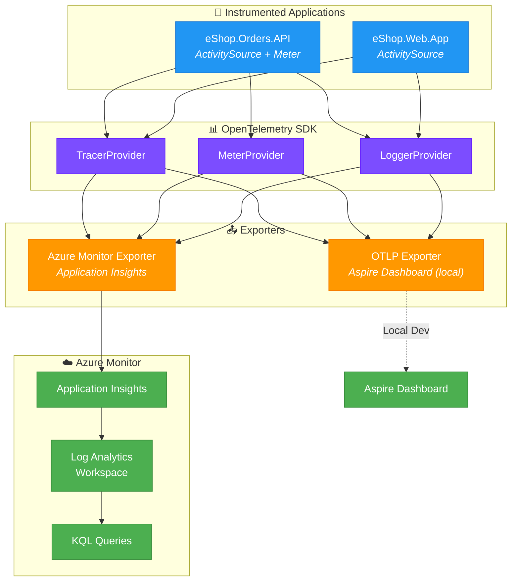

# ADR-003: OpenTelemetry with Application Insights for Observability

## Status

**Accepted** - January 2025

## Context

The Azure Logic Apps Monitoring Solution demonstrates cloud-native observability patterns for distributed applications. The system comprises multiple services that must be observed holistically:

- **eShop.Orders.API** - REST API generating order telemetry
- **eShop.Web.App** - Blazor frontend with user interaction traces
- **OrdersManagement Logic App** - Workflow automation with step-by-step tracking
- **Azure Service Bus** - Async messaging with queue depth metrics

**Observability requirements:**

1. **Distributed tracing:** Track requests across all services end-to-end
2. **Metrics:** Custom business metrics (orders placed, processing duration)
3. **Structured logging:** Correlated logs with trace/span context
4. **Vendor flexibility:** Avoid lock-in to a single telemetry backend
5. **Azure integration:** Native support for Azure services diagnostics
6. **Cost efficiency:** Control telemetry volume and sampling

**Key challenges:**
- Correlating traces across HTTP, Service Bus, and Logic Apps
- Maintaining trace context when messages pass through queues
- Collecting custom business metrics without custom infrastructure
- Supporting local development with the same instrumentation code

## Decision

Adopt **OpenTelemetry** as the instrumentation standard with **Azure Application Insights** as the telemetry backend.



**Key implementation patterns:**

1. **Shared Configuration (ServiceDefaults):**
   ```csharp
   builder.Services.AddOpenTelemetry()
       .WithTracing(tracing =>
       {
           tracing.AddAspNetCoreInstrumentation()
               .AddHttpClientInstrumentation()
               .AddSource("eShop.Orders.API");
       })
       .WithMetrics(metrics =>
       {
           metrics.AddAspNetCoreInstrumentation()
               .AddHttpClientInstrumentation()
               .AddMeter("eShop.Orders");
       });
   ```

2. **Custom Activity Source:**
   ```csharp
   public static readonly ActivitySource ActivitySource = new("eShop.Orders.API");
   
   using var activity = ActivitySource.StartActivity("ProcessOrder");
   activity?.SetTag("order.id", orderId);
   ```

3. **Custom Metrics:**
   ```csharp
   private static readonly Meter Meter = new("eShop.Orders");
   private static readonly Counter<int> OrdersPlacedCounter = 
       Meter.CreateCounter<int>("eShop.orders.placed");
   
   OrdersPlacedCounter.Add(1, new KeyValuePair<string, object?>("status", "success"));
   ```

4. **Trace Context Propagation (Service Bus):**
   ```csharp
   if (Activity.Current != null)
   {
       message.ApplicationProperties["traceparent"] = Activity.Current.Id;
   }
   ```

## Consequences

### Positive

| Benefit | Impact |
|---------|--------|
| **Vendor neutrality** | Can switch backends without code changes |
| **Standardized APIs** | Industry-standard instrumentation patterns |
| **Auto-instrumentation** | HTTP, gRPC, SQL automatically traced |
| **Custom telemetry** | Business metrics via `Meter` and `Counter` |
| **Trace correlation** | Single trace ID across all services |
| **Azure integration** | Native Application Insights dashboards |
| **Local development** | Aspire Dashboard for immediate feedback |
| **Cost control** | Sampling and filtering at SDK level |

### Negative

| Tradeoff | Mitigation |
|----------|------------|
| **Configuration complexity** | Centralized in ServiceDefaults project |
| **SDK overhead** | Minimal; ~1-2% performance impact |
| **Learning curve** | Team training on OpenTelemetry concepts |
| **Logic App gaps** | Logic Apps use Azure Monitor directly; correlate via traceparent |

## Telemetry Inventory

### Traces (Spans)

| Source | Activity Name | Description |
|--------|---------------|-------------|
| ASP.NET Core | `HTTP {method}` | Incoming HTTP requests |
| HttpClient | `HTTP {method}` | Outgoing HTTP requests |
| Custom | `CreateOrder` | Order creation business logic |
| Custom | `PublishOrderMessage` | Service Bus publish operation |
| Custom | `ValidateOrder` | Order validation logic |

### Metrics

| Meter | Metric Name | Type | Description |
|-------|-------------|------|-------------|
| `eShop.Orders` | `eShop.orders.placed` | Counter | Orders successfully placed |
| `eShop.Orders` | `eShop.orders.processing.duration` | Histogram | Order processing time |
| ASP.NET Core | `http.server.request.duration` | Histogram | HTTP request latency |
| HttpClient | `http.client.request.duration` | Histogram | Outbound HTTP latency |

### Logs

| Category | Level | Correlation |
|----------|-------|-------------|
| `Microsoft.AspNetCore` | Information+ | TraceId, SpanId |
| `eShop.Orders.API` | Debug+ | TraceId, SpanId, OrderId |
| `Azure.Messaging.ServiceBus` | Warning+ | TraceId, SpanId |

## Alternatives Considered

### 1. Application Insights SDK Only

**Description:** Use the proprietary Application Insights SDK for all telemetry.

**Rejected because:**
- Vendor lock-in to Azure Monitor
- Non-standard API surface
- Limited local development experience
- Harder to switch telemetry backends

### 2. Jaeger/Zipkin Direct

**Description:** Use open-source tracing backends directly.

**Rejected because:**
- Requires self-hosting infrastructure
- Missing Azure-native features (Azure Monitor integration, KQL)
- Additional operational burden
- No managed SLA

### 3. Prometheus + Grafana

**Description:** Use Prometheus for metrics with Grafana dashboards.

**Rejected because:**
- Requires separate infrastructure
- Metrics-only; would need additional tracing solution
- No native Azure integration
- Higher operational overhead

### 4. No Standardization (Per-Service Choice)

**Description:** Let each service choose its own telemetry approach.

**Rejected because:**
- Inconsistent trace correlation
- Different dashboards per service
- Knowledge fragmentation
- Difficult troubleshooting

## Configuration Reference

### Environment Variables

| Variable | Purpose | Default |
|----------|---------|---------|
| `OTEL_SERVICE_NAME` | Service identifier in traces | Project name |
| `OTEL_EXPORTER_OTLP_ENDPOINT` | OTLP collector endpoint | Aspire-managed |
| `APPLICATIONINSIGHTS_CONNECTION_STRING` | App Insights connection | From User Secrets |

### Application Insights Query Examples

**End-to-end transaction:**
```kusto
union requests, dependencies, traces
| where operation_Id == "your-trace-id"
| order by timestamp asc
```

**Orders placed per hour:**
```kusto
customMetrics
| where name == "eShop.orders.placed"
| summarize sum(valueCount) by bin(timestamp, 1h)
| render timechart
```

**Failed orders with context:**
```kusto
traces
| where customDimensions.OrderId != ""
| where severityLevel >= 3
| project timestamp, message, customDimensions.OrderId, operation_Id
```

## References

- [OpenTelemetry .NET Documentation](https://opentelemetry.io/docs/languages/dotnet/)
- [Azure Monitor OpenTelemetry Exporter](https://learn.microsoft.com/azure/azure-monitor/app/opentelemetry-enable)
- [Application Insights Overview](https://learn.microsoft.com/azure/azure-monitor/app/app-insights-overview)
- [ServiceDefaults Implementation](../../../app.ServiceDefaults/Extensions.cs)
- [Observability Architecture](../05-observability-architecture.md)

---

← [ADR-002: Service Bus Messaging](ADR-002-service-bus-messaging.md) | [ADR Index](README.md)
