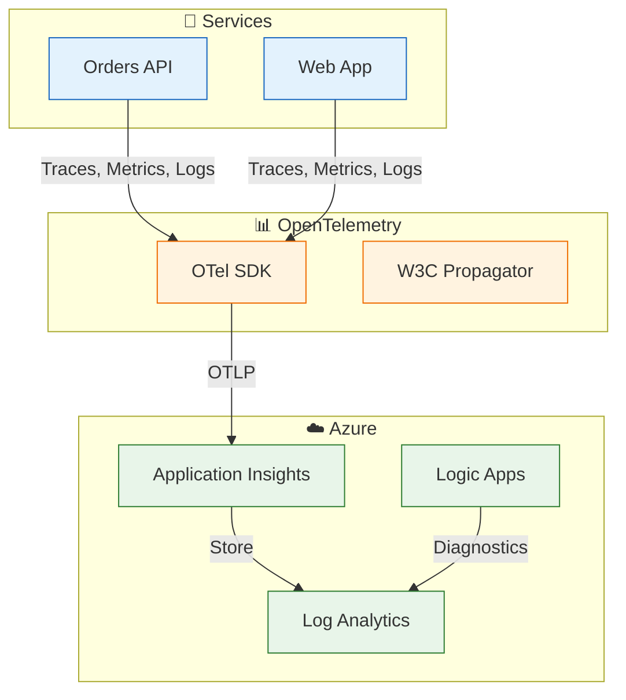
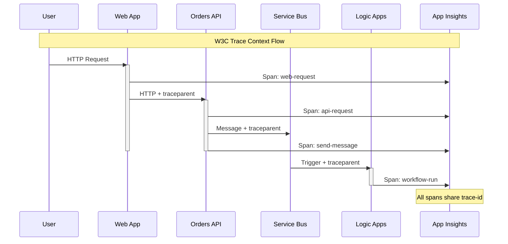

# ADR-003: OpenTelemetry with Application Insights

[← ADR-002](ADR-002-service-bus-messaging.md) | [ADR Index](README.md)

## Status

**Accepted** (January 2026)

## Context

The distributed nature of the Azure Logic Apps Monitoring Solution creates observability challenges:

- **Multiple Services**: Orders API, Web App, Logic Apps, Service Bus
- **Async Communication**: Messages flow through queues with timing gaps
- **Cross-Platform**: .NET services and Azure PaaS (Logic Apps, Service Bus)
- **Debugging Complexity**: Issues can originate in any component

### Observability Requirements

| Requirement             | Priority | Rationale                                |
| ----------------------- | -------- | ---------------------------------------- |
| **Distributed Tracing** | Critical | Trace requests across service boundaries |
| **Metrics Collection**  | High     | Monitor business and technical KPIs      |
| **Centralized Logging** | High     | Aggregate logs from all services         |
| **Correlation**         | Critical | Link traces, metrics, and logs           |
| **Alerting**            | High     | Proactive issue detection                |

### Options Considered

| Option                           | Pros                            | Cons                             |
| -------------------------------- | ------------------------------- | -------------------------------- |
| **Application Insights SDK**     | Deep Azure integration          | Vendor lock-in                   |
| **OpenTelemetry + App Insights** | Vendor-neutral, standards-based | Additional configuration         |
| **OpenTelemetry + Jaeger**       | Open source                     | Self-managed infrastructure      |
| **Datadog/New Relic**            | Feature-rich                    | Additional cost, external vendor |

## Decision

**We will use OpenTelemetry as the telemetry standard with Azure Application Insights as the backend.**

### Rationale

1. **Vendor Neutrality**: OpenTelemetry is a CNCF standard; can switch backends without code changes
2. **W3C Trace Context**: Standard trace propagation works across all platforms
3. **Azure Integration**: Application Insights has native OpenTelemetry support
4. **Aspire Support**: .NET Aspire configures OpenTelemetry automatically
5. **Future Flexibility**: Can export to multiple backends simultaneously

### Architecture



### Implementation

**OpenTelemetry Configuration:**

```csharp
// Extensions.cs
public static IHostApplicationBuilder ConfigureOpenTelemetry(
    this IHostApplicationBuilder builder)
{
    builder.Logging.AddOpenTelemetry(options =>
    {
        options.IncludeScopes = true;
        options.IncludeFormattedMessage = true;
    });

    builder.Services.AddOpenTelemetry()
        .WithMetrics(metrics =>
        {
            metrics.AddAspNetCoreInstrumentation()
                   .AddHttpClientInstrumentation()
                   .AddRuntimeInstrumentation();
        })
        .WithTracing(tracing =>
        {
            tracing.AddAspNetCoreInstrumentation()
                   .AddHttpClientInstrumentation()
                   .AddEntityFrameworkCoreInstrumentation();
        });

    builder.AddOpenTelemetryExporters();
    return builder;
}
```

**Custom Metrics:**

```csharp
// OrderService.cs
public class OrderService
{
    private static readonly Meter _meter = new("eShop.Orders");
    private static readonly Counter<long> _ordersPlaced =
        _meter.CreateCounter<long>("orders.placed");
    private static readonly Histogram<double> _processingDuration =
        _meter.CreateHistogram<double>("orders.processing.duration");

    public async Task<Order> PlaceOrderAsync(Order order)
    {
        var stopwatch = Stopwatch.StartNew();
        try
        {
            // Process order...
            _ordersPlaced.Add(1, new KeyValuePair<string, object?>("status", "success"));
            return order;
        }
        finally
        {
            _processingDuration.Record(stopwatch.ElapsedMilliseconds);
        }
    }
}
```

**Trace Context Propagation:**

```csharp
// OrdersMessageHandler.cs
public async Task SendOrderPlacedMessageAsync(Order order)
{
    var message = new ServiceBusMessage(/*...*/);

    // Propagate trace context to Service Bus
    if (Activity.Current != null)
    {
        message.ApplicationProperties["traceparent"] = Activity.Current.Id;
        message.ApplicationProperties["tracestate"] =
            Activity.Current.TraceStateString ?? "";
    }

    await _sender.SendMessageAsync(message);
}
```

### Telemetry Data Model

| Signal          | Source               | Destination          |
| --------------- | -------------------- | -------------------- |
| **Traces**      | OpenTelemetry SDK    | Application Insights |
| **Metrics**     | OpenTelemetry SDK    | Application Insights |
| **Logs**        | OpenTelemetry Logger | Application Insights |
| **Diagnostics** | Azure Resources      | Log Analytics        |

### Correlation Strategy



## Consequences

### Positive

| Benefit                  | Impact                                   |
| ------------------------ | ---------------------------------------- |
| **End-to-end tracing**   | Single trace across all services         |
| **Vendor neutrality**    | Can switch backends without code changes |
| **Standards compliance** | W3C Trace Context interoperability       |
| **Unified platform**     | All telemetry in Application Insights    |
| **Aspire integration**   | Automatic configuration                  |

### Negative

| Trade-off                    | Mitigation                                |
| ---------------------------- | ----------------------------------------- |
| **Learning curve**           | Team training on OpenTelemetry concepts   |
| **Configuration complexity** | Use Aspire defaults, customize as needed  |
| **Export latency**           | Batch exports (acceptable for monitoring) |
| **Logic Apps gaps**          | Manual correlation via properties         |

### Neutral

- Requires Application Insights workspace
- OpenTelemetry SDK evolving (use stable APIs)
- Some Azure services have limited OTel support

## Custom Metrics Catalog

| Metric                         | Type      | Unit  | Description                |
| ------------------------------ | --------- | ----- | -------------------------- |
| `orders.placed`                | Counter   | count | Orders successfully placed |
| `orders.processing.duration`   | Histogram | ms    | Order processing time      |
| `orders.failed`                | Counter   | count | Failed order operations    |
| `servicebus.messages.sent`     | Counter   | count | Messages published         |
| `servicebus.messages.received` | Counter   | count | Messages consumed          |

## Related Decisions

- [ADR-001](ADR-001-aspire-orchestration.md) - Aspire provides OpenTelemetry defaults
- [ADR-002](ADR-002-service-bus-messaging.md) - Trace context in Service Bus messages

## References

- [OpenTelemetry .NET](https://opentelemetry.io/docs/languages/net/)
- [Application Insights OpenTelemetry](https://learn.microsoft.com/en-us/azure/azure-monitor/app/opentelemetry-enable)
- [app.ServiceDefaults/Extensions.cs](../../app.ServiceDefaults/Extensions.cs)
- [src/eShop.Orders.API/Services/OrderService.cs](../../src/eShop.Orders.API/Services/OrderService.cs)
- [Observability Architecture](../05-observability-architecture.md)

---

_Last Updated: January 2026_
