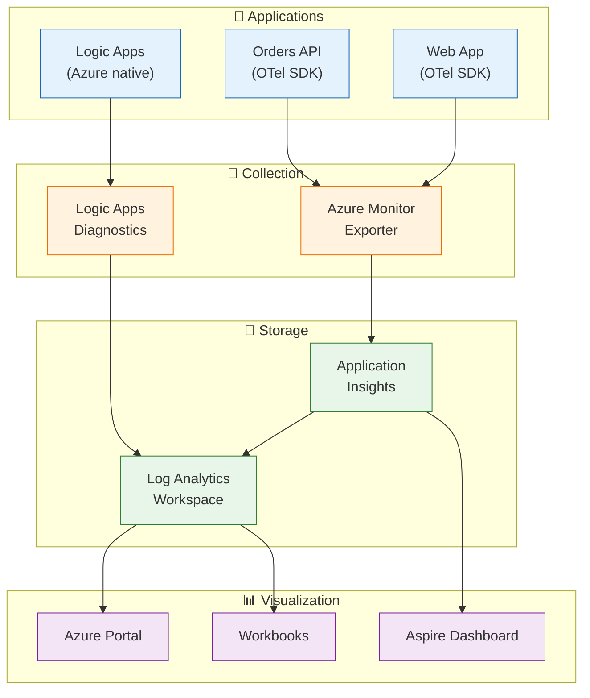

# ADR-003: OpenTelemetry with Azure Monitor for Observability

[← ADR Index](README.md)

---

## Status

**Accepted** - January 2025

---

## Context

The eShop Orders system is a distributed application with multiple services that need comprehensive observability:

- **Distributed Tracing**: Track requests across API, Logic Apps, and databases
- **Metrics**: Monitor business KPIs and technical performance
- **Logging**: Structured logs with correlation
- **Health Checks**: Liveness and readiness probes

### Requirements

| Requirement         | Priority | Notes                               |
| ------------------- | -------- | ----------------------------------- |
| Distributed tracing | High     | Cross-service correlation           |
| Custom metrics      | High     | Business KPIs (orders placed, etc.) |
| Structured logging  | High     | Searchable, correlated logs         |
| Azure integration   | High     | App Insights, Log Analytics         |
| Vendor neutrality   | Medium   | Avoid deep lock-in                  |
| Performance impact  | Medium   | Low overhead instrumentation        |

### Observability Needs

| Component   | Tracing                                  | Metrics                           | Logging                 |
| ----------- | ---------------------------------------- | --------------------------------- | ----------------------- |
| Orders API  | Incoming requests, DB calls, Service Bus | Order counts, latency, errors     | Business events, errors |
| Web App     | Outgoing HTTP calls, page loads          | Request counts, latency           | User actions, errors    |
| Logic Apps  | Workflow execution, actions              | Workflow metrics (Azure-provided) | Action results          |
| Service Bus | Message processing                       | Queue depth, throughput           | Dead-letters            |

---

## Decision

We will use **OpenTelemetry SDK** with **Azure Monitor Exporter** for observability instrumentation.

### Implementation

#### OpenTelemetry Configuration

```csharp
// app.ServiceDefaults/Extensions.cs
public static IHostApplicationBuilder ConfigureOpenTelemetry(this IHostApplicationBuilder builder)
{
    builder.Logging.AddOpenTelemetry(logging =>
    {
        logging.IncludeFormattedMessage = true;
        logging.IncludeScopes = true;
    });

    builder.Services.AddOpenTelemetry()
        .WithMetrics(metrics =>
        {
            metrics.AddAspNetCoreInstrumentation()
                   .AddHttpClientInstrumentation()
                   .AddRuntimeInstrumentation()
                   .AddMeter("eShop.Orders");  // Custom meter
        })
        .WithTracing(tracing =>
        {
            tracing.AddAspNetCoreInstrumentation()
                   .AddHttpClientInstrumentation()
                   .AddEntityFrameworkCoreInstrumentation()
                   .AddSource("Azure.Messaging.ServiceBus");
        });

    // Export to Azure Monitor
    builder.AddOpenTelemetryExporters();
    return builder;
}
```

#### Custom Metrics

```csharp
// src/eShop.Orders.API/Services/OrderService.cs
private static readonly Meter s_meter = new("eShop.Orders", "1.0.0");
private static readonly Counter<long> s_ordersPlaced =
    s_meter.CreateCounter<long>("eShop.orders.placed", description: "Number of orders placed");
private static readonly Histogram<double> s_processingDuration =
    s_meter.CreateHistogram<double>("eShop.orders.processing.duration", "ms");

public async Task<Order> CreateOrderAsync(Order order)
{
    var sw = Stopwatch.StartNew();
    // ... order creation logic ...

    s_ordersPlaced.Add(1, new KeyValuePair<string, object?>("status", order.Status));
    s_processingDuration.Record(sw.ElapsedMilliseconds);
}
```

#### Distributed Tracing

```csharp
// W3C Trace Context propagation to Service Bus
var message = new ServiceBusMessage(payload);
if (Activity.Current != null)
{
    message.ApplicationProperties["traceparent"] =
        $"00-{Activity.Current.TraceId}-{Activity.Current.SpanId}-01";
}
```

---

## Consequences

### Benefits

| Benefit                  | Description                               |
| ------------------------ | ----------------------------------------- |
| **Vendor Neutrality**    | OpenTelemetry is CNCF standard, portable  |
| **Auto-Instrumentation** | ASP.NET Core, HTTP, EF Core automatic     |
| **Custom Metrics**       | Business KPIs alongside technical metrics |
| **Distributed Tracing**  | End-to-end request correlation            |
| **Azure Integration**    | Native export to Application Insights     |
| **Structured Logging**   | Correlated, searchable logs               |

### Drawbacks

| Drawback                 | Mitigation                                            |
| ------------------------ | ----------------------------------------------------- |
| **Setup Complexity**     | ServiceDefaults centralizes configuration             |
| **Learning Curve**       | Well-documented, team familiar with tracing           |
| **Performance Overhead** | Minimal with sampling, measured <1%                   |
| **Two Systems**          | Logic Apps uses Azure-native; correlation still works |

### Risks

| Risk                 | Probability | Impact | Mitigation                   |
| -------------------- | ----------- | ------ | ---------------------------- |
| Data volume costs    | Medium      | Medium | Sampling, retention policies |
| Trace context loss   | Low         | Medium | Test across all boundaries   |
| SDK breaking changes | Low         | Low    | Pin versions, test upgrades  |

---

## Alternatives Considered

### 1. Application Insights SDK (Direct)

**Pros**: Deep Azure integration, auto-collection, AI detection
**Cons**: Vendor lock-in, less portable, custom metrics more complex
**Why Rejected**: OpenTelemetry provides same benefits with portability

### 2. Prometheus + Grafana

**Pros**: Open source, industry standard, flexible dashboards
**Cons**: Self-hosted, no tracing, additional infrastructure
**Why Rejected**: Operational overhead, prefer managed service

### 3. Datadog / New Relic

**Pros**: Full-featured APM, excellent UX, auto-instrumentation
**Cons**: Cost, additional vendor, less Azure integration
**Why Rejected**: Azure Monitor sufficient, cost-effective

### 4. Jaeger + Custom Metrics

**Pros**: Open source tracing, flexible, Kubernetes native
**Cons**: Self-hosted, no managed option, additional complexity
**Why Rejected**: Prefer managed, Azure-integrated solution

### Comparison Matrix

| Criteria          | OTel + Azure | App Insights | Prometheus | Datadog |
| ----------------- | ------------ | ------------ | ---------- | ------- |
| Vendor Neutral    | ⭐⭐⭐       | ⭐           | ⭐⭐⭐     | ⭐⭐    |
| Tracing           | ⭐⭐⭐       | ⭐⭐⭐       | ❌         | ⭐⭐⭐  |
| Metrics           | ⭐⭐⭐       | ⭐⭐         | ⭐⭐⭐     | ⭐⭐⭐  |
| Azure Integration | ⭐⭐⭐       | ⭐⭐⭐       | ⭐         | ⭐⭐    |
| Cost              | ⭐⭐         | ⭐⭐         | ⭐⭐⭐     | ⭐      |
| Operational       | ⭐⭐⭐       | ⭐⭐⭐       | ⭐         | ⭐⭐⭐  |

---

## Telemetry Architecture



---

## References

- [OpenTelemetry .NET Documentation](https://opentelemetry.io/docs/instrumentation/net/)
- [Azure Monitor OpenTelemetry](https://learn.microsoft.com/azure/azure-monitor/app/opentelemetry-overview)
- [Extensions.cs](../../../app.ServiceDefaults/Extensions.cs)
- [Observability Architecture](../05-observability-architecture.md)

---

[← ADR Index](README.md)
