# ADR-003: OpenTelemetry-Based Observability Strategy

[← ADR-002](ADR-002-service-bus-messaging.md) | **ADR-003** | [ADR Index](README.md)

---

## Metadata

| Field          | Value                                          |
| -------------- | ---------------------------------------------- |
| **Status**     | ✅ Accepted                                    |
| **Date**       | 2024-01-01                                     |
| **Deciders**   | Architecture Team                              |
| **Categories** | Observability, Monitoring, Distributed Tracing |

---

## Context

### Problem Statement

The Azure Logic Apps Monitoring Solution comprises multiple distributed services:

- Orders API (ASP.NET Core)
- Web App (Blazor Server)
- Logic Apps (Workflow automation)
- Azure Service Bus (Messaging)
- Azure SQL Database (Persistence)

Observability challenges include:

1. **Fragmented telemetry** - Each service produces isolated logs/metrics
2. **Cross-service correlation** - Tracing requests across service boundaries
3. **Vendor lock-in** - Proprietary instrumentation limits flexibility
4. **Inconsistent formats** - Different telemetry schemas per service

### Requirements

| Requirement | Priority    | Description                                        |
| ----------- | ----------- | -------------------------------------------------- |
| **R1**      | Must Have   | End-to-end distributed tracing across all services |
| **R2**      | Must Have   | Correlation of traces, logs, and metrics           |
| **R3**      | Must Have   | Export to Azure Monitor (Application Insights)     |
| **R4**      | Should Have | Vendor-neutral instrumentation                     |
| **R5**      | Should Have | Automatic instrumentation for common libraries     |
| **R6**      | Should Have | Support for W3C Trace Context standard             |

### Observability Requirements

```mermaid
flowchart LR
    subgraph Sources["📊 Telemetry Sources"]
        Traces["Distributed Traces"]
        Metrics["Metrics"]
        Logs["Structured Logs"]
    end

    subgraph Processing["🔄 Processing"]
        Collector["OpenTelemetry<br/>Collector"]
    end

    subgraph Backends["📈 Backends"]
        AI["Application Insights"]
        LA["Log Analytics"]
        Aspire["Aspire Dashboard"]
    end

    Sources --> Collector --> Backends

    classDef source fill:#e3f2fd,stroke:#1565c0
    classDef process fill:#fff3e0,stroke:#ef6c00
    classDef backend fill:#e8f5e9,stroke:#2e7d32

    class Traces,Metrics,Logs source
    class Collector process
    class AI,LA,Aspire backend
```



---

## Decision

**We will adopt OpenTelemetry as the vendor-neutral observability framework, with Azure Monitor as the primary telemetry backend.**

### Architecture

```mermaid
flowchart TB
    subgraph Apps["🖥️ Applications"]
        API["Orders API"]
        WebApp["Web App"]
    end

    subgraph OTel["📡 OpenTelemetry"]
        SDK["OTel SDK"]
        Auto["Auto-Instrumentation"]
        Manual["Manual Spans"]
    end

    subgraph Exporters["📤 Exporters"]
        OTLP["OTLP Exporter"]
        AzMon["Azure Monitor Exporter"]
    end

    subgraph Backends["📊 Backends"]
        AI["Application Insights"]
        Aspire["Aspire Dashboard"]
    end

    Apps --> OTel
    SDK --> Auto
    SDK --> Manual
    OTel --> Exporters
    OTLP --> Aspire
    AzMon --> AI

    classDef app fill:#e3f2fd,stroke:#1565c0,stroke-width:2px
    classDef otel fill:#fff3e0,stroke:#ef6c00,stroke-width:2px
    classDef exporter fill:#fce4ec,stroke:#c2185b,stroke-width:2px
    classDef backend fill:#e8f5e9,stroke:#2e7d32,stroke-width:2px

    class API,WebApp app
    class SDK,Auto,Manual otel
    class OTLP,AzMon exporter
    class AI,Aspire backend
```



### Implementation

**ServiceDefaults Configuration** ([Extensions.cs](../../../app.ServiceDefaults/Extensions.cs)):

```csharp
public static IHostApplicationBuilder ConfigureOpenTelemetry(
    this IHostApplicationBuilder builder)
{
    builder.Logging.AddOpenTelemetry(logging =>
    {
        logging.IncludeFormattedMessage = true;
        logging.IncludeScopes = true;
    });

    builder.Services.AddOpenTelemetry()
        .WithMetrics(metrics =>
        {
            metrics.AddAspNetCoreInstrumentation()
                .AddHttpClientInstrumentation()
                .AddRuntimeInstrumentation();
        })
        .WithTracing(tracing =>
        {
            tracing.AddSource(builder.Environment.ApplicationName)
                .AddAspNetCoreInstrumentation()
                .AddHttpClientInstrumentation()
                .AddEntityFrameworkCoreInstrumentation();
        });

    builder.AddOpenTelemetryExporters();
    return builder;
}
```

### Telemetry Pillars

| Pillar      | Implementation              | Auto-Instrumentation                           |
| ----------- | --------------------------- | ---------------------------------------------- |
| **Traces**  | `ActivitySource` + OTel SDK | ASP.NET Core, HttpClient, EF Core, Service Bus |
| **Metrics** | `Meter` + OTel SDK          | ASP.NET Core, HttpClient, .NET Runtime         |
| **Logs**    | `ILogger<T>` + OTel Logging | Structured logging with trace correlation      |

### Trace Context Propagation


**W3C Trace Context Format:**

```
traceparent: 00-{trace-id}-{span-id}-{flags}
             │   │          │         │
             │   │          │         └─ Sampling decision
             │   │          └─ Parent span (16 hex chars)
             │   └─ Trace ID (32 hex chars)
             └─ Version (always 00)
```

---

## Consequences

### Positive

| Outcome                       | Impact | Measurement                              |
| ----------------------------- | ------ | ---------------------------------------- |
| **Vendor neutrality**         | High   | Can switch backends without code changes |
| **End-to-end correlation**    | High   | Single trace ID across all services      |
| **Rich auto-instrumentation** | High   | Minimal manual instrumentation needed    |
| **Standards compliance**      | Medium | W3C Trace Context compatibility          |
| **Aspire integration**        | High   | Built-in dashboard for local dev         |

### Negative

| Outcome                      | Impact | Mitigation                                 |
| ---------------------------- | ------ | ------------------------------------------ |
| **Learning curve**           | Medium | Team training, ServiceDefaults abstraction |
| **Additional dependencies**  | Low    | Managed via NuGet packages                 |
| **Configuration complexity** | Medium | Centralized in ServiceDefaults             |
| **Performance overhead**     | Low    | Sampling for high-volume scenarios         |

### Instrumentation Coverage

| Component             | Automatic  | Manual Spans            |
| --------------------- | ---------- | ----------------------- |
| ASP.NET Core requests | ✅         | Optional                |
| HttpClient calls      | ✅         | Optional                |
| EF Core queries       | ✅         | None needed             |
| Service Bus publish   | ⚠️ Partial | Trace context injection |
| Logic Apps            | ❌         | Extract from message    |
| Business operations   | ❌         | Custom `Activity` spans |

---

## Alternatives Considered

### Alternative 1: Application Insights SDK (Direct)

| Aspect      | Assessment                             |
| ----------- | -------------------------------------- |
| **Pros**    | Simpler setup, Azure-native            |
| **Cons**    | Vendor lock-in, limited portability    |
| **Verdict** | ❌ Rejected - Locks to Azure ecosystem |

### Alternative 2: Jaeger/Zipkin

| Aspect      | Assessment                                     |
| ----------- | ---------------------------------------------- |
| **Pros**    | Open source, no cloud dependency               |
| **Cons**    | Self-hosted infrastructure, operational burden |
| **Verdict** | ❌ Rejected - Increased ops complexity         |

### Alternative 3: Custom Logging Solution

| Aspect      | Assessment                                   |
| ----------- | -------------------------------------------- |
| **Pros**    | Full control, no external dependencies       |
| **Cons**    | Significant development effort, no standards |
| **Verdict** | ❌ Rejected - Reinventing the wheel          |

### Decision Matrix

| Criterion            | Weight | OpenTelemetry | AI SDK | Jaeger | Custom |
| -------------------- | ------ | ------------- | ------ | ------ | ------ |
| Vendor Neutrality    | 25%    | 5             | 2      | 5      | 4      |
| Azure Integration    | 25%    | 5             | 5      | 2      | 3      |
| Auto-Instrumentation | 20%    | 5             | 4      | 4      | 1      |
| Operational Overhead | 15%    | 4             | 5      | 2      | 2      |
| Community/Standards  | 15%    | 5             | 3      | 4      | 1      |
| **Weighted Score**   |        | **4.85**      | 3.85   | 3.45   | 2.35   |

---

## Telemetry Data Model

### Trace Attributes

| Attribute               | Source | Example        |
| ----------------------- | ------ | -------------- |
| `service.name`          | Auto   | `orders-api`   |
| `service.version`       | Config | `1.0.0`        |
| `http.method`           | Auto   | `POST`         |
| `http.route`            | Auto   | `/api/orders`  |
| `db.system`             | Auto   | `mssql`        |
| `db.name`               | Auto   | `OrderDb`      |
| `messaging.system`      | Manual | `servicebus`   |
| `messaging.destination` | Manual | `ordersplaced` |

### Metric Names

| Metric                         | Type      | Description            |
| ------------------------------ | --------- | ---------------------- |
| `http.server.request.duration` | Histogram | HTTP request latency   |
| `http.client.request.duration` | Histogram | Outbound HTTP latency  |
| `db.client.operation.duration` | Histogram | Database query latency |
| `process.cpu.usage`            | Gauge     | CPU utilization        |
| `process.memory.usage`         | Gauge     | Memory consumption     |

### Log Enrichment

```json
{
  "Timestamp": "2024-01-15T10:30:00Z",
  "Level": "Information",
  "Message": "Order created successfully",
  "TraceId": "abc123...",
  "SpanId": "def456...",
  "Properties": {
    "OrderId": "ORD-2024-001",
    "CustomerId": "CUST-001",
    "ServiceName": "orders-api"
  }
}
```

---

## Implementation Checklist

- [x] OpenTelemetry SDK added to ServiceDefaults
- [x] Azure Monitor exporter configured
- [x] ASP.NET Core auto-instrumentation enabled
- [x] HttpClient auto-instrumentation enabled
- [x] EF Core auto-instrumentation enabled
- [x] Structured logging with trace correlation
- [x] Service Bus trace context propagation
- [x] Aspire Dashboard integration
- [ ] Custom business metrics (future enhancement)
- [ ] Sampling configuration for production (future)

---

## References

- [OpenTelemetry .NET Documentation](https://opentelemetry.io/docs/instrumentation/net/)
- [Azure Monitor OpenTelemetry](https://learn.microsoft.com/azure/azure-monitor/app/opentelemetry-enable)
- [W3C Trace Context](https://www.w3.org/TR/trace-context/)
- [Extensions.cs](../../../app.ServiceDefaults/Extensions.cs)
- [Observability Architecture](../05-observability-architecture.md)

---

**Back to:** [ADR Index](README.md)
