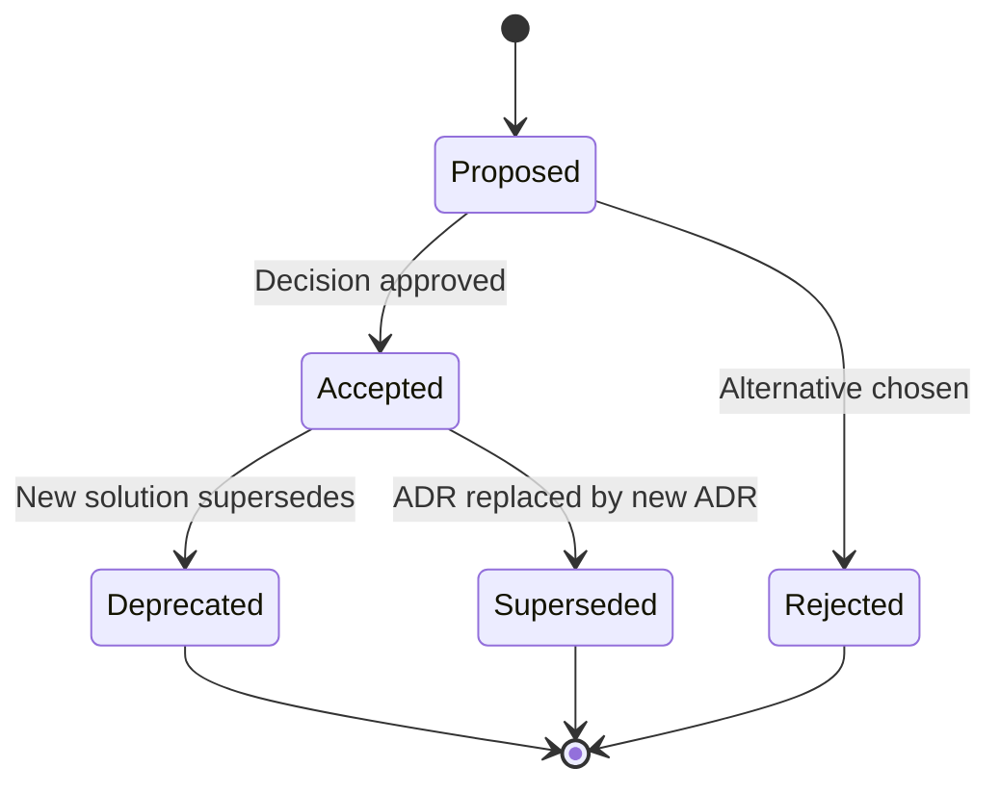

# Architecture Decision Records (ADRs)

← [Deployment Architecture](../07-deployment-architecture.md) | [Architecture Index](../README.md)

## Overview

This directory contains Architecture Decision Records (ADRs) documenting key technical decisions made during the design and implementation of the Azure Logic Apps Monitoring Solution.

**Purpose**: Capture context, reasoning, and consequences of architectural decisions to:
- Provide historical context for future maintainers
- Document alternatives considered
- Enable informed decision-making
- Support onboarding of new team members

**Format**: We use the [MADR (Markdown Architectural Decision Records)](https://adr.github.io/madr/) lightweight format.

---

## Decision Log

| ID | Title | Status | Date | Impact |
|----|-------|--------|------|--------|
| [ADR-001](ADR-001-aspire-orchestration.md) | .NET Aspire for Local Orchestration | ✅ Accepted | 2024-Q4 | High |
| [ADR-002](ADR-002-service-bus-messaging.md) | Azure Service Bus for Async Messaging | ✅ Accepted | 2024-Q4 | High |
| [ADR-003](ADR-003-observability-strategy.md) | OpenTelemetry-based Observability | ✅ Accepted | 2024-Q4 | High |

---

## ADR Lifecycle



### Status Definitions

| Status | Definition |
|--------|------------|
| **Proposed** | Under discussion, not yet finalized |
| **Accepted** | Decision made and implemented |
| **Deprecated** | No longer recommended, but still in use |
| **Superseded** | Replaced by a newer ADR |
| **Rejected** | Considered but not chosen |

---

## ADR Categories

### Architecture Decisions

| Category | ADRs | Focus |
|----------|------|-------|
| **Development Experience** | ADR-001 | Local orchestration, multi-service debugging |
| **Integration Patterns** | ADR-002 | Async messaging, event-driven architecture |
| **Cross-Cutting Concerns** | ADR-003 | Observability, distributed tracing, monitoring |

---

## Creating New ADRs

### 1. Use Template

Copy the template structure:

```markdown
# ADR-XXX: [Title]

**Status**: Proposed | Accepted | Deprecated | Superseded | Rejected  
**Date**: YYYY-MM-DD  
**Deciders**: [Names/Roles]  
**Technical Story**: [Link to issue/story]

## Context and Problem Statement

[Describe the problem and decision drivers]

## Decision Drivers

* [Driver 1]
* [Driver 2]

## Considered Options

* [Option 1]
* [Option 2]

## Decision Outcome

Chosen option: "[Option X]", because [justification].

### Consequences

* Good: [Positive outcome]
* Bad: [Negative outcome/trade-off]
* Neutral: [Other implications]

## Pros and Cons of the Options

### [Option 1]

* Good: [Benefit]
* Bad: [Drawback]

## More Information

[Links, references, related ADRs]
```

### 2. Numbering Convention

- Use sequential numbers: `ADR-001`, `ADR-002`, etc.
- Do not reuse numbers for rejected/superseded ADRs

### 3. Review Process

1. Create ADR in `Proposed` status
2. Discuss with team/stakeholders
3. Update status to `Accepted` once consensus reached
4. Reference ADR in code comments where relevant

---

## Related Documentation

| Document | Relationship |
|----------|--------------|
| [Architecture Overview](../README.md) | Context for all ADRs |
| [Application Architecture](../03-application-architecture.md) | Service design decisions |
| [Technology Architecture](../04-technology-architecture.md) | Technology selection rationale |
| [Deployment Architecture](../07-deployment-architecture.md) | Deployment tooling decisions |

---

← [Deployment Architecture](../07-deployment-architecture.md) | [Architecture Index](../README.md)
