# Architecture Decision Records

[← Deployment Architecture](../07-deployment-architecture.md) | **ADR Index**

---

## Overview

This directory contains Architecture Decision Records (ADRs) for the Azure Logic Apps Monitoring Solution. ADRs capture significant architectural decisions made during the design and implementation of this system.

## What is an ADR?

An Architecture Decision Record is a document that captures an important architectural decision along with its context and consequences. ADRs help teams:

- **Document decisions** for future reference
- **Communicate decisions** to stakeholders
- **Understand trade-offs** made during design
- **Onboard new team members** with architectural context

## ADR Template

Each ADR follows this structure:

| Section                     | Description                                  |
| --------------------------- | -------------------------------------------- |
| **Status**                  | Proposed, Accepted, Deprecated, Superseded   |
| **Context**                 | What prompted this decision?                 |
| **Decision**                | What did we decide?                          |
| **Consequences**            | What are the positive and negative outcomes? |
| **Alternatives Considered** | What other options were evaluated?           |

## Index

| ADR                                          | Title                                        | Status      | Date       |
| -------------------------------------------- | -------------------------------------------- | ----------- | ---------- |
| [ADR-001](ADR-001-aspire-orchestration.md)   | .NET Aspire for Service Orchestration        | ✅ Accepted | 2024-01-01 |
| [ADR-002](ADR-002-service-bus-messaging.md)  | Azure Service Bus for Event-Driven Messaging | ✅ Accepted | 2024-01-01 |
| [ADR-003](ADR-003-observability-strategy.md) | OpenTelemetry-Based Observability Strategy   | ✅ Accepted | 2024-01-01 |

## Decision Lifecycle

```mermaid
flowchart LR
    Proposed["📝 Proposed"]
    Accepted["✅ Accepted"]
    Deprecated["⚠️ Deprecated"]
    Superseded["🔄 Superseded"]

    Proposed --> Accepted
    Accepted --> Deprecated
    Accepted --> Superseded

    classDef proposed fill:#fff3e0,stroke:#ef6c00
    classDef accepted fill:#e8f5e9,stroke:#2e7d32
    classDef deprecated fill:#ffebee,stroke:#c62828
    classDef superseded fill:#e3f2fd,stroke:#1565c0

    class Proposed proposed
    class Accepted accepted
    class Deprecated deprecated
    class Superseded superseded
```

## Related Documents

- [Architecture Overview](../README.md)
- [Technology Architecture](../04-technology-architecture.md)
- [Application Architecture](../03-application-architecture.md)
