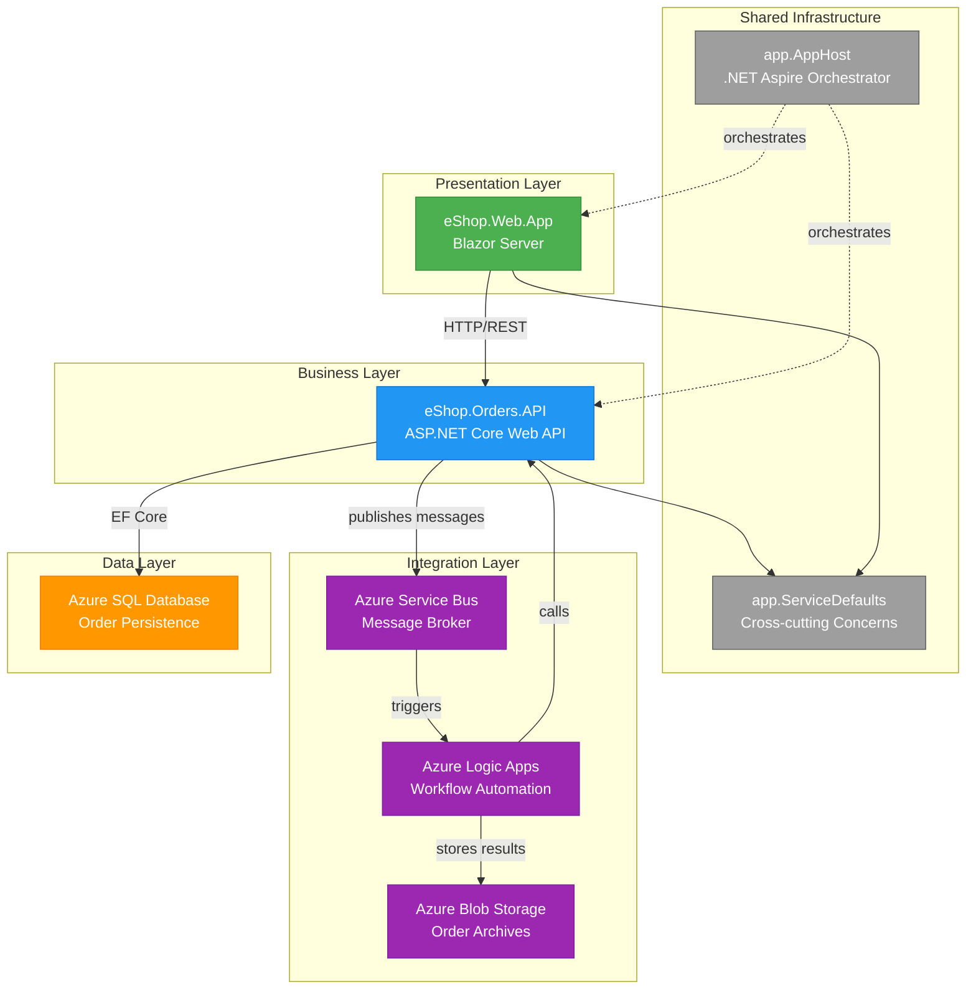
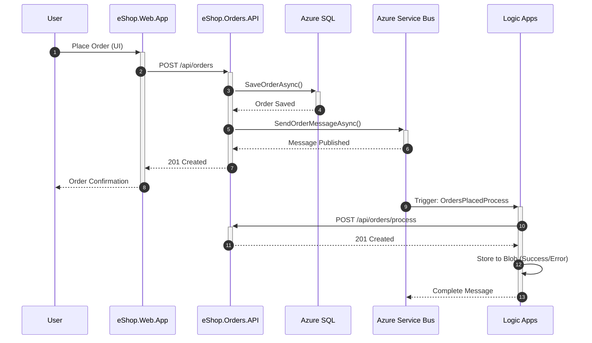
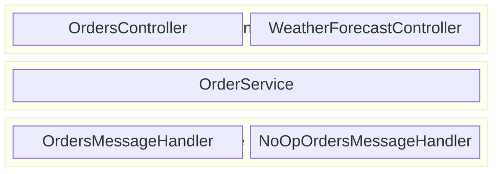
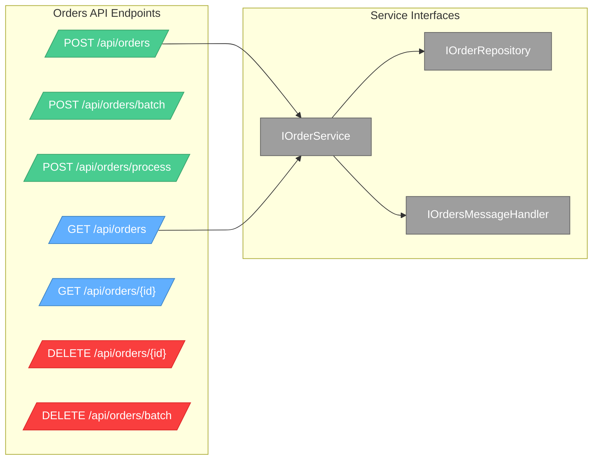
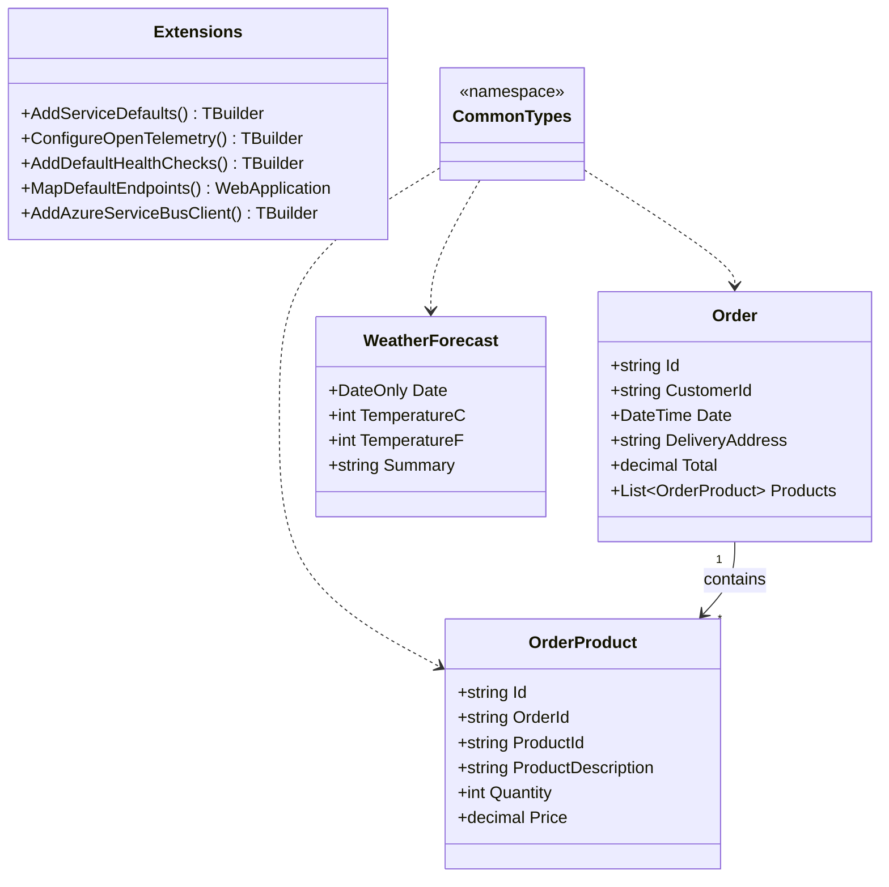
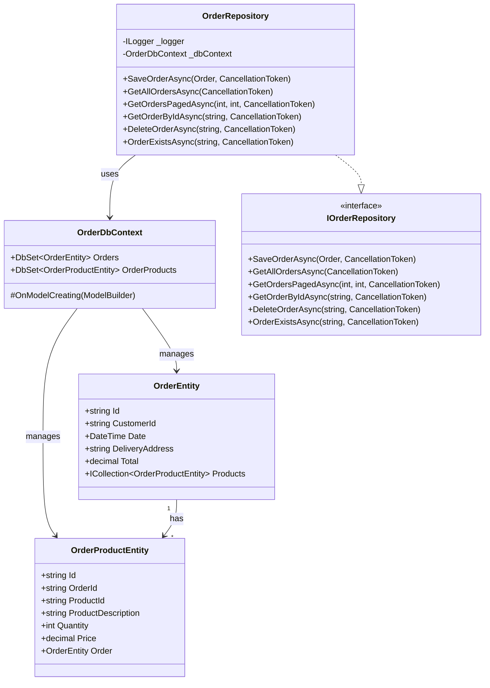
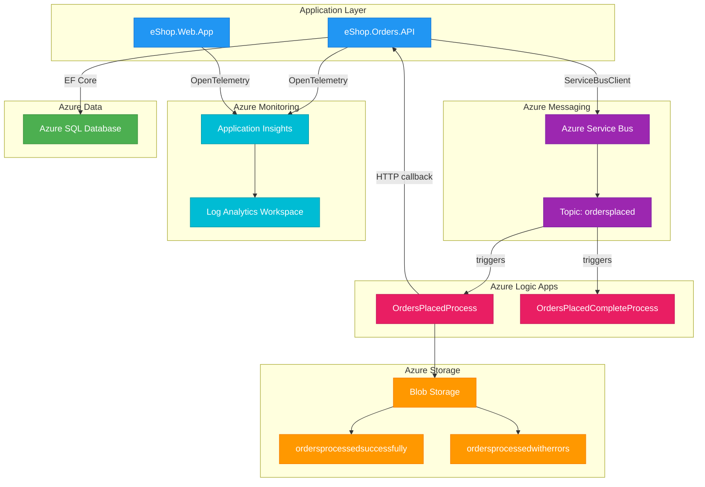
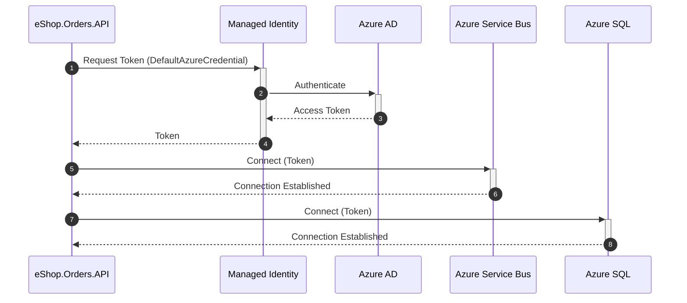
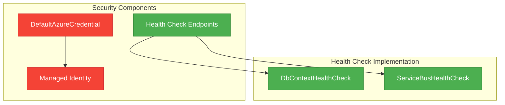
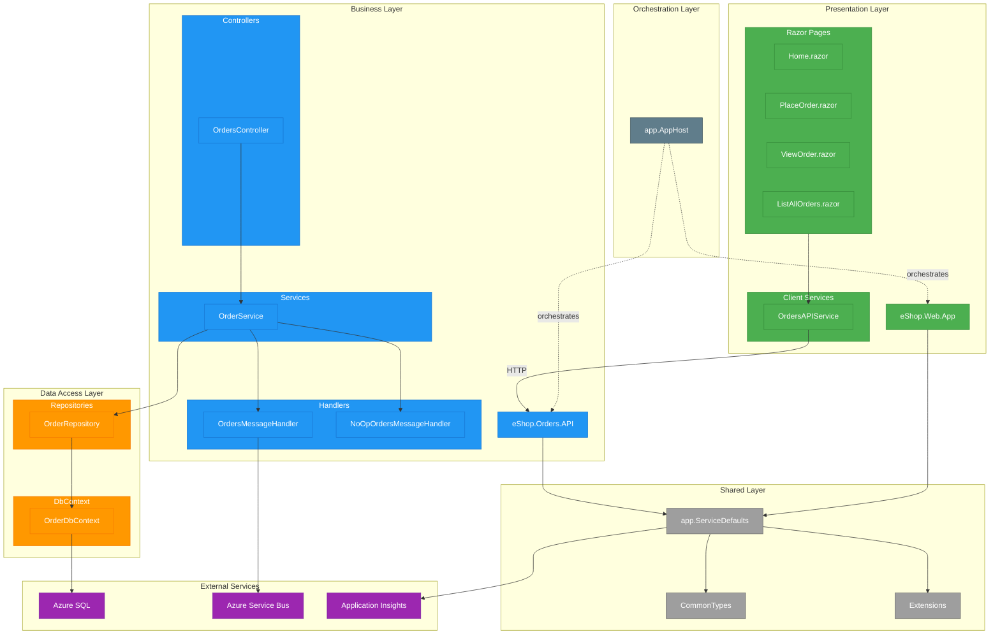

# Application Architecture Document

## TOGAF Application Layer - Azure Logic Apps Monitoring (eShop Orders)

### Document Metadata

- **Generated**: January 28, 2026
- **Scope**: Application Layer Only
- **Framework**: TOGAF BDAT Model
- **Project**: Azure Logic Apps Monitoring Solution
- **Repository**: Azure-LogicApps-Monitoring

---

## 1. Executive Summary

### Overview

This document provides a comprehensive Application Architecture analysis of the Azure Logic Apps Monitoring solution, following TOGAF's Business, Data, Application, Technology (BDAT) framework. The focus is exclusively on the Application Layer, documenting all services, interfaces, components, data access patterns, integrations, and security mechanisms discovered through systematic code analysis.

The Azure Logic Apps Monitoring solution is a cloud-native order management platform built with .NET Aspire orchestration, featuring a Blazor Server frontend, ASP.NET Core Web API backend, Azure Service Bus messaging integration, and Azure Logic Apps workflow automation. The architecture follows clean separation of concerns with distinct presentation, business logic, data access, and integration layers. Key architectural patterns include Repository Pattern, Dependency Injection, Event-Driven Architecture, and comprehensive observability through OpenTelemetry distributed tracing.

---

## 2. Application Architecture Landscape

### Overview

The application landscape comprises four primary application modules orchestrated through .NET Aspire. The solution implements a distributed microservices-style architecture with clear boundaries between the web frontend, backend API, shared service defaults, and workflow automation components. Each module serves a specific purpose within the order management domain while maintaining loose coupling through well-defined interfaces and message-based communication.

### 2.1 Landscape Diagram

### 2.2 Application Portfolio Summary

| Application/Module       | Type                      | Primary Function                                                  | Status |
| ------------------------ | ------------------------- | ----------------------------------------------------------------- | ------ |
| eShop.Web.App            | Blazor Server Application | Order management UI with real-time tracking                       | Active |
| eShop.Orders.API         | ASP.NET Core Web API      | RESTful API for order CRUD operations                             | Active |
| app.ServiceDefaults      | Shared Library            | Cross-cutting concerns (OpenTelemetry, health checks, resilience) | Active |
| app.AppHost              | .NET Aspire Host          | Service orchestration and configuration                           | Active |
| OrdersManagementLogicApp | Azure Logic Apps Workflow | Automated order processing workflows                              | Active |

### 2.3 Key Architectural Patterns

The following architectural patterns were identified through code analysis:

1. **Repository Pattern** - Separation of data access logic from business logic ([OrderRepository.cs](src/eShop.Orders.API/Repositories/OrderRepository.cs))
2. **Service Layer Pattern** - Business logic encapsulation ([OrderService.cs](src/eShop.Orders.API/Services/OrderService.cs))
3. **Dependency Injection** - Constructor injection throughout all components
4. **Event-Driven Architecture** - Azure Service Bus for asynchronous order processing
5. **Health Check Pattern** - Kubernetes-compatible health endpoints ([DbContextHealthCheck.cs](src/eShop.Orders.API/HealthChecks/DbContextHealthCheck.cs), [ServiceBusHealthCheck.cs](src/eShop.Orders.API/HealthChecks/ServiceBusHealthCheck.cs))
6. **Circuit Breaker Pattern** - HTTP resilience via Polly ([Extensions.cs](app.ServiceDefaults/Extensions.cs))
7. **Domain Model Pattern** - Shared domain types ([CommonTypes.cs](app.ServiceDefaults/CommonTypes.cs))
8. **Mapper Pattern** - Entity-to-Domain model conversion ([OrderMapper.cs](src/eShop.Orders.API/data/OrderMapper.cs))

### 2.4 Communication Flows

#### Overview

The application implements synchronous HTTP communication between the web frontend and backend API, with asynchronous message-based communication for order processing workflows. The frontend uses a typed HTTP client with service discovery, while the backend publishes order events to Azure Service Bus for downstream processing by Logic Apps workflows.

| Source            | Target             | Protocol            | Purpose                     |
| ----------------- | ------------------ | ------------------- | --------------------------- |
| eShop.Web.App     | eShop.Orders.API   | HTTPS/REST          | Order CRUD operations       |
| eShop.Orders.API  | Azure SQL          | TDS (SQL Server)    | Data persistence            |
| eShop.Orders.API  | Azure Service Bus  | AMQP                | Publish order events        |
| Azure Service Bus | Logic Apps         | Service Bus Trigger | Workflow automation trigger |
| Logic Apps        | eShop.Orders.API   | HTTPS/REST          | Order processing callback   |
| Logic Apps        | Azure Blob Storage | REST                | Archive processed orders    |

---

## 3. Technology Stack

### Overview

The technology stack is built on .NET 10.0 with modern cloud-native technologies. The solution leverages .NET Aspire for service orchestration, ASP.NET Core for web applications, Entity Framework Core for data access, and Azure services for cloud infrastructure. All versions are verified from project manifest files (.csproj).

| Layer             | Technology                               | Version  | Evidence File                                                                |
| ----------------- | ---------------------------------------- | -------- | ---------------------------------------------------------------------------- |
| Runtime           | .NET SDK                                 | 10.0.100 | [global.json](global.json)                                                   |
| Orchestration     | Aspire.AppHost.Sdk                       | 13.1.0   | [app.AppHost.csproj](app.AppHost/app.AppHost.csproj)                         |
| Web Framework     | ASP.NET Core                             | 10.0     | [eShop.Orders.API.csproj](src/eShop.Orders.API/eShop.Orders.API.csproj)      |
| UI Framework      | Blazor Server                            | 10.0     | [eShop.Web.App.csproj](src/eShop.Web.App/eShop.Web.App.csproj)               |
| UI Components     | Microsoft.FluentUI.AspNetCore.Components | 4.13.2   | [eShop.Web.App.csproj](src/eShop.Web.App/eShop.Web.App.csproj)               |
| ORM               | Microsoft.EntityFrameworkCore.SqlServer  | 10.0.2   | [eShop.Orders.API.csproj](src/eShop.Orders.API/eShop.Orders.API.csproj)      |
| API Documentation | Swashbuckle.AspNetCore                   | 10.1.0   | [eShop.Orders.API.csproj](src/eShop.Orders.API/eShop.Orders.API.csproj)      |
| Messaging         | Azure.Messaging.ServiceBus               | 7.20.1   | [app.ServiceDefaults.csproj](app.ServiceDefaults/app.ServiceDefaults.csproj) |
| Identity          | Azure.Identity                           | 1.17.1   | [app.ServiceDefaults.csproj](app.ServiceDefaults/app.ServiceDefaults.csproj) |
| Telemetry         | OpenTelemetry.Extensions.Hosting         | 1.15.0   | [app.ServiceDefaults.csproj](app.ServiceDefaults/app.ServiceDefaults.csproj) |
| Azure Monitor     | Azure.Monitor.OpenTelemetry.Exporter     | 1.5.0    | [app.ServiceDefaults.csproj](app.ServiceDefaults/app.ServiceDefaults.csproj) |
| Resilience        | Microsoft.Extensions.Http.Resilience     | 10.2.0   | [app.ServiceDefaults.csproj](app.ServiceDefaults/app.ServiceDefaults.csproj) |
| Service Discovery | Microsoft.Extensions.ServiceDiscovery    | 10.2.0   | [app.ServiceDefaults.csproj](app.ServiceDefaults/app.ServiceDefaults.csproj) |

---

## 4. Application Component Catalog

### Overview

This catalog documents all application components discovered through systematic analysis of the codebase. Components are classified according to TOGAF Application Layer taxonomy: Services (business logic), Interfaces (API contracts), Components (reusable modules), Data Access (persistence), Integration (external systems), and Security (authentication/authorization).

### 4.1 Application Services

#### Overview

Application Services encapsulate the core business logic for order management operations. The solution implements a layered service architecture with clear separation between API controllers, business services, and data repositories. Each service is registered with the dependency injection container using scoped lifetime for proper resource management.

| Service Name              | Location                                                                                                                       | Purpose                                                 | Dependencies                                                           |
| ------------------------- | ------------------------------------------------------------------------------------------------------------------------------ | ------------------------------------------------------- | ---------------------------------------------------------------------- |
| OrdersController          | [src/eShop.Orders.API/Controllers/OrdersController.cs](src/eShop.Orders.API/Controllers/OrdersController.cs)                   | REST API endpoints for order CRUD operations            | IOrderService, ActivitySource, ILogger                                 |
| WeatherForecastController | [src/eShop.Orders.API/Controllers/WeatherForecastController.cs](src/eShop.Orders.API/Controllers/WeatherForecastController.cs) | Demo/health check endpoint                              | None                                                                   |
| OrderService              | [src/eShop.Orders.API/Services/OrderService.cs](src/eShop.Orders.API/Services/OrderService.cs)                                 | Business logic for order placement, retrieval, deletion | IOrderRepository, IOrdersMessageHandler, ActivitySource, IMeterFactory |
| OrdersMessageHandler      | [src/eShop.Orders.API/Handlers/OrdersMessageHandler.cs](src/eShop.Orders.API/Handlers/OrdersMessageHandler.cs)                 | Publishes order messages to Azure Service Bus           | ServiceBusClient, IConfiguration, ActivitySource                       |
| NoOpOrdersMessageHandler  | [src/eShop.Orders.API/Handlers/NoOpOrdersMessageHandler.cs](src/eShop.Orders.API/Handlers/NoOpOrdersMessageHandler.cs)         | No-op stub for development without Service Bus          | ILogger                                                                |
| OrdersAPIService          | [src/eShop.Web.App/Components/Services/OrdersAPIService.cs](src/eShop.Web.App/Components/Services/OrdersAPIService.cs)         | Typed HTTP client for Orders API communication          | HttpClient, ILogger, ActivitySource                                    |

### 4.2 Application Interfaces

#### Overview

Application Interfaces define the API contracts and communication protocols between system components. The Orders API exposes a RESTful interface following OpenAPI/Swagger standards with comprehensive documentation. Internal interfaces (IOrderService, IOrderRepository, IOrdersMessageHandler) define contracts for dependency injection and testability.

| Interface             | Endpoint            | Method | Location                                                                             | Description                     |
| --------------------- | ------------------- | ------ | ------------------------------------------------------------------------------------ | ------------------------------- |
| Place Order           | /api/orders         | POST   | [OrdersController.cs#L50](src/eShop.Orders.API/Controllers/OrdersController.cs)      | Create a new order              |
| Place Orders Batch    | /api/orders/batch   | POST   | [OrdersController.cs#L144](src/eShop.Orders.API/Controllers/OrdersController.cs)     | Create multiple orders in batch |
| Process Order         | /api/orders/process | POST   | [OrdersController.cs#L208](src/eShop.Orders.API/Controllers/OrdersController.cs)     | Process order from Logic Apps   |
| Get All Orders        | /api/orders         | GET    | [OrdersController.cs#L222](src/eShop.Orders.API/Controllers/OrdersController.cs)     | Retrieve all orders             |
| Get Order by ID       | /api/orders/{id}    | GET    | [OrdersController.cs#L264](src/eShop.Orders.API/Controllers/OrdersController.cs)     | Retrieve specific order         |
| Delete Order          | /api/orders/{id}    | DELETE | [OrdersController.cs](src/eShop.Orders.API/Controllers/OrdersController.cs)          | Delete specific order           |
| Delete Orders Batch   | /api/orders/batch   | DELETE | [OrdersController.cs](src/eShop.Orders.API/Controllers/OrdersController.cs)          | Delete multiple orders          |
| IOrderService         | N/A                 | N/A    | [IOrderService.cs](src/eShop.Orders.API/Interfaces/IOrderService.cs)                 | Business logic contract         |
| IOrderRepository      | N/A                 | N/A    | [IOrderRepository.cs](src/eShop.Orders.API/Interfaces/IOrderRepository.cs)           | Data access contract            |
| IOrdersMessageHandler | N/A                 | N/A    | [IOrdersMessageHandler.cs](src/eShop.Orders.API/Interfaces/IOrdersMessageHandler.cs) | Messaging contract              |

### 4.3 Application Components

#### Overview

Application Components represent reusable functional modules shared across the solution. The app.ServiceDefaults project provides cross-cutting concerns including OpenTelemetry instrumentation, health check configuration, service discovery, HTTP resilience policies, and Azure Service Bus client setup. The CommonTypes module defines shared domain models used by both frontend and backend.

| Component          | Location                                                                                         | Purpose                                                                        | Used By                         |
| ------------------ | ------------------------------------------------------------------------------------------------ | ------------------------------------------------------------------------------ | ------------------------------- |
| Extensions         | [app.ServiceDefaults/Extensions.cs](app.ServiceDefaults/Extensions.cs)                           | Service defaults (OpenTelemetry, health checks, resilience, service discovery) | eShop.Orders.API, eShop.Web.App |
| Order              | [app.ServiceDefaults/CommonTypes.cs](app.ServiceDefaults/CommonTypes.cs)                         | Domain model for customer orders                                               | eShop.Orders.API, eShop.Web.App |
| OrderProduct       | [app.ServiceDefaults/CommonTypes.cs](app.ServiceDefaults/CommonTypes.cs)                         | Domain model for order line items                                              | eShop.Orders.API, eShop.Web.App |
| WeatherForecast    | [app.ServiceDefaults/CommonTypes.cs](app.ServiceDefaults/CommonTypes.cs)                         | Demo model for health/connectivity tests                                       | eShop.Orders.API                |
| FluentDesignSystem | [src/eShop.Web.App/Shared/FluentDesignSystem.cs](src/eShop.Web.App/Shared/FluentDesignSystem.cs) | UI design system constants                                                     | eShop.Web.App                   |
| OrderMapper        | [src/eShop.Orders.API/data/OrderMapper.cs](src/eShop.Orders.API/data/OrderMapper.cs)             | Entity-to-domain model mapping                                                 | eShop.Orders.API                |

### 4.4 Data Access Layer

#### Overview

The Data Access Layer implements the Repository Pattern using Entity Framework Core with SQL Server. The OrderDbContext provides database operations with configured entity relationships, while OrderRepository implements async CRUD operations with distributed tracing, timeout handling, and duplicate key detection. Entity models (OrderEntity, OrderProductEntity) map to database tables with proper constraints and indexes.

| Repository/Model   | Location                                                                                                     | Entity                | Operations                                      |
| ------------------ | ------------------------------------------------------------------------------------------------------------ | --------------------- | ----------------------------------------------- |
| OrderDbContext     | [src/eShop.Orders.API/data/OrderDbContext.cs](src/eShop.Orders.API/data/OrderDbContext.cs)                   | Orders, OrderProducts | DbSet access, OnModelCreating                   |
| OrderRepository    | [src/eShop.Orders.API/Repositories/OrderRepository.cs](src/eShop.Orders.API/Repositories/OrderRepository.cs) | Order                 | Save, GetAll, GetPaged, GetById, Delete, Exists |
| OrderEntity        | [src/eShop.Orders.API/data/Entities/OrderEntity.cs](src/eShop.Orders.API/data/Entities/OrderEntity.cs)       | Orders table          | Primary key, indexes on CustomerId, Date        |
| OrderProductEntity | [src/eShop.Orders.API/data/Entities/](src/eShop.Orders.API/data/Entities/)                                   | OrderProducts table   | Foreign key to Orders, cascade delete           |
| OrderMapper        | [src/eShop.Orders.API/data/OrderMapper.cs](src/eShop.Orders.API/data/OrderMapper.cs)                         | N/A                   | ToEntity(), ToDomainModel()                     |

### 4.5 Integration Points

#### Overview

Integration Points connect the application to external Azure services for messaging, workflow automation, monitoring, and storage. Azure Service Bus provides asynchronous message delivery with topic/subscription patterns. Azure Logic Apps automate order processing workflows. Application Insights and Log Analytics provide observability. Azure Blob Storage archives processed orders.

| Integration                              | Type                   | External System       | Protocol            | Location                                                                                                                                                                                       |
| ---------------------------------------- | ---------------------- | --------------------- | ------------------- | ---------------------------------------------------------------------------------------------------------------------------------------------------------------------------------------------- |
| Azure Service Bus Client                 | Message Publishing     | Azure Service Bus     | AMQP                | [OrdersMessageHandler.cs](src/eShop.Orders.API/Handlers/OrdersMessageHandler.cs)                                                                                                               |
| Azure SQL Connection                     | Database               | Azure SQL Database    | TDS                 | [OrderDbContext.cs](src/eShop.Orders.API/data/OrderDbContext.cs)                                                                                                                               |
| Application Insights                     | Telemetry              | Azure Monitor         | OTLP/HTTP           | [Extensions.cs](app.ServiceDefaults/Extensions.cs)                                                                                                                                             |
| Logic Apps - OrdersPlacedProcess         | Workflow               | Azure Logic Apps      | Service Bus Trigger | [workflows/OrdersManagement/OrdersManagementLogicApp/OrdersPlacedProcess/workflow.json](workflows/OrdersManagement/OrdersManagementLogicApp/OrdersPlacedProcess/workflow.json)                 |
| Logic Apps - OrdersPlacedCompleteProcess | Workflow               | Azure Logic Apps      | Service Bus Trigger | [workflows/OrdersManagement/OrdersManagementLogicApp/OrdersPlacedCompleteProcess/workflow.json](workflows/OrdersManagement/OrdersManagementLogicApp/OrdersPlacedCompleteProcess/workflow.json) |
| Azure Blob Storage                       | File Storage           | Azure Storage Account | REST                | [workflow.json](workflows/OrdersManagement/OrdersManagementLogicApp/OrdersPlacedProcess/workflow.json)                                                                                         |
| HTTP Client (Service Discovery)          | Internal Communication | eShop.Orders.API      | HTTPS               | [OrdersAPIService.cs](src/eShop.Web.App/Components/Services/OrdersAPIService.cs)                                                                                                               |

### 4.6 Security Components

#### Overview

Security in this application is primarily implemented through Azure Managed Identity for service-to-service authentication, eliminating the need for stored credentials. The solution uses Azure.Identity's DefaultAzureCredential for automatic credential resolution. Health check endpoints expose system status but follow Kubernetes patterns for probe isolation. No explicit authentication middleware was found for the API endpoints, suggesting this is an internal/backend service. [NEEDS VERIFICATION: User authentication may be handled at a gateway level]

| Component                  | Type               | Location                                                                                                                 | Purpose                                            |
| -------------------------- | ------------------ | ------------------------------------------------------------------------------------------------------------------------ | -------------------------------------------------- |
| DefaultAzureCredential     | Identity Provider  | [Extensions.cs](app.ServiceDefaults/Extensions.cs)                                                                       | Managed Identity authentication for Azure services |
| DbContextHealthCheck       | Health Check       | [src/eShop.Orders.API/HealthChecks/DbContextHealthCheck.cs](src/eShop.Orders.API/HealthChecks/DbContextHealthCheck.cs)   | Database connectivity monitoring                   |
| ServiceBusHealthCheck      | Health Check       | [src/eShop.Orders.API/HealthChecks/ServiceBusHealthCheck.cs](src/eShop.Orders.API/HealthChecks/ServiceBusHealthCheck.cs) | Service Bus connectivity monitoring                |
| Azure Tenant/Client Config | Environment Config | [AppHost.cs](app.AppHost/AppHost.cs)                                                                                     | AZURE_TENANT_ID, AZURE_CLIENT_ID for local dev     |

---

## 5. Dependency Map

### Overview

The dependency map illustrates the relationships between all application components, showing how modules, services, and external systems interconnect. Dependencies flow from presentation layer (Web App) through business layer (API) to data and integration layers. The app.ServiceDefaults module is a shared dependency for cross-cutting concerns, while app.AppHost orchestrates the distributed application.

| Source Component     | Target Component           | Dependency Type                   |
| -------------------- | -------------------------- | --------------------------------- |
| app.AppHost          | eShop.Orders.API           | Project Reference (Orchestration) |
| app.AppHost          | eShop.Web.App              | Project Reference (Orchestration) |
| eShop.Web.App        | app.ServiceDefaults        | Project Reference                 |
| eShop.Web.App        | eShop.Orders.API           | HTTP (Service Discovery)          |
| eShop.Orders.API     | app.ServiceDefaults        | Project Reference                 |
| OrdersController     | IOrderService              | Dependency Injection              |
| OrderService         | IOrderRepository           | Dependency Injection              |
| OrderService         | IOrdersMessageHandler      | Dependency Injection              |
| OrderRepository      | OrderDbContext             | Dependency Injection              |
| OrderDbContext       | Azure SQL                  | EF Core Connection                |
| OrdersMessageHandler | ServiceBusClient           | Dependency Injection              |
| Extensions           | Azure.Identity             | NuGet Package                     |
| Extensions           | Azure.Messaging.ServiceBus | NuGet Package                     |
| Extensions           | OpenTelemetry              | NuGet Package                     |

---

## 6. Gaps & Observations

### Overview

This section documents gaps, anti-patterns, and recommendations identified during the architecture analysis. These findings are based on systematic code review and represent opportunities for architectural improvement rather than critical defects.

### 6.1 Identified Gaps

1. **Missing API Authentication** - No explicit authentication middleware (e.g., JWT Bearer, API Key) was found on the Orders API endpoints. This may be intentional if the API is internal-only behind a gateway. [NEEDS VERIFICATION]

2. **Limited Error Handling Documentation** - While error handling exists, there's no centralized error handling middleware or Problem Details (RFC 7807) implementation.

3. **No Rate Limiting** - The API lacks rate limiting configuration which could be important for public-facing scenarios.

4. **Missing API Versioning** - No explicit API versioning strategy (URL path, header, query string) was identified.

5. **Test Coverage Unknown** - Test projects exist ([src/tests/](src/tests/)) but test coverage metrics were not analyzed.

6. **Workflow Error Handling** - Logic Apps workflows have basic error handling (success/error blob storage) but no dead-letter queue processing strategy was identified.

### 6.2 Anti-Patterns Detected

1. **Mixed Concerns in CommonTypes** - The `WeatherForecast` model in [CommonTypes.cs](app.ServiceDefaults/CommonTypes.cs) appears to be a demo artifact mixed with production domain models (`Order`, `OrderProduct`).

2. **Potential N+1 Query Risk** - While pagination is implemented, `GetAllOrdersAsync()` in [IOrderRepository.cs](src/eShop.Orders.API/Interfaces/IOrderRepository.cs) explicitly warns about loading all orders into memory.

### 6.3 Recommendations

1. **Implement API Authentication** - Consider adding JWT Bearer authentication or integrate with Azure API Management for API-level security.

2. **Add Problem Details Middleware** - Implement RFC 7807 Problem Details for standardized error responses across all endpoints.

3. **Implement Rate Limiting** - Add `Microsoft.AspNetCore.RateLimiting` middleware to protect against abuse.

4. **Add API Versioning** - Implement `Microsoft.AspNetCore.Mvc.Versioning` for future API evolution.

5. **Remove Demo Code** - Extract `WeatherForecast` to a separate demo namespace or remove from production CommonTypes.

6. **Implement Dead-Letter Processing** - Add a dedicated workflow or Azure Function to process Service Bus dead-letter messages.

7. **Add Integration Tests** - Consider adding Aspire integration tests using the `Aspire.Hosting.Testing` package to validate distributed application behavior.

---

## Appendix A: Blazor Components Inventory

| Component              | Location                                                                                                               | Purpose                            |
| ---------------------- | ---------------------------------------------------------------------------------------------------------------------- | ---------------------------------- |
| App.razor              | [src/eShop.Web.App/Components/App.razor](src/eShop.Web.App/Components/App.razor)                                       | Root application component         |
| Routes.razor           | [src/eShop.Web.App/Components/Routes.razor](src/eShop.Web.App/Components/Routes.razor)                                 | Routing configuration              |
| Home.razor             | [src/eShop.Web.App/Components/Pages/Home.razor](src/eShop.Web.App/Components/Pages/Home.razor)                         | Landing page with feature showcase |
| PlaceOrder.razor       | [src/eShop.Web.App/Components/Pages/PlaceOrder.razor](src/eShop.Web.App/Components/Pages/PlaceOrder.razor)             | Order creation form                |
| PlaceOrdersBatch.razor | [src/eShop.Web.App/Components/Pages/PlaceOrdersBatch.razor](src/eShop.Web.App/Components/Pages/PlaceOrdersBatch.razor) | Batch order creation               |
| ViewOrder.razor        | [src/eShop.Web.App/Components/Pages/ViewOrder.razor](src/eShop.Web.App/Components/Pages/ViewOrder.razor)               | Order search and details view      |
| ListAllOrders.razor    | [src/eShop.Web.App/Components/Pages/ListAllOrders.razor](src/eShop.Web.App/Components/Pages/ListAllOrders.razor)       | Order listing with batch delete    |
| Error.razor            | [src/eShop.Web.App/Components/Pages/Error.razor](src/eShop.Web.App/Components/Pages/Error.razor)                       | Error handling page                |
| PageHeader.razor       | [src/eShop.Web.App/Components/Shared/PageHeader.razor](src/eShop.Web.App/Components/Shared/PageHeader.razor)           | Reusable page header component     |
| LoadingCard.razor      | [src/eShop.Web.App/Components/Shared/LoadingCard.razor](src/eShop.Web.App/Components/Shared/LoadingCard.razor)         | Loading state indicator            |
| FieldLabel.razor       | [src/eShop.Web.App/Components/Shared/FieldLabel.razor](src/eShop.Web.App/Components/Shared/FieldLabel.razor)           | Form field label component         |

---

## Appendix B: Logic Apps Workflow Inventory

| Workflow                    | Location                                                                                                                                                                                       | Trigger           | Purpose                                          |
| --------------------------- | ---------------------------------------------------------------------------------------------------------------------------------------------------------------------------------------------- | ----------------- | ------------------------------------------------ |
| OrdersPlacedProcess         | [workflows/OrdersManagement/OrdersManagementLogicApp/OrdersPlacedProcess/workflow.json](workflows/OrdersManagement/OrdersManagementLogicApp/OrdersPlacedProcess/workflow.json)                 | Service Bus Topic | Process placed orders, call API, archive to blob |
| OrdersPlacedCompleteProcess | [workflows/OrdersManagement/OrdersManagementLogicApp/OrdersPlacedCompleteProcess/workflow.json](workflows/OrdersManagement/OrdersManagementLogicApp/OrdersPlacedCompleteProcess/workflow.json) | Service Bus Topic | Complete order processing workflow               |

---

_Document generated through systematic code analysis following TOGAF Application Architecture principles._
