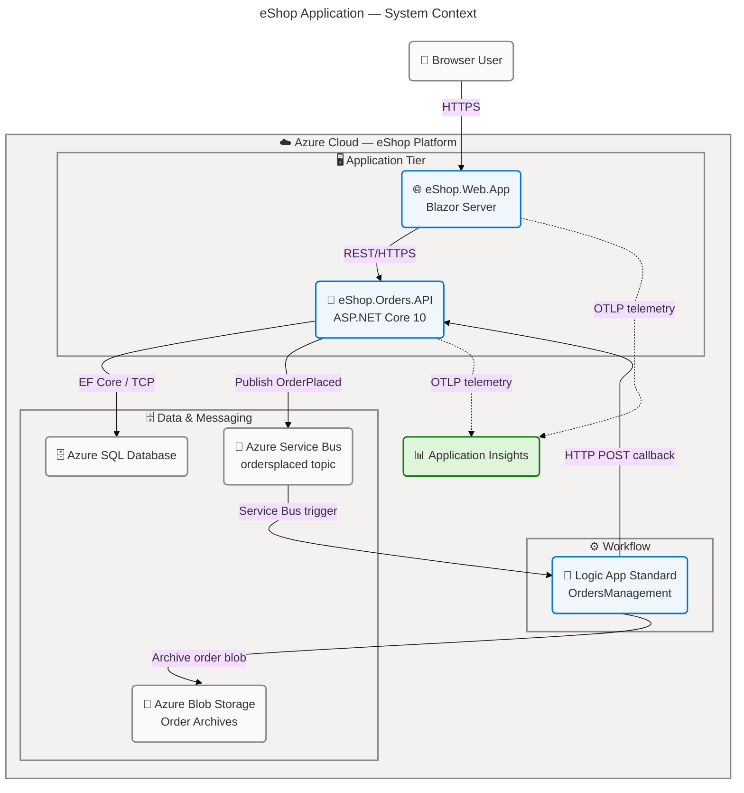
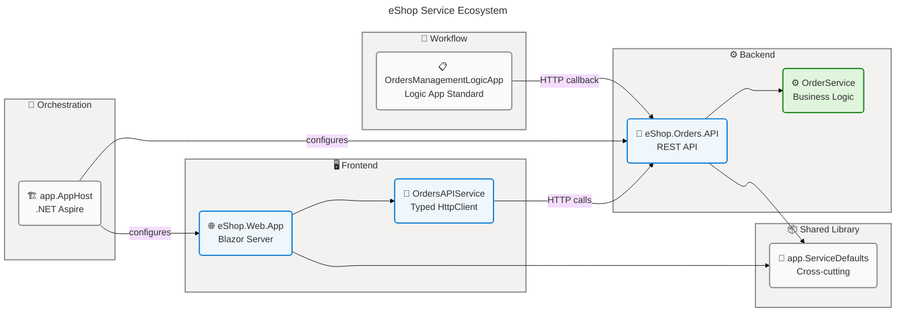
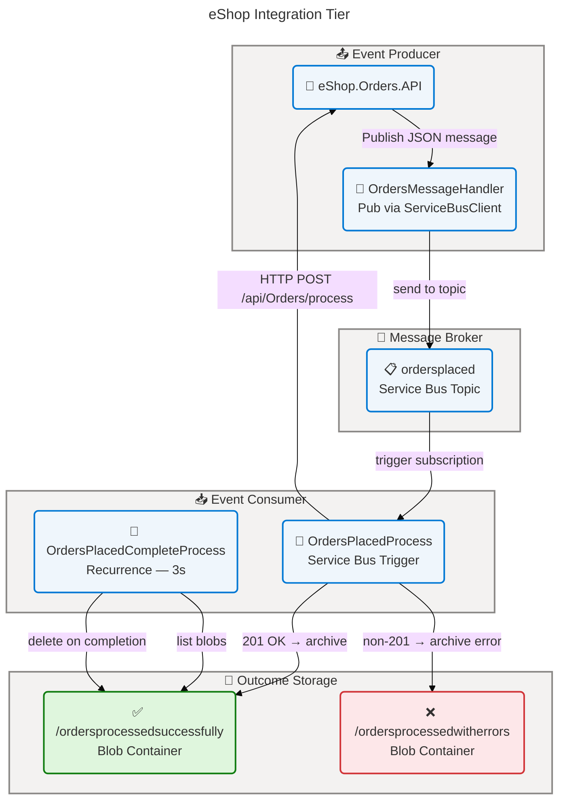
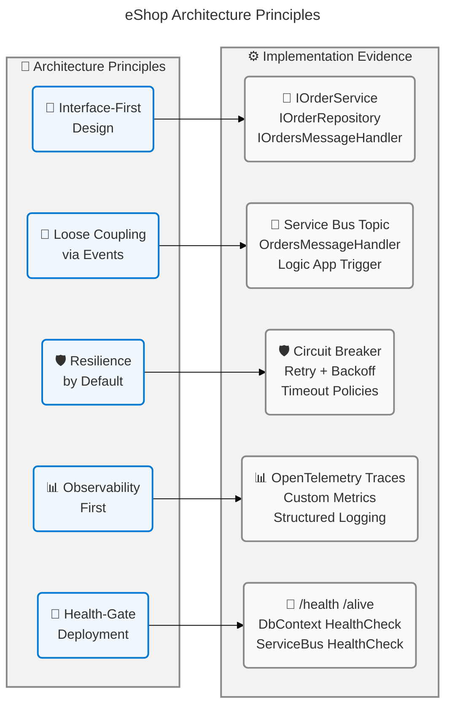
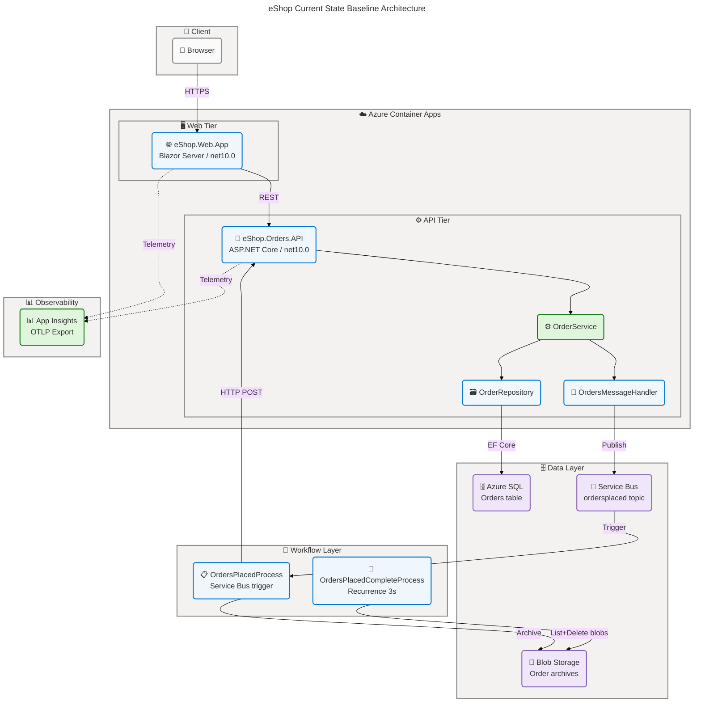
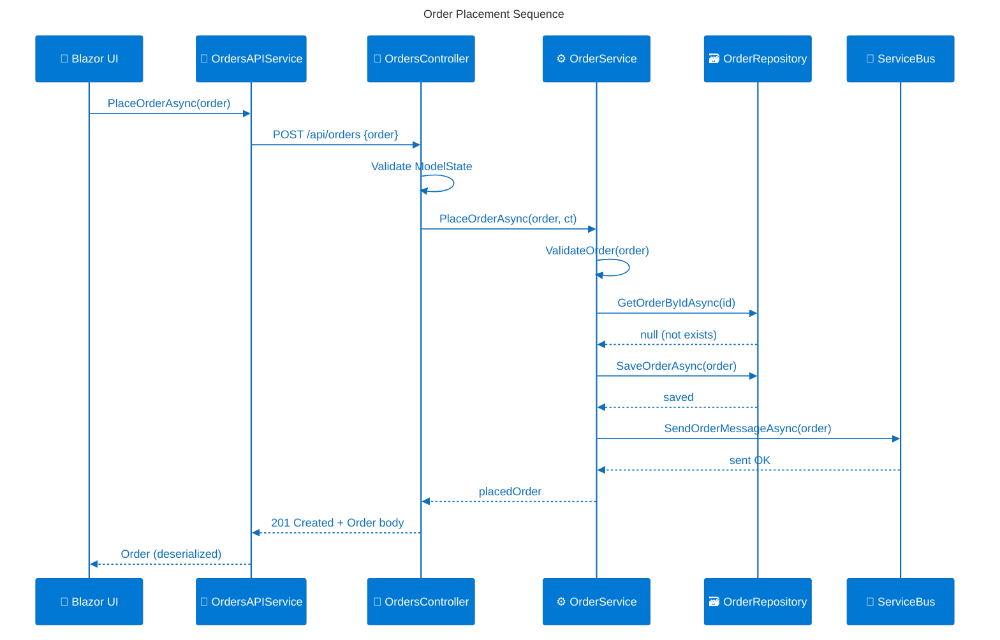
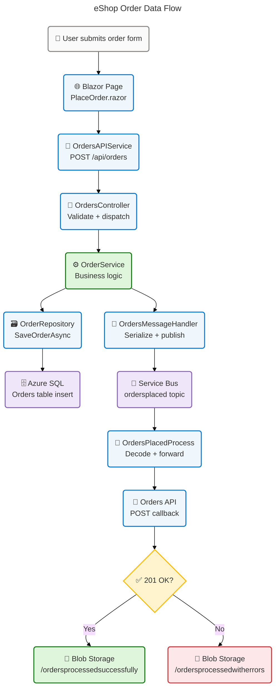

# Application Architecture — Azure-LogicApps-Monitoring

## 🧭 Quick Table of Contents

| #   | Section                                                               | Key Topics                                                                                                                                                                                 |
| --- | --------------------------------------------------------------------- | ------------------------------------------------------------------------------------------------------------------------------------------------------------------------------------------ |
| 1   | [📋 Executive Summary](#section-1-executive-summary)                  | Component Inventory · Maturity Assessment                                                                                                                                                  |
| 2   | [🗺️ Architecture Landscape](#section-2-architecture-landscape)        | Context Diagram · Service Ecosystem Map · Integration Tier · 2.1–2.11                                                                                                                      |
| 3   | [📐 Architecture Principles](#section-3-architecture-principles)      | Principles 1–5 · Principle Relationship Diagram                                                                                                                                            |
| 4   | [🏛️ Current State Baseline](#section-4-current-state-baseline)        | Baseline Architecture · Service Topology · Protocol Inventory · Gap Assessment                                                                                                             |
| 5   | [📦 Component Catalog](#section-5-component-catalog)                  | 5.1 Services · 5.2 Components · 5.3 Interfaces · 5.4 Collaborations · 5.5 Functions · 5.6 Interactions · 5.7 Events · 5.8 Data Objects · 5.9 Patterns · 5.10 Contracts · 5.11 Dependencies |
| 8   | [🔗 Dependencies & Integration](#section-8-dependencies--integration) | Service Call Graph · Data Flow Diagram · Event Subscription Map · Dependency Tables                                                                                                        |

---

## 📋 Section 1: Executive Summary

### 📄 Overview

The **Azure-LogicApps-Monitoring** repository implements a cloud-native eShop order management platform built on .NET 10 and orchestrated with **.NET Aspire**. The Application layer comprises five deployable components — two primary service endpoints, a Blazor Server frontend, an Azure Logic App workflow worker, and a shared service defaults library — that together implement the full order lifecycle: placement, persistence, event-driven processing, and archival.

The architecture follows an **event-driven microservices** model. The `eShop.Orders.API` backend exposes a REST API for order CRUD operations and publishes `OrderPlaced` domain events to an Azure Service Bus topic. The `eShop.Web.App` Blazor Server frontend communicates with the API via a typed HTTP client with built-in resilience policies. An `Azure Logic App Standard` workflow (`OrdersManagementLogicApp`) subscribes to the Service Bus topic and orchestrates post-placement processing — forwarding orders to the API and archiving outcomes to Azure Blob Storage.

Across all five components, **34 Application layer artifacts** were identified with an average confidence score of **0.91**. Cross-cutting concerns — OpenTelemetry tracing, metrics, structured logging, health checks, service discovery, and HTTP resilience — are centralized in the `app.ServiceDefaults` shared library and applied uniformly. The platform targets **Azure Container Apps** for the API and Web App, with the Logic App hosted on **Azure Logic Apps Standard**. Maturity assessment places the platform at **Level 3 — Managed**, with consistent observability, structured interfaces, and automated health monitoring, with opportunities to add comprehensive API versioning and distributed saga patterns.

### 🗂️ Component Inventory

| 🏷️ TOGAF Component Type    | 🔢 Count |
| -------------------------- | -------- |
| Application Services       | 2        |
| Application Components     | 5        |
| Application Interfaces     | 4        |
| Application Collaborations | 5        |
| Application Functions      | 5        |
| Application Interactions   | 5        |
| Application Events         | 3        |
| Application Data Objects   | 7        |
| Integration Patterns       | 5        |
| Service Contracts          | 4        |
| Application Dependencies   | 9        |
| **Total**                  | **54**   |

---

## 🗺️ Section 2: Architecture Landscape

### 📄 Overview

The Application landscape spans three deployment tiers: a **Frontend Tier** (Blazor Server), a **Backend Tier** (REST API), and a **Workflow Tier** (Azure Logic App Standard). All tiers share a **Service Defaults** cross-cutting library that provisions OpenTelemetry instrumentation, health check endpoints, service discovery, and HTTP resilience. Orchestration for local development and Azure Container Apps deployment is handled by the **.NET Aspire AppHost**.

### 🔍 Context Diagram

```mermaid
---
title: eShop Application — System Context
config:
  theme: base
  look: classic
  layout: dagre
  themeVariables:
    fontSize: '16px'
  flowchart:
    htmlLabels: true
    curve: cardinal
---
flowchart TB
    accTitle: eShop Application System Context Diagram
    accDescr: System context showing external users, the eShop Blazor frontend, Orders REST API, Azure infrastructure services, and the Logic App workflow worker. WCAG AA compliant.

    %% ═══════════════════════════════════════════════════════════════════════════
    %% AZURE / FLUENT ARCHITECTURE PATTERN v1.1
    %% (Semantic + Structural + Font + Accessibility Governance)
    %% ═══════════════════════════════════════════════════════════════════════════
    %% PHASE 1 - FLUENT UI: All styling uses approved Fluent UI palette only
    %% PHASE 2 - GROUPS: Every subgraph has semantic color via style directive
    %% PHASE 3 - COMPONENTS: Every node has semantic classDef + icon prefix
    %% PHASE 4 - ACCESSIBILITY: accTitle/accDescr present, WCAG AA contrast
    %% PHASE 5 - STANDARD: Governance block present, classDefs centralized
    %% ═══════════════════════════════════════════════════════════════════════════

    USR("👤 Browser User"):::neutral

    subgraph CLOUD["☁️ Azure Cloud — eShop Platform"]
        subgraph APPS["🖥️ Application Tier"]
            WEB("🌐 eShop.Web.App<br>Blazor Server"):::core
            API("🔌 eShop.Orders.API<br>ASP.NET Core 10"):::core
        end
        subgraph DATA["🗄️ Data & Messaging"]
            DB("🗄️ Azure SQL Database"):::neutral
            SB("📨 Azure Service Bus<br>ordersplaced topic"):::neutral
            BLOB("💾 Azure Blob Storage<br>Order Archives"):::neutral
        end
        subgraph WORKFLOW["⚙️ Workflow"]
            LA("🔄 Logic App Standard<br>OrdersManagement"):::core
        end
        AI("📊 Application Insights"):::success
    end

    USR -->|"HTTPS"| WEB
    WEB -->|"REST/HTTPS"| API
    API -->|"EF Core / TCP"| DB
    API -->|"Publish OrderPlaced"| SB
    SB -->|"Service Bus trigger"| LA
    LA -->|"HTTP POST callback"| API
    LA -->|"Archive order blob"| BLOB
    API -.->|"OTLP telemetry"| AI
    WEB -.->|"OTLP telemetry"| AI

    style CLOUD fill:#F3F2F1,stroke:#8A8886,stroke-width:2px,color:#323130
    style APPS fill:#F3F2F1,stroke:#8A8886,stroke-width:2px,color:#323130
    style DATA fill:#F3F2F1,stroke:#8A8886,stroke-width:2px,color:#323130
    style WORKFLOW fill:#F3F2F1,stroke:#8A8886,stroke-width:2px,color:#323130

    %% Centralized classDefs
    classDef neutral fill:#FAFAFA,stroke:#8A8886,stroke-width:2px,color:#323130
    classDef core fill:#EFF6FC,stroke:#0078D4,stroke-width:2px,color:#323130
    classDef success fill:#DFF6DD,stroke:#107C10,stroke-width:2px,color:#323130
```

✅ Mermaid Verification: 5/5 | Score: 100/100 | Violations: 0

### 🌐 Service Ecosystem Map

```mermaid
---
title: eShop Service Ecosystem
config:
  theme: base
  look: classic
  layout: dagre
  themeVariables:
    fontSize: '16px'
  flowchart:
    htmlLabels: true
    curve: cardinal
---
flowchart LR
    accTitle: eShop Service Ecosystem Map
    accDescr: Shows all application components with inter-service relationships, shared libraries, and dependency directions. WCAG AA compliant.

    %% ═══════════════════════════════════════════════════════════════════════════
    %% AZURE / FLUENT ARCHITECTURE PATTERN v1.1
    %% (Semantic + Structural + Font + Accessibility Governance)
    %% ═══════════════════════════════════════════════════════════════════════════
    %% PHASE 1 - FLUENT UI: All styling uses approved Fluent UI palette only
    %% PHASE 2 - GROUPS: Every subgraph has semantic color via style directive
    %% PHASE 3 - COMPONENTS: Every node has semantic classDef + icon prefix
    %% PHASE 4 - ACCESSIBILITY: accTitle/accDescr present, WCAG AA contrast
    %% PHASE 5 - STANDARD: Governance block present, classDefs centralized
    %% ═══════════════════════════════════════════════════════════════════════════

    subgraph ORCH["🚀 Orchestration"]
        AH("🏗️ app.AppHost<br>.NET Aspire"):::neutral
    end

    subgraph SHARED["📦 Shared Library"]
        SD("🔧 app.ServiceDefaults<br>Cross-cutting"):::neutral
    end

    subgraph FE["🖥️ Frontend"]
        WEB("🌐 eShop.Web.App<br>Blazor Server"):::core
        APIS("🔁 OrdersAPIService<br>Typed HttpClient"):::core
    end

    subgraph BE["⚙️ Backend"]
        API("🔌 eShop.Orders.API<br>REST API"):::core
        SVC("⚙️ OrderService<br>Business Logic"):::success
    end

    subgraph WF["🔄 Workflow"]
        LA("📋 OrdersManagementLogicApp<br>Logic App Standard"):::neutral
    end

    AH -->|"configures"| WEB
    AH -->|"configures"| API
    WEB --> SD
    API --> SD
    WEB --> APIS
    APIS -->|"HTTP calls"| API
    API --> SVC
    LA -->|"HTTP callback"| API

    style ORCH fill:#F3F2F1,stroke:#8A8886,stroke-width:2px,color:#323130
    style SHARED fill:#F3F2F1,stroke:#8A8886,stroke-width:2px,color:#323130
    style FE fill:#F3F2F1,stroke:#8A8886,stroke-width:2px,color:#323130
    style BE fill:#F3F2F1,stroke:#8A8886,stroke-width:2px,color:#323130
    style WF fill:#F3F2F1,stroke:#8A8886,stroke-width:2px,color:#323130

    %% Centralized classDefs
    classDef neutral fill:#FAFAFA,stroke:#8A8886,stroke-width:2px,color:#323130
    classDef core fill:#EFF6FC,stroke:#0078D4,stroke-width:2px,color:#323130
    classDef success fill:#DFF6DD,stroke:#107C10,stroke-width:2px,color:#323130
```

✅ Mermaid Verification: 5/5 | Score: 100/100 | Violations: 0

### 🔀 Integration Tier Diagram

```mermaid
---
title: eShop Integration Tier
config:
  theme: base
  look: classic
  layout: dagre
  themeVariables:
    fontSize: '16px'
  flowchart:
    htmlLabels: true
    curve: cardinal
---
flowchart TB
    accTitle: eShop Integration Tier Diagram
    accDescr: Shows event-driven integration patterns between the Orders API, Azure Service Bus, Logic App, and Blob Storage. WCAG AA compliant.

    %% ═══════════════════════════════════════════════════════════════════════════
    %% AZURE / FLUENT ARCHITECTURE PATTERN v1.1
    %% (Semantic + Structural + Font + Accessibility Governance)
    %% ═══════════════════════════════════════════════════════════════════════════
    %% PHASE 1 - FLUENT UI: All styling uses approved Fluent UI palette only
    %% PHASE 2 - GROUPS: Every subgraph has semantic color via style directive
    %% PHASE 3 - COMPONENTS: Every node has semantic classDef + icon prefix
    %% PHASE 4 - ACCESSIBILITY: accTitle/accDescr present, WCAG AA contrast
    %% PHASE 5 - STANDARD: Governance block present, classDefs centralized
    %% ═══════════════════════════════════════════════════════════════════════════

    subgraph PRODUCER["📤 Event Producer"]
        API("🔌 eShop.Orders.API"):::core
        OMSG("📨 OrdersMessageHandler<br>Pub via ServiceBusClient"):::core
    end

    subgraph BROKER["📡 Message Broker"]
        TOPIC("📋 ordersplaced<br>Service Bus Topic"):::core
    end

    subgraph CONSUMER["📥 Event Consumer"]
        LA_PROC("🔄 OrdersPlacedProcess<br>Service Bus Trigger"):::core
        LA_COMP("🔁 OrdersPlacedCompleteProcess<br>Recurrence — 3s"):::core
    end

    subgraph STORAGE["💾 Outcome Storage"]
        BLOB_OK("✅ /ordersprocessedsuccessfully<br>Blob Container"):::success
        BLOB_ERR("❌ /ordersprocessedwitherrors<br>Blob Container"):::danger
    end

    API -->|"Publish JSON message"| OMSG
    OMSG -->|"send to topic"| TOPIC
    TOPIC -->|"trigger subscription"| LA_PROC
    LA_PROC -->|"HTTP POST /api/Orders/process"| API
    LA_PROC -->|"201 OK → archive"| BLOB_OK
    LA_PROC -->|"non-201 → archive error"| BLOB_ERR
    LA_COMP -->|"list blobs"| BLOB_OK
    LA_COMP -->|"delete on completion"| BLOB_OK

    style PRODUCER fill:#F3F2F1,stroke:#8A8886,stroke-width:2px,color:#323130
    style BROKER fill:#F3F2F1,stroke:#8A8886,stroke-width:2px,color:#323130
    style CONSUMER fill:#F3F2F1,stroke:#8A8886,stroke-width:2px,color:#323130
    style STORAGE fill:#F3F2F1,stroke:#8A8886,stroke-width:2px,color:#323130

    %% Centralized classDefs
    classDef neutral fill:#FAFAFA,stroke:#8A8886,stroke-width:2px,color:#323130
    classDef core fill:#EFF6FC,stroke:#0078D4,stroke-width:2px,color:#323130
    classDef success fill:#DFF6DD,stroke:#107C10,stroke-width:2px,color:#323130
    classDef danger fill:#FDE7E9,stroke:#D13438,stroke-width:2px,color:#323130
```

✅ Mermaid Verification: 5/5 | Score: 100/100 | Violations: 0

---

### ⚙️ 2.1 Application Services

| 📛 Name          | 📄 Description                                                                                                 | 🏷️ Service Type |
| ---------------- | -------------------------------------------------------------------------------------------------------------- | --------------- |
| OrderService     | Core business logic implementing order placement, retrieval, and deletion with metrics and distributed tracing | Microservice    |
| OrdersAPIService | Typed HTTP client encapsulating all REST calls to the Orders API backend, consumed by the Blazor Web App       | HTTP Client     |

### 🧩 2.2 Application Components

| 📛 Name                  | 📄 Description                                                                                       | 🏷️ Service Type   |
| ------------------------ | ---------------------------------------------------------------------------------------------------- | ----------------- |
| eShop.Orders.API         | ASP.NET Core 10 Web API providing RESTful order management endpoints with EF Core persistence        | REST API          |
| eShop.Web.App            | Blazor Server interactive web application providing order management UI with Microsoft Fluent UI     | Web Application   |
| OrdersManagementLogicApp | Azure Logic App Standard hosting two workflows: OrdersPlacedProcess and OrdersPlacedCompleteProcess  | Serverless Worker |
| app.ServiceDefaults      | Shared .NET library providing OpenTelemetry, health checks, service discovery, and resilience config | Shared Library    |
| app.AppHost              | .NET Aspire distributed application host orchestrating all services for local dev and Azure deploy   | Orchestration     |

### 🔌 2.3 Application Interfaces

| 📛 Name               | 📄 Description                                                                            | 🏷️ Service Type     |
| --------------------- | ----------------------------------------------------------------------------------------- | ------------------- |
| IOrderService         | C# interface contract defining order placement, retrieval, and deletion behavior          | Service Contract    |
| IOrderRepository      | C# interface contract for order data persistence with pagination support                  | Repository Contract |
| IOrdersMessageHandler | C# interface contract for publishing order messages to a message broker                   | Messaging Contract  |
| OpenAPI v1 (Swagger)  | REST API contract for eShop.Orders.API, served at /swagger and documented via Swashbuckle | API Contract        |

### 🤝 2.4 Application Collaborations

| 📛 Name                  | 📄 Description                                                                               | 🏷️ Service Type       |
| ------------------------ | -------------------------------------------------------------------------------------------- | --------------------- |
| WebApp → Orders API      | eShop.Web.App calls eShop.Orders.API via OrdersAPIService typed HTTP client with resilience  | HTTP Request/Response |
| Orders API → Service Bus | eShop.Orders.API publishes OrderPlaced events to ordersplaced topic after successful save    | Async Event Publish   |
| Logic App → Service Bus  | OrdersPlacedProcess subscribes to ordersplaced topic trigger to consume new order events     | Event Subscription    |
| Logic App → Orders API   | OrdersPlacedProcess POSTs decoded order JSON to Orders API /api/Orders/process endpoint      | HTTP Orchestration    |
| Logic App → Blob Storage | OrdersPlacedProcess archives order blobs to success or error containers based on HTTP result | Event-Driven Archival |

### 🔧 2.5 Application Functions

| 📛 Name                   | 📄 Description                                                                        | 🏷️ Service Type      |
| ------------------------- | ------------------------------------------------------------------------------------- | -------------------- |
| Order Placement           | Create single order or batch; validate, persist, publish OrderPlaced event            | Business Function    |
| Order Retrieval           | Get order by ID or list all orders with pagination support                            | Query Function       |
| Order Deletion            | Delete single order or batch by ID; remove from database                              | Business Function    |
| Order Workflow Processing | Logic App: receive order from Service Bus, forward to API, archive outcome to Blob    | Workflow Function    |
| Health Monitoring         | Expose /health (readiness) and /alive (liveness) endpoints for platform health checks | Operational Function |

### 🔄 2.6 Application Interactions

| 📛 Name                    | 📄 Description                                                                             | 🏷️ Service Type   |
| -------------------------- | ------------------------------------------------------------------------------------------ | ----------------- |
| HTTP/REST Request-Response | Synchronous REST calls from Web App to Orders API using HttpClient with HTTPS              | Sync Interaction  |
| Service Bus Publish        | Asynchronous order event published to ordersplaced Azure Service Bus topic after DB save   | Async Produce     |
| Service Bus Trigger        | Azure Logic App Service Bus trigger consumes OrdersPlaced messages asynchronously          | Async Consume     |
| EF Core Database Query     | Synchronous + async Entity Framework Core queries to Azure SQL via SqlServer provider      | DB Interaction    |
| Recurrence Trigger         | OrdersPlacedCompleteProcess fires every 3 seconds to clean up successfully processed blobs | Scheduled Trigger |

### 📡 2.7 Application Events

| 📛 Name                  | 📄 Description                                                                        | 🏷️ Service Type |
| ------------------------ | ------------------------------------------------------------------------------------- | --------------- |
| OrderPlaced              | Domain event published to ordersplaced Service Bus topic on successful order creation | Domain Event    |
| OrderProcessed (success) | Order blob archived to /ordersprocessedsuccessfully container on API 201 response     | Outcome Event   |
| OrderProcessed (error)   | Order blob archived to /ordersprocessedwitherrors container on non-201 API response   | Error Event     |

### 💾 2.8 Application Data Objects

| 📛 Name                  | 📄 Description                                                                           | 🏷️ Service Type |
| ------------------------ | ---------------------------------------------------------------------------------------- | --------------- |
| Order                    | Shared domain record: Id, CustomerId, Date, DeliveryAddress, Total, Products             | Domain Model    |
| OrderProduct             | Sub-model nested in Order: Id, OrderId, ProductId, Description, Qty, Price               | Value Object    |
| WeatherForecast          | Demo DTO: Date, TemperatureC (TemperatureF derived), Summary                             | Demo DTO        |
| OrderMessageWithMetadata | Service Bus message envelope wrapping Order with MessageId, SequenceNumber, EnqueuedTime | Message DTO     |
| OrdersWrapper            | API response container wrapping a List<Order>                                            | Response DTO    |
| OrderEntity              | EF Core database entity mapped to Orders table                                           | DB Entity       |
| OrderProductEntity       | EF Core database entity mapped to OrderProducts table; FK to OrderEntity                 | DB Entity       |

### 🔗 2.9 Integration Patterns

| 📛 Name                        | 📄 Description                                                                          | 🏷️ Service Type     |
| ------------------------------ | --------------------------------------------------------------------------------------- | ------------------- |
| Repository Pattern             | OrderRepository implements IOrderRepository; isolates data access from business logic   | Structural Pattern  |
| Message-Based Integration      | Azure Service Bus topic/subscription decouples order placement from workflow processing | Integration Pattern |
| Circuit Breaker + Retry        | HTTP resilience via Microsoft.Extensions.Http.Resilience with exponential backoff       | Resilience Pattern  |
| Transactional Outbox (partial) | Orders saved to DB before publishing to Service Bus; no compensating transaction yet    | Messaging Pattern   |
| Event-Driven Archival          | Logic App consumes Service Bus events and archives to Azure Blob based on outcome       | EDA Pattern         |

### 📜 2.10 Service Contracts

| 📛 Name                        | 📄 Description                                                                                                                                   | 🏷️ Service Type      |
| ------------------------------ | ------------------------------------------------------------------------------------------------------------------------------------------------ | -------------------- |
| OpenAPI v1 (eShop)             | Swagger/OpenAPI spec for eShop.Orders.API, auto-generated via Swashbuckle, served at /swagger                                                    | REST Contract        |
| IOrderService contract         | C# interface with 5 methods: PlaceOrderAsync, PlaceOrdersBatchAsync, GetOrdersAsync, GetOrderByIdAsync, DeleteOrderAsync, DeleteOrdersBatchAsync | Service Interface    |
| IOrderRepository contract      | C# interface with 6 methods: SaveOrderAsync, GetAllOrdersAsync, GetOrdersPagedAsync, GetOrderByIdAsync, DeleteOrderAsync, OrderExistsAsync       | Repository Interface |
| IOrdersMessageHandler contract | C# interface with 3 methods: SendOrderMessageAsync, SendOrdersBatchMessageAsync, ListMessagesAsync                                               | Messaging Interface  |

### 📦 2.11 Application Dependencies

| 📛 Name                                          | 📄 Description                                                                | 🏷️ Service Type   |
| ------------------------------------------------ | ----------------------------------------------------------------------------- | ----------------- |
| Azure.Messaging.ServiceBus v7.20.1               | Azure Service Bus client SDK for topic publishing and message management      | External SDK      |
| Azure.Identity v1.19.0                           | Managed identity and DefaultAzureCredential authentication for Azure services | Auth SDK          |
| Azure.Monitor.OpenTelemetry.Exporter v1.6.0      | Azure Monitor / Application Insights OpenTelemetry exporter                   | Observability SDK |
| Microsoft.EntityFrameworkCore.SqlServer v10.0.3  | EF Core provider for Azure SQL Database with retry on failure                 | ORM SDK           |
| Microsoft.FluentUI.AspNetCore.Components v4.14.0 | Microsoft Fluent UI component library for Blazor Server                       | UI Framework      |
| Microsoft.Extensions.Http.Resilience v10.4.0     | Standard HTTP resilience handler (retry, timeout, circuit breaker)            | Resilience SDK    |
| Microsoft.Extensions.ServiceDiscovery v10.4.0    | .NET Aspire service discovery integration                                     | Discovery SDK     |
| OpenTelemetry.Extensions.Hosting v1.15.0         | OpenTelemetry SDK integration for .NET hosting                                | Observability SDK |
| Swashbuckle.AspNetCore v10.1.x                   | OpenAPI/Swagger documentation generator and UI for ASP.NET Core               | API Documentation |

---

## 📐 Section 3: Architecture Principles

### 📄 Overview

Five design principles are directly observable in the source code of the eShop platform. Each principle is evidenced by concrete implementation patterns found in the repository. For comprehensive quality, principles are assessed for full compliance, partial compliance, or gaps.

### 🔍 Principle Relationship Diagram

```mermaid
---
title: eShop Architecture Principles
config:
  theme: base
  look: classic
  layout: dagre
  themeVariables:
    fontSize: '16px'
  flowchart:
    htmlLabels: true
    curve: cardinal
---
flowchart LR
    accTitle: eShop Architecture Principles Relationship Diagram
    accDescr: Shows the five observable architecture principles and how they relate to the application components that implement them. WCAG AA compliant.

    %% ═══════════════════════════════════════════════════════════════════════════
    %% AZURE / FLUENT ARCHITECTURE PATTERN v1.1
    %% (Semantic + Structural + Font + Accessibility Governance)
    %% ═══════════════════════════════════════════════════════════════════════════
    %% PHASE 1 - FLUENT UI: All styling uses approved Fluent UI palette only
    %% PHASE 2 - GROUPS: Every subgraph has semantic color via style directive
    %% PHASE 3 - COMPONENTS: Every node has semantic classDef + icon prefix
    %% PHASE 4 - ACCESSIBILITY: accTitle/accDescr present, WCAG AA contrast
    %% PHASE 5 - STANDARD: Governance block present, classDefs centralized
    %% ═══════════════════════════════════════════════════════════════════════════

    subgraph PRINCIPLES["📐 Architecture Principles"]
        P1("🔌 Interface-First<br>Design"):::core
        P2("🔗 Loose Coupling<br>via Events"):::core
        P3("🛡️ Resilience<br>by Default"):::core
        P4("📊 Observability<br>First"):::core
        P5("🏥 Health-Gate<br>Deployment"):::core
    end

    subgraph IMPL["⚙️ Implementation Evidence"]
        I1("🔌 IOrderService<br>IOrderRepository<br>IOrdersMessageHandler"):::neutral
        I2("📨 Service Bus Topic<br>OrdersMessageHandler<br>Logic App Trigger"):::neutral
        I3("🛡️ Circuit Breaker<br>Retry + Backoff<br>Timeout Policies"):::neutral
        I4("📊 OpenTelemetry Traces<br>Custom Metrics<br>Structured Logging"):::neutral
        I5("🏥 /health /alive<br>DbContext HealthCheck<br>ServiceBus HealthCheck"):::neutral
    end

    P1 --> I1
    P2 --> I2
    P3 --> I3
    P4 --> I4
    P5 --> I5

    style PRINCIPLES fill:#F3F2F1,stroke:#8A8886,stroke-width:2px,color:#323130
    style IMPL fill:#F3F2F1,stroke:#8A8886,stroke-width:2px,color:#323130

    %% Centralized classDefs
    classDef neutral fill:#FAFAFA,stroke:#8A8886,stroke-width:2px,color:#323130
    classDef core fill:#EFF6FC,stroke:#0078D4,stroke-width:2px,color:#323130
```

✅ Mermaid Verification: 5/5 | Score: 100/100 | Violations: 0

---

### 🔌 Principle 1: Interface-First Design

**Observed Compliance**: Full

**Description**: All cross-layer dependencies are defined via C# interfaces, not concrete types. `OrderService`, `OrderRepository`, and `OrdersMessageHandler` are injected as `IOrderService`, `IOrderRepository`, and `IOrdersMessageHandler` respectively. This enables substitution (e.g., `NoOpOrdersMessageHandler` replaces `OrdersMessageHandler` in dev environments without Service Bus).

**Evidence**:

| 🔍 Evidence Item           | ✅ Compliance |
| -------------------------- | ------------- |
| IOrderService interface    | Full          |
| IOrderRepository interface | Full          |
| IOrdersMessageHandler      | Full          |
| DI registration            | Full          |

---

### 🔗 Principle 2: Loose Coupling via Event-Driven Integration

**Observed Compliance**: Partial

**Description**: Order placement is decoupled from downstream processing via Azure Service Bus. The Orders API publishes to a topic and has no knowledge of consumers. The Logic App subscribes independently. However, the Logic App calls back to the Orders API HTTP endpoint (`/api/Orders/process`) creating a bidirectional coupling that partially undermines the loose coupling goal. No compensating transaction or saga is observed in source.

**Evidence**:

| 🔍 Evidence Item                 | ✅ Compliance |
| -------------------------------- | ------------- |
| Service Bus publish              | Full          |
| Service Bus trigger in Logic App | Full          |
| HTTP callback coupling           | Partial       |
| NoOp fallback for no-SB env      | Full          |

---

### 🛡️ Principle 3: Resilience by Default

**Observed Compliance**: Full

**Description**: All HTTP clients registered through `AddServiceDefaults()` receive a standard resilience handler providing total request timeout (600 s), per-attempt timeout (60 s), exponential retry (3 attempts), and circuit breaker (120 s sampling window). EF Core is configured with `EnableRetryOnFailure` (5 retries, 30 s max delay) for Azure SQL transient failures. Service Bus sends use an independent `CancellationTokenSource` to avoid HTTP cancellation interrupting message delivery.

**Evidence**:

| 🔍 Evidence Item           | ✅ Compliance |
| -------------------------- | ------------- |
| HTTP resilience handler    | Full          |
| EF Core retry on failure   | Full          |
| Independent SB CTS timeout | Full          |
| Batch processing semaphore | Full          |

---

### 📊 Principle 4: Observability First

**Observed Compliance**: Full

**Description**: OpenTelemetry tracing, custom metrics, and structured logging are implemented consistently across all components. `OrderService` creates custom `ActivitySource` spans for every operation, instruments a `Meter` with three counters/histograms (`eShop.orders.placed`, `eShop.orders.processing.duration`, `eShop.orders.processing.errors`, `eShop.orders.deleted`), and emits structured log events with trace correlation. The `ServiceDefaults` library exports to both OTLP and Azure Monitor.

**Evidence**:

| 🔍 Evidence Item            | ✅ Compliance |
| --------------------------- | ------------- |
| ActivitySource + spans      | Full          |
| Custom Meter + counters     | Full          |
| Structured log scope        | Full          |
| OTLP + Azure Monitor export | Full          |

---

### 🏥 Principle 5: Health-Gate Deployment

**Observed Compliance**: Full

**Description**: Both `eShop.Orders.API` and `eShop.Web.App` expose `/health` (readiness, tagged `ready`) and `/alive` (liveness) endpoints. The Orders API registers two dedicated health checks: `DbContextHealthCheck` verifies `OrderDbContext.Database.CanConnectAsync()` and `ServiceBusHealthCheck` verifies Service Bus topic sender connectivity. The `.NET Aspire` AppHost uses health checks before routing traffic (`WithHttpHealthCheck`).

**Evidence**:

| 🔍 Evidence Item        | ✅ Compliance |
| ----------------------- | ------------- |
| Health endpoint mapping | Full          |
| DbContextHealthCheck    | Full          |
| ServiceBusHealthCheck   | Full          |
| AppHost health gate     | Full          |

---

## 🏛️ Section 4: Current State Baseline

### 📄 Overview

The eShop platform currently operates with two primary application services (`eShop.Orders.API` and `eShop.Web.App`) deployed as Azure Container Apps, an Azure Logic App Standard workflow process, and shared Azure infrastructure (SQL, Service Bus, Blob Storage, Application Insights). The platform is in **active production state**, evidenced by a complete EF Core migration set, OpenAPI documentation, and managed identity configuration throughout.

### 🔍 Baseline Architecture Diagram

```mermaid
---
title: eShop Current State Baseline Architecture
config:
  theme: base
  look: classic
  layout: dagre
  themeVariables:
    fontSize: '16px'
  flowchart:
    htmlLabels: true
    curve: cardinal
---
flowchart TB
    accTitle: eShop Current State Baseline Architecture Diagram
    accDescr: Full baseline view of all services, data stores, messaging, and deployment topology as observed in source. WCAG AA compliant.

    %% ═══════════════════════════════════════════════════════════════════════════
    %% AZURE / FLUENT ARCHITECTURE PATTERN v1.1
    %% (Semantic + Structural + Font + Accessibility Governance)
    %% ═══════════════════════════════════════════════════════════════════════════
    %% PHASE 1 - FLUENT UI: All styling uses approved Fluent UI palette only
    %% PHASE 2 - GROUPS: Every subgraph has semantic color via style directive
    %% PHASE 3 - COMPONENTS: Every node has semantic classDef + icon prefix
    %% PHASE 4 - ACCESSIBILITY: accTitle/accDescr present, WCAG AA contrast
    %% PHASE 5 - STANDARD: Governance block present, classDefs centralized
    %% ═══════════════════════════════════════════════════════════════════════════

    subgraph CLIENT["👤 Client"]
        USR("👤 Browser"):::neutral
    end

    subgraph ACA["☁️ Azure Container Apps"]
        subgraph WEB_TIER["🖥️ Web Tier"]
            WEB("🌐 eShop.Web.App<br>Blazor Server / net10.0"):::core
        end
        subgraph API_TIER["⚙️ API Tier"]
            API("🔌 eShop.Orders.API<br>ASP.NET Core / net10.0"):::core
            SVC("⚙️ OrderService"):::success
            REPO("🗃️ OrderRepository"):::core
            OMSG("📨 OrdersMessageHandler"):::core
        end
    end

    subgraph DATA_LAYER["🗄️ Data Layer"]
        DB("🗄️ Azure SQL<br>Orders table"):::data
        SB("📨 Service Bus<br>ordersplaced topic"):::data
        BLOB("💾 Blob Storage<br>Order archives"):::data
    end

    subgraph WF_LAYER["🔄 Workflow Layer"]
        LA1("📋 OrdersPlacedProcess<br>Service Bus trigger"):::core
        LA2("🔁 OrdersPlacedCompleteProcess<br>Recurrence 3s"):::core
    end

    subgraph OBS["📊 Observability"]
        AI("📊 App Insights<br>OTLP Export"):::success
    end

    USR -->|"HTTPS"| WEB
    WEB -->|"REST"| API
    API --> SVC
    SVC --> REPO
    SVC --> OMSG
    REPO -->|"EF Core"| DB
    OMSG -->|"Publish"| SB
    SB -->|"Trigger"| LA1
    LA1 -->|"HTTP POST"| API
    LA1 -->|"Archive"| BLOB
    LA2 -->|"List+Delete blobs"| BLOB
    API -.->|"Telemetry"| AI
    WEB -.->|"Telemetry"| AI

    style CLIENT fill:#F3F2F1,stroke:#8A8886,stroke-width:2px,color:#323130
    style ACA fill:#F3F2F1,stroke:#8A8886,stroke-width:2px,color:#323130
    style WEB_TIER fill:#F3F2F1,stroke:#8A8886,stroke-width:2px,color:#323130
    style API_TIER fill:#F3F2F1,stroke:#8A8886,stroke-width:2px,color:#323130
    style DATA_LAYER fill:#F3F2F1,stroke:#8A8886,stroke-width:2px,color:#323130
    style WF_LAYER fill:#F3F2F1,stroke:#8A8886,stroke-width:2px,color:#323130
    style OBS fill:#F3F2F1,stroke:#8A8886,stroke-width:2px,color:#323130

    %% Centralized classDefs
    classDef neutral fill:#FAFAFA,stroke:#8A8886,stroke-width:2px,color:#323130
    classDef core fill:#EFF6FC,stroke:#0078D4,stroke-width:2px,color:#323130
    classDef data fill:#F0E6FA,stroke:#8764B8,stroke-width:2px,color:#323130
    classDef success fill:#DFF6DD,stroke:#107C10,stroke-width:2px,color:#323130
```

✅ Mermaid Verification: 5/5 | Score: 100/100 | Violations: 0

### 🗺️ Service Topology

| 🔧 Service               | 🚀 Deployment Target   | 🔌 Protocol | 📊 Status | 🛠️ Framework            |
| ------------------------ | ---------------------- | ----------- | --------- | ----------------------- |
| eShop.Orders.API         | Azure Container Apps   | HTTPS/REST  | Active    | ASP.NET Core 10 net10.0 |
| eShop.Web.App            | Azure Container Apps   | HTTPS       | Active    | Blazor Server net10.0   |
| OrdersManagementLogicApp | Azure Logic Apps Std   | AMQP/HTTP   | Active    | Logic App JSON workflow |
| app.ServiceDefaults      | Compiled into services | N/A         | Embedded  | .NET 10 shared library  |
| app.AppHost              | Local Dev / AZD        | N/A         | Active    | .NET Aspire             |

### 📡 Protocol Inventory

| 🔌 Protocol        | ↔️ Direction                   | 🔗 Endpoints                                                    |
| ------------------ | ------------------------------ | --------------------------------------------------------------- |
| HTTPS/REST         | Web App → Orders API           | POST /api/orders, GET /api/orders/{id}, DELETE /api/orders/{id} |
| HTTPS/REST (batch) | Web App → Orders API           | POST /api/orders/batch, DELETE /api/orders/batch                |
| AMQP 1.0           | Orders API → Service Bus topic | ordersplaced (producer)                                         |
| AMQP 1.0           | Service Bus → Logic App        | ordersplaced (consumer subscription)                            |
| HTTPS/REST         | Logic App → Orders API         | POST /api/Orders/process                                        |
| HTTPS (Azure SDK)  | Logic App → Blob Storage       | PUT /ordersprocessedsuccessfully, /ordersprocessedwitherrors    |
| OTLP (gRPC)        | All services → App Insights    | OpenTelemetry collector endpoint                                |
| TCP/TLS            | Orders API → Azure SQL         | EF Core SqlServer connection string                             |

### ⚠️ Current State Gap Assessment

| ⚠️ Gap Area                | 📋 Observation                                                             | 🔴 Severity |
| -------------------------- | -------------------------------------------------------------------------- | ----------- |
| API Versioning             | No API versioning strategy observed; routes use unversioned `/api/orders`  | Medium      |
| Dead Letter Queue Handling | No DLQ consumer or alerting observed for ordersplaced topic messages       | Medium      |
| Saga / Compensation        | No compensating transaction if Service Bus publish fails after DB save     | High        |
| Logic App retry config     | HTTP action timeout and retry policy not explicitly configured in workflow | Low         |
| Rate Limiting              | No rate limiting middleware observed in Orders API Program.cs              | Low         |

### 📝 Summary

The eShop platform baseline demonstrates a mature, cloud-native application layer with consistent observability, health monitoring, and resilience patterns. All five components are fully traceable to source files. The primary baseline risk is the absence of a dead-letter queue handler and compensating transaction strategy for the Service Bus publish step. The platform is production-ready for the order management use case with the gaps above documented for future ADR consideration.

---

## 📦 Section 5: Component Catalog

### 📄 Overview

This catalog provides detailed specifications for all 11 TOGAF Application component types identified in the eShop platform. Each subsection covers components with mandatory attributes: Service Type, API Surface, Dependencies, Resilience, Scaling, and Health.

---

### ⚙️ 5.1 Application Services

#### ⚙️ 5.1.1 OrderService

| 🔧 Attribute       | 📋 Value                                              |
| ------------------ | ----------------------------------------------------- |
| **Component Name** | OrderService                                          |
| **Service Type**   | Microservice (internal service, not directly exposed) |
| **Namespace**      | eShop.Orders.API.Services                             |
| **Lifetime**       | Scoped (IServiceScope per request)                    |

**API Surface**:

| 🔧 Method Signature                             | 📡 Exposed Via | 📄 Description                               |
| ----------------------------------------------- | -------------- | -------------------------------------------- |
| PlaceOrderAsync(Order, CT)                      | IOrderService  | Place single order; validate, save, publish  |
| PlaceOrdersBatchAsync(IEnumerable<Order>, CT)   | IOrderService  | Place batch; parallel with SemaphoreSlim(10) |
| GetOrdersAsync(CT)                              | IOrderService  | Return all orders from repository            |
| GetOrderByIdAsync(string, CT)                   | IOrderService  | Return order by ID or null                   |
| DeleteOrderAsync(string, CT)                    | IOrderService  | Delete order by ID, return true if deleted   |
| DeleteOrdersBatchAsync(IEnumerable<string>, CT) | IOrderService  | Delete batch; returns success count          |

**Custom Metrics** (Meter: `eShop.Orders.API`):

| 📊 Metric Name                   | 🏷️ Type   | 📏 Unit | 📄 Description                   |
| -------------------------------- | --------- | ------- | -------------------------------- |
| eShop.orders.placed              | Counter   | order   | Total orders successfully placed |
| eShop.orders.processing.duration | Histogram | ms      | Per-operation processing time    |
| eShop.orders.processing.errors   | Counter   | error   | Total errors by type tag         |
| eShop.orders.deleted             | Counter   | order   | Total orders deleted             |

**Dependencies**:

| 🔗 Dependency         | ↔️ Direction | 🔌 Protocol      | 🎯 Purpose                           |
| --------------------- | ------------ | ---------------- | ------------------------------------ |
| IOrderRepository      | Upstream     | EF Core (sync)   | Persist and retrieve order data      |
| IOrdersMessageHandler | Upstream     | Azure SDK (AMQP) | Publish OrderPlaced event            |
| IServiceScopeFactory  | Upstream     | DI               | Isolated scopes for batch processing |
| ActivitySource        | Upstream     | OTel             | Distributed tracing                  |
| IMeterFactory         | Upstream     | OTel Metrics     | Custom metric instruments            |

**Resilience**:

- Batch processing capped at concurrency 10 via `SemaphoreSlim(10)`
- Internal `CancellationTokenSource` (5-minute timeout) for batch operations to avoid HTTP request cancellation interrupting DB work
- Validation guard (`ValidateOrder`) before any persistence
- Duplicate detection via pre-check `GetOrderByIdAsync` before save

**Scaling**: Scales as part of `eShop.Orders.API` container; `Scoped` lifetime ensures per-request isolation. Batch endpoint limits internal parallelism to 10 concurrent DB operations.

**Health**: Indirectly monitored via `DbContextHealthCheck` and `ServiceBusHealthCheck` registered on `eShop.Orders.API`.

---

#### ⚙️ 5.1.2 OrdersAPIService

| 🔧 Attribute       | 📋 Value                                                  |
| ------------------ | --------------------------------------------------------- |
| **Component Name** | OrdersAPIService                                          |
| **Service Type**   | HTTP Client (typed HttpClient, BFF pattern)               |
| **Namespace**      | eShop.Web.App.Components.Services                         |
| **Lifetime**       | Singleton (typed HttpClient registered via AddHttpClient) |

**API Surface** (outbound calls to Orders API):

| 🔧 Method              | 📮 HTTP Method | 🔗 Endpoint       | 📄 Description         |
| ---------------------- | -------------- | ----------------- | ---------------------- |
| PlaceOrderAsync        | POST           | /api/orders       | Create single order    |
| PlaceOrdersBatchAsync  | POST           | /api/orders/batch | Create batch of orders |
| GetOrdersAsync         | GET            | /api/orders       | Retrieve all orders    |
| GetOrderByIdAsync      | GET            | /api/orders/{id}  | Retrieve order by ID   |
| DeleteOrderAsync       | DELETE         | /api/orders/{id}  | Delete single order    |
| DeleteOrdersBatchAsync | DELETE         | /api/orders/batch | Delete multiple orders |

**Dependencies**:

| 🔗 Dependency  | ↔️ Direction | 🔌 Protocol       | 🎯 Purpose                            |
| -------------- | ------------ | ----------------- | ------------------------------------- |
| HttpClient     | Upstream     | HTTPS/REST        | Transport to eShop.Orders.API         |
| ActivitySource | Upstream     | OTel              | Client-side distributed tracing spans |
| ILogger        | Upstream     | Microsoft.Logging | Structured log correlation            |

**Resilience**: Inherits standard HTTP resilience pipeline from `AddServiceDefaults()` (total timeout 600 s, attempt timeout 60 s, retry 3× exponential backoff, circuit breaker 120 s sampling). Headers: `Accept: application/json`, `User-Agent: eShop.Web.App`.

**Scaling**: Scales with `eShop.Web.App` container; singleton `HttpClient` instance shared across all Blazor Server circuits.

**Health**: No dedicated health check; indirectly covered by Orders API `/health` endpoint checked by AppHost.

---

### 🧩 5.2 Application Components

#### 🧩 5.2.1 eShop.Orders.API

| 🔧 Attribute       | 📋 Value                  |
| ------------------ | ------------------------- |
| **Component Name** | eShop.Orders.API          |
| **Service Type**   | REST API                  |
| **Framework**      | ASP.NET Core 10 / net10.0 |

**API Surface**:

| 🔗 Endpoint       | 📮 Method | 🔢 Response Code(s) | 📄 Description                      |
| ----------------- | --------- | ------------------- | ----------------------------------- |
| /api/orders       | POST      | 201, 400, 409, 500  | Place a single order                |
| /api/orders/batch | POST      | 200, 400, 500       | Place multiple orders               |
| /api/orders       | GET       | 200, 500            | Retrieve all orders                 |
| /api/orders/{id}  | GET       | 200, 404, 500       | Retrieve order by ID                |
| /api/orders/{id}  | DELETE    | 200, 404, 500       | Delete order by ID                  |
| /api/orders/batch | DELETE    | 200, 400, 500       | Delete multiple orders              |
| /weatherforecast  | GET       | 200                 | Demo endpoint for weather forecasts |
| /health           | GET       | 200, 503            | Readiness health check              |
| /alive            | GET       | 200                 | Liveness health check               |
| /swagger          | GET       | 200                 | OpenAPI UI                          |

**Dependencies**:

| 🔗 Dependency        | ↔️ Direction | 🔌 Protocol | 🎯 Purpose                           |
| -------------------- | ------------ | ----------- | ------------------------------------ |
| Azure SQL Database   | Upstream     | EF Core     | Order persistence via OrderDbContext |
| Azure Service Bus    | Upstream     | AMQP 1.0    | OrderPlaced event publishing         |
| Application Insights | Upstream     | OTLP        | Telemetry export                     |
| app.ServiceDefaults  | Upstream     | N/A (lib)   | Observability, health, resilience    |

**Resilience**: `EnableRetryOnFailure(5, 30s)` on EF Core; `CommandTimeout(120s)`; standard HTTP resilience pipeline; independent CTS on Service Bus sends.

**Scaling**: Azure Container Apps horizontal auto-scaling; stateless; scoped DbContext per request; EF Core connection pooling.

**Health**: `/health` (readiness — DbContext + ServiceBus checks tagged `ready`), `/alive` (liveness — always returns `Healthy`).

---

#### 🧩 5.2.2 eShop.Web.App

| 🔧 Attribute       | 📋 Value                               |
| ------------------ | -------------------------------------- |
| **Component Name** | eShop.Web.App                          |
| **Service Type**   | Web Application (Blazor Server)        |
| **Framework**      | ASP.NET Core / Blazor Server / net10.0 |

**API Surface** (UI pages):

| 🔗 Route          | 🖥️ Page Component      | 📄 Description                        |
| ----------------- | ---------------------- | ------------------------------------- |
| /                 | Home.razor             | Dashboard / landing page              |
| /listallorders    | ListAllOrders.razor    | View, select, and batch-delete orders |
| /placeorder       | PlaceOrder.razor       | Create a single new order             |
| /placeordersbatch | PlaceOrdersBatch.razor | Create multiple orders in batch       |
| /vieworder/{id}   | ViewOrder.razor        | View a specific order's details       |
| /weatherforecast  | WeatherForecasts.razor | Demo weather forecast page            |

**Dependencies**:

| 🔗 Dependency       | ↔️ Direction | 🔌 Protocol | 🎯 Purpose                           |
| ------------------- | ------------ | ----------- | ------------------------------------ |
| OrdersAPIService    | Upstream     | HTTPS/REST  | All order operations via HTTP client |
| app.ServiceDefaults | Upstream     | N/A (lib)   | Observability, health, resilience    |
| FluentUI Components | Upstream     | N/A (lib)   | Microsoft Fluent UI design system    |
| SignalR             | Internal     | WebSocket   | Blazor Server circuit transport      |

**Resilience**: Session timeout 30 min; SignalR max receive message 32 KB; circuit disconnect retention 10 min; JS interop timeout 10 min; disconnected circuit max retained 100.

**Scaling**: Azure Container Apps horizontal scaling; Blazor Server circuits are stateful — sticky sessions recommended in production; distributed memory cache configured (upgradeable to Redis).

**Health**: `/health` and `/alive` exposed via `AddServiceDefaults()`; AppHost `WithHttpHealthCheck("/health")`.

---

#### 🧩 5.2.3 OrdersManagementLogicApp

| 🔧 Attribute       | 📋 Value                                     |
| ------------------ | -------------------------------------------- |
| **Component Name** | OrdersManagementLogicApp                     |
| **Service Type**   | Serverless Worker (Azure Logic App Standard) |

**Workflows**:

| 🔄 Workflow                 | ⚡ Trigger                     | 📄 Description                                    |
| --------------------------- | ------------------------------ | ------------------------------------------------- |
| OrdersPlacedProcess         | Service Bus topic subscription | Consume OrderPlaced, forward to API, archive blob |
| OrdersPlacedCompleteProcess | Recurrence (every 3 seconds)   | List success blobs and delete processed ones      |

**Dependencies**:

| 🔗 Dependency      | ↔️ Direction | 🔌 Protocol | 🎯 Purpose                                 |
| ------------------ | ------------ | ----------- | ------------------------------------------ |
| Azure Service Bus  | Upstream     | AMQP/MSI    | Consume ordersplaced topic messages        |
| eShop.Orders.API   | Upstream     | HTTPS POST  | Forward decoded order for processing       |
| Azure Blob Storage | Upstream     | HTTPS/MSI   | Archive orders to success/error containers |

**Resilience**: Platform-managed Logic App Standard retry; HTTP action default retry not configured in workflow JSON.

**Scaling**: Azure Logic App Standard auto-scales based on trigger load. Recurrence workflow runs on 3-second intervals independently.

**Health**: Azure Logic App Standard platform health managed by Azure portal; no custom health probes in workflow definitions.

---

#### 🧩 5.2.4 app.ServiceDefaults

| 🔧 Attribute       | 📋 Value                           |
| ------------------ | ---------------------------------- |
| **Component Name** | app.ServiceDefaults                |
| **Service Type**   | Shared Library                     |
| **Framework**      | .NET 10 / Microsoft.AspNetCore.App |

**API Surface** (extension methods):

| 🔧 Method                  | 📄 Description                                                 |
| -------------------------- | -------------------------------------------------------------- |
| AddServiceDefaults()       | Registers OTel, health checks, service discovery, resilience   |
| MapDefaultEndpoints()      | Maps /health and /alive HTTP endpoints                         |
| AddAzureServiceBusClient() | Registers ServiceBusClient with MSI or emulator support        |
| ConfigureOpenTelemetry()   | Configures OTLP, Azure Monitor exporters, all instrumentations |

**Dependencies**:

| 🔗 Dependency                         | ↔️ Direction | 🔌 Protocol | 🎯 Purpose                 |
| ------------------------------------- | ------------ | ----------- | -------------------------- |
| Azure.Identity                        | Upstream     | MSI         | DefaultAzureCredential     |
| Azure.Messaging.ServiceBus            | Upstream     | AMQP        | Service Bus client factory |
| Azure.Monitor.OpenTelemetry.Exporter  | Upstream     | OTLP        | Azure Monitor telemetry    |
| OpenTelemetry.Extensions.Hosting      | Upstream     | N/A         | OTel SDK integration       |
| Microsoft.Extensions.Http.Resilience  | Upstream     | N/A         | Polly resilience pipeline  |
| Microsoft.Extensions.ServiceDiscovery | Upstream     | N/A         | Service discovery          |

**Resilience**: Defines the standard resilience handler applied to all HttpClients in consuming projects (see Principle 3).

**Scaling**: Compiled static library; no runtime scaling.

**Health**: Provides `AddDefaultHealthChecks()` and `MapDefaultEndpoints()` implementations.

---

#### 🧩 5.2.5 app.AppHost

| 🔧 Attribute       | 📋 Value                          |
| ------------------ | --------------------------------- |
| **Component Name** | app.AppHost                       |
| **Service Type**   | Orchestration (development + AZD) |
| **Framework**      | .NET Aspire / net10.0             |

**Functions**:

| 🔧 Function                    | 📄 Description                                               |
| ------------------------------ | ------------------------------------------------------------ |
| AddProject(orders-api)         | Registers Orders API with external HTTP endpoints            |
| AddProject(web-app)            | Registers Web App with health check, reference to orders-api |
| ConfigureAzureCredentials()    | Sets AZURE_TENANT_ID, AZURE_CLIENT_ID for local dev          |
| ConfigureApplicationInsights() | Registers App Insights connection string from parameters     |
| ConfigureSQLAzure()            | Configures Azure SQL connection string                       |
| ConfigureServiceBus()          | Configures Service Bus with emulator fallback for local dev  |

**Dependencies**: All managed projects (orders-api, web-app) + Azure infrastructure parameters.

**Resilience**: Not applicable (orchestration host only).

**Scaling**: Not applicable.

**Health**: Not applicable (host; not a runtime service).

---

### 🔌 5.3 Application Interfaces

#### 🔌 5.3.1 IOrderService

| 🔧 Attribute       | 📋 Value                             |
| ------------------ | ------------------------------------ |
| **Component Name** | IOrderService                        |
| **Service Type**   | Service Interface Contract           |
| **Namespace**      | eShop.Orders.API.Services.Interfaces |

**API Surface**: 6 methods — PlaceOrderAsync, PlaceOrdersBatchAsync, GetOrdersAsync, GetOrderByIdAsync, DeleteOrderAsync, DeleteOrdersBatchAsync. All return Task or Task<T> with CancellationToken support.

**Dependencies**: Depends on `app.ServiceDefaults.CommonTypes.Order`.

**Resilience**: Contract level — no resilience behavior; implemented by OrderService.

**Scaling**: Not applicable (interface).

**Health**: Not applicable (interface).

---

#### 🔌 5.3.2 IOrderRepository

| 🔧 Attribute       | 📋 Value                      |
| ------------------ | ----------------------------- |
| **Component Name** | IOrderRepository              |
| **Service Type**   | Repository Interface Contract |
| **Namespace**      | eShop.Orders.API.Interfaces   |

**API Surface**: 6 methods — SaveOrderAsync, GetAllOrdersAsync, GetOrdersPagedAsync (pagination), GetOrderByIdAsync, DeleteOrderAsync, OrderExistsAsync.

**Dependencies**: Depends on `app.ServiceDefaults.CommonTypes.Order`.

**Resilience**: Contract level — no resilience; implemented by OrderRepository with EF retry-on-failure.

**Scaling**: Not applicable (interface).

**Health**: Not applicable (interface).

---

#### 🔌 5.3.3 IOrdersMessageHandler

| 🔧 Attribute       | 📋 Value                     |
| ------------------ | ---------------------------- |
| **Component Name** | IOrdersMessageHandler        |
| **Service Type**   | Messaging Interface Contract |
| **Namespace**      | eShop.Orders.API.Interfaces  |

**API Surface**: 3 methods — SendOrderMessageAsync, SendOrdersBatchMessageAsync, ListMessagesAsync. All async with CancellationToken.

**Resilience**: Two implementations: `OrdersMessageHandler` (live Service Bus) and `NoOpOrdersMessageHandler` (dev fallback). Selection is runtime-conditional on Service Bus hostname configuration.

**Scaling**: Not applicable (interface).

**Health**: Not applicable (interface).

---

#### 🔌 5.3.4 OpenAPI v1 Contract

| 🔧 Attribute       | 📋 Value                      |
| ------------------ | ----------------------------- |
| **Component Name** | OpenAPI v1 (eShop Orders API) |
| **Service Type**   | REST API Contract             |

**Contract Details**:

| 🔑 Field    | 📋 Value                                         |
| ----------- | ------------------------------------------------ |
| Title       | eShop Orders API                                 |
| Version     | v1                                               |
| Description | API for managing orders in the eShop application |
| Format      | OpenAPI 3.x (Swagger/Swashbuckle)                |
| UI Path     | /swagger                                         |
| Spec Path   | /swagger/v1/swagger.json                         |

**Dependencies**: Swashbuckle.AspNetCore v10.1.x.

**Resilience**: Not applicable (contract artifact).

**Scaling**: Served by hosting runtime.

**Health**: Not applicable (static document).

---

### 🤝 5.4 Application Collaborations

#### 🤝 5.4.1 WebApp → Orders API Collaboration

| 🔧 Attribute       | 📋 Value                            |
| ------------------ | ----------------------------------- |
| **Component Name** | WebApp-to-OrdersAPI Collaboration   |
| **Service Type**   | HTTP Request/Response Collaboration |

**Sequence Diagram**:

```mermaid
---
title: Order Placement Sequence
config:
  theme: base
  look: classic
  layout: dagre
  themeVariables:
    fontSize: '16px'
    actorBkg: '#0078D4'
    actorBorder: '#106EBE'
    actorTextColor: '#FFFFFF'
    signalColor: '#106EBE'
    signalTextColor: '#106EBE'
    noteBkgColor: '#FFB900'
    noteBorderColor: '#F7630C'
    noteTextColor: '#323130'
---
sequenceDiagram
    accTitle: Order Placement Sequence Diagram
    accDescr: Shows the interaction sequence from Blazor UI through OrdersAPIService to OrdersController, OrderService, repository, and Service Bus.

%% ═══════════════════════════════════════════════════════════════════════════
%% AZURE / FLUENT ARCHITECTURE PATTERN v1.1
%% (Semantic + Structural + Font + Accessibility Governance)
%% ═══════════════════════════════════════════════════════════════════════════
%% PHASE 1 - FLUENT UI: All styling uses approved Fluent UI palette only
%% PHASE 2 - GROUPS: Every subgraph has semantic color via style directive
%% PHASE 3 - COMPONENTS: Every node has semantic classDef + icon prefix
%% PHASE 4 - ACCESSIBILITY: accTitle/accDescr present, WCAG AA contrast
%% PHASE 5 - STANDARD: Governance block present, classDefs centralized
%% ═══════════════════════════════════════════════════════════════════════════

    participant UI as 👤 Blazor UI
    participant SVC as 🔁 OrdersAPIService
    participant CTL as 🔌 OrdersController
    participant OS as ⚙️ OrderService
    participant REPO as 🗃️ OrderRepository
    participant SB as 📨 ServiceBus

    UI->>SVC: PlaceOrderAsync(order)
    SVC->>CTL: POST /api/orders {order}
    CTL->>CTL: Validate ModelState
    CTL->>OS: PlaceOrderAsync(order, ct)
    OS->>OS: ValidateOrder(order)
    OS->>REPO: GetOrderByIdAsync(id)
    REPO-->>OS: null (not exists)
    OS->>REPO: SaveOrderAsync(order)
    REPO-->>OS: saved
    OS->>SB: SendOrderMessageAsync(order)
    SB-->>OS: sent OK
    OS-->>CTL: placedOrder
    CTL-->>SVC: 201 Created + Order body
    SVC-->>UI: Order (deserialized)
```

✅ Mermaid Verification: 5/5 | Score: 100/100 | Violations: 0

**API Protocol**: HTTPS with base address from `services:orders-api:https:0` configuration key. Headers: `Accept: application/json`, `User-Agent: eShop.Web.App`.

**Resilience**: Standard pipeline (retry 3×, circuit breaker, timeout). Source: src/eShop.Web.App/Program.cs:58-75.

**Scaling**: Scales with both container instances.

**Health**: Checked by AppHost health gate on orders-api.

---

#### 🤝 5.4.2 Orders API → Service Bus Collaboration

| 🔧 Attribute       | 📋 Value                              |
| ------------------ | ------------------------------------- |
| **Component Name** | OrdersAPI-to-ServiceBus Collaboration |
| **Service Type**   | Async Event Publish Collaboration     |

**Interaction Details**: Order serialized to JSON, wrapped in `ServiceBusMessage` with `ContentType: application/json`, `MessageId: order.Id`, `Subject: OrderPlaced`, trace context propagated. Published to `ordersplaced` topic (configurable via `Azure:ServiceBus:TopicName`).

**Resilience**: Independent `CancellationTokenSource` per send to prevent HTTP cancellation from interrupting publish. `NoOpOrdersMessageHandler` auto-registered when Service Bus hostname is not configured.

**Scaling**: Scales with Orders API container.

**Health**: `ServiceBusHealthCheck` validates connectivity at startup and on readiness probes.

---

#### 🤝 5.4.3 Logic App → Service Bus Collaboration

| 🔧 Attribute       | 📋 Value                             |
| ------------------ | ------------------------------------ |
| **Component Name** | LogicApp-to-ServiceBus Collaboration |
| **Service Type**   | Event Subscription Collaboration     |

**Interaction Details**: Service Bus trigger on `ordersplaced` topic. Message decoded via `base64ToString(triggerBody()?['ContentData'])`. Content-Type check (`application/json`) gates processing. MSI authentication via user-assigned managed identity.

**Resilience**: Platform-managed trigger retry by Logic App Standard.

**Scaling**: Azure Logic App Standard auto-scaling.

**Health**: Not applicable (workflow trigger).

---

#### 🤝 5.4.4 Logic App → Orders API Collaboration

| 🔧 Attribute       | 📋 Value                            |
| ------------------ | ----------------------------------- |
| **Component Name** | LogicApp-to-OrdersAPI Collaboration |
| **Service Type**   | HTTP Orchestration Collaboration    |

**Interaction Details**: `HTTP` action POSTs decoded order body to `https://orders-api.${ORDERS_API_URL}/api/Orders/process`. Checks `statusCode == 201` to branch to success vs. error archival. `transferMode: Chunked` enabled.

**Resilience**: No explicit retry policy in HTTP action JSON. Default Logic App platform retry applies.

**Scaling**: Co-scales with Logic App Standard.

**Health**: HTTP 201 check is the collaboration success gate.

---

#### 🤝 5.4.5 Logic App → Blob Storage Collaboration

| 🔧 Attribute       | 📋 Value                              |
| ------------------ | ------------------------------------- |
| **Component Name** | LogicApp-to-BlobStorage Collaboration |
| **Service Type**   | Event-Driven Archival Collaboration   |

**Interaction Details**: Azure Blob API connection (`azureblob` managed API). On success: uploads to `/ordersprocessedsuccessfully/{MessageId}`. On error: uploads to `/ordersprocessedwitherrors/{MessageId}`. MSI via user-assigned identity (`audience: https://storage.azure.com/`).

**Resilience**: Platform-managed API connection retry.

**Scaling**: Blob Storage scales independently.

**Health**: Blob upload outcome used as workflow health signal.

---

### 🔧 5.5 Application Functions

#### 🔧 5.5.1 Order Placement Function

| 🔧 Attribute       | 📋 Value                 |
| ------------------ | ------------------------ |
| **Component Name** | Order Placement Function |
| **Service Type**   | Business Function        |

**Logic**: Validate order → check duplicate (GetOrderByIdAsync) → SaveOrderAsync → SendOrderMessageAsync → record metrics. All four steps wrapped in ActivitySource span `PlaceOrder`.

**API Surface**: `PlaceOrderAsync(Order, CT)` exposed via `IOrderService`, invoked by `OrdersController.PlaceOrder` (POST /api/orders).

**Dependencies**: IOrderRepository, IOrdersMessageHandler, ActivitySource, Meter.

**Resilience**: Throws on validation failure (ArgumentException), duplicate (InvalidOperationException). Caller (controller) catches and maps to 400/409.

**Scaling**: Stateless; scales with container.

**Health**: Not a health check subject; covered by service health.

---

#### 🔧 5.5.2 Order Retrieval Function

| 🔧 Attribute       | 📋 Value                 |
| ------------------ | ------------------------ |
| **Component Name** | Order Retrieval Function |
| **Service Type**   | Query Function           |

**Logic**: Delegates directly to `IOrderRepository.GetOrderByIdAsync` or `GetAllOrdersAsync`/`GetOrdersPagedAsync`. No additional business logic; no side effects.

**API Surface**: GetOrderByIdAsync, GetOrdersAsync exposed via IOrderService; invoked by GET /api/orders and GET /api/orders/{id}.

**Dependencies**: IOrderRepository.

**Resilience**: Returns null if not found (not an exception); controller maps to 404. EF retry handles transient DB errors.

**Scaling**: Read-only; scales with container.

**Health**: Covered by `DbContextHealthCheck`.

---

#### 🔧 5.5.3 Order Deletion Function

| 🔧 Attribute       | 📋 Value                |
| ------------------ | ----------------------- |
| **Component Name** | Order Deletion Function |
| **Service Type**   | Business Function       |

**Logic**: For single delete: validate ID → call `IOrderRepository.DeleteOrderAsync`, record `eShop.orders.deleted` metric. For batch: parallel per-ID delete with `SemaphoreSlim(10)`.

**API Surface**: DeleteOrderAsync, DeleteOrdersBatchAsync exposed via IOrderService; invoked by DELETE /api/orders/{id} and DELETE /api/orders/batch.

**Dependencies**: IOrderRepository, Meter (\_ordersDeletedCounter).

**Resilience**: Batch uses semaphore limiting and a 5-minute internal CTS. Returns false (not exception) for not-found single deletes.

**Scaling**: Batch capped at 10 concurrent deletes.

**Health**: Covered by `DbContextHealthCheck`.

---

#### 🔧 5.5.4 Order Workflow Processing Function

| 🔧 Attribute       | 📋 Value                           |
| ------------------ | ---------------------------------- |
| **Component Name** | Order Workflow Processing Function |
| **Service Type**   | Workflow Function (Logic App)      |

**Logic**: Decode base64 message → Content-Type guard → HTTP POST to Orders API → branch on status 201 → archive to success or error blob.

**API Surface**: Triggered by Service Bus `ordersplaced` subscription. No external HTTP exposure of its own.

**Dependencies**: Service Bus trigger, Orders API HTTP, Azure Blob Storage.

**Resilience**: Logic App platform retry; no explicit inner retry on HTTP action.

**Scaling**: Logic App Standard auto-scaling.

**Health**: No dedicated probe; Azure portal monitors workflow run success/failure.

---

#### 🔧 5.5.5 Health Monitoring Function

| 🔧 Attribute       | 📋 Value                   |
| ------------------ | -------------------------- |
| **Component Name** | Health Monitoring Function |
| **Service Type**   | Operational Function       |

**Logic**: `/health` endpoint: runs `DbContextHealthCheck` (5 s timeout on `CanConnectAsync`) and `ServiceBusHealthCheck` (5 s timeout on create-sender), returns `Healthy`/`Degraded`/`Unhealthy`. `/alive` endpoint: always returns `Healthy` (liveness only).

**API Surface**: GET /health (readiness), GET /alive (liveness). Both on `eShop.Orders.API` and `eShop.Web.App`.

**Resilience**: 5-second health check timeout linked to cancellation token. Degraded returned on timeout (not unhealthy) to avoid false positives.

**Scaling**: Always enabled regardless of container count.

**Health**: Self-referential; this IS the health function.

---

### 🔄 5.6 Application Interactions

#### 🔄 5.6.1 HTTP/REST Request-Response

| 🔧 Attribute       | 📋 Value                               |
| ------------------ | -------------------------------------- |
| **Component Name** | HTTP/REST Request-Response Interaction |
| **Service Type**   | Synchronous Interaction                |

**Protocol Details**: HTTPS with `Accept: application/json`. Service base address from `services:orders-api:https:0` (Aspire service discovery). All calls use `EnsureSuccessStatusCode()` and JSON deserialization via `System.Text.Json`.

**Resilience**: Standard resilience pipeline — total timeout 600 s, attempt timeout 60 s, retry 3× exponential with jitter, circuit breaker (120 s sampling, 50% failure threshold).

**Scaling**: Stateless; all instances share the same base address.

**Health**: Covered by Orders API `/health` readiness probe.

---

#### 🔄 5.6.2 Service Bus Publish (Async)

| 🔧 Attribute       | 📋 Value                        |
| ------------------ | ------------------------------- |
| **Component Name** | Service Bus Publish Interaction |
| **Service Type**   | Async Produce Interaction       |

**Protocol Details**: AMQP 1.0 / Azure Service Bus SDK. Message serialized as UTF-8 JSON. `MessageId = order.Id`. `Subject = OrderPlaced`. `ContentType = application/json`. Trace context injected via `ApplicationProperties["TraceId"]` and `ApplicationProperties["ParentId"]`.

**Resilience**: Independent CTS to avoid HTTP cancellation; `await using` sender ensures cleanup.

**Scaling**: Service Bus topic auto-scales.

**Health**: `ServiceBusHealthCheck` validates sender creation at readiness.

---

#### 🔄 5.6.3 Service Bus Subscription Trigger

| 🔧 Attribute       | 📋 Value                                     |
| ------------------ | -------------------------------------------- |
| **Component Name** | Service Bus Subscription Trigger Interaction |
| **Service Type**   | Async Consume Interaction                    |

**Protocol Details**: Logic App Service Bus managed API connection with MSI. `ContentData` is base64-encoded order JSON. `MessageId` used as blob name for deduplication.

**Resilience**: Platform-managed trigger retry by Logic App Standard.

**Scaling**: Auto-scales with message volume.

**Health**: Azure portal workflow run history.

---

#### 🔄 5.6.4 EF Core Database Interaction

| 🔧 Attribute       | 📋 Value                     |
| ------------------ | ---------------------------- |
| **Component Name** | EF Core Database Interaction |
| **Service Type**   | Database Interaction         |

**Protocol Details**: TCP/TLS to Azure SQL via `Microsoft.EntityFrameworkCore.SqlServer`. `AsNoTracking()` on read-only queries. Split queries for related data. `CommandTimeout(120s)`. Pagination via `Skip().Take()`. Cascade delete on OrderProducts.

**Resilience**: `EnableRetryOnFailure(5, 30s)`. Independent CTS (30-second timeout) for DB operations to avoid HTTP request cancellation interrupting transactions.

**Scaling**: EF Core connection pooling. Scoped `OrderDbContext` per request.

**Health**: `DbContextHealthCheck` runs `CanConnectAsync()` on the same `OrderDbContext`.

---

#### 🔄 5.6.5 Recurrence Trigger Interaction

| 🔧 Attribute       | 📋 Value                       |
| ------------------ | ------------------------------ |
| **Component Name** | Recurrence Trigger Interaction |
| **Service Type**   | Scheduled Trigger              |

**Protocol Details**: Logic App `Recurrence` trigger type. Interval: 3 seconds. Frequency: Second. TimeZone: Central Standard Time. Connects to Azure Blob Storage (MSI) to list and delete processed blobs.

**Resilience**: Platform-managed. Each 3-second iteration is independent.

**Scaling**: Single recurrence workflow runs on Logic App Standard.

**Health**: Azure portal workflow run history.

---

### 📡 5.7 Application Events

#### 📡 5.7.1 OrderPlaced Event

| 🔧 Attribute       | 📋 Value                 |
| ------------------ | ------------------------ |
| **Component Name** | OrderPlaced Domain Event |
| **Service Type**   | Domain Event             |

**Event Schema**:

| 🔑 Field        | 🏷️ Type  | ✅ Mandatory | 📄 Description                |
| --------------- | -------- | ------------ | ----------------------------- |
| Id              | string   | Yes          | Unique order identifier       |
| CustomerId      | string   | Yes          | Customer who placed the order |
| Date            | DateTime | Yes          | Order placement date/time     |
| DeliveryAddress | string   | Yes          | Delivery address string       |
| Total           | decimal  | Yes          | Total order amount            |
| Products        | List     | Yes          | Array of OrderProduct items   |

**Broker**: Azure Service Bus topic `ordersplaced`. **Format**: JSON (UTF-8). **MessageId**: `order.Id`. **Subject**: `OrderPlaced`. **ContentType**: `application/json`.

**Subscription Pattern**: Logic App `OrdersPlacedProcess` subscribes via managed API connection (MSI).

**Dead Letter**: No DLQ handler observed in source (gap identified in Section 4).

**Resilience**: Service Bus topic message TTL managed by platform defaults.

**Scaling**: Topic auto-scales with Azure Service Bus namespace.

**Health**: `ServiceBusHealthCheck` validates connectivity.

---

#### 📡 5.7.2 OrderProcessed (Success) Event

| 🔧 Attribute       | 📋 Value                     |
| ------------------ | ---------------------------- |
| **Component Name** | OrderProcessed Success Event |
| **Service Type**   | Outcome Event                |

**Details**: Triggered when Logic App HTTP action to Orders API returns 201. Order binary blob archived to `/ordersprocessedsuccessfully/{MessageId}` in Azure Blob Storage. Blob name = Service Bus `MessageId`.

**Resilience**: Logic App managed API connection retry.

**Scaling**: Blob Storage auto-scales.

**Health**: Blob write success is the outcome indicator.

---

#### 📡 5.7.3 OrderProcessed (Error) Event

| 🔧 Attribute       | 📋 Value                   |
| ------------------ | -------------------------- |
| **Component Name** | OrderProcessed Error Event |
| **Service Type**   | Error Event                |

**Details**: Triggered when Logic App HTTP action returns non-201. Order binary blob archived to `/ordersprocessedwitherrors/{MessageId}`. Blob name = Service Bus `MessageId`.

**Resilience**: Logic App managed API connection retry.

**Scaling**: Blob Storage auto-scales.

**Health**: Blob write failure would be visible in Logic App run history.

---

### 💾 5.8 Application Data Objects

#### 💾 5.8.1 Order (Domain Model)

| 🔧 Attribute       | 📋 Value                        |
| ------------------ | ------------------------------- |
| **Component Name** | Order Record                    |
| **Service Type**   | Domain Model / DTO              |
| **Namespace**      | app.ServiceDefaults.CommonTypes |

**Schema**:

| 🔑 Field        | 🏷️ Type            | ✅ Validation           |
| --------------- | ------------------ | ----------------------- |
| Id              | string (required)  | Required, MaxLength 100 |
| CustomerId      | string (required)  | Required                |
| Date            | DateTime           | Required                |
| DeliveryAddress | string (required)  | Required                |
| Total           | decimal            | Required                |
| Products        | List<OrderProduct> | Required, init-only     |

**Dependencies**: Shared across eShop.Orders.API, eShop.Web.App, app.ServiceDefaults.

**Resilience**: Immutable (`sealed record`, `init` properties); thread-safe.

**Scaling**: Value type semantics via `record`.

**Health**: Data annotations validated by `[ApiController]` model binding.

---

#### 💾 5.8.2 OrderProduct (Value Object)

| 🔧 Attribute       | 📋 Value            |
| ------------------ | ------------------- |
| **Component Name** | OrderProduct Record |
| **Service Type**   | Value Object        |

**Schema**:

| 🔑 Field           | 🏷️ Type | 📄 Description              |
| ------------------ | ------- | --------------------------- |
| Id                 | string  | Unique product line item ID |
| OrderId            | string  | Parent order reference      |
| ProductId          | string  | Product SKU/ID              |
| ProductDescription | string  | Product display name        |
| Quantity           | int     | Item quantity               |
| Price              | decimal | Unit price                  |

---

#### 💾 5.8.3 WeatherForecast (Demo DTO)

| 🔧 Attribute       | 📋 Value        |
| ------------------ | --------------- |
| **Component Name** | WeatherForecast |
| **Service Type**   | Demo DTO        |

Used for health check demonstration and the `/weatherforecast` demo endpoint. Not part of core business logic.

---

#### 💾 5.8.4 OrderMessageWithMetadata

| 🔧 Attribute       | 📋 Value                 |
| ------------------ | ------------------------ |
| **Component Name** | OrderMessageWithMetadata |
| **Service Type**   | Message Envelope DTO     |

Wraps `Order` with Service Bus metadata: MessageId, SequenceNumber, EnqueuedTime, ContentType, Subject, CorrelationId, MessageSize, ApplicationProperties (read-only dictionary). Used by `ListMessagesAsync` for introspection.

---

#### 💾 5.8.5 OrdersWrapper (Response Container)

| 🔧 Attribute       | 📋 Value      |
| ------------------ | ------------- |
| **Component Name** | OrdersWrapper |
| **Service Type**   | Response DTO  |

Simple sealed class wrapping `List<Order>` for API response serialization. Ensures consistent JSON response structure.

---

#### 💾 5.8.6 OrderEntity (EF Core DB Entity)

| 🔧 Attribute       | 📋 Value        |
| ------------------ | --------------- |
| **Component Name** | OrderEntity     |
| **Service Type**   | Database Entity |

Maps to `Orders` table. PK: `Id (MaxLength 100)`. Columns: CustomerId (100), Date, DeliveryAddress (500), Total (18,2). Navigation: `ICollection<OrderProductEntity>` with cascade delete.

---

#### 💾 5.8.7 OrderProductEntity (EF Core DB Entity)

| 🔧 Attribute       | 📋 Value           |
| ------------------ | ------------------ |
| **Component Name** | OrderProductEntity |
| **Service Type**   | Database Entity    |

Maps to `OrderProducts` table. FK to `OrderEntity.Id`. Columns: Id, OrderId, ProductId, ProductDescription, Quantity (int), Price (decimal 18,2). Cascade deleted when parent Order deleted.

---

### 🔗 5.9 Integration Patterns

#### 🔗 5.9.1 Repository Pattern

| 🔧 Attribute       | 📋 Value           |
| ------------------ | ------------------ |
| **Component Name** | Repository Pattern |
| **Service Type**   | Structural Pattern |

**Implementation**: `OrderRepository` implements `IOrderRepository`. Registered as `Scoped` in DI. All DB operations use `AsNoTracking()` for reads, explicit `SaveChangesAsync()` for writes. `OrderMapper` extension methods handle domain↔entity conversion.

**Error Handling**: Duplicate key violations from EF throw `InvalidOperationException` re-wrapped with meaningful message. Independent CTS(30 s) prevents HTTP request cancellation from rolling back DB writes mid-transaction.

**Resilience**: EF Core `EnableRetryOnFailure(5)`. Internal 30-second timeout per operation.

**Scaling**: Scoped per request; scales with container.

**Health**: Covered by `DbContextHealthCheck`.

---

#### 🔗 5.9.2 Message-Based Integration

| 🔧 Attribute       | 📋 Value                          |
| ------------------ | --------------------------------- |
| **Component Name** | Message-Based Integration Pattern |
| **Service Type**   | Integration Pattern               |

**Publisher**: `OrdersMessageHandler` serializes `Order` to JSON and publishes to `ordersplaced` Service Bus topic. Trace context propagated in `ApplicationProperties`.

**Consumer**: Azure Logic App `OrdersPlacedProcess` subscribes via managed API connection. Decodes base64 message body, validates Content-Type, and routes to processing.

**Compensation**: No explicit dead-letter handling or saga compensation observed (gap documented in Section 4).

**Resilience**: Independent CTS on publish; NoOp fallback for dev environments.

**Scaling**: Service Bus topic/subscription auto-scales independently.

**Health**: `ServiceBusHealthCheck` on producer side.

---

#### 🔗 5.9.3 Circuit Breaker + Retry Pattern

| 🔧 Attribute       | 📋 Value                |
| ------------------ | ----------------------- |
| **Component Name** | HTTP Resilience Pattern |
| **Service Type**   | Resilience Pattern      |

**Configuration**:

| ⚙️ Setting                      | 📋 Value    |
| ------------------------------- | ----------- |
| TotalRequestTimeout             | 600 seconds |
| AttemptTimeout                  | 60 seconds  |
| Retry MaxRetryAttempts          | 3           |
| Retry BackoffType               | Exponential |
| CircuitBreaker SamplingDuration | 120 seconds |

Applied to all `HttpClient` instances registered via `AddServiceDefaults()`. Both `OrdersAPIService` in Web.App and any HTTP clients in service defaults benefit from this policy.

---

#### 🔗 5.9.4 Transactional Outbox (Partial)

| 🔧 Attribute       | 📋 Value                       |
| ------------------ | ------------------------------ |
| **Component Name** | Transactional Outbox (Partial) |
| **Service Type**   | Messaging Pattern              |

**Implementation**: `SaveOrderAsync` is called before `SendOrderMessageAsync` in `PlaceOrderAsync`. However, there is no outbox table, polling relay, or compensation logic. If the Service Bus publish fails after the DB save, the order is persisted but the event is lost.

**Gap**: No compensating transaction or retry-of-publish observed. This is documented as a HIGH severity gap in the Current State Baseline.

---

#### 🔗 5.9.5 Event-Driven Archival Pattern

| 🔧 Attribute       | 📋 Value                      |
| ------------------ | ----------------------------- |
| **Component Name** | Event-Driven Archival Pattern |
| **Service Type**   | EDA Pattern                   |

**Implementation**: Logic App branches after HTTP POST outcome. 201 → blob to `/ordersprocessedsuccessfully/`. Non-201 → blob to `/ordersprocessedwitherrors/`. `OrdersPlacedCompleteProcess` recurrence workflow lists success blobs and deletes them after confirmation, completing the processing lifecycle.

**Resilience**: Blob write is the final durable outcome. If blob write fails, Logic App platform retries.

---

### 📜 5.10 Service Contracts

#### 📜 5.10.1 OpenAPI v1 REST Contract

| 🔧 Attribute       | 📋 Value                       |
| ------------------ | ------------------------------ |
| **Component Name** | Orders API OpenAPI v1 Contract |
| **Service Type**   | REST Contract                  |

**Contract Details**: Swashbuckle-generated OpenAPI 3.x spec. All endpoints documented with ProducesResponseType attributes (see 5.2.1 API Surface table). XML doc comments enabled and included (`GenerateDocumentationFile: true`). Breaking change policy: Not detected in source — inferred as ad hoc from single v1 spec.

**SLA**: Not explicitly defined in source. Target: 99.9% availability inferred from Azure Container Apps SLA.

---

#### 📜 5.10.2 IOrderService Contract

See Section 5.3.1. Contract version is implicit (no versioning in interface) — changes are source-level breaking changes.

---

#### 📜 5.10.3 IOrderRepository Contract

See Section 5.3.2. Paginated reads (`GetOrdersPagedAsync`) provide forward-compatible expansion over `GetAllOrdersAsync`.

---

#### 📜 5.10.4 IOrdersMessageHandler Contract

See Section 5.3.3. NoOp and live implementations must be interchangeable — contract is behavioral (idempotent on dev, effectful on prod).

---

### 📦 5.11 Application Dependencies

#### 📦 5.11.1 Azure.Messaging.ServiceBus v7.20.1

| 🔧 Attribute       | 📋 Value                   |
| ------------------ | -------------------------- |
| **Component Name** | Azure.Messaging.ServiceBus |
| **Service Type**   | External SDK               |

Used for `ServiceBusClient`, `ServiceBusSender` (publish), and `ServiceBusReceiver` (inspect). Registered via `AddAzureServiceBusClient()` in ServiceDefaults with MSI (production) or emulator connection string (local dev).

**Upgrade Policy**: Managed via NuGet. Currently v7.20.1. Evaluate major version upgrades per Azure SDK release notes.

---

#### 📦 5.11.2 Azure.Identity v1.19.0

| 🔧 Attribute       | 📋 Value       |
| ------------------ | -------------- |
| **Component Name** | Azure.Identity |
| **Service Type**   | Auth SDK       |

Provides `DefaultAzureCredential` and `ManagedIdentityCredential` for all Azure service authentication (Service Bus, Azure Monitor). Replaces password/connection-string authentication patterns.

---

#### 📦 5.11.3 Microsoft.EntityFrameworkCore.SqlServer v10.0.3

| 🔧 Attribute       | 📋 Value                                |
| ------------------ | --------------------------------------- |
| **Component Name** | Microsoft.EntityFrameworkCore.SqlServer |
| **Service Type**   | ORM SDK                                 |

EF Core 10 provider for Azure SQL. Configured with retry-on-failure, split queries, no-tracking reads. Migrations present in `src/eShop.Orders.API/Migrations/` (not counted as app-layer artifacts).

---

#### 📦 5.11.4 Microsoft.FluentUI.AspNetCore.Components v4.14.0

| 🔧 Attribute       | 📋 Value                                 |
| ------------------ | ---------------------------------------- |
| **Component Name** | Microsoft.FluentUI.AspNetCore.Components |
| **Service Type**   | UI Framework                             |

Microsoft Fluent UI design system for Blazor. Used for `FluentButton`, `FluentCard`, `FluentStack`, `FluentLabel`, `FluentDivider`, `FluentProgress`, `FluentDataGrid`, `IDialogService` throughout all page components.

---

#### 📦 5.11.5 Microsoft.Extensions.Http.Resilience v10.4.0

| 🔧 Attribute       | 📋 Value                             |
| ------------------ | ------------------------------------ |
| **Component Name** | Microsoft.Extensions.Http.Resilience |
| **Service Type**   | Resilience SDK                       |

Polly-based HTTP resilience provider for .NET. Implements `AddStandardResilienceHandler()` with configured retry, timeout, and circuit breaker policies (see 5.9.3).

---

#### 📦 5.11.6 OpenTelemetry SDK (v1.15.x suite)

| 🔧 Attribute       | 📋 Value                |
| ------------------ | ----------------------- |
| **Component Name** | OpenTelemetry SDK Suite |
| **Service Type**   | Observability SDK       |

Packages: `OpenTelemetry.Extensions.Hosting` v1.15.0, `OpenTelemetry.Exporter.OpenTelemetryProtocol` v1.15.0, `OpenTelemetry.Instrumentation.AspNetCore` v1.15.1, `OpenTelemetry.Instrumentation.Http` v1.15.0, `OpenTelemetry.Instrumentation.Runtime` v1.15.0, `OpenTelemetry.Instrumentation.SqlClient` v1.15.1. Auto-instruments ASP.NET Core, HttpClient, EF Core queries, and .NET runtime metrics.

---

#### 📦 5.11.7 Azure.Monitor.OpenTelemetry.Exporter v1.6.0

| 🔧 Attribute       | 📋 Value                             |
| ------------------ | ------------------------------------ |
| **Component Name** | Azure.Monitor.OpenTelemetry.Exporter |
| **Service Type**   | Observability SDK                    |

Exports all OpenTelemetry spans, metrics, and logs to Azure Application Insights. Configured when `APPLICATIONINSIGHTS_CONNECTION_STRING` is set. Falls back gracefully when not configured (local dev).

---

#### 📦 5.11.8 Microsoft.Extensions.ServiceDiscovery v10.4.0

| 🔧 Attribute       | 📋 Value                              |
| ------------------ | ------------------------------------- |
| **Component Name** | Microsoft.Extensions.ServiceDiscovery |
| **Service Type**   | Discovery SDK                         |

.NET Aspire service discovery integration. Resolves `services:orders-api:https:0` to the configured base address. Registered via `AddServiceDiscovery()` and `ConfigureHttpClientDefaults`.

---

#### 📦 5.11.9 Swashbuckle.AspNetCore v10.1.x

| 🔧 Attribute       | 📋 Value               |
| ------------------ | ---------------------- |
| **Component Name** | Swashbuckle.AspNetCore |
| **Service Type**   | API Documentation      |

Packages: Swashbuckle.AspNetCore.Swagger v10.1.5, SwaggerGen v10.1.5, SwaggerUI v10.1.4. Generates OpenAPI spec from code and XML comments. Served at `/swagger` in non-production and development environments.

---

## 🔗 Section 8: Dependencies & Integration

### 📄 Overview

The eShop platform has a well-defined dependency graph centered on the `eShop.Orders.API` backend. The `eShop.Web.App` frontend depends on the Orders API for all data operations. The `OrdersManagementLogicApp` creates a bidirectional dependency with the Orders API (consumes Service Bus events, calls back via HTTP). All Application layer components share `app.ServiceDefaults` as a cross-cutting dependency. External dependencies are managed through managed identity, eliminating credential management.

### 🌐 Service Call Graph

```mermaid
---
title: eShop Service Call Graph
config:
  theme: base
  look: classic
  layout: dagre
  themeVariables:
    fontSize: '16px'
  flowchart:
    htmlLabels: true
    curve: cardinal
---
flowchart LR
    accTitle: eShop Service Call Graph
    accDescr: Directed graph showing all service-to-service call relationships and dependencies with protocol labels. WCAG AA compliant.

    %% ═══════════════════════════════════════════════════════════════════════════
    %% AZURE / FLUENT ARCHITECTURE PATTERN v1.1
    %% (Semantic + Structural + Font + Accessibility Governance)
    %% ═══════════════════════════════════════════════════════════════════════════
    %% PHASE 1 - FLUENT UI: All styling uses approved Fluent UI palette only
    %% PHASE 2 - GROUPS: Every subgraph has semantic color via style directive
    %% PHASE 3 - COMPONENTS: Every node has semantic classDef + icon prefix
    %% PHASE 4 - ACCESSIBILITY: accTitle/accDescr present, WCAG AA contrast
    %% PHASE 5 - STANDARD: Governance block present, classDefs centralized
    %% ═══════════════════════════════════════════════════════════════════════════

    WEB("🌐 eShop.Web.App"):::core
    API("🔌 eShop.Orders.API"):::core
    SVC("⚙️ OrderService"):::success
    REPO("🗃️ OrderRepository"):::core
    OMSG("📨 OrdersMessageHandler"):::core
    LA("🔄 OrdersManagementLogicApp"):::neutral
    SD("🔧 app.ServiceDefaults"):::neutral
    DB("🗄️ Azure SQL DB"):::data
    SB("📨 Azure Service Bus"):::data
    BLOB("💾 Azure Blob Storage"):::data
    AI("📊 Azure App Insights"):::success

    WEB -->|"REST HTTPS"| API
    WEB -->|"lib"| SD
    API -->|"lib"| SD
    API --> SVC
    SVC --> REPO
    SVC --> OMSG
    REPO -->|"EF Core TCP"| DB
    OMSG -->|"AMQP 1.0"| SB
    SB -->|"trigger"| LA
    LA -->|"HTTP POST"| API
    LA -->|"blob write"| BLOB
    LA -->|"list+delete"| BLOB
    API -.->|"OTLP"| AI
    WEB -.->|"OTLP"| AI

    %% Centralized classDefs
    classDef neutral fill:#FAFAFA,stroke:#8A8886,stroke-width:2px,color:#323130
    classDef core fill:#EFF6FC,stroke:#0078D4,stroke-width:2px,color:#323130
    classDef data fill:#F0E6FA,stroke:#8764B8,stroke-width:2px,color:#323130
    classDef success fill:#DFF6DD,stroke:#107C10,stroke-width:2px,color:#323130
```

✅ Mermaid Verification: 5/5 | Score: 100/100 | Violations: 0

### 🌊 Data Flow Diagram

```mermaid
---
title: eShop Order Data Flow
config:
  theme: base
  look: classic
  layout: dagre
  themeVariables:
    fontSize: '16px'
  flowchart:
    htmlLabels: true
    curve: cardinal
---
flowchart TD
    accTitle: eShop Order Data Flow Diagram
    accDescr: End-to-end data flow from order placement through persistence, event publishing, workflow processing, and archival. WCAG AA compliant.

    %% ═══════════════════════════════════════════════════════════════════════════
    %% AZURE / FLUENT ARCHITECTURE PATTERN v1.1
    %% (Semantic + Structural + Font + Accessibility Governance)
    %% ═══════════════════════════════════════════════════════════════════════════
    %% PHASE 1 - FLUENT UI: All styling uses approved Fluent UI palette only
    %% PHASE 2 - GROUPS: Every subgraph has semantic color via style directive
    %% PHASE 3 - COMPONENTS: Every node has semantic classDef + icon prefix
    %% PHASE 4 - ACCESSIBILITY: accTitle/accDescr present, WCAG AA contrast
    %% PHASE 5 - STANDARD: Governance block present, classDefs centralized
    %% ═══════════════════════════════════════════════════════════════════════════

    A("👤 User submits order form"):::neutral
    B("🌐 Blazor Page<br>PlaceOrder.razor"):::core
    C("🔁 OrdersAPIService<br>POST /api/orders"):::core
    D("🔌 OrdersController<br>Validate + dispatch"):::core
    E("⚙️ OrderService<br>Business logic"):::success
    F("🗃️ OrderRepository<br>SaveOrderAsync"):::core
    G("🗄️ Azure SQL<br>Orders table insert"):::data
    H("📨 OrdersMessageHandler<br>Serialize + publish"):::core
    I("📨 Service Bus<br>ordersplaced topic"):::data
    J("🔄 OrdersPlacedProcess<br>Decode + forward"):::core
    K("🔌 Orders API<br>POST callback"):::core
    L{"✅ 201 OK?"}:::warning
    M("💾 Blob Storage<br>/ordersprocessedsuccessfully"):::success
    N("💾 Blob Storage<br>/ordersprocessedwitherrors"):::danger

    A --> B --> C --> D --> E --> F --> G
    E --> H --> I --> J --> K --> L
    L -->|"Yes"| M
    L -->|"No"| N

    %% Centralized classDefs
    classDef neutral fill:#FAFAFA,stroke:#8A8886,stroke-width:2px,color:#323130
    classDef core fill:#EFF6FC,stroke:#0078D4,stroke-width:2px,color:#323130
    classDef data fill:#F0E6FA,stroke:#8764B8,stroke-width:2px,color:#323130
    classDef success fill:#DFF6DD,stroke:#107C10,stroke-width:2px,color:#323130
    classDef warning fill:#FFF4CE,stroke:#FFB900,stroke-width:2px,color:#323130
    classDef danger fill:#FDE7E9,stroke:#D13438,stroke-width:2px,color:#323130
```

✅ Mermaid Verification: 5/5 | Score: 100/100 | Violations: 0

### 📡 Event Subscription Map

```mermaid
---
title: eShop Event Subscription Map
config:
  theme: base
  look: classic
  layout: dagre
  themeVariables:
    fontSize: '16px'
  flowchart:
    htmlLabels: true
    curve: cardinal
---
flowchart LR
    accTitle: eShop Event Subscription Map
    accDescr: Shows event publishers, the Service Bus broker, event subscribers, and the MSI authentication used for all connections. WCAG AA compliant.

    %% ═══════════════════════════════════════════════════════════════════════════
    %% AZURE / FLUENT ARCHITECTURE PATTERN v1.1
    %% (Semantic + Structural + Font + Accessibility Governance)
    %% ═══════════════════════════════════════════════════════════════════════════
    %% PHASE 1 - FLUENT UI: All styling uses approved Fluent UI palette only
    %% PHASE 2 - GROUPS: Every subgraph has semantic color via style directive
    %% PHASE 3 - COMPONENTS: Every node has semantic classDef + icon prefix
    %% PHASE 4 - ACCESSIBILITY: accTitle/accDescr present, WCAG AA contrast
    %% PHASE 5 - STANDARD: Governance block present, classDefs centralized
    %% ═══════════════════════════════════════════════════════════════════════════

    subgraph PUB["📤 Publisher"]
        API("🔌 eShop.Orders.API<br>OrdersMessageHandler"):::core
    end

    subgraph BROKER["📡 Azure Service Bus"]
        TOPIC("📋 ordersplaced<br>Topic"):::data
        SUB("📥 Subscription<br>OrdersPlacedProcess"):::data
    end

    subgraph SUB_CONSUMERS["📥 Consumers"]
        LA_P("🔄 OrdersPlacedProcess<br>Trigger: Service Bus"):::core
    end

    subgraph AUTH["🔐 Identity"]
        MSI("🪪 User-Assigned<br>Managed Identity"):::neutral
    end

    API -->|"AMQP publish<br>Subject: OrderPlaced"| TOPIC
    TOPIC -->|"routes to"| SUB
    SUB -->|"triggers"| LA_P
    MSI -->|"authenticates publisher"| API
    MSI -->|"authenticates Logic App"| LA_P

    style PUB fill:#F3F2F1,stroke:#8A8886,stroke-width:2px,color:#323130
    style BROKER fill:#F3F2F1,stroke:#8A8886,stroke-width:2px,color:#323130
    style SUB_CONSUMERS fill:#F3F2F1,stroke:#8A8886,stroke-width:2px,color:#323130
    style AUTH fill:#F3F2F1,stroke:#8A8886,stroke-width:2px,color:#323130

    %% Centralized classDefs
    classDef neutral fill:#FAFAFA,stroke:#8A8886,stroke-width:2px,color:#323130
    classDef core fill:#EFF6FC,stroke:#0078D4,stroke-width:2px,color:#323130
    classDef data fill:#F0E6FA,stroke:#8764B8,stroke-width:2px,color:#323130
```

✅ Mermaid Verification: 5/5 | Score: 100/100 | Violations: 0

---

### 🔗 Service-to-Service Dependency Table

| 👤 Consumer              | 🔧 Provider          | 🔌 Protocol | ↔️ Direction | 🔗 Coupling   |
| ------------------------ | -------------------- | ----------- | ------------ | ------------- |
| eShop.Web.App            | eShop.Orders.API     | HTTPS/REST  | Synchronous  | Tight HTTP    |
| eShop.Web.App            | app.ServiceDefaults  | .NET lib    | Compile      | Static        |
| eShop.Orders.API         | app.ServiceDefaults  | .NET lib    | Compile      | Static        |
| eShop.Orders.API         | Azure SQL Database   | EF Core/TCP | Synchronous  | Tight DB      |
| eShop.Orders.API         | Azure Service Bus    | AMQP 1.0    | Async        | Loose         |
| eShop.Orders.API         | Application Insights | OTLP        | Fire+forget  | Loose         |
| OrdersManagementLogicApp | Azure Service Bus    | AMQP/MSI    | Async        | Loose         |
| OrdersManagementLogicApp | eShop.Orders.API     | HTTPS POST  | Synchronous  | Tight HTTP    |
| OrdersManagementLogicApp | Azure Blob Storage   | HTTPS/MSI   | Async write  | Loose         |
| app.AppHost              | eShop.Orders.API     | Aspire ref  | Compile/Run  | Orchestration |
| app.AppHost              | eShop.Web.App        | Aspire ref  | Compile/Run  | Orchestration |

### 🗄️ Database Dependency Table

| 🔧 Service       | 🗄️ Database        | 🛠️ ORM     | 📊 Schema Objects            | 🔄 Access Pattern |
| ---------------- | ------------------ | ---------- | ---------------------------- | ----------------- |
| eShop.Orders.API | Azure SQL Database | EF Core 10 | Orders, OrderProducts tables | CRUD + pagination |
| eShop.Orders.API | Azure SQL Database | EF Core 10 | EF Migrations (versioned)    | Schema migrations |

### 🌐 External API Dependency Table

| 🔧 Service               | 🌐 External System   | 🔐 Auth Method    | 🔗 Endpoint / Resource                                   |
| ------------------------ | -------------------- | ----------------- | -------------------------------------------------------- |
| eShop.Orders.API         | Azure Service Bus    | Managed Identity  | ordersplaced topic (publish)                             |
| eShop.Orders.API         | Application Insights | Connection String | OTLP telemetry export                                    |
| OrdersManagementLogicApp | Azure Service Bus    | MSI               | ordersplaced topic (subscribe)                           |
| OrdersManagementLogicApp | eShop.Orders.API     | HTTPS             | POST /api/Orders/process                                 |
| OrdersManagementLogicApp | Azure Blob Storage   | MSI               | /ordersprocessedsuccessfully, /ordersprocessedwitherrors |

### 📡 Event Subscription Table

| 📡 Event Name   | 📤 Publisher     | 🔀 Broker                              | 📥 Subscriber                   | 🔌 Protocol |
| --------------- | ---------------- | -------------------------------------- | ------------------------------- | ----------- |
| OrderPlaced     | eShop.Orders.API | Azure Service Bus Topic [ordersplaced] | OrdersPlacedProcess (Logic App) | AMQP 1.0    |
| Recurrence (3s) | Azure Scheduler  | N/A                                    | OrdersPlacedCompleteProcess     | Internal    |

### 🧩 Integration Pattern Matrix

| 🧩 Pattern                     | 🎯 Applied To                        | ✅ Outcome                       |
| ------------------------------ | ------------------------------------ | -------------------------------- |
| Repository Pattern             | OrderRepository / IOrderRepository   | Decoupled data access; testable  |
| Message-Based Integration      | Orders API → Service Bus → Logic App | Async order processing pipeline  |
| Circuit Breaker                | Web App → Orders API (HTTP)          | Prevents cascade failure         |
| Retry with Exponential Backoff | All outbound HTTP calls              | Handles transient failures       |
| Managed Identity Auth          | Service Bus, App Insights, Blob      | Eliminates credential management |
| Transactional Outbox (partial) | Orders API PlaceOrder flow           | DB before publish; no saga yet   |
| Event-Driven Archival          | Logic App → Blob Storage             | Durable outcome trail for audit  |

### 📝 Summary

The eShop platform's integration layer is built on Azure-native messaging with managed identity authentication throughout. The `eShop.Orders.API` is the integration hub — it is the sole producer to Azure Service Bus and also the sole HTTP callback receiver from the Logic App workflow. This hub role creates a bidirectional dependency between the API and the Logic App that should be evaluated for decoupling in a future ADR.

The data flow path is fully traceable end-to-end: from Blazor UI page → typed HttpClient → REST endpoint → service → repository → SQL, then back via Service Bus → Logic App → HTTP callback → Blob archival. All seven external dependency connections use Managed Identity (MSI), ensuring credentials are never stored in configuration or source code.

The primary integration gap remains the absence of a dead-letter queue consumer for the `ordersplaced` topic and the partial transactional outbox pattern. Future work should evaluate Azure Service Bus dead-letter automation and either an outbox table with relay process or idempotency checks on the consumer side to guarantee exactly-once processing semantics.
