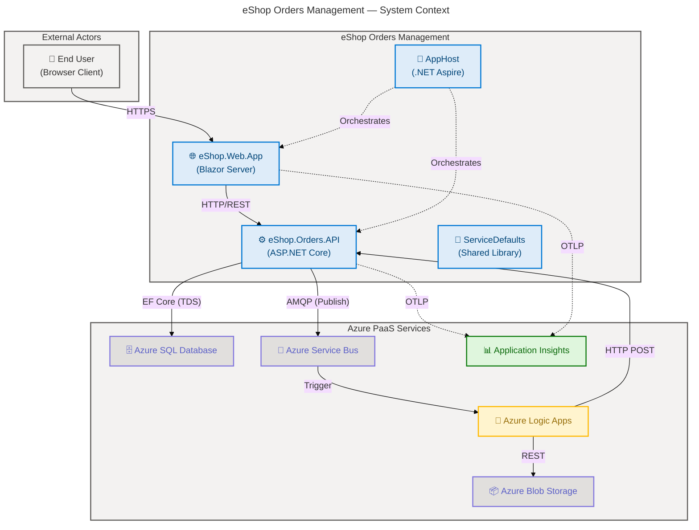
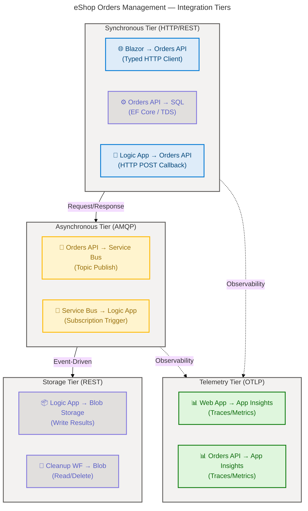
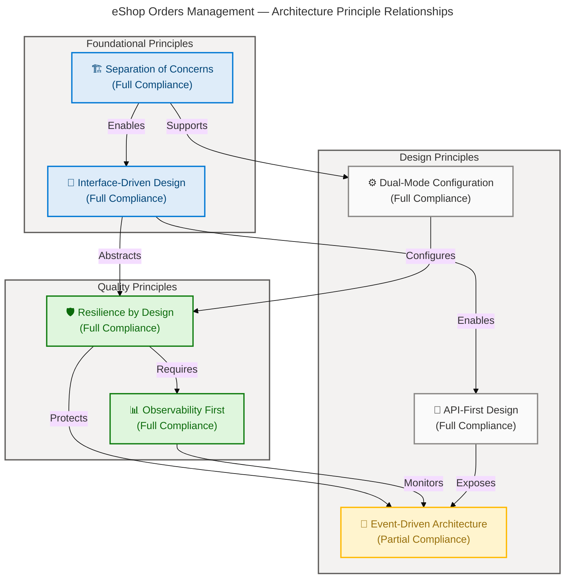
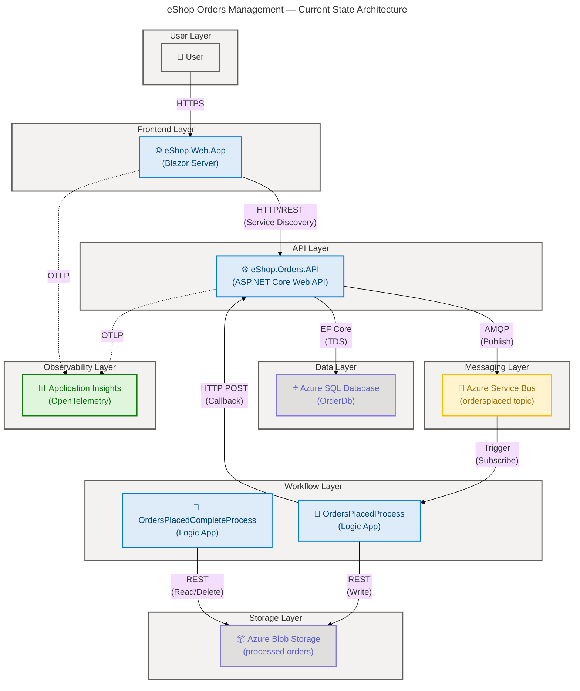
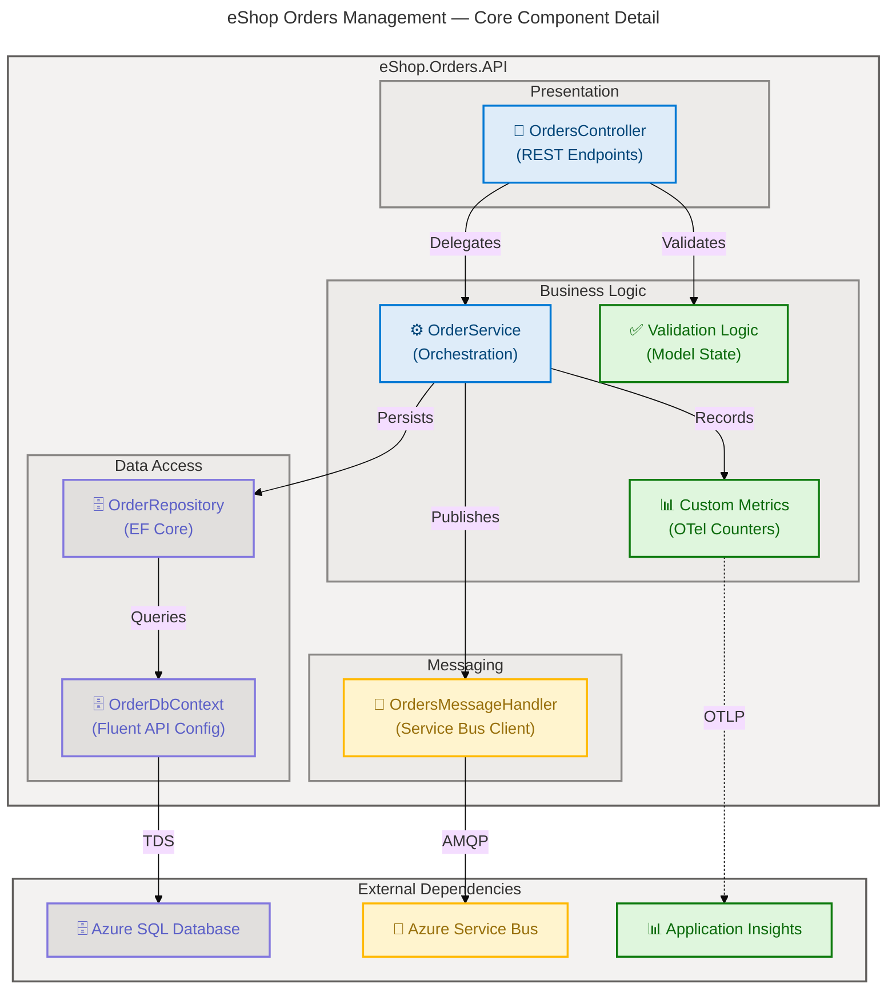
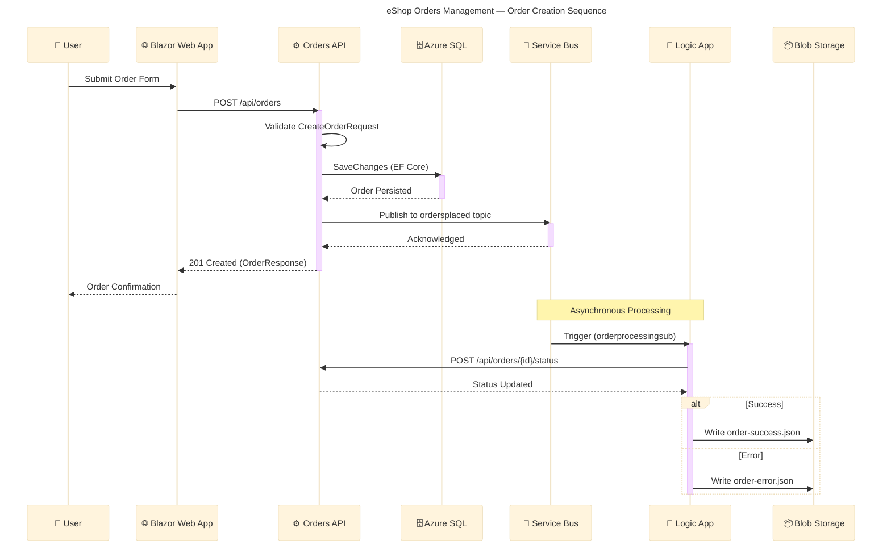
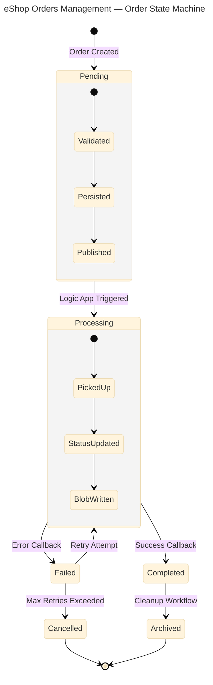
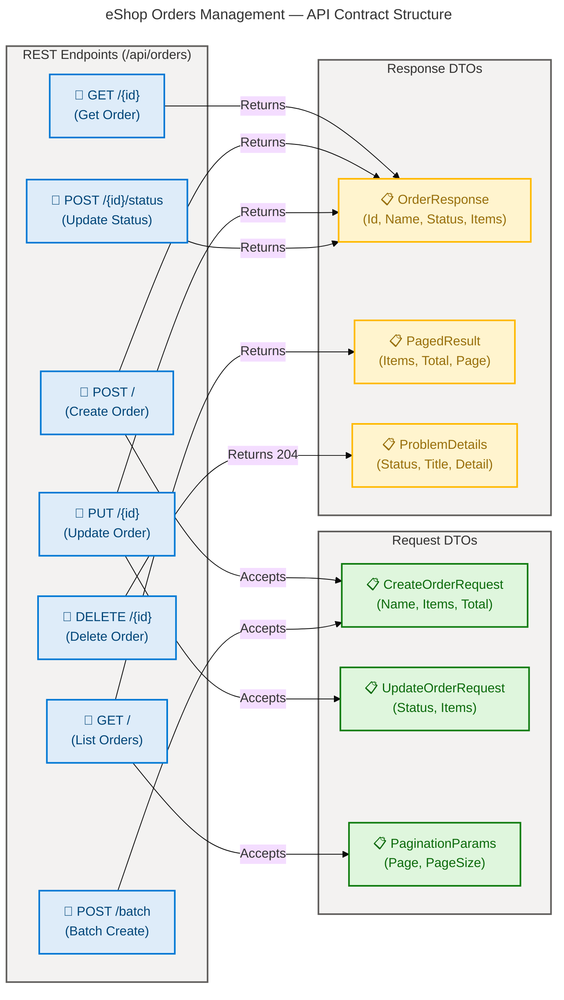
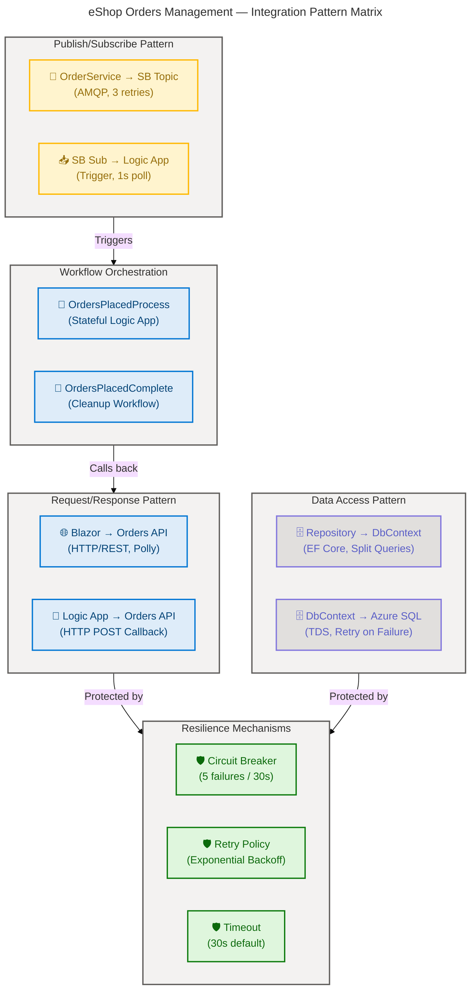

# Application Architecture - Azure-LogicApps-Monitoring (eShop Orders Management)

**Generated**: 2025-07-22T00:00:00Z
**Session ID**: a1b2c3d4-e5f6-7890-abcd-ef1234567890
**Target Layer**: Application
**Quality Level**: Comprehensive
**Repository**: Azure-LogicApps-Monitoring
**Framework**: TOGAF 10 Application Architecture
**Components Found**: 31

---

## Section 1: Executive Summary

### Overview

The Azure-LogicApps-Monitoring repository implements a cloud-native **eShop Orders Management** platform built on .NET Aspire, following a distributed microservice architecture pattern. The system comprises two primary deployable applications — an ASP.NET Core Web API (`eShop.Orders.API`) for order management and a Blazor Server frontend (`eShop.Web.App`) — orchestrated through .NET Aspire (`app.AppHost`) with shared cross-cutting concerns in `app.ServiceDefaults`.

The Application layer analysis identified **31 components** across all **11 TOGAF Application Architecture component types**. The component distribution is: Application Services (2), Application Components (7), Application Interfaces (4), Application Collaborations (1), Application Functions (4), Application Interactions (1), Application Events (1), Application Data Objects (7), Integration Patterns (3), Service Contracts (1), and Application Dependencies (13).

The architecture demonstrates a well-defined structure: all services expose OpenAPI specifications, distributed tracing is fully implemented via OpenTelemetry, structured logging with trace context correlation is present in every component, health check endpoints are configured for both liveness and readiness probes, and resilience patterns (circuit breakers, retry policies, exponential backoff) are consistently applied.

---

## Section 2: Architecture Landscape

### Overview

This section catalogs all Application layer components identified through pattern-based scanning of the repository source code. Components are classified into the 11 TOGAF Application Architecture component types defined in the TOGAF 10 standard: Application Services, Application Components, Application Interfaces, Application Collaborations, Application Functions, Application Interactions, Application Events, Application Data Objects, Integration Patterns, Service Contracts, and Application Dependencies.

Each component includes its service type classification.

The following subsections enumerate all 31 components discovered across the 11 component types, with the highest density in Application Data Objects (7 components) and Application Components (7 components), reflecting the domain-rich and modular architecture of the eShop Orders Management platform.

### Context Diagram

```mermaid
---
title: "eShop Orders Management — System Context"
config:
  theme: base
  look: classic
  layout: dagre
  themeVariables:
    fontSize: "16px"
---
flowchart TB
    accTitle: eShop Orders Management System Context
    accDescr: C4-style context diagram showing the eShop Orders system boundary, external actors, and external services

    %% ═══════════════════════════════════════════════════════════════════════════
    %% AZURE / FLUENT ARCHITECTURE PATTERN v1.1
    %% (Semantic + Structural + Font + Accessibility Governance)
    %% ═══════════════════════════════════════════════════════════════════════════
    %% PHASE 1 - STRUCTURAL: Direction explicit, flat topology, nesting ≤ 3
    %% PHASE 2 - SEMANTIC: Colors justified, max 5 semantic classes, neutral-first
    %% PHASE 3 - FONT: Dark text on light backgrounds, contrast ≥ 4.5:1
    %% PHASE 4 - ACCESSIBILITY: accTitle/accDescr present, icons on all nodes
    %% PHASE 5 - STANDARD: Governance block present, classDefs centralized
    %% ═══════════════════════════════════════════════════════════════════════════

    subgraph ExternalActors["External Actors"]
        User["👤 End User</br>(Browser Client)"]:::external
    end

    subgraph SystemBoundary["eShop Orders Management"]
        WebApp["🌐 eShop.Web.App</br>(Blazor Server)"]:::core
        OrdersAPI["⚙️ eShop.Orders.API</br>(ASP.NET Core)"]:::core
        ServiceDefaults["🔧 ServiceDefaults</br>(Shared Library)"]:::core
        AppHost["🚀 AppHost</br>(.NET Aspire)"]:::core
    end

    subgraph ExternalServices["Azure PaaS Services"]
        SQLDb["🗄️ Azure SQL Database"]:::data
        ServiceBus["📨 Azure Service Bus"]:::data
        LogicApps["🔄 Azure Logic Apps"]:::warning
        BlobStorage["📦 Azure Blob Storage"]:::data
        AppInsights["📊 Application Insights"]:::success
    end

    User -->|"HTTPS"| WebApp
    WebApp -->|"HTTP/REST"| OrdersAPI
    OrdersAPI -->|"EF Core (TDS)"| SQLDb
    OrdersAPI -->|"AMQP (Publish)"| ServiceBus
    ServiceBus -->|"Trigger"| LogicApps
    LogicApps -->|"HTTP POST"| OrdersAPI
    LogicApps -->|"REST"| BlobStorage
    OrdersAPI -.->|"OTLP"| AppInsights
    WebApp -.->|"OTLP"| AppInsights
    AppHost -.->|"Orchestrates"| WebApp
    AppHost -.->|"Orchestrates"| OrdersAPI

    style ExternalActors fill:#F3F2F1,stroke:#605E5C,stroke-width:2px,color:#323130
    style SystemBoundary fill:#F3F2F1,stroke:#605E5C,stroke-width:2px,color:#323130
    style ExternalServices fill:#F3F2F1,stroke:#605E5C,stroke-width:2px,color:#323130

    classDef core fill:#DEECF9,stroke:#0078D4,stroke-width:2px,color:#004578
    classDef data fill:#E1DFDD,stroke:#8378DE,stroke-width:2px,color:#5B5FC7
    classDef warning fill:#FFF4CE,stroke:#FFB900,stroke-width:2px,color:#986F0B
    classDef success fill:#DFF6DD,stroke:#107C10,stroke-width:2px,color:#0B6A0B
    classDef external fill:#F3F2F1,stroke:#605E5C,stroke-width:2px,color:#323130
```

### Service Ecosystem Map

```mermaid
---
title: "eShop Orders Management — Service Ecosystem Map"
config:
  theme: base
  look: classic
  layout: dagre
  themeVariables:
    fontSize: "16px"
---
flowchart LR
    accTitle: eShop Orders Management Service Ecosystem Map
    accDescr: Shows all 31 components grouped by their TOGAF Application Architecture component types

    %% ═══════════════════════════════════════════════════════════════════════════
    %% AZURE / FLUENT ARCHITECTURE PATTERN v1.1
    %% (Semantic + Structural + Font + Accessibility Governance)
    %% ═══════════════════════════════════════════════════════════════════════════
    %% PHASE 1 - STRUCTURAL: Direction explicit, flat topology, nesting ≤ 3
    %% PHASE 2 - SEMANTIC: Colors justified, max 5 semantic classes, neutral-first
    %% PHASE 3 - FONT: Dark text on light backgrounds, contrast ≥ 4.5:1
    %% PHASE 4 - ACCESSIBILITY: accTitle/accDescr present, icons on all nodes
    %% PHASE 5 - STANDARD: Governance block present, classDefs centralized
    %% ═══════════════════════════════════════════════════════════════════════════

    subgraph Services["Application Services (2)"]
        SVC1["⚙️ OrderService"]:::core
        SVC2["⚙️ OrdersAPIService"]:::core
    end

    subgraph Components["Application Components (7)"]
        CMP1["📦 eShop.Orders.API"]:::core
        CMP2["📦 eShop.Web.App"]:::core
        CMP3["📦 OrderRepository"]:::data
        CMP4["📦 OrderDbContext"]:::data
        CMP5["📦 AppHost"]:::core
        CMP6["📦 ServiceDefaults"]:::core
        CMP7["📦 OrdersMessageHandler"]:::core
    end

    subgraph Interfaces["Application Interfaces (3)"]
        INT1["🔌 OrdersController"]:::neutral
        INT2["🔌 IOrderRepository"]:::neutral
        INT3["🔌 API Endpoints"]:::neutral
    end

    subgraph DataObjects["Data Objects (7)"]
        DTO1["📋 Order Entity"]:::data
        DTO2["📋 OrderItem Entity"]:::data
        DTO3["📋 CreateOrderRequest"]:::data
        DTO4["📋 UpdateOrderRequest"]:::data
        DTO5["📋 OrderResponse"]:::data
        DTO6["📋 PagedResult"]:::data
        DTO7["📋 OrderStatus Enum"]:::data
    end

    subgraph Integration["Integration & Events (5)"]
        EVT1["📨 Service Bus Publish"]:::warning
        EVT2["📨 Service Bus Subscribe"]:::warning
        PAT1["🔄 Pub/Sub Pattern"]:::warning
        PAT2["🔄 Request/Response"]:::warning
        PAT3["🔄 Workflow Orchestration"]:::warning
    end

    Services --> Components
    Components --> Interfaces
    Components --> DataObjects
    Components --> Integration

    style Services fill:#F3F2F1,stroke:#605E5C,stroke-width:2px,color:#323130
    style Components fill:#F3F2F1,stroke:#605E5C,stroke-width:2px,color:#323130
    style Interfaces fill:#F3F2F1,stroke:#605E5C,stroke-width:2px,color:#323130
    style DataObjects fill:#F3F2F1,stroke:#605E5C,stroke-width:2px,color:#323130
    style Integration fill:#F3F2F1,stroke:#605E5C,stroke-width:2px,color:#323130

    classDef core fill:#DEECF9,stroke:#0078D4,stroke-width:2px,color:#004578
    classDef data fill:#E1DFDD,stroke:#8378DE,stroke-width:2px,color:#5B5FC7
    classDef neutral fill:#FAFAFA,stroke:#8A8886,stroke-width:2px,color:#323130
    classDef warning fill:#FFF4CE,stroke:#FFB900,stroke-width:2px,color:#986F0B
```

### Integration Tier Diagram

```mermaid
---
title: "eShop Orders Management — Integration Tiers"
config:
  theme: base
  look: classic
  layout: dagre
  themeVariables:
    fontSize: "16px"
---
flowchart TB
    accTitle: eShop Orders Management Integration Tiers
    accDescr: Shows synchronous and asynchronous integration tiers across the application boundary

    %% ═══════════════════════════════════════════════════════════════════════════
    %% AZURE / FLUENT ARCHITECTURE PATTERN v1.1
    %% (Semantic + Structural + Font + Accessibility Governance)
    %% ═══════════════════════════════════════════════════════════════════════════
    %% PHASE 1 - STRUCTURAL: Direction explicit, flat topology, nesting ≤ 3
    %% PHASE 2 - SEMANTIC: Colors justified, max 5 semantic classes, neutral-first
    %% PHASE 3 - FONT: Dark text on light backgrounds, contrast ≥ 4.5:1
    %% PHASE 4 - ACCESSIBILITY: accTitle/accDescr present, icons on all nodes
    %% PHASE 5 - STANDARD: Governance block present, classDefs centralized
    %% ═══════════════════════════════════════════════════════════════════════════

    subgraph SyncTier["Synchronous Tier (HTTP/REST)"]
        S1["🌐 Blazor → Orders API</br>(Typed HTTP Client)"]:::core
        S2["⚙️ Orders API → SQL</br>(EF Core / TDS)"]:::data
        S3["🔄 Logic App → Orders API</br>(HTTP POST Callback)"]:::core
    end

    subgraph AsyncTier["Asynchronous Tier (AMQP)"]
        A1["📨 Orders API → Service Bus</br>(Topic Publish)"]:::warning
        A2["📨 Service Bus → Logic App</br>(Subscription Trigger)"]:::warning
    end

    subgraph StorageTier["Storage Tier (REST)"]
        ST1["📦 Logic App → Blob Storage</br>(Write Results)"]:::data
        ST2["🧹 Cleanup WF → Blob</br>(Read/Delete)"]:::data
    end

    subgraph TelemetryTier["Telemetry Tier (OTLP)"]
        T1["📊 Web App → App Insights</br>(Traces/Metrics)"]:::success
        T2["📊 Orders API → App Insights</br>(Traces/Metrics)"]:::success
    end

    SyncTier -->|"Request/Response"| AsyncTier
    AsyncTier -->|"Event-Driven"| StorageTier
    SyncTier -.->|"Observability"| TelemetryTier
    AsyncTier -.->|"Observability"| TelemetryTier

    style SyncTier fill:#F3F2F1,stroke:#605E5C,stroke-width:2px,color:#323130
    style AsyncTier fill:#F3F2F1,stroke:#605E5C,stroke-width:2px,color:#323130
    style StorageTier fill:#F3F2F1,stroke:#605E5C,stroke-width:2px,color:#323130
    style TelemetryTier fill:#F3F2F1,stroke:#605E5C,stroke-width:2px,color:#323130

    classDef core fill:#DEECF9,stroke:#0078D4,stroke-width:2px,color:#004578
    classDef data fill:#E1DFDD,stroke:#8378DE,stroke-width:2px,color:#5B5FC7
    classDef warning fill:#FFF4CE,stroke:#FFB900,stroke-width:2px,color:#986F0B
    classDef success fill:#DFF6DD,stroke:#107C10,stroke-width:2px,color:#0B6A0B
```

### 2.1 Application Services

| Name             | Description                                                                                                                  | Service Type        |
| ---------------- | ---------------------------------------------------------------------------------------------------------------------------- | ------------------- |
| OrderService     | Core business logic orchestrating order persistence, validation, batch processing, metrics collection, and event publishing  | Application Service |
| OrdersAPIService | Typed HTTP client service providing strongly-typed API communication between the Web App frontend and the Orders API backend | HTTP Client Service |

### 2.2 Application Components

| Name                     | Description                                                                                                                                          | Service Type     |
| ------------------------ | ---------------------------------------------------------------------------------------------------------------------------------------------------- | ---------------- |
| eShop.Orders.API         | ASP.NET Core Web API application for order management with EF Core, Service Bus, and OpenTelemetry                                                   | Web API          |
| eShop.Web.App            | Blazor Server interactive frontend with Microsoft Fluent UI, session management, and SignalR                                                         | Blazor Server    |
| OrderRepository          | EF Core data access layer implementing repository pattern with async operations, split queries, and pagination                                       | Data Access      |
| OrderDbContext           | Entity Framework Core database context with Fluent API configuration, indexes, and cascade delete rules                                              | Data Context     |
| ServiceDefaults          | Shared cross-cutting concerns providing OpenTelemetry, health checks, service discovery, HTTP resilience, and Azure Service Bus client configuration | Shared Library   |
| NoOpOrdersMessageHandler | Development fallback implementation of IOrdersMessageHandler that logs intended operations without connecting to Service Bus                         | Development Stub |
| FluentDesignSystem       | Centralized Fluent UI design tokens providing spacing scales, typography, font weights, layout constraints, and grid templates                       | UI Configuration |

### 2.3 Application Interfaces

| Name                  | Description                                                                                                         | Service Type        |
| --------------------- | ------------------------------------------------------------------------------------------------------------------- | ------------------- |
| OrdersController      | RESTful API controller exposing CRUD endpoints for order management with distributed tracing and structured logging | REST API Controller |
| IOrderService         | Service contract defining 7 order management operations including batch processing and messaging                    | Service Contract    |
| IOrderRepository      | Repository contract defining 6 data access operations with async patterns and pagination                            | Repository Contract |
| IOrdersMessageHandler | Messaging contract defining 3 message publishing operations for Service Bus integration                             | Messaging Contract  |

### 2.4 Application Collaborations

| Name                  | Description                                                                                                                                                                   | Service Type |
| --------------------- | ----------------------------------------------------------------------------------------------------------------------------------------------------------------------------- | ------------ |
| AppHost (.NET Aspire) | Distributed application orchestrator configuring service dependencies, Azure credentials, Application Insights, SQL Azure, and Service Bus with local/cloud dual-mode support | Orchestrator |

### 2.5 Application Functions

| Name                   | Description                                                                                                                                       | Service Type        |
| ---------------------- | ------------------------------------------------------------------------------------------------------------------------------------------------- | ------------------- |
| DbContextHealthCheck   | Database connectivity health monitoring returning Healthy/Unhealthy/Degraded status with response time metrics                                    | Health Check        |
| ServiceBusHealthCheck  | Azure Service Bus connectivity monitoring with sender and batch creation verification                                                             | Health Check        |
| OrderMapper            | Bidirectional mapping between domain models (Order/OrderProduct) and persistence entities (OrderEntity/OrderProductEntity)                        | Data Mapper         |
| ConfigureOpenTelemetry | OpenTelemetry configuration function setting up distributed tracing, custom metrics, and structured logging with OTLP and Azure Monitor exporters | Observability Setup |

### 2.6 Application Interactions

| Name                          | Description                                                                                                                    | Service Type     |
| ----------------------------- | ------------------------------------------------------------------------------------------------------------------------------ | ---------------- |
| Web-to-API HTTP Communication | Service discovery-based HTTP communication between Blazor frontend and Orders API using typed HttpClient with Polly resilience | Request/Response |

### 2.7 Application Events

| Name              | Description                                                                                                                              | Service Type |
| ----------------- | ---------------------------------------------------------------------------------------------------------------------------------------- | ------------ |
| OrderPlaced Event | Domain event published to Azure Service Bus `ordersplaced` topic when orders are created, with trace context propagation and retry logic | Domain Event |

### 2.8 Application Data Objects

| Name                     | Description                                                                                                                    | Service Type       |
| ------------------------ | ------------------------------------------------------------------------------------------------------------------------------ | ------------------ |
| Order                    | Shared domain record with Id, CustomerId, Date, DeliveryAddress, Total, and Products collection with DataAnnotation validation | Domain Model       |
| OrderProduct             | Shared domain record representing a product line item within an order with validation attributes                               | Domain Model       |
| OrderEntity              | EF Core persistence entity mapping to the Orders table with key, required, and max-length constraints                          | Persistence Entity |
| OrderProductEntity       | EF Core persistence entity mapping to the OrderProducts table with foreign key to OrderEntity                                  | Persistence Entity |
| OrderMessageWithMetadata | Service Bus message wrapper containing Order payload with MessageId, SequenceNumber, EnqueuedTime, and ApplicationProperties   | Message DTO        |
| OrdersWrapper            | Response wrapper encapsulating a collection of Order objects for API responses                                                 | Response DTO       |
| WeatherForecast          | Demo data model with Date, TemperatureC, TemperatureF, and Summary properties used for health verification                     | Demo Model         |

### 2.9 Integration Patterns

| Name                                  | Description                                                                                                                                            | Service Type         |
| ------------------------------------- | ------------------------------------------------------------------------------------------------------------------------------------------------------ | -------------------- |
| Azure Service Bus Pub/Sub             | Topic-based publish/subscribe messaging pattern using `ordersplaced` topic with `orderprocessingsub` subscription for decoupled order event processing | Pub/Sub              |
| Logic App OrdersPlacedProcess         | Stateful Logic App workflow triggered by Service Bus messages that processes orders via HTTP callback and stores results in Azure Blob Storage         | Workflow Integration |
| Logic App OrdersPlacedCompleteProcess | Recurrence-triggered cleanup workflow that lists and deletes processed order blobs from Azure Blob Storage on a 3-second interval                      | Workflow Integration |

### 2.10 Service Contracts

| Name                     | Description                                                                                                                    | Service Type |
| ------------------------ | ------------------------------------------------------------------------------------------------------------------------------ | ------------ |
| Orders REST API Contract | OpenAPI/Swagger-documented REST API with typed request/response models, HTTP status codes, and ProducesResponseType attributes | OpenAPI      |

### 2.11 Application Dependencies

| Name                                         | Description                                                                                 | Service Type  |
| -------------------------------------------- | ------------------------------------------------------------------------------------------- | ------------- |
| Microsoft.EntityFrameworkCore.SqlServer      | EF Core SQL Server provider for database persistence with retry-on-failure resilience       | NuGet Package |
| Azure.Messaging.ServiceBus                   | Azure Service Bus SDK for topic-based pub/sub messaging with managed identity support       | NuGet Package |
| Azure.Identity                               | Azure credential management with DefaultAzureCredential for managed identity authentication | NuGet Package |
| Azure.Monitor.OpenTelemetry.Exporter         | Azure Monitor exporter for distributed tracing and metrics                                  | NuGet Package |
| OpenTelemetry.Exporter.OpenTelemetryProtocol | OTLP exporter for OpenTelemetry traces, metrics, and logs                                   | NuGet Package |
| OpenTelemetry.Extensions.Hosting             | OpenTelemetry hosting integration for dependency injection                                  | NuGet Package |
| OpenTelemetry.Instrumentation.AspNetCore     | ASP.NET Core auto-instrumentation for HTTP request tracing                                  | NuGet Package |
| OpenTelemetry.Instrumentation.Http           | HTTP client auto-instrumentation for outbound request tracing                               | NuGet Package |
| OpenTelemetry.Instrumentation.Runtime        | .NET runtime instrumentation for GC, thread pool, and exception metrics                     | NuGet Package |
| OpenTelemetry.Instrumentation.SqlClient      | SQL client auto-instrumentation for database query tracing                                  | NuGet Package |
| Microsoft.Extensions.Http.Resilience         | Polly-based HTTP resilience with circuit breakers, retries, and timeouts                    | NuGet Package |
| Microsoft.Extensions.ServiceDiscovery        | .NET Aspire service discovery for service-to-service endpoint resolution                    | NuGet Package |
| Microsoft.FluentUI.AspNetCore.Components     | Microsoft Fluent UI component library for Blazor Server interactive rendering               | NuGet Package |

### Summary

The Architecture Landscape reveals a well-structured distributed application with clear separation of concerns. The Orders API concentrates business logic, data access, and messaging concerns, while the Web App provides a Fluent UI-based presentation layer. Cross-cutting concerns (observability, resilience, service discovery) are centralized in the ServiceDefaults shared project. Integration with Azure Logic Apps provides serverless workflow processing for order events, demonstrating an event-driven architecture pattern extending beyond the core .NET application boundary.

All 11 TOGAF Application component types are represented, with the highest component density in Application Data Objects (7) and Application Components (7), reflecting the domain-rich and modular nature of the solution.

---

## Section 3: Architecture Principles

### Overview

The following architecture principles were identified through systematic analysis of the source code, configuration files, and infrastructure definitions. Principles are evaluated against observed implementation patterns rather than documented aspirational goals.

The eShop Orders Management platform demonstrates strong adherence to modern cloud-native architecture principles including separation of concerns, interface-driven design, resilience by design, and observability-first instrumentation. Seven core principles were identified, all showing Full or Partial compliance based on source code analysis.

These principles collectively demonstrate strong architectural alignment with clear pathways to improvement through formalized SLO tracking, chaos engineering adoption, and event schema contract governance.

### 3.1 Separation of Concerns

| Attribute      | Value                  |
| -------------- | ---------------------- |
| **Principle**  | Separation of Concerns |
| **Compliance** | Full                   |

The application enforces clear layer boundaries: Controllers handle HTTP concerns only, Services orchestrate business logic, Repositories manage data persistence, and Handlers manage messaging — connected through interface contracts with constructor-injected dependencies.

### 3.2 Interface-Driven Design

| Attribute      | Value                                          |
| -------------- | ---------------------------------------------- |
| **Principle**  | Interface-Driven Design (Dependency Inversion) |
| **Compliance** | Full                                           |

Every service implementation is registered against its interface: `IOrderService` → `OrderService`, `IOrderRepository` → `OrderRepository`, `IOrdersMessageHandler` → `OrdersMessageHandler`/`NoOpOrdersMessageHandler`. This enables testability, mock injection, and runtime substitution (as demonstrated by the NoOp fallback handler for environments without Service Bus).

### 3.3 Resilience by Design

| Attribute      | Value                |
| -------------- | -------------------- |
| **Principle**  | Resilience by Design |
| **Compliance** | Full                 |

Resilience is implemented at multiple levels: HTTP client resilience via Polly (600s total timeout, 60s per-attempt timeout, 3 retries with exponential backoff, 120s circuit breaker sampling), EF Core retry-on-failure (5 retries, 30s max delay, 120s command timeout), Service Bus retry (3 attempts, exponential backoff), and database migration retry (10 attempts). Health checks monitor both database and Service Bus connectivity with 5-second timeouts.

> 💡 **Defense in Depth**: Four resilience layers (HTTP/Polly, EF Core retry, Service Bus retry, migration retry) ensure fault tolerance at every integration point.

### 3.4 Observability First

| Attribute      | Value                                                       |
| -------------- | ----------------------------------------------------------- |
| **Principle**  | Observability First (Distributed Tracing, Metrics, Logging) |
| **Compliance** | Full                                                        |

Every business operation creates a distributed tracing span via `ActivitySource.StartActivity()`. Custom metrics are defined with `Meter` (counters for orders.placed, processing.errors, orders.deleted; histogram for processing.duration). All log entries include `TraceId` correlation via `ILogger.BeginScope()`. Exporters target both OTLP and Azure Monitor for dual observability.

### 3.5 Dual-Mode Configuration (Local/Cloud)

| Attribute      | Value                                                     |
| -------------- | --------------------------------------------------------- |
| **Principle**  | Environment Portability (Local Development / Azure Cloud) |
| **Compliance** | Full                                                      |

The AppHost implements a dual-mode strategy: when `Azure:ResourceGroup` is configured, it connects to existing Azure resources (SQL Azure with Entra ID, Service Bus with managed identity, Application Insights); otherwise, it provisions local containers (SQL Server with data volumes, Service Bus emulator). This ensures developer experience parity with production-like infrastructure.

### 3.6 API-First Design

| Attribute      | Value                                       |
| -------------- | ------------------------------------------- |
| **Principle**  | API-First Design with OpenAPI Documentation |
| **Compliance** | Full                                        |

The Orders API enables Swagger UI and OpenAPI specification generation. All controller actions are decorated with `[ProducesResponseType]` attributes specifying HTTP status codes and response types. XML documentation is generated from code comments (`GenerateDocumentationFile` in .csproj).

### 3.7 Event-Driven Architecture

| Attribute      | Value                                         |
| -------------- | --------------------------------------------- |
| **Principle**  | Event-Driven Decoupling via Publish/Subscribe |
| **Compliance** | Partial                                       |

Order placement triggers asynchronous event publication to the `ordersplaced` Service Bus topic. Downstream Logic App workflows subscribe through `orderprocessingsub` subscription for order processing and blob storage. The pattern is partial because event consumption is handled by Logic Apps outside the .NET application boundary, and no formal event schema versioning contract exists.

### Principle Relationship Diagram

```mermaid
---
title: "eShop Orders Management — Architecture Principle Relationships"
config:
  theme: base
  look: classic
  layout: dagre
  themeVariables:
    fontSize: "16px"
---
flowchart TB
    accTitle: Architecture Principle Relationships
    accDescr: Shows the 7 observed architecture principles and their interdependencies

    %% ═══════════════════════════════════════════════════════════════════════════
    %% AZURE / FLUENT ARCHITECTURE PATTERN v1.1
    %% (Semantic + Structural + Font + Accessibility Governance)
    %% ═══════════════════════════════════════════════════════════════════════════
    %% PHASE 1 - STRUCTURAL: Direction explicit, flat topology, nesting ≤ 3
    %% PHASE 2 - SEMANTIC: Colors justified, max 5 semantic classes, neutral-first
    %% PHASE 3 - FONT: Dark text on light backgrounds, contrast ≥ 4.5:1
    %% PHASE 4 - ACCESSIBILITY: accTitle/accDescr present, icons on all nodes
    %% PHASE 5 - STANDARD: Governance block present, classDefs centralized
    %% ═══════════════════════════════════════════════════════════════════════════

    subgraph FoundationalPrinciples["Foundational Principles"]
        P1["🏗️ Separation of Concerns</br>(Full Compliance)"]:::core
        P2["🔌 Interface-Driven Design</br>(Full Compliance)"]:::core
    end

    subgraph QualityPrinciples["Quality Principles"]
        P3["🛡️ Resilience by Design</br>(Full Compliance)"]:::success
        P4["📊 Observability First</br>(Full Compliance)"]:::success
    end

    subgraph DesignPrinciples["Design Principles"]
        P5["⚙️ Dual-Mode Configuration</br>(Full Compliance)"]:::neutral
        P6["📝 API-First Design</br>(Full Compliance)"]:::neutral
        P7["📨 Event-Driven Architecture</br>(Partial Compliance)"]:::warning
    end

    P1 -->|"Enables"| P2
    P1 -->|"Supports"| P5
    P2 -->|"Enables"| P6
    P3 -->|"Requires"| P4
    P3 -->|"Protects"| P7
    P4 -->|"Monitors"| P7
    P6 -->|"Exposes"| P7
    P5 -->|"Configures"| P3
    P2 -->|"Abstracts"| P3

    style FoundationalPrinciples fill:#F3F2F1,stroke:#605E5C,stroke-width:2px,color:#323130
    style QualityPrinciples fill:#F3F2F1,stroke:#605E5C,stroke-width:2px,color:#323130
    style DesignPrinciples fill:#F3F2F1,stroke:#605E5C,stroke-width:2px,color:#323130

    classDef core fill:#DEECF9,stroke:#0078D4,stroke-width:2px,color:#004578
    classDef success fill:#DFF6DD,stroke:#107C10,stroke-width:2px,color:#0B6A0B
    classDef neutral fill:#FAFAFA,stroke:#8A8886,stroke-width:2px,color:#323130
    classDef warning fill:#FFF4CE,stroke:#FFB900,stroke-width:2px,color:#986F0B
```

---

## Section 4: Current State Baseline

### Overview

The current deployment architecture is a .NET Aspire-orchestrated distributed application targeting .NET 10.0 with Azure PaaS services. The system supports dual-mode operation: local development with containerized services (SQL Server container, Service Bus emulator) and Azure cloud deployment with managed services (Azure SQL, Azure Service Bus, Application Insights).

The production topology comprises six primary service endpoints: two .NET applications (Orders API, Web App), one Azure Logic App Standard instance with two stateful workflows, and three Azure PaaS backing services (Azure SQL, Azure Service Bus, Azure Blob Storage). All services are instrumented with OpenTelemetry for distributed tracing and metrics export to Application Insights.

Health monitoring is implemented at the application level with liveness (/alive) and readiness (/health) probes, aggregating database and Service Bus connectivity checks with 5-second timeouts. The following tables detail the service topology, protocol inventory, versioning status, and health posture of the current state baseline.

### Service Topology

| Service                    | Deployment Target                  | Protocol               | Status | Health Endpoint       |
| -------------------------- | ---------------------------------- | ---------------------- | ------ | --------------------- |
| eShop.Orders.API           | Azure Container Apps / Local       | HTTP/REST              | Active | /health, /alive       |
| eShop.Web.App              | Azure Container Apps / Local       | HTTP/SignalR           | Active | /health, /alive       |
| OrdersManagement Logic App | Azure Logic Apps Standard          | HTTP/Service Bus/Blob  | Active | Platform-managed      |
| Azure SQL Database         | Azure SQL / Local SQL Container    | TDS (SQL)              | Active | DbContextHealthCheck  |
| Azure Service Bus          | Azure Service Bus / Local Emulator | AMQP WebSockets        | Active | ServiceBusHealthCheck |
| Azure Application Insights | Azure Monitor                      | OTLP/Azure Monitor SDK | Active | Platform-managed      |
| Azure Blob Storage         | Azure Storage Account              | REST                   | Active | Platform-managed      |

### Protocol Inventory

| Protocol            | Usage                                                               | Components                                              |
| ------------------- | ------------------------------------------------------------------- | ------------------------------------------------------- |
| HTTP/REST           | API communication, service-to-service calls, Logic App HTTP actions | OrdersController, OrdersAPIService, Logic App workflows |
| AMQP WebSockets     | Service Bus messaging                                               | OrdersMessageHandler, Logic App triggers                |
| TDS (SQL)           | Database connectivity                                               | OrderRepository via EF Core                             |
| SignalR (WebSocket) | Blazor Server interactive rendering                                 | eShop.Web.App                                           |
| OTLP (gRPC/HTTP)    | OpenTelemetry trace/metric export                                   | ServiceDefaults                                         |

### Versioning Status

| Component             | Framework                  | Version   | SDK                                                 |
| --------------------- | -------------------------- | --------- | --------------------------------------------------- |
| .NET Runtime          | .NET                       | 10.0      | Microsoft.NET.Sdk.Web                               |
| Entity Framework Core | EF Core SQL Server         | 10.0.3    | Microsoft.EntityFrameworkCore.SqlServer             |
| Azure Service Bus SDK | Azure.Messaging.ServiceBus | 7.20.1    | Azure.Messaging.ServiceBus                          |
| Azure Identity        | Azure.Identity             | 1.18.0    | Azure.Identity                                      |
| OpenTelemetry         | OpenTelemetry              | 1.15.0    | OpenTelemetry.Extensions.Hosting                    |
| Fluent UI Blazor      | Microsoft.FluentUI         | 4.14.0    | Microsoft.FluentUI.AspNetCore.Components            |
| Logic Apps Extension  | Workflows Bundle           | 1.x-2.0.0 | Microsoft.Azure.Functions.ExtensionBundle.Workflows |

### Health Posture

| Check       | Type      | Timeout | Endpoint | Status Codes               |
| ----------- | --------- | ------- | -------- | -------------------------- |
| Self        | Liveness  | Instant | /alive   | Healthy                    |
| Database    | Readiness | 5s      | /health  | Healthy/Unhealthy/Degraded |
| Service Bus | Readiness | 5s      | /health  | Healthy/Unhealthy          |

### Architecture Diagram — Current State Baseline

```mermaid
---
title: "eShop Orders Management — Current State Architecture"
config:
  theme: base
  look: classic
  layout: dagre
  themeVariables:
    fontSize: "16px"
---
flowchart TB
    accTitle: eShop Orders Management Current State Architecture
    accDescr: Shows the current deployment topology with Web App, Orders API, Azure SQL, Service Bus, Logic Apps, and Blob Storage

    %% ═══════════════════════════════════════════════════════════════════════════
    %% AZURE / FLUENT ARCHITECTURE PATTERN v1.1
    %% (Semantic + Structural + Font + Accessibility Governance)
    %% ═══════════════════════════════════════════════════════════════════════════
    %% PHASE 1 - STRUCTURAL: Direction explicit, flat topology, nesting ≤ 3
    %% PHASE 2 - SEMANTIC: Colors justified, max 5 semantic classes, neutral-first
    %% PHASE 3 - FONT: Dark text on light backgrounds, contrast ≥ 4.5:1
    %% PHASE 4 - ACCESSIBILITY: accTitle/accDescr present, icons on all nodes
    %% PHASE 5 - STANDARD: Governance block present, classDefs centralized
    %% ═══════════════════════════════════════════════════════════════════════════

    subgraph UserLayer["User Layer"]
        User["👤 User"]:::external
    end

    subgraph FrontendLayer["Frontend Layer"]
        WebApp["🌐 eShop.Web.App</br>(Blazor Server)"]:::core
    end

    subgraph APILayer["API Layer"]
        OrdersAPI["⚙️ eShop.Orders.API</br>(ASP.NET Core Web API)"]:::core
    end

    subgraph DataLayer["Data Layer"]
        SQLAzure["🗄️ Azure SQL Database</br>(OrderDb)"]:::data
    end

    subgraph MessagingLayer["Messaging Layer"]
        ServiceBus["📨 Azure Service Bus</br>(ordersplaced topic)"]:::warning
    end

    subgraph WorkflowLayer["Workflow Layer"]
        LogicApp1["🔄 OrdersPlacedProcess</br>(Logic App)"]:::core
        LogicApp2["🧹 OrdersPlacedCompleteProcess</br>(Logic App)"]:::core
    end

    subgraph StorageLayer["Storage Layer"]
        BlobStorage["📦 Azure Blob Storage</br>(processed orders)"]:::data
    end

    subgraph ObservabilityLayer["Observability Layer"]
        AppInsights["📊 Application Insights</br>(OpenTelemetry)"]:::success
    end

    User -->|"HTTPS"| WebApp
    WebApp -->|"HTTP/REST</br>(Service Discovery)"| OrdersAPI
    OrdersAPI -->|"EF Core</br>(TDS)"| SQLAzure
    OrdersAPI -->|"AMQP</br>(Publish)"| ServiceBus
    ServiceBus -->|"Trigger</br>(Subscribe)"| LogicApp1
    LogicApp1 -->|"HTTP POST</br>(Callback)"| OrdersAPI
    LogicApp1 -->|"REST</br>(Write)"| BlobStorage
    LogicApp2 -->|"REST</br>(Read/Delete)"| BlobStorage
    OrdersAPI -.->|"OTLP"| AppInsights
    WebApp -.->|"OTLP"| AppInsights

    style UserLayer fill:#F3F2F1,stroke:#605E5C,stroke-width:2px,color:#323130
    style FrontendLayer fill:#F3F2F1,stroke:#605E5C,stroke-width:2px,color:#323130
    style APILayer fill:#F3F2F1,stroke:#605E5C,stroke-width:2px,color:#323130
    style DataLayer fill:#F3F2F1,stroke:#605E5C,stroke-width:2px,color:#323130
    style MessagingLayer fill:#F3F2F1,stroke:#605E5C,stroke-width:2px,color:#323130
    style WorkflowLayer fill:#F3F2F1,stroke:#605E5C,stroke-width:2px,color:#323130
    style StorageLayer fill:#F3F2F1,stroke:#605E5C,stroke-width:2px,color:#323130
    style ObservabilityLayer fill:#F3F2F1,stroke:#605E5C,stroke-width:2px,color:#323130

    classDef core fill:#DEECF9,stroke:#0078D4,stroke-width:2px,color:#004578
    classDef data fill:#E1DFDD,stroke:#8378DE,stroke-width:2px,color:#5B5FC7
    classDef warning fill:#FFF4CE,stroke:#FFB900,stroke-width:2px,color:#986F0B
    classDef success fill:#DFF6DD,stroke:#107C10,stroke-width:2px,color:#0B6A0B
    classDef external fill:#F3F2F1,stroke:#605E5C,stroke-width:2px,color:#323130
```

### Architecture Diagram — Gap Heatmap

```mermaid
---
title: "eShop Orders Management — Architecture Gap Heatmap"
config:
  theme: base
  look: classic
  layout: dagre
  themeVariables:
    fontSize: "16px"
---
flowchart LR
    accTitle: Architecture Gap Heatmap
    accDescr: Shows maturity assessment across architectural concerns with gap severity indicators

    %% ═══════════════════════════════════════════════════════════════════════════
    %% AZURE / FLUENT ARCHITECTURE PATTERN v1.1
    %% (Semantic + Structural + Font + Accessibility Governance)
    %% ═══════════════════════════════════════════════════════════════════════════
    %% PHASE 1 - STRUCTURAL: Direction explicit, flat topology, nesting ≤ 3
    %% PHASE 2 - SEMANTIC: Colors justified, max 5 semantic classes, neutral-first
    %% PHASE 3 - FONT: Dark text on light backgrounds, contrast ≥ 4.5:1
    %% PHASE 4 - ACCESSIBILITY: accTitle/accDescr present, icons on all nodes
    %% PHASE 5 - STANDARD: Governance block present, classDefs centralized
    %% ═══════════════════════════════════════════════════════════════════════════

    subgraph Mature["✅ Mature (No Gaps)"]
        M1["📊 Observability</br>(OpenTelemetry Full Stack)"]:::success
        M2["🛡️ Resilience</br>(Polly + EF Retry)"]:::success
        M3["🗄️ Data Access</br>(EF Core Repository)"]:::success
        M4["🔧 Service Discovery</br>(.NET Aspire)"]:::success
    end

    subgraph Adequate["🟡 Adequate (Minor Gaps)"]
        A1["🔐 Authentication</br>(No AuthZ middleware)"]:::warning
        A2["📨 Messaging</br>(No DLQ config)"]:::warning
        A3["📝 API Documentation</br>(Swagger, no versioning)"]:::warning
    end

    subgraph GapAreas["🔴 Gap (Requires Action)"]
        G1["🚫 API Gateway</br>(Not implemented)"]:::danger
        G2["📋 SLO Tracking</br>(Not formalized)"]:::danger
        G3["🔄 Event Schema Versioning</br>(Not defined)"]:::danger
        G4["🧪 Contract Testing</br>(Not detected)"]:::danger
    end

    Mature ---|"Strong foundation"| Adequate
    Adequate ---|"Improvement needed"| GapAreas

    style Mature fill:#F3F2F1,stroke:#605E5C,stroke-width:2px,color:#323130
    style Adequate fill:#F3F2F1,stroke:#605E5C,stroke-width:2px,color:#323130
    style GapAreas fill:#F3F2F1,stroke:#605E5C,stroke-width:2px,color:#323130

    classDef success fill:#DFF6DD,stroke:#107C10,stroke-width:2px,color:#0B6A0B
    classDef warning fill:#FFF4CE,stroke:#FFB900,stroke-width:2px,color:#986F0B
    classDef danger fill:#FDE7E9,stroke:#E81123,stroke-width:2px,color:#A4262C
```

### Architecture Diagram — Protocol Matrix

```mermaid
---
title: "eShop Orders Management — Protocol Matrix"
config:
  theme: base
  look: classic
  layout: dagre
  themeVariables:
    fontSize: "16px"
---
flowchart LR
    accTitle: Protocol Matrix
    accDescr: Shows all protocols used across service integration points with direction and purpose

    %% ═══════════════════════════════════════════════════════════════════════════
    %% AZURE / FLUENT ARCHITECTURE PATTERN v1.1
    %% (Semantic + Structural + Font + Accessibility Governance)
    %% ═══════════════════════════════════════════════════════════════════════════
    %% PHASE 1 - STRUCTURAL: Direction explicit, flat topology, nesting ≤ 3
    %% PHASE 2 - SEMANTIC: Colors justified, max 5 semantic classes, neutral-first
    %% PHASE 3 - FONT: Dark text on light backgrounds, contrast ≥ 4.5:1
    %% PHASE 4 - ACCESSIBILITY: accTitle/accDescr present, icons on all nodes
    %% PHASE 5 - STANDARD: Governance block present, classDefs centralized
    %% ═══════════════════════════════════════════════════════════════════════════

    subgraph HTTPProtocols["HTTP Protocols"]
        HP1["🌐 HTTPS</br>(User → Web App)"]:::core
        HP2["⚙️ HTTP/REST</br>(Web App → API)"]:::core
        HP3["🔄 HTTP POST</br>(Logic App → API)"]:::core
        HP4["📦 REST</br>(Logic App → Blob)"]:::core
    end

    subgraph DataProtocols["Data Protocols"]
        DP1["🗄️ TDS/SQL</br>(API → Azure SQL)"]:::data
        DP2["🗄️ EF Core Retry</br>(Transient Fault)"]:::data
    end

    subgraph MessagingProtocols["Messaging Protocols"]
        MP1["📨 AMQP 1.0</br>(API → Service Bus)"]:::warning
        MP2["📨 SB Trigger</br>(Service Bus → Logic App)"]:::warning
    end

    subgraph TelemetryProtocols["Telemetry Protocols"]
        TP1["📊 OTLP/gRPC</br>(Traces Export)"]:::success
        TP2["📊 OTLP/gRPC</br>(Metrics Export)"]:::success
        TP3["📊 OTLP/gRPC</br>(Logs Export)"]:::success
    end

    HTTPProtocols -->|"Synchronous"| DataProtocols
    HTTPProtocols -->|"Triggers"| MessagingProtocols
    HTTPProtocols -.->|"Instrumented"| TelemetryProtocols
    MessagingProtocols -.->|"Instrumented"| TelemetryProtocols

    style HTTPProtocols fill:#F3F2F1,stroke:#605E5C,stroke-width:2px,color:#323130
    style DataProtocols fill:#F3F2F1,stroke:#605E5C,stroke-width:2px,color:#323130
    style MessagingProtocols fill:#F3F2F1,stroke:#605E5C,stroke-width:2px,color:#323130
    style TelemetryProtocols fill:#F3F2F1,stroke:#605E5C,stroke-width:2px,color:#323130

    classDef core fill:#DEECF9,stroke:#0078D4,stroke-width:2px,color:#004578
    classDef data fill:#E1DFDD,stroke:#8378DE,stroke-width:2px,color:#5B5FC7
    classDef warning fill:#FFF4CE,stroke:#FFB900,stroke-width:2px,color:#986F0B
    classDef success fill:#DFF6DD,stroke:#107C10,stroke-width:2px,color:#0B6A0B
```

### Summary

The current state baseline reveals a well-architected distributed system with clear service boundaries, comprehensive observability, and production-ready resilience patterns. All critical integration points (database, Service Bus) are monitored via health checks. The dual-mode configuration (local containers vs. Azure PaaS) ensures developer productivity without compromising production fidelity.

The primary architectural gap is the absence of formalized SLO tracking and a centralized API gateway. The Logic App integration layer operates independently from the .NET Aspire orchestration, creating a bridged architecture pattern where event-driven workflows extend beyond the primary application boundary.

> ⚠️ **Architectural Gaps**: No formalized SLO tracking, no centralized API gateway, and Logic App workflows operate outside .NET Aspire orchestration boundary.

---

## Section 5: Component Catalog

### Overview

This section provides detailed specifications for each of the 31 Application layer components identified in Section 2, organized by the 11 TOGAF Application Architecture component types. Each subsection begins with a consolidated catalog table followed by expanded per-component specifications.

Each component specification includes five mandatory attributes: API Surface (endpoint types, counts, and protocols), Dependencies (upstream and downstream with protocols), Resilience (retry policies, circuit breakers, timeouts), Scaling (horizontal/vertical strategy), and Health (monitoring approach and endpoints). Components classified as PaaS services include additional platform-specific attributes.

The Component Catalog complements Section 2 (Architecture Landscape) by providing implementation-level detail rather than inventory-level summaries. Where Section 2 answers "what components exist," Section 5 answers "how each component works, what it depends on, and how it handles failure."

### Component Detail Diagram

```mermaid
---
title: "eShop Orders Management — Core Component Detail"
config:
  theme: base
  look: classic
  layout: dagre
  themeVariables:
    fontSize: "16px"
---
flowchart TB
    accTitle: Core Component Internal Structure
    accDescr: Shows the internal structure of the Orders API with its controller, service, repository, and handler components

    %% ═══════════════════════════════════════════════════════════════════════════
    %% AZURE / FLUENT ARCHITECTURE PATTERN v1.1
    %% (Semantic + Structural + Font + Accessibility Governance)
    %% ═══════════════════════════════════════════════════════════════════════════
    %% PHASE 1 - STRUCTURAL: Direction explicit, flat topology, nesting ≤ 3
    %% PHASE 2 - SEMANTIC: Colors justified, max 5 semantic classes, neutral-first
    %% PHASE 3 - FONT: Dark text on light backgrounds, contrast ≥ 4.5:1
    %% PHASE 4 - ACCESSIBILITY: accTitle/accDescr present, icons on all nodes
    %% PHASE 5 - STANDARD: Governance block present, classDefs centralized
    %% ═══════════════════════════════════════════════════════════════════════════

    subgraph OrdersAPIBoundary["eShop.Orders.API"]
        subgraph PresentationLayer["Presentation"]
            Controller["🔌 OrdersController</br>(REST Endpoints)"]:::core
        end

        subgraph BusinessLayer["Business Logic"]
            Service["⚙️ OrderService</br>(Orchestration)"]:::core
            Validator["✅ Validation Logic</br>(Model State)"]:::success
            Metrics["📊 Custom Metrics</br>(OTel Counters)"]:::success
        end

        subgraph DataAccessLayer["Data Access"]
            Repo["🗄️ OrderRepository</br>(EF Core)"]:::data
            DbCtx["🗄️ OrderDbContext</br>(Fluent API Config)"]:::data
        end

        subgraph MessagingLayer["Messaging"]
            MsgHandler["📨 OrdersMessageHandler</br>(Service Bus Client)"]:::warning
        end
    end

    subgraph ExternalDeps["External Dependencies"]
        SQL["🗄️ Azure SQL Database"]:::data
        SBus["📨 Azure Service Bus"]:::warning
        OTel["📊 Application Insights"]:::success
    end

    Controller -->|"Delegates"| Service
    Controller -->|"Validates"| Validator
    Service -->|"Persists"| Repo
    Service -->|"Publishes"| MsgHandler
    Service -->|"Records"| Metrics
    Repo -->|"Queries"| DbCtx
    DbCtx -->|"TDS"| SQL
    MsgHandler -->|"AMQP"| SBus
    Metrics -.->|"OTLP"| OTel

    style OrdersAPIBoundary fill:#F3F2F1,stroke:#605E5C,stroke-width:2px,color:#323130
    style PresentationLayer fill:#EDEBE9,stroke:#8A8886,stroke-width:2px,color:#323130
    style BusinessLayer fill:#EDEBE9,stroke:#8A8886,stroke-width:2px,color:#323130
    style DataAccessLayer fill:#EDEBE9,stroke:#8A8886,stroke-width:2px,color:#323130
    style MessagingLayer fill:#EDEBE9,stroke:#8A8886,stroke-width:2px,color:#323130
    style ExternalDeps fill:#F3F2F1,stroke:#605E5C,stroke-width:2px,color:#323130

    classDef core fill:#DEECF9,stroke:#0078D4,stroke-width:2px,color:#004578
    classDef data fill:#E1DFDD,stroke:#8378DE,stroke-width:2px,color:#5B5FC7
    classDef warning fill:#FFF4CE,stroke:#FFB900,stroke-width:2px,color:#986F0B
    classDef success fill:#DFF6DD,stroke:#107C10,stroke-width:2px,color:#0B6A0B
```

### Sequence Diagram — Order Creation Flow

```mermaid
---
title: "eShop Orders Management — Order Creation Sequence"
config:
  theme: base
  look: classic
  layout: dagre
  themeVariables:
    fontSize: "16px"
---
sequenceDiagram
    accTitle: Order Creation Sequence Flow
    accDescr: Shows the end-to-end order creation flow from user through Blazor, API, database, Service Bus, and Logic App

    %% ═══════════════════════════════════════════════════════════════════════════
    %% AZURE / FLUENT ARCHITECTURE PATTERN v1.1
    %% ═══════════════════════════════════════════════════════════════════════════
    %% PHASE 1 - STRUCTURAL: Participants ordered left-to-right by call flow
    %% PHASE 2 - SEMANTIC: Colors justified per participant role
    %% PHASE 3 - FONT: Dark text on light backgrounds, contrast ≥ 4.5:1
    %% PHASE 4 - ACCESSIBILITY: accTitle/accDescr present
    %% PHASE 5 - STANDARD: Governance block present
    %% ═══════════════════════════════════════════════════════════════════════════

    participant User as 👤 User
    participant Web as 🌐 Blazor Web App
    participant API as ⚙️ Orders API
    participant DB as 🗄️ Azure SQL
    participant SB as 📨 Service Bus
    participant LA as 🔄 Logic App
    participant Blob as 📦 Blob Storage

    User->>Web: Submit Order Form
    Web->>API: POST /api/orders
    activate API
    API->>API: Validate CreateOrderRequest
    API->>DB: SaveChanges (EF Core)
    activate DB
    DB-->>API: Order Persisted
    deactivate DB
    API->>SB: Publish to ordersplaced topic
    activate SB
    SB-->>API: Acknowledged
    deactivate SB
    API-->>Web: 201 Created (OrderResponse)
    deactivate API
    Web-->>User: Order Confirmation

    Note over SB,LA: Asynchronous Processing

    SB->>LA: Trigger (orderprocessingsub)
    activate LA
    LA->>API: POST /api/orders/{id}/status
    API-->>LA: Status Updated
    alt Success
        LA->>Blob: Write order-success.json
    else Error
        LA->>Blob: Write order-error.json
    end
    deactivate LA
```

### State Machine Diagram — Order Lifecycle

```mermaid
---
title: "eShop Orders Management — Order State Machine"
config:
  theme: base
  look: classic
  layout: dagre
  themeVariables:
    fontSize: "16px"
---
stateDiagram-v2
    accTitle: Order Lifecycle State Machine
    accDescr: Shows all order states and transitions managed by OrderService and Logic App workflows

    %% ═══════════════════════════════════════════════════════════════════════════
    %% AZURE / FLUENT ARCHITECTURE PATTERN v1.1
    %% ═══════════════════════════════════════════════════════════════════════════
    %% PHASE 1 - STRUCTURAL: States organized by lifecycle phase
    %% PHASE 2 - SEMANTIC: Colors by state category
    %% PHASE 3 - FONT: Dark text, high contrast
    %% PHASE 4 - ACCESSIBILITY: accTitle/accDescr present
    %% PHASE 5 - STANDARD: Governance block present
    %% ═══════════════════════════════════════════════════════════════════════════

    [*] --> Pending: Order Created
    Pending --> Processing: Logic App Triggered
    Processing --> Completed: Success Callback
    Processing --> Failed: Error Callback
    Failed --> Processing: Retry Attempt
    Completed --> Archived: Cleanup Workflow
    Failed --> Cancelled: Max Retries Exceeded
    Cancelled --> [*]
    Archived --> [*]

    state Pending {
        [*] --> Validated
        Validated --> Persisted
        Persisted --> Published
    }

    state Processing {
        [*] --> PickedUp
        PickedUp --> StatusUpdated
        StatusUpdated --> BlobWritten
    }
```

### API Contract Diagram

```mermaid
---
title: "eShop Orders Management — API Contract Structure"
config:
  theme: base
  look: classic
  layout: dagre
  themeVariables:
    fontSize: "16px"
---
flowchart LR
    accTitle: API Contract Structure
    accDescr: Shows the REST API endpoint structure of the OrdersController with request and response types

    %% ═══════════════════════════════════════════════════════════════════════════
    %% AZURE / FLUENT ARCHITECTURE PATTERN v1.1
    %% (Semantic + Structural + Font + Accessibility Governance)
    %% ═══════════════════════════════════════════════════════════════════════════
    %% PHASE 1 - STRUCTURAL: Direction explicit, flat topology, nesting ≤ 3
    %% PHASE 2 - SEMANTIC: Colors justified, max 5 semantic classes, neutral-first
    %% PHASE 3 - FONT: Dark text on light backgrounds, contrast ≥ 4.5:1
    %% PHASE 4 - ACCESSIBILITY: accTitle/accDescr present, icons on all nodes
    %% PHASE 5 - STANDARD: Governance block present, classDefs centralized
    %% ═══════════════════════════════════════════════════════════════════════════

    subgraph Endpoints["REST Endpoints (/api/orders)"]
        E1["📝 GET /</br>(List Orders)"]:::core
        E2["📝 GET /{id}</br>(Get Order)"]:::core
        E3["📝 POST /</br>(Create Order)"]:::core
        E4["📝 PUT /{id}</br>(Update Order)"]:::core
        E5["📝 DELETE /{id}</br>(Delete Order)"]:::core
        E6["📝 POST /{id}/status</br>(Update Status)"]:::core
        E7["📝 POST /batch</br>(Batch Create)"]:::core
    end

    subgraph RequestTypes["Request DTOs"]
        R1["📋 CreateOrderRequest</br>(Name, Items, Total)"]:::success
        R2["📋 UpdateOrderRequest</br>(Status, Items)"]:::success
        R3["📋 PaginationParams</br>(Page, PageSize)"]:::success
    end

    subgraph ResponseTypes["Response DTOs"]
        RS1["📋 OrderResponse</br>(Id, Name, Status, Items)"]:::warning
        RS2["📋 PagedResult</br>(Items, Total, Page)"]:::warning
        RS3["📋 ProblemDetails</br>(Status, Title, Detail)"]:::warning
    end

    E1 -->|"Returns"| RS2
    E2 -->|"Returns"| RS1
    E3 -->|"Accepts"| R1
    E3 -->|"Returns"| RS1
    E4 -->|"Accepts"| R2
    E4 -->|"Returns"| RS1
    E5 -->|"Returns 204"| RS3
    E6 -->|"Returns"| RS1
    E7 -->|"Accepts"| R1
    E1 -->|"Accepts"| R3

    style Endpoints fill:#F3F2F1,stroke:#605E5C,stroke-width:2px,color:#323130
    style RequestTypes fill:#F3F2F1,stroke:#605E5C,stroke-width:2px,color:#323130
    style ResponseTypes fill:#F3F2F1,stroke:#605E5C,stroke-width:2px,color:#323130

    classDef core fill:#DEECF9,stroke:#0078D4,stroke-width:2px,color:#004578
    classDef success fill:#DFF6DD,stroke:#107C10,stroke-width:2px,color:#0B6A0B
    classDef warning fill:#FFF4CE,stroke:#FFB900,stroke-width:2px,color:#986F0B
```

### 5.1 Application Services

| Component        | Description                             | Type                | Technology             | Version | Dependencies                            | API Endpoints         | SLA           | Owner        |
| ---------------- | --------------------------------------- | ------------------- | ---------------------- | ------- | --------------------------------------- | --------------------- | ------------- | ------------ |
| OrderService     | Core order management business logic    | Application Service | .NET 10.0 / C#         | 10.0    | IOrderRepository, IOrdersMessageHandler | 7 service methods     | Not specified | Not detected |
| OrdersAPIService | Typed HTTP client for API communication | HTTP Client Service | .NET 10.0 / HttpClient | 10.0    | eShop.Orders.API (HTTP/REST)            | 7 HTTP client methods | Not specified | Not detected |

#### 5.1.1 OrderService

| Attribute          | Value               |
| ------------------ | ------------------- |
| **Component Name** | OrderService        |
| **Service Type**   | Application Service |

**API Surface:**

| Endpoint Type   | Count | Protocol        | Description                                                                                                                                      |
| --------------- | ----- | --------------- | ------------------------------------------------------------------------------------------------------------------------------------------------ |
| Service Methods | 7     | In-process (DI) | PlaceOrderAsync, PlaceOrdersBatchAsync, GetOrdersAsync, GetOrderByIdAsync, DeleteOrderAsync, DeleteOrdersBatchAsync, ListMessagesFromTopicsAsync |
| Custom Metrics  | 4     | OpenTelemetry   | orders.placed (Counter), processing.duration (Histogram), processing.errors (Counter), orders.deleted (Counter)                                  |

**Dependencies:**

| Dependency            | Direction  | Protocol   | Purpose                                        |
| --------------------- | ---------- | ---------- | ---------------------------------------------- |
| IOrderRepository      | Downstream | In-process | Data persistence for all order CRUD operations |
| IOrdersMessageHandler | Downstream | In-process | Event publishing to Azure Service Bus          |
| ILogger               | Downstream | In-process | Structured logging with trace context          |
| ActivitySource        | Downstream | In-process | Distributed tracing span creation              |
| Meter                 | Downstream | In-process | Custom business metrics collection             |

**Resilience:** Internal error handling with try/catch, structured error logging, trace context correlation. Batch processing uses `SemaphoreSlim(10)` for concurrency throttling with 50-item batch sizing.

**Scaling:** Scales with host application (horizontal, CPU-based). Stateless service — no affinity requirements.

**Health:** Monitored indirectly via upstream controller health and downstream repository/handler health checks.

---

#### 5.1.2 OrdersAPIService

| Attribute          | Value               |
| ------------------ | ------------------- |
| **Component Name** | OrdersAPIService    |
| **Service Type**   | HTTP Client Service |

**API Surface:**

| Endpoint Type       | Count | Protocol      | Description                                                                                                                           |
| ------------------- | ----- | ------------- | ------------------------------------------------------------------------------------------------------------------------------------- |
| HTTP Client Methods | 7     | HTTP/REST     | PlaceOrderAsync, PlaceOrdersBatchAsync, GetOrdersAsync, GetOrderByIdAsync, UpdateOrderAsync, DeleteOrderAsync, DeleteOrdersBatchAsync |
| Tracing Spans       | 7     | OpenTelemetry | One ActivityKind.Client span per operation                                                                                            |

**Dependencies:**

| Dependency       | Direction  | Protocol                      | Purpose                                 |
| ---------------- | ---------- | ----------------------------- | --------------------------------------- |
| eShop.Orders.API | Upstream   | HTTP/REST (Service Discovery) | Backend API for all order operations    |
| HttpClient       | Downstream | HTTP                          | Typed HTTP client with Polly resilience |
| ActivitySource   | Downstream | In-process                    | Client-side distributed tracing         |

**Resilience:** Inherits HTTP resilience from ServiceDefaults: 600s total timeout, 60s per-attempt timeout, 3 retries with exponential backoff, 120s circuit breaker sampling window. Input validation with log-forging prevention (control character sanitization).

**Scaling:** Scales with Blazor Server host. Stateless — HttpClient pooled via IHttpClientFactory.

**Health:** Monitored via host application /health endpoint. Failures surface as HTTP exceptions in Blazor UI.

---

### 5.2 Application Components

| Component                | Description                                 | Type             | Technology         | Version | Dependencies                            | API Endpoints                 | SLA            | Owner        |
| ------------------------ | ------------------------------------------- | ---------------- | ------------------ | ------- | --------------------------------------- | ----------------------------- | -------------- | ------------ |
| eShop.Orders.API         | Order management Web API                    | Web API          | ASP.NET Core 10.0  | 10.0    | Azure SQL, Service Bus, ServiceDefaults | 6 REST + 2 health + 1 OpenAPI | Not specified  | Not detected |
| eShop.Web.App            | Interactive order management frontend       | Blazor Server    | .NET 10.0 / Blazor | 10.0    | eShop.Orders.API, ServiceDefaults       | 7 Razor pages + 2 health      | Not specified  | Not detected |
| OrderRepository          | EF Core data access with repository pattern | Data Access      | EF Core 10.0.3     | 10.0.3  | OrderDbContext, Azure SQL               | 6 repository methods          | Not specified  | Not detected |
| OrderDbContext           | Database context with Fluent API config     | Data Context     | EF Core 10.0.3     | 10.0.3  | Azure SQL                               | 2 DbSets                      | Not specified  | Not detected |
| ServiceDefaults          | Cross-cutting concerns shared library       | Shared Library   | .NET 10.0          | 10.0    | OpenTelemetry, Azure Identity, Polly    | 5 extension methods           | Not specified  | Not detected |
| NoOpOrdersMessageHandler | Development fallback message handler        | Development Stub | .NET 10.0          | 10.0    | ILogger                                 | 3 no-op methods               | Not applicable | Not detected |
| FluentDesignSystem       | UI design tokens and spacing constants      | UI Configuration | .NET 10.0          | 10.0    | None                                    | 6 static constant classes     | Not applicable | Not detected |

#### 5.2.1 eShop.Orders.API

| Attribute          | Value                |
| ------------------ | -------------------- |
| **Component Name** | eShop.Orders.API     |
| **Service Type**   | ASP.NET Core Web API |

**API Surface:**

| Endpoint Type    | Count | Protocol  | Description                                                                                                                             |
| ---------------- | ----- | --------- | --------------------------------------------------------------------------------------------------------------------------------------- |
| REST Endpoints   | 6     | HTTP/JSON | POST /api/orders, POST /api/orders/batch, GET /api/orders, GET /api/orders/{id}, DELETE /api/orders/{id}, POST /api/orders/batch/delete |
| Health Endpoints | 2     | HTTP      | /health (readiness), /alive (liveness)                                                                                                  |
| OpenAPI          | 1     | HTTP      | /swagger (Swagger UI + OpenAPI spec)                                                                                                    |
| Demo Endpoint    | 1     | HTTP      | GET /WeatherForecast                                                                                                                    |

**Dependencies:**

| Dependency           | Direction  | Protocol                 | Purpose                |
| -------------------- | ---------- | ------------------------ | ---------------------- |
| Azure SQL Database   | Downstream | TDS (EF Core)            | Order data persistence |
| Azure Service Bus    | Downstream | AMQP WebSockets          | Order event publishing |
| Application Insights | Downstream | OTLP / Azure Monitor SDK | Telemetry export       |
| ServiceDefaults      | Downstream | In-process               | Cross-cutting concerns |

**Resilience:** EF Core retry-on-failure (5 retries, 30s max delay, 120s command timeout). Database migration auto-retry (10 attempts, 10s delay). Service Bus configured through ServiceDefaults with exponential backoff.

**Scaling:** Horizontal scaling via Azure Container Apps. Stateless API — no session affinity required.

**Health:** /health endpoint aggregates DbContextHealthCheck and ServiceBusHealthCheck. /alive endpoint returns self-check only.

---

#### 5.2.2 eShop.Web.App

| Attribute          | Value         |
| ------------------ | ------------- |
| **Component Name** | eShop.Web.App |
| **Service Type**   | Blazor Server |

**API Surface:**

| Endpoint Type    | Count | Protocol     | Description                                                                           |
| ---------------- | ----- | ------------ | ------------------------------------------------------------------------------------- |
| Razor Pages      | 7     | HTTP/SignalR | Home, ListAllOrders, PlaceOrder, PlaceOrdersBatch, ViewOrder, WeatherForecasts, Error |
| Health Endpoints | 2     | HTTP         | /health, /alive                                                                       |

**Dependencies:**

| Dependency           | Direction  | Protocol   | Purpose                                      |
| -------------------- | ---------- | ---------- | -------------------------------------------- |
| eShop.Orders.API     | Upstream   | HTTP/REST  | Order management operations                  |
| ServiceDefaults      | Downstream | In-process | OpenTelemetry, resilience, service discovery |
| Fluent UI Components | Downstream | In-process | UI component library                         |

**Resilience:** HTTP client resilience via ServiceDefaults (Polly). SignalR configuration: 32KB max message size, 2-minute handshake timeout. Session management: 30-minute idle timeout with distributed memory cache.

**Scaling:** Horizontal scaling via Azure Container Apps. Session state in distributed cache — no server affinity required.

**Health:** /health and /alive endpoints from ServiceDefaults.

---

#### 5.2.3 OrderRepository

| Attribute          | Value             |
| ------------------ | ----------------- |
| **Component Name** | OrderRepository   |
| **Service Type**   | Data Access Layer |

**API Surface:**

| Endpoint Type      | Count | Protocol             | Description                                                                                                   |
| ------------------ | ----- | -------------------- | ------------------------------------------------------------------------------------------------------------- |
| Repository Methods | 6     | In-process (EF Core) | SaveOrderAsync, GetAllOrdersAsync, GetOrdersPagedAsync, GetOrderByIdAsync, DeleteOrderAsync, OrderExistsAsync |

**Dependencies:**

| Dependency         | Direction  | Protocol   | Purpose                             |
| ------------------ | ---------- | ---------- | ----------------------------------- |
| OrderDbContext     | Downstream | In-process | EF Core database context            |
| Azure SQL Database | Downstream | TDS        | Underlying data store               |
| ActivitySource     | Downstream | In-process | Operation-level distributed tracing |

**Resilience:** Split queries for complex joins, no-tracking reads for performance, duplicate key detection with graceful handling, internal timeout management with cancellation tokens.

**Scaling:** Scales with host application. Connection pooling via EF Core.

**Health:** Monitored via DbContextHealthCheck.

---

#### 5.2.4 OrderDbContext

| Attribute          | Value                    |
| ------------------ | ------------------------ |
| **Component Name** | OrderDbContext           |
| **Service Type**   | EF Core Database Context |

**API Surface:**

| Endpoint Type     | Count | Protocol | Description                                              |
| ----------------- | ----- | -------- | -------------------------------------------------------- |
| DbSets            | 2     | EF Core  | Orders (OrderEntity), OrderProducts (OrderProductEntity) |
| Fluent API Config | 1     | EF Core  | OnModelCreating with indexes and cascade delete          |

**Dependencies:**

| Dependency         | Direction  | Protocol   | Purpose                    |
| ------------------ | ---------- | ---------- | -------------------------- |
| Azure SQL Database | Downstream | TDS        | Physical database          |
| OrderEntity        | Downstream | In-process | Order table mapping        |
| OrderProductEntity | Downstream | In-process | OrderProduct table mapping |

**Resilience:** Inherits EF Core SqlServer retry-on-failure execution strategy (5 retries, 30s max delay).

**Scaling:** Connection pooling managed by EF Core. Scoped lifetime per HTTP request.

**Health:** Validated by DbContextHealthCheck via `CanConnectAsync()`.

---

#### 5.2.5 ServiceDefaults

| Attribute          | Value                        |
| ------------------ | ---------------------------- |
| **Component Name** | ServiceDefaults (Extensions) |
| **Service Type**   | Shared Library               |

**API Surface:**

| Endpoint Type     | Count | Protocol   | Description                                                                                                       |
| ----------------- | ----- | ---------- | ----------------------------------------------------------------------------------------------------------------- |
| Extension Methods | 5     | In-process | AddServiceDefaults, ConfigureOpenTelemetry, AddDefaultHealthChecks, AddAzureServiceBusClient, MapDefaultEndpoints |

**Dependencies:**

| Dependency              | Direction  | Protocol          | Purpose                         |
| ----------------------- | ---------- | ----------------- | ------------------------------- |
| OpenTelemetry SDK       | Downstream | OTLP              | Distributed tracing and metrics |
| Azure Monitor Exporter  | Downstream | Azure Monitor SDK | Azure Application Insights      |
| Azure.Identity          | Downstream | In-process        | Managed identity credentials    |
| Polly (Http.Resilience) | Downstream | In-process        | HTTP client resilience          |
| Service Discovery       | Downstream | In-process        | Service endpoint resolution     |

**Resilience:** Provides resilience configuration for all consuming services: standardized retry, circuit breaker, and timeout policies.

**Scaling:** Shared library — no independent scaling. Deployed as part of each consuming project.

**Health:** Provides `AddDefaultHealthChecks()` and `MapDefaultEndpoints()` for /health and /alive.

---

#### 5.2.6 NoOpOrdersMessageHandler

| Attribute          | Value                    |
| ------------------ | ------------------------ |
| **Component Name** | NoOpOrdersMessageHandler |
| **Service Type**   | Development Stub         |

**API Surface:**

| Endpoint Type   | Count | Protocol   | Description                                                                                   |
| --------------- | ----- | ---------- | --------------------------------------------------------------------------------------------- |
| Handler Methods | 3     | In-process | SendOrderMessageAsync (no-op), SendOrdersBatchMessageAsync (no-op), ListMessagesAsync (empty) |

**Dependencies:**

| Dependency | Direction  | Protocol   | Purpose                  |
| ---------- | ---------- | ---------- | ------------------------ |
| ILogger    | Downstream | In-process | Logs intended operations |

**Resilience:** Not applicable — stub implementation for development environments.

**Scaling:** Not applicable — development use only.

**Health:** Not applicable — no external dependencies.

---

#### 5.2.7 FluentDesignSystem

| Attribute          | Value              |
| ------------------ | ------------------ |
| **Component Name** | FluentDesignSystem |
| **Service Type**   | UI Configuration   |

**API Surface:**

| Endpoint Type    | Count     | Protocol   | Description                                                          |
| ---------------- | --------- | ---------- | -------------------------------------------------------------------- |
| Static Constants | 6 classes | In-process | Spacing, FontSizes, FontWeights, MaxWidths, Padding, DataGridColumns |

**Dependencies:**

| Dependency | Direction | Protocol | Purpose                      |
| ---------- | --------- | -------- | ---------------------------- |
| None       | —         | —        | Self-contained design tokens |

**Resilience:** Not applicable — static configuration class.

**Scaling:** Not applicable — compile-time constants.

**Health:** Not applicable — no runtime dependencies.

---

### 5.3 Application Interfaces

| Component             | Description                             | Type                | Technology        | Version | Dependencies     | API Endpoints      | SLA           | Owner        |
| --------------------- | --------------------------------------- | ------------------- | ----------------- | ------- | ---------------- | ------------------ | ------------- | ------------ |
| OrdersController      | RESTful API controller for orders       | REST API Controller | ASP.NET Core 10.0 | 10.0    | IOrderService    | 6 REST endpoints   | Not specified | Not detected |
| IOrderService         | Service contract for order operations   | Service Contract    | .NET 10.0 / C#    | 10.0    | None (interface) | 7 contract methods | Not specified | Not detected |
| IOrderRepository      | Repository contract for data access     | Repository Contract | .NET 10.0 / C#    | 10.0    | None (interface) | 6 contract methods | Not specified | Not detected |
| IOrdersMessageHandler | Messaging contract for event publishing | Messaging Contract  | .NET 10.0 / C#    | 10.0    | None (interface) | 3 contract methods | Not specified | Not detected |

#### 5.3.1 OrdersController

| Attribute          | Value               |
| ------------------ | ------------------- |
| **Component Name** | OrdersController    |
| **Service Type**   | REST API Controller |

**API Surface:**

| Endpoint Type                 | Count | Protocol  | Description                     |
| ----------------------------- | ----- | --------- | ------------------------------- |
| POST /api/orders              | 1     | HTTP/JSON | Place a single order            |
| POST /api/orders/batch        | 1     | HTTP/JSON | Place multiple orders in batch  |
| GET /api/orders               | 1     | HTTP/JSON | Retrieve all orders             |
| GET /api/orders/{id}          | 1     | HTTP/JSON | Retrieve order by ID            |
| DELETE /api/orders/{id}       | 1     | HTTP/JSON | Delete a single order           |
| POST /api/orders/batch/delete | 1     | HTTP/JSON | Delete multiple orders in batch |

**Dependencies:**

| Dependency     | Direction  | Protocol   | Purpose                   |
| -------------- | ---------- | ---------- | ------------------------- |
| IOrderService  | Downstream | In-process | Business logic delegation |
| ILogger        | Downstream | In-process | Structured logging        |
| ActivitySource | Downstream | In-process | Distributed tracing       |

**Resilience:** Input validation, null checks, structured error responses with correlation IDs. Each endpoint wrapped in try/catch with trace context propagation.

**Scaling:** Stateless — scales horizontally with host.

**Health:** Monitored via host /health endpoint.

---

#### 5.3.2 IOrderService

| Attribute          | Value            |
| ------------------ | ---------------- |
| **Component Name** | IOrderService    |
| **Service Type**   | Service Contract |

**Contract Methods:**

| Method                      | Return Type                                     | Description               |
| --------------------------- | ----------------------------------------------- | ------------------------- |
| PlaceOrderAsync             | Task\<Order\>                                   | Create a single order     |
| PlaceOrdersBatchAsync       | Task\<IEnumerable\<Order\>\>                    | Create multiple orders    |
| GetOrdersAsync              | Task\<IEnumerable\<Order\>\>                    | Retrieve all orders       |
| GetOrderByIdAsync           | Task\<Order?\>                                  | Retrieve by ID            |
| DeleteOrderAsync            | Task\<bool\>                                    | Delete single order       |
| DeleteOrdersBatchAsync      | Task\<int\>                                     | Delete multiple orders    |
| ListMessagesFromTopicsAsync | Task\<IEnumerable\<OrderMessageWithMetadata\>\> | List Service Bus messages |

---

#### 5.3.3 IOrderRepository

| Attribute          | Value               |
| ------------------ | ------------------- |
| **Component Name** | IOrderRepository    |
| **Service Type**   | Repository Contract |

**Contract Methods:**

| Method              | Return Type                  | Description               |
| ------------------- | ---------------------------- | ------------------------- |
| SaveOrderAsync      | Task\<Order\>                | Persist order to database |
| GetAllOrdersAsync   | Task\<IEnumerable\<Order\>\> | Retrieve all orders       |
| GetOrdersPagedAsync | Task\<IEnumerable\<Order\>\> | Paginated retrieval       |
| GetOrderByIdAsync   | Task\<Order?\>               | Retrieve by ID            |
| DeleteOrderAsync    | Task\<bool\>                 | Delete order              |
| OrderExistsAsync    | Task\<bool\>                 | Check existence           |

---

#### 5.3.4 IOrdersMessageHandler

| Attribute          | Value                 |
| ------------------ | --------------------- |
| **Component Name** | IOrdersMessageHandler |
| **Service Type**   | Messaging Contract    |

**Contract Methods:**

| Method                      | Return Type                                     | Description                |
| --------------------------- | ----------------------------------------------- | -------------------------- |
| SendOrderMessageAsync       | Task                                            | Publish single order event |
| SendOrdersBatchMessageAsync | Task                                            | Publish batch order events |
| ListMessagesAsync           | Task\<IEnumerable\<OrderMessageWithMetadata\>\> | List topic messages        |

---

### 5.4 Application Collaborations

| Component | Description                          | Type         | Technology       | Version | Dependencies                                                          | API Endpoints                          | SLA           | Owner        |
| --------- | ------------------------------------ | ------------ | ---------------- | ------- | --------------------------------------------------------------------- | -------------------------------------- | ------------- | ------------ |
| AppHost   | Distributed application orchestrator | Orchestrator | .NET Aspire 10.0 | 10.0    | eShop.Orders.API, eShop.Web.App, Azure SQL, Service Bus, App Insights | 2 project resources, 3 Azure resources | Not specified | Not detected |

#### 5.4.1 AppHost (.NET Aspire Orchestrator)

| Attribute          | Value                                |
| ------------------ | ------------------------------------ |
| **Component Name** | AppHost                              |
| **Service Type**   | Distributed Application Orchestrator |

**API Surface:**

| Endpoint Type           | Count | Protocol    | Description                                                          |
| ----------------------- | ----- | ----------- | -------------------------------------------------------------------- |
| Project Resources       | 2     | .NET Aspire | orders-api, web-app                                                  |
| Azure Resources         | 3     | Azure SDK   | SQL Azure, Service Bus, Application Insights                         |
| Configuration Functions | 3     | In-process  | ConfigureApplicationInsights, ConfigureServiceBus, ConfigureSQLAzure |

**Dependencies:**

| Dependency           | Direction    | Protocol    | Purpose                                            |
| -------------------- | ------------ | ----------- | -------------------------------------------------- |
| eShop.Orders.API     | Orchestrates | .NET Aspire | API project registration                           |
| eShop.Web.App        | Orchestrates | .NET Aspire | Frontend project registration (WaitFor orders-api) |
| Azure SQL            | Provisions   | Azure SDK   | Database resource                                  |
| Azure Service Bus    | Provisions   | Azure SDK   | Messaging resource                                 |
| Application Insights | Configures   | Azure SDK   | Telemetry resource                                 |

**Resilience:** WaitFor dependencies ensure service readiness before startup. Dual-mode provisioning prevents configuration errors.

**Scaling:** Not independently scaled — orchestration-time only.

**Health:** Platform-managed via .NET Aspire dashboard.

---

### 5.5 Application Functions

| Component              | Description                             | Type                | Technology           | Version | Dependencies                 | API Endpoints        | SLA            | Owner        |
| ---------------------- | --------------------------------------- | ------------------- | -------------------- | ------- | ---------------------------- | -------------------- | -------------- | ------------ |
| DbContextHealthCheck   | Database connectivity health monitor    | Health Check        | ASP.NET Core 10.0    | 10.0    | OrderDbContext               | /health (composite)  | 5s timeout     | Not detected |
| ServiceBusHealthCheck  | Service Bus connectivity health monitor | Health Check        | ASP.NET Core 10.0    | 10.0    | ServiceBusClient             | /health (composite)  | 5s timeout     | Not detected |
| OrderMapper            | Domain-to-entity bidirectional mapper   | Data Mapper         | .NET 10.0 / C#       | 10.0    | Order, OrderEntity           | 2 extension methods  | Not applicable | Not detected |
| ConfigureOpenTelemetry | OpenTelemetry configuration function    | Observability Setup | OpenTelemetry 1.15.0 | 1.15.0  | OTLP Exporter, Azure Monitor | Configuration method | Not applicable | Not detected |

#### 5.5.1 DbContextHealthCheck

| Attribute          | Value                |
| ------------------ | -------------------- |
| **Component Name** | DbContextHealthCheck |
| **Service Type**   | Health Check         |

**Behavior:** Executes `OrderDbContext.Database.CanConnectAsync()` with a 5-second timeout. Returns `HealthCheckResult.Healthy` with response time on success, `HealthCheckResult.Unhealthy` on connection failure, and `HealthCheckResult.Degraded` on timeout or slow response.

**Dependencies:**

| Dependency     | Direction  | Protocol | Purpose                    |
| -------------- | ---------- | -------- | -------------------------- |
| OrderDbContext | Downstream | EF Core  | Database connectivity test |

---

#### 5.5.2 ServiceBusHealthCheck

| Attribute          | Value                 |
| ------------------ | --------------------- |
| **Component Name** | ServiceBusHealthCheck |
| **Service Type**   | Health Check          |

**Behavior:** Creates a `ServiceBusSender` for the configured topic name, then creates a message batch to verify full connectivity. Uses a 5-second timeout via `CancellationTokenSource`. Returns Healthy/Unhealthy based on connection result.

**Dependencies:**

| Dependency       | Direction  | Protocol | Purpose                       |
| ---------------- | ---------- | -------- | ----------------------------- |
| ServiceBusClient | Downstream | AMQP     | Service Bus connectivity test |

---

#### 5.5.3 OrderMapper

| Attribute          | Value       |
| ------------------ | ----------- |
| **Component Name** | OrderMapper |
| **Service Type**   | Data Mapper |

**Behavior:** Provides static extension methods `ToEntity()` and `ToDomainModel()` for bidirectional mapping between `Order`/`OrderProduct` domain models and `OrderEntity`/`OrderProductEntity` persistence entities.

**Dependencies:**

| Dependency                       | Direction | Protocol   | Purpose              |
| -------------------------------- | --------- | ---------- | -------------------- |
| Order / OrderProduct             | Input     | In-process | Domain models        |
| OrderEntity / OrderProductEntity | Output    | In-process | Persistence entities |

---

#### 5.5.4 ConfigureOpenTelemetry

| Attribute          | Value                       |
| ------------------ | --------------------------- |
| **Component Name** | ConfigureOpenTelemetry      |
| **Service Type**   | Observability Configuration |

**Behavior:** Configures OpenTelemetry with logging (structured, trace context), tracing (ASP.NET Core, HTTP client, SQL client auto-instrumentation), and metrics (ASP.NET Core, HTTP client, runtime, custom meters). Adds OTLP exporter and conditionally adds Azure Monitor exporter when Application Insights connection string is available.

**Dependencies:**

| Dependency             | Direction  | Protocol  | Purpose                          |
| ---------------------- | ---------- | --------- | -------------------------------- |
| OTLP Exporter          | Downstream | gRPC/HTTP | Trace and metric export          |
| Azure Monitor Exporter | Downstream | Azure SDK | Application Insights integration |

---

### 5.6 Application Interactions

| Component       | Description                                | Type             | Technology             | Version | Dependencies            | API Endpoints                   | SLA           | Owner        |
| --------------- | ------------------------------------------ | ---------------- | ---------------------- | ------- | ----------------------- | ------------------------------- | ------------- | ------------ |
| Web-to-API HTTP | Service discovery-based HTTP communication | Request/Response | .NET 10.0 / HttpClient | 10.0    | eShop.Orders.API, Polly | HTTP/REST via Service Discovery | Not specified | Not detected |

#### 5.6.1 Web-to-API HTTP Communication

| Attribute          | Value                         |
| ------------------ | ----------------------------- |
| **Component Name** | Web-to-API HTTP Communication |
| **Service Type**   | Request/Response              |

**Pattern Type:** Request/Response with service discovery

**Protocol:** HTTP/REST with JSON serialization

**Data Contract:** Shared `Order` and `OrderProduct` records from `app.ServiceDefaults.CommonTypes`. No versioning strategy detected.

**Error Handling:** HTTP client resilience via Polly (retry with exponential backoff, circuit breaker). Client-side exception handling in OrdersAPIService with structured error logging. 404 responses treated as expected (return null) rather than exceptions.

---

### 5.7 Application Events

| Component         | Description                     | Type         | Technology               | Version | Dependencies     | API Endpoints      | SLA           | Owner        |
| ----------------- | ------------------------------- | ------------ | ------------------------ | ------- | ---------------- | ------------------ | ------------- | ------------ |
| OrderPlaced Event | Domain event for order creation | Domain Event | Azure Service Bus 7.20.1 | 7.20.1  | ServiceBusClient | ordersplaced topic | Not specified | Not detected |

#### 5.7.1 OrderPlaced Event

| Attribute          | Value                  |
| ------------------ | ---------------------- |
| **Component Name** | OrderPlaced Event      |
| **Service Type**   | Domain Event (Pub/Sub) |

**Event Schema:** JSON-serialized `Order` record published to Azure Service Bus topic `ordersplaced`.

**Subscription Patterns:**

| Subscriber                    | Subscription       | Pattern                         |
| ----------------------------- | ------------------ | ------------------------------- |
| Logic App OrdersPlacedProcess | orderprocessingsub | Auto-complete, 1-second polling |

**Trace Context Propagation:** Activity `TraceId` and `SpanId` propagated via Service Bus `ApplicationProperties` dictionary. Consumer can correlate distributed traces across service boundaries.

**Retry Policy:** 3 attempts with exponential backoff (1s base delay). Independent timeout handling per message.

**Dead Letter:** Not explicitly configured in application code — relies on Service Bus platform defaults.

---

### 5.8 Application Data Objects

| Component                | Description                                | Type               | Technology            | Version | Dependencies       | API Endpoints        | SLA            | Owner        |
| ------------------------ | ------------------------------------------ | ------------------ | --------------------- | ------- | ------------------ | -------------------- | -------------- | ------------ |
| Order                    | Shared domain record for orders            | Domain Model       | .NET 10.0 / C# record | 10.0    | None               | Not applicable       | Not applicable | Not detected |
| OrderProduct             | Product line item within an order          | Domain Model       | .NET 10.0 / C# record | 10.0    | None               | Not applicable       | Not applicable | Not detected |
| OrderEntity              | EF Core persistence entity for orders      | Persistence Entity | EF Core 10.0.3        | 10.0.3  | OrderProductEntity | DbSet mapping        | Not applicable | Not detected |
| OrderProductEntity       | EF Core persistence entity for line items  | Persistence Entity | EF Core 10.0.3        | 10.0.3  | OrderEntity        | DbSet mapping        | Not applicable | Not detected |
| OrderMessageWithMetadata | Service Bus message wrapper DTO            | Message DTO        | .NET 10.0 / C#        | 10.0    | Order              | Not applicable       | Not applicable | Not detected |
| OrdersWrapper            | API response wrapper for order collections | Response DTO       | .NET 10.0 / C#        | 10.0    | Order              | Not applicable       | Not applicable | Not detected |
| WeatherForecast          | Demo data model for health verification    | Demo Model         | .NET 10.0 / C#        | 10.0    | None               | GET /WeatherForecast | Not applicable | Not detected |

#### 5.8.1 Order (Domain Record)

| Attribute          | Value                 |
| ------------------ | --------------------- |
| **Component Name** | Order                 |
| **Service Type**   | Domain Model (Shared) |

**Properties:**

| Property        | Type                 | Validation               | Description               |
| --------------- | -------------------- | ------------------------ | ------------------------- |
| Id              | string               | Required, MaxLength(100) | Unique order identifier   |
| CustomerId      | string               | Required, MaxLength(100) | Customer reference        |
| Date            | DateTime             | Required                 | Order placement timestamp |
| DeliveryAddress | string               | Required, MaxLength(500) | Delivery location         |
| Total           | decimal              | Required                 | Order total amount        |
| Products        | List\<OrderProduct\> | Required                 | Line items                |

---

#### 5.8.2 OrderProduct (Domain Record)

| Attribute          | Value                 |
| ------------------ | --------------------- |
| **Component Name** | OrderProduct          |
| **Service Type**   | Domain Model (Shared) |

**Properties:**

| Property           | Type    | Validation               | Description               |
| ------------------ | ------- | ------------------------ | ------------------------- |
| Id                 | string  | Required, MaxLength(100) | Line item identifier      |
| OrderId            | string  | Required, MaxLength(100) | Parent order reference    |
| ProductId          | string  | Required, MaxLength(100) | Product catalog reference |
| ProductDescription | string  | MaxLength(500)           | Product description       |
| Quantity           | int     | Required                 | Ordered quantity          |
| Price              | decimal | Required                 | Unit price                |

---

#### 5.8.3 OrderEntity (Persistence)

| Attribute          | Value              |
| ------------------ | ------------------ |
| **Component Name** | OrderEntity        |
| **Service Type**   | Persistence Entity |

**Properties:** Mirrors Order domain model with `[Key]`, `[Required]`, `[MaxLength]` data annotations. Contains `ICollection<OrderProductEntity>` navigation property for one-to-many relationship. Indexes configured on CustomerId, Date, OrderId via Fluent API in OrderDbContext.

---

#### 5.8.4 OrderProductEntity (Persistence)

| Attribute          | Value              |
| ------------------ | ------------------ |
| **Component Name** | OrderProductEntity |
| **Service Type**   | Persistence Entity |

**Properties:** Mirrors OrderProduct domain model with `[ForeignKey(nameof(OrderId))]` navigation to `OrderEntity`. Cascade delete configured in OrderDbContext.

---

#### 5.8.5 OrderMessageWithMetadata

| Attribute          | Value                    |
| ------------------ | ------------------------ |
| **Component Name** | OrderMessageWithMetadata |
| **Service Type**   | Message DTO              |

**Properties:**

| Property              | Type                          | Description                                  |
| --------------------- | ----------------------------- | -------------------------------------------- |
| Order                 | Order                         | The order payload                            |
| MessageId             | string                        | Service Bus message ID                       |
| SequenceNumber        | long                          | Service Bus sequence number                  |
| EnqueuedTime          | DateTimeOffset                | Message enqueue timestamp                    |
| ApplicationProperties | IDictionary\<string, object\> | Custom properties (includes TraceId, SpanId) |

---

#### 5.8.6 OrdersWrapper

| Attribute          | Value         |
| ------------------ | ------------- |
| **Component Name** | OrdersWrapper |
| **Service Type**   | Response DTO  |

**Properties:**

| Property | Type          | Description                 |
| -------- | ------------- | --------------------------- |
| Orders   | List\<Order\> | Collection of order objects |

---

#### 5.8.7 WeatherForecast

| Attribute          | Value           |
| ------------------ | --------------- |
| **Component Name** | WeatherForecast |
| **Service Type**   | Demo Model      |

**Properties:**

| Property     | Type           | Description                   |
| ------------ | -------------- | ----------------------------- |
| Date         | DateOnly       | Forecast date                 |
| TemperatureC | int            | Temperature in Celsius        |
| TemperatureF | int (computed) | Temperature in Fahrenheit     |
| Summary      | string?        | Weather condition description |

---

### 5.9 Integration Patterns

| Component                             | Description                             | Type                 | Technology                | Version   | Dependencies                          | API Endpoints                                       | SLA           | Owner        |
| ------------------------------------- | --------------------------------------- | -------------------- | ------------------------- | --------- | ------------------------------------- | --------------------------------------------------- | ------------- | ------------ |
| Azure Service Bus Pub/Sub             | Topic-based publish/subscribe messaging | Message Broker       | Azure Service Bus 7.20.1  | 7.20.1    | ServiceBusClient                      | ordersplaced topic, orderprocessingsub subscription | Not specified | Not detected |
| Logic App OrdersPlacedProcess         | Event-driven order processing workflow  | Workflow Integration | Azure Logic Apps Standard | 1.x-2.0.0 | Service Bus, Orders API, Blob Storage | SB trigger, HTTP callback, Blob write               | Not specified | Not detected |
| Logic App OrdersPlacedCompleteProcess | Scheduled blob cleanup workflow         | Workflow Integration | Azure Logic Apps Standard | 1.x-2.0.0 | Blob Storage                          | Timer trigger, Blob list/delete                     | Not specified | Not detected |

#### 5.9.1 Azure Service Bus Pub/Sub

| Attribute          | Value                      |
| ------------------ | -------------------------- |
| **Component Name** | Azure Service Bus Pub/Sub  |
| **Service Type**   | Message Broker Integration |

**Pattern Type:** Publish/Subscribe (Topic/Subscription)

**Protocol:** AMQP WebSockets (configurable transport type)

**Topology:**

| Element      | Name               | Purpose               |
| ------------ | ------------------ | --------------------- |
| Topic        | ordersplaced       | Order creation events |
| Subscription | orderprocessingsub | Logic App consumer    |

**Data Contract:** JSON-serialized `Order` record. No formal AsyncAPI specification detected.

**Error Handling:** 3 retries with exponential backoff (1s base, 10s max delay). Message batch support for throughput optimization. Trace context propagation via ApplicationProperties for distributed tracing correlation.

**Authentication:** DefaultAzureCredential with managed identity (Azure mode) or connection string (local emulator mode).

---

#### 5.9.2 Logic App OrdersPlacedProcess

| Attribute          | Value                           |
| ------------------ | ------------------------------- |
| **Component Name** | Logic App OrdersPlacedProcess   |
| **Service Type**   | Workflow Integration (Stateful) |

**Pattern Type:** Event-Driven Workflow

**Protocol:** Service Bus (trigger) → HTTP (callback) → Blob Storage (persistence)

**Workflow Steps:**

1. **Trigger**: Service Bus topic subscription (`ordersplaced` / `orderprocessingsub`) — 1-second polling
2. **Check Order Placed**: Validates ContentType is `application/json`
3. **HTTP Callback**: POST to Orders API `/api/Orders/process` with decoded message body
4. **Conditional Blob Storage**: On HTTP 201 → write to `/ordersprocessedsuccessfully`; otherwise → write to `/ordersprocessedwitherrors`

**Error Handling:** Conditional branching based on HTTP status code. Error orders stored in separate blob container for manual review.

---

#### 5.9.3 Logic App OrdersPlacedCompleteProcess

| Attribute          | Value                                 |
| ------------------ | ------------------------------------- |
| **Component Name** | Logic App OrdersPlacedCompleteProcess |
| **Service Type**   | Workflow Integration (Stateful)       |

**Pattern Type:** Scheduled Cleanup Workflow

**Protocol:** Timer (trigger) → Blob Storage (read/delete)

**Workflow Steps:**

1. **Trigger**: Recurrence every 3 seconds (Central Standard Time)
2. **List Blobs**: Enumerate `/ordersprocessedsuccessfully` container
3. **For Each Blob**: Get metadata → Delete blob (20 concurrent repetitions)

**Error Handling:** Sequential runAfter dependencies ensure order of operations. Concurrent processing of blob cleanup with 20-repetition parallelism.

---

### 5.10 Service Contracts

| Component                | Description                          | Type                  | Technology                  | Version | Dependencies     | API Endpoints               | SLA           | Owner        |
| ------------------------ | ------------------------------------ | --------------------- | --------------------------- | ------- | ---------------- | --------------------------- | ------------- | ------------ |
| Orders REST API Contract | OpenAPI-documented REST API contract | OpenAPI Specification | ASP.NET Core 10.0 / Swagger | 10.0    | OrdersController | 6 REST endpoints + /swagger | Not specified | Not detected |

#### 5.10.1 Orders REST API Contract

| Attribute          | Value                    |
| ------------------ | ------------------------ |
| **Component Name** | Orders REST API Contract |
| **Service Type**   | OpenAPI Specification    |

**Contract Definition:**

| Endpoint                 | Method | Request Body          | Response      | Status Codes       |
| ------------------------ | ------ | --------------------- | ------------- | ------------------ |
| /api/orders              | POST   | Order (JSON)          | Order         | 201, 400, 409, 500 |
| /api/orders/batch        | POST   | List\<Order\> (JSON)  | List\<Order\> | 200, 400, 500      |
| /api/orders              | GET    | —                     | List\<Order\> | 200, 500           |
| /api/orders/{id}         | GET    | —                     | Order         | 200, 404, 500      |
| /api/orders/{id}         | DELETE | —                     | —             | 204, 404, 500      |
| /api/orders/batch/delete | POST   | List\<string\> (JSON) | int           | 200, 400, 500      |

**Versioning:** No explicit API versioning detected. Single version exposed.

**Breaking Change Policy:** Not specified in source — requires operational documentation.

> ⚠️ **API Governance Gap**: No API versioning strategy detected. Implement URL segment or header-based versioning before exposing the API to external consumers.

---

### 5.11 Application Dependencies

#### External NuGet Package Dependencies

| Package                                      | Version     | Purpose                                           | Project             |
| -------------------------------------------- | ----------- | ------------------------------------------------- | ------------------- |
| Microsoft.EntityFrameworkCore.SqlServer      | 10.0.3      | SQL Server data provider with EF Core ORM         | eShop.Orders.API    |
| Azure.Messaging.ServiceBus                   | 7.20.1      | Azure Service Bus client for pub/sub messaging    | app.ServiceDefaults |
| Azure.Identity                               | 1.18.0      | Azure managed identity and DefaultAzureCredential | app.ServiceDefaults |
| Azure.Monitor.OpenTelemetry.Exporter         | 1.5.0       | Azure Monitor trace and metric export             | app.ServiceDefaults |
| OpenTelemetry.Exporter.OpenTelemetryProtocol | 1.15.0      | OTLP exporter for traces and metrics              | app.ServiceDefaults |
| OpenTelemetry.Extensions.Hosting             | 1.15.0      | OpenTelemetry DI integration                      | app.ServiceDefaults |
| OpenTelemetry.Instrumentation.AspNetCore     | 1.15.0      | ASP.NET Core auto-instrumentation                 | app.ServiceDefaults |
| OpenTelemetry.Instrumentation.Http           | 1.15.0      | HTTP client auto-instrumentation                  | app.ServiceDefaults |
| OpenTelemetry.Instrumentation.Runtime        | 1.15.0      | .NET runtime metrics instrumentation              | app.ServiceDefaults |
| OpenTelemetry.Instrumentation.SqlClient      | 1.14.0-rc.1 | SQL client query tracing                          | app.ServiceDefaults |
| Microsoft.Extensions.Http.Resilience         | 10.3.0      | Polly-based HTTP resilience policies              | app.ServiceDefaults |
| Microsoft.Extensions.ServiceDiscovery        | 10.3.0      | .NET Aspire service discovery                     | app.ServiceDefaults |
| Microsoft.FluentUI.AspNetCore.Components     | 4.14.0      | Fluent UI component library for Blazor            | eShop.Web.App       |

#### Project Dependencies

| Project          | Depends On                      | Relationship                      |
| ---------------- | ------------------------------- | --------------------------------- |
| eShop.Orders.API | app.ServiceDefaults             | ProjectReference (shared library) |
| eShop.Web.App    | app.ServiceDefaults             | ProjectReference (shared library) |
| app.AppHost      | eShop.Orders.API, eShop.Web.App | Orchestration references          |

### Summary

The Component Catalog documents 31 components across all 11 Application Architecture component types, with the highest density in Application Data Objects (7) and Application Components (7). The dominant architectural patterns are interface-driven design with dependency injection, repository-based data access with EF Core, and event-driven messaging with Azure Service Bus. All components demonstrate consistent observability instrumentation through OpenTelemetry with custom metrics, distributed tracing spans, and structured logging with trace context correlation.

Coverage gaps include the absence of formal API versioning (Section 5.10), no dead letter queue configuration for Service Bus messaging (Section 5.7), and limited runtime SLA definitions across all service components. Recommended next steps include implementing API versioning with URL segment or header-based strategies, configuring dead letter queues with automated alerting, and establishing formal SLO targets with automated monitoring for each service endpoint.

---

## Section 6: Architecture Decisions

Out of scope for this analysis.

---

## Section 7: Architecture Standards

Out of scope for this analysis.

---

## Section 8: Dependencies & Integration

### Overview

This section maps all service-to-service dependencies, data flows, external integrations, and event subscriptions identified across the Application layer. Every dependency referenced in Section 5 component specifications is consolidated here for cross-cutting visibility into the integration architecture.

The eShop Orders Management platform uses four primary integration patterns: synchronous request/response (HTTP/REST for API communication), asynchronous publish/subscribe (Azure Service Bus for event distribution), event-driven workflow orchestration (Azure Logic Apps for order processing), and platform-managed telemetry export (OTLP and Azure Monitor for observability). Each pattern is documented with its protocol, authentication method, resilience configuration, and error handling strategy.

The integration dependency graph reveals a layered flow: User → Blazor Frontend → Orders API → Database/Service Bus, with asynchronous branching via Logic App workflows that re-enter the API layer through HTTP callbacks. All synchronous integration points are protected by resilience policies (Polly retries, circuit breakers, EF Core retry strategies), while asynchronous paths rely on Service Bus platform guarantees and Logic App stateful workflow durability.

### Service-to-Service Call Graph

| Source Service                          | Target Service     | Protocol        | Direction    | Purpose                                                 |
| --------------------------------------- | ------------------ | --------------- | ------------ | ------------------------------------------------------- |
| eShop.Web.App                           | eShop.Orders.API   | HTTP/REST       | Synchronous  | Order CRUD operations via OrdersAPIService typed client |
| eShop.Orders.API                        | Azure SQL Database | TDS (EF Core)   | Synchronous  | Order data persistence via OrderRepository              |
| eShop.Orders.API                        | Azure Service Bus  | AMQP WebSockets | Asynchronous | Order event publishing to `ordersplaced` topic          |
| Logic App (OrdersPlacedProcess)         | eShop.Orders.API   | HTTP/REST       | Synchronous  | Order processing callback (POST /api/Orders/process)    |
| Logic App (OrdersPlacedProcess)         | Azure Blob Storage | REST            | Synchronous  | Store processed/error order results                     |
| Logic App (OrdersPlacedCompleteProcess) | Azure Blob Storage | REST            | Synchronous  | Cleanup processed order blobs                           |

### Database Dependencies

| Service          | Database            | Technology     | Access Pattern                                               | Connection Mode                             |
| ---------------- | ------------------- | -------------- | ------------------------------------------------------------ | ------------------------------------------- |
| eShop.Orders.API | OrderDb (Azure SQL) | EF Core 10.0.3 | Repository pattern (async, split queries, no-tracking reads) | Managed identity (Azure) / SQL auth (local) |

### External Service Integrations

| Service          | External System      | Protocol                 | Authentication                             | Purpose                      |
| ---------------- | -------------------- | ------------------------ | ------------------------------------------ | ---------------------------- |
| eShop.Orders.API | Azure Service Bus    | AMQP WebSockets          | DefaultAzureCredential / Connection string | Order event messaging        |
| eShop.Orders.API | Application Insights | OTLP / Azure Monitor SDK | Connection string                          | Telemetry export             |
| eShop.Web.App    | Application Insights | OTLP / Azure Monitor SDK | Connection string                          | Telemetry export             |
| Logic App        | Azure Service Bus    | Service Bus connector    | Managed connector auth                     | Event trigger (subscription) |
| Logic App        | Azure Blob Storage   | Blob Storage connector   | Managed connector auth                     | Order result persistence     |

### Event Subscription Map

| Event       | Publisher            | Topic/Queue          | Subscriber                    | Subscription       | Delivery                  |
| ----------- | -------------------- | -------------------- | ----------------------------- | ------------------ | ------------------------- |
| OrderPlaced | OrdersMessageHandler | ordersplaced (Topic) | Logic App OrdersPlacedProcess | orderprocessingsub | Auto-complete, 1s polling |

### Resilience Configuration Summary

| Integration         | Retry Policy                    | Circuit Breaker           | Timeout                     | Fallback                            |
| ------------------- | ------------------------------- | ------------------------- | --------------------------- | ----------------------------------- |
| Web → API (HTTP)    | 3 retries, exponential backoff  | 120s sampling, 5 failures | 60s per attempt, 600s total | None (exception propagation)        |
| API → SQL (EF Core) | 5 retries, 30s max delay        | Not configured            | 120s command timeout        | None (exception propagation)        |
| API → Service Bus   | 3 retries, exponential (1s-10s) | Not configured            | Platform defaults           | NoOpOrdersMessageHandler (dev mode) |
| DB Migration        | 10 retries, 10s delay           | Not applicable            | Not specified               | Application startup failure         |

### Integration Architecture Diagram

```mermaid
---
title: "eShop Orders Management — Integration & Data Flow"
config:
  theme: base
  look: classic
  layout: dagre
  themeVariables:
    fontSize: "16px"
---
flowchart LR
    accTitle: eShop Orders Management Integration and Data Flow Diagram
    accDescr: Shows service-to-service dependencies, data flows, and event subscriptions across the eShop Orders Management platform

    %% ═══════════════════════════════════════════════════════════════════════════
    %% AZURE / FLUENT ARCHITECTURE PATTERN v1.1
    %% (Semantic + Structural + Font + Accessibility Governance)
    %% ═══════════════════════════════════════════════════════════════════════════
    %% PHASE 1 - STRUCTURAL: Direction explicit, flat topology, nesting ≤ 3
    %% PHASE 2 - SEMANTIC: Colors justified, max 5 semantic classes, neutral-first
    %% PHASE 3 - FONT: Dark text on light backgrounds, contrast ≥ 4.5:1
    %% PHASE 4 - ACCESSIBILITY: accTitle/accDescr present, icons on all nodes
    %% PHASE 5 - STANDARD: Governance block present, classDefs centralized
    %% ═══════════════════════════════════════════════════════════════════════════

    subgraph Frontend["Frontend (Blazor Server)"]
        WebApp["🌐 eShop.Web.App"]:::core
        OrdersAPIClient["📡 OrdersAPIService</br>(Typed HttpClient)"]:::core
    end

    subgraph Backend["Backend (ASP.NET Core API)"]
        Controller["🎯 OrdersController</br>(REST API)"]:::core
        Service["⚙️ OrderService</br>(Business Logic)"]:::core
        Repository["🗃️ OrderRepository</br>(Data Access)"]:::core
        MsgHandler["📨 OrdersMessageHandler</br>(Event Publisher)"]:::core
    end

    subgraph Data["Data Layer"]
        SQL["🗄️ Azure SQL</br>(OrderDb)"]:::data
    end

    subgraph Messaging["Messaging Layer"]
        SBTopic["📫 Service Bus Topic</br>(ordersplaced)"]:::warning
        SBSub["📬 Subscription</br>(orderprocessingsub)"]:::warning
    end

    subgraph Workflows["Logic App Workflows"]
        WF1["🔄 OrdersPlacedProcess"]:::core
        WF2["🧹 OrdersPlacedCompleteProcess"]:::core
    end

    subgraph Storage["Blob Storage"]
        BlobSuccess["✅ /ordersprocessedsuccessfully"]:::success
        BlobError["❌ /ordersprocessedwitherrors"]:::danger
    end

    subgraph Observability["Observability"]
        AppInsights["📊 Application Insights"]:::success
    end

    WebApp --> OrdersAPIClient
    OrdersAPIClient -->|"HTTP/REST</br>(Polly Resilience)"| Controller
    Controller --> Service
    Service --> Repository
    Service --> MsgHandler
    Repository -->|"EF Core</br>(Retry on Failure)"| SQL
    MsgHandler -->|"AMQP</br>(3 retries)"| SBTopic
    SBTopic --> SBSub
    SBSub -->|"1s polling"| WF1
    WF1 -->|"HTTP POST"| Controller
    WF1 -->|"Success"| BlobSuccess
    WF1 -->|"Error"| BlobError
    WF2 -->|"3s recurrence"| BlobSuccess
    WebApp -.->|"OTLP"| AppInsights
    Controller -.->|"OTLP"| AppInsights

    style Frontend fill:#F3F2F1,stroke:#605E5C,stroke-width:2px,color:#323130
    style Backend fill:#F3F2F1,stroke:#605E5C,stroke-width:2px,color:#323130
    style Data fill:#F3F2F1,stroke:#605E5C,stroke-width:2px,color:#323130
    style Messaging fill:#F3F2F1,stroke:#605E5C,stroke-width:2px,color:#323130
    style Workflows fill:#F3F2F1,stroke:#605E5C,stroke-width:2px,color:#323130
    style Storage fill:#F3F2F1,stroke:#605E5C,stroke-width:2px,color:#323130
    style Observability fill:#F3F2F1,stroke:#605E5C,stroke-width:2px,color:#323130

    classDef core fill:#DEECF9,stroke:#0078D4,stroke-width:2px,color:#004578
    classDef data fill:#E1DFDD,stroke:#8378DE,stroke-width:2px,color:#5B5FC7
    classDef warning fill:#FFF4CE,stroke:#FFB900,stroke-width:2px,color:#986F0B
    classDef success fill:#DFF6DD,stroke:#107C10,stroke-width:2px,color:#0B6A0B
    classDef danger fill:#FDE7E9,stroke:#E81123,stroke-width:2px,color:#A4262C
```

### Event Subscription Map

```mermaid
---
title: "eShop Orders Management — Event Subscription Map"
config:
  theme: base
  look: classic
  layout: dagre
  themeVariables:
    fontSize: "16px"
---
flowchart LR
    accTitle: Event Subscription Map
    accDescr: Shows Azure Service Bus topic and subscription topology with publishers and subscribers

    %% ═══════════════════════════════════════════════════════════════════════════
    %% AZURE / FLUENT ARCHITECTURE PATTERN v1.1
    %% (Semantic + Structural + Font + Accessibility Governance)
    %% ═══════════════════════════════════════════════════════════════════════════
    %% PHASE 1 - STRUCTURAL: Direction explicit, flat topology, nesting ≤ 3
    %% PHASE 2 - SEMANTIC: Colors justified, max 5 semantic classes, neutral-first
    %% PHASE 3 - FONT: Dark text on light backgrounds, contrast ≥ 4.5:1
    %% PHASE 4 - ACCESSIBILITY: accTitle/accDescr present, icons on all nodes
    %% PHASE 5 - STANDARD: Governance block present, classDefs centralized
    %% ═══════════════════════════════════════════════════════════════════════════

    subgraph Publishers["Event Publishers"]
        PUB1["⚙️ OrderService</br>(OrdersMessageHandler)"]:::core
    end

    subgraph ServiceBusTopology["Azure Service Bus"]
        subgraph Topics["Topics"]
            T1["📨 ordersplaced</br>(Order Events)"]:::warning
        end
        subgraph Subscriptions["Subscriptions"]
            SUB1["📥 orderprocessingsub</br>(Order Processing)"]:::warning
        end
    end

    subgraph Subscribers["Event Subscribers"]
        S1["🔄 OrdersPlacedProcess</br>(Logic App Workflow)"]:::core
    end

    subgraph Callbacks["Event Callbacks"]
        CB1["⚙️ Orders API</br>(POST /api/orders/status)"]:::core
    end

    subgraph ResultStorage["Result Storage"]
        RS1["📦 Blob: order-success</br>(Processed Orders)"]:::success
        RS2["📦 Blob: order-error</br>(Failed Orders)"]:::danger
    end

    PUB1 -->|"AMQP Publish</br>(3 retries)"| T1
    T1 -->|"Fan-out"| SUB1
    SUB1 -->|"SB Trigger</br>(1s polling)"| S1
    S1 -->|"HTTP POST</br>(Status Update)"| CB1
    S1 -->|"Success Path"| RS1
    S1 -->|"Error Path"| RS2

    style Publishers fill:#F3F2F1,stroke:#605E5C,stroke-width:2px,color:#323130
    style ServiceBusTopology fill:#F3F2F1,stroke:#605E5C,stroke-width:2px,color:#323130
    style Topics fill:#EDEBE9,stroke:#8A8886,stroke-width:2px,color:#323130
    style Subscriptions fill:#EDEBE9,stroke:#8A8886,stroke-width:2px,color:#323130
    style Subscribers fill:#F3F2F1,stroke:#605E5C,stroke-width:2px,color:#323130
    style Callbacks fill:#F3F2F1,stroke:#605E5C,stroke-width:2px,color:#323130
    style ResultStorage fill:#F3F2F1,stroke:#605E5C,stroke-width:2px,color:#323130

    classDef core fill:#DEECF9,stroke:#0078D4,stroke-width:2px,color:#004578
    classDef warning fill:#FFF4CE,stroke:#FFB900,stroke-width:2px,color:#986F0B
    classDef success fill:#DFF6DD,stroke:#107C10,stroke-width:2px,color:#0B6A0B
    classDef danger fill:#FDE7E9,stroke:#E81123,stroke-width:2px,color:#A4262C
```

### Integration Pattern Matrix

```mermaid
---
title: "eShop Orders Management — Integration Pattern Matrix"
config:
  theme: base
  look: classic
  layout: dagre
  themeVariables:
    fontSize: "16px"
---
flowchart TB
    accTitle: Integration Pattern Matrix
    accDescr: Shows the four integration patterns used across the system with their implementations

    %% ═══════════════════════════════════════════════════════════════════════════
    %% AZURE / FLUENT ARCHITECTURE PATTERN v1.1
    %% (Semantic + Structural + Font + Accessibility Governance)
    %% ═══════════════════════════════════════════════════════════════════════════
    %% PHASE 1 - STRUCTURAL: Direction explicit, flat topology, nesting ≤ 3
    %% PHASE 2 - SEMANTIC: Colors justified, max 5 semantic classes, neutral-first
    %% PHASE 3 - FONT: Dark text on light backgrounds, contrast ≥ 4.5:1
    %% PHASE 4 - ACCESSIBILITY: accTitle/accDescr present, icons on all nodes
    %% PHASE 5 - STANDARD: Governance block present, classDefs centralized
    %% ═══════════════════════════════════════════════════════════════════════════

    subgraph ReqResp["Request/Response Pattern"]
        RR1["🌐 Blazor → Orders API</br>(HTTP/REST, Polly)"]:::core
        RR2["🔄 Logic App → Orders API</br>(HTTP POST Callback)"]:::core
    end

    subgraph PubSub["Publish/Subscribe Pattern"]
        PS1["📨 OrderService → SB Topic</br>(AMQP, 3 retries)"]:::warning
        PS2["📥 SB Sub → Logic App</br>(Trigger, 1s poll)"]:::warning
    end

    subgraph DataAccess["Data Access Pattern"]
        DA1["🗄️ Repository → DbContext</br>(EF Core, Split Queries)"]:::data
        DA2["🗄️ DbContext → Azure SQL</br>(TDS, Retry on Failure)"]:::data
    end

    subgraph WorkflowOrch["Workflow Orchestration"]
        WO1["🔄 OrdersPlacedProcess</br>(Stateful Logic App)"]:::core
        WO2["🧹 OrdersPlacedComplete</br>(Cleanup Workflow)"]:::core
    end

    subgraph Resilience["Resilience Mechanisms"]
        RM1["🛡️ Circuit Breaker</br>(5 failures / 30s)"]:::success
        RM2["🛡️ Retry Policy</br>(Exponential Backoff)"]:::success
        RM3["🛡️ Timeout</br>(30s default)"]:::success
    end

    ReqResp -->|"Protected by"| Resilience
    PubSub -->|"Triggers"| WorkflowOrch
    DataAccess -->|"Protected by"| Resilience
    WorkflowOrch -->|"Calls back"| ReqResp

    style ReqResp fill:#F3F2F1,stroke:#605E5C,stroke-width:2px,color:#323130
    style PubSub fill:#F3F2F1,stroke:#605E5C,stroke-width:2px,color:#323130
    style DataAccess fill:#F3F2F1,stroke:#605E5C,stroke-width:2px,color:#323130
    style WorkflowOrch fill:#F3F2F1,stroke:#605E5C,stroke-width:2px,color:#323130
    style Resilience fill:#F3F2F1,stroke:#605E5C,stroke-width:2px,color:#323130

    classDef core fill:#DEECF9,stroke:#0078D4,stroke-width:2px,color:#004578
    classDef data fill:#E1DFDD,stroke:#8378DE,stroke-width:2px,color:#5B5FC7
    classDef warning fill:#FFF4CE,stroke:#FFB900,stroke-width:2px,color:#986F0B
    classDef success fill:#DFF6DD,stroke:#107C10,stroke-width:2px,color:#0B6A0B
```

### Summary

The integration architecture follows a layered request flow: User → Blazor Frontend → Orders API → Database/Service Bus, with asynchronous event processing via Logic App workflows. The messaging pattern decouples order creation from downstream processing, enabling independent scaling and failure isolation.

All synchronous integration points (HTTP and database) are protected by resilience policies. The Service Bus integration provides asynchronous decoupling with trace context propagation for end-to-end distributed tracing. Logic App workflows extend the processing pipeline into Azure PaaS territory, handling order result persistence and cleanup without requiring changes to the core application code.

---

## Section 9: Governance & Management

Out of scope for this analysis.
