# Application Architecture

> **TOGAF ADM Phase C** | Generated: 2026-01-28  
> **Project:** Azure Logic Apps Monitoring (eShop Orders Management)  
> **Framework:** .NET Aspire 13.1.0 | .NET 10.0

---

## 3.1.1 Application Architecture Overview

### TOGAF BDAT Framework

The Application Architecture layer in TOGAF's Business, Data, Application, Technology (BDAT) framework defines how application components deliver business capabilities. This document covers Services, Interfaces, Components, Data Access, Integration Points, and Security—providing a comprehensive view of the application's logical structure that guides development, deployment, and maintenance decisions.

### Executive Summary

The eShop Orders Management solution implements a distributed web application architecture using .NET Aspire for orchestration. The system comprises a Blazor Server frontend (`eShop.Web.App`), an ASP.NET Core Web API backend (`eShop.Orders.API`), and shared service defaults for cross-cutting concerns. This architecture enables clear separation between presentation, business logic, and data access layers.

The solution employs a layered architecture with Repository pattern for data access, interface-based dependency injection for loose coupling, and domain-driven service organization. The `OrderService` encapsulates business logic while `OrderRepository` handles persistence through Entity Framework Core 10.0.2 against Azure SQL Database.

Integration follows an event-driven approach using Azure Service Bus for asynchronous order processing, with Application Insights providing distributed tracing via OpenTelemetry. Cross-cutting concerns (health checks, telemetry, resilience) are centralized in the `app.ServiceDefaults` shared library.

### Application Architecture Principles

| Principle              | Description                                     | Implementation                                                          |
| ---------------------- | ----------------------------------------------- | ----------------------------------------------------------------------- |
| Separation of Concerns | Each layer handles distinct responsibilities    | Presentation/Business/Data layers in separate projects                  |
| Dependency Inversion   | High-level modules depend on abstractions       | `IOrderService`, `IOrderRepository`, `IOrdersMessageHandler` interfaces |
| Single Responsibility  | Each service has one reason to change           | `OrderService` for logic, `OrderRepository` for persistence             |
| Interface Segregation  | Clients depend only on needed methods           | Separate `IOrderRepository` and `IOrdersMessageHandler`                 |
| Shared Nothing         | Services communicate via well-defined contracts | REST APIs and Service Bus messages                                      |

### Technology Stack Summary

| Layer          | Technology                    | Version | Purpose                                     |
| -------------- | ----------------------------- | ------- | ------------------------------------------- |
| Orchestration  | .NET Aspire                   | 13.1.0  | Service orchestration and local development |
| Runtime        | .NET                          | 10.0    | Application runtime                         |
| Web Framework  | ASP.NET Core                  | 10.0    | REST API and middleware pipeline            |
| UI Framework   | Blazor Server + Fluent UI     | 4.13.2  | Interactive web frontend                    |
| ORM            | Entity Framework Core         | 10.0.2  | Object-relational mapping                   |
| Database       | Azure SQL                     | -       | Order data persistence                      |
| Messaging      | Azure Service Bus             | 7.20.1  | Asynchronous order processing               |
| Telemetry      | OpenTelemetry + Azure Monitor | 1.15.0  | Distributed tracing and metrics             |
| Authentication | Azure Identity                | 1.17.1  | Managed identity authentication             |

### Application Landscape


### Communication Flows

```mermaid
%%{init: {
  'theme': 'base',
  'themeVariables': {
    'fontFamily': 'Segoe UI, Roboto, sans-serif',
    'fontSize': '12px',
    'actorBkg': '#BBDEFB',
    'actorBorder': '#1565C0',
    'actorTextColor': '#0D47A1',
    'actorLineColor': '#546e7a',
    'signalColor': '#263238',
    'signalTextColor': '#263238',
    'noteBkgColor': '#FFE082',
    'noteBorderColor': '#FFB300',
    'noteTextColor': '#E65100',
    'activationBkgColor': '#C8E6C9',
    'activationBorderColor': '#2E7D32',
    'sequenceNumberColor': '#ffffff'
  }
}}%%
sequenceDiagram
    autonumber
    box rgba(76, 175, 80, 0.15) 🖥️ Presentation Layer
        participant webapp as eShop.Web.App<br/>(Blazor Server)
    end
    box rgba(33, 150, 243, 0.15) ⚙️ Business Layer
        participant api as OrdersController<br/>(ASP.NET Core)
        participant svc as OrderService
        participant handler as OrdersMessageHandler
    end
    box rgba(255, 152, 0, 0.15) 💾 Data Layer
        participant repo as OrderRepository
        participant db as OrderDbContext<br/>(Azure SQL)
    end
    box rgba(156, 39, 176, 0.15) 🔌 Integration Layer
        participant sb as Azure Service Bus<br/>(ordersplaced topic)
    end

    webapp->>+api: POST /api/orders<br/>Order
    api->>+svc: PlaceOrderAsync(order)
    svc->>svc: ValidateOrder(order)
    svc->>+repo: GetOrderByIdAsync(id)
    repo->>+db: SELECT order
    db-->>-repo: null (not exists)
    repo-->>-svc: null
    svc->>+repo: SaveOrderAsync(order)
    repo->>+db: INSERT order
    db-->>-repo: Order saved
    repo-->>-svc: void
    svc->>+handler: SendOrderMessageAsync(order)
    handler-)-sb: Publish OrderPlaced
    handler-->>-svc: void
    svc-->>-api: Order
    api-->>-webapp: 201 Created<br/>Order
```

---

## 3.1.2 Application Services

### Overview

The application follows a domain-driven service organization with three primary domains: Orders, Messaging, and Web Client. Services use interface-based dependency injection enabling loose coupling and testability. The `OrderService` acts as the business logic orchestrator, coordinating between data access and messaging concerns.

### Service Inventory

| Service Name                | Type       | Domain     | Purpose                                         | Source File                                                     |
| --------------------------- | ---------- | ---------- | ----------------------------------------------- | --------------------------------------------------------------- |
| `OrdersController`          | Controller | Orders     | REST API endpoints for order management         | `src/eShop.Orders.API/Controllers/OrdersController.cs`          |
| `WeatherForecastController` | Controller | Demo       | Demo/health check endpoint                      | `src/eShop.Orders.API/Controllers/WeatherForecastController.cs` |
| `OrderService`              | Service    | Orders     | Business logic for order operations             | `src/eShop.Orders.API/Services/OrderService.cs`                 |
| `OrderRepository`           | Repository | Orders     | Data access for order persistence               | `src/eShop.Orders.API/Repositories/OrderRepository.cs`          |
| `OrdersMessageHandler`      | Handler    | Messaging  | Publishes orders to Azure Service Bus           | `src/eShop.Orders.API/Handlers/OrdersMessageHandler.cs`         |
| `NoOpOrdersMessageHandler`  | Handler    | Messaging  | No-op handler for local dev without Service Bus | `src/eShop.Orders.API/Handlers/NoOpOrdersMessageHandler.cs`     |
| `OrdersAPIService`          | Service    | Web Client | HTTP client for Orders API communication        | `src/eShop.Web.App/Components/Services/OrdersAPIService.cs`     |

### Domain Boundaries

**📦 Orders Domain**

- `OrdersController`: Exposes REST endpoints for CRUD operations
- `OrderService`: Validates orders, orchestrates persistence and messaging
- `OrderRepository`: Handles database operations via EF Core

**📨 Messaging Domain**

- `OrdersMessageHandler`: Publishes order events to Service Bus
- `NoOpOrdersMessageHandler`: Development stub when Service Bus unavailable
- `IOrdersMessageHandler`: Abstraction for handler implementations

**🌐 Web Client Domain**

- `OrdersAPIService`: HTTP client wrapper for API calls
- Blazor Pages: Home, PlaceOrder, ListAllOrders, ViewOrder

### Service Dependencies

| Service                | Depends On              | Dependency Type |
| ---------------------- | ----------------------- | --------------- |
| `OrdersController`     | `IOrderService`         | Interface       |
| `OrderService`         | `IOrderRepository`      | Interface       |
| `OrderService`         | `IOrdersMessageHandler` | Interface       |
| `OrderRepository`      | `OrderDbContext`        | Direct          |
| `OrdersMessageHandler` | `ServiceBusClient`      | Direct          |
| `OrdersAPIService`     | `HttpClient`            | Direct          |

### Application Services Diagram

```mermaid
block-beta
    columns 3
    block:domain_orders["📦 Orders Domain"]:1
        columns 1
        svc_ordersctrl["OrdersController<br/>📡 REST API"]
        svc_orderservice["OrderService<br/>⚙️ Business Logic"]
        svc_orderrepo["OrderRepository<br/>💾 Data Access"]
    end
    block:domain_messaging["📨 Messaging Domain"]:1
        columns 1
        svc_msghandler["OrdersMessageHandler<br/>🔌 Service Bus Publisher"]
        svc_noopmsg["NoOpOrdersMessageHandler<br/>🔧 Dev Stub"]
    end
    block:domain_webclient["🌐 Web Client Domain"]:1
        columns 1
        svc_apiservice["OrdersAPIService<br/>📡 HTTP Client"]
        svc_blazorpages["Blazor Pages<br/>🖥️ UI Components"]
    end
```



---

## 3.1.3 Application Interfaces

### Overview

The application exposes synchronous REST APIs through ASP.NET Core controllers and asynchronous messaging via Azure Service Bus. The `OrdersController` provides CRUD operations for orders, while health endpoints enable container orchestration. No gRPC or GraphQL interfaces are implemented.

### API Inventory by Type

**📡 REST APIs**

| Endpoint            | Method | Controller                | Request Type         | Response Type                  | Source                             |
| ------------------- | ------ | ------------------------- | -------------------- | ------------------------------ | ---------------------------------- |
| `/api/orders`       | POST   | OrdersController          | `Order`              | `Order`                        | `OrdersController.cs#L51`          |
| `/api/orders/batch` | POST   | OrdersController          | `IEnumerable<Order>` | `IEnumerable<Order>`           | `OrdersController.cs#L130`         |
| `/api/orders`       | GET    | OrdersController          | -                    | `IEnumerable<Order>`           | `OrdersController.cs`              |
| `/api/orders/{id}`  | GET    | OrdersController          | `string id`          | `Order`                        | `OrdersController.cs`              |
| `/api/orders/{id}`  | DELETE | OrdersController          | `string id`          | `bool`                         | `OrdersController.cs`              |
| `/weatherforecast`  | GET    | WeatherForecastController | -                    | `IEnumerable<WeatherForecast>` | `WeatherForecastController.cs#L44` |
| `/health`           | GET    | Extensions                | -                    | `HealthCheckResult`            | `Extensions.cs#L331`               |
| `/alive`            | GET    | Extensions                | -                    | `HealthCheckResult`            | `Extensions.cs#L333`               |

**📨 Message Handlers**

| Topic/Queue    | Message Type | Direction | Handler                | Source                        |
| -------------- | ------------ | --------- | ---------------------- | ----------------------------- |
| `ordersplaced` | `Order`      | Publish   | `OrdersMessageHandler` | `OrdersMessageHandler.cs#L89` |

**🔗 gRPC/GraphQL**

> Not implemented in this solution.

### API Groups Summary

- **OrdersController** (`/api/orders`): PlaceOrder, PlaceOrdersBatch, GetAllOrders, GetOrderById, DeleteOrder
- **WeatherForecastController** (`/weatherforecast`): GetWeatherForecast (demo)
- **Health Endpoints**: `/health` (readiness), `/alive` (liveness)

### Application Interfaces Diagram


---

## 3.1.4 Application Components

### Overview

The solution employs reusable components centralized in `app.ServiceDefaults` for cross-cutting concerns. Health checks monitor database and Service Bus connectivity. Utility classes handle domain-entity mapping and UI design constants. No custom middleware is implemented.

### Component Inventory by Category

**🔧 Utilities**

| Component            | Purpose                    | Used By           | Source                                           |
| -------------------- | -------------------------- | ----------------- | ------------------------------------------------ |
| `OrderMapper`        | Domain ↔ Entity mapping    | `OrderRepository` | `src/eShop.Orders.API/data/OrderMapper.cs`       |
| `FluentDesignSystem` | Fluent UI design constants | Blazor pages      | `src/eShop.Web.App/Shared/FluentDesignSystem.cs` |

**🔌 Middleware**

> No custom middleware implemented.

**📦 Shared Libraries**

| Library               | Purpose                                            | Consumers    | Source                               |
| --------------------- | -------------------------------------------------- | ------------ | ------------------------------------ |
| `app.ServiceDefaults` | OpenTelemetry, health checks, resilience           | All services | `app.ServiceDefaults/Extensions.cs`  |
| `CommonTypes`         | Shared DTOs (Order, OrderProduct, WeatherForecast) | All services | `app.ServiceDefaults/CommonTypes.cs` |

**🏥 Health Checks**

| Component               | Purpose                             | Source                                                       |
| ----------------------- | ----------------------------------- | ------------------------------------------------------------ |
| `DbContextHealthCheck`  | Database connectivity monitoring    | `src/eShop.Orders.API/HealthChecks/DbContextHealthCheck.cs`  |
| `ServiceBusHealthCheck` | Service Bus connectivity monitoring | `src/eShop.Orders.API/HealthChecks/ServiceBusHealthCheck.cs` |

### Component Stereotypes

- **«utility»**: `OrderMapper`, `FluentDesignSystem`, `Extensions`
- **«healthcheck»**: `DbContextHealthCheck`, `ServiceBusHealthCheck`
- **«shared»**: `CommonTypes`

### Application Components Diagram


---

## 3.1.5 Data Access Layer

### Overview

Data access follows the Repository pattern with `OrderRepository` abstracting Entity Framework Core operations. The `OrderDbContext` manages `OrderEntity` and `OrderProductEntity` with async operations and `CancellationToken` support throughout. Internal timeout handling prevents HTTP cancellation from interrupting database transactions.

### Repository Inventory

| Repository        | Entity        | Pattern    | Operations                                           | Source                                                 |
| ----------------- | ------------- | ---------- | ---------------------------------------------------- | ------------------------------------------------------ |
| `OrderRepository` | `OrderEntity` | Repository | SaveOrder, GetAll, GetById, Delete, Exists, GetPaged | `src/eShop.Orders.API/Repositories/OrderRepository.cs` |

### ORM Configuration

| DbContext        | Entities Managed                    | Connection | Source                                        |
| ---------------- | ----------------------------------- | ---------- | --------------------------------------------- |
| `OrderDbContext` | `OrderEntity`, `OrderProductEntity` | `OrderDb`  | `src/eShop.Orders.API/data/OrderDbContext.cs` |

**Entity Models:**

| Entity               | Table           | Key Properties                                              | Source                                                     |
| -------------------- | --------------- | ----------------------------------------------------------- | ---------------------------------------------------------- |
| `OrderEntity`        | `Orders`        | Id, CustomerId, Date, DeliveryAddress, Total, Products      | `src/eShop.Orders.API/data/Entities/OrderEntity.cs`        |
| `OrderProductEntity` | `OrderProducts` | Id, OrderId, ProductId, ProductDescription, Quantity, Price | `src/eShop.Orders.API/data/Entities/OrderProductEntity.cs` |

### Data Access Patterns

- **Repository Pattern**: `IOrderRepository` → `OrderRepository`
- **Async Operations**: All methods return `Task<T>` with `CancellationToken`
- **Internal Timeout Handling**: CancellationTokenSource prevents HTTP cancellation issues
- **Pagination Support**: `GetOrdersPagedAsync` for large datasets

### Data Access Layer Diagram


---

## 3.1.6 Integration Points

### Overview

The solution integrates with Azure services for messaging, persistence, and observability. Internal communication between Web App and Orders API uses HTTP. Azure Service Bus enables asynchronous order event publishing. All Azure integrations use `DefaultAzureCredential` for managed identity authentication.

### Integration Inventory by Type

**☁️ Azure Services**

| Service              | Purpose                     | Protocol        | Configuration                           | Source               |
| -------------------- | --------------------------- | --------------- | --------------------------------------- | -------------------- |
| Azure Service Bus    | Async order message publish | AMQP WebSockets | `MESSAGING_HOST`, `messaging`           | `Extensions.cs#L266` |
| Azure SQL Database   | Order data persistence      | TDS             | `OrderDb` connection string             | `AppHost.cs#L243`    |
| Application Insights | Distributed tracing/metrics | OTLP/HTTP       | `APPLICATIONINSIGHTS_CONNECTION_STRING` | `Extensions.cs#L189` |
| Azure Container Apps | Application hosting         | -               | Via .NET Aspire                         | `AppHost.cs`         |

**🌐 External APIs**

> No external third-party APIs integrated.

**📨 Messaging**

| Topic/Queue    | Direction | Message Types | Source                        |
| -------------- | --------- | ------------- | ----------------------------- |
| `ordersplaced` | Publish   | `Order`       | `OrdersMessageHandler.cs#L89` |

**🔗 Internal APIs**

| API Name   | Base URL                      | Authentication  | Source                             |
| ---------- | ----------------------------- | --------------- | ---------------------------------- |
| Orders API | `services:orders-api:https:0` | None (internal) | `src/eShop.Web.App/Program.cs#L69` |

### Connection Configuration

- **Resilience**: `Microsoft.Extensions.Http.Resilience` for HTTP client retry
- **Credential Retry**: 3 attempts, 30s timeout for Azure credentials
- **Service Bus**: AMQP over WebSockets for firewall compatibility

### Integration Points Diagram


---

## 3.1.7 Security Components

### Overview

The security architecture implements defense-in-depth with managed identity authentication via `DefaultAzureCredential`. Application-level security includes data validation attributes and secure session cookie configuration. Edge and gateway security are handled by Azure infrastructure outside the codebase. Authorization policies are not implemented.

### Security Layers

**🛡️ Layer 1: Edge Security**

| Component            | Type     | Configuration   | Source           |
| -------------------- | -------- | --------------- | ---------------- |
| Azure Infrastructure | WAF/DDoS | Not in codebase | Handled by Azure |

**🚧 Layer 2: Gateway Security**

| Component            | Type    | Configuration   | Source           |
| -------------------- | ------- | --------------- | ---------------- |
| Azure Container Apps | Ingress | Not in codebase | Handled by Azure |

**🔑 Layer 3: Authentication**

| Component                | Type             | Configuration                     | Source                         |
| ------------------------ | ---------------- | --------------------------------- | ------------------------------ |
| `DefaultAzureCredential` | Managed Identity | 3 retries, 30s timeout            | `Extensions.cs#L286`           |
| Session Cookie           | Cookie Auth      | HttpOnly, Secure, SameSite=Strict | `eShop.Web.App/Program.cs#L24` |

**✅ Layer 4: Authorization**

| Component         | Type | Configuration    | Source |
| ----------------- | ---- | ---------------- | ------ |
| _Not Implemented_ | -    | No RBAC/Policies | -      |

**🔒 Layer 5: Application Security**

| Component        | Type              | Configuration                             | Source               |
| ---------------- | ----------------- | ----------------------------------------- | -------------------- |
| Data Validation  | Attributes        | `[Required]`, `[Range]`, `[StringLength]` | `CommonTypes.cs`     |
| Internal Timeout | CancellationToken | CancellationTokenSource                   | `OrderRepository.cs` |

**📋 Layer 6: Audit**

| Component             | Type           | Configuration      | Source               |
| --------------------- | -------------- | ------------------ | -------------------- |
| OpenTelemetry Tracing | ActivitySource | Distributed traces | `Extensions.cs#L200` |
| Structured Logging    | ILogger        | Scoped logging     | Throughout codebase  |

### Authentication Flow

1. **Azure Mode**: `DefaultAzureCredential` → Managed Identity → Service Bus, SQL
2. **Local Mode**: Connection strings for SQL container and Service Bus emulator
3. **Inter-service**: No authentication (internal network trust)

### Authorization Policies

> Not implemented. No explicit RBAC, policies, or claims-based access control found in codebase.

### Security Components Diagram

```mermaid
%%{init: {
  'theme': 'base',
  'themeVariables': {
    'fontFamily': 'Segoe UI, Roboto, Helvetica Neue, Arial, sans-serif',
    'fontSize': '13px',
    'lineColor': '#546e7a',
    'textColor': '#263238'
  }
}}%%
flowchart TB
    subgraph layer_edge["🛡️ Layer 1: Edge Security"]
        sec_infra["Azure Infrastructure<br/>(Not in codebase)"]
    end

    subgraph layer_gateway["🚧 Layer 2: Gateway Security"]
        sec_gateway["Azure Container Apps<br/>(Not in codebase)"]
    end

    subgraph layer_authn["🔑 Layer 3: Authentication"]
        sec_credential["DefaultAzureCredential<br/>Managed Identity Chain"]
        sec_session["Session Cookie<br/>HttpOnly, Secure, SameSite=Strict"]
    end

    subgraph layer_authz["✅ Layer 4: Authorization"]
        sec_authz["Not Implemented<br/>(No RBAC/Policies)"]
    end

    subgraph layer_app["🔒 Layer 5: Application Security"]
        sec_validation["Data Validation<br/>[Required], [Range], [StringLength]"]
        sec_timeout["Internal Timeout Handling<br/>CancellationTokenSource"]
    end

    subgraph layer_audit["📋 Layer 6: Audit & Logging"]
        sec_otel["OpenTelemetry Tracing<br/>ActivitySource"]
        sec_logging["Structured Logging<br/>ILogger with Scopes"]
    end

    Request([🌐 Request]) --> layer_edge
    layer_edge --> layer_gateway
    layer_gateway --> layer_authn
    layer_authn --> layer_authz
    layer_authz --> layer_app
    layer_app --> layer_audit
    layer_audit --> App([⚙️ Application])

    classDef edge fill:#FFCDD2,stroke:#C62828,stroke-width:2px,color:#B71C1C,rx:6,ry:6
    classDef gateway fill:#FFE0B2,stroke:#EF6C00,stroke-width:2px,color:#E65100,rx:6,ry:6
    classDef authn fill:#BBDEFB,stroke:#1565C0,stroke-width:2px,color:#0D47A1,rx:6,ry:6
    classDef authz fill:#E1BEE7,stroke:#6A1B9A,stroke-width:2px,color:#4A148C,rx:6,ry:6
    classDef appsec fill:#C8E6C9,stroke:#2E7D32,stroke-width:2px,color:#1B5E20,rx:6,ry:6
    classDef audit fill:#CFD8DC,stroke:#37474F,stroke-width:2px,color:#263238,rx:6,ry:6
    classDef notimpl fill:#E0E0E0,stroke:#757575,stroke-width:2px,color:#424242,rx:6,ry:6

    class sec_infra edge
    class sec_gateway gateway
    class sec_credential,sec_session authn
    class sec_authz notimpl
    class sec_validation,sec_timeout appsec
    class sec_otel,sec_logging audit
```



---

## 3.1.8 Dependency Map

### Overview

The dependency structure follows a layered architecture with clear boundaries. The `app.AppHost` orchestrates all services, `app.ServiceDefaults` provides shared infrastructure, and each application layer depends only on layers below it. External dependencies flow through integration abstractions.

### Layer Dependencies

| Source Layer  | Target Layer | Dependency Type | Count |
| ------------- | ------------ | --------------- | ----- |
| Orchestration | Business     | Direct          | 1     |
| Orchestration | Presentation | Direct          | 1     |
| Presentation  | Shared       | Reference       | 1     |
| Business      | Shared       | Reference       | 1     |
| Business      | Data         | Interface       | 1     |
| Data          | External     | Direct          | 1     |

### Component Dependencies

| Component          | Depends On              | Type      | Reason           |
| ------------------ | ----------------------- | --------- | ---------------- |
| `app.AppHost`      | `eShop.Orders.API`      | Project   | Orchestration    |
| `app.AppHost`      | `eShop.Web.App`         | Project   | Orchestration    |
| `eShop.Orders.API` | `app.ServiceDefaults`   | Project   | Shared utilities |
| `eShop.Web.App`    | `app.ServiceDefaults`   | Project   | Shared utilities |
| `OrdersController` | `IOrderService`         | Interface | Business logic   |
| `OrderService`     | `IOrderRepository`      | Interface | Data access      |
| `OrderService`     | `IOrdersMessageHandler` | Interface | Messaging        |

### External Dependencies

| Component              | External Service     | Protocol | Purpose          |
| ---------------------- | -------------------- | -------- | ---------------- |
| `OrderRepository`      | Azure SQL            | TDS      | Data persistence |
| `OrdersMessageHandler` | Azure Service Bus    | AMQP     | Event publishing |
| `Extensions`           | Application Insights | OTLP     | Telemetry        |

### Dependency Map Diagram


---

## 3.1.9 Gaps & Observations

### Overview

This section documents architectural gaps, anti-patterns, and recommendations identified during the discovery phase. These findings inform future improvements and technical debt remediation priorities.

### Identified Gaps

1. **No Authorization Implementation**: No RBAC, policies, or claims-based access control
2. **Missing API Versioning**: REST endpoints lack version prefixes (`/api/v1/`)
3. **No Rate Limiting**: API endpoints unprotected from abuse
4. **Limited Error Handling**: No global exception middleware documented
5. **No API Documentation**: Missing OpenAPI/Swagger generation

### Anti-Patterns Detected

1. **Direct DbContext Injection**: Some health checks may bypass repository abstraction
2. **Hardcoded Timeout Values**: Internal CTS timeout values in repository code
3. **Demo Endpoint in Production**: `WeatherForecastController` appears to be scaffolding

### Recommendations

| Priority | Recommendation                    | Rationale                  |
| -------- | --------------------------------- | -------------------------- |
| High     | Implement authorization policies  | Security compliance        |
| High     | Add API versioning                | Breaking change management |
| Medium   | Add rate limiting middleware      | API protection             |
| Medium   | Generate OpenAPI documentation    | Developer experience       |
| Low      | Remove demo controller            | Code hygiene               |
| Low      | Externalize timeout configuration | Configurability            |

---

## Validation Summary

| Category              | Status                                   |
| --------------------- | ---------------------------------------- |
| TOGAF Compliance      | ✅ All services use domain grouping      |
| Content Accuracy      | ✅ All elements verified against Phase 1 |
| Diagram Presence      | ✅ All 9 diagrams included               |
| Documentation Quality | ✅ Source citations throughout           |
| Completeness          | ✅ All required sections present         |

---

> **Document Control**  
> Version: 1.0 | Phase: 3 Complete | Validated: 2026-01-28
