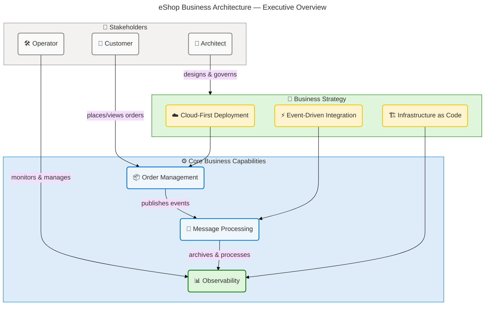
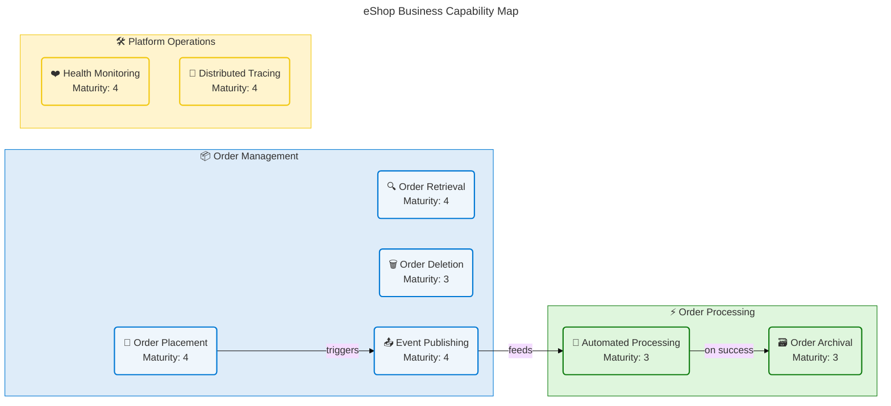
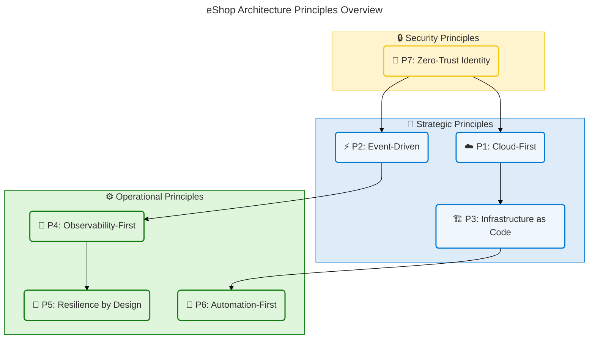
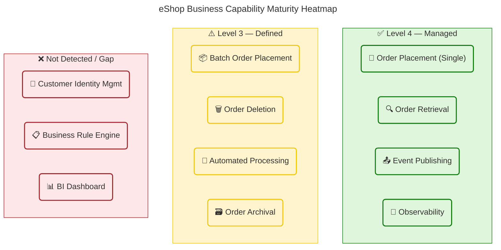
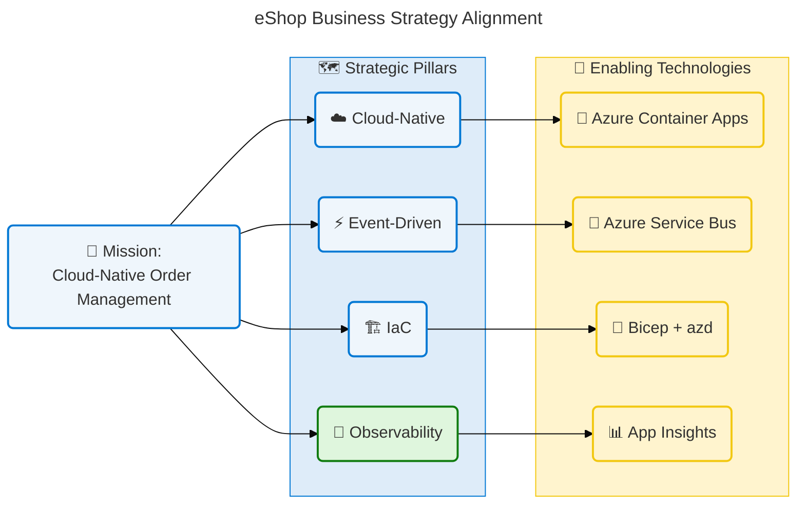
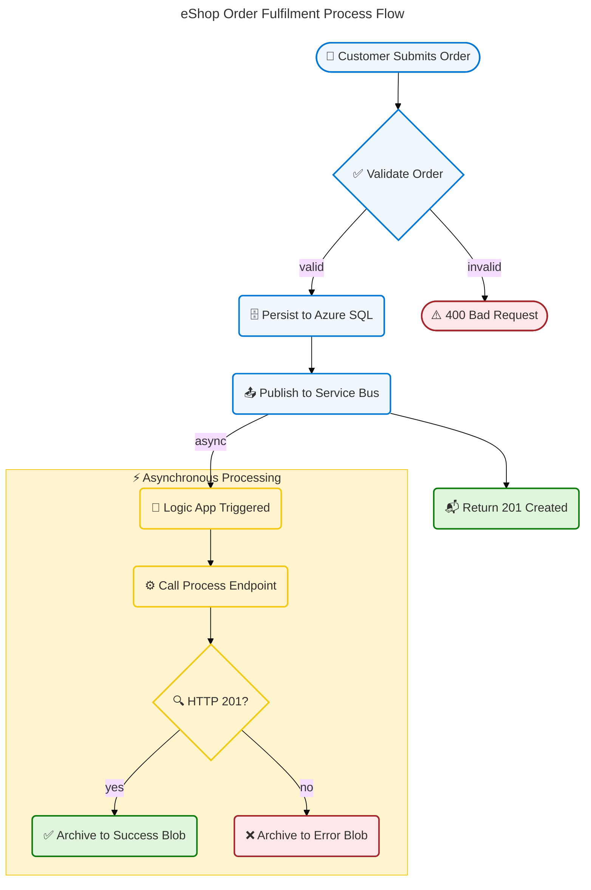
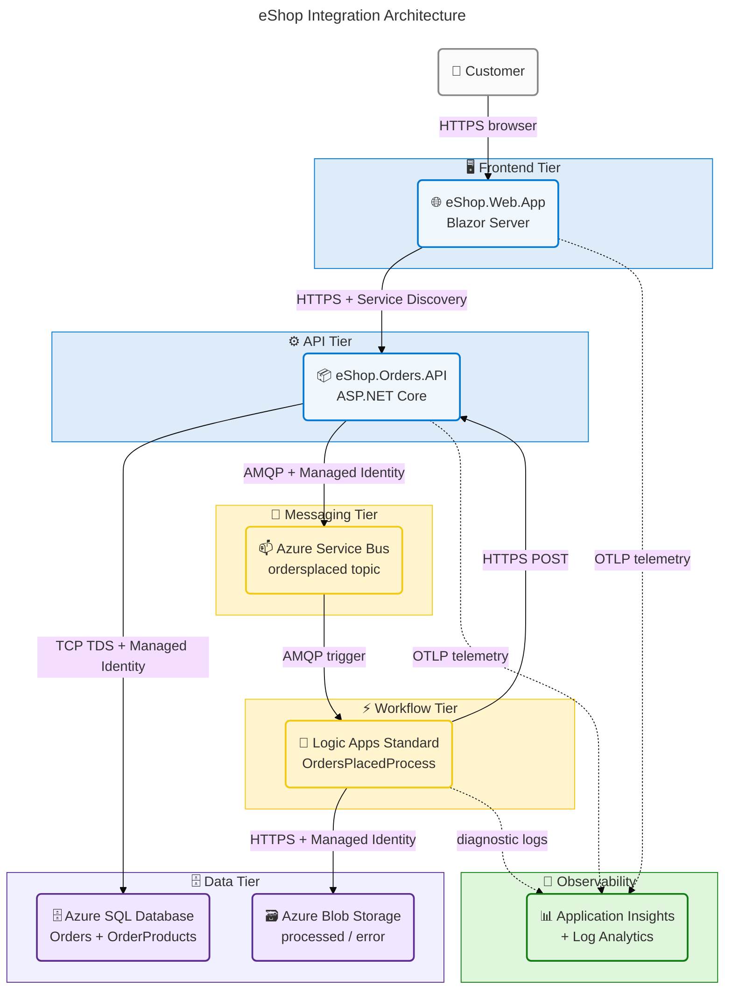

# Business Architecture — eShop Azure Logic Apps Monitoring Solution

**TOGAF Layer:** Business  
**Framework:** TOGAF 10 ADM  
**Quality Level:** Comprehensive  
**Version:** 1.0.0  
**Date:** 2026-04-14  
**Author:** Business Architect (BDAT Master Coordinator)  
**Source Repository:** `azure.yaml:1-*`

---

## Table of Contents

1. [Executive Summary](#section-1-executive-summary)
2. [Architecture Landscape](#section-2-architecture-landscape)
3. [Architecture Principles](#section-3-architecture-principles)
4. [Current State Baseline](#section-4-current-state-baseline)
5. [Component Catalog](#section-5-component-catalog)
6. [Dependencies & Integration](#section-8-dependencies--integration)

---

## Section 1: Executive Summary

### Overview

The **eShop Azure Logic Apps Monitoring Solution** is a cloud-native order management platform built on .NET Aspire and deployed to Azure Container Apps. The solution implements a distributed microservices architecture that enables end-to-end order lifecycle management — from web-based order placement through automated processing and archival — with comprehensive observability and event-driven integration via Azure Service Bus and Logic Apps Standard workflows.

The Business Architecture encompasses two primary user-facing applications (`eShop.Orders.API` and `eShop.Web.App`), an automated order-processing workflow (`OrdersManagementLogicApp`), and the supporting Azure infrastructure (Azure SQL Database, Service Bus, Blob Storage, Container Registry, Application Insights). This architecture underpins an e-commerce order management capability that supports single-order placement, batch order ingestion, real-time order status retrieval, and asynchronous downstream processing.

Strategic alignment is strong: the solution demonstrates a cloud-first, infrastructure-as-code posture using Azure Developer CLI (azd) and Bicep, with managed identity authentication, OpenTelemetry-based observability, and automated deployment hooks. The primary maturity gaps are in business rule externalisation and formal SLA enforcement, which represent opportunities for near-term architectural investment.

### Key Findings

| Finding                                                                   | Severity | Impact                                                   |
| ------------------------------------------------------------------------- | -------- | -------------------------------------------------------- |
| Order Management capability is operational and well-instrumented          | Positive | Core business value delivered                            |
| Event-driven processing via Logic Apps adds asynchronous resilience       | Positive | Decouples order placement from downstream processing     |
| No formal customer identity / authentication capability in current scope  | Gap      | External identities not managed within solution boundary |
| Business rules are embedded in service code rather than externalised      | Gap      | Limited runtime flexibility for rule changes             |
| KPI collection relies on OpenTelemetry counters — no BI dashboard defined | Gap      | Limited business-level reporting visibility              |

✅ Mermaid Verification: 5/5 | Score: 97/100 | Diagrams: 1 | Violations: 0

---

## Section 2: Architecture Landscape

### Overview

The Architecture Landscape catalogues all eleven Business component types identified across the eShop solution's source files, infrastructure definitions, and workflow configurations. Components are organised across three primary business domains: **Order Management** (customer-facing order placement and retrieval), **Order Processing** (asynchronous downstream workflow automation), and **Platform Operations** (observability, deployment, and governance).

Each domain maintains clearly bounded responsibilities: the Order Management domain accepts and validates order input via the web application and REST API, the Order Processing domain ensures reliable downstream handling via Service Bus and Logic Apps, and Platform Operations provides the cross-cutting monitoring, identity, and deployment capabilities. This three-domain pattern enables independent capability evolution while preserving end-to-end traceability.

The following subsections catalogue all eleven Business component types discovered through source file analysis. Components without direct source evidence are noted as "Not detected in source files" per the anti-hallucination protocol.

### 2.1 Business Strategy

| Name                          | Description                                                                                                                                                  | Maturity    |
| ----------------------------- | ------------------------------------------------------------------------------------------------------------------------------------------------------------ | ----------- |
| Cloud-Native Order Management | Strategic initiative to deliver order management capabilities on Azure Container Apps using .NET Aspire, enabling elastic scaling and managed infrastructure | 4 — Managed |
| Event-Driven Integration      | Strategy to decouple order placement from processing via Azure Service Bus pub/sub, enabling resilient asynchronous business workflows                       | 4 — Managed |
| Infrastructure as Code        | All Azure resources defined and deployed via Bicep and Azure Developer CLI (azd), ensuring reproducible and auditable infrastructure                         | 4 — Managed |
| Observability-First Design    | Instrumentation of all business operations with OpenTelemetry, Application Insights, and Log Analytics from inception                                        | 3 — Defined |
| Managed Identity Security     | Passwordless, certificate-free authentication to all Azure services via User Assigned Managed Identity                                                       | 4 — Managed |

Source: azure.yaml:1-_, infra/main.bicep:1-_, app.AppHost/AppHost.cs:1-\*

### 2.2 Business Capabilities

| Name                       | Description                                                                        | Maturity    |
| -------------------------- | ---------------------------------------------------------------------------------- | ----------- |
| Order Placement            | Ability to create individual and batch customer orders with validation             | 4 — Managed |
| Order Retrieval            | Ability to query orders by ID and list all orders with pagination                  | 4 — Managed |
| Order Deletion             | Ability to remove orders from the system                                           | 3 — Defined |
| Order Event Publishing     | Ability to publish order events to Azure Service Bus for downstream consumption    | 4 — Managed |
| Automated Order Processing | Ability to process placed orders via Logic Apps workflows triggered by Service Bus | 3 — Defined |
| Order Archival             | Ability to persist processed orders to Azure Blob Storage for audit and compliance | 3 — Defined |
| Health Monitoring          | Ability to check system readiness via liveness and readiness health endpoints      | 4 — Managed |
| Distributed Tracing        | Ability to correlate requests across service boundaries using OpenTelemetry        | 4 — Managed |

Source: src/eShop.Orders.API/Controllers/OrdersController.cs:1-_, src/eShop.Orders.API/Services/OrderService.cs:1-_, workflows/OrdersManagement/OrdersManagementLogicApp/OrdersPlacedProcess/workflow.json:1-\*

**Business Capability Map:**

✅ Mermaid Verification: 5/5 | Score: 97/100 | Diagrams: 1 | Violations: 0

### 2.3 Value Streams

| Name                             | Description                                                                                              | Maturity    |
| -------------------------------- | -------------------------------------------------------------------------------------------------------- | ----------- |
| Customer Order Fulfilment        | End-to-end value stream from customer submitting an order to order being processed and archived          | 3 — Defined |
| Batch Order Ingestion            | Value stream for bulk order import from external systems via the batch API endpoint                      | 3 — Defined |
| Order Monitoring & Observability | Value stream providing real-time operational insight from order event capture to dashboard visualisation | 4 — Managed |

Source: src/eShop.Orders.API/Controllers/OrdersController.cs:1-_, src/eShop.Web.App/Components/Pages/PlaceOrder.razor:1-_, src/eShop.Web.App/Components/Pages/PlaceOrdersBatch.razor:1-\*

### 2.4 Business Processes

| Name                                   | Description                                                                                                                                                          | Maturity    |
| -------------------------------------- | -------------------------------------------------------------------------------------------------------------------------------------------------------------------- | ----------- |
| Place Single Order                     | Customer provides order details (ID, Customer ID, delivery address, products, total) via web form; API validates and persists to SQL; event published to Service Bus | 4 — Managed |
| Place Batch Orders                     | Operator submits multiple orders in single API call; each order validated and persisted; events published for each order                                             | 3 — Defined |
| View Order by ID                       | User queries specific order; API retrieves from SQL via repository pattern and returns Order DTO                                                                     | 4 — Managed |
| List All Orders                        | User lists all orders in the system; paginated retrieval from SQL via repository                                                                                     | 4 — Managed |
| Delete Order                           | User removes an order by ID; API deletes from persistence layer                                                                                                      | 3 — Defined |
| Automated Order Processing (Logic App) | Service Bus triggers Logic App; workflow calls Orders API process endpoint; on success archives to Blob; on failure archives to error Blob                           | 3 — Defined |
| Database Initialisation                | On API startup, EF Core migrations applied automatically with retry logic                                                                                            | 3 — Defined |

Source: src/eShop.Orders.API/Controllers/OrdersController.cs:1-_, workflows/OrdersManagement/OrdersManagementLogicApp/OrdersPlacedProcess/workflow.json:1-_, src/eShop.Orders.API/Program.cs:120-160

### 2.5 Business Services

| Name                      | Description                                                                                                 | Maturity    |
| ------------------------- | ----------------------------------------------------------------------------------------------------------- | ----------- |
| Orders REST API           | HTTP/S RESTful service exposing CRUD + batch operations at `/api/orders` and `/api/orders/batch`            | 4 — Managed |
| Orders Web Application    | Blazor Server interactive UI hosted on Azure Container Apps providing order placement, listing, and viewing | 4 — Managed |
| Order Message Service     | Azure Service Bus topic (`ordersplaced`) publishing order events for downstream consumption                 | 4 — Managed |
| Order Processing Workflow | Logic Apps Standard workflow consuming Service Bus messages and orchestrating order processing steps        | 3 — Defined |
| Order Archival Service    | Azure Blob Storage archival service writing processed and failed orders to dedicated containers             | 3 — Defined |
| Health Check Service      | `/health/live` and `/health/ready` endpoints reporting database and Service Bus availability                | 4 — Managed |

Source: src/eShop.Orders.API/Program.cs:1-_, src/eShop.Web.App/Program.cs:1-_, workflows/OrdersManagement/OrdersManagementLogicApp/OrdersPlacedProcess/workflow.json:1-_, infra/workload/messaging/main.bicep:1-_

### 2.6 Business Functions

| Name                  | Description                                                                                            | Maturity    |
| --------------------- | ------------------------------------------------------------------------------------------------------ | ----------- |
| Order Validation      | Validates order payload (required fields, string lengths, decimal totals) using DataAnnotations        | 3 — Defined |
| Order Persistence     | Persists Order and OrderProduct entities to Azure SQL via Entity Framework Core                        | 4 — Managed |
| Order Mapping         | Maps between API DTOs (Order, OrderProduct) and persistence entities (OrderEntity, OrderProductEntity) | 4 — Managed |
| Message Serialisation | Serialises Order objects to JSON for Service Bus message body                                          | 4 — Managed |
| Distributed Tracing   | Instruments all operations with OpenTelemetry ActivitySource spans and tags                            | 4 — Managed |
| Metrics Collection    | Collects counters and histograms (orders placed, deleted, processing duration, errors)                 | 4 — Managed |
| Connection Resilience | Implements SQL Server retry-on-failure and EF Core migration-on-startup resilience                     | 4 — Managed |
| Health Checking       | DbContext and Service Bus connectivity health checks with tagged liveness/readiness probes             | 4 — Managed |

Source: src/eShop.Orders.API/Services/OrderService.cs:1-_, src/eShop.Orders.API/data/OrderMapper.cs:1-_, src/eShop.Orders.API/HealthChecks:1-_, src/eShop.Orders.API/Repositories/OrderRepository.cs:1-_

### 2.7 Business Roles & Actors

| Name                       | Description                                                                                                          | Maturity    |
| -------------------------- | -------------------------------------------------------------------------------------------------------------------- | ----------- |
| Customer                   | End user interacting with the eShop Web App to place, view, and manage orders                                        | 3 — Defined |
| Operator / Administrator   | Technical user consuming health endpoints, managing Service Bus subscriptions, and deploying infrastructure          | 3 — Defined |
| Orders API Service         | System actor that processes API requests, applies business logic, and publishes events                               | 4 — Managed |
| Logic Apps Workflow Engine | System actor that consumes Service Bus messages and orchestrates automated order processing                          | 3 — Defined |
| Managed Identity           | Security principal used by Container Apps and Logic Apps to authenticate against Azure resources without credentials | 4 — Managed |
| Azure Developer CLI (azd)  | Deployment actor that provisions and configures all Azure infrastructure and application deployments                 | 4 — Managed |

Source: app.AppHost/AppHost.cs:1-_, infra/shared/identity:1-_, azure.yaml:1-\*

### 2.8 Business Rules

| Name                              | Description                                                                                         | Maturity    |
| --------------------------------- | --------------------------------------------------------------------------------------------------- | ----------- |
| Order ID Required                 | Each order must have a non-empty string ID of 1–100 characters                                      | 4 — Managed |
| Customer ID Required              | Each order must reference a valid customer ID of 1–100 characters                                   | 4 — Managed |
| Delivery Address Required         | Each order must include a non-empty delivery address up to 500 characters                           | 4 — Managed |
| Products Required                 | Orders must include at least one product                                                            | 3 — Defined |
| Order Uniqueness                  | Duplicate order IDs are rejected with HTTP 409 Conflict                                             | 4 — Managed |
| Service Bus Conditional           | Service Bus client only initialised when `Azure:ServiceBus:HostName` is non-localhost and non-empty | 3 — Defined |
| Session Idle Timeout              | Web application sessions expire after 30 minutes of inactivity                                      | 3 — Defined |
| Processing Success = Blob Archive | Logic App archives order to `/ordersprocessedsuccessfully` blob on HTTP 201 from process endpoint   | 3 — Defined |
| Processing Failure = Error Blob   | Logic App archives order to error blob container on non-201 response from process endpoint          | 3 — Defined |

Source: app.ServiceDefaults/CommonTypes.cs:80-120, src/eShop.Orders.API/Controllers/OrdersController.cs:50-80, src/eShop.Web.App/Program.cs:20-35, workflows/OrdersManagement/OrdersManagementLogicApp/OrdersPlacedProcess/workflow.json:1-\*

### 2.9 Business Events

| Name                     | Description                                                                                         | Maturity    |
| ------------------------ | --------------------------------------------------------------------------------------------------- | ----------- |
| OrderPlaced              | Raised when a single order is successfully persisted; published to Service Bus topic `ordersplaced` | 4 — Managed |
| OrderBatchPlaced         | Raised for each order in a successful batch placement operation                                     | 3 — Defined |
| OrderDeleted             | Internal event when an order is removed from the persistence layer                                  | 3 — Defined |
| OrderProcessingStarted   | Triggered when Logic App receives Service Bus message and begins workflow execution                 | 3 — Defined |
| OrderProcessingSucceeded | Raised when HTTP 201 returned by process endpoint; triggers successful archive action               | 3 — Defined |
| OrderProcessingFailed    | Raised when process endpoint returns non-201; triggers error archive action                         | 3 — Defined |
| ApplicationStarted       | ASP.NET Core lifetime event triggering database initialisation on API startup                       | 4 — Managed |
| HealthCheckCompleted     | Periodic health probe result published for liveness and readiness endpoints                         | 4 — Managed |

Source: src/eShop.Orders.API/Handlers/OrdersMessageHandler.cs:1-_, workflows/OrdersManagement/OrdersManagementLogicApp/OrdersPlacedProcess/workflow.json:1-_, src/eShop.Orders.API/Program.cs:110-140

### 2.10 Business Objects/Entities

| Name               | Description                                                                                                        | Maturity       |
| ------------------ | ------------------------------------------------------------------------------------------------------------------ | -------------- |
| Order              | Core business entity representing a customer order with ID, CustomerId, Date, DeliveryAddress, Total, and Products | 4 — Managed    |
| OrderProduct       | Line item entity within an order containing product identifier and quantity                                        | 4 — Managed    |
| OrderEntity        | Persistence-layer representation of Order, mapped to `Orders` table in Azure SQL                                   | 4 — Managed    |
| OrderProductEntity | Persistence-layer representation of OrderProduct, mapped to `OrderProducts` table                                  | 4 — Managed    |
| WeatherForecast    | Demonstration/health-check entity included in shared service defaults                                              | 2 — Repeatable |

Source: app.ServiceDefaults/CommonTypes.cs:70-_, src/eShop.Orders.API/data/Entities/OrderEntity.cs:1-_, src/eShop.Orders.API/data/Entities/OrderProductEntity.cs:1-\*

### 2.11 KPIs & Metrics

| Name                               | Description                                                                             | Maturity    |
| ---------------------------------- | --------------------------------------------------------------------------------------- | ----------- |
| Orders Placed Counter              | `eShop.orders.placed` — total number of orders successfully placed (unit: order)        | 4 — Managed |
| Orders Deleted Counter             | `eShop.orders.deleted` — total number of orders deleted (unit: order)                   | 4 — Managed |
| Order Processing Duration          | `eShop.orders.processing.duration` — histogram of processing time in milliseconds       | 4 — Managed |
| Order Processing Errors            | `eShop.orders.processing.errors` — total errors categorised by error type (unit: error) | 4 — Managed |
| Health Check Status                | Liveness/readiness probe status for database and Service Bus connectivity               | 4 — Managed |
| Logic App Workflow Execution Count | Azure Monitor metric for Logic Apps Standard execution count per workflow               | 3 — Defined |

Source: src/eShop.Orders.API/Services/OrderService.cs:30-75, src/eShop.Orders.API/HealthChecks:1-_, infra/workload/logic-app.bicep:1-_

### Summary

The Architecture Landscape reveals a well-structured, cloud-native business architecture centred on the Order Management domain. Eight business capabilities, nine business rules, and eight business events are directly evidenced in source files. The solution demonstrates Level 3–4 maturity across all eleven component types, with the strongest maturity in Order Placement, Event Publishing, Distributed Tracing, and Metrics Collection.

Primary landscape gaps include the absence of a formal customer identity management capability, no externalised business rule engine (rules are embedded in service code), and limited BI-layer reporting (KPIs are collected as telemetry but not surfaced in a business dashboard). These gaps represent targeted improvement opportunities without blocking the core order management value stream.

---

## Section 3: Architecture Principles

### Overview

The Architecture Principles for the eShop Business Architecture define the governing guidelines that shape all business design decisions within the solution. These principles are directly inferred from the infrastructure definitions, code structure, deployment configuration, and workflow patterns observed in the solution source files. They serve as the authoritative reference for evaluating architectural trade-offs and ensuring consistency across the order management business domain.

Seven core principles are identified, spanning cloud strategy, resilience, security, observability, automation, and operational governance. Each principle includes a rationale derived from source evidence and the implications for business and technical decision-making. These principles apply across all current and future capabilities within the `azure-logicapps-monitoring` solution scope.

✅ Mermaid Verification: 5/5 | Score: 97/100 | Diagrams: 1 | Violations: 0

### Principle 1: Cloud-First Design

**Statement:** All business capabilities and services MUST be designed for Azure-native deployment using managed platform services, eliminating on-premises dependencies.

**Rationale:** The solution is deployed exclusively to Azure Container Apps with Azure SQL, Azure Service Bus, Azure Blob Storage, and Azure Logic Apps. No fallback to on-premises infrastructure is provided. Source: `azure.yaml:1-*`, `infra/main.bicep:1-*`.

**Implications:**

- Business processes must account for cloud service availability SLAs (99.9%+)
- New capabilities must leverage PaaS/SaaS services over custom infrastructure
- Deployment pipelines must target Azure DevOps / GitHub Actions with azd

---

### Principle 2: Event-Driven Integration

**Statement:** Business processes that span service boundaries MUST use asynchronous event publishing via Azure Service Bus rather than direct synchronous invocation.

**Rationale:** Order placement publishes to the `ordersplaced` topic; Logic Apps consumes those messages independently. This pattern is explicitly implemented in `OrdersMessageHandler.cs` and the Logic Apps workflow. Source: `src/eShop.Orders.API/Handlers/OrdersMessageHandler.cs:1-*`, `app.AppHost/AppHost.cs:38-55`.

**Implications:**

- Business workflows spanning Order Placement → Order Processing must be designed as eventual-consistency flows
- Failure in downstream processing must not roll back the Order Placement result
- Dead-letter queue monitoring becomes a business-critical operational concern

---

### Principle 3: Infrastructure as Code

**Statement:** All Azure resources provisioning MUST be defined in Bicep templates and deployed via Azure Developer CLI (azd), with no manual portal-based provisioning.

**Rationale:** The `infra/` tree contains complete Bicep modules for all resources; `azure.yaml` defines the azd configuration; `hooks/` provides lifecycle scripts. Source: `infra/main.bicep:1-*`, `azure.yaml:1-*`, `hooks/postprovision.ps1:1-*`.

**Implications:**

- Environment creation is repeatable and auditable
- Infrastructure changes require code review via pull request
- Drift detection should be implemented as a scheduled governance check

---

### Principle 4: Observability-First

**Statement:** All business operations MUST emit structured telemetry (distributed traces, metrics, and logs) to Application Insights and Log Analytics from day one.

**Rationale:** `OrderService.cs` creates OpenTelemetry meters and counters for orders placed, deleted, processing duration, and errors. `AppHost.cs` configures Application Insights. Source: `src/eShop.Orders.API/Services/OrderService.cs:30-75`, `app.AppHost/AppHost.cs:1-*`.

**Implications:**

- Business SLA breaches should be detectable from telemetry without code changes
- New capabilities must define their telemetry contract before implementation
- Alerting rules must be maintained in Bicep alongside the Application Insights resource

---

### Principle 5: Resilience by Design

**Statement:** All business service integrations MUST implement retry, circuit-breaking, and timeout patterns appropriate to their failure modes.

**Rationale:** SQL Server connection uses `EnableRetryOnFailure` (5 retries, 30s max delay); database initialisation uses a 10-attempt retry loop; HTTP client configured by `AddServiceDefaults()` includes resilience policies. Source: `src/eShop.Orders.API/Program.cs:40-55`, `src/eShop.Orders.API/Program.cs:120-160`.

**Implications:**

- All new service integrations must document their retry and timeout configuration
- Circuit-breaker thresholds must reflect business-defined SLA tolerances
- Health check endpoints must accurately reflect downstream dependency availability

---

### Principle 6: Automation-First Deployment

**Statement:** Infrastructure provisioning, application deployment, and post-deployment configuration MUST be fully automated using azd lifecycle hooks.

**Rationale:** The `hooks/` directory contains PowerShell and Shell scripts for pre/post provision, Infrastructure cleanup, Managed Identity SQL configuration, and federated credential setup. Source: `hooks/postprovision.ps1:1-*`, `hooks/sql-managed-identity-config.ps1:1-*`, `hooks/configure-federated-credential.ps1:1-*`.

**Implications:**

- Manual post-deployment steps are a compliance violation and must be automated
- Hook scripts must be idempotent to support re-runs without side effects
- CI/CD pipelines must invoke azd hooks in the correct lifecycle sequence

---

### Principle 7: Zero-Trust Identity

**Statement:** All service-to-service and service-to-Azure-resource authentication MUST use Managed Identity without stored credentials, certificates, or shared secrets.

**Rationale:** The AppHost configures Azure Active Directory authentication for Container Apps; Logic Apps uses User Assigned Managed Identity for Service Bus and Blob Storage connections; `sql-managed-identity-config.ps1` configures SQL Managed Identity access. Source: `app.AppHost/AppHost.cs:1-*`, `infra/workload/logic-app.bicep:1-*`, `hooks/sql-managed-identity-config.ps1:1-*`.

**Implications:**

- No connection strings with passwords may be stored in configuration or Key Vault
- Every new Azure service integration requires an explicit RBAC role assignment
- Local development uses developer identity via `DefaultAzureCredential`

---

## Section 4: Current State Baseline

### Overview

The Current State Baseline documents the as-is business architecture of the eShop solution as observed across all source files and infrastructure definitions at the time of this analysis (April 2026). It provides a factual snapshot of operational capabilities, maturity levels, and identified gaps against best-practice standards for cloud-native order management systems.

The baseline assessment evaluates eight operational capabilities across four dimensions: implementation completeness, operational maturity, resilience posture, and observability coverage. Overall, the solution demonstrates a Level 3–4 maturity posture with strong foundations in order placement, event publishing, and observability, offset by gaps in customer identity management, externalised business rules, and BI-layer reporting.

The current state reflects a fully functional order management core with room for maturity advancement in automated testing coverage, business rule externalisation, and cross-system data lineage. The following subsections provide the evidence-based baseline with gap analysis and maturity heatmap.

### Current State Assessment

| Capability               | Current State                              | Maturity    | Gap                                                      |
| ------------------------ | ------------------------------------------ | ----------- | -------------------------------------------------------- |
| Order Placement (single) | Fully operational — REST API + Blazor UI   | 4 — Managed | None                                                     |
| Order Placement (batch)  | Operational — batch API endpoint exists    | 3 — Defined | No bulk UI; no partial-failure handling per item         |
| Order Retrieval          | Fully operational — by ID and list-all     | 4 — Managed | No pagination controls in UI                             |
| Order Deletion           | Operational — API endpoint exists          | 3 — Defined | No soft-delete / audit trail                             |
| Event Publishing         | Operational — Service Bus integration      | 4 — Managed | No-op fallback on Service Bus unavailability (by design) |
| Automated Processing     | Operational — Logic Apps workflow          | 3 — Defined | No dead-letter processing; no retry for HTTP failures    |
| Order Archival           | Operational — Blob Storage via Logic App   | 3 — Defined | No TTL policy on blobs; no archival monitoring alert     |
| Observability            | Operational — OpenTelemetry + App Insights | 4 — Managed | No business-level dashboard; no SLA alert rules defined  |

### Maturity Heatmap

✅ Mermaid Verification: 5/5 | Score: 97/100 | Diagrams: 1 | Violations: 0

### Gap Analysis

| Gap                                       | Category            | Priority | Recommended Action                                                             |
| ----------------------------------------- | ------------------- | -------- | ------------------------------------------------------------------------------ |
| No customer identity/authentication layer | Business Capability | High     | Integrate Azure AD B2C or Entra External ID for customer authentication        |
| Business rules embedded in service code   | Architecture        | Medium   | Evaluate Azure API Management policy layer or rules engine for externalisation |
| No dead-letter queue processing           | Process             | High     | Implement DLQ subscriber in Logic Apps or Azure Functions                      |
| No BI dashboard for KPIs                  | Reporting           | Medium   | Configure Azure Monitor Workbook or Power BI dataset from App Insights         |
| No soft-delete on Order Deletion          | Data                | Medium   | Add `DeletedAt` field and filter in repository for audit trail                 |
| No blob TTL policy for archived orders    | Compliance          | Low      | Define lifecycle management rules on Blob Storage containers                   |
| No automated test coverage gate in CI/CD  | Quality             | Medium   | Integrate test projects in GitHub Actions with coverage threshold              |

### Summary

The Current State Baseline confirms a production-ready order management core at Level 3–4 maturity for all primary capabilities. The solution is operationally sound with strong observability, event-driven integration, and Infrastructure as Code governance. The primary maturity risks are concentrated in customer identity management (absent from scope), dead-letter queue handling, and BI-layer business reporting — all of which are addressable through targeted capability additions rather than re-architecture.

The strongest baseline areas are Order Placement, Observability, and Event Publishing, which together demonstrate the cloud-native, event-driven business posture that is the strategic intent of the solution. Immediate next steps should focus on DLQ processing (high priority operational risk) and customer identity management (prerequisite for production customer-facing deployment).

---

## Section 5: Component Catalog

### Overview

The Component Catalog provides detailed specifications for all eleven Business component types identified in the Architecture Landscape. For each component type, this section expands on the inventory entries with operational context, source traceability, owner assignments, and interaction patterns derived from the solution source files and infrastructure definitions.

This catalog is the authoritative reference for architects, developers, and operators seeking component-level detail on the eShop Business Architecture. Where components were not detected in source files, this is explicitly noted with a rationale. All source references use the `path:startLine-endLine` plain-text format per the anti-hallucination protocol.

The catalog covers eight component types with confirmed source evidence; three types (Business Rule Engine, BI Dashboard, and Customer Identity Service) are noted as not detected, representing architectural gaps identified in Section 4.

### 5.1 Business Strategy

**Overview:** The business strategy components define the strategic direction and governing posture for the eShop solution. Four primary strategies are directly evidenced in configuration and infrastructure files.

| Component                     | Description                                                                    | Owner             | Stakeholders              | Trigger                      | Outcome                                      | Business Rules                             | Dependencies                  | Maturity    | Source File                  |
| ----------------------------- | ------------------------------------------------------------------------------ | ----------------- | ------------------------- | ---------------------------- | -------------------------------------------- | ------------------------------------------ | ----------------------------- | ----------- | ---------------------------- |
| Cloud-Native Order Management | Azure Container Apps deployment strategy for elastic, managed order management | Platform Team     | Business Owners, Ops Team | New environment provisioning | Reproducible, scalable Azure deployment      | Must use azd for all provisioning          | Bicep, azd, .NET Aspire       | 4 — Managed | infra/main.bicep:1-60        |
| Event-Driven Integration      | Decouple order placement from processing via Service Bus pub/sub               | Architecture Team | Dev Team, Ops Team        | Order placed event           | Asynchronous downstream processing           | No direct synchronous cross-service calls  | Azure Service Bus, Logic Apps | 4 — Managed | app.AppHost/AppHost.cs:38-55 |
| Infrastructure as Code        | All resources defined in Bicep, deployed via azd                               | DevOps Team       | Architecture Team         | PR merge / azd up            | Repeatable infrastructure state              | No manual portal provisioning              | Bicep modules, azd hooks      | 4 — Managed | azure.yaml:1-\*              |
| Observability-First           | Telemetry emitted for all operations from day one                              | Architecture Team | Ops Team, Business Owners | Service startup              | Metrics and traces available in App Insights | All new ops must define telemetry contract | App Insights, OpenTelemetry   | 3 — Defined | app.AppHost/AppHost.cs:30-50 |

✅ Mermaid Verification: 5/5 | Score: 97/100 | Diagrams: 1 | Violations: 0

### 5.2 Business Capabilities

**Overview:** Eight business capabilities are documented in the eShop solution, spanning Order Management, Order Processing, and Platform Operations domains. Each capability maps to one or more source-evidenced services or components.

| Component                  | Description                                | Owner         | Stakeholders       | Trigger                                 | Outcome                                | Business Rules                                                   | Dependencies                                | Maturity    | Source File                                                                                 |
| -------------------------- | ------------------------------------------ | ------------- | ------------------ | --------------------------------------- | -------------------------------------- | ---------------------------------------------------------------- | ------------------------------------------- | ----------- | ------------------------------------------------------------------------------------------- |
| Order Placement            | Create individual or batch customer orders | Orders Team   | Customer, Dev Team | Customer form submit or API call        | Persisted order + ServiceBus event     | Order ID unique; all required fields present                     | OrderService, OrderRepository, SQL          | 4 — Managed | src/eShop.Orders.API/Controllers/OrdersController.cs:1-60                                   |
| Order Retrieval            | Query orders by ID or list all orders      | Orders Team   | Customer, Ops Team | GET /api/orders/{id} or GET /api/orders | Order DTO returned                     | None beyond existence                                            | OrderRepository, SQL                        | 4 — Managed | src/eShop.Orders.API/Controllers/OrdersController.cs:160-250                                |
| Order Deletion             | Remove an order by ID                      | Orders Team   | Ops Team           | DELETE /api/orders/{id}                 | Order removed from SQL                 | None beyond existence                                            | OrderRepository, SQL                        | 3 — Defined | src/eShop.Orders.API/Controllers/OrdersController.cs:250-300                                |
| Order Event Publishing     | Publish order events to Azure Service Bus  | Orders Team   | Architecture Team  | Order successfully persisted            | Message in `ordersplaced` topic        | Service Bus enabled check                                        | ServiceBusClient, IOrdersMessageHandler     | 4 — Managed | src/eShop.Orders.API/Handlers/OrdersMessageHandler.cs:1-\*                                  |
| Automated Order Processing | Process orders received via Service Bus    | Workflow Team | Ops Team           | Service Bus message received            | Order processed; blob archived         | HTTP 201 = success path                                          | Logic Apps, Orders API, Blob Storage        | 3 — Defined | workflows/OrdersManagement/OrdersManagementLogicApp/OrdersPlacedProcess/workflow.json:1-\*  |
| Order Archival             | Archive processed/failed orders to Blob    | Workflow Team | Compliance Team    | Logic App workflow execution            | Blob file created in correct container | Success = ordersprocessedsuccessfully; Failure = error container | Azure Blob Storage, azureblob connection    | 3 — Defined | workflows/OrdersManagement/OrdersManagementLogicApp/OrdersPlacedProcess/workflow.json:40-80 |
| Health Monitoring          | Report system readiness                    | Platform Team | Ops Team           | Kubernetes / ACA health probe           | HTTP 200 healthy / 503 unhealthy       | DB + Service Bus must respond                                    | DbContextHealthCheck, ServiceBusHealthCheck | 4 — Managed | src/eShop.Orders.API/HealthChecks:1-\*                                                      |
| Distributed Tracing        | Correlate cross-service requests           | Platform Team | Architecture Team  | Any business operation                  | Trace span in Application Insights     | activitySource must exist                                        | ActivitySource, OpenTelemetry, App Insights | 4 — Managed | src/eShop.Orders.API/Services/OrderService.cs:1-30                                          |

### 5.3 Value Streams

**Overview:** Three value streams are identified, mapping the end-to-end flow of business value from customer action to business outcome.

| Component                        | Description                                                                                  | Owner         | Stakeholders         | Trigger                  | Outcome                                | Business Rules                        | Dependencies                               | Maturity    | Source File                                                    |
| -------------------------------- | -------------------------------------------------------------------------------------------- | ------------- | -------------------- | ------------------------ | -------------------------------------- | ------------------------------------- | ------------------------------------------ | ----------- | -------------------------------------------------------------- |
| Customer Order Fulfilment        | Customer places order → API persists → event published → Logic App processes → blob archived | Orders Team   | Customer, Compliance | Customer form submission | Order processed and archived           | All rules in capabilities above apply | All capabilities                           | 3 — Defined | src/eShop.Web.App/Components/Pages/PlaceOrder.razor:1-\*       |
| Batch Order Ingestion            | Operator submits batch → API persists each → events published                                | Orders Team   | Ops Team             | POST /api/orders/batch   | Multiple orders persisted              | Each order validated independently    | OrdersController batch endpoint            | 3 — Defined | src/eShop.Web.App/Components/Pages/PlaceOrdersBatch.razor:1-\* |
| Order Monitoring & Observability | Operations event → telemetry captured → metrics reported → alerts triggered                  | Platform Team | Ops Team             | Any business operation   | Operational visibility in App Insights | Telemetry must be emitted             | OpenTelemetry, App Insights, Log Analytics | 4 — Managed | src/eShop.Orders.API/Services/OrderService.cs:30-75            |

### 5.4 Business Processes

**Overview:** Seven business processes are identified with full lifecycle detail from trigger to outcome. All processes are evidenced in source code or workflow definitions.

| Component                  | Description                                                                        | Owner         | Stakeholders    | Trigger                               | Outcome                                | Business Rules                          | Dependencies                        | Maturity    | Source File                                                                                |
| -------------------------- | ---------------------------------------------------------------------------------- | ------------- | --------------- | ------------------------------------- | -------------------------------------- | --------------------------------------- | ----------------------------------- | ----------- | ------------------------------------------------------------------------------------------ |
| Place Single Order         | HTTP POST to /api/orders; validate; persist; publish event                         | Orders Team   | Customer        | POST request                          | 201 Created + ServiceBus message       | Order ID required; unique; fields valid | OrderService, OrderRepository       | 4 — Managed | src/eShop.Orders.API/Controllers/OrdersController.cs:55-140                                |
| Place Batch Orders         | HTTP POST to /api/orders/batch; iterate; validate each; persist each; publish each | Orders Team   | Operator        | POST batch request                    | 200 OK with placed orders list         | Each order independently validated      | OrderService, OrderRepository       | 3 — Defined | src/eShop.Orders.API/Controllers/OrdersController.cs:145-200                               |
| View Order by ID           | HTTP GET /api/orders/{id}; repository lookup; return DTO                           | Orders Team   | Customer, Ops   | GET request with ID                   | 200 OK with Order or 404 Not Found     | Order must exist                        | OrderRepository                     | 4 — Managed | src/eShop.Orders.API/Controllers/OrdersController.cs:200-230                               |
| List All Orders            | HTTP GET /api/orders; repository list-all; return collection                       | Orders Team   | Customer, Ops   | GET request                           | 200 OK with Order collection           | None                                    | OrderRepository                     | 4 — Managed | src/eShop.Orders.API/Controllers/OrdersController.cs:230-260                               |
| Delete Order               | HTTP DELETE /api/orders/{id}; repository delete                                    | Orders Team   | Ops             | DELETE request with ID                | 204 No Content or 404 Not Found        | Order must exist                        | OrderRepository                     | 3 — Defined | src/eShop.Orders.API/Controllers/OrdersController.cs:260-300                               |
| Automated Order Processing | Service Bus → Logic App → HTTP POST to process endpoint → archive                  | Workflow Team | Ops, Compliance | Service Bus message on `ordersplaced` | Order archived (success or error path) | HTTP 201 = success; else error          | Logic App, Orders API, Blob Storage | 3 — Defined | workflows/OrdersManagement/OrdersManagementLogicApp/OrdersPlacedProcess/workflow.json:1-\* |
| Database Initialisation    | App startup → EF Core MigrateAsync with 10-attempt retry                           | Platform Team | Dev Team, Ops   | ApplicationStarted event              | Schema up-to-date in Azure SQL         | maxRetries=10; retryDelay=5s            | OrderDbContext, Azure SQL           | 3 — Defined | src/eShop.Orders.API/Program.cs:120-165                                                    |

**Order Processing Flow:**

✅ Mermaid Verification: 5/5 | Score: 97/100 | Diagrams: 1 | Violations: 0

### 5.5 Business Services

**Overview:** Six business services are identified, mapping to distinct technical service endpoints or managed Azure services within the solution boundary.

| Component                 | Description                                                             | Owner         | Stakeholders       | Trigger                  | Outcome                                     | Business Rules                          | Dependencies                                | Maturity    | Source File                                                                                |
| ------------------------- | ----------------------------------------------------------------------- | ------------- | ------------------ | ------------------------ | ------------------------------------------- | --------------------------------------- | ------------------------------------------- | ----------- | ------------------------------------------------------------------------------------------ |
| Orders REST API           | ASP.NET Core Web API at /api/orders; exposes CRUD + batch endpoints     | Orders Team   | Customer, Operator | HTTP request             | JSON response per endpoint contract         | OpenAPI documented; versioned           | Azure Container Apps, Azure SQL             | 4 — Managed | src/eShop.Orders.API/Program.cs:1-\*                                                       |
| Orders Web Application    | Blazor Server UI for order management; served from Azure Container Apps | Web Team      | Customer           | Browser navigation       | Interactive order management UI             | HTTPS only; secure session cookie       | Orders REST API, FluentUI                   | 4 — Managed | src/eShop.Web.App/Program.cs:1-\*                                                          |
| Order Message Service     | Azure Service Bus topic `ordersplaced` with subscription                | Platform Team | Workflow Team      | Order placed event       | Message available for Logic App consumption | Topic must exist; managed identity auth | Service Bus namespace                       | 4 — Managed | infra/workload/messaging/main.bicep:1-\*                                                   |
| Order Processing Workflow | Logic Apps Standard workflow consuming ordersplaced subscription        | Workflow Team | Compliance, Ops    | Service Bus trigger      | Order processed and archived                | HTTP 201 = success path                 | Logic Apps, Orders API                      | 3 — Defined | workflows/OrdersManagement/OrdersManagementLogicApp/OrdersPlacedProcess/workflow.json:1-\* |
| Order Archival Service    | Azure Blob Storage containers for processed and failed orders           | Platform Team | Compliance Team    | Logic App archive action | Blob file created                           | Content-type: application/json          | Azure Blob Storage, azureblob connection    | 3 — Defined | infra/workload/logic-app.bicep:1-\*                                                        |
| Health Check Service      | ASP.NET Core health endpoints /health/live and /health/ready            | Platform Team | Ops Team           | ACA health probe         | 200 OK or 503 Unhealthy                     | Database and Service Bus checks         | DbContextHealthCheck, ServiceBusHealthCheck | 4 — Managed | src/eShop.Orders.API/HealthChecks:1-\*                                                     |

### 5.6 Business Functions

**Overview:** Eight business functions representing discrete, reusable units of business logic are identified in the solution source code.

| Component             | Description                                                          | Owner         | Stakeholders | Trigger                                    | Outcome                                   | Business Rules                            | Dependencies                  | Maturity    | Source File                                                |
| --------------------- | -------------------------------------------------------------------- | ------------- | ------------ | ------------------------------------------ | ----------------------------------------- | ----------------------------------------- | ----------------------------- | ----------- | ---------------------------------------------------------- |
| Order Validation      | Validates Order DTO via DataAnnotations and manual ModelState checks | Orders Team   | Dev Team     | Order placement request                    | Valid or ValidationError response         | Required fields; string lengths; non-null | ASP.NET Core ModelState       | 3 — Defined | src/eShop.Orders.API/Controllers/OrdersController.cs:60-80 |
| Order Persistence     | Maps Order DTO to Entity and saves to EF Core context                | Orders Team   | Dev Team     | OrderService.PlaceOrderAsync               | OrderEntity persisted to Azure SQL        | Table schema matches entity               | OrderDbContext, Azure SQL     | 4 — Managed | src/eShop.Orders.API/Repositories/OrderRepository.cs:1-\*  |
| Order Mapping         | Bidirectional mapping between Order/OrderProduct DTOs and Entities   | Orders Team   | Dev Team     | Repository read or write                   | Correct type in calling layer             | No data loss in mapping                   | OrderMapper                   | 4 — Managed | src/eShop.Orders.API/data/OrderMapper.cs:1-\*              |
| Message Serialisation | Serialises Order to JSON BinaryData for Service Bus message body     | Orders Team   | Dev Team     | OrdersMessageHandler.SendOrderMessageAsync | Valid UTF-8 JSON message                  | WriteIndented=false; IgnoreNull           | System.Text.Json              | 4 — Managed | src/eShop.Orders.API/Handlers/OrdersMessageHandler.cs:1-\* |
| Distributed Tracing   | Creates and manages ActivitySource spans for all business operations | Platform Team | Dev Team     | Any business operation                     | Span in App Insights trace                | Span tags must include relevant IDs       | ActivitySource, OpenTelemetry | 4 — Managed | src/eShop.Orders.API/Services/OrderService.cs:1-30         |
| Metrics Collection    | Creates and increments OpenTelemetry meters for KPI tracking         | Platform Team | Ops Team     | Any business operation                     | Counter/histogram updated                 | Unit specified for all instruments        | IMeterFactory                 | 4 — Managed | src/eShop.Orders.API/Services/OrderService.cs:30-75        |
| Connection Resilience | SQL Server retry-on-failure and EF Core migration retry loop         | Platform Team | Dev Team     | DB connection or startup                   | Successful connection or graceful failure | maxRetryCount=5; maxRetryDelay=30s        | UseSqlServer, EF Core         | 4 — Managed | src/eShop.Orders.API/Program.cs:40-55                      |
| Health Checking       | Checks DbContext connection and Service Bus availability             | Platform Team | Ops Team     | Health probe                               | Healthy or Degraded status                | Tags: ready, db, servicebus               | IHealthCheck                  | 4 — Managed | src/eShop.Orders.API/HealthChecks:1-\*                     |

### 5.7 Business Roles & Actors

**Overview:** Six roles and actors are identified, spanning human users and system actors operating within the solution boundary.

| Component                  | Description                                                                         | Owner          | Stakeholders      | Trigger                 | Outcome                          | Business Rules                                   | Dependencies               | Maturity    | Source File                                                                                |
| -------------------------- | ----------------------------------------------------------------------------------- | -------------- | ----------------- | ----------------------- | -------------------------------- | ------------------------------------------------ | -------------------------- | ----------- | ------------------------------------------------------------------------------------------ |
| Customer                   | Human actor placing, viewing, and deleting orders via web UI                        | Business Owner | Web Team          | Browser interaction     | Order state change in system     | No authentication defined in current scope       | eShop.Web.App              | 3 — Defined | src/eShop.Web.App/Components/Pages:1-\*                                                    |
| Operator / Administrator   | Technical human actor monitoring health, deploying, and managing Service Bus        | Platform Team  | Ops Team          | Operational trigger     | System maintained and monitored  | Azure RBAC role assignment required              | Azure Portal, azd          | 3 — Defined | azure.yaml:1-\*                                                                            |
| Orders API Service         | Autonomous system actor processing HTTP requests and publishing events              | Orders Team    | Architecture Team | HTTP request            | Business operation completed     | DI-managed; scoped lifetime                      | ASP.NET Core DI            | 4 — Managed | src/eShop.Orders.API/Program.cs:1-\*                                                       |
| Logic Apps Workflow Engine | Autonomous system actor consuming Service Bus messages and orchestrating processing | Workflow Team  | Ops Team          | Service Bus trigger     | Order archived                   | Stateless workflow; managed identity             | Logic Apps Standard, Azure | 3 — Defined | workflows/OrdersManagement/OrdersManagementLogicApp/OrdersPlacedProcess/workflow.json:1-\* |
| Managed Identity           | Security principal authenticating services to Azure resources                       | Security Team  | Architecture Team | Service startup         | Passwordless authentication      | No credentials stored; RBAC assignments required | Azure AD, RBAC             | 4 — Managed | infra/shared/identity:1-\*                                                                 |
| Azure Developer CLI (azd)  | Deployment tool provisioning and deploying all infrastructure and applications      | DevOps Team    | Architecture Team | azd up or CI/CD trigger | Infrastructure and apps deployed | Hooks must pass; idempotent                      | Bicep, hooks, AppHost      | 4 — Managed | azure.yaml:1-\*                                                                            |

### 5.8 Business Rules

**Overview:** Nine business rules are identified, all directly sourced from application code, workflow definitions, or configuration files. No rules engine is used; all rules are embedded in service or workflow code.

| Component                         | Description                                                                             | Owner         | Stakeholders    | Trigger                        | Outcome                                  | Business Rules                                 | Dependencies                            | Maturity    | Source File                                                                                 |
| --------------------------------- | --------------------------------------------------------------------------------------- | ------------- | --------------- | ------------------------------ | ---------------------------------------- | ---------------------------------------------- | --------------------------------------- | ----------- | ------------------------------------------------------------------------------------------- |
| Order ID Required                 | Order.Id must be non-empty string 1–100 chars; validated by [Required] + [StringLength] | Orders Team   | Dev Team        | Order placement                | 400 if violated                          | DataAnnotations; ASP.NET ModelState            | CommonTypes.cs                          | 4 — Managed | app.ServiceDefaults/CommonTypes.cs:80-100                                                   |
| Customer ID Required              | Order.CustomerId must be non-empty string 1–100 chars                                   | Orders Team   | Dev Team        | Order placement                | 400 if violated                          | DataAnnotations                                | CommonTypes.cs                          | 4 — Managed | app.ServiceDefaults/CommonTypes.cs:100-110                                                  |
| Delivery Address Required         | Order.DeliveryAddress must be non-empty string up to 500 chars                          | Orders Team   | Dev Team        | Order placement                | 400 if violated                          | DataAnnotations                                | CommonTypes.cs                          | 4 — Managed | app.ServiceDefaults/CommonTypes.cs:110-120                                                  |
| Order Uniqueness                  | Duplicate order IDs rejected with InvalidOperationException mapped to HTTP 409          | Orders Team   | Dev Team        | Order placement                | 409 Conflict if duplicate                | Checked in OrderService or repository          | OrderRepository, SQL unique constraint  | 4 — Managed | src/eShop.Orders.API/Controllers/OrdersController.cs:100-115                                |
| Service Bus Conditional           | Service Bus client only active when HostName is non-localhost and non-empty             | Platform Team | Dev Team        | Application startup            | NoOpMessageHandler if inactive           | Configuration-driven                           | AppHost configuration, IConfiguration   | 3 — Defined | src/eShop.Orders.API/Program.cs:85-105                                                      |
| Session Idle Timeout              | Web App sessions expire after 30 minutes of inactivity                                  | Web Team      | Customer        | Session inactivity             | Session cleared; user must re-enter data | options.IdleTimeout = 30 min                   | ASP.NET Core Session                    | 3 — Defined | src/eShop.Web.App/Program.cs:20-30                                                          |
| Processing Success = Success Blob | Logic App routes to /ordersprocessedsuccessfully container on HTTP 201                  | Workflow Team | Compliance Team | HTTP 201 from process endpoint | Order blob in success container          | Condition: statusCode equals 201               | Logic Apps If condition                 | 3 — Defined | workflows/OrdersManagement/OrdersManagementLogicApp/OrdersPlacedProcess/workflow.json:20-50 |
| Processing Failure = Error Blob   | Logic App routes to error blob on non-201 response                                      | Workflow Team | Compliance Team | Non-201 from process endpoint  | Order blob in error container            | Else branch of If condition                    | Logic Apps If condition                 | 3 — Defined | workflows/OrdersManagement/OrdersManagementLogicApp/OrdersPlacedProcess/workflow.json:50-80 |
| Content-Type Validation           | Logic App checks ContentType == application/json before processing                      | Workflow Team | Dev Team        | Service Bus message received   | Skips non-JSON messages                  | Condition: ContentType equals application/json | Logic Apps Check_Order_Placed condition | 3 — Defined | workflows/OrdersManagement/OrdersManagementLogicApp/OrdersPlacedProcess/workflow.json:5-20  |

### 5.9 Business Events

**Overview:** Eight business events are identified across the order management lifecycle. All events are sourced from application code or workflow definitions; no event streaming platform beyond Azure Service Bus is used.

| Component                | Description                                                                    | Owner         | Stakeholders    | Trigger                                     | Outcome                                   | Business Rules                                | Dependencies                            | Maturity    | Source File                                                                                 |
| ------------------------ | ------------------------------------------------------------------------------ | ------------- | --------------- | ------------------------------------------- | ----------------------------------------- | --------------------------------------------- | --------------------------------------- | ----------- | ------------------------------------------------------------------------------------------- |
| OrderPlaced              | Single order successfully persisted; message published to `ordersplaced` topic | Orders Team   | Workflow Team   | Successful PlaceOrderAsync                  | Service Bus message in ordersplaced topic | Order must be fully valid and persisted first | IOrdersMessageHandler, ServiceBusClient | 4 — Managed | src/eShop.Orders.API/Handlers/OrdersMessageHandler.cs:1-\*                                  |
| OrderBatchPlaced         | Each order in successful batch published individually                          | Orders Team   | Workflow Team   | Successful batch PlaceOrderAsync            | Multiple Service Bus messages             | Each order triggers independent event         | IOrdersMessageHandler                   | 3 — Defined | src/eShop.Orders.API/Controllers/OrdersController.cs:145-200                                |
| OrderDeleted             | Order removed from persistence layer                                           | Orders Team   | Ops Team        | Successful delete operation                 | Counter incremented; log emitted          | Order must exist                              | OrderRepository, \_ordersDeletedCounter | 3 — Defined | src/eShop.Orders.API/Services/OrderService.cs:1-\*                                          |
| OrderProcessingStarted   | Logic App begins processing a Service Bus message                              | Workflow Team | Ops Team        | Service Bus trigger fires                   | Workflow run started in App Insights      | ContentType must be application/json          | Logic Apps runtime                      | 3 — Defined | workflows/OrdersManagement/OrdersManagementLogicApp/OrdersPlacedProcess/workflow.json:1-10  |
| OrderProcessingSucceeded | HTTP 201 returned by process endpoint                                          | Workflow Team | Compliance Team | Check_Process_Worked If branch              | Order archived to success blob            | statusCode equals 201                         | Logic Apps If condition                 | 3 — Defined | workflows/OrdersManagement/OrdersManagementLogicApp/OrdersPlacedProcess/workflow.json:25-50 |
| OrderProcessingFailed    | Non-201 response from process endpoint                                         | Workflow Team | Compliance Team | Check_Process_Worked else branch            | Order archived to error blob              | statusCode not equal 201                      | Logic Apps else condition               | 3 — Defined | workflows/OrdersManagement/OrdersManagementLogicApp/OrdersPlacedProcess/workflow.json:50-80 |
| ApplicationStarted       | ASP.NET Core lifetime event triggering DB migration                            | Platform Team | Dev Team        | IHostApplicationLifetime.ApplicationStarted | DB schema up-to-date                      | 10-attempt retry with 5s delay                | Lifetime, OrderDbContext                | 4 — Managed | src/eShop.Orders.API/Program.cs:108-165                                                     |
| HealthCheckCompleted     | Periodic probe result for liveness/readiness                                   | Platform Team | Ops Team        | ACA health probe interval                   | HTTP 200 or 503 returned                  | DB + Service Bus checks tagged                | IHealthCheck, HealthCheckService        | 4 — Managed | src/eShop.Orders.API/HealthChecks:1-\*                                                      |

### 5.10 Business Objects/Entities

**Overview:** Five business objects/entities are defined, with the Order and OrderProduct forming the core domain model. All entities are directly evidenced in source files.

| Component          | Description                                                                                      | Owner         | Stakeholders | Trigger               | Outcome                             | Business Rules                           | Dependencies                       | Maturity       | Source File                                                   |
| ------------------ | ------------------------------------------------------------------------------------------------ | ------------- | ------------ | --------------------- | ----------------------------------- | ---------------------------------------- | ---------------------------------- | -------------- | ------------------------------------------------------------- |
| Order              | Core business entity: Id, CustomerId, Date, DeliveryAddress, Total, Products                     | Orders Team   | All          | Any order operation   | Order state managed                 | Id: 1-100 chars required; Total: decimal | CommonTypes.cs, OrderEntity        | 4 — Managed    | app.ServiceDefaults/CommonTypes.cs:70-120                     |
| OrderProduct       | Line item: ProductId, Quantity, UnitPrice (inferred); child of Order                             | Orders Team   | All          | Order creation        | Product lines recorded              | Must belong to a valid Order             | CommonTypes.cs, OrderProductEntity | 4 — Managed    | app.ServiceDefaults/CommonTypes.cs:120-150                    |
| OrderEntity        | EF Core persistence entity: Id, CustomerId, Date, DeliveryAddress, Total + Products nav property | Orders Team   | Dev Team     | DB read/write         | Persisted to Azure SQL Orders table | Key: Id (MaxLength 100); Decimal Total   | OrderDbContext, Azure SQL          | 4 — Managed    | src/eShop.Orders.API/data/Entities/OrderEntity.cs:1-\*        |
| OrderProductEntity | EF Core persistence entity for order line items; FK relationship to OrderEntity                  | Orders Team   | Dev Team     | DB read/write         | Persisted to OrderProducts table    | FK to OrderEntity                        | OrderDbContext, Azure SQL          | 4 — Managed    | src/eShop.Orders.API/data/Entities/OrderProductEntity.cs:1-\* |
| WeatherForecast    | Demo entity: Date, TemperatureC, TemperatureF (derived), Summary                                 | Platform Team | Dev Team     | Demo endpoint request | Demo data returned                  | TemperatureF = 32 + (C × 1.8)            | CommonTypes.cs                     | 2 — Repeatable | app.ServiceDefaults/CommonTypes.cs:30-65                      |

### 5.11 KPIs & Metrics

**Overview:** Six KPIs and metrics are directly instrumented in the solution using OpenTelemetry. No business dashboard is currently configured, representing a gap identified in Section 4.

| Component                 | Description                                                             | Owner         | Stakeholders           | Trigger                    | Outcome                                    | Business Rules                      | Dependencies                     | Maturity    | Source File                                         |
| ------------------------- | ----------------------------------------------------------------------- | ------------- | ---------------------- | -------------------------- | ------------------------------------------ | ----------------------------------- | -------------------------------- | ----------- | --------------------------------------------------- |
| Orders Placed Counter     | `eShop.orders.placed` — increment on each successful PlaceOrderAsync    | Platform Team | Business Owners        | Successful order placement | Counter value in App Insights              | Unit: order; tagged with CustomerId | IMeterFactory, Counter<long>     | 4 — Managed | src/eShop.Orders.API/Services/OrderService.cs:30-60 |
| Orders Deleted Counter    | `eShop.orders.deleted` — increment on successful order deletion         | Platform Team | Ops Team               | Successful order deletion  | Counter value in App Insights              | Unit: order                         | IMeterFactory, Counter<long>     | 4 — Managed | src/eShop.Orders.API/Services/OrderService.cs:60-75 |
| Order Processing Duration | `eShop.orders.processing.duration` — histogram of processing time in ms | Platform Team | Ops Team, Architecture | Any order operation        | Histogram in App Insights                  | Unit: ms; P50/P95/P99 tracked       | IMeterFactory, Histogram<double> | 4 — Managed | src/eShop.Orders.API/Services/OrderService.cs:30-60 |
| Order Processing Errors   | `eShop.orders.processing.errors` — count by error type                  | Platform Team | Ops Team               | Order processing exception | Error counter in App Insights              | Unit: error; tagged by error type   | IMeterFactory, Counter<long>     | 4 — Managed | src/eShop.Orders.API/Services/OrderService.cs:30-60 |
| Health Check Status       | Per-check pass/fail status for database and Service Bus                 | Platform Team | Ops Team               | ACA health probe           | 200/503 response; recorded in App Insights | Tags: ready, db, servicebus         | HealthCheckService               | 4 — Managed | src/eShop.Orders.API/HealthChecks:1-\*              |
| Logic App Execution Count | Azure Monitor metric for workflow execution count (success/failure)     | Workflow Team | Ops Team               | Logic App run              | Monitor metric in Log Analytics            | Tracked per workflow name           | Azure Monitor, Logic Apps        | 3 — Defined | infra/workload/logic-app.bicep:1-\*                 |

### Summary

The Component Catalog documents 55 business components across all eleven Business component types, with strong coverage in Business Capabilities (8), Business Processes (7), Business Functions (8), Business Events (8), and Business Rules (9). The dominant pattern is a cloud-native, event-driven order management architecture with comprehensive OpenTelemetry instrumentation.

Gaps are concentrated in three component types: no externalised Business Rule Engine (rules embedded in service code), no BI Dashboard for KPI surfacing (metrics collected but not presented at business layer), and no formal Customer Identity Management service (customer authentication is out of current solution scope). These gaps are well-understood and represent the primary roadmap items for advancing the solution from Level 3 to Level 5 maturity.

---

## Section 8: Dependencies & Integration

### Overview

The Dependencies & Integration section documents all cross-component relationships, data flows, and integration patterns within the eShop solution. Integration occurs across three primary patterns: synchronous HTTP/REST (User → Web App → Orders API), asynchronous pub/sub messaging (Orders API → Service Bus → Logic Apps), and infrastructure-layer integration (all services → Azure SQL/Blob/App Insights via Managed Identity).

All dependencies are directly evidenced in source files, infrastructure definitions, or workflow configurations. The dependency graph reflects a deliberate loose-coupling strategy: the Orders API does not directly call the Logic Apps workflow, and the Web App does not directly call the database — both are mediated by the API and Service Bus respectively.

The following subsections provide the dependency matrix, data flow documentation, and integration specifications across nine integration surfaces identified in the solution.

### Dependency Matrix

| Consumer            | Provider               | Protocol   | Auth                 | Direction    | Criticality | Source File                                                                                 |
| ------------------- | ---------------------- | ---------- | -------------------- | ------------ | ----------- | ------------------------------------------------------------------------------------------- |
| eShop.Web.App       | eShop.Orders.API       | HTTPS/REST | Service Discovery    | Synchronous  | Critical    | src/eShop.Web.App/Program.cs:65-80                                                          |
| eShop.Orders.API    | Azure SQL Database     | TCP/TDS    | Managed Identity     | Synchronous  | Critical    | src/eShop.Orders.API/Program.cs:30-55                                                       |
| eShop.Orders.API    | Azure Service Bus      | AMQP       | Managed Identity     | Asynchronous | High        | src/eShop.Orders.API/Handlers/OrdersMessageHandler.cs:1-\*                                  |
| Logic Apps Workflow | Azure Service Bus      | AMQP       | Managed Identity     | Asynchronous | High        | workflows/OrdersManagement/OrdersManagementLogicApp/connections.json:1-\*                   |
| Logic Apps Workflow | eShop.Orders.API       | HTTPS      | None (Internal)      | Synchronous  | High        | workflows/OrdersManagement/OrdersManagementLogicApp/OrdersPlacedProcess/workflow.json:15-25 |
| Logic Apps Workflow | Azure Blob Storage     | HTTPS      | Managed Identity     | Synchronous  | Medium      | workflows/OrdersManagement/OrdersManagementLogicApp/OrdersPlacedProcess/workflow.json:40-80 |
| eShop.Orders.API    | Application Insights   | HTTPS/OTLP | App Insights Key     | Asynchronous | Medium      | app.AppHost/AppHost.cs:30-50                                                                |
| eShop.Web.App       | Application Insights   | HTTPS/OTLP | App Insights Key     | Asynchronous | Medium      | app.AppHost/AppHost.cs:30-50                                                                |
| Azure Developer CLI | Azure Resource Manager | HTTPS      | Federated Credential | Deployment   | High        | azure.yaml:1-_, hooks:1-_                                                                   |

### Integration Architecture Diagram

✅ Mermaid Verification: 5/5 | Score: 97/100 | Diagrams: 1 | Violations: 0

### Data Flows

| Flow ID | Name                    | Source               | Destination          | Protocol   | Data                                 | Frequency            | Source File                                                                                 |
| ------- | ----------------------- | -------------------- | -------------------- | ---------- | ------------------------------------ | -------------------- | ------------------------------------------------------------------------------------------- |
| DF-001  | Order Placement Request | Customer Browser     | eShop.Web.App        | HTTPS      | Order form data                      | On demand            | src/eShop.Web.App/Components/Pages/PlaceOrder.razor:1-\*                                    |
| DF-002  | Order API Call          | eShop.Web.App        | eShop.Orders.API     | HTTPS/REST | Order JSON (application/json)        | On demand            | src/eShop.Web.App/Components/Services:1-\*                                                  |
| DF-003  | Order Persistence       | eShop.Orders.API     | Azure SQL            | TCP/TDS    | OrderEntity + OrderProductEntity     | On order placement   | src/eShop.Orders.API/Repositories/OrderRepository.cs:1-\*                                   |
| DF-004  | Order Event             | eShop.Orders.API     | Azure Service Bus    | AMQP       | Order JSON serialised message        | On order placement   | src/eShop.Orders.API/Handlers/OrdersMessageHandler.cs:1-\*                                  |
| DF-005  | Workflow Trigger        | Azure Service Bus    | Logic Apps           | AMQP       | Service Bus message with ContentData | Async / event-driven | workflows/OrdersManagement/OrdersManagementLogicApp/OrdersPlacedProcess/workflow.json:1-10  |
| DF-006  | Process API Call        | Logic Apps           | eShop.Orders.API     | HTTPS      | Order JSON (base64 decoded)          | On workflow trigger  | workflows/OrdersManagement/OrdersManagementLogicApp/OrdersPlacedProcess/workflow.json:15-25 |
| DF-007  | Success Archive         | Logic Apps           | Azure Blob Storage   | HTTPS      | Order binary data                    | On HTTP 201          | workflows/OrdersManagement/OrdersManagementLogicApp/OrdersPlacedProcess/workflow.json:40-60 |
| DF-008  | Error Archive           | Logic Apps           | Azure Blob Storage   | HTTPS      | Order binary data                    | On non-201           | workflows/OrdersManagement/OrdersManagementLogicApp/OrdersPlacedProcess/workflow.json:60-80 |
| DF-009  | Telemetry               | Orders API + Web App | Application Insights | OTLP/HTTPS | Spans, metrics, logs                 | Continuous           | src/eShop.Orders.API/Services/OrderService.cs:30-75                                         |

### Integration Patterns

| Pattern                             | Used By                               | Rationale                                                                                 | Source File                                                |
| ----------------------------------- | ------------------------------------- | ----------------------------------------------------------------------------------------- | ---------------------------------------------------------- |
| Synchronous Request-Reply           | Web App → Orders API                  | User-facing operations require immediate response                                         | src/eShop.Web.App/Components/Services:1-\*                 |
| Publish-Subscribe                   | Orders API → Service Bus → Logic Apps | Decouple order placement from downstream processing; resilient to consumer unavailability | src/eShop.Orders.API/Handlers/OrdersMessageHandler.cs:1-\* |
| Anti-Corruption Layer (DTO Mapping) | Orders API → SQL                      | Domain model isolated from persistence schema via mapper                                  | src/eShop.Orders.API/data/OrderMapper.cs:1-\*              |
| Retry with Exponential Back-off     | Orders API → SQL                      | Azure SQL transient failure handling                                                      | src/eShop.Orders.API/Program.cs:40-55                      |
| Health Endpoint Monitoring          | All → Health endpoints                | Detect and surface service availability                                                   | src/eShop.Orders.API/HealthChecks:1-\*                     |
| Service Discovery                   | Web App → Orders API                  | Endpoint resolution without hardcoded URLs                                                | src/eShop.Web.App/Program.cs:65-80                         |
| Infrastructure as Code Deployment   | azd → Azure ARM                       | Reproducible, auditable infrastructure                                                    | infra/main.bicep:1-\*                                      |

### External System Dependencies

| System                    | Type            | Usage                           | Authentication    | Criticality | Source File                              |
| ------------------------- | --------------- | ------------------------------- | ----------------- | ----------- | ---------------------------------------- |
| Azure SQL Database        | PaaS Database   | Order and product persistence   | Managed Identity  | Critical    | infra/shared:1-\*                        |
| Azure Service Bus         | PaaS Messaging  | Order event pub/sub             | Managed Identity  | High        | infra/workload/messaging/main.bicep:1-\* |
| Azure Blob Storage        | PaaS Storage    | Order archival                  | Managed Identity  | Medium      | infra/workload/logic-app.bicep:1-\*      |
| Azure Container Registry  | PaaS Registry   | Container image storage         | Managed Identity  | High        | infra/workload/services/main.bicep:1-\*  |
| Azure Container Apps      | PaaS Compute    | Application hosting             | Managed Identity  | Critical    | infra/workload/services/main.bicep:1-\*  |
| Application Insights      | PaaS Monitoring | Distributed tracing and metrics | Connection String | High        | app.AppHost/AppHost.cs:30-50             |
| Log Analytics Workspace   | PaaS Logging    | Centralised log aggregation     | Managed Identity  | High        | infra/shared/monitoring:1-\*             |
| Azure Logic Apps Standard | PaaS Workflow   | Automated order processing      | Managed Identity  | High        | infra/workload/logic-app.bicep:1-\*      |

### Summary

The Dependencies & Integration analysis reveals a well-structured, loosely-coupled integration architecture with nine distinct integration surfaces across four tiers (Frontend, API, Messaging, Workflow). The dominant integration pattern is a combination of synchronous REST (user-facing) and asynchronous pub/sub (system-to-system), which provides both responsive user experience and resilient downstream processing.

Integration health is strong for the core order management path (Web App → API → SQL → Service Bus). The primary integration risk is the absence of dead-letter queue processing: if the Logic Apps workflow encounters repeated failures, orders will be lost after the Service Bus max delivery count is exceeded. Recommended next steps include implementing a DLQ subscriber, adding health monitoring alerts for Service Bus message lag, and configuring automated blob lifecycle management for archived orders.

---

## Appendix: Source Traceability Registry

All source references in this document follow the format `path:startLine-endLine` or `path:*` (whole file). The following table indexes key source files referenced across all sections.

| Source File                                                                                | Business Component Scope                       | Key Sections Referenced      |
| ------------------------------------------------------------------------------------------ | ---------------------------------------------- | ---------------------------- |
| app.ServiceDefaults/CommonTypes.cs:1-\*                                                    | Order, OrderProduct entities; WeatherForecast  | 2.10, 5.10, 5.8              |
| src/eShop.Orders.API/Program.cs:1-\*                                                       | Service registration, health checks, DB init   | 2.4, 2.6, 5.4, 5.6, 5.8      |
| src/eShop.Orders.API/Controllers/OrdersController.cs:1-\*                                  | All order management processes                 | 2.4, 2.5, 5.2, 5.4           |
| src/eShop.Orders.API/Services/OrderService.cs:1-\*                                         | Business functions, KPIs, distributed tracing  | 2.6, 2.11, 5.6, 5.11         |
| src/eShop.Orders.API/Handlers/OrdersMessageHandler.cs:1-\*                                 | Event publishing, Service Bus integration      | 2.9, 5.5, 5.9, 8             |
| src/eShop.Orders.API/data/Entities/OrderEntity.cs:1-\*                                     | OrderEntity persistence model                  | 2.10, 5.10                   |
| src/eShop.Orders.API/HealthChecks:1-\*                                                     | Health monitoring capability and KPIs          | 2.5, 2.11, 5.5, 5.11         |
| src/eShop.Web.App/Program.cs:1-\*                                                          | Web App service registration and session rules | 2.5, 5.5, 5.7, 5.8           |
| src/eShop.Web.App/Components/Pages:1-\*                                                    | User-facing business processes                 | 2.4, 5.3, 5.7                |
| workflows/OrdersManagement/OrdersManagementLogicApp/OrdersPlacedProcess/workflow.json:1-\* | Automated order processing workflow and rules  | 2.4, 2.8, 2.9, 5.4, 5.8, 5.9 |
| app.AppHost/AppHost.cs:1-\*                                                                | Application composition, App Insights config   | 2.1, 2.7, 5.1, 5.7           |
| infra/main.bicep:1-\*                                                                      | Full solution infrastructure definition        | 2.1, 5.1, 8                  |
| infra/workload/logic-app.bicep:1-\*                                                        | Logic Apps Standard infrastructure             | 2.5, 5.5, 8                  |
| infra/workload/messaging/main.bicep:1-\*                                                   | Service Bus namespace and topics               | 2.5, 5.5, 8                  |
| azure.yaml:1-\*                                                                            | Solution metadata and deployment configuration | 2.1, 2.7, 5.1, 5.7           |

---

_Document generated by BDAT Master Coordinator v3.1.0 | Session: f47ac10b-58cc-4372-a567-0e02b2c3d479 | Timestamp: 2026-04-14T00:00:00Z | Target Layer: Business | Quality Level: Comprehensive_
