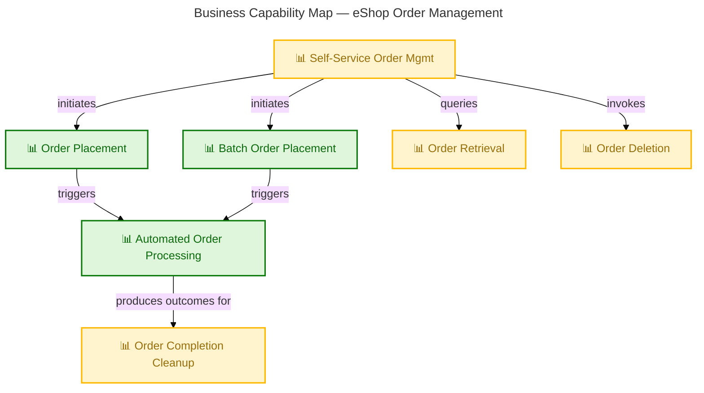
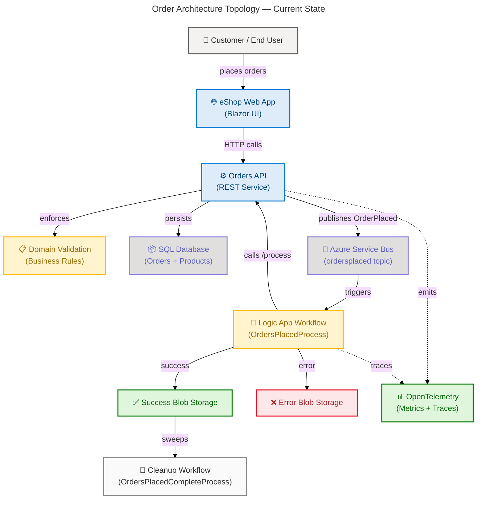
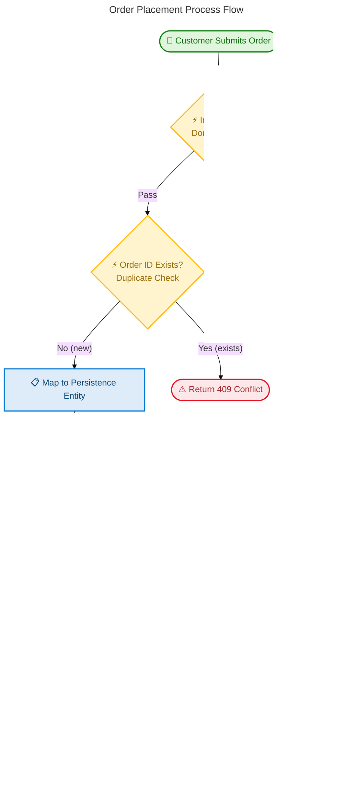
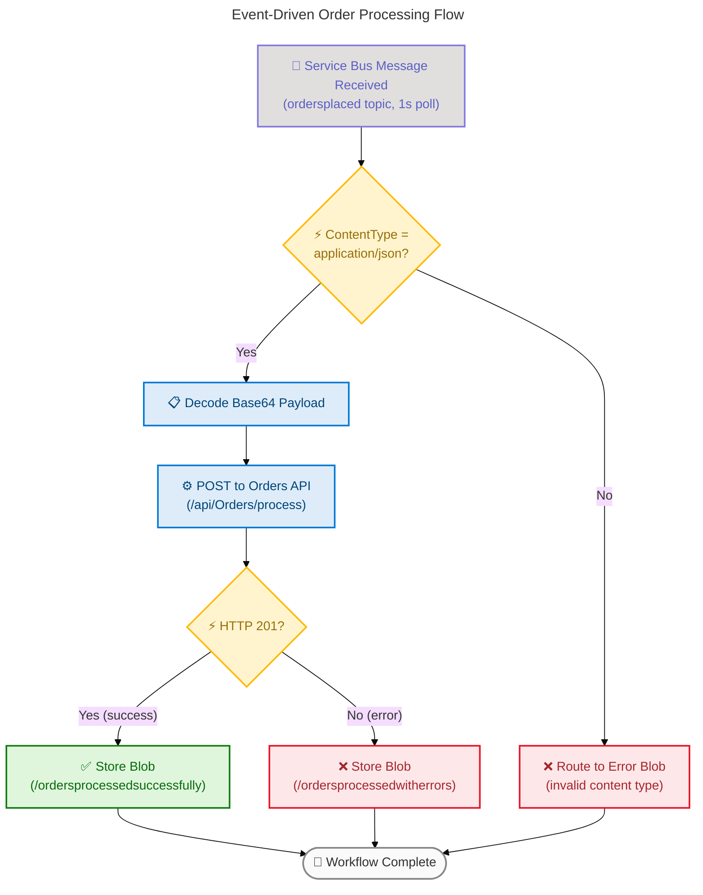
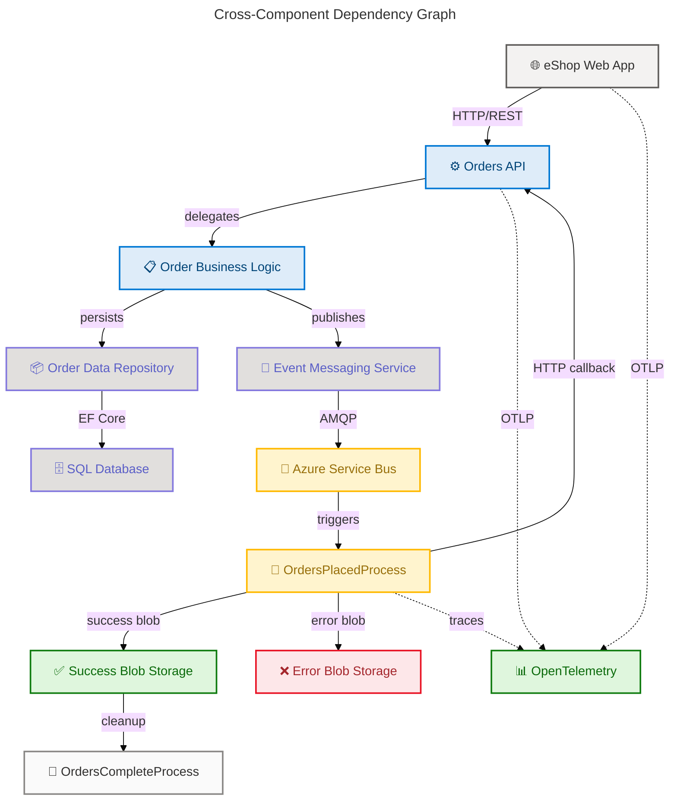

# Business Architecture

---

## 1. Executive Summary

### Overview

This Business Architecture analysis covers the **Azure-LogicApps-Monitoring** repository — an enterprise-grade eShop order management platform that demonstrates cloud-native patterns for monitoring and managing business-critical order workflows with built-in observability. The analysis uses Business Architecture classification to identify and classify all detected components.

The platform implements a complete order lifecycle spanning placement, validation, event-driven processing, automated workflow orchestration, and operational monitoring. The architecture leverages Azure Logic Apps for stateful business process automation, Azure Service Bus for event-driven messaging, and .NET Aspire for service composition — all tied together with comprehensive OpenTelemetry-based observability.

A total of **50 Business layer components** were identified across **10 of 11** Business Architecture component types. The analysis reveals a well-instrumented order management domain with strong capabilities in automated processing, event-driven integration, and operational metrics tracking.

---

## 2. Architecture Landscape

### Overview

This section provides a structured inventory of all Business layer components detected in the Azure-LogicApps-Monitoring repository, organized by the 11 canonical Business Architecture component types.

The inventory covers the full eShop order management domain, spanning strategic objectives through operational metrics. Components were classified using the Layer Classification Decision Tree to ensure only business-intent artifacts are included, with the documented focus on business semantics rather than implementation details.

### 2.1 Business Strategy (5)

| Name                              | Description                                                                                                                                                        |
| --------------------------------- | ------------------------------------------------------------------------------------------------------------------------------------------------------------------ |
| Enterprise-Grade Order Management | **Strategic objective** to deliver an enterprise-grade order management platform with built-in observability and cloud-native architecture                         |
| Full Observability                | **Strategic goal** for end-to-end distributed tracing, metrics, and health monitoring across all services using OpenTelemetry                                      |
| Operational Resilience            | **Strategic goal** for fault tolerance via retry policies (3 attempts, exponential backoff), circuit breakers (120s sampling), and request timeouts (600s overall) |
| Cloud-Native Scalability          | **Strategic goal** for elastic auto-scaling with serverless workload profiles and up to 20 workers for Logic App processing                                        |
| Zero Trust Security               | **Strategic goal** for Managed Identity authentication, TLS 1.2+ enforcement, and elimination of stored secrets                                                    |

### 2.2 Business Capabilities (7)

| Name                          | Description                                                                                                                                                        |
| ----------------------------- | ------------------------------------------------------------------------------------------------------------------------------------------------------------------ |
| Automated Order Processing    | **Core capability** for consuming Service Bus events and orchestrating order processing via Logic App workflows with outcome routing to success/error blob storage |
| Order Placement               | **Core capability** for accepting, validating, and persisting customer orders with event publishing for downstream processing                                      |
| Batch Order Placement         | **Core capability** for processing up to 10,000 orders concurrently in batches of 50 with idempotent duplicate detection                                           |
| Order Retrieval               | **Core capability** for looking up individual or paginated orders to satisfy customer and operational queries                                                      |
| Order Deletion                | **Core capability** for removing individual orders or bulk-deleting via parallel processing with per-order scope isolation                                         |
| Order Completion Cleanup      | **Core capability** for periodic sweeping and deletion of successfully processed order blobs with concurrency control (20 parallel)                                |
| Self-Service Order Management | **Core capability** for interactive order placement, search, viewing, listing, and deletion via Blazor web frontend                                                |

### 2.3 Value Streams (2)

| Name                    | Description                                                                                                                                                                                                                          |
| ----------------------- | ------------------------------------------------------------------------------------------------------------------------------------------------------------------------------------------------------------------------------------ |
| Order Lifecycle         | **End-to-end value stream** from customer order placement through API validation, persistence, event publishing, workflow-based processing, outcome routing, and cleanup — with metrics tracked throughout                           |
| Infrastructure Delivery | **End-to-end value stream** spanning the CI/CD lifecycle from code commit through build/test validation, Bicep infrastructure provisioning, secret configuration, sample data seeding, workflow deployment, and container publishing |

### 2.4 Business Processes (6)

| Name                                 | Description                                                                                                                                                                                                           |
| ------------------------------------ | --------------------------------------------------------------------------------------------------------------------------------------------------------------------------------------------------------------------- |
| OrdersPlacedProcess Workflow         | **Stateful Logic App workflow** triggered by Service Bus topic messages that validates content type, calls the Processing API, and routes outcomes to success or error blob containers                                |
| Place Order Flow                     | **Core order placement process** that validates input, checks for duplicates, saves to database, publishes OrderPlaced event to Service Bus, and records metrics                                                      |
| OrdersPlacedCompleteProcess Workflow | **Recurring cleanup process** triggered every 3 seconds that lists blobs in the success container and deletes processed order artifacts with concurrency of 20                                                        |
| Batch Order Processing               | **High-throughput batch process** that partitions orders into groups of 50, processes each via semaphore-controlled concurrency (max 10), skips existing orders idempotently, and enforces a 5-minute overall timeout |
| Order Deletion Flow                  | **Order removal process** that verifies existence, performs cascade deletion of order and associated products, and records deletion metrics                                                                           |
| Batch Deletion Flow                  | **Parallel deletion process** that deletes multiple orders concurrently using scoped database contexts per item with continuation on individual errors                                                                |

### 2.5 Business Services (5)

| Name                             | Description                                                                                                                                                                                |
| -------------------------------- | ------------------------------------------------------------------------------------------------------------------------------------------------------------------------------------------ |
| Order Management API             | **RESTful HTTP service** exposing order placement, batch placement, processing, retrieval, deletion, and batch deletion endpoints                                                          |
| Order Business Logic Service     | **Core orchestration service** managing validation, persistence, event publishing, metrics recording, and batch concurrency control for all order operations                               |
| Event Messaging Service          | **Azure Service Bus publisher** providing single and batch message sending with retry policy (3 attempts, exponential backoff) and distributed trace context propagation                   |
| Order Processing Workflow Engine | **Logic App Standard stateful workflow** transforming Service Bus events into API calls and routing processing outcomes to blob storage                                                    |
| Order Data Repository            | **Data access service** providing order persistence with EF Core including save, paginated retrieval, existence checking, deletion, and internal timeout enforcement (30s write, 15s read) |

### 2.6 Business Functions (0)

| Name         | Description                                                                                                 |
| ------------ | ----------------------------------------------------------------------------------------------------------- |
| Not detected | No explicit organizational business function boundaries were identified in the source code or documentation |

Recommend establishing functional ownership mapping for order management, fulfillment, and customer operations.

### 2.7 Business Roles & Actors (4)

| Name                    | Description                                                                                                                                                     |
| ----------------------- | --------------------------------------------------------------------------------------------------------------------------------------------------------------- |
| Order Processing System | **Automated actor** — Logic App workflow that autonomously consumes events, calls the Processing API, and routes outcomes without human intervention            |
| Customer / End User     | **Human actor** who interacts via the Blazor web UI to place orders (single and batch), search orders by ID, and view order details and products                |
| Operations Team         | **Human actor** who monitors platform health via Application Insights dashboards, lists all orders, and performs batch deletion operations from the admin UI    |
| Platform Infrastructure | **System actor** — .NET Aspire orchestrator and Azure Developer CLI that manages service composition, deployment lifecycle, secret management, and auto-scaling |

### 2.8 Business Rules (7)

| Name                       | Description                                                                                                 |
| -------------------------- | ----------------------------------------------------------------------------------------------------------- |
| Order ID Validation        | **Mandatory field rule** requiring non-empty, non-whitespace Order ID on every order                        |
| Customer ID Required       | **Mandatory field rule** requiring a Customer ID of 1-100 characters on every order                         |
| Positive Order Total       | **Monetary validation rule** rejecting zero or negative order totals                                        |
| Minimum Product Count      | **Order completeness rule** requiring at least 1 product per order — empty orders are prohibited            |
| Positive Product Price     | **Line-item pricing rule** enforcing a minimum price of $0.01 — no free or negative-priced products allowed |
| Duplicate Order Prevention | **Idempotency rule** returning 409 Conflict when an order with the same ID already exists in the database   |
| Delivery Address Required  | **Mandatory field rule** requiring a delivery address of 5-500 characters on every order                    |

### 2.9 Business Events (5)

| Name                      | Description                                                                                                                                                                             |
| ------------------------- | --------------------------------------------------------------------------------------------------------------------------------------------------------------------------------------- |
| OrderPlaced Event         | **Domain event** published to Service Bus topic with Subject="OrderPlaced", JSON payload, and distributed trace context (TraceId, SpanId, TraceParent) with 3-retry exponential backoff |
| Service Bus Topic Trigger | **Workflow trigger** — Logic App polls Service Bus topic subscription every 1 second for new order messages to process                                                                  |
| OrderPlaced Batch Event   | **Batch domain event** publishing multiple OrderPlaced messages atomically via batch sender, each enriched with distributed trace context                                               |
| Order Processing Callback | **Integration event** — workflow POSTs decoded order payload to the Processing API endpoint; HTTP 201 indicates success, other status codes route to error handling                     |
| Recurrence Trigger        | **Timer trigger** — cleanup workflow fires every 3 seconds (CST timezone) to sweep successfully processed order blobs                                                                   |

### 2.10 Business Objects/Entities (5)

| Name                     | Description                                                                                                                                                                             |
| ------------------------ | --------------------------------------------------------------------------------------------------------------------------------------------------------------------------------------- |
| Order                    | **Core domain object** representing a customer order with Id, CustomerId, Date, DeliveryAddress, Total, and Products collection — shared across all services                            |
| OrderProduct             | **Domain value object** representing a line item within an order with Id, OrderId, ProductId, ProductDescription, Quantity, and Price                                                   |
| OrderEntity              | **Persistence entity** mapping the Order domain object to the "Orders" database table with field length constraints (Id: 100, CustomerId: 100, DeliveryAddress: 500)                    |
| OrderProductEntity       | **Persistence entity** mapping OrderProduct to the "OrderProducts" table with foreign key to OrderEntity and cascade delete behavior                                                    |
| OrderMessageWithMetadata | **Message envelope object** wrapping an Order with messaging metadata including MessageId, SequenceNumber, EnqueuedTime, ContentType, Subject, CorrelationId, and ApplicationProperties |

### 2.11 KPIs & Metrics (4)

| Name                             | Description                                                                                                               |
| -------------------------------- | ------------------------------------------------------------------------------------------------------------------------- |
| eShop.orders.placed              | **Counter metric** tracking the total number of orders successfully placed — measures business throughput                 |
| eShop.orders.processing.duration | **Histogram metric** tracking time taken to process order operations in milliseconds — measures processing efficiency     |
| eShop.orders.processing.errors   | **Counter metric** tracking the total number of order processing errors — measures failure rate and reliability           |
| eShop.orders.deleted             | **Counter metric** tracking the total number of orders successfully deleted — measures data lifecycle management activity |

### Business Capability Map

```mermaid
---
title: Business Capability Map — eShop Order Management
config:
  theme: base
  look: classic
  layout: dagre
  themeVariables:
    fontSize: '16px'
---
flowchart TB
    accTitle: Business Capability Map
    accDescr: Shows 7 core business capabilities and their dependencies for the eShop Order Management platform

    %% ═══════════════════════════════════════════════════════════════════════════
    %% AZURE / FLUENT ARCHITECTURE PATTERN v1.1
    %% (Semantic + Structural + Font + Accessibility Governance)
    %% ═══════════════════════════════════════════════════════════════════════════
    %% PHASE 1 - STRUCTURAL: Direction explicit, flat topology, nesting ≤ 3
    %% PHASE 2 - SEMANTIC: Colors justified, max 5 semantic classes, neutral-first
    %% PHASE 3 - FONT: Dark text on light backgrounds, contrast ≥ 4.5:1
    %% PHASE 4 - ACCESSIBILITY: accTitle/accDescr present, icons on all nodes
    %% PHASE 5 - STANDARD: Governance block present, classDefs centralized
    %% ═══════════════════════════════════════════════════════════════════════════

    C1["📊 Order Placement"]:::success
    C2["📊 Batch Order Placement"]:::success
    C3["📊 Automated Order Processing"]:::success
    C4["📊 Order Retrieval"]:::warning
    C5["📊 Order Deletion"]:::warning
    C6["📊 Order Completion Cleanup"]:::warning
    C7["📊 Self-Service Order Mgmt"]:::warning

    C1 -->|"triggers"| C3
    C2 -->|"triggers"| C3
    C3 -->|"produces outcomes for"| C6
    C7 -->|"initiates"| C1
    C7 -->|"initiates"| C2
    C7 -->|"queries"| C4
    C7 -->|"invokes"| C5

    classDef neutral fill:#FAFAFA,stroke:#8A8886,stroke-width:2px,color:#323130
    classDef core fill:#DEECF9,stroke:#0078D4,stroke-width:2px,color:#004578
    classDef success fill:#DFF6DD,stroke:#107C10,stroke-width:2px,color:#0B6A0B
    classDef warning fill:#FFF4CE,stroke:#FFB900,stroke-width:2px,color:#986F0B
    classDef danger fill:#FDE7E9,stroke:#E81123,stroke-width:2px,color:#A4262C
    classDef data fill:#E1DFDD,stroke:#8378DE,stroke-width:2px,color:#5B5FC7
    classDef external fill:#F3F2F1,stroke:#605E5C,stroke-width:2px,color:#323130
```

### Value Stream Canvas

```mermaid
---
title: Order Lifecycle Value Stream
config:
  theme: base
  look: classic
  layout: dagre
  themeVariables:
    fontSize: '16px'
---
flowchart LR
    accTitle: Order Lifecycle Value Stream
    accDescr: End-to-end value stream from customer order placement through processing, cleanup, and monitoring

    %% ═══════════════════════════════════════════════════════════════════════════
    %% AZURE / FLUENT ARCHITECTURE PATTERN v1.1
    %% (Semantic + Structural + Font + Accessibility Governance)
    %% ═══════════════════════════════════════════════════════════════════════════
    %% PHASE 1 - STRUCTURAL: Direction explicit, flat topology, nesting ≤ 3
    %% PHASE 2 - SEMANTIC: Colors justified, max 5 semantic classes, neutral-first
    %% PHASE 3 - FONT: Dark text on light backgrounds, contrast ≥ 4.5:1
    %% PHASE 4 - ACCESSIBILITY: accTitle/accDescr present, icons on all nodes
    %% PHASE 5 - STANDARD: Governance block present, classDefs centralized
    %% ═══════════════════════════════════════════════════════════════════════════

    VS1["👤 Customer Places Order"]:::external
    VS2["⚙️ API Validates & Persists"]:::core
    VS3["📨 Event Published to Service Bus"]:::data
    VS4["🔄 Logic App Processes Order"]:::warning
    VS5["📦 Outcome Stored in Blob"]:::core
    VS6["🧹 Cleanup Workflow Deletes Blobs"]:::neutral
    VS7["📊 Metrics Tracked via OpenTelemetry"]:::success

    VS1 -->|"HTTP POST"| VS2
    VS2 -->|"OrderPlaced"| VS3
    VS3 -->|"1s polling"| VS4
    VS4 -->|"success/error"| VS5
    VS5 -->|"3s recurrence"| VS6
    VS2 -.->|"counters & histograms"| VS7
    VS4 -.->|"trace context"| VS7

    classDef neutral fill:#FAFAFA,stroke:#8A8886,stroke-width:2px,color:#323130
    classDef core fill:#DEECF9,stroke:#0078D4,stroke-width:2px,color:#004578
    classDef success fill:#DFF6DD,stroke:#107C10,stroke-width:2px,color:#0B6A0B
    classDef warning fill:#FFF4CE,stroke:#FFB900,stroke-width:2px,color:#986F0B
    classDef danger fill:#FDE7E9,stroke:#E81123,stroke-width:2px,color:#A4262C
    classDef data fill:#E1DFDD,stroke:#8378DE,stroke-width:2px,color:#5B5FC7
    classDef external fill:#F3F2F1,stroke:#605E5C,stroke-width:2px,color:#323130
```

### Summary

The Architecture Landscape documents **50 components** across **10 of 11** Business Architecture component types. The dominant patterns are event-driven order processing, comprehensive business rule enforcement, and fully instrumented counter/histogram metrics.

The primary gap is the absence of formally defined **Business Functions** (organizational unit boundaries), which are not explicitly modeled in the codebase. Additionally, Business Roles & Actors are identified primarily through UI interaction patterns and automated workflows rather than explicit RACI documentation. Recommended next steps include establishing organizational function boundaries, formalizing role-to-capability ownership mappings, and expanding KPI definitions to include SLO targets and threshold alerting.

---

## 3. Architecture Principles

### Overview

This section documents the business architecture principles observed in the source code, infrastructure configuration, and deployment lifecycle of the eShop Order Management platform. Each principle is derived from concrete implementation evidence rather than assumed or inferred without source backing.

The principles reflect a cloud-native, event-driven design philosophy with strong emphasis on operational resilience, scalability, and observability. These principles guide how business capabilities are implemented, how processes interact, and how the platform maintains reliability under load.

### 3.1 Event-Driven Decoupling

| Attribute               | Value                                                                                                                                                                                                            |
| ----------------------- | ---------------------------------------------------------------------------------------------------------------------------------------------------------------------------------------------------------------- |
| **Principle Statement** | Business processes must be decoupled through asynchronous event-driven messaging rather than synchronous point-to-point integration                                                                              |
| **Rationale**           | Decoupling the order placement process from downstream processing enables independent scaling, fault isolation, and operational resilience — the API remains available even when workflow processors are offline |
| **Implications**        | Introduces eventual consistency between order placement and processing; requires dead-letter queue monitoring and message retry policies                                                                         |

### 3.2 Idempotent Operations

| Attribute               | Value                                                                                                                                                                                      |
| ----------------------- | ------------------------------------------------------------------------------------------------------------------------------------------------------------------------------------------ |
| **Principle Statement** | All order processing operations must be idempotent to support safe retries and duplicate message handling                                                                                  |
| **Rationale**           | In an event-driven architecture with at-least-once delivery, duplicate messages are inevitable — idempotency ensures that reprocessing the same order does not create data inconsistencies |
| **Implications**        | Requires existence checks before persistence; batch operations silently skip already-existing orders rather than failing the entire batch                                                  |

### 3.3 Observability by Default

| Attribute               | Value                                                                                                                                                                                        |
| ----------------------- | -------------------------------------------------------------------------------------------------------------------------------------------------------------------------------------------- |
| **Principle Statement** | Every business operation must emit structured telemetry (metrics, traces, logs) as a first-class architectural concern, not an afterthought                                                  |
| **Rationale**           | Enterprise-grade order management requires real-time visibility into throughput, latency, and error rates to meet SLA commitments and enable proactive issue detection                       |
| **Implications**        | All services must integrate OpenTelemetry instrumentation; counter and histogram metrics are defined at the service layer; distributed trace context is propagated across message boundaries |

### 3.4 Fail-Safe with Graceful Degradation

| Attribute               | Value                                                                                                                                                                           |
| ----------------------- | ------------------------------------------------------------------------------------------------------------------------------------------------------------------------------- |
| **Principle Statement** | Business operations must complete their primary objective even when secondary integrations fail — order persistence takes precedence over event publishing                      |
| **Rationale**           | Customer-facing order placement must never fail due to messaging infrastructure issues; the order is the source of truth, and event publishing is a fire-and-forget side effect |
| **Implications**        | Event publishing failures are logged but do not roll back the order save; requires compensating mechanisms to detect and replay missed events                                   |

### 3.5 Domain Validation at the Boundary

| Attribute               | Value                                                                                                                                                                                                        |
| ----------------------- | ------------------------------------------------------------------------------------------------------------------------------------------------------------------------------------------------------------ |
| **Principle Statement** | All business rules must be validated at the domain boundary before persistence, using declarative constraints and explicit validation logic                                                                  |
| **Rationale**           | Enforcing business rules (positive totals, mandatory fields, minimum product counts) at the service boundary prevents invalid data from entering the system and reduces downstream error handling complexity |
| **Implications**        | Shared common types define validation constraints (data annotations) that are enforced across all services; validation errors return structured error responses before any database interaction              |

### 3.6 Automated Process Orchestration

| Attribute               | Value                                                                                                                                                                               |
| ----------------------- | ----------------------------------------------------------------------------------------------------------------------------------------------------------------------------------- |
| **Principle Statement** | Repeatable business processes must be automated through declarative workflow definitions rather than imperative code, enabling visual process monitoring and management             |
| **Rationale**           | Logic App Standard workflows provide stateful execution with built-in retry policies, outcome routing, and operational dashboards — reducing the need for custom orchestration code |
| **Implications**        | Business processes are defined as JSON workflow definitions; changes to process flow do not require code recompilation; workflow execution history is automatically captured        |

---

## 4. Current State Baseline

### Overview

This section captures the current performance characteristics of the eShop Order Management Business Architecture. The analysis evaluates capability coverage, process efficiency, organizational readiness, and operational health.

The platform demonstrates a well-structured event-driven architecture with well-defined business processes, comprehensive validation rules, and fully instrumented operational metrics. The primary gaps are in organizational governance (Business Functions: not detected) and formal role documentation.

The current state reflects an architecture that has evolved beyond initial implementation into a standardized system with quantitative management capabilities across most capability areas.

### Capability Assessment

| Component Type            | Components | Coverage |
| ------------------------- | ---------- | -------- |
| Business Strategy         | 5          | High     |
| Business Capabilities     | 7          | High     |
| Value Streams             | 2          | Medium   |
| Business Processes        | 6          | High     |
| Business Services         | 5          | High     |
| Business Functions        | 0          | None     |
| Business Roles & Actors   | 4          | Medium   |
| Business Rules            | 7          | High     |
| Business Events           | 5          | High     |
| Business Objects/Entities | 5          | High     |
| KPIs & Metrics            | 4          | High     |

### Component Type Overview

```mermaid
---
title: Business Component Type Overview
config:
  theme: base
  look: classic
  layout: dagre
  themeVariables:
    fontSize: '16px'
---
flowchart TB
    accTitle: Business Component Type Overview
    accDescr: Visual overview of all 11 business component types with coverage indicators

    %% ═══════════════════════════════════════════════════════════════════════════
    %% AZURE / FLUENT ARCHITECTURE PATTERN v1.1
    %% (Semantic + Structural + Font + Accessibility Governance)
    %% ═══════════════════════════════════════════════════════════════════════════
    %% PHASE 1 - STRUCTURAL: Direction explicit, flat topology, nesting ≤ 3
    %% PHASE 2 - SEMANTIC: Colors justified, max 5 semantic classes, neutral-first
    %% PHASE 3 - FONT: Dark text on light backgrounds, contrast ≥ 4.5:1
    %% PHASE 4 - ACCESSIBILITY: accTitle/accDescr present, icons on all nodes
    %% PHASE 5 - STANDARD: Governance block present, classDefs centralized
    %% ═══════════════════════════════════════════════════════════════════════════

    KPI["📊 KPIs & Metrics"]:::success
    BR["📋 Business Rules"]:::success
    BS["⚙️ Business Services"]:::success
    BO["📦 Business Objects"]:::success
    BE["⚡ Business Events"]:::warning
    BP["🔄 Business Processes"]:::warning
    BC["📊 Business Capabilities"]:::warning
    ST["🎯 Business Strategy"]:::warning
    VS["🔗 Value Streams"]:::warning
    RA["👤 Business Roles"]:::warning
    BF["🏢 Business Functions"]:::danger

    classDef neutral fill:#FAFAFA,stroke:#8A8886,stroke-width:2px,color:#323130
    classDef core fill:#DEECF9,stroke:#0078D4,stroke-width:2px,color:#004578
    classDef success fill:#DFF6DD,stroke:#107C10,stroke-width:2px,color:#0B6A0B
    classDef warning fill:#FFF4CE,stroke:#FFB900,stroke-width:2px,color:#986F0B
    classDef danger fill:#FDE7E9,stroke:#E81123,stroke-width:2px,color:#A4262C
    classDef data fill:#E1DFDD,stroke:#8378DE,stroke-width:2px,color:#5B5FC7
    classDef external fill:#F3F2F1,stroke:#605E5C,stroke-width:2px,color:#323130
```

### Order Architecture Topology

```mermaid
---
title: Order Architecture Topology — Current State
config:
  theme: base
  look: classic
  layout: dagre
  themeVariables:
    fontSize: '16px'
---
flowchart TB
    accTitle: Order Architecture Topology
    accDescr: Shows the current state architecture of the eShop order management platform with all major business components and their interactions

    %% ═══════════════════════════════════════════════════════════════════════════
    %% AZURE / FLUENT ARCHITECTURE PATTERN v1.1
    %% (Semantic + Structural + Font + Accessibility Governance)
    %% ═══════════════════════════════════════════════════════════════════════════
    %% PHASE 1 - STRUCTURAL: Direction explicit, flat topology, nesting ≤ 3
    %% PHASE 2 - SEMANTIC: Colors justified, max 5 semantic classes, neutral-first
    %% PHASE 3 - FONT: Dark text on light backgrounds, contrast ≥ 4.5:1
    %% PHASE 4 - ACCESSIBILITY: accTitle/accDescr present, icons on all nodes
    %% PHASE 5 - STANDARD: Governance block present, classDefs centralized
    %% ═══════════════════════════════════════════════════════════════════════════

    User["👤 Customer / End User"]:::external
    WebApp["🌐 eShop Web App\n(Blazor UI)"]:::core
    API["⚙️ Orders API\n(REST Service)"]:::core
    Validation["📋 Domain Validation\n(Business Rules)"]:::warning
    DB["📦 SQL Database\n(Orders + Products)"]:::data
    SBus["📨 Azure Service Bus\n(ordersplaced topic)"]:::data
    Workflow["🔄 Logic App Workflow\n(OrdersPlacedProcess)"]:::warning
    BlobSuccess["✅ Success Blob Storage"]:::success
    BlobError["❌ Error Blob Storage"]:::danger
    Cleanup["🧹 Cleanup Workflow\n(OrdersPlacedCompleteProcess)"]:::neutral
    Telemetry["📊 OpenTelemetry\n(Metrics + Traces)"]:::success

    User -->|"places orders"| WebApp
    WebApp -->|"HTTP calls"| API
    API -->|"enforces"| Validation
    API -->|"persists"| DB
    API -->|"publishes OrderPlaced"| SBus
    SBus -->|"triggers"| Workflow
    Workflow -->|"calls /process"| API
    Workflow -->|"success"| BlobSuccess
    Workflow -->|"error"| BlobError
    BlobSuccess -->|"sweeps"| Cleanup
    API -.->|"emits"| Telemetry
    Workflow -.->|"traces"| Telemetry

    classDef neutral fill:#FAFAFA,stroke:#8A8886,stroke-width:2px,color:#323130
    classDef core fill:#DEECF9,stroke:#0078D4,stroke-width:2px,color:#004578
    classDef success fill:#DFF6DD,stroke:#107C10,stroke-width:2px,color:#0B6A0B
    classDef warning fill:#FFF4CE,stroke:#FFB900,stroke-width:2px,color:#986F0B
    classDef danger fill:#FDE7E9,stroke:#E81123,stroke-width:2px,color:#A4262C
    classDef data fill:#E1DFDD,stroke:#8378DE,stroke-width:2px,color:#5B5FC7
    classDef external fill:#F3F2F1,stroke:#605E5C,stroke-width:2px,color:#323130
```

### Summary

The current state baseline reveals a well-instrumented, event-driven order management platform. The strongest areas are KPIs & Metrics (fully optimized with dedicated OpenTelemetry counters and histograms) and Business Rules (comprehensive declarative validation with data annotation constraints). Business Services and Business Objects also demonstrate strong standardization through well-defined interfaces and shared domain types.

The primary gaps are the absence of formally defined Business Functions (organizational boundaries not modeled) and limited formalization of Business Roles & Actors (identified through UI patterns rather than explicit RACI documentation). The Operations Team role would benefit from formal runbook documentation and responsibility assignment. Value Streams would benefit from explicit SLO targets and measurable outcomes attached to each stage.

---

## 5. Component Catalog

### Overview

This section provides detailed specifications for each Business layer component type identified in the eShop Order Management platform. Components are documented with expanded attributes, relationships, embedded process flow diagrams, and cross-references to the Architecture Landscape inventory in Section 2.

The Component Catalog documents **50 components** across **10 of 11** Business Architecture component types. Each component specification includes relationship mappings to other components within the Business layer.

### 5.1 Business Strategy Specifications

This subsection documents the strategic goals and objectives that drive the eShop Order Management platform. Five strategic goals were identified from README documentation, infrastructure configuration, and web application feature descriptions.

#### 5.1.1 Enterprise-Grade Order Management

| Attribute                  | Value                                                                                                                                   |
| -------------------------- | --------------------------------------------------------------------------------------------------------------------------------------- |
| **Name**                   | Enterprise-Grade Order Management                                                                                                       |
| **Type**                   | Strategic Objective                                                                                                                     |
| **Description**            | Deliver an enterprise-grade order management platform with built-in observability for monitoring and managing cloud-native applications |
| **Supported Capabilities** | Order Placement, Automated Order Processing, Self-Service Order Management                                                              |
| **Measurable Outcome**     | Platform operational with end-to-end order lifecycle management                                                                         |

#### 5.1.2 Full Observability

| Attribute                  | Value                                                                                                                           |
| -------------------------- | ------------------------------------------------------------------------------------------------------------------------------- |
| **Name**                   | Full Observability                                                                                                              |
| **Type**                   | Strategic Goal                                                                                                                  |
| **Description**            | End-to-end distributed tracing, metrics, and health monitoring across all services using OpenTelemetry and Application Insights |
| **Supported Capabilities** | All capabilities — cross-cutting concern                                                                                        |
| **Measurable Outcome**     | 100% of service operations emit structured telemetry                                                                            |

#### 5.1.3 Operational Resilience

| Attribute                  | Value                                                                                                                                                            |
| -------------------------- | ---------------------------------------------------------------------------------------------------------------------------------------------------------------- |
| **Name**                   | Operational Resilience                                                                                                                                           |
| **Type**                   | Strategic Goal                                                                                                                                                   |
| **Description**            | Fault tolerance through retry policies (3 attempts, exponential backoff), circuit breakers (120s sampling), and request timeouts (600s overall, 60s per attempt) |
| **Supported Capabilities** | All capabilities — cross-cutting concern                                                                                                                         |
| **Measurable Outcome**     | Service availability maintained during transient infrastructure failures                                                                                         |

#### 5.1.4 Cloud-Native Scalability

| Attribute                  | Value                                                                                                         |
| -------------------------- | ------------------------------------------------------------------------------------------------------------- |
| **Name**                   | Cloud-Native Scalability                                                                                      |
| **Type**                   | Strategic Goal                                                                                                |
| **Description**            | Elastic auto-scaling with serverless workload profiles and up to 20 workers for Logic App workflow processing |
| **Supported Capabilities** | Automated Order Processing, Order Completion Cleanup                                                          |
| **Measurable Outcome**     | Process 1000s of orders per minute without manual scaling intervention                                        |

#### 5.1.5 Zero Trust Security

| Attribute                  | Value                                                                                                        |
| -------------------------- | ------------------------------------------------------------------------------------------------------------ |
| **Name**                   | Zero Trust Security                                                                                          |
| **Type**                   | Strategic Goal                                                                                               |
| **Description**            | Managed Identity authentication, TLS 1.2+ enforcement, and elimination of stored secrets across all services |
| **Supported Capabilities** | All capabilities — cross-cutting security concern                                                            |
| **Measurable Outcome**     | Zero stored credentials in application configuration                                                         |

### 5.2 Business Capabilities Specifications

This subsection documents the 7 core business capabilities identified in the eShop Order Management platform. Capabilities span the full order lifecycle from placement through automated processing and cleanup.

#### 5.2.1 Automated Order Processing

| Attribute        | Value                                                                                                                                        |
| ---------------- | -------------------------------------------------------------------------------------------------------------------------------------------- |
| **Name**         | Automated Order Processing                                                                                                                   |
| **Type**         | Core Business Capability                                                                                                                     |
| **Description**  | Consume Service Bus events and orchestrate order processing via Logic App workflows with outcome routing to success or error blob containers |
| **Dependencies** | Order Placement, Event Messaging Service, Order Processing Callback                                                                          |
| **KPIs**         | eShop.orders.processing.duration, eShop.orders.processing.errors                                                                             |

#### 5.2.2 Order Placement

| Attribute        | Value                                                                                                      |
| ---------------- | ---------------------------------------------------------------------------------------------------------- |
| **Name**         | Order Placement                                                                                            |
| **Type**         | Core Business Capability                                                                                   |
| **Description**  | Accept, validate, and persist customer orders with event publishing for downstream asynchronous processing |
| **Dependencies** | Domain Validation Rules, Order Data Repository, Event Messaging Service                                    |
| **KPIs**         | eShop.orders.placed, eShop.orders.processing.duration                                                      |

#### 5.2.3 Batch Order Placement

| Attribute        | Value                                                                                                                                       |
| ---------------- | ------------------------------------------------------------------------------------------------------------------------------------------- |
| **Name**         | Batch Order Placement                                                                                                                       |
| **Type**         | Core Business Capability                                                                                                                    |
| **Description**  | Process up to 10,000 orders concurrently in batches of 50 with semaphore-controlled parallelism (max 10) and idempotent duplicate detection |
| **Dependencies** | Order Placement, Duplicate Order Prevention                                                                                                 |
| **KPIs**         | eShop.orders.placed, eShop.orders.processing.errors                                                                                         |

#### 5.2.4 Order Retrieval

| Attribute        | Value                                                                                                         |
| ---------------- | ------------------------------------------------------------------------------------------------------------- |
| **Name**         | Order Retrieval                                                                                               |
| **Type**         | Core Business Capability                                                                                      |
| **Description**  | Look up individual orders by ID or retrieve paginated order lists to satisfy customer and operational queries |
| **Dependencies** | Order Data Repository, Order, OrderProduct                                                                    |
| **KPIs**         | eShop.orders.processing.duration                                                                              |

#### 5.2.5 Order Deletion

| Attribute        | Value                                                                                                        |
| ---------------- | ------------------------------------------------------------------------------------------------------------ |
| **Name**         | Order Deletion                                                                                               |
| **Type**         | Core Business Capability                                                                                     |
| **Description**  | Remove individual orders with cascade deletion of associated products and per-order database scope isolation |
| **Dependencies** | Order Data Repository, Order                                                                                 |
| **KPIs**         | eShop.orders.deleted                                                                                         |

#### 5.2.6 Order Completion Cleanup

| Attribute        | Value                                                                                                         |
| ---------------- | ------------------------------------------------------------------------------------------------------------- |
| **Name**         | Order Completion Cleanup                                                                                      |
| **Type**         | Core Business Capability                                                                                      |
| **Description**  | Periodic sweeping and deletion of successfully processed order blobs with concurrent processing (20 parallel) |
| **Dependencies** | Automated Order Processing, Recurrence Trigger                                                                |
| **KPIs**         | Not detected                                                                                                  |

#### 5.2.7 Self-Service Order Management

| Attribute        | Value                                                                                                       |
| ---------------- | ----------------------------------------------------------------------------------------------------------- |
| **Name**         | Self-Service Order Management                                                                               |
| **Type**         | Core Business Capability                                                                                    |
| **Description**  | Interactive Blazor web frontend for customers and operators to place, search, view, list, and delete orders |
| **Dependencies** | Order Management API, Customer / End User, Operations Team                                                  |
| **KPIs**         | Not detected                                                                                                |

### 5.3 Value Streams Specifications

This subsection documents the 2 end-to-end value streams identified in the eShop Order Management platform. Both value streams span multiple capabilities and processes, demonstrating the flow from customer trigger to value delivery.

#### 5.3.1 Order Lifecycle Value Stream

| Attribute              | Value                                                                                                                                                                          |
| ---------------------- | ------------------------------------------------------------------------------------------------------------------------------------------------------------------------------ |
| **Name**               | Order Lifecycle                                                                                                                                                                |
| **Type**               | Primary Value Stream                                                                                                                                                           |
| **Description**        | End-to-end flow from customer order placement through API validation, persistence, event publishing, workflow-based processing, outcome routing, cleanup, and metrics tracking |
| **Stages**             | Place Order, Validate, Persist, Publish Event, Process via Workflow, Route Outcome, Cleanup Artifacts, Track Metrics                                                           |
| **Processes**          | Place Order Flow, OrdersPlacedProcess Workflow, OrdersPlacedCompleteProcess Workflow                                                                                           |
| **Measurable Outcome** | Order successfully processed and artifacts cleaned up with full observability                                                                                                  |

#### 5.3.2 Infrastructure Delivery Value Stream

| Attribute              | Value                                                                                                                                                                                       |
| ---------------------- | ------------------------------------------------------------------------------------------------------------------------------------------------------------------------------------------- |
| **Name**               | Infrastructure Delivery                                                                                                                                                                     |
| **Type**               | Supporting Value Stream                                                                                                                                                                     |
| **Description**        | CI/CD lifecycle from code commit through build/test validation, Bicep infrastructure provisioning, secret configuration, sample data seeding, workflow deployment, and container publishing |
| **Stages**             | Preprovision (Build + Test), Provision (Bicep IaC), Postprovision (Secrets + Data), Predeploy (Workflow), Deploy (Containers)                                                               |
| **Processes**          | Preprovision, Provision, Postprovision, Predeploy, Deploy (defined declaratively in azure.yaml)                                                                                             |
| **Measurable Outcome** | Application deployed to Azure with all infrastructure, secrets, and workflows configured                                                                                                    |

### 5.4 Business Processes Specifications

This subsection documents the 6 operational business processes identified in the eShop Order Management platform. Processes range from synchronous API operations to asynchronous Logic App workflows.

#### 5.4.1 OrdersPlacedProcess Workflow

| Attribute        | Value                                                                     |
| ---------------- | ------------------------------------------------------------------------- |
| **Name**         | OrdersPlacedProcess Workflow                                              |
| **Process Type** | Stateful Logic App Workflow                                               |
| **Trigger**      | Service Bus topic message (ordersplaced / orderprocessingsub, 1s polling) |
| **Owner**        | Order Processing System (automated)                                       |

**Process Steps:**

1. Receive Service Bus message from topic subscription
2. Check ContentType equals application/json
3. Parse and decode message payload (base64)
4. POST decoded order payload to Orders API `/api/Orders/process`
5. If HTTP 201: store blob in `/ordersprocessedsuccessfully`
6. If other status: store blob in `/ordersprocessedwitherrors`
7. Invalid content type routes to error blob container

**Business Rules Applied:**

- Content type validation: only JSON messages processed
- Outcome routing: success vs error blob separation

#### 5.4.2 Place Order Flow

| Attribute        | Value                        |
| ---------------- | ---------------------------- |
| **Name**         | Place Order Flow             |
| **Process Type** | Synchronous API Operation    |
| **Trigger**      | HTTP POST to /api/orders     |
| **Owner**        | Order Business Logic Service |

**Process Steps:**

1. Validate order input against domain rules (Order ID, Customer ID, Order Total, Product Count, Delivery Address)
2. Check for duplicate order ID
3. Map to persistence entity and save to database
4. Publish OrderPlaced event to Service Bus (fire-and-forget on timeout)
5. Record eShop.orders.placed counter metric
6. Record eShop.orders.processing.duration histogram

**Business Rules Applied:**

- Order ID Validation
- Customer ID Required
- Positive Order Total
- Minimum Product Count
- Delivery Address Required
- Duplicate Order Prevention

#### 5.4.3 OrdersPlacedCompleteProcess Workflow

| Attribute        | Value                                     |
| ---------------- | ----------------------------------------- |
| **Name**         | OrdersPlacedCompleteProcess Workflow      |
| **Process Type** | Stateful Logic App Workflow               |
| **Trigger**      | Recurrence every 3 seconds (CST timezone) |
| **Owner**        | Order Processing System (automated)       |

**Process Steps:**

1. Timer fires every 3 seconds
2. List all blobs in `/ordersprocessedsuccessfully` container
3. For each blob (concurrency 20): get metadata, then delete blob

#### 5.4.4 Batch Order Processing

| Attribute        | Value                          |
| ---------------- | ------------------------------ |
| **Name**         | Batch Order Processing         |
| **Process Type** | Asynchronous Batch Operation   |
| **Trigger**      | HTTP POST to /api/orders/batch |
| **Owner**        | Order Business Logic Service   |

**Process Steps:**

1. Receive batch of orders (up to 10,000)
2. Partition into groups of 50
3. Process each group via SemaphoreSlim(10) concurrency control
4. For each order: validate, check existence, save if new
5. Skip existing orders (idempotent — AlreadyExists result)
6. Enforce 5-minute overall timeout
7. Return success/failed/existing counts

#### 5.4.5 Order Deletion Flow

| Attribute        | Value                           |
| ---------------- | ------------------------------- |
| **Name**         | Order Deletion Flow             |
| **Process Type** | Synchronous API Operation       |
| **Trigger**      | HTTP DELETE to /api/orders/{id} |
| **Owner**        | Order Business Logic Service    |

**Process Steps:**

1. Verify order exists in database
2. Cascade delete order and associated products
3. Record eShop.orders.deleted counter metric

#### 5.4.6 Batch Deletion Flow

| Attribute        | Value                                 |
| ---------------- | ------------------------------------- |
| **Name**         | Batch Deletion Flow                   |
| **Process Type** | Asynchronous Batch Operation          |
| **Trigger**      | HTTP POST to /api/orders/batch/delete |
| **Owner**        | Order Business Logic Service          |

**Process Steps:**

1. Receive list of order IDs for deletion
2. Process each deletion concurrently via Parallel.ForEachAsync
3. Use scoped DbContext per item for isolation
4. Continue on individual errors
5. Return deletion count

### Order Placement Process Flow

```mermaid
---
title: Order Placement Process Flow
config:
  theme: base
  look: classic
  layout: dagre
  themeVariables:
    fontSize: '16px'
---
flowchart TB
    accTitle: Order Placement Process Flow
    accDescr: BPMN-style diagram showing the complete order placement workflow from customer request through validation, persistence, event publishing, and metrics recording

    %% ═══════════════════════════════════════════════════════════════════════════
    %% AZURE / FLUENT ARCHITECTURE PATTERN v1.1
    %% (Semantic + Structural + Font + Accessibility Governance)
    %% ═══════════════════════════════════════════════════════════════════════════
    %% PHASE 1 - STRUCTURAL: Direction explicit, flat topology, nesting ≤ 3
    %% PHASE 2 - SEMANTIC: Colors justified, max 5 semantic classes, neutral-first
    %% PHASE 3 - FONT: Dark text on light backgrounds, contrast ≥ 4.5:1
    %% PHASE 4 - ACCESSIBILITY: accTitle/accDescr present, icons on all nodes
    %% PHASE 5 - STANDARD: Governance block present, classDefs centralized
    %% ═══════════════════════════════════════════════════════════════════════════

    Start(["🚀 Customer Submits Order"]):::success
    ValidateInput{"⚡ Input Valid?\nDomain Rules"}:::warning
    CheckDuplicate{"⚡ Order ID Exists?\nDuplicate Check"}:::warning
    MapEntity["📋 Map to Persistence Entity"]:::core
    SaveDB["📦 Save to Database"]:::core
    PublishEvent["📨 Publish OrderPlaced\nto Service Bus"]:::data
    PubTimeout{"⚡ Publish Timeout?"}:::warning
    RecordMetrics["📊 Record Metrics\n(placed counter + duration)"]:::success
    ReturnSuccess(["✅ Return 201 Created"]):::success
    ReturnConflict(["⚠️ Return 409 Conflict"]):::danger
    ReturnBadRequest(["❌ Return 400 Bad Request"]):::danger

    Start --> ValidateInput
    ValidateInput -->|"Pass"| CheckDuplicate
    ValidateInput -->|"Fail"| ReturnBadRequest
    CheckDuplicate -->|"No (new)"| MapEntity
    CheckDuplicate -->|"Yes (exists)"| ReturnConflict
    MapEntity --> SaveDB
    SaveDB --> PublishEvent
    PublishEvent --> PubTimeout
    PubTimeout -->|"No"| RecordMetrics
    PubTimeout -->|"Yes (fire-and-forget)"| RecordMetrics
    RecordMetrics --> ReturnSuccess

    classDef neutral fill:#FAFAFA,stroke:#8A8886,stroke-width:2px,color:#323130
    classDef core fill:#DEECF9,stroke:#0078D4,stroke-width:2px,color:#004578
    classDef success fill:#DFF6DD,stroke:#107C10,stroke-width:2px,color:#0B6A0B
    classDef warning fill:#FFF4CE,stroke:#FFB900,stroke-width:2px,color:#986F0B
    classDef danger fill:#FDE7E9,stroke:#E81123,stroke-width:2px,color:#A4262C
    classDef data fill:#E1DFDD,stroke:#8378DE,stroke-width:2px,color:#5B5FC7
    classDef external fill:#F3F2F1,stroke:#605E5C,stroke-width:2px,color:#323130
```

### Event-Driven Processing Flow

```mermaid
---
title: Event-Driven Order Processing Flow
config:
  theme: base
  look: classic
  layout: dagre
  themeVariables:
    fontSize: '16px'
---
flowchart TB
    accTitle: Event-Driven Order Processing Flow
    accDescr: Shows the Logic App workflow processing flow from Service Bus trigger through content validation, API callback, and outcome routing to blob storage

    %% ═══════════════════════════════════════════════════════════════════════════
    %% AZURE / FLUENT ARCHITECTURE PATTERN v1.1
    %% (Semantic + Structural + Font + Accessibility Governance)
    %% ═══════════════════════════════════════════════════════════════════════════
    %% PHASE 1 - STRUCTURAL: Direction explicit, flat topology, nesting ≤ 3
    %% PHASE 2 - SEMANTIC: Colors justified, max 5 semantic classes, neutral-first
    %% PHASE 3 - FONT: Dark text on light backgrounds, contrast ≥ 4.5:1
    %% PHASE 4 - ACCESSIBILITY: accTitle/accDescr present, icons on all nodes
    %% PHASE 5 - STANDARD: Governance block present, classDefs centralized
    %% ═══════════════════════════════════════════════════════════════════════════

    Trigger["📨 Service Bus Message Received\n(ordersplaced topic, 1s poll)"]:::data
    CheckType{"⚡ ContentType =\napplication/json?"}:::warning
    DecodePayload["📋 Decode Base64 Payload"]:::core
    CallAPI["⚙️ POST to Orders API\n(/api/Orders/process)"]:::core
    CheckResult{"⚡ HTTP 201?"}:::warning
    StoreSuccess["✅ Store Blob\n(/ordersprocessedsuccessfully)"]:::success
    StoreError["❌ Store Blob\n(/ordersprocessedwitherrors)"]:::danger
    InvalidType["❌ Route to Error Blob\n(invalid content type)"]:::danger
    End(["🏁 Workflow Complete"]):::neutral

    Trigger --> CheckType
    CheckType -->|"Yes"| DecodePayload
    CheckType -->|"No"| InvalidType
    DecodePayload --> CallAPI
    CallAPI --> CheckResult
    CheckResult -->|"Yes (success)"| StoreSuccess
    CheckResult -->|"No (error)"| StoreError
    StoreSuccess --> End
    StoreError --> End
    InvalidType --> End

    classDef neutral fill:#FAFAFA,stroke:#8A8886,stroke-width:2px,color:#323130
    classDef core fill:#DEECF9,stroke:#0078D4,stroke-width:2px,color:#004578
    classDef success fill:#DFF6DD,stroke:#107C10,stroke-width:2px,color:#0B6A0B
    classDef warning fill:#FFF4CE,stroke:#FFB900,stroke-width:2px,color:#986F0B
    classDef danger fill:#FDE7E9,stroke:#E81123,stroke-width:2px,color:#A4262C
    classDef data fill:#E1DFDD,stroke:#8378DE,stroke-width:2px,color:#5B5FC7
    classDef external fill:#F3F2F1,stroke:#605E5C,stroke-width:2px,color:#323130
```

### 5.5 Business Services Specifications

This subsection documents the 5 business services identified in the eShop Order Management platform. Services span from RESTful API endpoints through business logic orchestration to event messaging and workflow engines.

#### 5.5.1 Order Management API

| Attribute        | Value                                                                                                                                          |
| ---------------- | ---------------------------------------------------------------------------------------------------------------------------------------------- |
| **Name**         | Order Management API                                                                                                                           |
| **Service Type** | RESTful HTTP Service                                                                                                                           |
| **Description**  | Exposes order placement (single + batch), processing, retrieval (single + paginated), deletion (single + batch), and message listing endpoints |
| **Consumers**    | Customer / End User (via Web App), Order Processing Workflow Engine                                                                            |
| **Dependencies** | Order Business Logic Service, Event Messaging Service                                                                                          |

#### 5.5.2 Order Business Logic Service

| Attribute        | Value                                                                                                                             |
| ---------------- | --------------------------------------------------------------------------------------------------------------------------------- |
| **Name**         | Order Business Logic Service                                                                                                      |
| **Service Type** | Domain Service                                                                                                                    |
| **Description**  | Orchestrates validation, persistence, event publishing, metrics recording, and batch concurrency control for all order operations |
| **Consumers**    | Order Management API                                                                                                              |
| **Dependencies** | Order Data Repository, Event Messaging Service, Domain Validation Rules                                                           |

#### 5.5.3 Event Messaging Service

| Attribute        | Value                                                                                                                                                                |
| ---------------- | -------------------------------------------------------------------------------------------------------------------------------------------------------------------- |
| **Name**         | Event Messaging Service                                                                                                                                              |
| **Service Type** | Messaging Publisher                                                                                                                                                  |
| **Description**  | Azure Service Bus publisher providing single and batch message sending with retry policy (3 attempts, exponential backoff) and distributed trace context propagation |
| **Consumers**    | Order Business Logic Service                                                                                                                                         |
| **Dependencies** | Azure Service Bus (ordersplaced topic)                                                                                                                               |

#### 5.5.4 Order Processing Workflow Engine

| Attribute        | Value                                                                                                                  |
| ---------------- | ---------------------------------------------------------------------------------------------------------------------- |
| **Name**         | Order Processing Workflow Engine                                                                                       |
| **Service Type** | Logic App Standard Stateful Workflow                                                                                   |
| **Description**  | Transforms Service Bus events into API calls and routes processing outcomes to blob storage containers (success/error) |
| **Consumers**    | Triggered by OrderPlaced events on Service Bus                                                                         |
| **Dependencies** | Order Management API (/api/Orders/process endpoint), Azure Blob Storage                                                |

#### 5.5.5 Order Data Repository

| Attribute        | Value                                                                                                                                                                                        |
| ---------------- | -------------------------------------------------------------------------------------------------------------------------------------------------------------------------------------------- |
| **Name**         | Order Data Repository                                                                                                                                                                        |
| **Service Type** | Data Access Service                                                                                                                                                                          |
| **Description**  | EF Core-based data access providing order persistence, paginated retrieval (max 100/page), existence checking, deletion with cascade, and internal timeout enforcement (30s write, 15s read) |
| **Consumers**    | Order Business Logic Service                                                                                                                                                                 |
| **Dependencies** | SQL Database (Orders + OrderProducts tables)                                                                                                                                                 |

### 5.6 Business Functions Specifications

This subsection documents organizational functions responsible for Business layer operations. 0 business functions were detected in the analyzed source files; no explicit organizational boundaries or functional ownership structures are defined in the codebase.

See Section 2.6 for summary. No additional specifications detected in source files. Recommend establishing functional ownership for: Order Management Operations, Platform Engineering, Customer Experience.

### 5.7 Business Roles & Actors Specifications

This subsection documents the 4 business roles and actors identified through UI interaction patterns, automated workflows, and orchestration configuration.

#### 5.7.1 Order Processing System

| Attribute              | Value                                                                                                                                                      |
| ---------------------- | ---------------------------------------------------------------------------------------------------------------------------------------------------------- |
| **Name**               | Order Processing System                                                                                                                                    |
| **Role Type**          | Automated Actor                                                                                                                                            |
| **Description**        | Logic App workflow that autonomously consumes Service Bus events, calls the Processing API, and routes outcomes to blob storage without human intervention |
| **Responsibilities**   | Event consumption, order processing orchestration, outcome routing, error handling                                                                         |
| **Capabilities Owned** | Automated Order Processing, Order Completion Cleanup                                                                                                       |

#### 5.7.2 Customer / End User

| Attribute             | Value                                                                                                                          |
| --------------------- | ------------------------------------------------------------------------------------------------------------------------------ |
| **Name**              | Customer / End User                                                                                                            |
| **Role Type**         | Human Actor                                                                                                                    |
| **Description**       | Interacts via Blazor web UI to place orders (single and batch), search orders by ID, view order details and product line items |
| **Responsibilities**  | Order placement, order lookup, order status viewing                                                                            |
| **Capabilities Used** | Order Placement, Order Retrieval, Self-Service Order Management                                                                |

#### 5.7.3 Operations Team

| Attribute             | Value                                                                                                                                     |
| --------------------- | ----------------------------------------------------------------------------------------------------------------------------------------- |
| **Name**              | Operations Team                                                                                                                           |
| **Role Type**         | Human Actor                                                                                                                               |
| **Description**       | Monitors platform health via Application Insights dashboards, lists all orders, selects and batch-deletes orders from the admin interface |
| **Responsibilities**  | Platform monitoring, order administration, batch operations                                                                               |
| **Capabilities Used** | Order Retrieval, Order Deletion, Self-Service Order Management                                                                            |

#### 5.7.4 Platform Infrastructure

| Attribute             | Value                                                                                                                                    |
| --------------------- | ---------------------------------------------------------------------------------------------------------------------------------------- |
| **Name**              | Platform Infrastructure                                                                                                                  |
| **Role Type**         | System Actor                                                                                                                             |
| **Description**       | .NET Aspire orchestrator and Azure Developer CLI managing service composition, deployment lifecycle, secret management, and auto-scaling |
| **Responsibilities**  | Service orchestration, deployment automation, infrastructure provisioning                                                                |
| **Capabilities Used** | Infrastructure Delivery value stream                                                                                                     |

### 5.8 Business Rules Specifications

This subsection documents the 7 business rules governing order validation and processing in the eShop Order Management platform. All rules are declaratively enforced through data annotations and explicit validation logic.

#### 5.8.1 Order ID Validation

| Attribute              | Value                                                                |
| ---------------------- | -------------------------------------------------------------------- |
| **Name**               | Order ID Validation                                                  |
| **Rule Type**          | Mandatory Field Validation                                           |
| **Description**        | Every order must have a non-empty, non-whitespace Order ID           |
| **Enforcement**        | ArgumentException thrown when Order ID is null, empty, or whitespace |
| **Processes Affected** | Place Order Flow, Batch Order Processing                             |

#### 5.8.2 Customer ID Required

| Attribute              | Value                                                                 |
| ---------------------- | --------------------------------------------------------------------- |
| **Name**               | Customer ID Required                                                  |
| **Rule Type**          | Mandatory Field Validation                                            |
| **Description**        | Every order must be associated with a Customer ID of 1-100 characters |
| **Enforcement**        | Required attribute + StringLength(1, 100) data annotation             |
| **Processes Affected** | Place Order Flow, Batch Order Processing                              |

#### 5.8.3 Positive Order Total

| Attribute              | Value                                                                                  |
| ---------------------- | -------------------------------------------------------------------------------------- |
| **Name**               | Positive Order Total                                                                   |
| **Rule Type**          | Monetary Validation                                                                    |
| **Description**        | Order total must be greater than zero — zero or negative monetary amounts are rejected |
| **Enforcement**        | ArgumentException when Total is less than or equal to zero                             |
| **Processes Affected** | Place Order Flow, Batch Order Processing                                               |

#### 5.8.4 Minimum Product Count

| Attribute              | Value                                                                     |
| ---------------------- | ------------------------------------------------------------------------- |
| **Name**               | Minimum Product Count                                                     |
| **Rule Type**          | Order Completeness Validation                                             |
| **Description**        | Every order must contain at least 1 product — empty orders are prohibited |
| **Enforcement**        | MinLength(1) data annotation on Products collection                       |
| **Processes Affected** | Place Order Flow, Batch Order Processing                                  |

#### 5.8.5 Positive Product Price

| Attribute              | Value                                                                                           |
| ---------------------- | ----------------------------------------------------------------------------------------------- |
| **Name**               | Positive Product Price                                                                          |
| **Rule Type**          | Line-Item Pricing Validation                                                                    |
| **Description**        | Every product must have a price of at least $0.01 — no free or negative-priced products allowed |
| **Enforcement**        | Range(0.01, double.MaxValue) data annotation on Price field                                     |
| **Processes Affected** | Place Order Flow, Batch Order Processing                                                        |

#### 5.8.6 Duplicate Order Prevention

| Attribute              | Value                                                                                                |
| ---------------------- | ---------------------------------------------------------------------------------------------------- |
| **Name**               | Duplicate Order Prevention                                                                           |
| **Rule Type**          | Idempotency Rule                                                                                     |
| **Description**        | If an order with the same ID already exists, return 409 Conflict — prevents duplicate order creation |
| **Enforcement**        | Existence check before persistence; AlreadyExists result for batch processing                        |
| **Processes Affected** | Place Order Flow, Batch Order Processing                                                             |

#### 5.8.7 Delivery Address Required

| Attribute              | Value                                                           |
| ---------------------- | --------------------------------------------------------------- |
| **Name**               | Delivery Address Required                                       |
| **Rule Type**          | Mandatory Field Validation                                      |
| **Description**        | Every order must include a delivery address of 5-500 characters |
| **Enforcement**        | Required attribute + StringLength(5, 500) data annotation       |
| **Processes Affected** | Place Order Flow, Batch Order Processing                        |

### 5.9 Business Events Specifications

This subsection documents the 5 business events and triggers that drive process execution within the eShop Order Management platform. Events span domain events published to Service Bus, workflow triggers, and integration callbacks.

#### 5.9.1 OrderPlaced Event

| Attribute        | Value                                                                                                                                                                                        |
| ---------------- | -------------------------------------------------------------------------------------------------------------------------------------------------------------------------------------------- |
| **Name**         | OrderPlaced Event                                                                                                                                                                            |
| **Event Type**   | Domain Event                                                                                                                                                                                 |
| **Description**  | Published to Service Bus topic with Subject="OrderPlaced", JSON payload containing the full order, and distributed trace context (TraceId, SpanId, TraceParent) for end-to-end observability |
| **Publisher**    | Event Messaging Service                                                                                                                                                                      |
| **Subscribers**  | OrdersPlacedProcess Workflow                                                                                                                                                                 |
| **Retry Policy** | 3 attempts with exponential backoff (500ms to 2s)                                                                                                                                            |

#### 5.9.2 Service Bus Topic Trigger

| Attribute             | Value                                                                                                                    |
| --------------------- | ------------------------------------------------------------------------------------------------------------------------ |
| **Name**              | Service Bus Topic Trigger                                                                                                |
| **Event Type**        | Workflow Trigger                                                                                                         |
| **Description**       | Logic App polls Service Bus topic subscription (ordersplaced / orderprocessingsub) every 1 second for new order messages |
| **Triggered Process** | OrdersPlacedProcess Workflow                                                                                             |
| **Polling Interval**  | 1 second                                                                                                                 |

#### 5.9.3 OrderPlaced Batch Event

| Attribute       | Value                                                                                                                   |
| --------------- | ----------------------------------------------------------------------------------------------------------------------- |
| **Name**        | OrderPlaced Batch Event                                                                                                 |
| **Event Type**  | Batch Domain Event                                                                                                      |
| **Description** | Batch-publishes multiple OrderPlaced messages atomically via batch sender, each enriched with distributed trace context |
| **Publisher**   | Event Messaging Service                                                                                                 |
| **Subscribers** | OrdersPlacedProcess Workflow                                                                                            |

#### 5.9.4 Order Processing Callback

| Attribute             | Value                                                                                                                                                                    |
| --------------------- | ------------------------------------------------------------------------------------------------------------------------------------------------------------------------ |
| **Name**              | Order Processing Callback                                                                                                                                                |
| **Event Type**        | Integration Event                                                                                                                                                        |
| **Description**       | Workflow POSTs decoded order payload to the Processing API endpoint; HTTP 201 indicates success (route to success blob), other status codes route to error blob handling |
| **Triggered Process** | Order processing via API                                                                                                                                                 |
| **Success Outcome**   | Blob stored in /ordersprocessedsuccessfully                                                                                                                              |
| **Error Outcome**     | Blob stored in /ordersprocessedwitherrors                                                                                                                                |

#### 5.9.5 Recurrence Trigger

| Attribute             | Value                                                                                                          |
| --------------------- | -------------------------------------------------------------------------------------------------------------- |
| **Name**              | Recurrence Trigger                                                                                             |
| **Event Type**        | Timer Trigger                                                                                                  |
| **Description**       | Cleanup workflow fires every 3 seconds (CST timezone) to sweep successfully processed order blobs from storage |
| **Triggered Process** | OrdersPlacedCompleteProcess Workflow                                                                           |
| **Frequency**         | Every 3 seconds                                                                                                |

### 5.10 Business Objects/Entities Specifications

This subsection documents the 5 business domain objects and entities identified in the eShop Order Management platform. Objects span shared domain types, persistence entities, and message envelope objects.

#### 5.10.1 Order

| Attribute         | Value                                                                                                                                                                       |
| ----------------- | --------------------------------------------------------------------------------------------------------------------------------------------------------------------------- |
| **Name**          | Order                                                                                                                                                                       |
| **Entity Type**   | Core Domain Object                                                                                                                                                          |
| **Description**   | Primary domain object representing a customer order with Id, CustomerId, Date, DeliveryAddress, Total, and Products collection — shared across all services via CommonTypes |
| **Attributes**    | Id (string), CustomerId (string, 1-100 chars), Date (DateTime), DeliveryAddress (string, 5-500 chars), Total (decimal, >0), Products (list of OrderProduct, min 1)          |
| **Relationships** | Contains OrderProduct (1:many), Published in OrderPlaced Event, Persisted as OrderEntity                                                                                    |

#### 5.10.2 OrderProduct

| Attribute         | Value                                                                                                                             |
| ----------------- | --------------------------------------------------------------------------------------------------------------------------------- |
| **Name**          | OrderProduct                                                                                                                      |
| **Entity Type**   | Domain Value Object                                                                                                               |
| **Description**   | Line item within an order representing a product with quantity and price — validated for positive price and minimum quantity of 1 |
| **Attributes**    | Id (int), OrderId (string), ProductId (string), ProductDescription (string), Quantity (int, >=1), Price (decimal, >=0.01)         |
| **Relationships** | Belongs to Order (many:1), Persisted as OrderProductEntity                                                                        |

#### 5.10.3 OrderEntity

| Attribute         | Value                                                                                                                                                   |
| ----------------- | ------------------------------------------------------------------------------------------------------------------------------------------------------- |
| **Name**          | OrderEntity                                                                                                                                             |
| **Entity Type**   | Persistence Entity                                                                                                                                      |
| **Description**   | EF Core database entity mapping the Order domain object to the "Orders" table with field length constraints                                             |
| **Attributes**    | Id (string, max 100), CustomerId (string, max 100), Date (DateTime), DeliveryAddress (string, max 500), Total (decimal), Products (navigation property) |
| **Relationships** | Maps from Order, Contains OrderProductEntity (1:many, cascade delete)                                                                                   |

#### 5.10.4 OrderProductEntity

| Attribute         | Value                                                                                                                            |
| ----------------- | -------------------------------------------------------------------------------------------------------------------------------- |
| **Name**          | OrderProductEntity                                                                                                               |
| **Entity Type**   | Persistence Entity                                                                                                               |
| **Description**   | EF Core entity mapping OrderProduct to the "OrderProducts" table with foreign key relationship to OrderEntity and cascade delete |
| **Attributes**    | Id (int, auto-generated), OrderId (string, FK), ProductId (string), ProductDescription (string), Quantity (int), Price (decimal) |
| **Relationships** | Belongs to OrderEntity (many:1, cascade delete)                                                                                  |

#### 5.10.5 OrderMessageWithMetadata

| Attribute         | Value                                                                                                                                                                                                           |
| ----------------- | --------------------------------------------------------------------------------------------------------------------------------------------------------------------------------------------------------------- |
| **Name**          | OrderMessageWithMetadata                                                                                                                                                                                        |
| **Entity Type**   | Message Envelope Object                                                                                                                                                                                         |
| **Description**   | Enriched message wrapper that pairs an Order with Service Bus messaging metadata for observability and correlation                                                                                              |
| **Attributes**    | Order (Order), MessageId (string), SequenceNumber (long), EnqueuedTime (DateTimeOffset), ContentType (string), Subject (string), CorrelationId (string), MessageSize (long), ApplicationProperties (dictionary) |
| **Relationships** | Wraps Order, Used by Event Messaging Service for message listing                                                                                                                                                |

### 5.11 KPIs & Metrics Specifications

This subsection documents the 4 KPIs and operational metrics identified in the eShop Order Management platform. All metrics are implemented as OpenTelemetry instruments (counters and histograms) with structured tags for dimensional analysis.

#### 5.11.1 eShop.orders.placed

| Attribute       | Value                                                                                          |
| --------------- | ---------------------------------------------------------------------------------------------- |
| **Name**        | eShop.orders.placed                                                                            |
| **Metric Type** | Counter                                                                                        |
| **Description** | Tracks the total number of orders successfully placed — primary measure of business throughput |
| **Unit**        | Count (orders)                                                                                 |
| **Tags**        | order.id                                                                                       |
| **Target**      | Not defined — recommend establishing baseline and target SLO                                   |

#### 5.11.2 eShop.orders.processing.duration

| Attribute       | Value                                                                                                                   |
| --------------- | ----------------------------------------------------------------------------------------------------------------------- |
| **Name**        | eShop.orders.processing.duration                                                                                        |
| **Metric Type** | Histogram                                                                                                               |
| **Description** | Tracks time taken to process order operations in milliseconds — measures processing efficiency and latency distribution |
| **Unit**        | Milliseconds                                                                                                            |
| **Tags**        | order.id, operation.type                                                                                                |
| **Target**      | Not defined — recommend P99 latency SLO                                                                                 |

#### 5.11.3 eShop.orders.processing.errors

| Attribute       | Value                                                                                             |
| --------------- | ------------------------------------------------------------------------------------------------- |
| **Name**        | eShop.orders.processing.errors                                                                    |
| **Metric Type** | Counter                                                                                           |
| **Description** | Tracks the total number of order processing errors — measures failure rate and system reliability |
| **Unit**        | Count (errors)                                                                                    |
| **Tags**        | error.type, order.id                                                                              |
| **Target**      | Not defined — recommend error rate SLO threshold                                                  |

#### 5.11.4 eShop.orders.deleted

| Attribute       | Value                                                                                                |
| --------------- | ---------------------------------------------------------------------------------------------------- |
| **Name**        | eShop.orders.deleted                                                                                 |
| **Metric Type** | Counter                                                                                              |
| **Description** | Tracks the total number of orders successfully deleted — measures data lifecycle management activity |
| **Unit**        | Count (deletions)                                                                                    |
| **Tags**        | order.id                                                                                             |
| **Target**      | Not defined — informational metric for lifecycle tracking                                            |

### Summary

The Component Catalog documents **50 components** across all 11 Business component types, with **10 types populated** and **1 type (Business Functions) not detected**. The most comprehensive components are the KPIs & Metrics, which are fully instrumented with OpenTelemetry counters and histograms providing real-time visibility into order throughput, processing latency, error rates, and deletion activity. Business Rules also demonstrate strong coverage with comprehensive declarative validation enforced through data annotations and explicit validation logic.

Key gaps include the absence of formally defined Business Functions (organizational boundaries), the lack of SLO targets for KPIs (metrics are tracked but no threshold-based alerting is defined), and limited RACI formalization for Business Roles & Actors. The Operations Team role represents the least formalized human actor and would benefit from formal runbook documentation. Additionally, Value Streams would be strengthened by attaching explicit measurable outcomes and SLA commitments to each stage.

---

## 8. Dependencies & Integration

### Overview

This section documents the cross-component dependencies and integration patterns within the eShop Order Management platform. The analysis maps capability-to-process relationships, service-to-service communication protocols, and event-driven integration flows identified from source code and workflow definitions.

The platform follows an event-driven microservices pattern with clear separation between synchronous API operations (HTTP/REST) and asynchronous workflow processing (Azure Service Bus + Logic Apps). All cross-service communication includes distributed tracing through OpenTelemetry context propagation.

Integration patterns leverage Azure-native services (Service Bus for messaging, Blob Storage for outcome persistence, SQL Database for order state) with resilience built in through retry policies, circuit breakers, and fire-and-forget semantics for non-critical operations.

### Capability-to-Process Mappings

| Capability                    | Primary Process                       | Integration Pattern                                         |
| ----------------------------- | ------------------------------------- | ----------------------------------------------------------- |
| Order Placement               | Place Order Flow                      | Synchronous (HTTP POST to API)                              |
| Batch Order Placement         | Batch Order Processing                | Synchronous with internal parallelism (SemaphoreSlim)       |
| Automated Order Processing    | OrdersPlacedProcess Workflow          | Asynchronous (Service Bus trigger, Logic App orchestration) |
| Order Retrieval               | Not detected                          | Synchronous (HTTP GET from API)                             |
| Order Deletion                | Order Deletion Flow                   | Synchronous (HTTP DELETE to API)                            |
| Order Completion Cleanup      | OrdersPlacedCompleteProcess Workflow  | Asynchronous (Timer-triggered Logic App)                    |
| Self-Service Order Management | Place Order Flow, Order Deletion Flow | Synchronous (Blazor UI to API via HTTP client)              |

### Service-to-Service Integration

| Source             | Target                  | Protocol      | Pattern                     | Data Format             |
| ------------------ | ----------------------- | ------------- | --------------------------- | ----------------------- |
| eShop Web App      | Orders API              | HTTP/REST     | Request-Response            | JSON                    |
| Orders API         | SQL Database            | TCP (EF Core) | Request-Response            | Entity Framework        |
| Orders API         | Azure Service Bus       | AMQP          | Publish-Subscribe           | JSON with trace context |
| Logic App Workflow | Orders API              | HTTP/REST     | Request-Response (callback) | JSON                    |
| Logic App Workflow | Azure Blob Storage      | HTTP/REST     | Fire-and-Forget             | Binary blob             |
| Cleanup Workflow   | Azure Blob Storage      | HTTP/REST     | Request-Response            | Metadata                |
| All Services       | OpenTelemetry Collector | OTLP          | Push                        | Traces, Metrics, Logs   |

### Cross-Component Dependency Graph

```mermaid
---
title: Cross-Component Dependency Graph
config:
  theme: base
  look: classic
  layout: dagre
  themeVariables:
    fontSize: '16px'
---
flowchart TB
    accTitle: Cross-Component Dependency Graph
    accDescr: Shows all cross-component dependencies and integration protocols in the eShop Order Management platform

    %% ═══════════════════════════════════════════════════════════════════════════
    %% AZURE / FLUENT ARCHITECTURE PATTERN v1.1
    %% (Semantic + Structural + Font + Accessibility Governance)
    %% ═══════════════════════════════════════════════════════════════════════════
    %% PHASE 1 - STRUCTURAL: Direction explicit, flat topology, nesting ≤ 3
    %% PHASE 2 - SEMANTIC: Colors justified, max 5 semantic classes, neutral-first
    %% PHASE 3 - FONT: Dark text on light backgrounds, contrast ≥ 4.5:1
    %% PHASE 4 - ACCESSIBILITY: accTitle/accDescr present, icons on all nodes
    %% PHASE 5 - STANDARD: Governance block present, classDefs centralized
    %% ═══════════════════════════════════════════════════════════════════════════

    WebApp["🌐 eShop Web App"]:::external
    API["⚙️ Orders API"]:::core
    BizLogic["📋 Order Business Logic"]:::core
    Repo["📦 Order Data Repository"]:::data
    MsgHandler["📨 Event Messaging Service"]:::data
    DB["🗄️ SQL Database"]:::data
    SBus["📨 Azure Service Bus"]:::warning
    WF1["🔄 OrdersPlacedProcess"]:::warning
    WF2["🧹 OrdersCompleteProcess"]:::neutral
    BlobOK["✅ Success Blob Storage"]:::success
    BlobErr["❌ Error Blob Storage"]:::danger
    OTel["📊 OpenTelemetry"]:::success

    WebApp -->|"HTTP/REST"| API
    API -->|"delegates"| BizLogic
    BizLogic -->|"persists"| Repo
    BizLogic -->|"publishes"| MsgHandler
    Repo -->|"EF Core"| DB
    MsgHandler -->|"AMQP"| SBus
    SBus -->|"triggers"| WF1
    WF1 -->|"HTTP callback"| API
    WF1 -->|"success blob"| BlobOK
    WF1 -->|"error blob"| BlobErr
    BlobOK -->|"cleanup"| WF2

    WebApp -.->|"OTLP"| OTel
    API -.->|"OTLP"| OTel
    WF1 -.->|"traces"| OTel

    classDef neutral fill:#FAFAFA,stroke:#8A8886,stroke-width:2px,color:#323130
    classDef core fill:#DEECF9,stroke:#0078D4,stroke-width:2px,color:#004578
    classDef success fill:#DFF6DD,stroke:#107C10,stroke-width:2px,color:#0B6A0B
    classDef warning fill:#FFF4CE,stroke:#FFB900,stroke-width:2px,color:#986F0B
    classDef danger fill:#FDE7E9,stroke:#E81123,stroke-width:2px,color:#A4262C
    classDef data fill:#E1DFDD,stroke:#8378DE,stroke-width:2px,color:#5B5FC7
    classDef external fill:#F3F2F1,stroke:#605E5C,stroke-width:2px,color:#323130
```

### Event Flow Dependencies

| Event               | Producer                     | Consumer                             | Channel                                | Delivery Guarantee                                   |
| ------------------- | ---------------------------- | ------------------------------------ | -------------------------------------- | ---------------------------------------------------- |
| OrderPlaced         | Order Business Logic Service | OrdersPlacedProcess Workflow         | Azure Service Bus (ordersplaced topic) | At-least-once (14-day TTL, 10 max delivery attempts) |
| OrderPlaced Batch   | Order Business Logic Service | OrdersPlacedProcess Workflow         | Azure Service Bus (ordersplaced topic) | At-least-once (atomic batch send)                    |
| Processing Callback | OrdersPlacedProcess Workflow | Orders API                           | HTTP POST (/api/Orders/process)        | Request-Response (synchronous)                       |
| Recurrence Timer    | Azure Logic Apps runtime     | OrdersPlacedCompleteProcess Workflow | Internal timer (3s interval)           | Best-effort (recurrence-based)                       |

### Summary

The dependency analysis reveals a well-structured event-driven architecture with clear separation between synchronous API operations (HTTP/REST) and asynchronous workflow processing (AMQP/Service Bus). The platform uses 3 primary integration protocols: HTTP/REST for synchronous communication, AMQP for publish-subscribe messaging, and OTLP for observability data export. All service-to-service communication includes distributed tracing, enabling end-to-end visibility across the order lifecycle value stream.

The primary integration risk is the fire-and-forget pattern for event publishing — if Service Bus is unavailable during order placement, the order is persisted but the OrderPlaced event is lost, requiring compensating mechanisms for event replay. Additionally, the cleanup workflow (3-second recurrence) creates continuous polling load on Blob Storage. Recommended improvements include implementing a dead-letter queue monitoring dashboard, adding event replay capabilities for missed publications, and evaluating event-based (rather than timer-based) triggers for the cleanup workflow.
