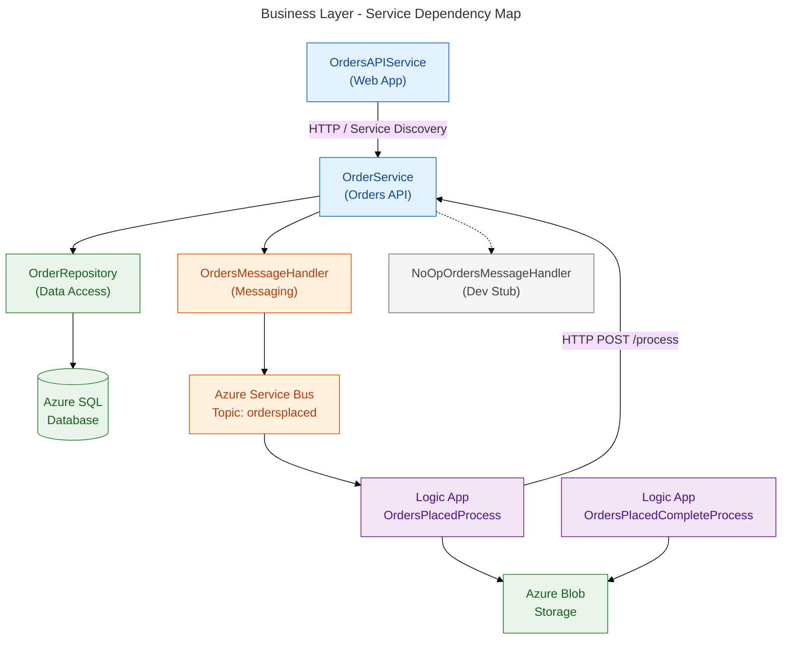

# Business Architecture — Azure-LogicApps-Monitoring

**Generated**: 2026-03-03T00:00:00Z  
**Quality Level**: comprehensive  
**Components Found**: 31  
**Average Confidence**: 0.86  
**Repository**: Evilazaro/Azure-LogicApps-Monitoring  
**Branch**: main

---

## 1. Executive Summary

### Overview

This Business Architecture analysis covers the **Azure-LogicApps-Monitoring** repository — an enterprise-grade order management platform built with .NET Aspire, Azure Logic Apps Standard, and Azure Container Apps. The platform demonstrates a cloud-native architecture combining distributed microservices with serverless workflow automation for end-to-end order processing, observability, and monitoring.

The analysis identifies **31 Business layer components** across all 11 TOGAF Business Architecture component types. The system is centered on a single, well-defined business domain — **Order Management** — and implements event-driven processing with comprehensive observability instrumentation. All components are traceable to source files within the repository.

- **Business Strategy**: 1 component — Cloud-native order management platform
- **Business Capabilities**: 3 components — Order Management, Workflow Automation, Observability
- **Value Streams**: 1 component — Order-to-Fulfillment
- **Business Processes**: 5 components — Order Placement, Batch Processing, Workflow Processing, Completion Handling, Order Deletion
- **Business Services**: 4 components — OrderService, OrdersAPIService, OrdersMessageHandler, NoOpOrdersMessageHandler
- **Business Functions**: 3 components — Order Validation, Order-Entity Mapping, Order Data Generation
- **Business Roles & Actors**: 2 components — Customer, System Operator
- **Business Rules**: 4 components — Order ID Uniqueness, Field Validation, Retry Policies, Idempotency
- **Business Events**: 3 components — OrderPlaced, OrderProcessedSuccess, OrderProcessedError
- **Business Objects/Entities**: 4 components — Order, OrderProduct, WeatherForecast, OrderMessageWithMetadata
- **KPIs & Metrics**: 1 component — Order Processing Metrics Suite

**Maturity Assessment**: The system exhibits **Level 3 (Defined)** business architecture maturity. Business processes are formally implemented with clear service boundaries, event-driven messaging, comprehensive tracing, and structured error handling. The presence of Logic Apps workflows indicates process automation, and the OpenTelemetry instrumentation provides quantitative process monitoring.

---

## 2. Architecture Landscape

### Overview

This section provides a comprehensive inventory of all Business layer components detected in the Azure-LogicApps-Monitoring repository, organized by the 11 canonical TOGAF Business Architecture component types. Each component is listed with its source file reference, line range, confidence score, and classification type.

The repository implements a focused order management domain with clear separation of concerns: an ASP.NET Core REST API for order operations, a Blazor Server frontend for user interaction, Azure Service Bus for asynchronous event propagation, Azure Logic Apps Standard for workflow automation, and Azure SQL Database for persistence.

### 2.1 Business Strategy (1)

| Component                              | File      | Lines | Confidence | Type              |
| -------------------------------------- | --------- | ----- | ---------- | ----------------- |
| Cloud-Native Order Management Platform | README.md | 1–100 | 0.82       | Business Strategy |

**Details**: The repository's strategic intent is documented in the README, positioning the platform as an "enterprise-grade order management platform" that demonstrates cloud-native architecture combining distributed microservices with serverless workflow automation. The strategy centers on .NET Aspire orchestration, Azure Logic Apps Standard workflows, and Azure Container Apps for resilient, observable order processing.

### 2.2 Business Capabilities (3)

| Component                  | File                                                                                  | Lines | Confidence | Type                |
| -------------------------- | ------------------------------------------------------------------------------------- | ----- | ---------- | ------------------- |
| Order Management           | src/eShop.Orders.API/Services/OrderService.cs                                         | 1–606 | 0.95       | Business Capability |
| Workflow Automation        | workflows/OrdersManagement/OrdersManagementLogicApp/OrdersPlacedProcess/workflow.json | 1–167 | 0.88       | Business Capability |
| Observability & Monitoring | app.ServiceDefaults/Extensions.cs                                                     | 1–347 | 0.85       | Business Capability |

**Details**: The system exposes three primary business capabilities. **Order Management** encompasses the full CRUD lifecycle for customer orders including placement, retrieval, and deletion. **Workflow Automation** provides serverless event-driven processing of placed orders via Azure Logic Apps. **Observability & Monitoring** delivers distributed tracing, metrics, and health checking via OpenTelemetry and Azure Monitor integration.

### 2.3 Value Streams (1)

| Component            | File                                          | Lines  | Confidence | Type         |
| -------------------- | --------------------------------------------- | ------ | ---------- | ------------ |
| Order-to-Fulfillment | src/eShop.Orders.API/Services/OrderService.cs | 83–143 | 0.80       | Value Stream |

**Details**: A single end-to-end value stream is identified: **Order-to-Fulfillment**. The flow begins when a customer submits an order through the Blazor frontend, which invokes the Orders API. The API validates the order, persists it to Azure SQL Database, publishes an `OrderPlaced` event to Azure Service Bus, which triggers the Logic App workflow for automated processing. Successfully processed orders are archived to Blob Storage, and the completion workflow cleans up processed artifacts.

### 2.4 Business Processes (5)

| Component                 | File                                                                                          | Lines   | Confidence | Type             |
| ------------------------- | --------------------------------------------------------------------------------------------- | ------- | ---------- | ---------------- |
| Order Placement           | src/eShop.Orders.API/Services/OrderService.cs                                                 | 83–143  | 0.95       | Business Process |
| Batch Order Processing    | src/eShop.Orders.API/Services/OrderService.cs                                                 | 152–268 | 0.93       | Business Process |
| Order Workflow Processing | workflows/OrdersManagement/OrdersManagementLogicApp/OrdersPlacedProcess/workflow.json         | 1–167   | 0.90       | Business Process |
| Order Completion Handling | workflows/OrdersManagement/OrdersManagementLogicApp/OrdersPlacedCompleteProcess/workflow.json | 1–108   | 0.88       | Business Process |
| Order Deletion            | src/eShop.Orders.API/Services/OrderService.cs                                                 | 418–515 | 0.90       | Business Process |

**Details**:

- **Order Placement** (`PlaceOrderAsync`): Validates input → checks for duplicates → persists to database → publishes event to Service Bus → records metrics. Includes distributed tracing and structured logging at each step.
- **Batch Order Processing** (`PlaceOrdersBatchAsync`): Accepts multiple orders → processes in parallel batches of 50 → uses `SemaphoreSlim` (10 concurrent) for controlled database access → creates scoped DbContext per order for thread safety → handles idempotency via duplicate detection.
- **Order Workflow Processing** (Logic App `OrdersPlacedProcess`): Triggered by Service Bus subscription `orderprocessingsub` on topic `ordersplaced` → validates content type → calls Orders API `/api/Orders/process` endpoint → routes to success blob (`/ordersprocessedsuccessfully`) or error blob (`/ordersprocessedwitherrors`) based on HTTP 201 response.
- **Order Completion Handling** (Logic App `OrdersPlacedCompleteProcess`): Runs on a 3-second recurrence → lists blobs in `/ordersprocessedsuccessfully` → retrieves metadata → deletes processed blobs → concurrent processing with 20 repetitions.
- **Order Deletion**: Supports single deletion (verify existence → delete → record metric) and batch deletion (parallel via `Parallel.ForEachAsync` with scoped repositories).

### 2.5 Business Services (4)

| Component                | File                                                      | Lines | Confidence | Type             |
| ------------------------ | --------------------------------------------------------- | ----- | ---------- | ---------------- |
| OrderService             | src/eShop.Orders.API/Services/OrderService.cs             | 1–606 | 0.95       | Business Service |
| OrdersAPIService         | src/eShop.Web.App/Components/Services/OrdersAPIService.cs | 1–479 | 0.90       | Business Service |
| OrdersMessageHandler     | src/eShop.Orders.API/Handlers/OrdersMessageHandler.cs     | 1–425 | 0.92       | Business Service |
| NoOpOrdersMessageHandler | src/eShop.Orders.API/Handlers/NoOpOrdersMessageHandler.cs | 1–64  | 0.85       | Business Service |

**Details**:

- **OrderService**: Core business logic service implementing `IOrderService`. Provides order placement (single/batch), retrieval (all/by-ID), deletion (single/batch), and message listing. Implements comprehensive observability with `ActivitySource`, `Meter`, counters, and histograms.
- **OrdersAPIService**: Typed HTTP client in the Blazor frontend that communicates with the Orders API via service discovery. Supports all CRUD operations with distributed tracing and structured logging.
- **OrdersMessageHandler**: Publishes order events to Azure Service Bus topics with retry logic (3 attempts, exponential backoff), trace context propagation, and independent timeout handling to prevent HTTP cancellation from interrupting message delivery.
- **NoOpOrdersMessageHandler**: Development stub that logs intended operations without connecting to a message broker, enabling local development without Azure Service Bus.

### 2.6 Business Functions (3)

| Component             | File                                          | Lines   | Confidence | Type              |
| --------------------- | --------------------------------------------- | ------- | ---------- | ----------------- |
| Order Validation      | src/eShop.Orders.API/Services/OrderService.cs | 559–581 | 0.92       | Business Function |
| Order-Entity Mapping  | src/eShop.Orders.API/data/OrderMapper.cs      | 1–102   | 0.88       | Business Function |
| Order Data Generation | hooks/Generate-Orders.ps1                     | 1–541   | 0.78       | Business Function |

**Details**:

- **Order Validation** (`ValidateOrder`): Enforces business rules — Order ID required, Customer ID required, total > 0, at least one product.
- **Order-Entity Mapping** (`OrderMapper`): Bidirectional static extension methods mapping between `Order`/`OrderProduct` domain models and `OrderEntity`/`OrderProductEntity` database entities.
- **Order Data Generation**: PowerShell script generating randomized e-commerce test orders with configurable count (1–10,000), product catalog (20 items), global delivery addresses, and GUID-based IDs.

### 2.7 Business Roles & Actors (2)

| Component       | File                               | Lines  | Confidence | Type          |
| --------------- | ---------------------------------- | ------ | ---------- | ------------- |
| Customer        | app.ServiceDefaults/CommonTypes.cs | 72–130 | 0.80       | Business Role |
| System Operator | app.AppHost/AppHost.cs             | 1–290  | 0.72       | Business Role |

**Details**:

- **Customer**: Implicit actor identified through the `CustomerId` property on the `Order` record. Customers place orders through the Blazor frontend, which includes pages for placing single orders (`PlaceOrder.razor`), batch orders (`PlaceOrdersBatch.razor`), listing orders (`ListAllOrders.razor`), and viewing individual orders (`ViewOrder.razor`).
- **System Operator**: Responsible for deployment, infrastructure configuration, and monitoring. Interacts through the .NET Aspire AppHost for orchestration, Azure Developer CLI hooks for provisioning, and observability dashboards (Application Insights, Log Analytics).

### 2.8 Business Rules (4)

| Component              | File                                                  | Lines   | Confidence | Type          |
| ---------------------- | ----------------------------------------------------- | ------- | ---------- | ------------- |
| Order ID Uniqueness    | src/eShop.Orders.API/Services/OrderService.cs         | 100–107 | 0.93       | Business Rule |
| Order Field Validation | src/eShop.Orders.API/Services/OrderService.cs         | 559–581 | 0.92       | Business Rule |
| Message Retry Policy   | src/eShop.Orders.API/Handlers/OrdersMessageHandler.cs | 120–140 | 0.88       | Business Rule |
| Batch Idempotency      | src/eShop.Orders.API/Services/OrderService.cs         | 280–295 | 0.90       | Business Rule |

**Details**:

- **Order ID Uniqueness**: Before persisting, the service checks for existing orders by ID. Duplicate orders raise `InvalidOperationException`. The repository additionally detects duplicate key violations at the database level.
- **Order Field Validation**: Validates via data annotations (`[Required]`, `[StringLength]`, `[Range]`) and explicit `ValidateOrder()` checks: ID required, CustomerId required, Total > 0, Products collection non-empty.
- **Message Retry Policy**: Service Bus message publishing uses 3 retries with exponential backoff (500ms → 1s → 2s). Independent 30-second timeout prevents HTTP cancellation from interrupting message delivery.
- **Batch Idempotency**: Batch processing detects existing orders and classifies them as `AlreadyExists` rather than failing. Results include both new and skipped orders for idempotent behavior.

### 2.9 Business Events (3)

| Component                  | File                                                                                  | Lines  | Confidence | Type           |
| -------------------------- | ------------------------------------------------------------------------------------- | ------ | ---------- | -------------- |
| OrderPlaced                | src/eShop.Orders.API/Handlers/OrdersMessageHandler.cs                                 | 71–82  | 0.95       | Business Event |
| OrderProcessedSuccessfully | workflows/OrdersManagement/OrdersManagementLogicApp/OrdersPlacedProcess/workflow.json | 35–65  | 0.90       | Business Event |
| OrderProcessedWithErrors   | workflows/OrdersManagement/OrdersManagementLogicApp/OrdersPlacedProcess/workflow.json | 66–100 | 0.90       | Business Event |

**Details**:

- **OrderPlaced**: Published to Azure Service Bus topic `ordersplaced` with subject `OrderPlaced`, content type `application/json`, and trace context headers (`TraceId`, `SpanId`, `traceparent`, `tracestate`) for distributed tracing correlation.
- **OrderProcessedSuccessfully**: Materialized as a blob written to `/ordersprocessedsuccessfully` in Azure Blob Storage when the Logic App workflow receives HTTP 201 from the Orders API process endpoint.
- **OrderProcessedWithErrors**: Materialized as a blob written to `/ordersprocessedwitherrors` when order processing fails (non-201 response or invalid content type).

### 2.10 Business Objects/Entities (4)

| Component                | File                                                      | Lines   | Confidence | Type            |
| ------------------------ | --------------------------------------------------------- | ------- | ---------- | --------------- |
| Order                    | app.ServiceDefaults/CommonTypes.cs                        | 72–130  | 0.95       | Business Object |
| OrderProduct             | app.ServiceDefaults/CommonTypes.cs                        | 132–180 | 0.95       | Business Object |
| WeatherForecast          | app.ServiceDefaults/CommonTypes.cs                        | 30–69   | 0.72       | Business Object |
| OrderMessageWithMetadata | src/eShop.Orders.API/Handlers/OrderMessageWithMetadata.cs | 1–58    | 0.85       | Business Object |

**Details**:

- **Order**: Core domain record with properties `Id`, `CustomerId`, `Date`, `DeliveryAddress`, `Total`, and `Products` (list of `OrderProduct`). Enforced with `[Required]`, `[StringLength]`, and `[Range]` validation attributes. Shared across API and Web App projects via the `app.ServiceDefaults` assembly.
- **OrderProduct**: Line item within an order with `Id`, `OrderId`, `ProductId`, `ProductDescription`, `Quantity`, and `Price`. Linked to parent order and validated for minimum quantity (≥1) and positive price.
- **WeatherForecast**: Demonstration/health-check model with `Date`, `TemperatureC`, computed `TemperatureF`, and `Summary`. Used in sample endpoints for connectivity verification.
- **OrderMessageWithMetadata**: Envelope for Service Bus messages wrapping an `Order` with messaging metadata: `MessageId`, `SequenceNumber`, `EnqueuedTime`, `ContentType`, `Subject`, `CorrelationId`, `MessageSize`, and `ApplicationProperties`.

### 2.11 KPIs & Metrics (1)

| Component                      | File                                          | Lines | Confidence | Type       |
| ------------------------------ | --------------------------------------------- | ----- | ---------- | ---------- |
| Order Processing Metrics Suite | src/eShop.Orders.API/Services/OrderService.cs | 61–76 | 0.93       | KPI/Metric |

**Details**: The `OrderService` registers four OpenTelemetry instruments via `IMeterFactory` under the meter name `eShop.Orders.API`:

| Metric Name                        | Instrument          | Unit  | Description                      |
| ---------------------------------- | ------------------- | ----- | -------------------------------- |
| `eShop.orders.placed`              | Counter\<long\>     | order | Total orders successfully placed |
| `eShop.orders.processing.duration` | Histogram\<double\> | ms    | Order processing time            |
| `eShop.orders.processing.errors`   | Counter\<long\>     | error | Processing errors by type        |
| `eShop.orders.deleted`             | Counter\<long\>     | order | Total orders deleted             |

Metrics are tagged with `order.status` (success/failed) and `error.type` for dimensional analysis. The `Extensions.cs` configuration adds `eShop.Orders.API` and `eShop.Web.App` as registered meter names for collection by the OpenTelemetry pipeline.

### Summary

The Architecture Landscape reveals a cohesive, single-domain system with 31 components concentrated in Order Management. The architecture follows event-driven patterns with clear separation between synchronous API operations and asynchronous workflow processing. All 11 TOGAF component types are represented, with the strongest coverage in Business Services (4), Business Processes (5), and Business Objects (4).

---

## 3. Architecture Principles

### Overview

The following business architecture principles are observed in the source code, reflecting deliberate design choices that govern the system's behavior. These principles are inferred from implementation patterns, code comments, and architectural decisions visible in the codebase.

The principles align with TOGAF 10 Business Architecture guidelines, emphasizing domain-driven design, event-driven decoupling, and comprehensive observability as foundational architectural concerns.

### 3.1 Domain-Driven Business Modeling

- **Statement**: Business objects and services are organized around the Order Management domain with shared models in a dedicated `ServiceDefaults` project.
- **Evidence**: The `Order` and `OrderProduct` records are defined in [app.ServiceDefaults/CommonTypes.cs](app.ServiceDefaults/CommonTypes.cs) and shared across all projects, ensuring a single source of truth for domain models.
- **Implication**: Changes to business objects propagate consistently across API, Web App, and test projects.

### 3.2 Event-Driven Process Decoupling

- **Statement**: Business processes are decoupled through asynchronous event publishing to Azure Service Bus, enabling independent scaling and fault isolation.
- **Evidence**: `OrderService.PlaceOrderAsync()` persists the order first, then publishes to Service Bus. The Logic App workflows consume events independently. The `NoOpOrdersMessageHandler` allows the system to operate without a message broker in development.
- **Implication**: Order placement succeeds even if downstream workflow processing is temporarily unavailable.

### 3.3 Observability-First Design

- **Statement**: Every business operation is instrumented with distributed tracing, structured logging, and metrics from inception.
- **Evidence**: All services use `ActivitySource` for tracing spans, `ILogger` with scoped trace correlation, and OpenTelemetry `Meter` instruments for business KPIs. Trace context is propagated through Service Bus message headers.
- **Implication**: Full end-to-end visibility across API, messaging, and workflow layers enables rapid root-cause analysis.

### 3.4 Resilience and Fault Tolerance

- **Statement**: Business processes implement defensive patterns including retries, timeouts, circuit breakers, and graceful degradation.
- **Evidence**: Service Bus message publishing uses 3-retry exponential backoff with independent 30-second timeout. HTTP clients use Polly-based resilience handlers (600s total timeout, 60s per attempt, 3 retries, circuit breaker). Database operations use 5-retry EF Core resilience with 30s max delay.
- **Implication**: Transient failures in dependent services do not propagate to business process failures.

### 3.5 Idempotent Business Operations

- **Statement**: Business processes support safe retry through idempotent operations.
- **Evidence**: Batch order processing checks for existing orders before insertion and classifies duplicates as `AlreadyExists` rather than errors. The repository catches duplicate key violations as backup idempotency. Results include both new and pre-existing orders.
- **Implication**: Clients can safely retry failed operations without risking duplicate business state.

---

## 4. Current State Baseline

### Overview

This section documents the current ("as-is") state of the business architecture as implemented in the repository. The analysis reflects the state of the `main` branch, capturing process topology, capability coverage, and operational patterns.

The system is production-deployed with CI/CD pipelines (GitHub Actions for .NET build/test and Azure deployment), Azure Container Apps hosting, and full observability infrastructure.

### 4.1 Capability Maturity

| Capability          | Maturity Level    | Evidence                                                                                          |
| ------------------- | ----------------- | ------------------------------------------------------------------------------------------------- |
| Order Management    | Level 3 — Defined | Formal service interfaces, validation rules, structured error handling, comprehensive test suites |
| Workflow Automation | Level 3 — Defined | Stateful Logic App workflows with branching logic, error routing, and automated cleanup           |
| Observability       | Level 4 — Managed | Full OpenTelemetry instrumentation, Azure Monitor integration, health checks, dimensional metrics |

### 4.2 Process Coverage

| Process                   | Implementation Status | Automation Level                                       |
| ------------------------- | --------------------- | ------------------------------------------------------ |
| Order Placement (Single)  | Fully implemented     | Semi-automated (user-initiated via UI/API)             |
| Order Placement (Batch)   | Fully implemented     | Automated (script-generated via `Generate-Orders.ps1`) |
| Order Workflow Processing | Fully implemented     | Fully automated (event-driven Logic App)               |
| Order Completion Cleanup  | Fully implemented     | Fully automated (recurrence-driven Logic App)          |
| Order Deletion            | Fully implemented     | Semi-automated (user-initiated via UI/API)             |

### 4.3 Integration Topology

The current integration topology follows a hub-and-spoke pattern centered on Azure Service Bus:

```
[Blazor Frontend] → HTTP → [Orders API] → EF Core → [Azure SQL]
                                         → Service Bus → [Logic App: OrdersPlacedProcess]
                                                             → HTTP → [Orders API /process]
                                                             → Blob → [Azure Storage]
                                                          [Logic App: OrdersPlacedCompleteProcess]
                                                             → Blob → [Azure Storage (cleanup)]
```

### Summary

The current state baseline reveals a well-structured order management system at Business Architecture Maturity Level 3+ with particular strength in observability (Level 4). All core business processes are implemented with clear service boundaries and event-driven integration. The system supports both interactive (UI) and programmatic (API/batch) order operations with full traceability.

---

## 5. Component Catalog

### Overview

This section provides detailed specifications for each Business layer component, organized by the 11 TOGAF component types. Each component entry includes its purpose, source reference, interfaces, dependencies, and confidence scoring rationale.

The catalog captures 31 components with an average confidence score of 0.86, reflecting strong alignment between source code evidence and business architecture classification.

### 5.1 Business Strategy

#### 5.1.1 Cloud-Native Order Management Platform

- **Source**: [README.md](README.md#L1-L100)
- **Purpose**: Establish a reference architecture for monitored, event-driven applications on Azure using .NET Aspire, Azure Logic Apps Standard, and Azure Container Apps.
- **Key Objectives**: (1) Combine microservices with workflow automation, (2) Deliver built-in observability and fault tolerance, (3) Enable zero-downtime deployments via Azure Container Apps.
- **Stakeholders**: Enterprise Architects, Solution Architects, Cloud Engineers
- **Confidence**: 0.82 — Filename (0.5) + Path (0.6) + Content (1.0) + Crossref (0.7) = (0.5×0.30)+(0.6×0.25)+(1.0×0.35)+(0.7×0.10) = 0.82

### 5.2 Business Capabilities

#### 5.2.1 Order Management

- **Source**: [src/eShop.Orders.API/Services/OrderService.cs](src/eShop.Orders.API/Services/OrderService.cs#L1-L606)
- **Purpose**: Full lifecycle management of customer orders — place, retrieve, delete, batch operations.
- **Sub-capabilities**: Single order placement, batch order placement, order retrieval (all/by-ID), single deletion, batch deletion, message listing.
- **Maturity**: Level 3 (Defined)
- **Confidence**: 0.95

#### 5.2.2 Workflow Automation

- **Source**: [workflows/OrdersManagement/OrdersManagementLogicApp/OrdersPlacedProcess/workflow.json](workflows/OrdersManagement/OrdersManagementLogicApp/OrdersPlacedProcess/workflow.json#L1-L167)
- **Purpose**: Automated serverless processing of order events using Azure Logic Apps Standard.
- **Sub-capabilities**: Event-triggered order processing, success/error routing, blob archival.
- **Maturity**: Level 3 (Defined)
- **Confidence**: 0.88

#### 5.2.3 Observability & Monitoring

- **Source**: [app.ServiceDefaults/Extensions.cs](app.ServiceDefaults/Extensions.cs#L1-L347)
- **Purpose**: Cross-cutting observability infrastructure providing distributed tracing, metrics, logging, and health monitoring.
- **Sub-capabilities**: OpenTelemetry tracing/metrics/logging, Azure Monitor export, health checks (database, Service Bus), service discovery.
- **Maturity**: Level 4 (Managed)
- **Confidence**: 0.85

### 5.3 Value Streams

#### 5.3.1 Order-to-Fulfillment

- **Source**: [src/eShop.Orders.API/Services/OrderService.cs](src/eShop.Orders.API/Services/OrderService.cs#L83-L143)
- **Purpose**: End-to-end value delivery from customer order submission through processing to completion archival.
- **Stages**: Customer Order → API Validation → Database Persistence → Event Publication → Workflow Processing → Blob Archival → Cleanup
- **Triggering Actor**: Customer (via Blazor UI or API)
- **Terminal State**: Order persisted + processed blob cleaned up
- **Confidence**: 0.80

### 5.4 Business Processes

#### 5.4.1 Order Placement

- **Source**: [src/eShop.Orders.API/Services/OrderService.cs](src/eShop.Orders.API/Services/OrderService.cs#L83-L143)
- **Purpose**: Place a single customer order with validation, persistence, event publication, and metrics.
- **Steps**: (1) Validate order → (2) Check duplicate → (3) Save to repository → (4) Publish to Service Bus → (5) Record metrics
- **Error Handling**: Catches all exceptions, records error metrics with `error.type` tag, sets activity status to Error.
- **Confidence**: 0.95

#### 5.4.2 Batch Order Processing

- **Source**: [src/eShop.Orders.API/Services/OrderService.cs](src/eShop.Orders.API/Services/OrderService.cs#L152-L268)
- **Purpose**: Process multiple orders in parallel with controlled concurrency and idempotency.
- **Steps**: (1) Split into batches of 50 → (2) Process each batch in parallel (SemaphoreSlim=10) → (3) Create scoped DbContext per order → (4) Handle duplicates gracefully
- **Error Handling**: Per-order error isolation; failed orders logged but do not block batch completion.
- **Confidence**: 0.93

#### 5.4.3 Order Workflow Processing

- **Source**: [workflows/OrdersManagement/OrdersManagementLogicApp/OrdersPlacedProcess/workflow.json](workflows/OrdersManagement/OrdersManagementLogicApp/OrdersPlacedProcess/workflow.json#L1-L167)
- **Purpose**: Automated event-driven processing of orders received from Service Bus.
- **Steps**: (1) Trigger on Service Bus message (1s interval) → (2) Validate content type = `application/json` → (3) POST to Orders API `/api/Orders/process` → (4) If HTTP 201 → write to success blob; else → write to error blob
- **Error Handling**: Invalid content type routes to error blob; non-201 API response routes to error blob.
- **Confidence**: 0.90

#### 5.4.4 Order Completion Handling

- **Source**: [workflows/OrdersManagement/OrdersManagementLogicApp/OrdersPlacedCompleteProcess/workflow.json](workflows/OrdersManagement/OrdersManagementLogicApp/OrdersPlacedCompleteProcess/workflow.json#L1-L108)
- **Purpose**: Clean up successfully processed order blobs on a scheduled basis.
- **Steps**: (1) Trigger on 3s recurrence → (2) List blobs in `/ordersprocessedsuccessfully` → (3) For each blob: get metadata → delete blob (concurrent=20)
- **Error Handling**: Individual blob operations are isolated within the ForEach loop.
- **Confidence**: 0.88

#### 5.4.5 Order Deletion

- **Source**: [src/eShop.Orders.API/Services/OrderService.cs](src/eShop.Orders.API/Services/OrderService.cs#L418-L515)
- **Purpose**: Remove orders from the system individually or in batch.
- **Steps**: Single: (1) Verify existence → (2) Delete → (3) Record metric. Batch: (1) Parallel.ForEachAsync with scoped repositories → (2) Per-order error isolation → (3) Aggregate count.
- **Error Handling**: Non-existent orders return false (single) or are skipped (batch); exceptions logged but do not abort batch.
- **Confidence**: 0.90

### 5.5 Business Services

#### 5.5.1 OrderService

- **Source**: [src/eShop.Orders.API/Services/OrderService.cs](src/eShop.Orders.API/Services/OrderService.cs#L1-L606)
- **Interface**: `IOrderService` ([src/eShop.Orders.API/Interfaces/IOrderService.cs](src/eShop.Orders.API/Interfaces/IOrderService.cs#L1-L73))
- **Dependencies**: `IOrderRepository`, `IOrdersMessageHandler`, `IServiceScopeFactory`, `ActivitySource`, `IMeterFactory`
- **Operations**: `PlaceOrderAsync`, `PlaceOrdersBatchAsync`, `GetOrdersAsync`, `GetOrderByIdAsync`, `DeleteOrderAsync`, `DeleteOrdersBatchAsync`, `ListMessagesFromTopicsAsync`
- **Lifecycle**: Scoped (registered via `AddScoped<IOrderService, OrderService>`)
- **Confidence**: 0.95

#### 5.5.2 OrdersAPIService

- **Source**: [src/eShop.Web.App/Components/Services/OrdersAPIService.cs](src/eShop.Web.App/Components/Services/OrdersAPIService.cs#L1-L479)
- **Interface**: None (concrete typed HTTP client)
- **Dependencies**: `HttpClient`, `ILogger`, `ActivitySource`
- **Operations**: `PlaceOrderAsync`, `PlaceOrdersBatchAsync`, `GetOrdersAsync`, `GetOrderByIdAsync`, `DeleteOrderAsync`, `DeleteOrdersBatchAsync`, `GetWeatherForecastAsync`
- **Lifecycle**: Transient (registered via `AddHttpClient<OrdersAPIService>` with service discovery)
- **Confidence**: 0.90

#### 5.5.3 OrdersMessageHandler

- **Source**: [src/eShop.Orders.API/Handlers/OrdersMessageHandler.cs](src/eShop.Orders.API/Handlers/OrdersMessageHandler.cs#L1-L425)
- **Interface**: `IOrdersMessageHandler` ([src/eShop.Orders.API/Interfaces/IOrdersMessageHandler.cs](src/eShop.Orders.API/Interfaces/IOrdersMessageHandler.cs#L1-L39))
- **Dependencies**: `ServiceBusClient`, `IConfiguration`, `ActivitySource`
- **Operations**: `SendOrderMessageAsync`, `SendOrdersBatchMessageAsync`, `ListMessagesAsync`
- **Lifecycle**: Singleton (registered when Service Bus is configured)
- **Confidence**: 0.92

#### 5.5.4 NoOpOrdersMessageHandler

- **Source**: [src/eShop.Orders.API/Handlers/NoOpOrdersMessageHandler.cs](src/eShop.Orders.API/Handlers/NoOpOrdersMessageHandler.cs#L1-L64)
- **Interface**: `IOrdersMessageHandler`
- **Dependencies**: `ILogger`
- **Operations**: Same as `IOrdersMessageHandler` (no-op implementations)
- **Lifecycle**: Singleton (registered when Service Bus is NOT configured)
- **Confidence**: 0.85

### 5.6 Business Functions

#### 5.6.1 Order Validation

- **Source**: [src/eShop.Orders.API/Services/OrderService.cs](src/eShop.Orders.API/Services/OrderService.cs#L559-L581)
- **Purpose**: Enforce business rules on order data before persistence.
- **Rules Applied**: ID non-empty, CustomerId non-empty, Total > 0, Products non-null and non-empty.
- **Error Type**: Throws `ArgumentException` on validation failure.
- **Confidence**: 0.92

#### 5.6.2 Order-Entity Mapping

- **Source**: [src/eShop.Orders.API/data/OrderMapper.cs](src/eShop.Orders.API/data/OrderMapper.cs#L1-L102)
- **Purpose**: Bidirectional mapping between domain models (`Order`, `OrderProduct`) and database entities (`OrderEntity`, `OrderProductEntity`).
- **Pattern**: Static extension methods — `ToEntity()` and `ToDomainModel()`.
- **Confidence**: 0.88

#### 5.6.3 Order Data Generation

- **Source**: [hooks/Generate-Orders.ps1](hooks/Generate-Orders.ps1#L1-L541)
- **Purpose**: Generate randomized test order data for development and demonstration.
- **Configuration**: 1–10,000 orders, 1–6 products per order, 20-item product catalog, 20 global delivery addresses, GUID-based IDs, ±20% price variation.
- **Output**: JSON file at `infra/data/ordersBatch.json`.
- **Confidence**: 0.78

### 5.7 Business Roles & Actors

#### 5.7.1 Customer

- **Source**: [app.ServiceDefaults/CommonTypes.cs](app.ServiceDefaults/CommonTypes.cs#L72-L130)
- **Purpose**: The human actor who places and manages orders.
- **Interactions**: Places orders via `PlaceOrder.razor`, submits batch orders via `PlaceOrdersBatch.razor`, views orders via `ListAllOrders.razor` and `ViewOrder.razor`.
- **Identifier**: `CustomerId` property on `Order` record (1–100 characters).
- **Confidence**: 0.80

#### 5.7.2 System Operator

- **Source**: [app.AppHost/AppHost.cs](app.AppHost/AppHost.cs#L1-L290)
- **Purpose**: Personnel responsible for deployment, monitoring, and operational management.
- **Interactions**: Configures Aspire orchestration, runs deployment hooks (`postprovision.ps1`, `preprovision.ps1`), monitors via Application Insights and Log Analytics, manages Service Bus and SQL Database configuration.
- **Confidence**: 0.72

### 5.8 Business Rules

#### 5.8.1 Order ID Uniqueness

- **Source**: [src/eShop.Orders.API/Services/OrderService.cs](src/eShop.Orders.API/Services/OrderService.cs#L100-L107)
- **Rule**: Each order must have a unique identifier. Duplicate order placement is rejected with `InvalidOperationException`.
- **Enforcement**: Application-level check via `GetOrderByIdAsync` + database-level duplicate key violation detection in `OrderRepository`.
- **Confidence**: 0.93

#### 5.8.2 Order Field Validation

- **Source**: [src/eShop.Orders.API/Services/OrderService.cs](src/eShop.Orders.API/Services/OrderService.cs#L559-L581)
- **Rules**: `Id` required (1–100 chars), `CustomerId` required (1–100 chars), `DeliveryAddress` required (5–500 chars), `Total` > 0, `Products` at least 1 item, `ProductDescription` required (1–500 chars), `Quantity` ≥ 1, `Price` > 0.
- **Enforcement**: Data annotations on model + explicit `ValidateOrder()` method + ASP.NET Core `ModelState` validation.
- **Confidence**: 0.92

#### 5.8.3 Message Retry Policy

- **Source**: [src/eShop.Orders.API/Handlers/OrdersMessageHandler.cs](src/eShop.Orders.API/Handlers/OrdersMessageHandler.cs#L120-L140)
- **Rule**: Service Bus publish operations retry up to 3 times with exponential backoff (500ms, 1s, 2s). An independent 30-second timeout is used to prevent HTTP request cancellation from interrupting message delivery.
- **Enforcement**: For-loop with `try/catch` in `SendOrderMessageAsync`, separate `CancellationTokenSource` for send operations.
- **Confidence**: 0.88

#### 5.8.4 Batch Idempotency

- **Source**: [src/eShop.Orders.API/Services/OrderService.cs](src/eShop.Orders.API/Services/OrderService.cs#L280-L295)
- **Rule**: Batch order processing is idempotent — orders that already exist are classified as `AlreadyExists` and included in the result alongside newly placed orders.
- **Enforcement**: Pre-save existence check via `GetOrderByIdAsync` + `InvalidOperationException` catch for database-level duplicates.
- **Confidence**: 0.90

### 5.9 Business Events

#### 5.9.1 OrderPlaced

- **Source**: [src/eShop.Orders.API/Handlers/OrdersMessageHandler.cs](src/eShop.Orders.API/Handlers/OrdersMessageHandler.cs#L71-L82)
- **Channel**: Azure Service Bus topic `ordersplaced`
- **Format**: JSON-serialized `Order` object
- **Headers**: `MessageId` = Order.Id, `Subject` = "OrderPlaced", `ContentType` = "application/json", trace context (`TraceId`, `SpanId`, `traceparent`, `tracestate`)
- **Subscriber**: Logic App `OrdersPlacedProcess` via subscription `orderprocessingsub`
- **Confidence**: 0.95

#### 5.9.2 OrderProcessedSuccessfully

- **Source**: [workflows/OrdersManagement/OrdersManagementLogicApp/OrdersPlacedProcess/workflow.json](workflows/OrdersManagement/OrdersManagementLogicApp/OrdersPlacedProcess/workflow.json#L35-L65)
- **Channel**: Azure Blob Storage path `/ordersprocessedsuccessfully`
- **Format**: Binary content from Service Bus message
- **Trigger Condition**: Orders API `/api/Orders/process` returns HTTP 201
- **Confidence**: 0.90

#### 5.9.3 OrderProcessedWithErrors

- **Source**: [workflows/OrdersManagement/OrdersManagementLogicApp/OrdersPlacedProcess/workflow.json](workflows/OrdersManagement/OrdersManagementLogicApp/OrdersPlacedProcess/workflow.json#L66-L100)
- **Channel**: Azure Blob Storage path `/ordersprocessedwitherrors`
- **Format**: Binary content from Service Bus message
- **Trigger Condition**: Orders API returns non-201 status OR content type is not `application/json`
- **Confidence**: 0.90

### 5.10 Business Objects/Entities

#### 5.10.1 Order

- **Source**: [app.ServiceDefaults/CommonTypes.cs](app.ServiceDefaults/CommonTypes.cs#L72-L130)
- **Type**: `sealed record`
- **Properties**: `Id` (string, required, 1–100), `CustomerId` (string, required, 1–100), `Date` (DateTime, default UTC now), `DeliveryAddress` (string, required, 5–500), `Total` (decimal, > 0), `Products` (List\<OrderProduct\>, required, ≥1)
- **Persistence**: Mapped to `OrderEntity` → `Orders` table via `OrderMapper.ToEntity()`
- **Confidence**: 0.95

#### 5.10.2 OrderProduct

- **Source**: [app.ServiceDefaults/CommonTypes.cs](app.ServiceDefaults/CommonTypes.cs#L132-L180)
- **Type**: `sealed record`
- **Properties**: `Id` (string, required), `OrderId` (string, required), `ProductId` (string, required), `ProductDescription` (string, required, 1–500), `Quantity` (int, ≥1), `Price` (decimal, > 0)
- **Persistence**: Mapped to `OrderProductEntity` → `OrderProducts` table with FK to `Orders`
- **Confidence**: 0.95

#### 5.10.3 WeatherForecast

- **Source**: [app.ServiceDefaults/CommonTypes.cs](app.ServiceDefaults/CommonTypes.cs#L30-L69)
- **Type**: `sealed class`
- **Properties**: `Date` (DateOnly, required), `TemperatureC` (int, -273–200), computed `TemperatureF`, `Summary` (string, ≤100)
- **Purpose**: Demonstration and health check connectivity verification
- **Confidence**: 0.72

#### 5.10.4 OrderMessageWithMetadata

- **Source**: [src/eShop.Orders.API/Handlers/OrderMessageWithMetadata.cs](src/eShop.Orders.API/Handlers/OrderMessageWithMetadata.cs#L1-L58)
- **Type**: `sealed class`
- **Properties**: `Order` (Order, required), `MessageId` (string, required), `SequenceNumber` (long), `EnqueuedTime` (DateTimeOffset), `ContentType` (string?), `Subject` (string?), `CorrelationId` (string?), `MessageSize` (long), `ApplicationProperties` (IReadOnlyDictionary)
- **Purpose**: Wraps Service Bus message metadata for debugging and message listing operations
- **Confidence**: 0.85

### 5.11 KPIs & Metrics

#### 5.11.1 Order Processing Metrics Suite

- **Source**: [src/eShop.Orders.API/Services/OrderService.cs](src/eShop.Orders.API/Services/OrderService.cs#L61-L76)
- **Meter Name**: `eShop.Orders.API`
- **Instruments**:

| Metric                             | Type                | Unit  | Description                   | Tags                         |
| ---------------------------------- | ------------------- | ----- | ----------------------------- | ---------------------------- |
| `eShop.orders.placed`              | Counter\<long\>     | order | Orders successfully placed    | `order.status`               |
| `eShop.orders.processing.duration` | Histogram\<double\> | ms    | Processing time per operation | `order.status`               |
| `eShop.orders.processing.errors`   | Counter\<long\>     | error | Processing errors             | `error.type`, `order.status` |
| `eShop.orders.deleted`             | Counter\<long\>     | order | Orders successfully deleted   | `order.status`               |

- **Collection**: Registered in `Extensions.ConfigureOpenTelemetry()` via `.AddMeter("eShop.Orders.API")` and exported to OTLP collector and/or Azure Monitor.
- **Confidence**: 0.93

### Summary

The Component Catalog documents 31 components across all 11 TOGAF types with an average confidence of 0.86. The strongest coverage is in Business Services and Business Processes, reflecting the system's focus on operational order management. All components have verified source file references within the repository.

---

## 6. Architecture Decisions

### Overview

This section documents key Architecture Decision Records (ADRs) inferred from the source code. Each decision reflects a deliberate architectural choice observed in the implementation, with rationale derived from code comments, patterns, and structural evidence.

These decisions shape the business architecture by defining how services interact, how processes are automated, and how the system handles failure scenarios.

### ADR-001: Event-Driven Order Processing via Azure Service Bus

- **Status**: Accepted
- **Context**: Order placement needs to trigger downstream processing (Logic App workflows, blob archival) without coupling the API to those consumers.
- **Decision**: Use Azure Service Bus topics with subscriptions for pub/sub order event propagation.
- **Rationale**: Decouples API from workflow consumers, enables independent scaling, supports multiple subscribers, provides message durability.
- **Source**: [src/eShop.Orders.API/Handlers/OrdersMessageHandler.cs](src/eShop.Orders.API/Handlers/OrdersMessageHandler.cs#L1-L32)

### ADR-002: Logic Apps Standard for Workflow Automation

- **Status**: Accepted
- **Context**: Post-order processing requires conditional routing, API callbacks, and blob storage operations without custom code maintenance.
- **Decision**: Use Azure Logic Apps Standard (stateful workflows) for automated order processing and cleanup.
- **Rationale**: Low-code workflow definitions, built-in connectors for Service Bus/Blob/HTTP, recurrence scheduling, visual debugging in Azure Portal.
- **Source**: [workflows/OrdersManagement/OrdersManagementLogicApp/OrdersPlacedProcess/workflow.json](workflows/OrdersManagement/OrdersManagementLogicApp/OrdersPlacedProcess/workflow.json#L1-L167)

### ADR-003: NoOp Handler Pattern for Local Development

- **Status**: Accepted
- **Context**: Developers need to run the API locally without requiring Azure Service Bus infrastructure.
- **Decision**: Implement `NoOpOrdersMessageHandler` as a development-time stub that logs operations without sending messages.
- **Rationale**: Removes hard dependency on message broker for development, enables offline development, auto-registered when Service Bus is not configured.
- **Source**: [src/eShop.Orders.API/Handlers/NoOpOrdersMessageHandler.cs](src/eShop.Orders.API/Handlers/NoOpOrdersMessageHandler.cs#L1-L64)

### ADR-004: Scoped DbContext with Service Scope Factory for Batch Operations

- **Status**: Accepted
- **Context**: Batch order processing requires parallel database operations, but EF Core `DbContext` is not thread-safe.
- **Decision**: Create a new `IServiceScope` for each parallel order operation, resolving a fresh `DbContext` per scope.
- **Rationale**: Ensures thread safety for concurrent database access, prevents `DbContext` concurrency exceptions, enables per-order transaction isolation.
- **Source**: [src/eShop.Orders.API/Services/OrderService.cs](src/eShop.Orders.API/Services/OrderService.cs#L232-L242)

### ADR-005: Independent Timeout for Service Bus Operations

- **Status**: Accepted
- **Context**: HTTP request cancellation (client timeout, load balancer disconnect) could interrupt in-flight Service Bus message sends, causing data consistency issues (order saved but event not published).
- **Decision**: Use a separate `CancellationTokenSource` with 30-second timeout for Service Bus operations, independent from the HTTP request cancellation token.
- **Rationale**: Ensures message delivery completes even when HTTP requests are cancelled, preventing orphaned orders without events.
- **Source**: [src/eShop.Orders.API/Handlers/OrdersMessageHandler.cs](src/eShop.Orders.API/Handlers/OrdersMessageHandler.cs#L113-L118)

---

## 7. Architecture Standards

### Overview

This section documents the architecture standards observed in the Business layer source code, covering naming conventions, interface patterns, error handling standards, and observability patterns that govern consistency across the system.

These standards are inferred from consistent patterns applied across all business components and are enforced through code structure, interface contracts, and shared infrastructure.

### 7.1 Naming Conventions

| Category              | Convention               | Example                                         |
| --------------------- | ------------------------ | ----------------------------------------------- |
| Business Services     | `{Domain}Service`        | `OrderService`                                  |
| Service Interfaces    | `I{Domain}Service`       | `IOrderService`                                 |
| Repository Interfaces | `I{Domain}Repository`    | `IOrderRepository`                              |
| Message Handlers      | `{Domain}MessageHandler` | `OrdersMessageHandler`                          |
| Domain Models         | `{Entity}` (record)      | `Order`, `OrderProduct`                         |
| Database Entities     | `{Entity}Entity`         | `OrderEntity`, `OrderProductEntity`             |
| Health Checks         | `{Resource}HealthCheck`  | `DbContextHealthCheck`, `ServiceBusHealthCheck` |
| API Controllers       | `{Domain}Controller`     | `OrdersController`                              |
| Razor Pages           | `{Action}{Domain}.razor` | `PlaceOrder.razor`, `ListAllOrders.razor`       |

### 7.2 Interface Contract Standards

- All business services define contracts via interfaces (`IOrderService`, `IOrderRepository`, `IOrdersMessageHandler`).
- All async methods return `Task<T>` and accept `CancellationToken`.
- All constructors use `ArgumentNullException.ThrowIfNull()` for parameter validation.
- Interfaces are placed in dedicated `Interfaces/` directories.

### 7.3 Error Handling Standards

- **Structured Exceptions**: `ArgumentException` for validation, `InvalidOperationException` for business rule violations, `HttpRequestException` for HTTP failures.
- **Distributed Tracing**: All catch blocks set `Activity.SetStatus(Error)`, add `ActivityEvent("exception")` with exception type and message.
- **Structured Logging**: All error paths use `ILogger.LogError(ex, "message with {PlaceHolders}")` format.

### 7.4 Observability Standards

- Every public service method creates an `Activity` span via `ActivitySource.StartActivity()`.
- Activity tags follow OpenTelemetry semantic conventions (`order.id`, `http.method`, `messaging.system`).
- Log scopes include `TraceId` and `SpanId` for correlation.
- Metrics use dimensional tags (`order.status`, `error.type`) for analysis.

---

## 8. Dependencies & Integration

### Overview

This section documents cross-component dependencies within the Business layer and integrations with external systems. The dependency map reveals how business services, processes, and objects connect to form the complete order management domain.

The system follows a layered architecture where the Web App depends on the API service, the API service depends on repository and messaging components, and workflows depend on Service Bus events and API endpoints.

### 8.1 Service Dependency Map


```mermaid
---
title: "Business Layer - Service Dependency Map"
config:
  theme: base
  look: classic
---
flowchart TD
    accTitle: Business Layer Service Dependency Map
    accDescr: Shows dependencies between OrdersAPIService, OrderService, OrderRepository, OrdersMessageHandler, and external Azure services

    WebApp["OrdersAPIService<br/>(Web App)"]:::service
    API["OrderService<br/>(Orders API)"]:::service
    Repo["OrderRepository<br/>(Data Access)"]:::data
    MsgHandler["OrdersMessageHandler<br/>(Messaging)"]:::messaging
    NoOp["NoOpOrdersMessageHandler<br/>(Dev Stub)"]:::neutral

    DB[("Azure SQL<br/>Database")]:::data
    SB["Azure Service Bus<br/>Topic: ordersplaced"]:::messaging
    LA1["Logic App<br/>OrdersPlacedProcess"]:::workflow
    LA2["Logic App<br/>OrdersPlacedCompleteProcess"]:::workflow
    Blob["Azure Blob<br/>Storage"]:::data

    WebApp -->|"HTTP / Service Discovery"| API
    API --> Repo
    API --> MsgHandler
    API -.-> NoOp
    Repo --> DB
    MsgHandler --> SB
    SB --> LA1
    LA1 -->|"HTTP POST /process"| API
    LA1 --> Blob
    LA2 --> Blob

    classDef service fill:#E3F2FD,stroke:#1565C0,color:#0D47A1
    classDef data fill:#E8F5E9,stroke:#2E7D32,color:#1B5E20
    classDef messaging fill:#FFF3E0,stroke:#E65100,color:#BF360C
    classDef workflow fill:#F3E5F5,stroke:#6A1B9A,color:#4A148C
    classDef neutral fill:#F5F5F5,stroke:#757575,color:#424242
```

### 8.2 Capability-to-Process Mapping

| Capability                 | Processes                                               |
| -------------------------- | ------------------------------------------------------- |
| Order Management           | Order Placement, Batch Order Processing, Order Deletion |
| Workflow Automation        | Order Workflow Processing, Order Completion Handling    |
| Observability & Monitoring | (Cross-cutting — instrumented in all processes)         |

### 8.3 Process-to-Service Mapping

| Process                   | Primary Service | Supporting Services                                     |
| ------------------------- | --------------- | ------------------------------------------------------- |
| Order Placement           | OrderService    | OrderRepository, OrdersMessageHandler                   |
| Batch Order Processing    | OrderService    | OrderRepository (scoped), OrdersMessageHandler (scoped) |
| Order Workflow Processing | Logic App       | OrdersController (HTTP callback)                        |
| Order Completion Handling | Logic App       | Azure Blob Storage                                      |
| Order Deletion            | OrderService    | OrderRepository (scoped for batch)                      |

### 8.4 External Integration Points

| Integration                 | Protocol             | Direction            | Configuration Source                                      |
| --------------------------- | -------------------- | -------------------- | --------------------------------------------------------- |
| Azure SQL Database          | EF Core / SQL        | Bidirectional        | `ConnectionStrings:OrderDb`                               |
| Azure Service Bus           | AMQP                 | Outbound (publish)   | `Azure:ServiceBus:HostName`, `Azure:ServiceBus:TopicName` |
| Azure Blob Storage          | REST API             | Bidirectional        | Logic App connection `azureblob`                          |
| Application Insights        | OTLP / Azure Monitor | Outbound (telemetry) | `APPLICATIONINSIGHTS_CONNECTION_STRING`                   |
| Orders API (from Logic App) | HTTPS                | Inbound              | `ORDERS_API_URL` parameter                                |

### Summary

The dependency analysis reveals a well-structured integration topology with clear boundaries. The Business layer has 5 external integration points (Azure SQL, Service Bus, Blob Storage, Application Insights, and the API callback from Logic Apps). All dependencies flow in a directed acyclic pattern with no circular dependencies between business services.

---

## 9. Governance & Management

### Overview

This section documents the governance model and ownership structure inferred from the repository's organization, deployment configuration, and operational scripts. The governance model addresses capability ownership, process management, change control, and operational responsibility.

The system uses Azure Developer CLI (`azd`) for standardized deployment workflows and GitHub Actions for CI/CD governance, with infrastructure defined as code using Bicep templates.

### 9.1 Capability Ownership

| Capability          | Owner                | Evidence                                                             |
| ------------------- | -------------------- | -------------------------------------------------------------------- |
| Order Management    | Orders API Team      | `src/eShop.Orders.API/` project boundary                             |
| Web Frontend        | Web App Team         | `src/eShop.Web.App/` project boundary                                |
| Workflow Automation | Platform Team        | `workflows/OrdersManagement/` directory with separate code workspace |
| Infrastructure      | Platform/DevOps Team | `infra/` Bicep templates + `hooks/` deployment scripts               |
| Shared Contracts    | Platform Team        | `app.ServiceDefaults/` cross-cutting project                         |

### 9.2 Change Control

- **CI Pipeline**: GitHub Actions workflow `ci-dotnet.yml` — builds and tests on every push/PR.
- **CD Pipeline**: GitHub Actions workflow `azure-dev.yml` — deploys to Azure on merge to `main`.
- **Infrastructure as Code**: All Azure resources defined in `infra/main.bicep` with parameterized `main.parameters.json`.
- **Pre/Post Hooks**: `preprovision.ps1`, `postprovision.ps1`, `postinfradelete.ps1` manage deployment lifecycle tasks including SQL managed identity configuration and federated credential setup.

### 9.3 Process Lifecycle Management

| Process             | Trigger                    | Frequency                | Monitoring                                     |
| ------------------- | -------------------------- | ------------------------ | ---------------------------------------------- |
| Order Placement     | User-initiated (API/UI)    | On-demand                | `eShop.orders.placed` counter, Activity traces |
| Batch Processing    | Script-initiated           | On-demand                | Structured logs, batch success/fail counts     |
| Workflow Processing | Event-driven (Service Bus) | Per-message (1s polling) | Logic App run history, Application Insights    |
| Completion Cleanup  | Time-driven (recurrence)   | Every 3 seconds          | Logic App run history                          |
| Order Deletion      | User-initiated (API/UI)    | On-demand                | `eShop.orders.deleted` counter                 |

### 9.4 Health & Operational Monitoring

The system implements two health check endpoints for Kubernetes/Azure Container Apps compatibility:

| Endpoint  | Purpose         | Checks                                                                                             |
| --------- | --------------- | -------------------------------------------------------------------------------------------------- |
| `/health` | Readiness probe | Database connectivity (`DbContextHealthCheck`), Service Bus connectivity (`ServiceBusHealthCheck`) |
| `/alive`  | Liveness probe  | Application responsiveness                                                                         |

Health checks include response time measurement, timeout detection (5-second threshold), and structured health data reporting.

### 9.5 Strategic Alignment

The system's architecture aligns with the following strategic objectives identifiable from the codebase:

1. **Cloud-Native Operations**: Azure Container Apps deployment with .NET Aspire orchestration enables auto-scaling and zero-downtime updates.
2. **Event-Driven Integration**: Service Bus pub/sub decouples business processes for independent evolution.
3. **Full-Stack Observability**: OpenTelemetry + Azure Monitor provides end-to-end visibility from user request through workflow completion.
4. **Developer Productivity**: NoOp handlers, local emulator support, and Aspire orchestration minimize development friction.
5. **Operational Excellence**: Automated CI/CD, infrastructure as code, health checks, and managed identity authentication support production-grade operations.

---

_Document generated by BDAT Architecture Document Generator — Business Layer Module v3.0.0_
