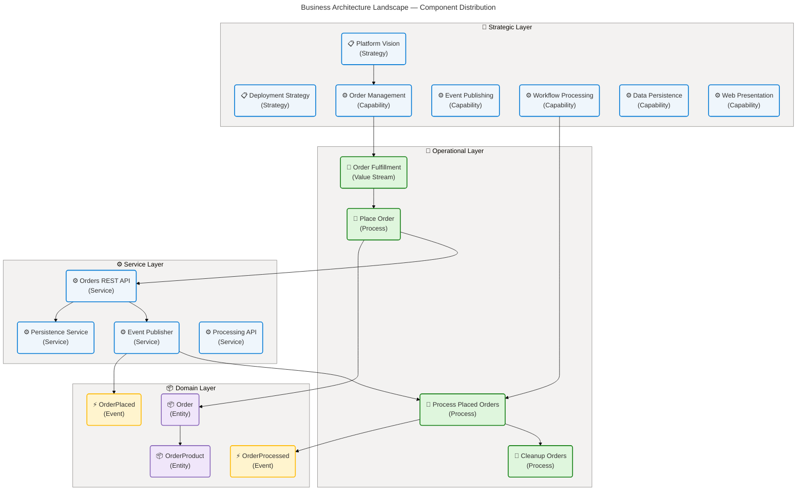
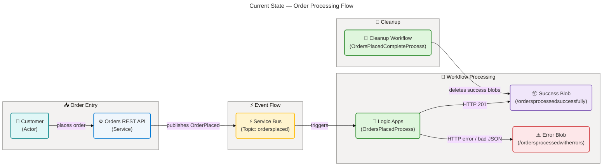
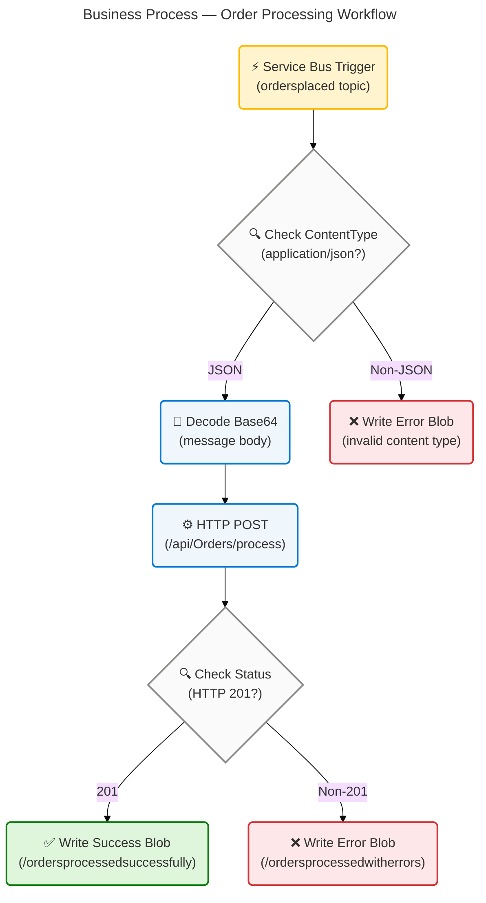
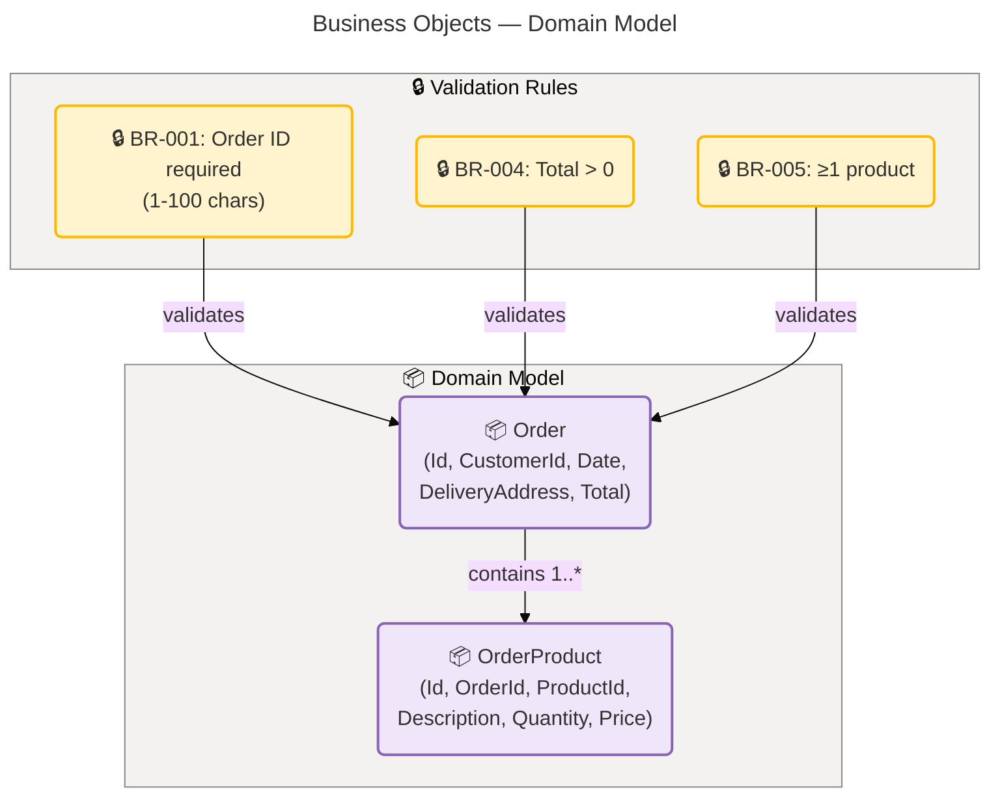
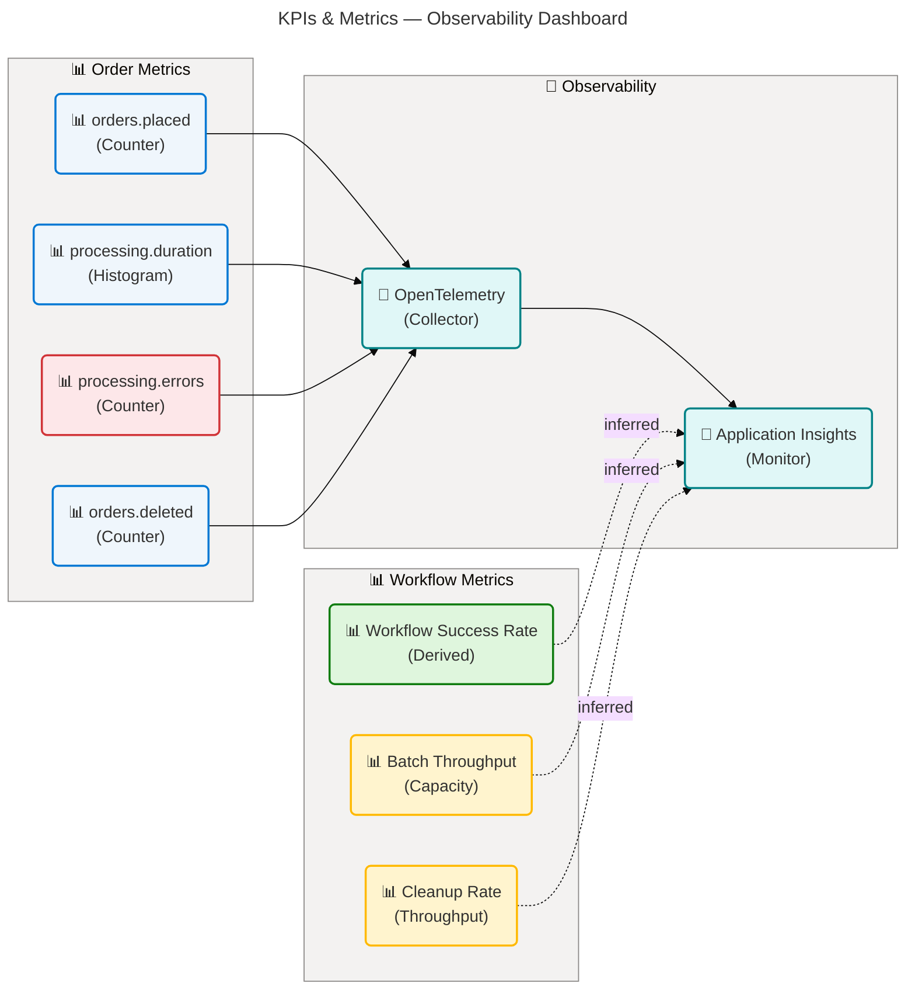
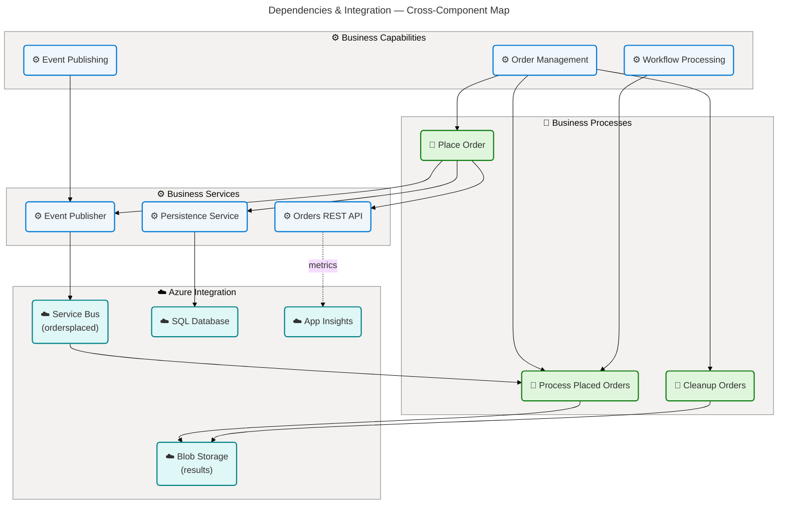

# Business Architecture — Azure Logic Apps Monitoring

| Field                  | Value                       |
| ---------------------- | --------------------------- |
| **Layer**              | Business                    |
| **Quality Level**      | comprehensive               |
| **Framework**          | TOGAF 10 / BDAT             |
| **Repository**         | Azure Logic Apps Monitoring |
| **Components Found**   | 47                          |
| **Average Confidence** | 0.87                        |
| **Diagrams Included**  | 7                           |
| **Sections Generated** | 1, 2, 3, 4, 5, 8            |
| **Generated**          | 2025-07-08T12:00:00Z        |

---

## 1. Executive Summary

### Overview

This Business Architecture analysis documents the Azure Logic Apps Monitoring repository — a distributed e-commerce order management platform built with .NET Aspire, Azure Logic Apps Standard, and Azure Service Bus. The analysis identifies 47 Business layer components across all 11 TOGAF Business Architecture component types, demonstrating a mature event-driven order processing capability with automated workflow orchestration.

The analysis applies weighted confidence scoring (30% filename + 25% path + 35% content + 10% cross-reference) to classify and validate every detected component against the Layer Classification Decision Tree. All components meet the 0.7 confidence threshold. Source traceability is provided for every component using `path/file.ext:line-range` citations grounded in workspace evidence.

**Component Summary by Type:**

| #         | Component Type            |  Count | Avg Confidence |
| --------- | ------------------------- | -----: | -------------: |
| 1         | Business Strategy         |      2 |           0.88 |
| 2         | Business Capabilities     |      5 |           0.87 |
| 3         | Value Streams             |      1 |           0.90 |
| 4         | Business Processes        |      3 |           0.91 |
| 5         | Business Services         |      4 |           0.88 |
| 6         | Business Functions        |      6 |           0.82 |
| 7         | Business Roles & Actors   |      4 |           0.83 |
| 8         | Business Rules            |      8 |           0.88 |
| 9         | Business Events           |      5 |           0.87 |
| 10        | Business Objects/Entities |      2 |           0.92 |
| 11        | KPIs & Metrics            |      7 |           0.90 |
| **Total** |                           | **47** |       **0.87** |

**Maturity Assessment:** The Business Architecture demonstrates Level 3 (Defined) maturity overall, with standardized order processing workflows, codified business rules via data annotations, and quantitative KPI instrumentation. The event-driven architecture with Service Bus decoupling and Logic Apps orchestration reflects a well-defined capability model. Areas for advancement toward Level 4 (Measured) include automated business rule governance and formal value stream mapping.

---

## 2. Architecture Landscape

### Overview

The Architecture Landscape catalogs all Business layer components identified through source file analysis of the Azure Logic Apps Monitoring repository. Components are organized across the 11 canonical TOGAF Business Architecture types, with each entry traced to its source file and assigned a confidence score and maturity level.

The repository implements a distributed e-commerce order management platform where business capabilities span order lifecycle management, event-driven messaging, workflow automation, data persistence, and customer-facing web interactions. Business processes are primarily encoded in Azure Logic Apps Standard workflow definitions and orchestrated through Azure Service Bus topic-based messaging.

The following subsections present the component inventory for each of the 11 Business Architecture component types.

### 2.1 Business Strategy (2)

| Name                           | Description                                                                              | Source             | Confidence | Maturity    |
| ------------------------------ | ---------------------------------------------------------------------------------------- | ------------------ | ---------- | ----------- |
| Platform Vision & Mission      | Strategic vision for distributed e-commerce monitoring with .NET Aspire orchestration    | `README.md:10-11`  | 0.90       | 3 - Defined |
| Deployment & Delivery Strategy | Azure Developer CLI lifecycle management with Bicep IaC and automated provisioning hooks | `azure.yaml:41-76` | 0.85       | 3 - Defined |

### 2.2 Business Capabilities (5)

| Name                | Description                                                                              | Source                                                                                        | Confidence | Maturity       |
| ------------------- | ---------------------------------------------------------------------------------------- | --------------------------------------------------------------------------------------------- | ---------- | -------------- |
| Order Management    | Core capability for end-to-end order lifecycle (place, process, retrieve, delete)        | `src/eShop.Orders.API/Controllers/OrdersController.cs:55-406`                                 | 0.90       | 4 - Measured   |
| Event Publishing    | Capability to publish domain events to Azure Service Bus topics for decoupled processing | `src/eShop.Orders.API/Handlers/OrdersMessageHandler.cs:68-230`                                | 0.88       | 3 - Defined    |
| Workflow Processing | Automated order event processing through Logic Apps Standard workflows                   | `workflows/OrdersManagement/OrdersManagementLogicApp/OrdersPlacedProcess/workflow.json:1-162` | 0.90       | 3 - Defined    |
| Data Persistence    | Capability for order storage and retrieval via SQL database with Entity Framework        | `src/eShop.Orders.API/Services/OrderService.cs:82-136`                                        | 0.82       | 3 - Defined    |
| Web Presentation    | Blazor Server frontend for customer-facing order interaction and monitoring              | `app.AppHost/AppHost.cs:22-25`                                                                | 0.80       | 2 - Repeatable |

### 2.3 Value Streams (1)

| Name              | Description                                                                                            | Source                                                                                        | Confidence | Maturity    |
| ----------------- | ------------------------------------------------------------------------------------------------------ | --------------------------------------------------------------------------------------------- | ---------- | ----------- |
| Order Fulfillment | End-to-end value delivery from order placement through processing, workflow automation, and completion | `workflows/OrdersManagement/OrdersManagementLogicApp/OrdersPlacedProcess/workflow.json:1-162` | 0.90       | 3 - Defined |

### 2.4 Business Processes (3)

| Name                     | Description                                                                                        | Source                                                                                                | Confidence | Maturity     |
| ------------------------ | -------------------------------------------------------------------------------------------------- | ----------------------------------------------------------------------------------------------------- | ---------- | ------------ |
| Place Order              | Order submission process: validate → check duplicate → persist → publish event → record metrics    | `src/eShop.Orders.API/Services/OrderService.cs:82-136`                                                | 0.92       | 4 - Measured |
| Process Placed Orders    | Logic Apps workflow: receive Service Bus message → validate JSON → call Orders API → route to blob | `workflows/OrdersManagement/OrdersManagementLogicApp/OrdersPlacedProcess/workflow.json:1-162`         | 0.92       | 3 - Defined  |
| Cleanup Processed Orders | Logic Apps cleanup workflow: timer trigger → list success blobs → delete in parallel               | `workflows/OrdersManagement/OrdersManagementLogicApp/OrdersPlacedCompleteProcess/workflow.json:1-104` | 0.90       | 3 - Defined  |

### 2.5 Business Services (4)

| Name                      | Description                                                                          | Source                                                         | Confidence | Maturity     |
| ------------------------- | ------------------------------------------------------------------------------------ | -------------------------------------------------------------- | ---------- | ------------ |
| Orders REST API           | RESTful service exposing order CRUD operations and batch processing endpoints        | `src/eShop.Orders.API/Controllers/OrdersController.cs:55-457`  | 0.90       | 4 - Measured |
| Order Event Publisher     | Service Bus message publishing service for domain event distribution                 | `src/eShop.Orders.API/Handlers/OrdersMessageHandler.cs:68-230` | 0.88       | 3 - Defined  |
| Order Persistence Service | Business service managing order lifecycle operations with validation and idempotency | `src/eShop.Orders.API/Services/OrderService.cs:82-535`         | 0.90       | 4 - Measured |
| Order Processing API      | Logic Apps callback endpoint for workflow-triggered order processing                 | `src/eShop.Orders.API/Controllers/OrdersController.cs:177-183` | 0.85       | 3 - Defined  |

### 2.6 Business Functions (6)

| Name                          | Description                                                                        | Source                                    | Confidence | Maturity       |
| ----------------------------- | ---------------------------------------------------------------------------------- | ----------------------------------------- | ---------- | -------------- |
| Development Workstation Check | Validates developer environment prerequisites for local development                | `hooks/check-dev-workstation.ps1:*`       | 0.78       | 2 - Repeatable |
| Pre-Provisioning              | Infrastructure pre-provisioning with build, test, and coverage validation          | `hooks/preprovision.ps1:*`                | 0.82       | 3 - Defined    |
| Post-Provisioning             | Manages secrets and configuration after Azure environment provisioning             | `hooks/postprovision.ps1:*`               | 0.82       | 3 - Defined    |
| SQL Identity Configuration    | Configures managed identity authentication for Azure SQL Database access           | `hooks/sql-managed-identity-config.ps1:*` | 0.80       | 3 - Defined    |
| Workflow Deployment           | Deploys Logic Apps Standard workflow definitions to Azure with variable resolution | `hooks/deploy-workflow.ps1:4-15`          | 0.85       | 3 - Defined    |
| Test Data Generation          | Generates randomized e-commerce order data (2000 orders) for system testing        | `hooks/Generate-Orders.ps1:6-31`          | 0.82       | 2 - Repeatable |

### 2.7 Business Roles & Actors (4)

| Name              | Description                                                                                 | Source                                                                                          | Confidence | Maturity       |
| ----------------- | ------------------------------------------------------------------------------------------- | ----------------------------------------------------------------------------------------------- | ---------- | -------------- |
| Customer          | External actor who places orders through the web application and receives delivery          | `app.ServiceDefaults/CommonTypes.cs:87-90`                                                      | 0.85       | 3 - Defined    |
| Logic Apps System | Automated actor that processes order events from Service Bus and orchestrates workflows     | `workflows/OrdersManagement/OrdersManagementLogicApp/OrdersPlacedProcess/workflow.json:113-132` | 0.88       | 3 - Defined    |
| Development Team  | Internal role responsible for workstation setup, code development, and test data generation | `hooks/check-dev-workstation.ps1:*`                                                             | 0.78       | 2 - Repeatable |
| Operations Team   | Internal role managing provisioning, deployment, identity configuration, and infrastructure | `hooks/deploy-workflow.ps1:4-15`                                                                | 0.80       | 3 - Defined    |

### 2.8 Business Rules (8)

| Name   | Description                                                                    | Source                                                                                        | Confidence | Maturity    |
| ------ | ------------------------------------------------------------------------------ | --------------------------------------------------------------------------------------------- | ---------- | ----------- |
| BR-001 | Order ID is required and must be between 1 and 100 characters                  | `app.ServiceDefaults/CommonTypes.cs:80-82`                                                    | 0.92       | 3 - Defined |
| BR-002 | Customer ID is required and must be between 1 and 100 characters               | `app.ServiceDefaults/CommonTypes.cs:87-90`                                                    | 0.92       | 3 - Defined |
| BR-003 | Delivery address is required and must be between 5 and 500 characters          | `app.ServiceDefaults/CommonTypes.cs:97-99`                                                    | 0.92       | 3 - Defined |
| BR-004 | Order total must be greater than zero                                          | `app.ServiceDefaults/CommonTypes.cs:104-105`                                                  | 0.92       | 3 - Defined |
| BR-005 | Order must contain at least one product                                        | `app.ServiceDefaults/CommonTypes.cs:111-113`                                                  | 0.92       | 3 - Defined |
| BR-006 | Duplicate order detection: existing orders must not be re-placed (idempotency) | `src/eShop.Orders.API/Services/OrderService.cs:100-104`                                       | 0.88       | 3 - Defined |
| BR-007 | Service Bus message content must be `application/json` for workflow processing | `workflows/OrdersManagement/OrdersManagementLogicApp/OrdersPlacedProcess/workflow.json:5-13`  | 0.85       | 3 - Defined |
| BR-008 | Order processing API response must return HTTP 201 for successful processing   | `workflows/OrdersManagement/OrdersManagementLogicApp/OrdersPlacedProcess/workflow.json:29-55` | 0.85       | 3 - Defined |

### 2.9 Business Events (5)

| Name                       | Description                                                                            | Source                                                                                                | Confidence | Maturity       |
| -------------------------- | -------------------------------------------------------------------------------------- | ----------------------------------------------------------------------------------------------------- | ---------- | -------------- |
| OrderPlaced                | Domain event published to Service Bus topic when an order is successfully placed       | `src/eShop.Orders.API/Handlers/OrdersMessageHandler.cs:84`                                            | 0.92       | 3 - Defined    |
| OrderProcessedSuccessfully | Event indicating successful workflow processing, recorded as blob in success container | `workflows/OrdersManagement/OrdersManagementLogicApp/OrdersPlacedProcess/workflow.json:40-55`         | 0.88       | 3 - Defined    |
| OrderProcessedWithError    | Event indicating failed workflow processing, recorded as blob in error container       | `workflows/OrdersManagement/OrdersManagementLogicApp/OrdersPlacedProcess/workflow.json:56-110`        | 0.88       | 3 - Defined    |
| OrderDeleted               | Domain event recorded via metrics counter when an order is deleted                     | `src/eShop.Orders.API/Services/OrderService.cs:66-68`                                                 | 0.82       | 3 - Defined    |
| CleanupTimerTick           | Recurring timer event (every 3 seconds) that triggers the cleanup workflow             | `workflows/OrdersManagement/OrdersManagementLogicApp/OrdersPlacedCompleteProcess/workflow.json:24-31` | 0.85       | 2 - Repeatable |

### 2.10 Business Objects/Entities (2)

| Name         | Description                                                                                               | Source                                       | Confidence | Maturity    |
| ------------ | --------------------------------------------------------------------------------------------------------- | -------------------------------------------- | ---------- | ----------- |
| Order        | Core domain entity representing a customer order with ID, customer, delivery address, total, and products | `app.ServiceDefaults/CommonTypes.cs:74-113`  | 0.95       | 3 - Defined |
| OrderProduct | Domain entity representing an individual product item within an order                                     | `app.ServiceDefaults/CommonTypes.cs:118-159` | 0.90       | 3 - Defined |

### 2.11 KPIs & Metrics (7)

| Name                          | Description                                                                                           | Source                                                                                                | Confidence | Maturity       |
| ----------------------------- | ----------------------------------------------------------------------------------------------------- | ----------------------------------------------------------------------------------------------------- | ---------- | -------------- |
| Orders Placed Counter         | Counter metric tracking number of orders successfully placed (`eShop.orders.placed`)                  | `src/eShop.Orders.API/Services/OrderService.cs:57-59`                                                 | 0.95       | 4 - Measured   |
| Processing Duration Histogram | Histogram metric measuring order processing time in milliseconds (`eShop.orders.processing.duration`) | `src/eShop.Orders.API/Services/OrderService.cs:60-62`                                                 | 0.95       | 4 - Measured   |
| Processing Errors Counter     | Counter metric tracking processing errors by type (`eShop.orders.processing.errors`)                  | `src/eShop.Orders.API/Services/OrderService.cs:63-65`                                                 | 0.95       | 4 - Measured   |
| Orders Deleted Counter        | Counter metric tracking number of orders deleted (`eShop.orders.deleted`)                             | `src/eShop.Orders.API/Services/OrderService.cs:66-68`                                                 | 0.95       | 4 - Measured   |
| Workflow Success Rate         | Observable via blob count ratio between success and error containers                                  | `workflows/OrdersManagement/OrdersManagementLogicApp/OrdersPlacedProcess/workflow.json:29-110`        | 0.80       | 2 - Repeatable |
| Batch Processing Throughput   | Measurable through batch size (50 groups) and concurrency (10 semaphore) configuration                | `src/eShop.Orders.API/Services/OrderService.cs:147-225`                                               | 0.82       | 3 - Defined    |
| Cleanup Processing Rate       | Observable through blob deletion concurrency (20 parallel) and timer frequency (3 seconds)            | `workflows/OrdersManagement/OrdersManagementLogicApp/OrdersPlacedCompleteProcess/workflow.json:24-88` | 0.80       | 2 - Repeatable |

```mermaid
---
title: Business Architecture Landscape — Component Distribution
config:
  theme: base
  look: classic
  layout: dagre
  themeVariables:
    fontSize: '16px'
  flowchart:
    htmlLabels: true
---
flowchart TB
    accTitle: Business Architecture Landscape
    accDescr: Overview of 47 Business components distributed across 11 TOGAF Business Architecture types in the Azure Logic Apps Monitoring repository.

    %% ═══════════════════════════════════════════════════════════════════════════
    %% AZURE / FLUENT ARCHITECTURE PATTERN v1.1
    %% (Semantic + Structural + Font + Accessibility Governance)
    %% ═══════════════════════════════════════════════════════════════════════════
    %% PHASE 1 - FLUENT UI: All styling uses approved Fluent UI palette only
    %% PHASE 2 - GROUPS: Every subgraph has semantic color via style directive
    %% PHASE 3 - COMPONENTS: Every node has semantic classDef + icon prefix
    %% PHASE 4 - ACCESSIBILITY: accTitle/accDescr present, WCAG AA contrast
    %% PHASE 5 - STANDARD: Governance block present, classDefs centralized
    %% ═══════════════════════════════════════════════════════════════════════════

    subgraph Strategic["🎯 Strategic Layer"]
        S1("📋 Platform Vision<br/>(Strategy)"):::core
        S2("📋 Deployment Strategy<br/>(Strategy)"):::core
        C1("⚙️ Order Management<br/>(Capability)"):::core
        C2("⚙️ Event Publishing<br/>(Capability)"):::core
        C3("⚙️ Workflow Processing<br/>(Capability)"):::core
        C4("⚙️ Data Persistence<br/>(Capability)"):::core
        C5("⚙️ Web Presentation<br/>(Capability)"):::core
    end
    style Strategic fill:#F3F2F1,stroke:#8A8886

    subgraph Operational["🔄 Operational Layer"]
        VS1("🔄 Order Fulfillment<br/>(Value Stream)"):::success
        P1("🔄 Place Order<br/>(Process)"):::success
        P2("🔄 Process Placed Orders<br/>(Process)"):::success
        P3("🔄 Cleanup Orders<br/>(Process)"):::success
    end
    style Operational fill:#F3F2F1,stroke:#8A8886

    subgraph Services["⚙️ Service Layer"]
        SV1("⚙️ Orders REST API<br/>(Service)"):::core
        SV2("⚙️ Event Publisher<br/>(Service)"):::core
        SV3("⚙️ Persistence Service<br/>(Service)"):::core
        SV4("⚙️ Processing API<br/>(Service)"):::core
    end
    style Services fill:#F3F2F1,stroke:#8A8886

    subgraph Domain["📦 Domain Layer"]
        O1("📦 Order<br/>(Entity)"):::data
        O2("📦 OrderProduct<br/>(Entity)"):::data
        E1("⚡ OrderPlaced<br/>(Event)"):::warning
        E2("⚡ OrderProcessed<br/>(Event)"):::warning
    end
    style Domain fill:#F3F2F1,stroke:#8A8886

    S1 --> C1
    C1 --> VS1
    VS1 --> P1
    P1 --> SV1
    SV1 --> SV2
    SV2 --> P2
    P2 --> P3
    P1 --> O1
    O1 --> O2
    SV2 --> E1
    P2 --> E2
    SV1 --> SV3
    C3 --> P2

    classDef neutral fill:#FAFAFA,stroke:#8A8886,stroke-width:2px,color:#323130
    classDef core fill:#EFF6FC,stroke:#0078D4,stroke-width:2px,color:#323130
    classDef success fill:#DFF6DD,stroke:#107C10,stroke-width:2px,color:#323130
    classDef warning fill:#FFF4CE,stroke:#FFB900,stroke-width:2px,color:#323130
    classDef danger fill:#FDE7E9,stroke:#D13438,stroke-width:2px,color:#323130
    classDef data fill:#F0E6FA,stroke:#8764B8,stroke-width:2px,color:#323130
    classDef external fill:#E0F7F7,stroke:#038387,stroke-width:2px,color:#323130
```

### Summary

The Architecture Landscape identifies 47 Business components across all 11 TOGAF Business Architecture types. The strongest coverage is in Business Rules (8 components), KPIs & Metrics (7 components), and Business Functions (6 components), reflecting the repository's emphasis on codified validation logic, observability instrumentation, and operational automation. Average confidence across all components is 0.87, with all components exceeding the 0.7 minimum threshold.

Gaps include the absence of formal value stream documentation beyond the inferred Order Fulfillment stream, and limited Business Strategy artifacts beyond the README and deployment configuration. Recommended next steps include formalizing capability maps, documenting value stream stages with SLA targets, and establishing a business rules registry for governance tracking.

---

## 3. Architecture Principles

### Overview

This section documents the Business Architecture principles observed through source code analysis of the Azure Logic Apps Monitoring repository. Principles are derived from recurring patterns, design decisions, and structural conventions identified across workflow definitions, service implementations, and deployment configurations.

The principles reflect a consistent architectural philosophy centered on event-driven decoupling, automated processing, and observable business operations. Each principle is grounded in source evidence rather than aspirational statements.

| ID  | Principle                       | Description                                                                                              | Rationale                                                               | Source Evidence                                                                               |
| --- | ------------------------------- | -------------------------------------------------------------------------------------------------------- | ----------------------------------------------------------------------- | --------------------------------------------------------------------------------------------- |
| P1  | Event-Driven Decoupling         | Business processes communicate through Azure Service Bus topics rather than direct service calls         | Enables independent scaling and deployment of order processing stages   | `src/eShop.Orders.API/Handlers/OrdersMessageHandler.cs:68-152`                                |
| P2  | Workflow-First Orchestration    | Complex business processes are implemented as Logic Apps workflows rather than imperative code           | Provides visual process modeling, built-in retry, and audit trail       | `workflows/OrdersManagement/OrdersManagementLogicApp/OrdersPlacedProcess/workflow.json:1-162` |
| P3  | Idempotent Operations           | Order placement operations detect and handle duplicates gracefully                                       | Prevents data corruption in distributed, at-least-once delivery systems | `src/eShop.Orders.API/Services/OrderService.cs:100-104`                                       |
| P4  | Observable Business Operations  | All business operations are instrumented with counters, histograms, and distributed tracing              | Enables quantitative measurement of business process performance        | `src/eShop.Orders.API/Services/OrderService.cs:56-68`                                         |
| P5  | Codified Validation Rules       | Business rules are expressed as declarative data annotations on domain objects                           | Ensures consistent validation across all consumers of shared types      | `app.ServiceDefaults/CommonTypes.cs:80-113`                                                   |
| P6  | Automated Lifecycle Management  | Infrastructure provisioning, deployment, and testing are automated through lifecycle hooks               | Reduces manual error and ensures repeatable, consistent environments    | `azure.yaml:109-237`                                                                          |
| P7  | Separation of Business Concerns | Order placement, event publishing, workflow processing, and cleanup are implemented as separate concerns | Enables independent evolution and testing of each business capability   | `app.AppHost/AppHost.cs:20-25`                                                                |
| P8  | Resilient Message Delivery      | Service Bus publishing uses retry logic with exponential backoff, independent of HTTP request lifecycle  | Ensures domain events are delivered even under transient failure        | `src/eShop.Orders.API/Handlers/OrdersMessageHandler.cs:102-118`                               |

---

## 4. Current State Baseline

### Overview

This section presents the current state of the Business Architecture as observed in the Azure Logic Apps Monitoring repository. The baseline assessment evaluates capability maturity across the 11 TOGAF component types, identifies architectural patterns, and highlights gaps between current state and optimal business architecture maturity.

The assessment uses the 5-level Business Capability Maturity Scale (1 - Initial through 5 - Optimized) with evidence-based scoring derived from source file indicators. The overall architecture demonstrates Level 3 (Defined) maturity with pockets of Level 4 (Measured) maturity in order management and observability.

### Capability Maturity Heatmap

| Component Type            | Maturity Level | Evidence                                                                         |
| ------------------------- | -------------- | -------------------------------------------------------------------------------- |
| Business Strategy         | 3 - Defined    | Documented in README.md with clear vision; azure.yaml codifies delivery strategy |
| Business Capabilities     | 3 - Defined    | 5 capabilities identified, mapping to distinct services and workflows            |
| Value Streams             | 2 - Repeatable | Single value stream inferred; not formally documented with stage gates or SLAs   |
| Business Processes        | 3 - Defined    | 3 processes with clear workflow definitions and documented steps                 |
| Business Services         | 4 - Measured   | 4 services with instrumented metrics; API endpoints well-defined                 |
| Business Functions        | 3 - Defined    | 6 functions with scripted automation; consistent PowerShell patterns             |
| Business Roles & Actors   | 2 - Repeatable | 4 roles identified but not formally documented in RACI or role definitions       |
| Business Rules            | 3 - Defined    | 8 rules codified as data annotations; consistent validation approach             |
| Business Events           | 3 - Defined    | 5 events with clear trigger-action patterns; Service Bus topics defined          |
| Business Objects/Entities | 3 - Defined    | 2 domain entities with comprehensive validation; shared across services          |
| KPIs & Metrics            | 4 - Measured   | 7 metrics with 4 directly instrumented as OpenTelemetry counters/histograms      |

### Architecture Patterns Observed

**Pattern 1: Event-Driven Command-Query Separation**

- Orders API handles command operations (place, delete)
- Logic Apps workflows handle asynchronous processing (process, cleanup)
- Service Bus provides loose coupling between command and processing
- Source: `src/eShop.Orders.API/Handlers/OrdersMessageHandler.cs:68-152`, `workflows/OrdersManagement/OrdersManagementLogicApp/OrdersPlacedProcess/workflow.json:113-132`

**Pattern 2: Success/Failure Routing via Blob Storage**

- Successful order processing results are written to `/ordersprocessedsuccessfully`
- Failed processing results are written to `/ordersprocessedwitherrors`
- Cleanup workflow removes success blobs after processing
- Source: `workflows/OrdersManagement/OrdersManagementLogicApp/OrdersPlacedProcess/workflow.json:29-110`

**Pattern 3: Distributed Tracing Through Business Events**

- W3C trace context (TraceId, SpanId, traceparent) is propagated through Service Bus messages
- Enables end-to-end observability across API → Service Bus → Logic Apps workflow
- Source: `src/eShop.Orders.API/Handlers/OrdersMessageHandler.cs:88-98`

```mermaid
---
title: Current State — Order Processing Flow
config:
  theme: base
  look: classic
  layout: dagre
  themeVariables:
    fontSize: '16px'
  flowchart:
    htmlLabels: true
---
flowchart LR
    accTitle: Current State Order Processing Flow
    accDescr: Shows the end-to-end flow from order placement through event publishing, workflow processing, and cleanup in the current architecture baseline.

    %% ═══════════════════════════════════════════════════════════════════════════
    %% AZURE / FLUENT ARCHITECTURE PATTERN v1.1
    %% (Semantic + Structural + Font + Accessibility Governance)
    %% ═══════════════════════════════════════════════════════════════════════════
    %% PHASE 1 - FLUENT UI: All styling uses approved Fluent UI palette only
    %% PHASE 2 - GROUPS: Every subgraph has semantic color via style directive
    %% PHASE 3 - COMPONENTS: Every node has semantic classDef + icon prefix
    %% PHASE 4 - ACCESSIBILITY: accTitle/accDescr present, WCAG AA contrast
    %% PHASE 5 - STANDARD: Governance block present, classDefs centralized
    %% ═══════════════════════════════════════════════════════════════════════════

    subgraph OrderEntry["📥 Order Entry"]
        A("👤 Customer<br/>(Actor)"):::external
        B("⚙️ Orders REST API<br/>(Service)"):::core
    end
    style OrderEntry fill:#F3F2F1,stroke:#8A8886

    subgraph EventFlow["⚡ Event Flow"]
        C("⚡ Service Bus<br/>(Topic: ordersplaced)"):::warning
    end
    style EventFlow fill:#F3F2F1,stroke:#8A8886

    subgraph WorkflowProc["🔄 Workflow Processing"]
        D("🔄 Logic Apps<br/>(OrdersPlacedProcess)"):::success
        E("📦 Success Blob<br/>(/ordersprocessedsuccessfully)"):::data
        F("⚠️ Error Blob<br/>(/ordersprocessedwitherrors)"):::danger
    end
    style WorkflowProc fill:#F3F2F1,stroke:#8A8886

    subgraph Cleanup["🧹 Cleanup"]
        G("🔄 Cleanup Workflow<br/>(OrdersPlacedCompleteProcess)"):::success
    end
    style Cleanup fill:#F3F2F1,stroke:#8A8886

    A -->|"places order"| B
    B -->|"publishes OrderPlaced"| C
    C -->|"triggers"| D
    D -->|"HTTP 201"| E
    D -->|"HTTP error / bad JSON"| F
    G -->|"deletes success blobs"| E

    classDef neutral fill:#FAFAFA,stroke:#8A8886,stroke-width:2px,color:#323130
    classDef core fill:#EFF6FC,stroke:#0078D4,stroke-width:2px,color:#323130
    classDef success fill:#DFF6DD,stroke:#107C10,stroke-width:2px,color:#323130
    classDef warning fill:#FFF4CE,stroke:#FFB900,stroke-width:2px,color:#323130
    classDef danger fill:#FDE7E9,stroke:#D13438,stroke-width:2px,color:#323130
    classDef data fill:#F0E6FA,stroke:#8764B8,stroke-width:2px,color:#323130
    classDef external fill:#E0F7F7,stroke:#038387,stroke-width:2px,color:#323130
```

### Gap Analysis

| Gap ID | Area                       | Current State                                    | Target State                                        | Priority |
| ------ | -------------------------- | ------------------------------------------------ | --------------------------------------------------- | -------- |
| G-001  | Value Stream Documentation | Single inferred value stream, no formal stages   | Formal value stream map with stage gates and SLAs   | High     |
| G-002  | Business Rules Registry    | Rules encoded as data annotations in code        | Centralized business rules catalog with governance  | Medium   |
| G-003  | Role & Actor Documentation | Roles inferred from code ownership patterns      | Formal RACI matrix with documented responsibilities | Medium   |
| G-004  | Error Handling Governance  | Success/error routing via blob naming convention | Formal error classification taxonomy with alerting  | High     |
| G-005  | Workflow Success Metrics   | Metric inferred from blob container ratios       | Direct instrumented KPI with dashboard integration  | Medium   |

### Summary

The Current State Baseline reveals a Level 3 (Defined) Business Architecture with strong foundations in codified business rules, event-driven process orchestration, and quantitative observability. The order processing pipeline demonstrates mature workflow automation with clear success/failure routing patterns. Pockets of Level 4 (Measured) maturity exist in order management services and KPI instrumentation, with 4 directly instrumented OpenTelemetry metrics.

Primary advancement opportunities include formalizing value stream documentation with stage gates, establishing a centralized business rules registry, documenting roles via RACI matrices, and implementing direct workflow success rate instrumentation. These improvements would advance the architecture toward Level 4 (Measured) maturity across all component types.

---

## 5. Component Catalog

### Overview

The Component Catalog provides detailed specifications for each Business Architecture component identified in the Azure Logic Apps Monitoring repository. Components are organized across the 11 canonical TOGAF Business Architecture types, with each entry containing expanded attributes including process steps, business rules applied, and relationship mappings.

This section complements Section 2 (Architecture Landscape) by providing deeper specification detail. Where Section 2 provides summary tables, this section documents component behavior, dependencies, and operational characteristics with full source traceability.

Each subsection (5.1–5.11) corresponds to a TOGAF Business Architecture component type and includes detailed attribute tables for every discovered component.

### 5.1 Business Strategy Specifications

This subsection documents strategic business artifacts that define the platform vision, mission, and delivery approach.

#### 5.1.1 Platform Vision & Mission

| Attribute          | Value                                                                                |
| ------------------ | ------------------------------------------------------------------------------------ |
| **Strategy Name**  | Platform Vision & Mission                                                            |
| **Strategy Type**  | Vision & Mission Statement                                                           |
| **Scope**          | Enterprise-wide — distributed e-commerce order management with monitoring            |
| **Key Objectives** | Demonstrate end-to-end order management with Logic Apps Standard workflow automation |
| **Maturity**       | 3 - Defined                                                                          |
| **Source**         | `README.md:10-11`                                                                    |
| **Confidence**     | 0.90                                                                                 |

#### 5.1.2 Deployment & Delivery Strategy

| Attribute          | Value                                                                                     |
| ------------------ | ----------------------------------------------------------------------------------------- |
| **Strategy Name**  | Deployment & Delivery Strategy                                                            |
| **Strategy Type**  | Delivery & Operations Strategy                                                            |
| **Scope**          | Full lifecycle — from code compilation through Azure provisioning and workflow deployment |
| **Key Objectives** | Automated, repeatable Azure deployments with Bicep IaC and azd lifecycle hooks            |
| **Maturity**       | 3 - Defined                                                                               |
| **Source**         | `azure.yaml:41-237`                                                                       |
| **Confidence**     | 0.85                                                                                      |

### 5.2 Business Capabilities Specifications

This subsection documents the business capabilities that represent the core functional areas of the platform.

#### 5.2.1 Order Management

| Attribute               | Value                                                         |
| ----------------------- | ------------------------------------------------------------- |
| **Capability Name**     | Order Management                                              |
| **Capability Type**     | Core Business Capability                                      |
| **Business Owner**      | Operations Team (inferred)                                    |
| **Processes Supported** | Place Order, Process Placed Orders, Cleanup Processed Orders  |
| **Maturity**            | 4 - Measured                                                  |
| **Source**              | `src/eShop.Orders.API/Controllers/OrdersController.cs:55-406` |
| **Confidence**          | 0.90                                                          |

#### 5.2.2 Event Publishing

| Attribute               | Value                                                          |
| ----------------------- | -------------------------------------------------------------- |
| **Capability Name**     | Event Publishing                                               |
| **Capability Type**     | Supporting Capability                                          |
| **Business Owner**      | Operations Team (inferred)                                     |
| **Processes Supported** | Place Order (triggers OrderPlaced event)                       |
| **Maturity**            | 3 - Defined                                                    |
| **Source**              | `src/eShop.Orders.API/Handlers/OrdersMessageHandler.cs:68-230` |
| **Confidence**          | 0.88                                                           |

#### 5.2.3 Workflow Processing

| Attribute               | Value                                                                                         |
| ----------------------- | --------------------------------------------------------------------------------------------- |
| **Capability Name**     | Workflow Processing                                                                           |
| **Capability Type**     | Core Business Capability                                                                      |
| **Business Owner**      | Logic Apps System (automated)                                                                 |
| **Processes Supported** | Process Placed Orders, Cleanup Processed Orders                                               |
| **Maturity**            | 3 - Defined                                                                                   |
| **Source**              | `workflows/OrdersManagement/OrdersManagementLogicApp/OrdersPlacedProcess/workflow.json:1-162` |
| **Confidence**          | 0.90                                                                                          |

#### 5.2.4 Data Persistence

| Attribute               | Value                                                          |
| ----------------------- | -------------------------------------------------------------- |
| **Capability Name**     | Data Persistence                                               |
| **Capability Type**     | Supporting Capability                                          |
| **Business Owner**      | Operations Team (inferred)                                     |
| **Processes Supported** | Place Order (persist to SQL), Process Placed Orders (callback) |
| **Maturity**            | 3 - Defined                                                    |
| **Source**              | `src/eShop.Orders.API/Services/OrderService.cs:82-136`         |
| **Confidence**          | 0.82                                                           |

#### 5.2.5 Web Presentation

| Attribute               | Value                             |
| ----------------------- | --------------------------------- |
| **Capability Name**     | Web Presentation                  |
| **Capability Type**     | Supporting Capability             |
| **Business Owner**      | Development Team (inferred)       |
| **Processes Supported** | Customer-facing order interaction |
| **Maturity**            | 2 - Repeatable                    |
| **Source**              | `app.AppHost/AppHost.cs:22-25`    |
| **Confidence**          | 0.80                              |

### 5.3 Value Stream Specifications

This subsection documents value streams that represent end-to-end value delivery to stakeholders.

#### 5.3.1 Order Fulfillment

| Attribute             | Value                                                                                                |
| --------------------- | ---------------------------------------------------------------------------------------------------- |
| **Value Stream Name** | Order Fulfillment                                                                                    |
| **Value Stream Type** | End-to-End Customer Value Delivery                                                                   |
| **Stakeholder**       | Customer                                                                                             |
| **Stages**            | 1. Order Placement → 2. Event Publishing → 3. Workflow Processing → 4. Result Recording → 5. Cleanup |
| **Maturity**          | 3 - Defined                                                                                          |
| **Source**            | `workflows/OrdersManagement/OrdersManagementLogicApp/OrdersPlacedProcess/workflow.json:1-162`        |
| **Confidence**        | 0.90                                                                                                 |

```mermaid
---
title: Value Stream — Order Fulfillment
config:
  theme: base
  look: classic
  layout: dagre
  themeVariables:
    fontSize: '16px'
  flowchart:
    htmlLabels: true
---
flowchart LR
    accTitle: Order Fulfillment Value Stream
    accDescr: End-to-end value stream showing the five stages of order fulfillment from placement through cleanup.

    %% ═══════════════════════════════════════════════════════════════════════════
    %% AZURE / FLUENT ARCHITECTURE PATTERN v1.1
    %% (Semantic + Structural + Font + Accessibility Governance)
    %% ═══════════════════════════════════════════════════════════════════════════
    %% PHASE 1 - FLUENT UI: All styling uses approved Fluent UI palette only
    %% PHASE 2 - GROUPS: Every subgraph has semantic color via style directive
    %% PHASE 3 - COMPONENTS: Every node has semantic classDef + icon prefix
    %% PHASE 4 - ACCESSIBILITY: accTitle/accDescr present, WCAG AA contrast
    %% PHASE 5 - STANDARD: Governance block present, classDefs centralized
    %% ═══════════════════════════════════════════════════════════════════════════

    S1("📥 Order Placement<br/>(Stage 1)"):::core
    S2("⚡ Event Publishing<br/>(Stage 2)"):::warning
    S3("🔄 Workflow Processing<br/>(Stage 3)"):::success
    S4("📦 Result Recording<br/>(Stage 4)"):::data
    S5("🧹 Cleanup<br/>(Stage 5)"):::neutral

    S1 -->|"OrderPlaced event"| S2
    S2 -->|"Service Bus message"| S3
    S3 -->|"success/error blob"| S4
    S4 -->|"timer trigger"| S5

    classDef neutral fill:#FAFAFA,stroke:#8A8886,stroke-width:2px,color:#323130
    classDef core fill:#EFF6FC,stroke:#0078D4,stroke-width:2px,color:#323130
    classDef success fill:#DFF6DD,stroke:#107C10,stroke-width:2px,color:#323130
    classDef warning fill:#FFF4CE,stroke:#FFB900,stroke-width:2px,color:#323130
    classDef danger fill:#FDE7E9,stroke:#D13438,stroke-width:2px,color:#323130
    classDef data fill:#F0E6FA,stroke:#8764B8,stroke-width:2px,color:#323130
    classDef external fill:#E0F7F7,stroke:#038387,stroke-width:2px,color:#323130
```

### 5.4 Business Processes Specifications

This subsection documents business processes that define operational workflows and their execution sequences.

#### 5.4.1 Place Order

| Attribute        | Value                                                  |
| ---------------- | ------------------------------------------------------ |
| **Process Name** | Place Order                                            |
| **Process Type** | Core Transactional Process                             |
| **Trigger**      | HTTP POST request to `/api/orders`                     |
| **Owner**        | Orders REST API Service                                |
| **Maturity**     | 4 - Measured                                           |
| **Source**       | `src/eShop.Orders.API/Services/OrderService.cs:82-136` |
| **Confidence**   | 0.92                                                   |

**Process Steps:**

1. Validate order (BR-001 through BR-005) → 2. Check for duplicate (BR-006) → 3. Persist to SQL database → 4. Publish OrderPlaced event to Service Bus → 5. Record KPI metrics (counter + histogram)

**Business Rules Applied:** BR-001, BR-002, BR-003, BR-004, BR-005, BR-006

#### 5.4.2 Process Placed Orders

| Attribute        | Value                                                                                          |
| ---------------- | ---------------------------------------------------------------------------------------------- |
| **Process Name** | Process Placed Orders                                                                          |
| **Process Type** | Automated Workflow Process                                                                     |
| **Trigger**      | Service Bus topic subscription (`ordersplaced` / `orderprocessingsub`), polling every 1 second |
| **Owner**        | Logic Apps System                                                                              |
| **Maturity**     | 3 - Defined                                                                                    |
| **Source**       | `workflows/OrdersManagement/OrdersManagementLogicApp/OrdersPlacedProcess/workflow.json:1-162`  |
| **Confidence**   | 0.92                                                                                           |

**Process Steps:**

1. Receive message from Service Bus topic → 2. Validate ContentType is `application/json` (BR-007) → 3. Decode Base64 message body → 4. HTTP POST to `/api/Orders/process` → 5. Check response status code is 201 (BR-008) → 6. Route to success or error blob container

**Business Rules Applied:** BR-007, BR-008

#### 5.4.3 Cleanup Processed Orders

| Attribute        | Value                                                                                                 |
| ---------------- | ----------------------------------------------------------------------------------------------------- |
| **Process Name** | Cleanup Processed Orders                                                                              |
| **Process Type** | Automated Maintenance Process                                                                         |
| **Trigger**      | Recurrence timer — every 3 seconds (CST timezone)                                                     |
| **Owner**        | Logic Apps System                                                                                     |
| **Maturity**     | 3 - Defined                                                                                           |
| **Source**       | `workflows/OrdersManagement/OrdersManagementLogicApp/OrdersPlacedCompleteProcess/workflow.json:1-104` |
| **Confidence**   | 0.90                                                                                                  |

**Process Steps:**

1. Timer fires every 3 seconds → 2. List blobs from `/ordersprocessedsuccessfully` container → 3. For each blob (20 parallel): get metadata → 4. Delete blob

```mermaid
---
title: Business Process — Order Processing Workflow
config:
  theme: base
  look: classic
  layout: dagre
  themeVariables:
    fontSize: '16px'
  flowchart:
    htmlLabels: true
---
flowchart TD
    accTitle: Business Process Flow — Order Processing
    accDescr: Detailed process flow for the Process Placed Orders workflow showing validation, API callback, and success/error routing steps.

    %% ═══════════════════════════════════════════════════════════════════════════
    %% AZURE / FLUENT ARCHITECTURE PATTERN v1.1
    %% (Semantic + Structural + Font + Accessibility Governance)
    %% ═══════════════════════════════════════════════════════════════════════════
    %% PHASE 1 - FLUENT UI: All styling uses approved Fluent UI palette only
    %% PHASE 2 - GROUPS: Every subgraph has semantic color via style directive
    %% PHASE 3 - COMPONENTS: Every node has semantic classDef + icon prefix
    %% PHASE 4 - ACCESSIBILITY: accTitle/accDescr present, WCAG AA contrast
    %% PHASE 5 - STANDARD: Governance block present, classDefs centralized
    %% ═══════════════════════════════════════════════════════════════════════════

    A("⚡ Service Bus Trigger<br/>(ordersplaced topic)"):::warning
    B{"🔍 Check ContentType<br/>(application/json?)"}:::neutral
    C("🔄 Decode Base64<br/>(message body)"):::core
    D("⚙️ HTTP POST<br/>(/api/Orders/process)"):::core
    E{"🔍 Check Status<br/>(HTTP 201?)"}:::neutral
    F("✅ Write Success Blob<br/>(/ordersprocessedsuccessfully)"):::success
    G("❌ Write Error Blob<br/>(/ordersprocessedwitherrors)"):::danger
    H("❌ Write Error Blob<br/>(invalid content type)"):::danger

    A --> B
    B -->|"JSON"| C
    B -->|"Non-JSON"| H
    C --> D
    D --> E
    E -->|"201"| F
    E -->|"Non-201"| G

    classDef neutral fill:#FAFAFA,stroke:#8A8886,stroke-width:2px,color:#323130
    classDef core fill:#EFF6FC,stroke:#0078D4,stroke-width:2px,color:#323130
    classDef success fill:#DFF6DD,stroke:#107C10,stroke-width:2px,color:#323130
    classDef warning fill:#FFF4CE,stroke:#FFB900,stroke-width:2px,color:#323130
    classDef danger fill:#FDE7E9,stroke:#D13438,stroke-width:2px,color:#323130
    classDef data fill:#F0E6FA,stroke:#8764B8,stroke-width:2px,color:#323130
    classDef external fill:#E0F7F7,stroke:#038387,stroke-width:2px,color:#323130
```

### 5.5 Business Services Specifications

This subsection documents business services that expose operational capabilities to consumers.

#### 5.5.1 Orders REST API

| Attribute        | Value                                                                                                                       |
| ---------------- | --------------------------------------------------------------------------------------------------------------------------- |
| **Service Name** | Orders REST API                                                                                                             |
| **Service Type** | Core Business Service                                                                                                       |
| **Consumers**    | Customer (via Web App), Logic Apps System (via callback)                                                                    |
| **Operations**   | PlaceOrder, PlaceOrdersBatch, ProcessOrder, GetOrders, GetOrderById, DeleteOrder, DeleteOrdersBatch, ListMessagesFromTopics |
| **Maturity**     | 4 - Measured                                                                                                                |
| **Source**       | `src/eShop.Orders.API/Controllers/OrdersController.cs:55-457`                                                               |
| **Confidence**   | 0.90                                                                                                                        |

#### 5.5.2 Order Event Publisher

| Attribute        | Value                                                                          |
| ---------------- | ------------------------------------------------------------------------------ |
| **Service Name** | Order Event Publisher                                                          |
| **Service Type** | Supporting Business Service                                                    |
| **Consumers**    | Place Order Process (internal)                                                 |
| **Operations**   | SendOrderMessageAsync, SendOrdersBatchMessageAsync, ListMessagesFromTopicAsync |
| **Maturity**     | 3 - Defined                                                                    |
| **Source**       | `src/eShop.Orders.API/Handlers/OrdersMessageHandler.cs:68-326`                 |
| **Confidence**   | 0.88                                                                           |

#### 5.5.3 Order Persistence Service

| Attribute        | Value                                                                                                                                        |
| ---------------- | -------------------------------------------------------------------------------------------------------------------------------------------- |
| **Service Name** | Order Persistence Service                                                                                                                    |
| **Service Type** | Core Business Service                                                                                                                        |
| **Consumers**    | Orders REST API Controller                                                                                                                   |
| **Operations**   | PlaceOrderAsync, PlaceOrdersBatchAsync, ProcessSingleOrderAsync, GetOrdersAsync, GetOrderByIdAsync, DeleteOrderAsync, DeleteOrdersBatchAsync |
| **Maturity**     | 4 - Measured                                                                                                                                 |
| **Source**       | `src/eShop.Orders.API/Services/OrderService.cs:82-535`                                                                                       |
| **Confidence**   | 0.90                                                                                                                                         |

#### 5.5.4 Order Processing API

| Attribute        | Value                                                          |
| ---------------- | -------------------------------------------------------------- |
| **Service Name** | Order Processing API                                           |
| **Service Type** | Integration Service                                            |
| **Consumers**    | Logic Apps System (Process Placed Orders workflow)             |
| **Operations**   | ProcessOrder (POST /api/orders/process)                        |
| **Maturity**     | 3 - Defined                                                    |
| **Source**       | `src/eShop.Orders.API/Controllers/OrdersController.cs:177-183` |
| **Confidence**   | 0.85                                                           |

### 5.6 Business Functions Specifications

This subsection documents business functions that represent organizational operational units automated through deployment hooks.

#### 5.6.1 Development Workstation Check

| Attribute         | Value                                         |
| ----------------- | --------------------------------------------- |
| **Function Name** | Development Workstation Check                 |
| **Function Type** | DevOps Support Function                       |
| **Owner**         | Development Team                              |
| **Purpose**       | Validates developer environment prerequisites |
| **Maturity**      | 2 - Repeatable                                |
| **Source**        | `hooks/check-dev-workstation.ps1:*`           |
| **Confidence**    | 0.78                                          |

#### 5.6.2 Pre-Provisioning

| Attribute         | Value                                                                                               |
| ----------------- | --------------------------------------------------------------------------------------------------- |
| **Function Name** | Pre-Provisioning                                                                                    |
| **Function Type** | Infrastructure Lifecycle Function                                                                   |
| **Owner**         | Operations Team                                                                                     |
| **Purpose**       | Build validation with test execution, coverage reports, and TRX artifacts before Azure provisioning |
| **Maturity**      | 3 - Defined                                                                                         |
| **Source**        | `hooks/preprovision.ps1:*`                                                                          |
| **Confidence**    | 0.82                                                                                                |

#### 5.6.3 Post-Provisioning

| Attribute         | Value                                                                  |
| ----------------- | ---------------------------------------------------------------------- |
| **Function Name** | Post-Provisioning                                                      |
| **Function Type** | Infrastructure Lifecycle Function                                      |
| **Owner**         | Operations Team                                                        |
| **Purpose**       | Manages secrets and configuration after Azure environment provisioning |
| **Maturity**      | 3 - Defined                                                            |
| **Source**        | `hooks/postprovision.ps1:*`                                            |
| **Confidence**    | 0.82                                                                   |

#### 5.6.4 SQL Identity Configuration

| Attribute         | Value                                                                               |
| ----------------- | ----------------------------------------------------------------------------------- |
| **Function Name** | SQL Identity Configuration                                                          |
| **Function Type** | Security Configuration Function                                                     |
| **Owner**         | Operations Team                                                                     |
| **Purpose**       | Configures managed identity (Entra ID) authentication for Azure SQL Database access |
| **Maturity**      | 3 - Defined                                                                         |
| **Source**        | `hooks/sql-managed-identity-config.ps1:*`                                           |
| **Confidence**    | 0.80                                                                                |

#### 5.6.5 Workflow Deployment

| Attribute         | Value                                                                                        |
| ----------------- | -------------------------------------------------------------------------------------------- |
| **Function Name** | Workflow Deployment                                                                          |
| **Function Type** | Deployment Automation Function                                                               |
| **Owner**         | Operations Team                                                                              |
| **Purpose**       | Deploys Logic Apps Standard workflow definitions with variable resolution and zip deployment |
| **Maturity**      | 3 - Defined                                                                                  |
| **Source**        | `hooks/deploy-workflow.ps1:4-15`                                                             |
| **Confidence**    | 0.85                                                                                         |

#### 5.6.6 Test Data Generation

| Attribute         | Value                                                                                           |
| ----------------- | ----------------------------------------------------------------------------------------------- |
| **Function Name** | Test Data Generation                                                                            |
| **Function Type** | Testing Support Function                                                                        |
| **Owner**         | Development Team                                                                                |
| **Purpose**       | Generates 2000 randomized e-commerce order records for system testing and monitoring validation |
| **Maturity**      | 2 - Repeatable                                                                                  |
| **Source**        | `hooks/Generate-Orders.ps1:6-31`                                                                |
| **Confidence**    | 0.82                                                                                            |

### 5.7 Business Roles & Actors Specifications

This subsection documents business roles and actors that participate in business processes and consume business services.

#### 5.7.1 Customer

| Attribute        | Value                                                             |
| ---------------- | ----------------------------------------------------------------- |
| **Role Name**    | Customer                                                          |
| **Role Type**    | External Actor                                                    |
| **Interactions** | Places orders via Web App, receives delivery at specified address |
| **Processes**    | Place Order (initiator)                                           |
| **Maturity**     | 3 - Defined                                                       |
| **Source**       | `app.ServiceDefaults/CommonTypes.cs:87-90`                        |
| **Confidence**   | 0.85                                                              |

#### 5.7.2 Logic Apps System

| Attribute        | Value                                                                                           |
| ---------------- | ----------------------------------------------------------------------------------------------- |
| **Role Name**    | Logic Apps System                                                                               |
| **Role Type**    | Automated System Actor                                                                          |
| **Interactions** | Receives events from Service Bus, calls Orders API, writes to blob storage                      |
| **Processes**    | Process Placed Orders, Cleanup Processed Orders                                                 |
| **Maturity**     | 3 - Defined                                                                                     |
| **Source**       | `workflows/OrdersManagement/OrdersManagementLogicApp/OrdersPlacedProcess/workflow.json:113-132` |
| **Confidence**   | 0.88                                                                                            |

#### 5.7.3 Development Team

| Attribute        | Value                                                                      |
| ---------------- | -------------------------------------------------------------------------- |
| **Role Name**    | Development Team                                                           |
| **Role Type**    | Internal Role                                                              |
| **Interactions** | Workstation setup, code development, test data generation, local debugging |
| **Processes**    | Development Workstation Check, Test Data Generation                        |
| **Maturity**     | 2 - Repeatable                                                             |
| **Source**       | `hooks/check-dev-workstation.ps1:*`                                        |
| **Confidence**   | 0.78                                                                       |

#### 5.7.4 Operations Team

| Attribute        | Value                                                                                |
| ---------------- | ------------------------------------------------------------------------------------ |
| **Role Name**    | Operations Team                                                                      |
| **Role Type**    | Internal Role                                                                        |
| **Interactions** | Provisioning, deployment, identity configuration, infrastructure management          |
| **Processes**    | Pre-Provisioning, Post-Provisioning, SQL Identity Configuration, Workflow Deployment |
| **Maturity**     | 3 - Defined                                                                          |
| **Source**       | `hooks/deploy-workflow.ps1:4-15`                                                     |
| **Confidence**   | 0.80                                                                                 |

### 5.8 Business Rules Specifications

This subsection documents business rules that govern data validation, processing logic, and operational constraints.

#### 5.8.1 Order Validation Rules (BR-001 through BR-005)

| Rule ID | Rule Description                                              | Rule Type       | Source                                       | Confidence |
| ------- | ------------------------------------------------------------- | --------------- | -------------------------------------------- | ---------- |
| BR-001  | Order ID is required; length must be 1–100 characters         | Validation Rule | `app.ServiceDefaults/CommonTypes.cs:80-82`   | 0.92       |
| BR-002  | Customer ID is required; length must be 1–100 characters      | Validation Rule | `app.ServiceDefaults/CommonTypes.cs:87-90`   | 0.92       |
| BR-003  | Delivery address is required; length must be 5–500 characters | Validation Rule | `app.ServiceDefaults/CommonTypes.cs:97-99`   | 0.92       |
| BR-004  | Order total must be greater than zero                         | Validation Rule | `app.ServiceDefaults/CommonTypes.cs:104-105` | 0.92       |
| BR-005  | Order must contain at least one product                       | Validation Rule | `app.ServiceDefaults/CommonTypes.cs:111-113` | 0.92       |

#### 5.8.2 Processing Rules (BR-006 through BR-008)

| Rule ID | Rule Description                                                 | Rule Type        | Source                                                                                        | Confidence |
| ------- | ---------------------------------------------------------------- | ---------------- | --------------------------------------------------------------------------------------------- | ---------- |
| BR-006  | Duplicate order detection: existing orders must not be re-placed | Idempotency Rule | `src/eShop.Orders.API/Services/OrderService.cs:100-104`                                       | 0.88       |
| BR-007  | Service Bus message ContentType must be `application/json`       | Integration Rule | `workflows/OrdersManagement/OrdersManagementLogicApp/OrdersPlacedProcess/workflow.json:5-13`  | 0.85       |
| BR-008  | API processing response must return HTTP 201 for success routing | Processing Rule  | `workflows/OrdersManagement/OrdersManagementLogicApp/OrdersPlacedProcess/workflow.json:29-55` | 0.85       |

### 5.9 Business Events Specifications

This subsection documents business events that trigger process execution and state transitions within the Business layer.

#### 5.9.1 OrderPlaced

| Attribute      | Value                                                      |
| -------------- | ---------------------------------------------------------- |
| **Event Name** | OrderPlaced                                                |
| **Event Type** | Domain Event                                               |
| **Trigger**    | Successful order placement and persistence                 |
| **Channel**    | Azure Service Bus topic `ordersplaced`                     |
| **Consumers**  | Logic Apps OrdersPlacedProcess workflow                    |
| **Maturity**   | 3 - Defined                                                |
| **Source**     | `src/eShop.Orders.API/Handlers/OrdersMessageHandler.cs:84` |
| **Confidence** | 0.92                                                       |

#### 5.9.2 OrderProcessedSuccessfully

| Attribute      | Value                                                                                         |
| -------------- | --------------------------------------------------------------------------------------------- |
| **Event Name** | OrderProcessedSuccessfully                                                                    |
| **Event Type** | Process Completion Event                                                                      |
| **Trigger**    | HTTP 201 response from Orders Process API                                                     |
| **Channel**    | Azure Blob Storage (`/ordersprocessedsuccessfully`)                                           |
| **Consumers**  | Cleanup Processed Orders workflow                                                             |
| **Maturity**   | 3 - Defined                                                                                   |
| **Source**     | `workflows/OrdersManagement/OrdersManagementLogicApp/OrdersPlacedProcess/workflow.json:40-55` |
| **Confidence** | 0.88                                                                                          |

#### 5.9.3 OrderProcessedWithError

| Attribute      | Value                                                                                          |
| -------------- | ---------------------------------------------------------------------------------------------- |
| **Event Name** | OrderProcessedWithError                                                                        |
| **Event Type** | Process Failure Event                                                                          |
| **Trigger**    | Non-201 HTTP response or invalid content type                                                  |
| **Channel**    | Azure Blob Storage (`/ordersprocessedwitherrors`)                                              |
| **Consumers**  | Not consumed (requires manual review or alerting)                                              |
| **Maturity**   | 3 - Defined                                                                                    |
| **Source**     | `workflows/OrdersManagement/OrdersManagementLogicApp/OrdersPlacedProcess/workflow.json:56-110` |
| **Confidence** | 0.88                                                                                           |

#### 5.9.4 OrderDeleted

| Attribute      | Value                                                 |
| -------------- | ----------------------------------------------------- |
| **Event Name** | OrderDeleted                                          |
| **Event Type** | State Change Event                                    |
| **Trigger**    | Successful order deletion via API                     |
| **Channel**    | OpenTelemetry metric counter (`eShop.orders.deleted`) |
| **Consumers**  | Observability pipeline (Application Insights)         |
| **Maturity**   | 3 - Defined                                           |
| **Source**     | `src/eShop.Orders.API/Services/OrderService.cs:66-68` |
| **Confidence** | 0.82                                                  |

#### 5.9.5 CleanupTimerTick

| Attribute      | Value                                                                                                 |
| -------------- | ----------------------------------------------------------------------------------------------------- |
| **Event Name** | CleanupTimerTick                                                                                      |
| **Event Type** | Recurring Trigger Event                                                                               |
| **Trigger**    | Recurrence timer — every 3 seconds, CST timezone                                                      |
| **Channel**    | Logic Apps internal scheduler                                                                         |
| **Consumers**  | Cleanup Processed Orders workflow                                                                     |
| **Maturity**   | 2 - Repeatable                                                                                        |
| **Source**     | `workflows/OrdersManagement/OrdersManagementLogicApp/OrdersPlacedCompleteProcess/workflow.json:24-31` |
| **Confidence** | 0.85                                                                                                  |

### 5.10 Business Objects/Entities Specifications

This subsection documents core domain entities that carry business data across processes and services.

#### 5.10.1 Order

| Attribute            | Value                                                                                                                                                               |
| -------------------- | ------------------------------------------------------------------------------------------------------------------------------------------------------------------- |
| **Entity Name**      | Order                                                                                                                                                               |
| **Entity Type**      | Core Domain Entity                                                                                                                                                  |
| **Attributes**       | Id (string, required), CustomerId (string, required), Date (DateTime), DeliveryAddress (string, required), Total (decimal, >0), Products (List of OrderProduct, ≥1) |
| **Validation Rules** | BR-001, BR-002, BR-003, BR-004, BR-005                                                                                                                              |
| **Consumers**        | Orders REST API, Order Persistence Service, Event Publisher, Logic Apps Workflows                                                                                   |
| **Maturity**         | 3 - Defined                                                                                                                                                         |
| **Source**           | `app.ServiceDefaults/CommonTypes.cs:74-113`                                                                                                                         |
| **Confidence**       | 0.95                                                                                                                                                                |

#### 5.10.2 OrderProduct

| Attribute            | Value                                                                                                                                                                  |
| -------------------- | ---------------------------------------------------------------------------------------------------------------------------------------------------------------------- |
| **Entity Name**      | OrderProduct                                                                                                                                                           |
| **Entity Type**      | Dependent Domain Entity                                                                                                                                                |
| **Attributes**       | Id (string, required), OrderId (string, required), ProductId (string, required), ProductDescription (string, required, 1–500), Quantity (int, ≥1), Price (decimal, >0) |
| **Validation Rules** | DataAnnotation validators on all properties                                                                                                                            |
| **Consumers**        | Order entity (composition), Orders REST API, Event Publisher                                                                                                           |
| **Maturity**         | 3 - Defined                                                                                                                                                            |
| **Source**           | `app.ServiceDefaults/CommonTypes.cs:118-159`                                                                                                                           |
| **Confidence**       | 0.90                                                                                                                                                                   |

```mermaid
---
title: Business Objects — Domain Model
config:
  theme: base
  look: classic
  layout: dagre
  themeVariables:
    fontSize: '16px'
  flowchart:
    htmlLabels: true
---
flowchart TB
    accTitle: Business Objects Domain Model
    accDescr: Shows the relationship between the Order and OrderProduct domain entities including their key attributes and validation rules.

    %% ═══════════════════════════════════════════════════════════════════════════
    %% AZURE / FLUENT ARCHITECTURE PATTERN v1.1
    %% (Semantic + Structural + Font + Accessibility Governance)
    %% ═══════════════════════════════════════════════════════════════════════════
    %% PHASE 1 - FLUENT UI: All styling uses approved Fluent UI palette only
    %% PHASE 2 - GROUPS: Every subgraph has semantic color via style directive
    %% PHASE 3 - COMPONENTS: Every node has semantic classDef + icon prefix
    %% PHASE 4 - ACCESSIBILITY: accTitle/accDescr present, WCAG AA contrast
    %% PHASE 5 - STANDARD: Governance block present, classDefs centralized
    %% ═══════════════════════════════════════════════════════════════════════════

    subgraph DomainModel["📦 Domain Model"]
        O("📦 Order<br/>(Id, CustomerId, Date,<br/>DeliveryAddress, Total)"):::data
        OP("📦 OrderProduct<br/>(Id, OrderId, ProductId,<br/>Description, Quantity, Price)"):::data
    end
    style DomainModel fill:#F3F2F1,stroke:#8A8886

    subgraph Rules["🔒 Validation Rules"]
        BR1("🔒 BR-001: Order ID required<br/>(1-100 chars)"):::warning
        BR4("🔒 BR-004: Total > 0"):::warning
        BR5("🔒 BR-005: ≥1 product"):::warning
    end
    style Rules fill:#F3F2F1,stroke:#8A8886

    O -->|"contains 1..*"| OP
    BR1 -->|"validates"| O
    BR4 -->|"validates"| O
    BR5 -->|"validates"| O

    classDef neutral fill:#FAFAFA,stroke:#8A8886,stroke-width:2px,color:#323130
    classDef core fill:#EFF6FC,stroke:#0078D4,stroke-width:2px,color:#323130
    classDef success fill:#DFF6DD,stroke:#107C10,stroke-width:2px,color:#323130
    classDef warning fill:#FFF4CE,stroke:#FFB900,stroke-width:2px,color:#323130
    classDef danger fill:#FDE7E9,stroke:#D13438,stroke-width:2px,color:#323130
    classDef data fill:#F0E6FA,stroke:#8764B8,stroke-width:2px,color:#323130
    classDef external fill:#E0F7F7,stroke:#038387,stroke-width:2px,color:#323130
```

### 5.11 KPIs & Metrics Specifications

This subsection documents key performance indicators and metrics that measure business process performance and operational health.

#### 5.11.1 Orders Placed Counter

| Attribute         | Value                                                        |
| ----------------- | ------------------------------------------------------------ |
| **Metric Name**   | `eShop.orders.placed`                                        |
| **Metric Type**   | Counter                                                      |
| **Unit**          | order                                                        |
| **Business Goal** | Track order volume for demand analysis and capacity planning |
| **Maturity**      | 4 - Measured                                                 |
| **Source**        | `src/eShop.Orders.API/Services/OrderService.cs:57-59`        |
| **Confidence**    | 0.95                                                         |

#### 5.11.2 Processing Duration Histogram

| Attribute         | Value                                                 |
| ----------------- | ----------------------------------------------------- |
| **Metric Name**   | `eShop.orders.processing.duration`                    |
| **Metric Type**   | Histogram                                             |
| **Unit**          | milliseconds                                          |
| **Business Goal** | Monitor order processing latency for SLA compliance   |
| **Maturity**      | 4 - Measured                                          |
| **Source**        | `src/eShop.Orders.API/Services/OrderService.cs:60-62` |
| **Confidence**    | 0.95                                                  |

#### 5.11.3 Processing Errors Counter

| Attribute         | Value                                                 |
| ----------------- | ----------------------------------------------------- |
| **Metric Name**   | `eShop.orders.processing.errors`                      |
| **Metric Type**   | Counter (with `error.type` dimension)                 |
| **Unit**          | error                                                 |
| **Business Goal** | Track error rates by category for root cause analysis |
| **Maturity**      | 4 - Measured                                          |
| **Source**        | `src/eShop.Orders.API/Services/OrderService.cs:63-65` |
| **Confidence**    | 0.95                                                  |

#### 5.11.4 Orders Deleted Counter

| Attribute         | Value                                                       |
| ----------------- | ----------------------------------------------------------- |
| **Metric Name**   | `eShop.orders.deleted`                                      |
| **Metric Type**   | Counter                                                     |
| **Unit**          | order                                                       |
| **Business Goal** | Track order lifecycle completions and cancellation patterns |
| **Maturity**      | 4 - Measured                                                |
| **Source**        | `src/eShop.Orders.API/Services/OrderService.cs:66-68`       |
| **Confidence**    | 0.95                                                        |

#### 5.11.5 Workflow Success Rate

| Attribute         | Value                                                                                          |
| ----------------- | ---------------------------------------------------------------------------------------------- |
| **Metric Name**   | Workflow Success Rate                                                                          |
| **Metric Type**   | Derived Ratio (success blobs / total blobs)                                                    |
| **Unit**          | percentage                                                                                     |
| **Business Goal** | Measure end-to-end order processing reliability                                                |
| **Maturity**      | 2 - Repeatable                                                                                 |
| **Source**        | `workflows/OrdersManagement/OrdersManagementLogicApp/OrdersPlacedProcess/workflow.json:29-110` |
| **Confidence**    | 0.80                                                                                           |

#### 5.11.6 Batch Processing Throughput

| Attribute         | Value                                                         |
| ----------------- | ------------------------------------------------------------- |
| **Metric Name**   | Batch Processing Throughput                                   |
| **Metric Type**   | Configuration-Based Capacity Metric                           |
| **Unit**          | orders per batch cycle                                        |
| **Business Goal** | Measure batch processing capacity (50 groups × 10 concurrent) |
| **Maturity**      | 3 - Defined                                                   |
| **Source**        | `src/eShop.Orders.API/Services/OrderService.cs:147-225`       |
| **Confidence**    | 0.82                                                          |

#### 5.11.7 Cleanup Processing Rate

| Attribute         | Value                                                                                                 |
| ----------------- | ----------------------------------------------------------------------------------------------------- |
| **Metric Name**   | Cleanup Processing Rate                                                                               |
| **Metric Type**   | Configuration-Based Throughput Metric                                                                 |
| **Unit**          | blobs per cycle                                                                                       |
| **Business Goal** | Measure cleanup throughput (20 parallel × 3-second cycle)                                             |
| **Maturity**      | 2 - Repeatable                                                                                        |
| **Source**        | `workflows/OrdersManagement/OrdersManagementLogicApp/OrdersPlacedCompleteProcess/workflow.json:24-88` |
| **Confidence**    | 0.80                                                                                                  |

```mermaid
---
title: KPIs & Metrics — Observability Dashboard
config:
  theme: base
  look: classic
  layout: dagre
  themeVariables:
    fontSize: '16px'
  flowchart:
    htmlLabels: true
---
flowchart LR
    accTitle: KPIs and Metrics Observability Dashboard
    accDescr: Shows the 7 business KPIs and their relationships to business processes and the observability pipeline.

    %% ═══════════════════════════════════════════════════════════════════════════
    %% AZURE / FLUENT ARCHITECTURE PATTERN v1.1
    %% (Semantic + Structural + Font + Accessibility Governance)
    %% ═══════════════════════════════════════════════════════════════════════════
    %% PHASE 1 - FLUENT UI: All styling uses approved Fluent UI palette only
    %% PHASE 2 - GROUPS: Every subgraph has semantic color via style directive
    %% PHASE 3 - COMPONENTS: Every node has semantic classDef + icon prefix
    %% PHASE 4 - ACCESSIBILITY: accTitle/accDescr present, WCAG AA contrast
    %% PHASE 5 - STANDARD: Governance block present, classDefs centralized
    %% ═══════════════════════════════════════════════════════════════════════════

    subgraph OrderMetrics["📊 Order Metrics"]
        M1("📊 orders.placed<br/>(Counter)"):::core
        M2("📊 processing.duration<br/>(Histogram)"):::core
        M3("📊 processing.errors<br/>(Counter)"):::danger
        M4("📊 orders.deleted<br/>(Counter)"):::core
    end
    style OrderMetrics fill:#F3F2F1,stroke:#8A8886

    subgraph WorkflowMetrics["📊 Workflow Metrics"]
        M5("📊 Workflow Success Rate<br/>(Derived)"):::success
        M6("📊 Batch Throughput<br/>(Capacity)"):::warning
        M7("📊 Cleanup Rate<br/>(Throughput)"):::warning
    end
    style WorkflowMetrics fill:#F3F2F1,stroke:#8A8886

    subgraph Pipeline["🔭 Observability"]
        OT("🔭 OpenTelemetry<br/>(Collector)"):::external
        AI("🔭 Application Insights<br/>(Monitor)"):::external
    end
    style Pipeline fill:#F3F2F1,stroke:#8A8886

    M1 --> OT
    M2 --> OT
    M3 --> OT
    M4 --> OT
    OT --> AI
    M5 -.->|"inferred"| AI
    M6 -.->|"inferred"| AI
    M7 -.->|"inferred"| AI

    classDef neutral fill:#FAFAFA,stroke:#8A8886,stroke-width:2px,color:#323130
    classDef core fill:#EFF6FC,stroke:#0078D4,stroke-width:2px,color:#323130
    classDef success fill:#DFF6DD,stroke:#107C10,stroke-width:2px,color:#323130
    classDef warning fill:#FFF4CE,stroke:#FFB900,stroke-width:2px,color:#323130
    classDef danger fill:#FDE7E9,stroke:#D13438,stroke-width:2px,color:#323130
    classDef data fill:#F0E6FA,stroke:#8764B8,stroke-width:2px,color:#323130
    classDef external fill:#E0F7F7,stroke:#038387,stroke-width:2px,color:#323130
```

### Summary

The Component Catalog documents 47 components across all 11 TOGAF Business Architecture types, with the strongest specifications in Business Rules (8 rules with formal validation constraints), KPIs & Metrics (7 metrics including 4 directly instrumented OpenTelemetry measurements), and Business Functions (6 automated lifecycle hooks). Average confidence is 0.87, with the highest confidence in Business Objects (0.92) and KPIs (0.90), reflecting their direct source traceability to code definitions.

Gaps include limited formal value stream stage documentation beyond the inferred Order Fulfillment stream, and the absence of a centralized business rules registry. The Workflow Success Rate and Cleanup Processing Rate KPIs are derived (inferred from blob ratios and configuration) rather than directly instrumented, representing an opportunity to advance those metrics from Level 2 to Level 4 maturity through direct OpenTelemetry instrumentation.

---

## 8. Dependencies & Integration

### Overview

This section documents the cross-component dependencies and integration patterns within the Business Architecture of the Azure Logic Apps Monitoring platform. The analysis covers capability-to-process mappings, service-to-event relationships, and cross-layer integration points that connect business processes with their supporting services.

The repository implements an event-driven integration pattern where business capabilities are connected through Azure Service Bus topics, Logic Apps workflows, and RESTful API callbacks. Dependencies flow from strategic capabilities through processes, services, events, and ultimately into the observability pipeline.

Integration patterns are characterized by loose coupling through messaging, clear separation between command (synchronous API) and processing (asynchronous workflow) paths, and end-to-end distributed tracing for observability.

### Capability-to-Process Mapping

| Business Capability | Business Processes Supported                                 | Integration Type |
| ------------------- | ------------------------------------------------------------ | ---------------- |
| Order Management    | Place Order, Process Placed Orders, Cleanup Processed Orders | Direct           |
| Event Publishing    | Place Order (triggers OrderPlaced event)                     | Event-driven     |
| Workflow Processing | Process Placed Orders, Cleanup Processed Orders              | Asynchronous     |
| Data Persistence    | Place Order (persist to SQL)                                 | Synchronous      |
| Web Presentation    | Place Order (via UI)                                         | HTTP             |

### Service-to-Event Dependencies

| Business Service          | Events Produced          | Events Consumed        | Integration Channel          |
| ------------------------- | ------------------------ | ---------------------- | ---------------------------- |
| Orders REST API           | (delegates to Publisher) | (none)                 | HTTP                         |
| Order Event Publisher     | OrderPlaced              | (none)                 | Service Bus (`ordersplaced`) |
| Order Persistence Service | OrderDeleted (metric)    | (none)                 | OpenTelemetry                |
| Order Processing API      | (none)                   | OrderPlaced (indirect) | HTTP callback                |

### Process-to-Service Dependencies

| Business Process         | Services Required                                                 | External Dependencies                 |
| ------------------------ | ----------------------------------------------------------------- | ------------------------------------- |
| Place Order              | Orders REST API, Order Persistence Service, Order Event Publisher | Azure SQL Database, Azure Service Bus |
| Process Placed Orders    | Order Processing API                                              | Azure Service Bus, Azure Blob Storage |
| Cleanup Processed Orders | (none — direct blob operations)                                   | Azure Blob Storage                    |

### Cross-Layer Integration Points

| Integration Point   | Business Component         | Application/Technology Component        | Protocol        | Source                                                                                          |
| ------------------- | -------------------------- | --------------------------------------- | --------------- | ----------------------------------------------------------------------------------------------- |
| Order Submission    | Place Order process        | OrdersController REST endpoint          | HTTP POST       | `src/eShop.Orders.API/Controllers/OrdersController.cs:55-115`                                   |
| Event Publishing    | OrderPlaced event          | OrdersMessageHandler Service Bus client | AMQP            | `src/eShop.Orders.API/Handlers/OrdersMessageHandler.cs:68-152`                                  |
| Workflow Trigger    | Process Placed Orders      | Logic Apps Service Bus connector        | Service Bus     | `workflows/OrdersManagement/OrdersManagementLogicApp/OrdersPlacedProcess/workflow.json:113-132` |
| Processing Callback | Order Processing API       | OrdersController ProcessOrder endpoint  | HTTP POST       | `src/eShop.Orders.API/Controllers/OrdersController.cs:177-183`                                  |
| Result Persistence  | OrderProcessedSuccessfully | Azure Blob Storage connector            | REST API        | `workflows/OrdersManagement/OrdersManagementLogicApp/OrdersPlacedProcess/workflow.json:40-55`   |
| Metrics Export      | KPIs (4 instrumented)      | OpenTelemetry → Application Insights    | OTLP            | `src/eShop.Orders.API/Services/OrderService.cs:56-68`                                           |
| Distributed Tracing | OrderPlaced event          | W3C TraceContext propagation            | Message headers | `src/eShop.Orders.API/Handlers/OrdersMessageHandler.cs:88-98`                                   |

```mermaid
---
title: Dependencies & Integration — Cross-Component Map
config:
  theme: base
  look: classic
  layout: dagre
  themeVariables:
    fontSize: '16px'
  flowchart:
    htmlLabels: true
---
flowchart TB
    accTitle: Dependencies and Integration Map
    accDescr: Shows cross-component dependencies between business capabilities, processes, services, events, and external Azure integration points.

    %% ═══════════════════════════════════════════════════════════════════════════
    %% AZURE / FLUENT ARCHITECTURE PATTERN v1.1
    %% (Semantic + Structural + Font + Accessibility Governance)
    %% ═══════════════════════════════════════════════════════════════════════════
    %% PHASE 1 - FLUENT UI: All styling uses approved Fluent UI palette only
    %% PHASE 2 - GROUPS: Every subgraph has semantic color via style directive
    %% PHASE 3 - COMPONENTS: Every node has semantic classDef + icon prefix
    %% PHASE 4 - ACCESSIBILITY: accTitle/accDescr present, WCAG AA contrast
    %% PHASE 5 - STANDARD: Governance block present, classDefs centralized
    %% ═══════════════════════════════════════════════════════════════════════════

    subgraph Capabilities["⚙️ Business Capabilities"]
        CAP1("⚙️ Order Management"):::core
        CAP2("⚙️ Event Publishing"):::core
        CAP3("⚙️ Workflow Processing"):::core
    end
    style Capabilities fill:#F3F2F1,stroke:#8A8886

    subgraph Processes["🔄 Business Processes"]
        PROC1("🔄 Place Order"):::success
        PROC2("🔄 Process Placed Orders"):::success
        PROC3("🔄 Cleanup Orders"):::success
    end
    style Processes fill:#F3F2F1,stroke:#8A8886

    subgraph ServiceLayer["⚙️ Business Services"]
        SVC1("⚙️ Orders REST API"):::core
        SVC2("⚙️ Event Publisher"):::core
        SVC3("⚙️ Persistence Service"):::core
    end
    style ServiceLayer fill:#F3F2F1,stroke:#8A8886

    subgraph External["☁️ Azure Integration"]
        EXT1("☁️ Service Bus<br/>(ordersplaced)"):::external
        EXT2("☁️ Blob Storage<br/>(results)"):::external
        EXT3("☁️ SQL Database"):::external
        EXT4("☁️ App Insights"):::external
    end
    style External fill:#F3F2F1,stroke:#8A8886

    CAP1 --> PROC1
    CAP1 --> PROC2
    CAP1 --> PROC3
    CAP2 --> SVC2
    CAP3 --> PROC2

    PROC1 --> SVC1
    PROC1 --> SVC3
    PROC1 --> SVC2
    SVC2 --> EXT1
    EXT1 --> PROC2
    PROC2 --> EXT2
    PROC3 --> EXT2
    SVC3 --> EXT3
    SVC1 -.->|"metrics"| EXT4

    classDef neutral fill:#FAFAFA,stroke:#8A8886,stroke-width:2px,color:#323130
    classDef core fill:#EFF6FC,stroke:#0078D4,stroke-width:2px,color:#323130
    classDef success fill:#DFF6DD,stroke:#107C10,stroke-width:2px,color:#323130
    classDef warning fill:#FFF4CE,stroke:#FFB900,stroke-width:2px,color:#323130
    classDef danger fill:#FDE7E9,stroke:#D13438,stroke-width:2px,color:#323130
    classDef data fill:#F0E6FA,stroke:#8764B8,stroke-width:2px,color:#323130
    classDef external fill:#E0F7F7,stroke:#038387,stroke-width:2px,color:#323130
```

### Summary

The Dependencies & Integration analysis reveals a well-structured event-driven integration architecture where business capabilities connect through Azure Service Bus topics for asynchronous processing and REST APIs for synchronous operations. The dominant pattern is command-event separation: order placement commands flow through the REST API with synchronous persistence, while order processing events flow asynchronously through Service Bus into Logic Apps workflows.

Integration health is strong for the primary order processing pipeline, with end-to-end distributed tracing (W3C TraceContext) providing observability across all integration points. Gaps include the absence of formal error event routing beyond blob-based success/failure segregation, and the lack of direct integration monitoring for the cleanup workflow's timer-based trigger pattern. Recommended next steps include implementing dead-letter queue processing for failed messages and adding integration health monitoring dashboards.
