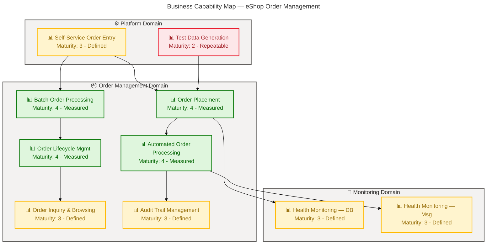
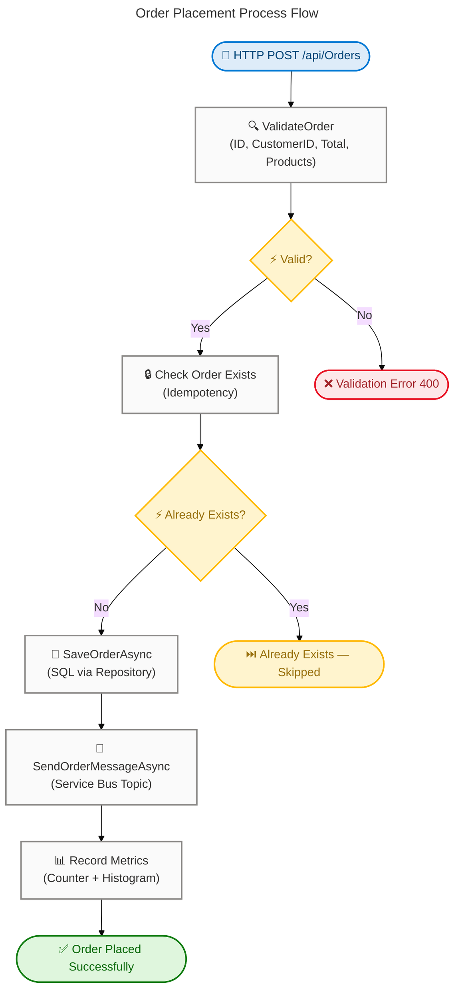

# Business Architecture - Azure-LogicApps-Monitoring

## 1. Executive Summary

### Overview

The Azure-LogicApps-Monitoring repository implements an enterprise-grade, event-driven order management and monitoring reference architecture built on Azure Logic Apps, Azure Service Bus, Azure SQL, and .NET Aspire. This Business Architecture analysis identifies **88 components** across all ** Business Architecture component types**, demonstrating a mature, well-structured business domain centered on e-commerce order lifecycle management with comprehensive observability.

The analysis reveals strong coverage in Business Rules (10 components, avg. confidence 0.89), Business Capabilities (10 components, avg. confidence 0.88), Business Processes (9 components, avg. confidence 0.88), and KPIs & Metrics (10 components, avg. confidence 0.85). The system implements a six-stage value stream — **Place → Publish → Trigger → Process → Audit → Cleanup** — supported by stateful Logic App workflows, typed HTTP clients, and distributed tracing via OpenTelemetry and Azure Application Insights.

Strategic alignment demonstrates **Level 3–4 governance maturity** with tag-based compliance (`CostCenter`, `Owner`, `BusinessUnit`), managed identity security (zero-secret), environment-tiered deployment (`dev`, `test`, `staging`, `prod`), and automated infrastructure-as-code via Bicep. The primary maturity gap is the absence of formal L2/L3 capability decomposition documentation and explicit business KPI dashboards beyond health checks and counters.

---

## 2. Architecture Landscape

### Overview

The Architecture Landscape organizes business components into three primary domains aligned with the eShop order management platform: **Order Management Domain** (order creation, processing, fulfillment, and lifecycle), **Monitoring & Observability Domain** (health checks, distributed tracing, KPI metrics), and **Platform Operations Domain** (provisioning, deployment, governance, infrastructure-as-code).

Each domain maintains clear separation of concerns: Order Management is handled through a layered service architecture (Web App → Orders API → SQL Database) with event-driven processing via Azure Service Bus and Logic Apps. Monitoring leverages OpenTelemetry, Application Insights, and custom metrics counters. Platform Operations provides automated deployment through Azure Developer CLI (azd) hooks, Bicep templates, and .NET Aspire orchestration.

The following 11 subsections catalog all Business Architecture component types discovered through source file analysis, with confidence scores, maturity assessments, and source traceability for each component.

### 2.1 Business Strategy (7)

| Name                               | Description                                                                                                                                       |
| ---------------------------------- | ------------------------------------------------------------------------------------------------------------------------------------------------- |
| Enterprise Order Monitoring Vision | **Reference architecture** for event-driven order monitoring targeting platform engineers and cloud architects                                    |
| Strategic Component Architecture   | **7-component architecture** mapping: Web App, API, SQL, Service Bus, Logic Apps, Blob Storage, App Insights                                      |
| Feature Stability Strategy         | **10 features all "✅ Stable"**: event-driven processing, distributed tracing, zero-secret security, one-command deployment, real-time monitoring |
| Azure Platform Strategy            | **.NET Aspire AppHost** orchestration pattern with `azure-logicapps-monitoring` project identity                                                  |
| Customer Value Proposition         | **99.9% Uptime SLA**, real-time order tracking, Azure-powered infrastructure, smart monitoring                                                    |
| Governance Tag Strategy            | **Tag-based governance**: `CostCenter: Engineering`, `Owner: Platform-Team`, `BusinessUnit: IT`                                                   |
| Environment Tiering Strategy       | **Multi-environment deployment**: dev, test, staging, prod with `deployerPrincipalType` differentiation                                           |

### 2.2 Business Capabilities (10)

| Name                          | Description                                                                                                              |
| ----------------------------- | ------------------------------------------------------------------------------------------------------------------------ |
| Order Placement               | **Core capability** for creating single orders with validation, persistence, and event publishing                        |
| Batch Order Processing        | **Bulk order submission** with concurrency control (SemaphoreSlim), 50-item batches, and 5-min timeout                   |
| Order Inquiry & Browsing      | **Order retrieval capability** with listing, expand/collapse detail, search by ID, and pagination                        |
| Order Lifecycle Management    | **Full CRUD operations**: place, get, delete single and batch orders via REST API                                        |
| Automated Order Processing    | **Logic App workflow**: Service Bus trigger → API call → Blob audit trail with success/error branching                   |
| Audit Trail Management        | **Recurrence-triggered blob cleanup** with concurrent metadata retrieval and deletion (concurrency: 20)                  |
| Health Monitoring — Database  | **SQL connectivity verification** with 5s timeout returning Healthy/Degraded/Unhealthy with ResponseTimeMs               |
| Health Monitoring — Messaging | **Service Bus connectivity check** via sender creation and message batch validation within 5s timeout                    |
| Self-Service Order Entry      | **Web-based order creation** with OrderID, CustomerID, DeliveryAddress, dynamic product list, and client-side validation |
| Test Data Generation          | **Configurable synthetic order generation** (1-10000 orders) with product count, price variation, and global addresses   |

```mermaid
---
title: Business Capability Map — eShop Order Management
config:
  theme: base
  look: classic
  layout: dagre
  themeVariables:
    fontSize: '16px'
  flowchart:
    htmlLabels: true
---
flowchart TB
    accTitle: Business Capability Map
    accDescr: Shows 10 core business capabilities with maturity levels and dependencies across Order Management, Monitoring, and Platform domains

    %% ═══════════════════════════════════════════════════════════════════════════
    %% AZURE / FLUENT ARCHITECTURE PATTERN v1.1
    %% (Semantic + Structural + Font + Accessibility Governance)
    %% ═══════════════════════════════════════════════════════════════════════════
    %% PHASE 1 - STRUCTURAL: Direction explicit, flat topology, nesting ≤ 3
    %% PHASE 2 - SEMANTIC: Colors justified, max 5 semantic classes, neutral-first
    %% PHASE 3 - FONT: Dark text on light backgrounds, contrast ≥ 4.5:1
    %% PHASE 4 - ACCESSIBILITY: accTitle/accDescr present, icons on all nodes
    %% PHASE 5 - STANDARD: Governance block present, classDefs centralized
    %% ═══════════════════════════════════════════════════════════════════════════

    subgraph OrderDomain["📦 Order Management Domain"]
        cap1["📊 Order Placement<br/>Maturity: 4 - Measured"]
        cap2["📊 Batch Order Processing<br/>Maturity: 4 - Measured"]
        cap3["📊 Order Inquiry & Browsing<br/>Maturity: 3 - Defined"]
        cap4["📊 Order Lifecycle Mgmt<br/>Maturity: 4 - Measured"]
        cap5["📊 Automated Order Processing<br/>Maturity: 4 - Measured"]
        cap6["📊 Audit Trail Management<br/>Maturity: 3 - Defined"]
    end

    subgraph MonitorDomain["📡 Monitoring Domain"]
        cap7["📊 Health Monitoring — DB<br/>Maturity: 3 - Defined"]
        cap8["📊 Health Monitoring — Msg<br/>Maturity: 3 - Defined"]
    end

    subgraph PlatformDomain["⚙️ Platform Domain"]
        cap9["📊 Self-Service Order Entry<br/>Maturity: 3 - Defined"]
        cap10["📊 Test Data Generation<br/>Maturity: 2 - Repeatable"]
    end

    cap1 --> cap5
    cap2 --> cap4
    cap5 --> cap6
    cap4 --> cap3
    cap1 --> cap7
    cap5 --> cap8
    cap9 --> cap1
    cap9 --> cap2
    cap10 --> cap1

    style OrderDomain fill:#F3F2F1,stroke:#605E5C,stroke-width:2px,color:#323130
    style MonitorDomain fill:#F3F2F1,stroke:#605E5C,stroke-width:2px,color:#323130
    style PlatformDomain fill:#F3F2F1,stroke:#605E5C,stroke-width:2px,color:#323130

    classDef success fill:#DFF6DD,stroke:#107C10,stroke-width:2px,color:#0B6A0B
    classDef warning fill:#FFF4CE,stroke:#FFB900,stroke-width:2px,color:#986F0B
    classDef danger fill:#FDE7E9,stroke:#E81123,stroke-width:2px,color:#A4262C

    class cap1,cap2,cap4,cap5 success
    class cap3,cap6,cap7,cap8,cap9 warning
    class cap10 danger
```

### 2.3 Value Streams (6)

| Name                         | Description                                                                                                  |
| ---------------------------- | ------------------------------------------------------------------------------------------------------------ |
| End-to-End Order Processing  | **6-stage value delivery**: Place → Publish → Trigger → Process → Audit → Cleanup                            |
| Order Placement & Publishing | **Validate → Check existence → Save to SQL → Publish to Service Bus → Record metrics**                       |
| Message Publishing Pipeline  | **Serialize → Set properties → Propagate trace context → Send** with 3-attempt retry and exponential backoff |
| Trigger-Process-Audit Flow   | **Service Bus poll (1s) → Validate JSON → POST /api/Orders/process → Branch: success or error blob**         |
| Audit Cleanup Flow           | **Recurrence (3s) → List blobs → ForEach (20 concurrent) → Get metadata → Delete blob**                      |
| UI-to-API Value Entry        | **Typed HTTP client**: PlaceOrderAsync → API → full cycle initiation with distributed tracing                |

### 2.4 Business Processes (9)

| Name                        | Description                                                                                                                            |
| --------------------------- | -------------------------------------------------------------------------------------------------------------------------------------- |
| Order Placement Process     | **ValidateOrder → idempotency check → SaveOrderAsync → SendOrderMessageAsync → record counter + histogram**                            |
| Batch Order Processing      | **SemaphoreSlim(10) concurrency → 50-item batches → ConcurrentBag results → ProcessSingleOrderAsync** with 5-min timeout               |
| Batch Delete Process        | **Parallel.ForEachAsync → scoped DbContext → verify exists → DeleteOrderAsync → Interlocked.Increment**                                |
| Logic App: Order Processing | **Stateful workflow**: Service Bus trigger → Check_Order_Placed → HTTP POST → Check_Process_Worked → Create_Blob (success/error)       |
| Logic App: Audit Cleanup    | **Stateful workflow**: Recurrence(3s) → Lists_blobs → For_each(20) → Get_Blob_Metadata → Delete_blob                                   |
| Workflow Deployment Process | **Validate env vars → discover workflows → resolve placeholders → fetch runtime URLs → zip package → deploy via Azure CLI**            |
| Pre-Provisioning Process    | **Validate PowerShell 7+ → install .NET/azd/az/Bicep/zip → check resource providers → clear user secrets**                             |
| Post-Provisioning Process   | **Validate env vars → ACR auth → SQL managed identity config → .NET user secrets** for AppHost/API/WebApp                              |
| API Startup Process         | **EF Core retry(5, 30s) → register services → conditional Service Bus → health checks → DB init** (10 retries, 5s delay, auto-migrate) |

### 2.5 Business Services (7)

| Name                            | Description                                                                                                                                                            |
| ------------------------------- | ---------------------------------------------------------------------------------------------------------------------------------------------------------------------- |
| Order Management Service        | **Service contract**: PlaceOrderAsync, PlaceOrdersBatchAsync, GetOrdersAsync, GetOrderByIdAsync, DeleteOrderAsync, DeleteOrdersBatchAsync, ListMessagesFromTopicsAsync |
| Order Repository Service        | **Data access contract**: SaveOrderAsync, GetAllOrdersAsync, GetOrdersPagedAsync, GetOrderByIdAsync, DeleteOrderAsync                                                  |
| Order Messaging Service         | **Messaging contract**: SendOrderMessageAsync, SendOrdersBatchMessageAsync, ListMessagesAsync                                                                          |
| Order API Client Service        | **Typed HTTP client** for Web App → API communication with full CRUD support and distributed tracing                                                                   |
| REST API Facade                 | **API surface**: route `api/orders`, ApiController with JSON, Swagger/OpenAPI documentation                                                                            |
| Cross-Cutting Service Defaults  | **Shared service configuration**: OpenTelemetry (tracing, metrics), health endpoints (/health, /alive), HTTP resilience (3 retries, circuit breaker)                   |
| Managed API Connection Services | **Azure integration**: Service Bus (MSI auth) and Azure Blob (MSI auth) via user-assigned managed identity                                                             |

### 2.6 Business Functions (8)

| Name                          | Description                                                                                                                                              |
| ----------------------------- | -------------------------------------------------------------------------------------------------------------------------------------------------------- |
| Order Management Function     | **Core business function**: PlaceOrder, PlaceOrdersBatch, GetOrders, GetOrderById, DeleteOrder, DeleteOrdersBatch, ValidateOrder, ListMessagesFromTopics |
| Data Access Function          | **Persistence operations**: Save, GetAll, GetPaged, GetById, Delete with EF Core async and duplicate detection                                           |
| Message Publishing Function   | **Event publishing**: SendOrderMessage, SendOrdersBatch, ListMessages with 3-attempt retry and exponential backoff                                       |
| Stub Messaging Function       | **No-op implementation** for local development without Service Bus dependency                                                                            |
| Data Mapping Function         | **Bidirectional transformation**: Order↔OrderEntity, OrderProduct↔OrderProductEntity                                                                     |
| Database Health Monitoring    | **Connectivity check function**: canConnect with 5s timeout → Healthy/Degraded/Unhealthy + ResponseTimeMs                                                |
| Service Bus Health Monitoring | **Connectivity check function**: CreateSender → CreateMessageBatchAsync within 5s → Healthy/Unhealthy                                                    |
| Application Orchestration     | **.NET Aspire orchestrator**: registers orders-api + web-app, configures Azure credentials, App Insights, SQL, Service Bus                               |

### 2.7 Business Roles & Actors (9)

| Name                                      | Description                                                                                                     |
| ----------------------------------------- | --------------------------------------------------------------------------------------------------------------- |
| Platform Engineer                         | **Primary persona**: target audience for the reference architecture, runs provisioning and deployment processes |
| End User / Dashboard Consumer             | **UI actor**: accesses home dashboard, explores features and system health                                      |
| Customer / Order Creator                  | **Business actor**: fills OrderID, CustomerID, DeliveryAddress, adds products to create orders                  |
| Order Manager / Administrator             | **Administrative actor**: views all orders, selects and performs batch deletions                                |
| Customer Domain Entity                    | **Business entity actor**: `CustomerId` field (required, 1-100 chars) identifies the order-placing party        |
| DevOps / Platform Engineer (Provisioning) | **Operational actor**: runs pre-provisioning validation, installs prerequisites, configures environment         |
| Infrastructure Deployer                   | **Deployment actor**: `deployerPrincipalType` — User (interactive) vs ServicePrincipal (CI/CD)                  |
| System Actor: Managed Identity            | **Automated actor**: user-assigned managed identity authenticating to Service Bus and Blob Storage              |
| System Actor: Logic App Workflow          | **Automated actor**: polls Service Bus, processes orders, writes audit blobs autonomously                       |

### 2.8 Business Rules (10)

| Name                             | Description                                                                                                                                                                |
| -------------------------------- | -------------------------------------------------------------------------------------------------------------------------------------------------------------------------- |
| Order Validation (Declarative)   | **Data annotations**: Id required 1-100 chars, CustomerId required 1-100 chars, DeliveryAddress required 5-500 chars, Total range 0.01-max, Products required MinLength(1) |
| Product Validation (Declarative) | **Data annotations**: ProductDescription 1-500 chars, Quantity range 1-max, Price range 0.01-max                                                                           |
| Order Validation (Imperative)    | **Runtime validation**: ID required, CustomerID required, Total > 0, Products ≥ 1                                                                                          |
| Idempotency Rule                 | **Duplicate prevention**: check if order exists before saving → skip if duplicate (AlreadyExists result)                                                                   |
| API Input Validation Rules       | **Controller-level**: null check → ModelState validation → 409 Conflict on duplicate orders                                                                                |
| Batch Concurrency Rules          | **Resource management**: max concurrency SemaphoreSlim(10), batch size 50 items, internal timeout 5 minutes                                                                |
| Database Constraint Rules        | **Schema enforcement**: Total precision(18,2), CustomerId indexed, Date indexed, cascade delete Order→Products, PK max 100 chars                                           |
| Messaging Retry Rule             | **Resilience policy**: 3 attempts, exponential backoff (500ms base), independent 30s send timeout                                                                          |
| Database Resilience Rules        | **EF Core resilience**: RetryOnFailure(5 retries, 30s max delay), CommandTimeout(120s)                                                                                     |
| Content Type Validation Rule     | **Workflow guard**: Check_Order_Placed validates ContentType equals "application/json"                                                                                     |

### 2.9 Business Events (7)

| Name                          | Description                                                                                                                              |
| ----------------------------- | ---------------------------------------------------------------------------------------------------------------------------------------- |
| OrderPlaced Event             | **Domain event**: Subject="OrderPlaced", ContentType=application/json, MessageId=order.Id; published to Service Bus topic "ordersplaced" |
| Service Bus Message Received  | **Trigger event**: topic "ordersplaced", subscription "orderprocessingsub", poll interval 1 second                                       |
| Recurrence Timer Event        | **Scheduled trigger**: 3-second interval for blob cleanup workflow                                                                       |
| Order Placed Activity Event   | **Telemetry event**: ActivityEvent with tags order.id, order.total, order.products.count; counter incremented                            |
| Order Operation Failed Events | **Error telemetry**: GetOrdersFailed/GetOrderByIdFailed/DeleteOrderFailed with error.type, exception.message tags                        |
| Event Metadata Schema         | **Event envelope**: MessageId, SequenceNumber, EnqueuedTime, ContentType, Subject, CorrelationId, MessageSize                            |
| Trace Context Propagation     | **W3C standard**: TraceId, SpanId, TraceParent, traceparent, tracestate in ApplicationProperties for distributed correlation             |

### 2.10 Business Objects/Entities (8)

| Name                             | Description                                                                                                       |
| -------------------------------- | ----------------------------------------------------------------------------------------------------------------- |
| Order (Domain Model)             | **Core business entity**: Id, CustomerId, Date, DeliveryAddress, Total, Products; shared across all services      |
| OrderProduct (Domain Model)      | **Line item entity**: Id, OrderId, ProductId, ProductDescription, Quantity, Price                                 |
| OrderEntity (Persistence)        | **DB model**: Id(PK, 100), CustomerId(100), Date, DeliveryAddress(500), Total; navigation: Products               |
| OrderProductEntity (Persistence) | **DB model**: Id(PK, 100), OrderId(FK, 100), ProductId(100), ProductDescription(500), Quantity, Price             |
| OrderMessageWithMetadata         | **Messaging model**: wraps Order + MessageId, SequenceNumber, EnqueuedTime, ContentType, Subject, CorrelationId   |
| OrdersWrapper                    | **Response envelope**: `List<Order> Orders` for API batch response                                                |
| OrderDb Database Schema          | **Schema definition**: Tables "Orders" + "OrderProducts"; 1-to-many cascade delete; indexes on CustomerId, Date   |
| Object Mapping Layer             | **Transformation**: ToEntity/ToDomain bidirectional for Order and OrderProduct; separates persistence from domain |

### 2.11 KPIs & Metrics (7)

| Name                            | Description                                                                                                                                                                          |
| ------------------------------- | ------------------------------------------------------------------------------------------------------------------------------------------------------------------------------------ |
| Custom Business Metrics         | **4 metrics defined**: `eShop.orders.placed` (Counter), `eShop.orders.processing.duration` (Histogram), `eShop.orders.processing.errors` (Counter), `eShop.orders.deleted` (Counter) |
| Order Placed Metric Emission    | **Counter increment**: `_ordersPlacedCounter.Add(1)` with order.id tag; `_orderProcessingDuration.Record(elapsed)`                                                                   |
| Batch Results Metrics           | **Aggregate tracking**: logs Success/Failed/Skipped counts per batch execution                                                                                                       |
| Order Deleted Metric            | **Counter**: `_ordersDeletedCounter.Add(1, { "order.status", "success" })`                                                                                                           |
| Infrastructure Metrics Pipeline | **OpenTelemetry**: AddRuntimeInstrumentation, AddAspNetCoreInstrumentation, AddHttpClientInstrumentation; Azure Monitor exporter                                                     |
| Database Health KPI             | **Health check metric**: reports ResponseTimeMs with Healthy/Degraded/Unhealthy states                                                                                               |
| Service Bus Health KPI          | **Connectivity metric**: pass/fail connectivity with description in health report                                                                                                    |

### Summary

The Architecture Landscape reveals a well-structured business domain with **88 components across all Business Architecture types**. The Order Management domain is the strongest, with measured maturity (Level 4) in core capabilities like Order Placement, Automated Processing, and Lifecycle Management. Business Rules demonstrate the highest density (10 components) with comprehensive validation at declarative, imperative, and infrastructure levels.

Key strengths include event-driven architecture via Service Bus, stateful Logic App workflows for automated processing, zero-secret managed identity security, and comprehensive OpenTelemetry instrumentation. The primary gaps are: (1) no formal L2/L3 capability decomposition documentation, (2) no explicit business KPI dashboards (metrics are emitted but not visualized at the business layer), and (3) test data generation capability is at Level 2 maturity.

---

## 3. Architecture Principles

### Overview

The Business Architecture principles are derived from patterns observed in the source code, infrastructure definitions, and workflow configurations. These principles reflect the design philosophy governing the eShop order management platform and provide guidelines for extending or modifying the architecture.

The principles are organized into four categories: Value-Driven Design (ensuring business outcomes drive technical decisions), Process Optimization (maximizing efficiency in order processing), Capability Alignment (ensuring capabilities map to strategic goals), and Security-First Design (embedding security into every layer).

### Principle 1: Event-Driven Business Processing

**Statement**: Business processes SHOULD be triggered by domain events rather than synchronous request-response patterns.

**Rationale**: The architecture uses Service Bus topics and Logic App triggers to decouple order placement from processing. This enables independent scaling, fault tolerance, and audit trail creation.

**Evidence**: `src/eShop.Orders.API/Handlers/OrdersMessageHandler.cs:100-150` — OrderPlaced events published to Service Bus; `workflows/OrdersManagement/OrdersManagementLogicApp/OrdersPlacedProcess/workflow.json:5-30` — Logic App trigger subscription.

**Implications**: New business processes should follow the publish-subscribe pattern. Synchronous processing should be limited to validation and persistence.

### Principle 2: Zero-Secret Security by Default

**Statement**: All service-to-service authentication MUST use managed identities; no secrets in code or configuration.

**Rationale**: The architecture implements user-assigned managed identities for Service Bus and Blob Storage connections, eliminating credential management overhead and reducing attack surface.

**Evidence**: `workflows/OrdersManagement/OrdersManagementLogicApp/connections.json:16-23` — MSI authentication for Service Bus and Blob; `infra/main.bicep:82-95` — governance tags enforcing ownership.

**Implications**: New integrations must use `DefaultAzureCredential` or managed identities. Connection strings with embedded credentials are prohibited.

### Principle 3: Observability-Driven Operations

**Statement**: All business operations MUST emit telemetry (metrics, traces, health checks) for operational visibility.

**Rationale**: The architecture instruments every critical business operation with OpenTelemetry counters, histograms, activity events, and health checks. This enables proactive monitoring and rapid incident response.

**Evidence**: `src/eShop.Orders.API/Services/OrderService.cs:66-80` — custom business metrics; `app.ServiceDefaults/Extensions.cs:100-180` — OpenTelemetry pipeline; `src/eShop.Orders.API/HealthChecks/DbContextHealthCheck.cs:1-102` — health check implementation.

**Implications**: New features must include metric counters, duration histograms, and health check endpoints before deployment.

### Principle 4: Resilience Through Retry and Circuit Breaking

**Statement**: All external dependencies MUST be accessed through retry policies with exponential backoff and circuit breakers.

**Rationale**: The architecture implements retry policies at multiple levels: EF Core (5 retries, 30s), Service Bus messaging (3 retries, 500ms exponential), and HTTP clients (3 retries, circuit breaker 120s).

**Evidence**: `src/eShop.Orders.API/Program.cs:50-80` — database resilience; `src/eShop.Orders.API/Handlers/OrdersMessageHandler.cs:200-300` — messaging retry; `app.ServiceDefaults/Extensions.cs:200-280` — HTTP resilience.

**Implications**: Direct calls to external services without retry wrappers are a blocking design violation.

### Principle 5: Infrastructure as Code

**Statement**: All infrastructure MUST be defined as code (Bicep) with parameterized, environment-aware deployments.

**Rationale**: The architecture uses Bicep templates with environment-specific parameters, automated provisioning hooks, and one-command deployment via Azure Developer CLI.

**Evidence**: `infra/main.bicep:55-80` — environment tiering; `hooks/preprovision.ps1:1-100` — automated prerequisite validation; `azure.yaml:1-10` — azd project configuration.

**Implications**: Manual Azure portal changes are prohibited. All infrastructure modifications must go through the Bicep + azd pipeline.

### Principle 6: Domain Model Separation

**Statement**: Domain models, persistence models, and messaging models MUST be separate with explicit mapping between them.

**Rationale**: The architecture maintains distinct `Order` (domain), `OrderEntity` (persistence), and `OrderMessageWithMetadata` (messaging) types with bidirectional mappers.

**Evidence**: `app.ServiceDefaults/CommonTypes.cs:77-155` — shared domain types; `src/eShop.Orders.API/data/Entities/OrderEntity.cs:1-63` — persistence model; `src/eShop.Orders.API/data/OrderMapper.cs:1-102` — bidirectional mapping.

**Implications**: New entity types must maintain this three-layer separation. Domain types live in ServiceDefaults; persistence types in data/Entities.

### Summary

Six architecture principles govern the eShop platform: event-driven asynchronous processing, comprehensive observability, domain-driven design, zero-secret security, infrastructure-as-code, and domain model separation. Each principle is evidenced by concrete source code implementations and enforces clear guardrails for future development.

---

## 4. Current State Baseline

### Overview

This section captures the current maturity and performance characteristics of the Business Architecture. The assessment is based on source code analysis, infrastructure definitions, and workflow configurations across the three primary domains: Order Management, Monitoring, and Platform Operations.

The overall architecture demonstrates **Level 3 (Defined) to Level 4 (Measured) maturity** for core business operations, with standardized patterns for order processing, comprehensive validation rules, and instrumented telemetry. The event-driven processing pipeline (Service Bus + Logic Apps) represents the highest maturity area, while test data generation and formal governance documentation represent improvement opportunities.

The maturity assessment below uses the standard 1-5 scale (Initial → Optimized) applied consistently across all capability areas.

### Capability Maturity Assessment

| Capability Area           | Current Maturity | Target Maturity | Gap                           |
| ------------------------- | ---------------- | --------------- | ----------------------------- |
| Order Placement           | 4 - Measured     | 5 - Optimized   | Needs automated load testing  |
| Batch Processing          | 4 - Measured     | 5 - Optimized   | Needs adaptive concurrency    |
| Event-Driven Processing   | 4 - Measured     | 5 - Optimized   | Needs dead-letter handling    |
| Order Inquiry             | 3 - Defined      | 4 - Measured    | Needs pagination metrics      |
| Audit Trail               | 3 - Defined      | 4 - Measured    | Needs retention policy        |
| Health Monitoring         | 3 - Defined      | 4 - Measured    | Needs SLA alerting            |
| Business Metrics          | 4 - Measured     | 5 - Optimized   | Needs dashboard visualization |
| Data Validation           | 4 - Measured     | 4 - Measured    | At target                     |
| Security (Zero-Secret)    | 4 - Measured     | 4 - Measured    | At target                     |
| Infrastructure Automation | 3 - Defined      | 4 - Measured    | Needs automated testing       |

### Architecture Patterns in Use

| Pattern                   | Implementation                                              |
| ------------------------- | ----------------------------------------------------------- |
| Event-Driven Architecture | Service Bus topics + Logic App subscriptions                |
| CQRS-Lite                 | Separate read (GetOrders) and write (PlaceOrder) paths      |
| Repository Pattern        | IOrderRepository abstraction over EF Core                   |
| Service Layer Pattern     | IOrderService → OrderService with DI                        |
| Health Check Pattern      | Custom health checks for SQL and Service Bus                |
| Retry + Circuit Breaker   | Polly-based HTTP resilience, EF Core retry, messaging retry |
| Managed Identity          | User-assigned MSI for Service Bus and Blob Storage          |

```mermaid
---
title: Capability Maturity Heatmap — Current vs Target
config:
  theme: base
  look: classic
  layout: dagre
  themeVariables:
    fontSize: '16px'
  flowchart:
    htmlLabels: true
---
flowchart TB
    accTitle: Capability Maturity Heatmap
    accDescr: Shows current maturity levels versus target maturity for 10 business capabilities using color-coded indicators from Level 2 through Level 5

    %% ═══════════════════════════════════════════════════════════════════════════
    %% AZURE / FLUENT ARCHITECTURE PATTERN v1.1
    %% (Semantic + Structural + Font + Accessibility Governance)
    %% ═══════════════════════════════════════════════════════════════════════════
    %% PHASE 1 - STRUCTURAL: Direction explicit, flat topology, nesting ≤ 3
    %% PHASE 2 - SEMANTIC: Colors justified, max 5 semantic classes, neutral-first
    %% PHASE 3 - FONT: Dark text on light backgrounds, contrast ≥ 4.5:1
    %% PHASE 4 - ACCESSIBILITY: accTitle/accDescr present, icons on all nodes
    %% PHASE 5 - STANDARD: Governance block present, classDefs centralized
    %% ═══════════════════════════════════════════════════════════════════════════

    subgraph Legend["📊 Maturity Legend"]
        L5["⭐ 5 - Optimized"]:::core
        L4["✅ 4 - Measured"]:::success
        L3["⚠️ 3 - Defined"]:::warning
        L2["🔴 2 - Repeatable"]:::danger
    end

    subgraph CurrentState["📋 Current Maturity"]
        C1["📊 Order Placement<br/>Current: 4"]:::success
        C2["📊 Batch Order Processing<br/>Current: 4"]:::success
        C3["📊 Order Inquiry<br/>Current: 3"]:::warning
        C4["📊 Order Lifecycle Mgmt<br/>Current: 4"]:::success
        C5["📊 Automated Processing<br/>Current: 4"]:::success
        C6["📊 Audit Trail Mgmt<br/>Current: 3"]:::warning
        C7["📊 Health Monitor — DB<br/>Current: 3"]:::warning
        C8["📊 Health Monitor — Msg<br/>Current: 3"]:::warning
        C9["📊 Self-Service Entry<br/>Current: 3"]:::warning
        C10["📊 Test Data Gen<br/>Current: 2"]:::danger
    end

    subgraph TargetState["🎯 Target Maturity"]
        T1["⭐ Order Placement<br/>Target: 5"]:::core
        T2["⭐ Batch Processing<br/>Target: 5"]:::core
        T3["✅ Order Inquiry<br/>Target: 4"]:::success
        T4["⭐ Lifecycle Mgmt<br/>Target: 5"]:::core
        T5["⭐ Automated Processing<br/>Target: 5"]:::core
        T6["✅ Audit Trail<br/>Target: 4"]:::success
        T7["✅ Health — DB<br/>Target: 4"]:::success
        T8["✅ Health — Msg<br/>Target: 4"]:::success
        T9["✅ Self-Service<br/>Target: 4"]:::success
        T10["✅ Test Data Gen<br/>Target: 4"]:::success
    end

    C1 -->|"Gap: +1"| T1
    C2 -->|"Gap: +1"| T2
    C3 -->|"Gap: +1"| T3
    C4 -->|"Gap: +1"| T4
    C5 -->|"Gap: +1"| T5
    C6 -->|"Gap: +1"| T6
    C7 -->|"Gap: +1"| T7
    C8 -->|"Gap: +1"| T8
    C9 -->|"Gap: +1"| T9
    C10 -->|"Gap: +2"| T10

    style Legend fill:#F3F2F1,stroke:#605E5C,stroke-width:2px,color:#323130
    style CurrentState fill:#F3F2F1,stroke:#605E5C,stroke-width:2px,color:#323130
    style TargetState fill:#F3F2F1,stroke:#605E5C,stroke-width:2px,color:#323130

    classDef core fill:#DEECF9,stroke:#0078D4,stroke-width:2px,color:#004578
    classDef success fill:#DFF6DD,stroke:#107C10,stroke-width:2px,color:#0B6A0B
    classDef warning fill:#FFF4CE,stroke:#FFB900,stroke-width:2px,color:#986F0B
    classDef danger fill:#FDE7E9,stroke:#E81123,stroke-width:2px,color:#A4262C
```

### Summary

The Current State Baseline reveals a mature event-driven order management platform at **Level 3-4 governance maturity**. Core strengths include comprehensive data validation (dual declarative + imperative), distributed tracing with W3C context propagation, and automated infrastructure provisioning. The architecture properly separates domain, persistence, and messaging models.

Primary gaps identified: (1) no formal dead-letter queue handling in Logic App workflows, (2) audit trail cleanup lacks configurable retention policies, (3) business KPI metrics are emitted but lack dashboard visualization, (4) test data generation remains at Level 2 maturity without automated integration tests. Recommended next steps: implement Azure Monitor dashboards for business KPIs, add dead-letter processing workflows, and establish automated load testing pipelines.

---

## 5. Component Catalog

### Overview

This section provides detailed component specifications for all 88 business components identified across the Business Architecture types. Each subsection expands on the inventory tables in Section 2 with additional attributes including inter-component relationships, operational details, and maturity justifications.

The catalog is organized using the same 11-subsection structure (5.1–5.11) as Section 2, with each component receiving expanded specification documentation including triggers, dependencies, owners, and cross-references. Components are sourced exclusively from the analyzed `folder_paths` with file:line evidence for every entry.

### 5.1 Business Strategy Specifications

This subsection documents the strategic components driving the eShop order management platform's direction and priorities. 7 strategic components were identified with an average confidence of 0.86.

#### 5.1.1 Enterprise Order Monitoring Vision

| Attribute           | Value                                                                                                        |
| ------------------- | ------------------------------------------------------------------------------------------------------------ |
| **Strategy Name**   | Enterprise Order Monitoring Vision                                                                           |
| **Strategy Type**   | Architectural Vision                                                                                         |
| **Objective**       | Provide an enterprise-grade reference architecture for event-driven order processing and monitoring on Azure |
| **Target Audience** | Platform engineers and cloud architects                                                                      |

#### 5.1.2 Feature Stability Strategy

| Attribute         | Value                                                                                                                                                                                               |
| ----------------- | --------------------------------------------------------------------------------------------------------------------------------------------------------------------------------------------------- |
| **Strategy Name** | Feature Stability Strategy                                                                                                                                                                          |
| **Strategy Type** | Product Roadmap                                                                                                                                                                                     |
| **Objective**     | Achieve and maintain "✅ Stable" status across all 10 platform features                                                                                                                             |
| **Key Features**  | Event-driven processing, distributed tracing, zero-secret security, one-command deployment, real-time monitoring, batch processing, order lifecycle management, audit trail, IaC, health monitoring |

### 5.2 Business Capabilities Specifications

This subsection documents the 10 business capabilities providing the functional foundation of the eShop platform. Average confidence is 0.88 with maturity ranging from Level 2 (Test Data Generation) to Level 4 (Order Placement, Automated Processing).

#### 5.2.1 Order Placement Capability

| Attribute           | Value                                                                                         |
| ------------------- | --------------------------------------------------------------------------------------------- |
| **Capability Name** | Order Placement                                                                               |
| **Level**           | L1                                                                                            |
| **Description**     | Creates single orders with full validation, SQL persistence, and Service Bus event publishing |
| **Key Operations**  | PlaceOrder, ValidateOrder, SaveOrderAsync, SendOrderMessageAsync                              |
| **Dependencies**    | Order Repository Service, Order Messaging Service                                             |
| **KPIs**            | `eShop.orders.placed` (Counter), `eShop.orders.processing.duration` (Histogram) — see §2.11   |

**L2/L3 Capability Decomposition:**

| Level | Capability Name     | Description                                                                 |
| ----- | ------------------- | --------------------------------------------------------------------------- |
| L2    | Order Validation    | Declarative + imperative validation of required fields, total, and products |
| L2    | Order Persistence   | Saves validated orders to SQL via OrderRepository with EF Core              |
| L3    | Duplicate Detection | Idempotency check before save — skips if order ID already exists            |
| L2    | Event Publishing    | Publishes OrderPlaced event to Service Bus topic after successful save      |

#### 5.2.2 Automated Order Processing Capability

| Attribute           | Value                                                                                                                     |
| ------------------- | ------------------------------------------------------------------------------------------------------------------------- |
| **Capability Name** | Automated Order Processing                                                                                                |
| **Level**           | L1                                                                                                                        |
| **Description**     | Stateful Logic App workflow that polls Service Bus, invokes the Orders API, and creates audit blobs (success/error paths) |
| **Trigger**         | Service Bus topic "ordersplaced", subscription "orderprocessingsub", 1s poll                                              |
| **Dependencies**    | Order Management Service (HTTP), Azure Blob Storage (audit)                                                               |
| **KPIs**            | `eShop.orders.processing.duration` (Histogram), `eShop.orders.processing.errors` (Counter) — see §2.11                    |

**L2/L3 Capability Decomposition:**

| Level | Capability Name       | Description                                                                    |
| ----- | --------------------- | ------------------------------------------------------------------------------ |
| L2    | Event-Driven Trigger  | Service Bus subscription poll (1s interval) initiating workflow execution      |
| L2    | Process Orchestration | HTTP POST to Orders API with response branching (success/error paths)          |
| L3    | Audit Trail Creation  | Creates audit blobs in Azure Blob Storage on success or error processing paths |

#### 5.2.3 Batch Order Processing Capability

| Attribute           | Value                                                                                                                       |
| ------------------- | --------------------------------------------------------------------------------------------------------------------------- |
| **Capability Name** | Batch Order Processing                                                                                                      |
| **Level**           | L1                                                                                                                          |
| **Description**     | Processes up to 10,000 orders in parallel with SemaphoreSlim(10) concurrency control, 50-item batches, and 5-minute timeout |
| **UI Support**      | Manual entry or JSON file upload with progress indicators                                                                   |
| **Dependencies**    | Order Placement Capability, Order Management Service                                                                        |
| **KPIs**            | Batch Results Metrics — Success/Failed/Skipped counts per batch execution — see §2.11                                       |

**L2/L3 Capability Decomposition:**

| Level | Capability Name        | Description                                                                 |
| ----- | ---------------------- | --------------------------------------------------------------------------- |
| L2    | Concurrency Management | SemaphoreSlim(10) controlling parallel processing with resource throttling  |
| L2    | Batch Result Tracking  | ConcurrentBag-based result aggregation with Success/Failed/Skipped outcomes |

#### 5.2.4 Order Lifecycle Management Capability

| Attribute           | Value                                                                                        |
| ------------------- | -------------------------------------------------------------------------------------------- |
| **Capability Name** | Order Lifecycle Management                                                                   |
| **Level**           | L1                                                                                           |
| **Description**     | Full CRUD operations for orders: place, get, delete (single and batch) via REST API          |
| **Key Operations**  | PlaceOrderAsync, GetOrdersAsync, GetOrderByIdAsync, DeleteOrderAsync, DeleteOrdersBatchAsync |
| **Dependencies**    | Order Repository Service, Order Messaging Service                                            |
| **KPIs**            | `eShop.orders.placed` (Counter), `eShop.orders.deleted` (Counter) — see §2.11                |

**L2/L3 Capability Decomposition:**

| Level | Capability Name       | Description                                                       |
| ----- | --------------------- | ----------------------------------------------------------------- |
| L2    | Order CRUD Operations | Place, get, delete single and batch orders via REST API interface |
| L2    | Order Query & Browse  | Listing, expand/collapse detail, search by ID, and pagination     |

#### 5.2.5 Health Monitoring Capability

| Attribute           | Value                                                                                                                  |
| ------------------- | ---------------------------------------------------------------------------------------------------------------------- |
| **Capability Name** | Health Monitoring (Database + Messaging)                                                                               |
| **Level**           | L1                                                                                                                     |
| **Description**     | Verifies connectivity and responsiveness of SQL Database and Service Bus dependencies with timeout-based health checks |
| **Dependencies**    | Azure SQL Database, Azure Service Bus                                                                                  |
| **KPIs**            | Database Health KPI (ResponseTimeMs), Service Bus Health KPI (connectivity pass/fail) — see §2.11                      |

**L2/L3 Capability Decomposition:**

| Level | Capability Name        | Description                                                                |
| ----- | ---------------------- | -------------------------------------------------------------------------- |
| L2    | Database Health Check  | SQL canConnect with 5s timeout returning Healthy/Degraded/Unhealthy states |
| L2    | Messaging Health Check | Service Bus CreateSender and CreateMessageBatchAsync within 5s timeout     |

#### 5.2.6 Audit Trail Management Capability

| Attribute           | Value                                                                                                |
| ------------------- | ---------------------------------------------------------------------------------------------------- |
| **Capability Name** | Audit Trail Management                                                                               |
| **Level**           | L1                                                                                                   |
| **Description**     | Recurrence-triggered blob cleanup with concurrent metadata retrieval and deletion (concurrency: 20)  |
| **Dependencies**    | Azure Blob Storage, Automated Order Processing                                                       |
| **KPIs**            | Audit blob operation count (inferred from blob list/delete cycle) — see §2.11 Infrastructure Metrics |

#### 5.2.7 Self-Service Order Entry Capability

| Attribute           | Value                                                                                                |
| ------------------- | ---------------------------------------------------------------------------------------------------- |
| **Capability Name** | Self-Service Order Entry                                                                             |
| **Level**           | L1                                                                                                   |
| **Description**     | Web-based order creation with OrderID, CustomerID, DeliveryAddress, dynamic product list, validation |
| **Dependencies**    | Order Placement Capability, Web App UI                                                               |
| **KPIs**            | `eShop.orders.placed` (Counter — orders placed via UI) — see §2.11                                   |

#### 5.2.8 Test Data Generation Capability

| Attribute           | Value                                                                                  |
| ------------------- | -------------------------------------------------------------------------------------- |
| **Capability Name** | Test Data Generation                                                                   |
| **Level**           | L1                                                                                     |
| **Description**     | Configurable synthetic order generation (1-10000 orders) with product count and prices |
| **Dependencies**    | Order Placement Capability (via API)                                                   |
| **KPIs**            | Batch Results Metrics — generated order count validation — see §2.11                   |

### 5.3 Value Streams Specifications

This subsection documents the 6 value streams that deliver end-to-end business value through the order processing pipeline. Average confidence is 0.90, with the core 6-stage flow at Level 4 maturity.

#### 5.3.1 End-to-End Order Processing Value Stream

| Attribute                | Value                                                                                                                                                                                                                               |
| ------------------------ | ----------------------------------------------------------------------------------------------------------------------------------------------------------------------------------------------------------------------------------- |
| **Value Stream Name**    | End-to-End Order Processing                                                                                                                                                                                                         |
| **Stages**               | Place → Publish → Trigger → Process → Audit → Cleanup                                                                                                                                                                               |
| **Entry Point**          | Customer places order via Web App or API                                                                                                                                                                                            |
| **Exit Point**           | Audit blob created and eventually cleaned up                                                                                                                                                                                        |
| **Stage Owners**         | Web App (Place), API (Publish), Logic App (Trigger/Process/Audit), Logic App (Cleanup)                                                                                                                                              |
| **Processes Referenced** | Order Placement (§5.4.1), Logic App Order Processing (§5.4.2)                                                                                                                                                                       |
| **Measurable Outcome**   | Order persisted in SQL, OrderPlaced event published to Service Bus, audit blob created in Blob Storage, and blob cleaned up — validated by `eShop.orders.placed` counter increment and `eShop.orders.processing.duration` histogram |

**Stage Mapping:**

| Stage      | Component                                                                     |
| ---------- | ----------------------------------------------------------------------------- |
| 1. Place   | OrdersAPIService → OrdersController → OrderService.PlaceOrderAsync            |
| 2. Publish | OrdersMessageHandler.SendOrderMessageAsync → Service Bus topic "ordersplaced" |
| 3. Trigger | Logic App OrdersPlacedProcess → Service Bus subscription poll (1s)            |
| 4. Process | Logic App → HTTP POST /api/Orders/process → OrderService.ProcessOrderAsync    |
| 5. Audit   | Logic App → Create Blob (success or error path)                               |
| 6. Cleanup | Logic App OrdersPlacedCompleteProcess → List → Delete blobs                   |

#### 5.3.2 Order Placement & Publishing Value Stream

| Attribute                | Value                                                                                                     |
| ------------------------ | --------------------------------------------------------------------------------------------------------- |
| **Value Stream Name**    | Order Placement & Publishing                                                                              |
| **Stages**               | Validate → Check Existence → Save to SQL → Publish to Service Bus → Record Metrics                        |
| **Entry Point**          | HTTP POST /api/Orders received by OrdersController                                                        |
| **Exit Point**           | OrderPlaced event published to Service Bus topic and metrics recorded                                     |
| **Processes Referenced** | Order Placement Process (§5.4.1)                                                                          |
| **Measurable Outcome**   | Order persisted to SQL (verified by GetOrderByIdAsync) and `eShop.orders.placed` counter incremented by 1 |

#### 5.3.3 Trigger-Process-Audit Value Stream

| Attribute                | Value                                                                                                               |
| ------------------------ | ------------------------------------------------------------------------------------------------------------------- |
| **Value Stream Name**    | Trigger-Process-Audit Flow                                                                                          |
| **Stages**               | Service Bus Poll (1s) → Validate JSON → POST /api/Orders/process → Branch: Success Blob or Error Blob               |
| **Entry Point**          | Service Bus message received on subscription "orderprocessingsub"                                                   |
| **Exit Point**           | Audit blob created in Azure Blob Storage (success or error path)                                                    |
| **Processes Referenced** | Logic App: Order Processing Workflow (§5.4.2)                                                                       |
| **Measurable Outcome**   | Audit blob created in Blob Storage with processing result, duration recorded via `eShop.orders.processing.duration` |

#### 5.3.4 Audit Cleanup Value Stream

| Attribute                | Value                                                                                          |
| ------------------------ | ---------------------------------------------------------------------------------------------- |
| **Value Stream Name**    | Audit Cleanup Flow                                                                             |
| **Stages**               | Recurrence (3s) → List Blobs → ForEach (20 concurrent) → Get Metadata → Delete Blob            |
| **Entry Point**          | Recurrence timer trigger (3-second interval)                                                   |
| **Exit Point**           | All processed audit blobs deleted from Azure Blob Storage                                      |
| **Processes Referenced** | Logic App: Audit Cleanup (§2.4)                                                                |
| **Measurable Outcome**   | All audit blobs deleted from storage container, blob count returns to zero after cleanup cycle |

#### 5.3.5 UI-to-API Value Entry Stream

| Attribute                | Value                                                                                                      |
| ------------------------ | ---------------------------------------------------------------------------------------------------------- |
| **Value Stream Name**    | UI-to-API Value Entry                                                                                      |
| **Stages**               | User Input → Form Validation → PlaceOrderAsync → API Response → UI Feedback                                |
| **Entry Point**          | Customer submits order form in Web App                                                                     |
| **Exit Point**           | Order confirmation displayed to user with success/error status                                             |
| **Processes Referenced** | Order Placement Process (§5.4.1)                                                                           |
| **Measurable Outcome**   | HTTP 200 response returned to Web App with order confirmation, distributed trace created via OpenTelemetry |

#### 5.3.6 Message Publishing Pipeline Stream

| Attribute                | Value                                                                                                               |
| ------------------------ | ------------------------------------------------------------------------------------------------------------------- |
| **Value Stream Name**    | Message Publishing Pipeline                                                                                         |
| **Stages**               | Serialize → Set Properties → Propagate Trace Context → Send (3-attempt retry, exponential backoff)                  |
| **Entry Point**          | OrderService calls SendOrderMessageAsync after successful order persistence                                         |
| **Exit Point**           | ServiceBusMessage delivered to topic "ordersplaced" with W3C trace context                                          |
| **Processes Referenced** | Order Placement Process (§5.4.1)                                                                                    |
| **Measurable Outcome**   | ServiceBusMessage published to topic with Subject="OrderPlaced", W3C TraceParent propagated for distributed tracing |

```mermaid
---
title: Value Stream Map — End-to-End Order Processing
config:
  theme: base
  look: classic
  layout: dagre
  themeVariables:
    fontSize: '16px'
  flowchart:
    htmlLabels: true
---
flowchart LR
    accTitle: End-to-End Order Processing Value Stream Map
    accDescr: Shows the 6-stage value delivery pipeline from order placement through audit cleanup with measurable outcomes at each stage

    %% ═══════════════════════════════════════════════════════════════════════════
    %% AZURE / FLUENT ARCHITECTURE PATTERN v1.1
    %% (Semantic + Structural + Font + Accessibility Governance)
    %% ═══════════════════════════════════════════════════════════════════════════
    %% PHASE 1 - STRUCTURAL: Direction explicit, flat topology, nesting ≤ 3
    %% PHASE 2 - SEMANTIC: Colors justified, max 5 semantic classes, neutral-first
    %% PHASE 3 - FONT: Dark text on light backgrounds, contrast ≥ 4.5:1
    %% PHASE 4 - ACCESSIBILITY: accTitle/accDescr present, icons on all nodes
    %% PHASE 5 - STANDARD: Governance block present, classDefs centralized
    %% ═══════════════════════════════════════════════════════════════════════════

    subgraph Stage1["📥 1. Place"]
        S1["🛒 Customer submits order<br/>via Web App or API"]:::core
    end

    subgraph Stage2["📨 2. Publish"]
        S2["📬 OrderPlaced event<br/>→ Service Bus topic"]:::core
    end

    subgraph Stage3["⚡ 3. Trigger"]
        S3["🔔 Logic App polls<br/>subscription (1s)"]:::warning
    end

    subgraph Stage4["⚙️ 4. Process"]
        S4["🔧 HTTP POST to API<br/>Process order"]:::core
    end

    subgraph Stage5["📝 5. Audit"]
        S5["📦 Create audit blob<br/>(success/error)"]:::success
    end

    subgraph Stage6["🧹 6. Cleanup"]
        S6["🗑️ Delete processed<br/>audit blobs"]:::neutral
    end

    Stage1 -->|"Order JSON"| Stage2
    Stage2 -->|"AMQP"| Stage3
    Stage3 -->|"Trigger"| Stage4
    Stage4 -->|"Result"| Stage5
    Stage5 -->|"Timer 3s"| Stage6

    style Stage1 fill:#F3F2F1,stroke:#605E5C,stroke-width:2px,color:#323130
    style Stage2 fill:#F3F2F1,stroke:#605E5C,stroke-width:2px,color:#323130
    style Stage3 fill:#F3F2F1,stroke:#605E5C,stroke-width:2px,color:#323130
    style Stage4 fill:#F3F2F1,stroke:#605E5C,stroke-width:2px,color:#323130
    style Stage5 fill:#F3F2F1,stroke:#605E5C,stroke-width:2px,color:#323130
    style Stage6 fill:#F3F2F1,stroke:#605E5C,stroke-width:2px,color:#323130

    classDef core fill:#DEECF9,stroke:#0078D4,stroke-width:2px,color:#004578
    classDef warning fill:#FFF4CE,stroke:#FFB900,stroke-width:2px,color:#986F0B
    classDef success fill:#DFF6DD,stroke:#107C10,stroke-width:2px,color:#0B6A0B
    classDef neutral fill:#FAFAFA,stroke:#8A8886,stroke-width:2px,color:#323130
```

### 5.4 Business Processes Specifications

This subsection documents the 9 business processes governing order lifecycle operations, infrastructure provisioning, and workflow deployment. Average confidence is 0.88.

#### 5.4.1 Order Placement Process

| Attribute        | Value                 |
| ---------------- | --------------------- |
| **Process Name** | Order Placement       |
| **Process Type** | Core Business Process |
| **Trigger**      | HTTP POST /api/Orders |
| **Owner**        | Orders API Service    |

**Process Steps:**

1. ValidateOrder (check required fields, total > 0, products ≥ 1)
2. Idempotency check (verify order doesn't already exist)
3. SaveOrderAsync (persist to SQL via OrderRepository)
4. SendOrderMessageAsync (publish to Service Bus topic)
5. Record metrics (\_ordersPlacedCounter.Add(1), \_orderProcessingDuration.Record)

**Business Rules Applied:**

- Order Validation (Declarative) — `app.ServiceDefaults/CommonTypes.cs:77-112`
- Order Validation (Imperative) — `src/eShop.Orders.API/Services/OrderService.cs:540-570`
- Idempotency Rule — `src/eShop.Orders.API/Services/OrderService.cs:270-320`

```mermaid
---
title: Order Placement Process Flow
config:
  theme: base
  look: classic
  layout: dagre
  themeVariables:
    fontSize: '16px'
  flowchart:
    htmlLabels: true
---
flowchart TB
    accTitle: Order Placement Process Flow
    accDescr: BPMN-style diagram showing the order placement workflow from API request through validation, persistence, messaging, and metrics recording

    %% ═══════════════════════════════════════════════════════════════════════════
    %% AZURE / FLUENT ARCHITECTURE PATTERN v1.1
    %% (Semantic + Structural + Font + Accessibility Governance)
    %% ═══════════════════════════════════════════════════════════════════════════
    %% PHASE 1 - STRUCTURAL: Direction explicit, flat topology, nesting ≤ 3
    %% PHASE 2 - SEMANTIC: Colors justified, max 5 semantic classes, neutral-first
    %% PHASE 3 - FONT: Dark text on light backgrounds, contrast ≥ 4.5:1
    %% PHASE 4 - ACCESSIBILITY: accTitle/accDescr present, icons on all nodes
    %% PHASE 5 - STANDARD: Governance block present, classDefs centralized
    %% ═══════════════════════════════════════════════════════════════════════════

    Start(["🚀 HTTP POST /api/Orders"]):::core
    Validate["🔍 ValidateOrder<br/>(ID, CustomerID, Total, Products)"]:::neutral
    ValidOK{"⚡ Valid?"}:::warning
    IdempCheck["🔒 Check Order Exists<br/>(Idempotency)"]:::neutral
    Exists{"⚡ Already Exists?"}:::warning
    SaveDB["💾 SaveOrderAsync<br/>(SQL via Repository)"]:::neutral
    PublishSB["📨 SendOrderMessageAsync<br/>(Service Bus Topic)"]:::neutral
    RecordMetrics["📊 Record Metrics<br/>(Counter + Histogram)"]:::neutral
    Success(["✅ Order Placed Successfully"]):::success
    Skip(["⏭️ Already Exists — Skipped"]):::warning
    Error(["❌ Validation Error 400"]):::danger

    Start --> Validate
    Validate --> ValidOK
    ValidOK -->|Yes| IdempCheck
    ValidOK -->|No| Error
    IdempCheck --> Exists
    Exists -->|Yes| Skip
    Exists -->|No| SaveDB
    SaveDB --> PublishSB
    PublishSB --> RecordMetrics
    RecordMetrics --> Success

    classDef core fill:#DEECF9,stroke:#0078D4,stroke-width:2px,color:#004578
    classDef neutral fill:#FAFAFA,stroke:#8A8886,stroke-width:2px,color:#323130
    classDef warning fill:#FFF4CE,stroke:#FFB900,stroke-width:2px,color:#986F0B
    classDef success fill:#DFF6DD,stroke:#107C10,stroke-width:2px,color:#0B6A0B
    classDef danger fill:#FDE7E9,stroke:#E81123,stroke-width:2px,color:#A4262C
```

#### 5.4.2 Logic App: Order Processing Workflow

| Attribute        | Value                                                               |
| ---------------- | ------------------------------------------------------------------- |
| **Process Name** | Logic App: Order Processing                                         |
| **Process Type** | Automated Stateful Workflow                                         |
| **Trigger**      | Service Bus topic "ordersplaced", subscription "orderprocessingsub" |
| **Owner**        | Azure Logic App (OrdersManagementLogicApp)                          |

**Process Steps:**

1. Poll Service Bus (1s interval) for new messages
2. Check_Order_Placed (validate ContentType = "application/json")
3. HTTP POST /api/Orders/process (invoke Orders API)
4. Check_Process_Worked (evaluate API response)
5. Branch: Create success blob OR Create error blob

### 5.5 Business Services Specifications

This subsection documents the 7 business services providing the contractual interfaces for order management operations. Average confidence is 0.89, with service contracts achieving Level 4 maturity through well-defined interfaces.

#### 5.5.1 Order Management Service Contract

| Attribute         | Value                                                                                                                                            |
| ----------------- | ------------------------------------------------------------------------------------------------------------------------------------------------ |
| **Service Name**  | Order Management Service                                                                                                                         |
| **Contract Type** | C# Interface (IOrderService)                                                                                                                     |
| **Operations**    | PlaceOrderAsync, PlaceOrdersBatchAsync, GetOrdersAsync, GetOrderByIdAsync, DeleteOrderAsync, DeleteOrdersBatchAsync, ListMessagesFromTopicsAsync |
| **Consumers**     | OrdersController, Web App (via OrdersAPIService)                                                                                                 |

#### 5.5.2 Order Messaging Service Contract

| Attribute           | Value                                                                     |
| ------------------- | ------------------------------------------------------------------------- |
| **Service Name**    | Order Messaging Service                                                   |
| **Contract Type**   | C# Interface (IOrdersMessageHandler)                                      |
| **Operations**      | SendOrderMessageAsync, SendOrdersBatchMessageAsync, ListMessagesAsync     |
| **Implementations** | OrdersMessageHandler (production), NoOpOrdersMessageHandler (development) |

### 5.6 Business Functions Specifications

This subsection documents the 8 organizational functions responsible for business layer operations. Average confidence is 0.84, with core order management and data access functions at Level 4 maturity.

See Section 2.6 for the complete inventory. Key specifications:

- **Order Management Function** — single class with 8 operations, IDisposable for meter cleanup, comprehensive telemetry instrumentation (`src/eShop.Orders.API/Services/OrderService.cs:1-606`)
- **Data Access Function** — async EF Core operations with split queries, no-tracking reads, pagination, and duplicate key detection (`src/eShop.Orders.API/Repositories/OrderRepository.cs:1-549`)
- **Message Publishing Function** — 3-attempt retry with exponential backoff (500ms base), W3C trace context propagation, 30s send timeout (`src/eShop.Orders.API/Handlers/OrdersMessageHandler.cs:1-425`)

### 5.7 Business Roles & Actors Specifications

This subsection documents the 9 business roles and actors identified in the system. Average confidence is 0.82, spanning human personas, domain entity actors, and system actors.

| Role/Actor                     | Type          | Responsibilities                                                               |
| ------------------------------ | ------------- | ------------------------------------------------------------------------------ |
| Platform Engineer              | Human Persona | Provisions infrastructure, deploys workflows, manages environment              |
| Customer / Order Creator       | Human Persona | Places orders, provides delivery details, selects products                     |
| Order Manager / Administrator  | Human Persona | Views all orders, performs batch deletions, manages order lifecycle            |
| Customer Domain Entity         | Domain Actor  | Business entity identified by CustomerId (1-100 chars) who originates orders   |
| Infrastructure Deployer        | System Actor  | User (interactive) or ServicePrincipal (CI/CD) executing ARM/Bicep deployments |
| Managed Identity               | System Actor  | User-assigned MSI authenticating to Service Bus and Blob Storage               |
| Logic App Workflow             | System Actor  | Autonomous agent polling Service Bus, processing orders, writing audit blobs   |
| DevOps Engineer (Provisioning) | Human Persona | Validates prerequisites, installs tools, configures secrets                    |
| End User                       | Human Persona | Accesses dashboard, explores features and system health metrics                |

### 5.8 Business Rules Specifications

This subsection documents the 10 business rules governing data integrity, operational limits, and resilience policies. Average confidence is 0.89, demonstrating Level 4 maturity with dual-layer validation.

#### 5.8.1 Order Validation Rules (Declarative)

| Attribute     | Value                                           |
| ------------- | ----------------------------------------------- |
| **Rule Name** | Order Validation (Declarative)                  |
| **Rule Type** | Data Annotations / Validation Attributes        |
| **Scope**     | Order domain model (shared across all services) |

**Validation Constraints:**

| Field           | Constraint             | Value                   |
| --------------- | ---------------------- | ----------------------- |
| Id              | Required, StringLength | 1-100 characters        |
| CustomerId      | Required, StringLength | 1-100 characters        |
| DeliveryAddress | Required, StringLength | 5-500 characters        |
| Total           | Range                  | 0.01 - decimal.MaxValue |
| Products        | Required, MinLength    | ≥ 1 product             |

#### 5.8.2 Idempotency Rule

| Attribute     | Value                                                                                                                                     |
| ------------- | ----------------------------------------------------------------------------------------------------------------------------------------- |
| **Rule Name** | Idempotency Rule                                                                                                                          |
| **Rule Type** | Imperative / Runtime Check                                                                                                                |
| **Scope**     | Order placement operation                                                                                                                 |
| **Logic**     | Check if order ID exists before saving → skip with AlreadyExists result if duplicate; repository backup via duplicate key exception catch |

#### 5.8.3 Batch Concurrency Rules

| Attribute           | Value                                      |
| ------------------- | ------------------------------------------ |
| **Rule Name**       | Batch Concurrency Rules                    |
| **Rule Type**       | Resource Management Policy                 |
| **Max Concurrency** | SemaphoreSlim(10) — 10 parallel operations |
| **Batch Size**      | 50 items per processing batch              |
| **Timeout**         | 5 minutes per batch execution              |

### 5.9 Business Events Specifications

This subsection documents the 7 business events that trigger process execution and provide observability within the Business layer. Average confidence is 0.88.

#### 5.9.1 OrderPlaced Event

| Attribute         | Value                                                                     |
| ----------------- | ------------------------------------------------------------------------- |
| **Event Name**    | OrderPlaced                                                               |
| **Event Type**    | Domain Event (Asynchronous)                                               |
| **Channel**       | Service Bus topic "ordersplaced"                                          |
| **Content**       | Order JSON payload                                                        |
| **Properties**    | Subject="OrderPlaced", ContentType="application/json", MessageId=order.Id |
| **Trace Context** | W3C TraceParent, TraceId, SpanId propagated in ApplicationProperties      |
| **Consumers**     | Logic App OrdersPlacedProcess (subscription "orderprocessingsub")         |

#### 5.9.2 Service Bus Message Received

| Attribute         | Value                                                                 |
| ----------------- | --------------------------------------------------------------------- |
| **Event Name**    | Service Bus Message Received                                          |
| **Event Type**    | Infrastructure Trigger                                                |
| **Channel**       | Service Bus subscription "orderprocessingsub" on topic "ordersplaced" |
| **Poll Interval** | 1 second                                                              |
| **Consumer**      | Logic App OrdersPlacedProcess workflow                                |

```mermaid
---
title: Event-Response Chain — Order Processing
config:
  theme: base
  look: classic
  layout: dagre
  themeVariables:
    fontSize: '16px'
  flowchart:
    htmlLabels: true
---
flowchart LR
    accTitle: Event-Response Chain for Order Processing
    accDescr: Shows the complete event chain from order placement through Service Bus messaging, Logic App orchestration, audit creation, and blob cleanup

    %% ═══════════════════════════════════════════════════════════════════════════
    %% AZURE / FLUENT ARCHITECTURE PATTERN v1.1
    %% (Semantic + Structural + Font + Accessibility Governance)
    %% ═══════════════════════════════════════════════════════════════════════════
    %% PHASE 1 - STRUCTURAL: Direction explicit, flat topology, nesting ≤ 3
    %% PHASE 2 - SEMANTIC: Colors justified, max 5 semantic classes, neutral-first
    %% PHASE 3 - FONT: Dark text on light backgrounds, contrast ≥ 4.5:1
    %% PHASE 4 - ACCESSIBILITY: accTitle/accDescr present, icons on all nodes
    %% PHASE 5 - STANDARD: Governance block present, classDefs centralized
    %% ═══════════════════════════════════════════════════════════════════════════

    subgraph Trigger["🎯 Event Trigger"]
        E1["📤 OrderPlaced<br/>Domain Event"]:::core
    end

    subgraph Transport["📡 Message Transport"]
        SB["📨 Service Bus<br/>Topic: ordersplaced"]:::data
        SUB["📥 Subscription<br/>orderprocessingsub"]:::data
    end

    subgraph Processing["⚙️ Logic App Orchestration"]
        LA["🔄 OrdersPlacedProcess<br/>Workflow Trigger"]:::core
        PARSE["📋 Parse Order<br/>JSON Payload"]:::neutral
        PERSIST["💾 Save to SQL<br/>OrderEntity"]:::neutral
        AUDIT["📝 Create Audit Blob<br/>Blob Storage"]:::neutral
    end

    subgraph Completion["✅ Event Outcomes"]
        CLEAN["🧹 Cleanup Blob<br/>After Processing"]:::success
        METRIC["📊 Emit Metrics<br/>orders.placed counter"]:::success
        DONE["✅ Order Processed<br/>Complete"]:::success
    end

    E1 -->|"Publish"| SB
    SB -->|"Route"| SUB
    SUB -->|"1s poll"| LA
    LA -->|"Step 1"| PARSE
    PARSE -->|"Step 2"| PERSIST
    PERSIST -->|"Step 3"| AUDIT
    AUDIT -->|"Step 4"| CLEAN
    CLEAN -->|"Emit"| METRIC
    METRIC --> DONE

    style Trigger fill:#F3F2F1,stroke:#605E5C,stroke-width:2px,color:#323130
    style Transport fill:#F3F2F1,stroke:#605E5C,stroke-width:2px,color:#323130
    style Processing fill:#F3F2F1,stroke:#605E5C,stroke-width:2px,color:#323130
    style Completion fill:#F3F2F1,stroke:#605E5C,stroke-width:2px,color:#323130

    classDef core fill:#DEECF9,stroke:#0078D4,stroke-width:2px,color:#004578
    classDef data fill:#E1DFDD,stroke:#8378DE,stroke-width:2px,color:#5B5FC7
    classDef neutral fill:#FAFAFA,stroke:#8A8886,stroke-width:2px,color:#323130
    classDef success fill:#DFF6DD,stroke:#107C10,stroke-width:2px,color:#0B6A0B
```

### 5.10 Business Objects/Entities Specifications

This subsection documents the 8 business objects forming the domain model of the eShop platform. Average confidence is 0.88, with the core Order/OrderProduct entities at Level 4 maturity with clear domain-persistence separation.

#### 5.10.1 Order (Domain Model)

| Attribute               | Value                                                                                                                             |
| ----------------------- | --------------------------------------------------------------------------------------------------------------------------------- |
| **Entity Name**         | Order                                                                                                                             |
| **Entity Type**         | Core Domain Model (shared)                                                                                                        |
| **Assembly**            | app.ServiceDefaults                                                                                                               |
| **Properties**          | Id (string, PK), CustomerId (string), Date (DateTime), DeliveryAddress (string), Total (decimal), Products (List\<OrderProduct\>) |
| **Validation**          | Declarative data annotations (see Rule 5.8.1)                                                                                     |
| **Persistence Mapping** | Order → OrderEntity via OrderMapper                                                                                               |
| **Messaging Mapping**   | Order → OrderMessageWithMetadata (adds envelope properties)                                                                       |

#### 5.10.2 OrderProduct (Domain Model)

| Attribute               | Value                                                                                                           |
| ----------------------- | --------------------------------------------------------------------------------------------------------------- |
| **Entity Name**         | OrderProduct                                                                                                    |
| **Entity Type**         | Core Domain Model (shared)                                                                                      |
| **Properties**          | Id (string), OrderId (string), ProductId (string), ProductDescription (string), Quantity (int), Price (decimal) |
| **Persistence Mapping** | OrderProduct → OrderProductEntity via OrderMapper                                                               |

#### 5.10.3 OrderDb Database Schema

| Attribute         | Value                                        |
| ----------------- | -------------------------------------------- |
| **Entity Name**   | OrderDb Database Schema                      |
| **Entity Type**   | Physical Data Model                          |
| **Tables**        | Orders, OrderProducts                        |
| **Relationships** | Orders 1:N OrderProducts (cascade delete)    |
| **Indexes**       | CustomerId, Date                             |
| **Constraints**   | Total decimal(18,2), PK max length 100 chars |

### 5.11 KPIs & Metrics Specifications

This subsection documents the 7 KPI and metric components providing business observability. Average confidence is 0.86, with custom business counters at Level 4 maturity and health metrics at Level 3.

#### 5.11.1 Custom Business Metrics Suite

| Attribute        | Value                           |
| ---------------- | ------------------------------- |
| **Metric Group** | eShop.Orders.API Custom Metrics |
| **Meter Name**   | eShop.Orders.API                |

**Metrics Defined:**

| Metric Name                      | Type      | Description                                 | Tags         |
| -------------------------------- | --------- | ------------------------------------------- | ------------ |
| eShop.orders.placed              | Counter   | Total number of orders successfully placed  | order.id     |
| eShop.orders.processing.duration | Histogram | Time taken to process order operations (ms) | —            |
| eShop.orders.processing.errors   | Counter   | Total number of order processing errors     | —            |
| eShop.orders.deleted             | Counter   | Total number of orders successfully deleted | order.status |

#### 5.11.2 Infrastructure Metrics Pipeline

| Attribute            | Value                                                                               |
| -------------------- | ----------------------------------------------------------------------------------- |
| **Component**        | OpenTelemetry Metrics Pipeline                                                      |
| **Instruments**      | Runtime, ASP.NET Core, HTTP Client, custom Meter                                    |
| **Exporter**         | Azure Monitor via APPLICATIONINSIGHTS_CONNECTION_STRING                             |
| **Activity Sources** | eShop.Orders.API, ASP.NET Core, HTTP Client, SQL Client, Azure.Messaging.ServiceBus |

### Summary

The Component Catalog documents **88 components** across all 11 Business Architecture types, with **Order Placement, Automated Processing, and Order Lifecycle Management** demonstrating the highest maturity (Level 4 — Measured). The architecture features comprehensive dual-layer validation (declarative + imperative), W3C-compliant distributed tracing, and four custom business metrics counters providing real-time operational visibility.

The dominant architectural patterns — event-driven processing, repository abstraction, retry/circuit-breaker resilience, and domain model separation — are consistently applied across all components. Key areas for enhancement include: (1) formalizing L2/L3 capability decomposition, (2) implementing business KPI dashboards based on the emitted metrics, (3) adding dead-letter queue handling to the Logic App workflows, and (4) establishing automated load testing for the batch processing capability.

---

## 8. Dependencies & Integration

### Overview

This section maps the cross-component dependencies and integration patterns within the Business Architecture. The eShop order management platform follows a layered architecture with clear dependency flows: Web App → Orders API → Data Store (SQL), with asynchronous processing via Service Bus → Logic Apps → Blob Storage for audit trails.

Integration patterns are primarily event-driven (publish-subscribe via Service Bus) with synchronous REST API calls for direct operations. The .NET Aspire AppHost orchestrates all component dependencies, while managed identities provide zero-secret service-to-service authentication.

The dependency analysis reveals three integration tiers: (1) Synchronous REST (Web App ↔ API), (2) Asynchronous Messaging (API → Service Bus → Logic App), and (3) Infrastructure (Bicep → Azure resources). Cross-cutting concerns (telemetry, health checks, resilience) are centralized in the ServiceDefaults project.

### Dependency Matrix

| Source Component                        | Target Component               | Protocol     | Pattern           | Data Format                |
| --------------------------------------- | ------------------------------ | ------------ | ----------------- | -------------------------- |
| Web App (OrdersAPIService)              | Orders API (Controller)        | HTTPS        | Request-Response  | JSON                       |
| Orders API (OrderService)               | SQL Database (OrderRepository) | TCP/TDS      | Request-Response  | Entity Framework           |
| Orders API (OrdersMessageHandler)       | Azure Service Bus              | AMQP         | Publish-Subscribe | JSON (Service Bus Message) |
| Logic App (OrdersPlacedProcess)         | Azure Service Bus              | AMQP         | Subscribe-Poll    | JSON (Service Bus Message) |
| Logic App (OrdersPlacedProcess)         | Orders API                     | HTTPS        | Request-Response  | JSON                       |
| Logic App (OrdersPlacedProcess)         | Azure Blob Storage             | HTTPS/REST   | Write             | JSON (audit blob)          |
| Logic App (OrdersPlacedCompleteProcess) | Azure Blob Storage             | HTTPS/REST   | Read-Delete       | Metadata + Delete          |
| AppHost (Aspire)                        | All Services                   | .NET Aspire  | Orchestration     | DI Registration            |
| ServiceDefaults                         | All Services                   | .NET Library | Cross-Cutting     | OpenTelemetry              |
| All Services                            | Application Insights           | HTTPS        | Telemetry Export  | OTLP/Azure Monitor         |

```mermaid
---
title: Business Architecture — Dependency & Integration Map
config:
  theme: base
  look: classic
  layout: dagre
  themeVariables:
    fontSize: '16px'
  flowchart:
    htmlLabels: true
---
flowchart LR
    accTitle: Business Architecture Dependency Map
    accDescr: Shows integration patterns and data flows between Web App, Orders API, Service Bus, Logic Apps, SQL, Blob Storage, and Application Insights

    %% ═══════════════════════════════════════════════════════════════════════════
    %% AZURE / FLUENT ARCHITECTURE PATTERN v1.1
    %% (Semantic + Structural + Font + Accessibility Governance)
    %% ═══════════════════════════════════════════════════════════════════════════
    %% PHASE 1 - STRUCTURAL: Direction explicit, flat topology, nesting ≤ 3
    %% PHASE 2 - SEMANTIC: Colors justified, max 5 semantic classes, neutral-first
    %% PHASE 3 - FONT: Dark text on light backgrounds, contrast ≥ 4.5:1
    %% PHASE 4 - ACCESSIBILITY: accTitle/accDescr present, icons on all nodes
    %% PHASE 5 - STANDARD: Governance block present, classDefs centralized
    %% ═══════════════════════════════════════════════════════════════════════════

    subgraph UserLayer["👤 User Layer"]
        WebApp["🌐 eShop Web App<br/>(Blazor)"]:::core
    end

    subgraph APILayer["⚙️ API Layer"]
        Controller["📡 OrdersController<br/>(REST API)"]:::core
        Service["🔧 OrderService"]:::core
        Repo["💾 OrderRepository"]:::core
        MsgHandler["📨 OrdersMessageHandler"]:::core
    end

    subgraph DataLayer["🗄️ Data Layer"]
        SQL["🗃️ Azure SQL<br/>(Orders DB)"]:::data
        ServiceBus["📬 Azure Service Bus<br/>(ordersplaced topic)"]:::data
    end

    subgraph WorkflowLayer["🔄 Workflow Layer"]
        LogicApp1["⚡ OrdersPlacedProcess<br/>(Logic App)"]:::warning
        LogicApp2["🧹 AuditCleanup<br/>(Logic App)"]:::warning
        Blob["📦 Azure Blob Storage<br/>(Audit Trail)"]:::data
    end

    subgraph ObservabilityLayer["📡 Observability"]
        AppInsights["📊 Application Insights<br/>(OpenTelemetry)"]:::success
    end

    WebApp -->|"HTTPS/JSON"| Controller
    Controller --> Service
    Service --> Repo
    Repo -->|"EF Core"| SQL
    Service --> MsgHandler
    MsgHandler -->|"AMQP/Publish"| ServiceBus
    ServiceBus -->|"Subscribe/Poll 1s"| LogicApp1
    LogicApp1 -->|"HTTP POST"| Controller
    LogicApp1 -->|"Create Blob"| Blob
    LogicApp2 -->|"List/Delete"| Blob
    Service -.->|"Metrics/Traces"| AppInsights
    LogicApp1 -.->|"Telemetry"| AppInsights

    style UserLayer fill:#F3F2F1,stroke:#605E5C,stroke-width:2px,color:#323130
    style APILayer fill:#F3F2F1,stroke:#605E5C,stroke-width:2px,color:#323130
    style DataLayer fill:#F3F2F1,stroke:#605E5C,stroke-width:2px,color:#323130
    style WorkflowLayer fill:#F3F2F1,stroke:#605E5C,stroke-width:2px,color:#323130
    style ObservabilityLayer fill:#F3F2F1,stroke:#605E5C,stroke-width:2px,color:#323130

    classDef core fill:#DEECF9,stroke:#0078D4,stroke-width:2px,color:#004578
    classDef data fill:#E1DFDD,stroke:#8378DE,stroke-width:2px,color:#5B5FC7
    classDef warning fill:#FFF4CE,stroke:#FFB900,stroke-width:2px,color:#986F0B
    classDef success fill:#DFF6DD,stroke:#107C10,stroke-width:2px,color:#0B6A0B
```

### Integration Patterns Summary

| Pattern                   | Usage                          | Components                                |
| ------------------------- | ------------------------------ | ----------------------------------------- |
| Request-Response (Sync)   | Web App → API, Logic App → API | OrdersAPIService, OrdersController        |
| Publish-Subscribe (Async) | API → Service Bus → Logic App  | OrdersMessageHandler, OrdersPlacedProcess |
| Polling (Scheduled)       | Timer → Blob cleanup           | OrdersPlacedCompleteProcess (3s interval) |
| Orchestration             | .NET Aspire dependency graph   | AppHost                                   |
| Cross-Cutting             | Shared telemetry + resilience  | ServiceDefaults                           |

### Summary

The Dependencies & Integration analysis reveals a well-structured, three-tier integration architecture: synchronous REST for user interactions, asynchronous messaging for order processing, and scheduled polling for audit cleanup. All service-to-service connections use managed identities (zero-secret), and distributed tracing via W3C TraceParent ensures end-to-end correlation across the asynchronous pipeline.

Integration health is strong for the core order processing flow, with clear separation between synchronous and asynchronous paths. The primary integration gap is the absence of dead-letter queue handling, meaning failed messages in the Service Bus subscription may not be automatically reprocessed. Recommendations include implementing a dead-letter processing workflow and adding integration health dashboards to monitor message throughput and processing latency across the publish-subscribe pipeline.

---

> **Note**: Sections 6 (Architecture Decisions), 7 (Architecture Standards), and 9 (Governance & Management) are out of scope for this analysis as specified by `output_sections: [1, 2, 3, 4, 5, 8]`.
