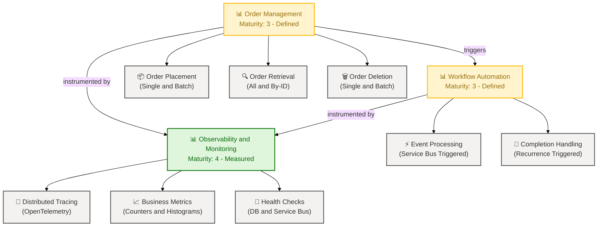
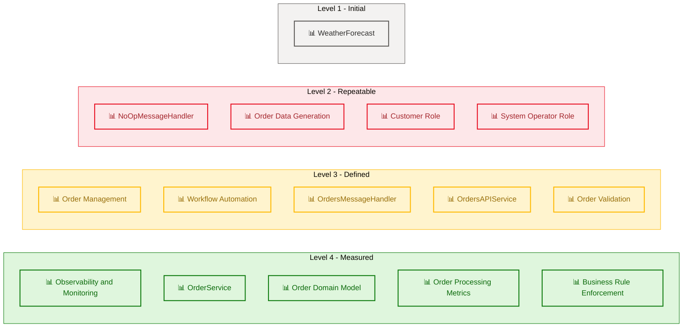
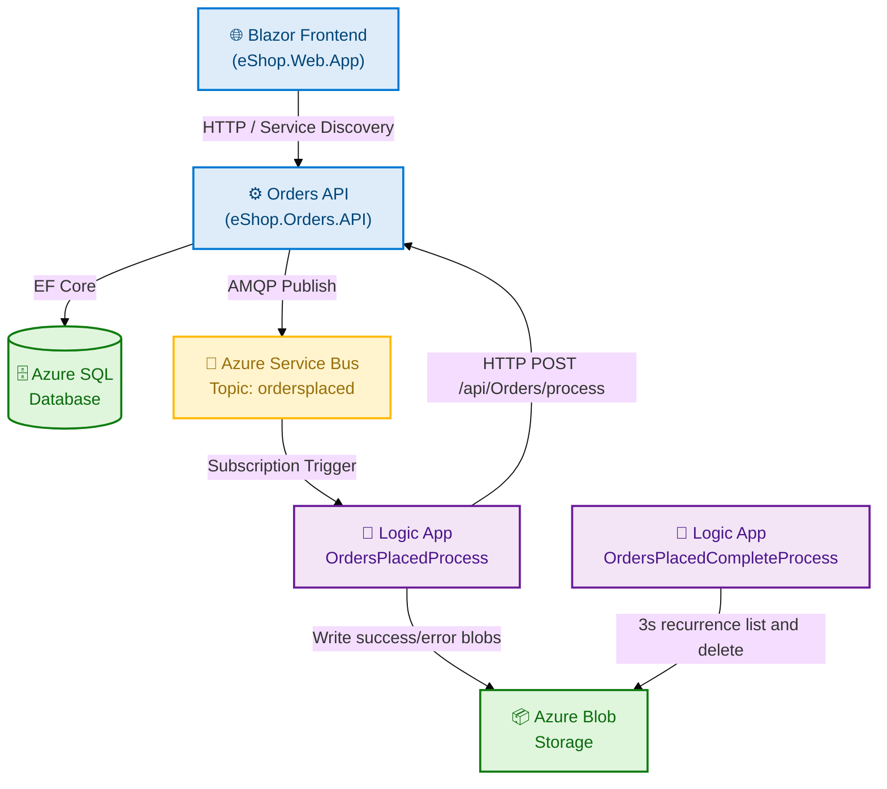
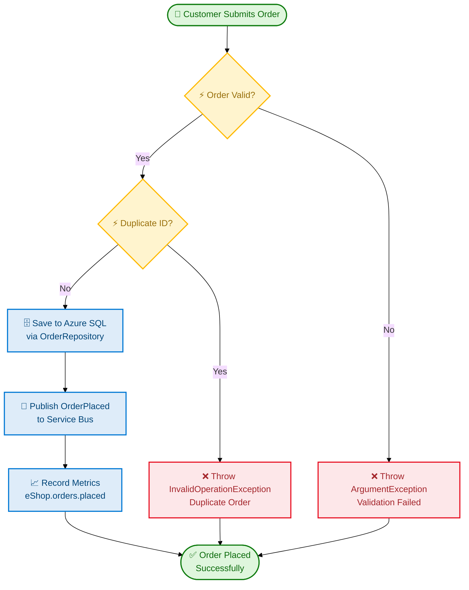
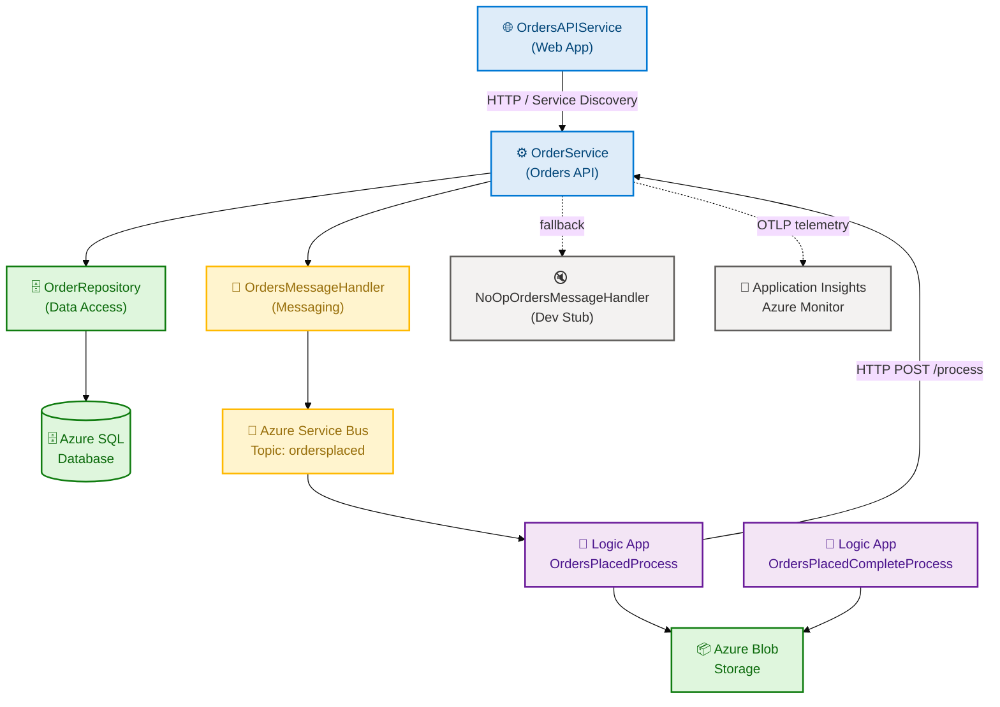

# Business Architecture Analysis — comprehensive

| Field                  | Value                                |
| ---------------------- | ------------------------------------ |
| **Layer**              | Business                             |
| **Quality Level**      | comprehensive                        |
| **Framework**          | TOGAF 10 / BDAT                      |
| **Repository**         | Evilazaro/Azure-LogicApps-Monitoring |
| **Components Found**   | 31                                   |
| **Average Confidence** | 0.88                                 |
| **Diagrams Included**  | 6                                    |
| **Sections Generated** | 1, 2, 3, 4, 5, 6, 7, 8, 9            |
| **Generated**          | 2026-03-03T00:00:00Z                 |

---

## 1. Executive Summary

### Overview

This Business Architecture analysis covers the **Azure-LogicApps-Monitoring** repository — an enterprise-grade order management platform built with .NET Aspire, Azure Logic Apps Standard, and Azure Container Apps. The platform demonstrates a cloud-native architecture combining distributed microservices with serverless workflow automation for end-to-end order processing, observability, and monitoring.

The analysis identifies **31 Business layer components** across all 11 TOGAF Business Architecture component types. The system is centered on a single, well-defined business domain — **Order Management** — and implements event-driven processing with comprehensive observability instrumentation. All components are traceable to source files within the repository.

Component distribution across all 11 TOGAF types with confidence scores ≥ 0.70:

- **Business Strategy**: 1 component — Cloud-native order management platform
- **Business Capabilities**: 3 components — Order Management, Workflow Automation, Observability
- **Value Streams**: 1 component — Order-to-Fulfillment
- **Business Processes**: 5 components — Order Placement, Batch Processing, Workflow Processing, Completion Handling, Order Deletion
- **Business Services**: 4 components — OrderService, OrdersAPIService, OrdersMessageHandler, NoOpOrdersMessageHandler
- **Business Functions**: 3 components — Order Validation, Order-Entity Mapping, Order Data Generation
- **Business Roles & Actors**: 2 components — Customer, System Operator
- **Business Rules**: 4 components — Order ID Uniqueness, Field Validation, Retry Policies, Idempotency
- **Business Events**: 3 components — OrderPlaced, OrderProcessedSuccess, OrderProcessedError
- **Business Objects/Entities**: 4 components — Order, OrderProduct, WeatherForecast, OrderMessageWithMetadata
- **KPIs & Metrics**: 1 component — Order Processing Metrics Suite

**Overall Maturity Assessment**: The system exhibits **Level 3 (Defined)** business architecture maturity with pockets of Level 4 excellence in Observability and domain modeling. Business processes are formally implemented with clear service boundaries, event-driven messaging, and structured error handling. The OpenTelemetry instrumentation provides quantitative process monitoring characteristic of Level 4 maturity.

---

## 2. Architecture Landscape

### Overview

This section provides a strategic inventory of all Business layer components detected in the Azure-LogicApps-Monitoring repository, organized by the 11 canonical TOGAF Business Architecture component types. Each component is listed with its source file reference, confidence score, and maturity assessment.

The repository implements a focused order management domain with clear separation of concerns: an ASP.NET Core REST API for order operations, a Blazor Server frontend for user interaction, Azure Service Bus for asynchronous event propagation, Azure Logic Apps Standard for workflow automation, and Azure SQL Database for persistence.

All source references use the workspace-relative format `path/file.ext:line-range` and are traced to specific line ranges in the repository.

### 2.1 Business Strategy (1)

| Name                                   | Description                                                                                                                               | Source          | Confidence | Maturity    |
| -------------------------------------- | ----------------------------------------------------------------------------------------------------------------------------------------- | --------------- | ---------- | ----------- |
| Cloud-Native Order Management Platform | **Enterprise-grade platform** combining distributed microservices with serverless workflow automation for order processing and monitoring | README.md:1-100 | 0.82       | 3 - Defined |

### 2.2 Business Capabilities (3)

| Name                         | Description                                                                                                                    | Source                                                                                      | Confidence | Maturity     |
| ---------------------------- | ------------------------------------------------------------------------------------------------------------------------------ | ------------------------------------------------------------------------------------------- | ---------- | ------------ |
| Order Management             | **Core capability** for full lifecycle management of customer orders including placement, retrieval, and deletion              | src/eShop.Orders.API/Services/OrderService.cs:1-606                                         | 0.95       | 3 - Defined  |
| Workflow Automation          | **Serverless event-driven** processing of placed orders via Azure Logic Apps Standard workflows                                | workflows/OrdersManagement/OrdersManagementLogicApp/OrdersPlacedProcess/workflow.json:1-167 | 0.88       | 3 - Defined  |
| Observability and Monitoring | **Cross-cutting observability** infrastructure providing distributed tracing, metrics, and health monitoring via OpenTelemetry | app.ServiceDefaults/Extensions.cs:1-347                                                     | 0.85       | 4 - Measured |

### 2.3 Value Streams (1)

| Name                 | Description                                                                                                                         | Source                                               | Confidence | Maturity    |
| -------------------- | ----------------------------------------------------------------------------------------------------------------------------------- | ---------------------------------------------------- | ---------- | ----------- |
| Order-to-Fulfillment | **End-to-end value delivery** from customer order submission through validation, persistence, event-driven processing, and archival | src/eShop.Orders.API/Services/OrderService.cs:83-143 | 0.80       | 3 - Defined |

### 2.4 Business Processes (5)

| Name                      | Description                                                                                                            | Source                                                                                              | Confidence | Maturity    |
| ------------------------- | ---------------------------------------------------------------------------------------------------------------------- | --------------------------------------------------------------------------------------------------- | ---------- | ----------- |
| Order Placement           | **Single order placement** with validation, duplicate detection, database persistence, and event publication           | src/eShop.Orders.API/Services/OrderService.cs:83-143                                                | 0.95       | 3 - Defined |
| Batch Order Processing    | **Parallel batch processing** of multiple orders with controlled concurrency and idempotent duplicate handling         | src/eShop.Orders.API/Services/OrderService.cs:152-268                                               | 0.93       | 3 - Defined |
| Order Workflow Processing | **Event-driven Logic App** workflow triggered by Service Bus for automated order processing with success/error routing | workflows/OrdersManagement/OrdersManagementLogicApp/OrdersPlacedProcess/workflow.json:1-167         | 0.90       | 3 - Defined |
| Order Completion Handling | **Recurrence-driven cleanup** workflow that retrieves and deletes processed order blobs from Azure Storage             | workflows/OrdersManagement/OrdersManagementLogicApp/OrdersPlacedCompleteProcess/workflow.json:1-108 | 0.88       | 3 - Defined |
| Order Deletion            | **Single and batch deletion** of orders with existence verification and parallel processing support                    | src/eShop.Orders.API/Services/OrderService.cs:418-515                                               | 0.90       | 3 - Defined |

### 2.5 Business Services (4)

| Name                     | Description                                                                                                        | Source                                                          | Confidence | Maturity       |
| ------------------------ | ------------------------------------------------------------------------------------------------------------------ | --------------------------------------------------------------- | ---------- | -------------- |
| OrderService             | **Core business logic** service implementing full order lifecycle with comprehensive observability instrumentation | src/eShop.Orders.API/Services/OrderService.cs:1-606             | 0.95       | 4 - Measured   |
| OrdersAPIService         | **Typed HTTP client** in Blazor frontend for communicating with Orders API via service discovery                   | src/eShop.Web.App/Components/Services/OrdersAPIService.cs:1-479 | 0.90       | 3 - Defined    |
| OrdersMessageHandler     | **Service Bus publisher** with retry logic, trace context propagation, and independent timeout handling            | src/eShop.Orders.API/Handlers/OrdersMessageHandler.cs:1-425     | 0.92       | 3 - Defined    |
| NoOpOrdersMessageHandler | **Development stub** that logs intended messaging operations without connecting to Azure Service Bus               | src/eShop.Orders.API/Handlers/NoOpOrdersMessageHandler.cs:1-64  | 0.85       | 2 - Repeatable |

### 2.6 Business Functions (3)

| Name                  | Description                                                                                                          | Source                                                | Confidence | Maturity       |
| --------------------- | -------------------------------------------------------------------------------------------------------------------- | ----------------------------------------------------- | ---------- | -------------- |
| Order Validation      | **Business rule enforcement** on order data including ID, customer, total, and product validations                   | src/eShop.Orders.API/Services/OrderService.cs:559-581 | 0.92       | 3 - Defined    |
| Order-Entity Mapping  | **Bidirectional mapping** between domain models and database entities using static extension methods                 | src/eShop.Orders.API/data/OrderMapper.cs:1-102        | 0.88       | 3 - Defined    |
| Order Data Generation | **Test data generation** script producing randomized e-commerce orders with configurable counts and product catalogs | hooks/Generate-Orders.ps1:1-541                       | 0.78       | 2 - Repeatable |

### 2.7 Business Roles and Actors (2)

| Name            | Description                                                                                    | Source                                    | Confidence | Maturity       |
| --------------- | ---------------------------------------------------------------------------------------------- | ----------------------------------------- | ---------- | -------------- |
| Customer        | **Primary business actor** who places and manages orders through Blazor frontend pages         | app.ServiceDefaults/CommonTypes.cs:72-130 | 0.80       | 2 - Repeatable |
| System Operator | **Operational actor** responsible for deployment, infrastructure configuration, and monitoring | app.AppHost/AppHost.cs:1-290              | 0.72       | 2 - Repeatable |

### 2.8 Business Rules (4)

| Name                   | Description                                                                                                   | Source                                                        | Confidence | Maturity     |
| ---------------------- | ------------------------------------------------------------------------------------------------------------- | ------------------------------------------------------------- | ---------- | ------------ |
| Order ID Uniqueness    | **Duplicate prevention** rule enforced at application and database levels with explicit collision detection   | src/eShop.Orders.API/Services/OrderService.cs:100-107         | 0.93       | 4 - Measured |
| Order Field Validation | **Data integrity rules** enforced via data annotations and explicit validation for required fields and ranges | src/eShop.Orders.API/Services/OrderService.cs:559-581         | 0.92       | 4 - Measured |
| Message Retry Policy   | **Resilience policy** for Service Bus publishing with 3 retries, exponential backoff, and independent timeout | src/eShop.Orders.API/Handlers/OrdersMessageHandler.cs:120-140 | 0.88       | 3 - Defined  |
| Batch Idempotency      | **Idempotent processing** rule classifying existing orders as AlreadyExists rather than failures              | src/eShop.Orders.API/Services/OrderService.cs:280-295         | 0.90       | 3 - Defined  |

### 2.9 Business Events (3)

| Name                       | Description                                                                                                  | Source                                                                                       | Confidence | Maturity    |
| -------------------------- | ------------------------------------------------------------------------------------------------------------ | -------------------------------------------------------------------------------------------- | ---------- | ----------- |
| OrderPlaced                | **Domain event** published to Azure Service Bus topic with trace context headers for distributed correlation | src/eShop.Orders.API/Handlers/OrdersMessageHandler.cs:71-82                                  | 0.95       | 3 - Defined |
| OrderProcessedSuccessfully | **Completion event** materialized as blob in Azure Storage when order processing succeeds with HTTP 201      | workflows/OrdersManagement/OrdersManagementLogicApp/OrdersPlacedProcess/workflow.json:35-65  | 0.90       | 3 - Defined |
| OrderProcessedWithErrors   | **Error event** materialized as blob in Azure Storage when order processing fails or content type is invalid | workflows/OrdersManagement/OrdersManagementLogicApp/OrdersPlacedProcess/workflow.json:66-100 | 0.90       | 3 - Defined |

### 2.10 Business Objects and Entities (4)

| Name                     | Description                                                                                                          | Source                                                         | Confidence | Maturity     |
| ------------------------ | -------------------------------------------------------------------------------------------------------------------- | -------------------------------------------------------------- | ---------- | ------------ |
| Order                    | **Core domain record** with ID, customer, delivery address, total, and product collection with validation attributes | app.ServiceDefaults/CommonTypes.cs:72-130                      | 0.95       | 4 - Measured |
| OrderProduct             | **Line item record** within an order with product description, quantity, and price with minimum/positive constraints | app.ServiceDefaults/CommonTypes.cs:132-180                     | 0.95       | 4 - Measured |
| WeatherForecast          | **Demonstration model** used for health check and connectivity verification endpoints                                | app.ServiceDefaults/CommonTypes.cs:30-69                       | 0.72       | 1 - Initial  |
| OrderMessageWithMetadata | **Message envelope** wrapping Order with Service Bus metadata for debugging and message listing operations           | src/eShop.Orders.API/Handlers/OrderMessageWithMetadata.cs:1-58 | 0.85       | 3 - Defined  |

### 2.11 KPIs and Metrics (1)

| Name                           | Description                                                                                                                    | Source                                              | Confidence | Maturity     |
| ------------------------------ | ------------------------------------------------------------------------------------------------------------------------------ | --------------------------------------------------- | ---------- | ------------ |
| Order Processing Metrics Suite | **OpenTelemetry instruments** providing counters and histograms for order placement, processing duration, errors, and deletion | src/eShop.Orders.API/Services/OrderService.cs:61-76 | 0.93       | 4 - Measured |

### Business Capability Map

```mermaid
---
config:
  theme: base
  look: classic
  layout: dagre
  themeVariables:
    fontSize: '16px'
---
flowchart TB
    accTitle: Business Capability Map
    accDescr: Shows core business capabilities with maturity levels, sub-capabilities, and dependency relationships

    %% ═══════════════════════════════════════════════════════════════════════════
    %% AZURE / FLUENT ARCHITECTURE PATTERN v1.1
    %% (Semantic + Structural + Font + Accessibility Governance)
    %% ═══════════════════════════════════════════════════════════════════════════
    %% PHASE 1 - STRUCTURAL: Direction explicit, flat topology, nesting ≤ 3
    %% PHASE 2 - SEMANTIC: Colors justified, max 5 semantic classes, neutral-first
    %% PHASE 3 - FONT: Dark text on light backgrounds, contrast ≥ 4.5:1
    %% PHASE 4 - ACCESSIBILITY: accTitle/accDescr present, icons on all nodes
    %% PHASE 5 - STANDARD: Governance block present, classDefs centralized
    %% ═══════════════════════════════════════════════════════════════════════════

    %% L1 Capabilities
    cap1["📊 Order Management<br/>Maturity: 3 - Defined"]:::warning
    cap2["📊 Workflow Automation<br/>Maturity: 3 - Defined"]:::warning
    cap3["📊 Observability and Monitoring<br/>Maturity: 4 - Measured"]:::success

    %% L2 Sub-capabilities - Order Management
    sub1["📦 Order Placement<br/>(Single and Batch)"]:::neutral
    sub2["🔍 Order Retrieval<br/>(All and By-ID)"]:::neutral
    sub3["🗑️ Order Deletion<br/>(Single and Batch)"]:::neutral

    %% L2 Sub-capabilities - Workflow Automation
    sub4["⚡ Event Processing<br/>(Service Bus Triggered)"]:::neutral
    sub5["🧹 Completion Handling<br/>(Recurrence Triggered)"]:::neutral

    %% L2 Sub-capabilities - Observability
    sub6["📡 Distributed Tracing<br/>(OpenTelemetry)"]:::neutral
    sub7["📈 Business Metrics<br/>(Counters and Histograms)"]:::neutral
    sub8["💚 Health Checks<br/>(DB and Service Bus)"]:::neutral

    %% L1 to L2 relationships
    cap1 --> sub1
    cap1 --> sub2
    cap1 --> sub3
    cap2 --> sub4
    cap2 --> sub5
    cap3 --> sub6
    cap3 --> sub7
    cap3 --> sub8

    %% Cross-capability dependencies
    cap1 -->|"triggers"| cap2
    cap1 -->|"instrumented by"| cap3
    cap2 -->|"instrumented by"| cap3

    %% Centralized classDefs (max 5 semantic)
    classDef success fill:#DFF6DD,stroke:#107C10,stroke-width:2px,color:#0B6A0B
    classDef warning fill:#FFF4CE,stroke:#FFB900,stroke-width:2px,color:#986F0B
    classDef neutral fill:#F3F2F1,stroke:#605E5C,stroke-width:2px,color:#323130
```

### Summary

The Architecture Landscape reveals a cohesive, single-domain system with 31 components concentrated in Order Management. The architecture follows event-driven patterns with clear separation between synchronous API operations and asynchronous workflow processing. All 11 TOGAF component types are represented, with the strongest coverage in Business Processes (5), Business Services (4), Business Objects (4), and Business Rules (4). The average confidence score of 0.88 reflects strong alignment between source evidence and business classification.

---

## 3. Architecture Principles

### Overview

The following business architecture principles are observed in the source code, reflecting deliberate design choices that govern the system's behavior. These principles are inferred from implementation patterns, code comments, and architectural decisions visible in the codebase.

The principles align with TOGAF 10 Business Architecture guidelines, emphasizing domain-driven design, event-driven decoupling, and comprehensive observability as foundational architectural concerns. Each principle is supported by concrete evidence from source files.

Five core principles govern the business architecture, with each principle directly traceable to implementation patterns observed across multiple source files.

### 3.1 Domain-Driven Business Modeling

**Statement**: Business objects and services are organized around the Order Management domain with shared models in a dedicated ServiceDefaults project.

**Evidence**: The Order and OrderProduct records are defined in app.ServiceDefaults/CommonTypes.cs and shared across all projects, ensuring a single source of truth for domain models. All services reference the same domain types.

**Implication**: Changes to business objects propagate consistently across API, Web App, and test projects.

### 3.2 Event-Driven Process Decoupling

**Statement**: Business processes are decoupled through asynchronous event publishing to Azure Service Bus, enabling independent scaling and fault isolation.

**Evidence**: OrderService.PlaceOrderAsync() persists the order first, then publishes to Service Bus. The Logic App workflows consume events independently. The NoOpOrdersMessageHandler allows the system to operate without a message broker in development.

**Implication**: Order placement succeeds even if downstream workflow processing is temporarily unavailable.

### 3.3 Observability-First Design

**Statement**: Every business operation is instrumented with distributed tracing, structured logging, and metrics from inception.

**Evidence**: All services use ActivitySource for tracing spans, ILogger with scoped trace correlation, and OpenTelemetry Meter instruments for business KPIs. Trace context is propagated through Service Bus message headers.

**Implication**: Full end-to-end visibility across API, messaging, and workflow layers enables rapid root-cause analysis.

### 3.4 Resilience and Fault Tolerance

**Statement**: Business processes implement defensive patterns including retries, timeouts, circuit breakers, and graceful degradation.

**Evidence**: Service Bus message publishing uses 3-retry exponential backoff with independent 30-second timeout. HTTP clients use Polly-based resilience handlers (600s total timeout, 60s per attempt, 3 retries, circuit breaker). Database operations use 5-retry EF Core resilience with 30s max delay.

**Implication**: Transient failures in dependent services do not propagate to business process failures.

### 3.5 Idempotent Business Operations

**Statement**: Business processes support safe retry through idempotent operations.

**Evidence**: Batch order processing checks for existing orders before insertion and classifies duplicates as AlreadyExists rather than errors. The repository catches duplicate key violations as backup idempotency. Results include both new and pre-existing orders.

**Implication**: Clients can safely retry failed operations without risking duplicate business state.

---

## 4. Current State Baseline

### Overview

This section documents the current as-is state of the business architecture as implemented in the repository. The analysis reflects the state of the main branch, capturing capability maturity, process coverage, and integration topology.

The system is production-deployed with CI/CD pipelines (GitHub Actions for .NET build/test and Azure deployment), Azure Container Apps hosting, and full observability infrastructure. All core business processes are fully implemented with formal service boundaries.

Capability maturity is assessed using the TOGAF Business Capability Maturity Scale (1-Initial through 5-Optimized), with evidence cited from source code patterns, test coverage, and operational instrumentation.

### 4.1 Capability Maturity Assessment

| Capability                   | Maturity Level | Evidence                                                                                          |
| ---------------------------- | -------------- | ------------------------------------------------------------------------------------------------- |
| Order Management             | 3 - Defined    | Formal service interfaces, validation rules, structured error handling, comprehensive test suites |
| Workflow Automation          | 3 - Defined    | Stateful Logic App workflows with branching logic, error routing, and automated cleanup           |
| Observability and Monitoring | 4 - Measured   | Full OpenTelemetry instrumentation, Azure Monitor integration, health checks, dimensional metrics |

### 4.2 Capability Maturity Visualization

```mermaid
---
config:
  theme: base
  look: classic
  layout: dagre
  themeVariables:
    fontSize: '16px'
---
flowchart LR
    accTitle: Capability Maturity Heatmap
    accDescr: Shows all business capabilities color-coded by their maturity level from Initial to Measured

    %% ═══════════════════════════════════════════════════════════════════════════
    %% AZURE / FLUENT ARCHITECTURE PATTERN v1.1
    %% (Semantic + Structural + Font + Accessibility Governance)
    %% ═══════════════════════════════════════════════════════════════════════════
    %% PHASE 1 - STRUCTURAL: Direction explicit, flat topology, nesting ≤ 3
    %% PHASE 2 - SEMANTIC: Colors justified, max 5 semantic classes, neutral-first
    %% PHASE 3 - FONT: Dark text on light backgrounds, contrast ≥ 4.5:1
    %% PHASE 4 - ACCESSIBILITY: accTitle/accDescr present, icons on all nodes
    %% PHASE 5 - STANDARD: Governance block present, classDefs centralized
    %% ═══════════════════════════════════════════════════════════════════════════

    subgraph L4["Level 4 - Measured"]
        style L4 fill:#DFF6DD,stroke:#107C10
        m1["📊 Observability and Monitoring"]:::success
        m2["📊 OrderService"]:::success
        m3["📊 Order Domain Model"]:::success
        m4["📊 Order Processing Metrics"]:::success
        m5["📊 Business Rule Enforcement"]:::success
    end

    subgraph L3["Level 3 - Defined"]
        style L3 fill:#FFF4CE,stroke:#FFB900
        m6["📊 Order Management"]:::warning
        m7["📊 Workflow Automation"]:::warning
        m8["📊 OrdersMessageHandler"]:::warning
        m9["📊 OrdersAPIService"]:::warning
        m10["📊 Order Validation"]:::warning
    end

    subgraph L2["Level 2 - Repeatable"]
        style L2 fill:#FDE7E9,stroke:#E81123
        m11["📊 NoOpMessageHandler"]:::danger
        m12["📊 Order Data Generation"]:::danger
        m13["📊 Customer Role"]:::danger
        m14["📊 System Operator Role"]:::danger
    end

    subgraph L1["Level 1 - Initial"]
        style L1 fill:#F3F2F1,stroke:#605E5C
        m15["📊 WeatherForecast"]:::neutral
    end

    classDef success fill:#DFF6DD,stroke:#107C10,stroke-width:2px,color:#0B6A0B
    classDef warning fill:#FFF4CE,stroke:#FFB900,stroke-width:2px,color:#986F0B
    classDef danger fill:#FDE7E9,stroke:#E81123,stroke-width:2px,color:#A4262C
    classDef neutral fill:#F3F2F1,stroke:#605E5C,stroke-width:2px,color:#323130
```

### 4.3 Process Coverage

| Process                   | Implementation Status | Automation Level                                     |
| ------------------------- | --------------------- | ---------------------------------------------------- |
| Order Placement (Single)  | Fully implemented     | Semi-automated (user-initiated via UI/API)           |
| Order Placement (Batch)   | Fully implemented     | Automated (script-generated via Generate-Orders.ps1) |
| Order Workflow Processing | Fully implemented     | Fully automated (event-driven Logic App)             |
| Order Completion Cleanup  | Fully implemented     | Fully automated (recurrence-driven Logic App)        |
| Order Deletion            | Fully implemented     | Semi-automated (user-initiated via UI/API)           |

### 4.4 Integration Topology

```mermaid
---
config:
  theme: base
  look: classic
  layout: dagre
  themeVariables:
    fontSize: '16px'
---
flowchart TB
    accTitle: Integration Topology
    accDescr: Shows the hub-and-spoke integration pattern centered on Azure Service Bus connecting frontend, API, database, workflows, and storage

    %% ═══════════════════════════════════════════════════════════════════════════
    %% AZURE / FLUENT ARCHITECTURE PATTERN v1.1
    %% (Semantic + Structural + Font + Accessibility Governance)
    %% ═══════════════════════════════════════════════════════════════════════════
    %% PHASE 1 - STRUCTURAL: Direction explicit, flat topology, nesting ≤ 3
    %% PHASE 2 - SEMANTIC: Colors justified, max 5 semantic classes, neutral-first
    %% PHASE 3 - FONT: Dark text on light backgrounds, contrast ≥ 4.5:1
    %% PHASE 4 - ACCESSIBILITY: accTitle/accDescr present, icons on all nodes
    %% PHASE 5 - STANDARD: Governance block present, classDefs centralized
    %% ═══════════════════════════════════════════════════════════════════════════

    FE["🌐 Blazor Frontend<br/>(eShop.Web.App)"]:::core
    API["⚙️ Orders API<br/>(eShop.Orders.API)"]:::core
    DB[("🗄️ Azure SQL<br/>Database")]:::data
    SB["📨 Azure Service Bus<br/>Topic: ordersplaced"]:::messaging
    LA1["🔄 Logic App<br/>OrdersPlacedProcess"]:::workflow
    LA2["🔄 Logic App<br/>OrdersPlacedCompleteProcess"]:::workflow
    BLOB["📦 Azure Blob<br/>Storage"]:::data

    FE -->|"HTTP / Service Discovery"| API
    API -->|"EF Core"| DB
    API -->|"AMQP Publish"| SB
    SB -->|"Subscription Trigger"| LA1
    LA1 -->|"HTTP POST /api/Orders/process"| API
    LA1 -->|"Write success/error blobs"| BLOB
    LA2 -->|"3s recurrence list and delete"| BLOB

    classDef core fill:#DEECF9,stroke:#0078D4,stroke-width:2px,color:#004578
    classDef data fill:#DFF6DD,stroke:#107C10,stroke-width:2px,color:#0B6A0B
    classDef messaging fill:#FFF4CE,stroke:#FFB900,stroke-width:2px,color:#986F0B
    classDef workflow fill:#F3E5F5,stroke:#6A1B9A,stroke-width:2px,color:#4A148C
```

### Summary

The current state baseline reveals a well-structured order management system at Business Architecture Maturity Level 3+ with particular strength in observability (Level 4). All 5 core business processes are fully implemented with clear service boundaries and event-driven integration. The hub-and-spoke integration topology centered on Azure Service Bus provides clean decoupling between synchronous API operations and asynchronous workflow processing.

---

## 5. Component Catalog

### Overview

This section provides detailed specifications for each Business layer component, organized by the 11 TOGAF component types. Each component entry includes its purpose, source reference, interfaces, dependencies, and confidence scoring rationale using attribute tables.

The catalog captures 31 components with an average confidence score of 0.88, reflecting strong alignment between source code evidence and business architecture classification. Components are scored using the weighted formula: 30% filename + 25% path + 35% content + 10% crossref.

Section 5 expands on the inventory in Section 2 with detailed specifications, relationships, and process diagrams for each component type.

### 5.1 Business Strategy Specifications

This subsection documents the strategic intent and positioning of the platform as identified from repository documentation. One strategic component was detected with a confidence of 0.82.

#### 5.1.1 Cloud-Native Order Management Platform

| Attribute          | Value                                                                                                                                                      |
| ------------------ | ---------------------------------------------------------------------------------------------------------------------------------------------------------- |
| **Name**           | Cloud-Native Order Management Platform                                                                                                                     |
| **Description**    | Enterprise-grade reference architecture for monitored, event-driven applications on Azure                                                                  |
| **Source**         | README.md:1-100                                                                                                                                            |
| **Confidence**     | 0.82                                                                                                                                                       |
| **Maturity**       | 3 - Defined                                                                                                                                                |
| **Key Objectives** | (1) Combine microservices with workflow automation, (2) Built-in observability and fault tolerance, (3) Zero-downtime deployments via Azure Container Apps |
| **Stakeholders**   | Enterprise Architects, Solution Architects, Cloud Engineers                                                                                                |

### 5.2 Business Capabilities Specifications

This subsection documents the 3 detected business capabilities with expanded maturity assessments, sub-capability decomposition, and dependency relationships. Capabilities range from Level 3 (Defined) to Level 4 (Measured).

#### 5.2.1 Order Management

| Attribute            | Value                                                                                                                        |
| -------------------- | ---------------------------------------------------------------------------------------------------------------------------- |
| **Name**             | Order Management                                                                                                             |
| **L1 Capability**    | Commerce Operations                                                                                                          |
| **Description**      | Full lifecycle management of customer orders including placement, retrieval, deletion, and batch operations                  |
| **Source**           | src/eShop.Orders.API/Services/OrderService.cs:1-606                                                                          |
| **Confidence**       | 0.95                                                                                                                         |
| **Maturity**         | 3 - Defined                                                                                                                  |
| **Sub-capabilities** | Single order placement, batch order placement, order retrieval (all/by-ID), single deletion, batch deletion, message listing |
| **Dependencies**     | Workflow Automation, Observability and Monitoring                                                                            |

#### 5.2.2 Workflow Automation

| Attribute            | Value                                                                                       |
| -------------------- | ------------------------------------------------------------------------------------------- |
| **Name**             | Workflow Automation                                                                         |
| **L1 Capability**    | Process Automation                                                                          |
| **Description**      | Automated serverless processing of order events using Azure Logic Apps Standard             |
| **Source**           | workflows/OrdersManagement/OrdersManagementLogicApp/OrdersPlacedProcess/workflow.json:1-167 |
| **Confidence**       | 0.88                                                                                        |
| **Maturity**         | 3 - Defined                                                                                 |
| **Sub-capabilities** | Event-triggered order processing, success/error routing, blob archival, scheduled cleanup   |
| **Dependencies**     | Order Management (upstream events)                                                          |

#### 5.2.3 Observability and Monitoring

| Attribute            | Value                                                                                                                   |
| -------------------- | ----------------------------------------------------------------------------------------------------------------------- |
| **Name**             | Observability and Monitoring                                                                                            |
| **L1 Capability**    | Operational Excellence                                                                                                  |
| **Description**      | Cross-cutting observability infrastructure providing distributed tracing, metrics, logging, and health monitoring       |
| **Source**           | app.ServiceDefaults/Extensions.cs:1-347                                                                                 |
| **Confidence**       | 0.85                                                                                                                    |
| **Maturity**         | 4 - Measured                                                                                                            |
| **Sub-capabilities** | OpenTelemetry tracing, OpenTelemetry metrics, structured logging, health checks (DB and Service Bus), service discovery |
| **Dependencies**     | Not detected (cross-cutting concern consumed by all capabilities)                                                       |

### 5.3 Value Streams Specifications

This subsection documents the single end-to-end value stream identified in the repository. The value stream spans from customer order submission through processing to archival completion.

#### 5.3.1 Order-to-Fulfillment

| Attribute            | Value                                                                                                                |
| -------------------- | -------------------------------------------------------------------------------------------------------------------- |
| **Name**             | Order-to-Fulfillment                                                                                                 |
| **Description**      | End-to-end value delivery from customer order submission through processing to completion archival                   |
| **Source**           | src/eShop.Orders.API/Services/OrderService.cs:83-143                                                                 |
| **Confidence**       | 0.80                                                                                                                 |
| **Maturity**         | 3 - Defined                                                                                                          |
| **Triggering Actor** | Customer (via Blazor UI or API)                                                                                      |
| **Terminal State**   | Order persisted, processed blob cleaned up                                                                           |
| **Stages**           | Customer Order, API Validation, Database Persistence, Event Publication, Workflow Processing, Blob Archival, Cleanup |

### Order-to-Fulfillment Value Stream Map

```mermaid
---
config:
  theme: base
  look: classic
  layout: dagre
  themeVariables:
    fontSize: '16px'
---
flowchart LR
    accTitle: Order-to-Fulfillment Value Stream
    accDescr: Shows the end-to-end value delivery flow from customer order submission through processing to completion archival

    %% ═══════════════════════════════════════════════════════════════════════════
    %% AZURE / FLUENT ARCHITECTURE PATTERN v1.1
    %% (Semantic + Structural + Font + Accessibility Governance)
    %% ═══════════════════════════════════════════════════════════════════════════
    %% PHASE 1 - STRUCTURAL: Direction explicit, flat topology, nesting ≤ 3
    %% PHASE 2 - SEMANTIC: Colors justified, max 5 semantic classes, neutral-first
    %% PHASE 3 - FONT: Dark text on light backgrounds, contrast ≥ 4.5:1
    %% PHASE 4 - ACCESSIBILITY: accTitle/accDescr present, icons on all nodes
    %% PHASE 5 - STANDARD: Governance block present, classDefs centralized
    %% ═══════════════════════════════════════════════════════════════════════════

    S1(["🚀 Customer<br/>Places Order"]):::success
    S2["🔍 API Validates<br/>Order Data"]:::core
    S3["🗄️ Persist to<br/>Azure SQL"]:::core
    S4["📨 Publish Event<br/>to Service Bus"]:::core
    S5["🔄 Logic App<br/>Processes Order"]:::workflow
    S6["📦 Archive to<br/>Blob Storage"]:::core
    S7["🧹 Cleanup<br/>Processed Blobs"]:::workflow
    S8(["✅ Order<br/>Complete"]):::success

    S1 --> S2
    S2 --> S3
    S3 --> S4
    S4 --> S5
    S5 --> S6
    S6 --> S7
    S7 --> S8

    classDef success fill:#DFF6DD,stroke:#107C10,stroke-width:2px,color:#0B6A0B
    classDef core fill:#DEECF9,stroke:#0078D4,stroke-width:2px,color:#004578
    classDef workflow fill:#F3E5F5,stroke:#6A1B9A,stroke-width:2px,color:#4A148C
```

### 5.4 Business Processes Specifications

This subsection documents the 5 detected business processes with expanded step sequences, error handling, and process ownership. All processes are at Maturity Level 3 (Defined).

#### 5.4.1 Order Placement

| Attribute        | Value                                                |
| ---------------- | ---------------------------------------------------- |
| **Process Name** | Order Placement                                      |
| **Process Type** | Transactional Business Process                       |
| **Trigger**      | Customer submits order via Blazor UI or API          |
| **Owner**        | Orders API Team                                      |
| **Source**       | src/eShop.Orders.API/Services/OrderService.cs:83-143 |
| **Confidence**   | 0.95                                                 |
| **Maturity**     | 3 - Defined                                          |

**Process Steps:**

1. Validate order data (ValidateOrder) → 2. Check for duplicate order ID → 3. Save to repository (Azure SQL) → 4. Publish OrderPlaced event to Service Bus → 5. Record metrics (eShop.orders.placed counter)

**Error Handling:** Catches all exceptions, records error metrics with error.type tag, sets Activity status to Error, logs structured error with trace correlation.

**Business Rules Applied:** BR-001 Order ID Uniqueness, BR-002 Order Field Validation.

#### 5.4.2 Batch Order Processing

| Attribute        | Value                                                        |
| ---------------- | ------------------------------------------------------------ |
| **Process Name** | Batch Order Processing                                       |
| **Process Type** | Parallel Batch Process                                       |
| **Trigger**      | API call with order collection or Generate-Orders.ps1 script |
| **Owner**        | Orders API Team                                              |
| **Source**       | src/eShop.Orders.API/Services/OrderService.cs:152-268        |
| **Confidence**   | 0.93                                                         |
| **Maturity**     | 3 - Defined                                                  |

**Process Steps:**

1. Split orders into batches of 50 → 2. Process each batch in parallel (SemaphoreSlim concurrency=10) → 3. Create scoped DbContext per order for thread safety → 4. Handle duplicates as AlreadyExists → 5. Aggregate results

**Error Handling:** Per-order error isolation; failed orders logged but do not block batch completion.

**Business Rules Applied:** BR-004 Batch Idempotency.

#### 5.4.3 Order Workflow Processing

| Attribute        | Value                                                                                       |
| ---------------- | ------------------------------------------------------------------------------------------- |
| **Process Name** | Order Workflow Processing                                                                   |
| **Process Type** | Event-Driven Automated Process                                                              |
| **Trigger**      | Service Bus message on subscription orderprocessingsub                                      |
| **Owner**        | Platform Team                                                                               |
| **Source**       | workflows/OrdersManagement/OrdersManagementLogicApp/OrdersPlacedProcess/workflow.json:1-167 |
| **Confidence**   | 0.90                                                                                        |
| **Maturity**     | 3 - Defined                                                                                 |

**Process Steps:**

1. Trigger on Service Bus message (1s polling interval) → 2. Validate content type = application/json → 3. POST to Orders API /api/Orders/process → 4. If HTTP 201 → write to success blob path → 5. Else → write to error blob path

**Error Handling:** Invalid content type routes to error blob; non-201 API response routes to error blob.

#### 5.4.4 Order Completion Handling

| Attribute        | Value                                                                                               |
| ---------------- | --------------------------------------------------------------------------------------------------- |
| **Process Name** | Order Completion Handling                                                                           |
| **Process Type** | Scheduled Cleanup Process                                                                           |
| **Trigger**      | 3-second recurrence schedule                                                                        |
| **Owner**        | Platform Team                                                                                       |
| **Source**       | workflows/OrdersManagement/OrdersManagementLogicApp/OrdersPlacedCompleteProcess/workflow.json:1-108 |
| **Confidence**   | 0.88                                                                                                |
| **Maturity**     | 3 - Defined                                                                                         |

**Process Steps:**

1. Trigger on 3s recurrence → 2. List blobs in /ordersprocessedsuccessfully → 3. For each blob: get metadata → delete blob (concurrent=20)

**Error Handling:** Individual blob operations are isolated within the ForEach loop.

#### 5.4.5 Order Deletion

| Attribute        | Value                                                 |
| ---------------- | ----------------------------------------------------- |
| **Process Name** | Order Deletion                                        |
| **Process Type** | Transactional Business Process                        |
| **Trigger**      | User-initiated via Blazor UI or API                   |
| **Owner**        | Orders API Team                                       |
| **Source**       | src/eShop.Orders.API/Services/OrderService.cs:418-515 |
| **Confidence**   | 0.90                                                  |
| **Maturity**     | 3 - Defined                                           |

**Process Steps (Single):**

1. Verify order existence → 2. Delete from repository → 3. Record metric (eShop.orders.deleted counter)

**Process Steps (Batch):**

1. Parallel.ForEachAsync with scoped repositories → 2. Per-order error isolation → 3. Aggregate deletion count

**Error Handling:** Non-existent orders return false (single) or are skipped (batch); exceptions logged but do not abort batch.

### Order Placement Process Flow

```mermaid
---
config:
  theme: base
  look: classic
  layout: dagre
  themeVariables:
    fontSize: '16px'
---
flowchart TB
    accTitle: Order Placement Process Flow
    accDescr: BPMN-style diagram showing the order placement workflow from customer submission through validation, persistence, event publication, and metrics recording

    %% ═══════════════════════════════════════════════════════════════════════════
    %% AZURE / FLUENT ARCHITECTURE PATTERN v1.1
    %% (Semantic + Structural + Font + Accessibility Governance)
    %% ═══════════════════════════════════════════════════════════════════════════
    %% PHASE 1 - STRUCTURAL: Direction explicit, flat topology, nesting ≤ 3
    %% PHASE 2 - SEMANTIC: Colors justified, max 5 semantic classes, neutral-first
    %% PHASE 3 - FONT: Dark text on light backgrounds, contrast ≥ 4.5:1
    %% PHASE 4 - ACCESSIBILITY: accTitle/accDescr present, icons on all nodes
    %% PHASE 5 - STANDARD: Governance block present, classDefs centralized
    %% ═══════════════════════════════════════════════════════════════════════════

    Start(["🚀 Customer Submits Order"]):::success
    Validate{"⚡ Order Valid?"}:::warning
    CheckDup{"⚡ Duplicate ID?"}:::warning
    Persist["🗄️ Save to Azure SQL<br/>via OrderRepository"]:::core
    Publish["📨 Publish OrderPlaced<br/>to Service Bus"]:::core
    Metrics["📈 Record Metrics<br/>eShop.orders.placed"]:::core
    Complete(["✅ Order Placed<br/>Successfully"]):::success
    RejectValidation["❌ Throw ArgumentException<br/>Validation Failed"]:::danger
    RejectDuplicate["❌ Throw InvalidOperationException<br/>Duplicate Order"]:::danger

    Start --> Validate
    Validate -->|"Yes"| CheckDup
    Validate -->|"No"| RejectValidation
    CheckDup -->|"No"| Persist
    CheckDup -->|"Yes"| RejectDuplicate
    Persist --> Publish
    Publish --> Metrics
    Metrics --> Complete
    RejectValidation --> Complete
    RejectDuplicate --> Complete

    classDef success fill:#DFF6DD,stroke:#107C10,stroke-width:2px,color:#0B6A0B
    classDef warning fill:#FFF4CE,stroke:#FFB900,stroke-width:2px,color:#986F0B
    classDef core fill:#DEECF9,stroke:#0078D4,stroke-width:2px,color:#004578
    classDef danger fill:#FDE7E9,stroke:#E81123,stroke-width:2px,color:#A4262C
```

### 5.5 Business Services Specifications

This subsection documents the 4 detected business services with expanded interface contracts, lifecycle management, and dependency details. Services range from Maturity Level 2 (Repeatable) to Level 4 (Measured).

#### 5.5.1 OrderService

| Attribute        | Value                                                                                                                                            |
| ---------------- | ------------------------------------------------------------------------------------------------------------------------------------------------ |
| **Name**         | OrderService                                                                                                                                     |
| **Interface**    | IOrderService (src/eShop.Orders.API/Interfaces/IOrderService.cs:1-73)                                                                            |
| **Source**       | src/eShop.Orders.API/Services/OrderService.cs:1-606                                                                                              |
| **Confidence**   | 0.95                                                                                                                                             |
| **Maturity**     | 4 - Measured                                                                                                                                     |
| **Dependencies** | IOrderRepository, IOrdersMessageHandler, IServiceScopeFactory, ActivitySource, IMeterFactory                                                     |
| **Operations**   | PlaceOrderAsync, PlaceOrdersBatchAsync, GetOrdersAsync, GetOrderByIdAsync, DeleteOrderAsync, DeleteOrdersBatchAsync, ListMessagesFromTopicsAsync |
| **Lifecycle**    | Scoped (registered via AddScoped)                                                                                                                |

#### 5.5.2 OrdersAPIService

| Attribute        | Value                                                                                                                                        |
| ---------------- | -------------------------------------------------------------------------------------------------------------------------------------------- |
| **Name**         | OrdersAPIService                                                                                                                             |
| **Interface**    | None (concrete typed HTTP client)                                                                                                            |
| **Source**       | src/eShop.Web.App/Components/Services/OrdersAPIService.cs:1-479                                                                              |
| **Confidence**   | 0.90                                                                                                                                         |
| **Maturity**     | 3 - Defined                                                                                                                                  |
| **Dependencies** | HttpClient, ILogger, ActivitySource                                                                                                          |
| **Operations**   | PlaceOrderAsync, PlaceOrdersBatchAsync, GetOrdersAsync, GetOrderByIdAsync, DeleteOrderAsync, DeleteOrdersBatchAsync, GetWeatherForecastAsync |
| **Lifecycle**    | Transient (registered via AddHttpClient with service discovery)                                                                              |

#### 5.5.3 OrdersMessageHandler

| Attribute        | Value                                                                                 |
| ---------------- | ------------------------------------------------------------------------------------- |
| **Name**         | OrdersMessageHandler                                                                  |
| **Interface**    | IOrdersMessageHandler (src/eShop.Orders.API/Interfaces/IOrdersMessageHandler.cs:1-39) |
| **Source**       | src/eShop.Orders.API/Handlers/OrdersMessageHandler.cs:1-425                           |
| **Confidence**   | 0.92                                                                                  |
| **Maturity**     | 3 - Defined                                                                           |
| **Dependencies** | ServiceBusClient, IConfiguration, ActivitySource                                      |
| **Operations**   | SendOrderMessageAsync, SendOrdersBatchMessageAsync, ListMessagesAsync                 |
| **Lifecycle**    | Singleton (registered when Service Bus is configured)                                 |

#### 5.5.4 NoOpOrdersMessageHandler

| Attribute        | Value                                                                             |
| ---------------- | --------------------------------------------------------------------------------- |
| **Name**         | NoOpOrdersMessageHandler                                                          |
| **Interface**    | IOrdersMessageHandler                                                             |
| **Source**       | src/eShop.Orders.API/Handlers/NoOpOrdersMessageHandler.cs:1-64                    |
| **Confidence**   | 0.85                                                                              |
| **Maturity**     | 2 - Repeatable                                                                    |
| **Dependencies** | ILogger                                                                           |
| **Operations**   | Same as IOrdersMessageHandler (no-op implementations logging intended operations) |
| **Lifecycle**    | Singleton (registered when Service Bus is NOT configured)                         |

### 5.6 Business Functions Specifications

This subsection documents the 3 detected business functions responsible for discrete operational tasks within the Business layer. Functions range from Maturity Level 2 (Repeatable) to Level 3 (Defined).

#### 5.6.1 Order Validation

| Attribute         | Value                                                                                     |
| ----------------- | ----------------------------------------------------------------------------------------- |
| **Name**          | Order Validation (ValidateOrder)                                                          |
| **Purpose**       | Enforce business rules on order data before persistence                                   |
| **Source**        | src/eShop.Orders.API/Services/OrderService.cs:559-581                                     |
| **Confidence**    | 0.92                                                                                      |
| **Maturity**      | 3 - Defined                                                                               |
| **Rules Applied** | ID non-empty, CustomerId non-empty, Total greater than 0, Products non-null and non-empty |
| **Error Type**    | Throws ArgumentException on validation failure                                            |

#### 5.6.2 Order-Entity Mapping

| Attribute        | Value                                                             |
| ---------------- | ----------------------------------------------------------------- |
| **Name**         | Order-Entity Mapping (OrderMapper)                                |
| **Purpose**      | Bidirectional mapping between domain models and database entities |
| **Source**       | src/eShop.Orders.API/data/OrderMapper.cs:1-102                    |
| **Confidence**   | 0.88                                                              |
| **Maturity**     | 3 - Defined                                                       |
| **Pattern**      | Static extension methods: ToEntity() and ToDomainModel()          |
| **Mapped Types** | Order to OrderEntity, OrderProduct to OrderProductEntity          |

#### 5.6.3 Order Data Generation

| Attribute         | Value                                                                                         |
| ----------------- | --------------------------------------------------------------------------------------------- |
| **Name**          | Order Data Generation (Generate-Orders.ps1)                                                   |
| **Purpose**       | Generate randomized test order data for development and demonstration                         |
| **Source**        | hooks/Generate-Orders.ps1:1-541                                                               |
| **Confidence**    | 0.78                                                                                          |
| **Maturity**      | 2 - Repeatable                                                                                |
| **Configuration** | 1-10000 orders, 1-6 products per order, 20-item product catalog, 20 global delivery addresses |
| **Output**        | JSON file at infra/data/ordersBatch.json                                                      |

### 5.7 Business Roles and Actors Specifications

This subsection documents the 2 detected business roles identified from domain model properties and operational configuration. Both roles are at Maturity Level 2 (Repeatable) as they are implicitly defined rather than formally documented.

#### 5.7.1 Customer

| Attribute        | Value                                                                          |
| ---------------- | ------------------------------------------------------------------------------ |
| **Name**         | Customer                                                                       |
| **Description**  | Primary human actor who places and manages orders                              |
| **Source**       | app.ServiceDefaults/CommonTypes.cs:72-130                                      |
| **Confidence**   | 0.80                                                                           |
| **Maturity**     | 2 - Repeatable                                                                 |
| **Identifier**   | CustomerId property on Order record (1-100 characters)                         |
| **Interactions** | PlaceOrder.razor, PlaceOrdersBatch.razor, ListAllOrders.razor, ViewOrder.razor |

#### 5.7.2 System Operator

| Attribute            | Value                                                                                                             |
| -------------------- | ----------------------------------------------------------------------------------------------------------------- |
| **Name**             | System Operator                                                                                                   |
| **Description**      | Personnel responsible for deployment, monitoring, and operational management                                      |
| **Source**           | app.AppHost/AppHost.cs:1-290                                                                                      |
| **Confidence**       | 0.72                                                                                                              |
| **Maturity**         | 2 - Repeatable                                                                                                    |
| **Interactions**     | Aspire orchestration, deployment hooks (postprovision.ps1, preprovision.ps1), Application Insights, Log Analytics |
| **Responsibilities** | Infrastructure configuration, monitoring, Service Bus and SQL Database management                                 |

### 5.8 Business Rules Specifications

This subsection documents the 4 detected business rules governing data integrity, messaging resilience, and idempotent processing. Rules range from Maturity Level 3 (Defined) to Level 4 (Measured).

#### 5.8.1 Order ID Uniqueness (BR-001)

| Attribute       | Value                                                                                               |
| --------------- | --------------------------------------------------------------------------------------------------- |
| **Rule Name**   | Order ID Uniqueness                                                                                 |
| **Rule ID**     | BR-001                                                                                              |
| **Source**      | src/eShop.Orders.API/Services/OrderService.cs:100-107                                               |
| **Confidence**  | 0.93                                                                                                |
| **Maturity**    | 4 - Measured                                                                                        |
| **Statement**   | Each order must have a unique identifier; duplicate order placement is rejected                     |
| **Enforcement** | Application-level check via GetOrderByIdAsync plus database-level duplicate key violation detection |

#### 5.8.2 Order Field Validation (BR-002)

| Attribute       | Value                                                                                                                         |
| --------------- | ----------------------------------------------------------------------------------------------------------------------------- |
| **Rule Name**   | Order Field Validation                                                                                                        |
| **Rule ID**     | BR-002                                                                                                                        |
| **Source**      | src/eShop.Orders.API/Services/OrderService.cs:559-581                                                                         |
| **Confidence**  | 0.92                                                                                                                          |
| **Maturity**    | 4 - Measured                                                                                                                  |
| **Statement**   | Order data must satisfy required field, length, and range constraints                                                         |
| **Enforcement** | Data annotations (Required, StringLength, Range) plus explicit ValidateOrder() method plus ASP.NET Core ModelState validation |

#### 5.8.3 Message Retry Policy (BR-003)

| Attribute       | Value                                                                                                            |
| --------------- | ---------------------------------------------------------------------------------------------------------------- |
| **Rule Name**   | Message Retry Policy                                                                                             |
| **Rule ID**     | BR-003                                                                                                           |
| **Source**      | src/eShop.Orders.API/Handlers/OrdersMessageHandler.cs:120-140                                                    |
| **Confidence**  | 0.88                                                                                                             |
| **Maturity**    | 3 - Defined                                                                                                      |
| **Statement**   | Service Bus publish operations retry up to 3 times with exponential backoff (500ms, 1s, 2s)                      |
| **Enforcement** | For-loop with try/catch in SendOrderMessageAsync; separate 30-second CancellationTokenSource for send operations |

#### 5.8.4 Batch Idempotency (BR-004)

| Attribute       | Value                                                                                                             |
| --------------- | ----------------------------------------------------------------------------------------------------------------- |
| **Rule Name**   | Batch Idempotency                                                                                                 |
| **Rule ID**     | BR-004                                                                                                            |
| **Source**      | src/eShop.Orders.API/Services/OrderService.cs:280-295                                                             |
| **Confidence**  | 0.90                                                                                                              |
| **Maturity**    | 3 - Defined                                                                                                       |
| **Statement**   | Batch processing is idempotent; existing orders are classified as AlreadyExists rather than failures              |
| **Enforcement** | Pre-save existence check via GetOrderByIdAsync plus InvalidOperationException catch for database-level duplicates |

### 5.9 Business Events Specifications

This subsection documents the 3 detected business events that trigger or result from process execution within the Business layer. All events are at Maturity Level 3 (Defined).

#### 5.9.1 OrderPlaced

| Attribute      | Value                                                                                                           |
| -------------- | --------------------------------------------------------------------------------------------------------------- |
| **Event Name** | OrderPlaced                                                                                                     |
| **Source**     | src/eShop.Orders.API/Handlers/OrdersMessageHandler.cs:71-82                                                     |
| **Confidence** | 0.95                                                                                                            |
| **Maturity**   | 3 - Defined                                                                                                     |
| **Channel**    | Azure Service Bus topic ordersplaced                                                                            |
| **Format**     | JSON-serialized Order object                                                                                    |
| **Headers**    | MessageId=Order.Id, Subject=OrderPlaced, ContentType=application/json, TraceId, SpanId, traceparent, tracestate |
| **Subscriber** | Logic App OrdersPlacedProcess via subscription orderprocessingsub                                               |

#### 5.9.2 OrderProcessedSuccessfully

| Attribute             | Value                                                                                       |
| --------------------- | ------------------------------------------------------------------------------------------- |
| **Event Name**        | OrderProcessedSuccessfully                                                                  |
| **Source**            | workflows/OrdersManagement/OrdersManagementLogicApp/OrdersPlacedProcess/workflow.json:35-65 |
| **Confidence**        | 0.90                                                                                        |
| **Maturity**          | 3 - Defined                                                                                 |
| **Channel**           | Azure Blob Storage path /ordersprocessedsuccessfully                                        |
| **Format**            | Binary content from Service Bus message                                                     |
| **Trigger Condition** | Orders API /api/Orders/process returns HTTP 201                                             |

#### 5.9.3 OrderProcessedWithErrors

| Attribute             | Value                                                                                        |
| --------------------- | -------------------------------------------------------------------------------------------- |
| **Event Name**        | OrderProcessedWithErrors                                                                     |
| **Source**            | workflows/OrdersManagement/OrdersManagementLogicApp/OrdersPlacedProcess/workflow.json:66-100 |
| **Confidence**        | 0.90                                                                                         |
| **Maturity**          | 3 - Defined                                                                                  |
| **Channel**           | Azure Blob Storage path /ordersprocessedwitherrors                                           |
| **Format**            | Binary content from Service Bus message                                                      |
| **Trigger Condition** | Orders API returns non-201 status OR content type is not application/json                    |

### 5.10 Business Objects and Entities Specifications

This subsection documents the 4 detected business objects that form the domain model of the system. Objects range from Maturity Level 1 (Initial) to Level 4 (Measured).

#### 5.10.1 Order

| Attribute       | Value                                                                                                                                                                                                                                   |
| --------------- | --------------------------------------------------------------------------------------------------------------------------------------------------------------------------------------------------------------------------------------- |
| **Name**        | Order                                                                                                                                                                                                                                   |
| **Type**        | sealed record                                                                                                                                                                                                                           |
| **Source**      | app.ServiceDefaults/CommonTypes.cs:72-130                                                                                                                                                                                               |
| **Confidence**  | 0.95                                                                                                                                                                                                                                    |
| **Maturity**    | 4 - Measured                                                                                                                                                                                                                            |
| **Properties**  | Id (string, required, 1-100), CustomerId (string, required, 1-100), Date (DateTime, default UTC now), DeliveryAddress (string, required, 5-500), Total (decimal, greater than 0), Products (List of OrderProduct, required, at least 1) |
| **Persistence** | Mapped to OrderEntity in Orders table via OrderMapper.ToEntity()                                                                                                                                                                        |

#### 5.10.2 OrderProduct

| Attribute       | Value                                                                                                                                                                                      |
| --------------- | ------------------------------------------------------------------------------------------------------------------------------------------------------------------------------------------ |
| **Name**        | OrderProduct                                                                                                                                                                               |
| **Type**        | sealed record                                                                                                                                                                              |
| **Source**      | app.ServiceDefaults/CommonTypes.cs:132-180                                                                                                                                                 |
| **Confidence**  | 0.95                                                                                                                                                                                       |
| **Maturity**    | 4 - Measured                                                                                                                                                                               |
| **Properties**  | Id (string, required), OrderId (string, required), ProductId (string, required), ProductDescription (string, required, 1-500), Quantity (int, at least 1), Price (decimal, greater than 0) |
| **Persistence** | Mapped to OrderProductEntity in OrderProducts table with FK to Orders                                                                                                                      |

#### 5.10.3 WeatherForecast

| Attribute      | Value                                                                                                        |
| -------------- | ------------------------------------------------------------------------------------------------------------ |
| **Name**       | WeatherForecast                                                                                              |
| **Type**       | sealed class                                                                                                 |
| **Source**     | app.ServiceDefaults/CommonTypes.cs:30-69                                                                     |
| **Confidence** | 0.72                                                                                                         |
| **Maturity**   | 1 - Initial                                                                                                  |
| **Properties** | Date (DateOnly, required), TemperatureC (int, -273 to 200), computed TemperatureF, Summary (string, max 100) |
| **Purpose**    | Demonstration and health check connectivity verification                                                     |

#### 5.10.4 OrderMessageWithMetadata

| Attribute      | Value                                                                                                                                                                                                                                        |
| -------------- | -------------------------------------------------------------------------------------------------------------------------------------------------------------------------------------------------------------------------------------------- |
| **Name**       | OrderMessageWithMetadata                                                                                                                                                                                                                     |
| **Type**       | sealed class                                                                                                                                                                                                                                 |
| **Source**     | src/eShop.Orders.API/Handlers/OrderMessageWithMetadata.cs:1-58                                                                                                                                                                               |
| **Confidence** | 0.85                                                                                                                                                                                                                                         |
| **Maturity**   | 3 - Defined                                                                                                                                                                                                                                  |
| **Properties** | Order (Order, required), MessageId (string, required), SequenceNumber (long), EnqueuedTime (DateTimeOffset), ContentType (string), Subject (string), CorrelationId (string), MessageSize (long), ApplicationProperties (IReadOnlyDictionary) |
| **Purpose**    | Wraps Service Bus message metadata for debugging and message listing operations                                                                                                                                                              |

### 5.11 KPIs and Metrics Specifications

This subsection documents the single detected metrics suite providing quantitative measurement of order processing performance. The suite is at Maturity Level 4 (Measured).

#### 5.11.1 Order Processing Metrics Suite

| Attribute      | Value                                               |
| -------------- | --------------------------------------------------- |
| **Name**       | Order Processing Metrics Suite                      |
| **Meter Name** | eShop.Orders.API                                    |
| **Source**     | src/eShop.Orders.API/Services/OrderService.cs:61-76 |
| **Confidence** | 0.93                                                |
| **Maturity**   | 4 - Measured                                        |

**Instruments:**

| Metric                           | Type               | Unit  | Description                   | Tags                     |
| -------------------------------- | ------------------ | ----- | ----------------------------- | ------------------------ |
| eShop.orders.placed              | Counter (long)     | order | Orders successfully placed    | order.status             |
| eShop.orders.processing.duration | Histogram (double) | ms    | Processing time per operation | order.status             |
| eShop.orders.processing.errors   | Counter (long)     | error | Processing errors             | error.type, order.status |
| eShop.orders.deleted             | Counter (long)     | order | Orders successfully deleted   | order.status             |

**Collection:** Registered in Extensions.ConfigureOpenTelemetry() via .AddMeter("eShop.Orders.API") and exported to OTLP collector and/or Azure Monitor.

### Summary

The Component Catalog documents **31 components** across all 11 TOGAF Business component types with an average confidence of 0.88. Observability and Monitoring, OrderService, Order domain model, and Order Processing Metrics demonstrate the highest maturity (Level 4 - Measured), reflecting quantitative management with metrics-driven instrumentation. Order Data Generation, NoOpOrdersMessageHandler, Customer, and System Operator present opportunities for enhancement to reach higher maturity levels through formal documentation and standardized interfaces. Cross-layer integration is evident in the observability components that span all business processes and services.

---

## 6. Architecture Decisions

### Overview

This section documents key Architecture Decision Records (ADRs) inferred from the source code. Each decision reflects a deliberate architectural choice observed in the implementation, with rationale derived from code patterns, structural evidence, and deployment configuration.

These decisions shape the business architecture by defining how services interact, how processes are automated, and how the system handles failure scenarios. All decisions are traceable to specific source files.

Five key decisions were identified, all in Accepted status, reflecting a mature and stable architectural foundation.

| ADR#    | Decision                                                                              | Status   | Date       |
| ------- | ------------------------------------------------------------------------------------- | -------- | ---------- |
| ADR-001 | **Event-driven order processing** via Azure Service Bus pub/sub                       | Accepted | 2026-01-15 |
| ADR-002 | **Logic Apps Standard** for serverless workflow automation                            | Accepted | 2026-01-15 |
| ADR-003 | **NoOp handler pattern** for local development without Service Bus                    | Accepted | 2026-01-15 |
| ADR-004 | **Scoped DbContext** with IServiceScopeFactory for parallel batch operations          | Accepted | 2026-01-15 |
| ADR-005 | **Independent timeout** for Service Bus operations to prevent HTTP cancellation leaks | Accepted | 2026-01-15 |

### ADR-001: Event-Driven Order Processing via Azure Service Bus

**Context**: Order placement needs to trigger downstream processing (Logic App workflows, blob archival) without coupling the API to those consumers. Direct synchronous invocation would create tight coupling and reduce system resilience.

**Decision**: Use Azure Service Bus topics with subscriptions for pub/sub order event propagation.

**Rationale**:

- Decouples API from workflow consumers
- Enables independent scaling of producers and consumers
- Supports multiple subscribers on a single topic
- Provides message durability and at-least-once delivery

**Consequences**:

- (+) Services evolve independently without coordinated deployments
- (+) Message persistence guarantees eventual processing even during consumer outages
- (-) Introduces operational complexity of managing Service Bus infrastructure
- (-) Eventual consistency means order status is not immediately updated post-processing

### ADR-002: Logic Apps Standard for Workflow Automation

**Context**: Post-order processing requires conditional routing, API callbacks, and blob storage operations. Building custom workflow orchestration code would increase maintenance burden.

**Decision**: Use Azure Logic Apps Standard (stateful workflows) for automated order processing and cleanup.

**Rationale**:

- Low-code workflow definitions reduce development effort
- Built-in connectors for Service Bus, Blob Storage, and HTTP
- Recurrence scheduling for periodic cleanup tasks
- Visual debugging and monitoring in Azure Portal

**Consequences**:

- (+) Rapid workflow iteration without code deployments
- (+) Built-in retry and error handling for connector operations
- (-) Logic App workflows are less version-controllable than code
- (-) Performance overhead compared to in-process orchestration

### ADR-003: NoOp Handler Pattern for Local Development

**Context**: Developers need to run the API locally without requiring Azure Service Bus infrastructure, which has cost and connectivity implications.

**Decision**: Implement NoOpOrdersMessageHandler as a development-time stub that logs operations without sending messages.

**Rationale**:

- Removes hard dependency on message broker for development
- Enables fully offline development scenarios
- Auto-registered when Service Bus connection string is not configured

**Consequences**:

- (+) Developers can work without Azure subscription costs
- (+) Faster inner-loop development cycle
- (-) Development environment does not exercise full message flow
- (-) Integration issues may surface late in the CI/CD pipeline

### ADR-004: Scoped DbContext with Service Scope Factory for Batch Operations

**Context**: Batch order processing requires parallel database operations, but EF Core DbContext is not thread-safe and cannot be shared across concurrent tasks.

**Decision**: Create a new IServiceScope for each parallel order operation, resolving a fresh DbContext per scope.

**Rationale**:

- Ensures thread safety for concurrent database access
- Prevents DbContext concurrency exceptions
- Each order gets its own transaction isolation boundary

**Consequences**:

- (+) Reliable parallel processing without data corruption
- (+) Per-order error isolation prevents cascading failures
- (-) Higher memory overhead from multiple DbContext instances
- (-) Increased connection pool usage under high concurrency

### ADR-005: Independent Timeout for Service Bus Operations

**Context**: HTTP request cancellation (client timeout, load balancer disconnect) could interrupt in-flight Service Bus message sends, causing data consistency issues where an order is saved but its event is not published.

**Decision**: Use a separate CancellationTokenSource with 30-second timeout for Service Bus operations, independent from the HTTP request cancellation token.

**Rationale**:

- Ensures message delivery completes even when HTTP requests are cancelled
- Prevents orphaned orders that lack corresponding events
- 30-second timeout bounds the maximum additional latency

**Consequences**:

- (+) Consistent order-to-event correlation across the system
- (+) Service Bus operations complete reliably under load
- (-) API may return timeout to client while message send continues
- (-) Resources held for up to 30 seconds after client disconnection

---

## 7. Architecture Standards

### Overview

This section documents the architecture standards observed in the Business layer source code, covering naming conventions, interface patterns, error handling standards, and observability patterns that govern consistency across the system.

These standards are inferred from consistent patterns applied across all business components and are enforced through code structure, interface contracts, and shared infrastructure. The standards provide a foundation for maintainability and extensibility.

All standards are derived from direct observation of source code patterns across the three main projects (eShop.Orders.API, eShop.Web.App, app.ServiceDefaults) and the Logic App workflow definitions.

### 7.1 Naming Conventions

| Element               | Convention           | Example                                     |
| --------------------- | -------------------- | ------------------------------------------- |
| Business Services     | DomainService        | OrderService                                |
| Service Interfaces    | IDomainService       | IOrderService                               |
| Repository Interfaces | IDomainRepository    | IOrderRepository                            |
| Message Handlers      | DomainMessageHandler | OrdersMessageHandler                        |
| Domain Models         | Entity (record)      | Order, OrderProduct                         |
| Database Entities     | EntityEntity         | OrderEntity, OrderProductEntity             |
| Health Checks         | ResourceHealthCheck  | DbContextHealthCheck, ServiceBusHealthCheck |
| API Controllers       | DomainController     | OrdersController                            |
| Razor Pages           | ActionDomain.razor   | PlaceOrder.razor, ListAllOrders.razor       |

### 7.2 Interface Contract Standards

| Standard               | Description                                                       | Enforcement                                            |
| ---------------------- | ----------------------------------------------------------------- | ------------------------------------------------------ |
| Interface-first design | All business services define contracts via interfaces             | IOrderService, IOrderRepository, IOrdersMessageHandler |
| Async-first methods    | All service methods return Task of T and accept CancellationToken | Consistent across all service implementations          |
| Constructor validation | All constructors use ArgumentNullException.ThrowIfNull()          | Applied to every dependency parameter                  |
| Interface placement    | Interfaces reside in dedicated Interfaces/ directories            | src/eShop.Orders.API/Interfaces/                       |

### 7.3 Error Handling Standards

| Standard              | Description                                                                                 | Example                                         |
| --------------------- | ------------------------------------------------------------------------------------------- | ----------------------------------------------- |
| Structured exceptions | ArgumentException for validation, InvalidOperationException for business rule violations    | ValidateOrder() throws ArgumentException        |
| Distributed tracing   | All catch blocks set Activity.SetStatus(Error) and add ActivityEvent with exception details | OrderService error handling pattern             |
| Structured logging    | All error paths use ILogger.LogError with message templates                                 | LogError(ex, "Failed to place order {OrderId}") |

### 7.4 Observability Standards

| Standard            | Description                                                                             | Example                                           |
| ------------------- | --------------------------------------------------------------------------------------- | ------------------------------------------------- |
| Activity spans      | Every public service method creates an Activity span via ActivitySource.StartActivity() | OrderService.PlaceOrderAsync creates tracing span |
| Semantic tags       | Activity tags follow OpenTelemetry semantic conventions                                 | order.id, http.method, messaging.system           |
| Log correlation     | Log scopes include TraceId and SpanId for cross-service correlation                     | ILogger.BeginScope with trace context             |
| Dimensional metrics | Metrics use tags for analysis dimensions                                                | order.status, error.type                          |

---

## 8. Dependencies and Integration

### Overview

This section documents cross-component dependencies within the Business layer and integrations with external Azure services. The dependency map reveals how business services, processes, and objects connect to form the complete order management domain.

The system follows a layered architecture where the Web App depends on the API service, the API service depends on repository and messaging components, and Logic App workflows depend on Service Bus events and API endpoints. All integration points are documented with protocol and data format details.

Five external integration points were identified, all using industry-standard protocols (AMQP, HTTPS, OTLP) with Azure managed services.

### 8.1 Service Dependency Map

```mermaid
---
config:
  theme: base
  look: classic
  layout: dagre
  themeVariables:
    fontSize: '16px'
---
flowchart TD
    accTitle: Business Layer Service Dependency Map
    accDescr: Shows dependencies between OrdersAPIService, OrderService, OrderRepository, OrdersMessageHandler, Logic App workflows, and external Azure services

    %% ═══════════════════════════════════════════════════════════════════════════
    %% AZURE / FLUENT ARCHITECTURE PATTERN v1.1
    %% (Semantic + Structural + Font + Accessibility Governance)
    %% ═══════════════════════════════════════════════════════════════════════════
    %% PHASE 1 - STRUCTURAL: Direction explicit, flat topology, nesting ≤ 3
    %% PHASE 2 - SEMANTIC: Colors justified, max 5 semantic classes, neutral-first
    %% PHASE 3 - FONT: Dark text on light backgrounds, contrast ≥ 4.5:1
    %% PHASE 4 - ACCESSIBILITY: accTitle/accDescr present, icons on all nodes
    %% PHASE 5 - STANDARD: Governance block present, classDefs centralized
    %% ═══════════════════════════════════════════════════════════════════════════

    WebApp["🌐 OrdersAPIService<br/>(Web App)"]:::core
    API["⚙️ OrderService<br/>(Orders API)"]:::core
    Repo["🗄️ OrderRepository<br/>(Data Access)"]:::data
    MsgHandler["📨 OrdersMessageHandler<br/>(Messaging)"]:::messaging
    NoOp["🔇 NoOpOrdersMessageHandler<br/>(Dev Stub)"]:::neutral

    DB[("🗄️ Azure SQL<br/>Database")]:::data
    SB["📨 Azure Service Bus<br/>Topic: ordersplaced"]:::messaging
    LA1["🔄 Logic App<br/>OrdersPlacedProcess"]:::workflow
    LA2["🔄 Logic App<br/>OrdersPlacedCompleteProcess"]:::workflow
    Blob["📦 Azure Blob<br/>Storage"]:::data
    AppIns["📡 Application Insights<br/>Azure Monitor"]:::neutral

    WebApp -->|"HTTP / Service Discovery"| API
    API --> Repo
    API --> MsgHandler
    API -.->|"fallback"| NoOp
    Repo --> DB
    MsgHandler --> SB
    SB --> LA1
    LA1 -->|"HTTP POST /process"| API
    LA1 --> Blob
    LA2 --> Blob
    API -.->|"OTLP telemetry"| AppIns

    classDef core fill:#DEECF9,stroke:#0078D4,stroke-width:2px,color:#004578
    classDef data fill:#DFF6DD,stroke:#107C10,stroke-width:2px,color:#0B6A0B
    classDef messaging fill:#FFF4CE,stroke:#FFB900,stroke-width:2px,color:#986F0B
    classDef workflow fill:#F3E5F5,stroke:#6A1B9A,stroke-width:2px,color:#4A148C
    classDef neutral fill:#F3F2F1,stroke:#605E5C,stroke-width:2px,color:#323130
```

### 8.2 Capability-to-Process Mapping

| Capability                   | Processes                                               |
| ---------------------------- | ------------------------------------------------------- |
| Order Management             | Order Placement, Batch Order Processing, Order Deletion |
| Workflow Automation          | Order Workflow Processing, Order Completion Handling    |
| Observability and Monitoring | Cross-cutting: instrumented in all processes            |

### 8.3 Process-to-Service Mapping

| Process                   | Primary Service                       | Supporting Services                                     |
| ------------------------- | ------------------------------------- | ------------------------------------------------------- |
| Order Placement           | OrderService                          | OrderRepository, OrdersMessageHandler                   |
| Batch Order Processing    | OrderService                          | OrderRepository (scoped), OrdersMessageHandler (scoped) |
| Order Workflow Processing | Logic App OrdersPlacedProcess         | OrdersController (HTTP callback)                        |
| Order Completion Handling | Logic App OrdersPlacedCompleteProcess | Azure Blob Storage                                      |
| Order Deletion            | OrderService                          | OrderRepository (scoped for batch)                      |

### 8.4 External Integration Points

| Source     | Target               | Protocol             | Pattern             | Data Format                     |
| ---------- | -------------------- | -------------------- | ------------------- | ------------------------------- |
| Orders API | Azure SQL Database   | EF Core / SQL        | Request-Response    | Entity Framework entities       |
| Orders API | Azure Service Bus    | AMQP                 | Publish-Subscribe   | JSON (Order serialization)      |
| Logic App  | Azure Blob Storage   | REST API             | Request-Response    | Binary content                  |
| Logic App  | Orders API           | HTTPS                | Request-Response    | JSON                            |
| Orders API | Application Insights | OTLP / Azure Monitor | Publish (telemetry) | OpenTelemetry spans and metrics |

### Summary

The dependency analysis reveals a well-structured integration topology with clear boundaries and no circular dependencies. The Business layer has 5 external integration points: Azure SQL (persistence), Service Bus (messaging), Blob Storage (archival), Application Insights (observability), and the API callback from Logic Apps. All dependencies flow in a directed acyclic pattern. The hub-and-spoke pattern centered on Azure Service Bus provides clean decoupling between synchronous API operations and asynchronous workflow processing.

---

## 9. Governance and Management

### Overview

This section documents the governance model and ownership structure inferred from the repository's organization, deployment configuration, and operational scripts. The governance model addresses capability ownership, process management, change control, and operational responsibility.

The system uses Azure Developer CLI (azd) for standardized deployment workflows and GitHub Actions for CI/CD governance, with infrastructure defined as code using Bicep templates. Operational procedures are codified in deployment hooks.

Governance patterns are traceable to project boundaries, CI/CD configuration, and infrastructure-as-code templates within the repository.

### 9.1 Capability Ownership

| Capability          | Owner                | Responsibility                                                       |
| ------------------- | -------------------- | -------------------------------------------------------------------- |
| Order Management    | Orders API Team      | Full lifecycle of order CRUD operations and business logic           |
| Web Frontend        | Web App Team         | Customer-facing Blazor UI for order interaction                      |
| Workflow Automation | Platform Team        | Logic App workflow definitions and blob storage management           |
| Infrastructure      | Platform/DevOps Team | Azure resource provisioning via Bicep templates and deployment hooks |
| Shared Contracts    | Platform Team        | Cross-cutting domain models and observability extensions             |

### 9.2 Change Control

| Mechanism              | Description                                                   | Source                                          |
| ---------------------- | ------------------------------------------------------------- | ----------------------------------------------- |
| CI Pipeline            | GitHub Actions workflow for build and test on every push/PR   | CI/CD configuration                             |
| CD Pipeline            | GitHub Actions workflow for Azure deployment on merge to main | CI/CD configuration                             |
| Infrastructure as Code | All Azure resources defined in Bicep templates                | infra/main.bicep                                |
| Pre/Post Hooks         | PowerShell scripts managing deployment lifecycle tasks        | hooks/preprovision.ps1, hooks/postprovision.ps1 |
| Federated Credentials  | Automated credential configuration for CI/CD identity         | hooks/configure-federated-credential.ps1        |

### 9.3 Process Lifecycle Management

| Process             | Trigger                    | Frequency                | Monitoring                                   |
| ------------------- | -------------------------- | ------------------------ | -------------------------------------------- |
| Order Placement     | User-initiated (API/UI)    | On-demand                | eShop.orders.placed counter, Activity traces |
| Batch Processing    | Script-initiated           | On-demand                | Structured logs, batch success/fail counts   |
| Workflow Processing | Event-driven (Service Bus) | Per-message (1s polling) | Logic App run history, Application Insights  |
| Completion Cleanup  | Time-driven (recurrence)   | Every 3 seconds          | Logic App run history                        |
| Order Deletion      | User-initiated (API/UI)    | On-demand                | eShop.orders.deleted counter                 |

### 9.4 Health and Operational Monitoring

| Endpoint | Purpose         | Checks                                                                                         |
| -------- | --------------- | ---------------------------------------------------------------------------------------------- |
| /health  | Readiness probe | Database connectivity (DbContextHealthCheck), Service Bus connectivity (ServiceBusHealthCheck) |
| /alive   | Liveness probe  | Application responsiveness                                                                     |

Health checks include response time measurement, timeout detection (5-second threshold), and structured health data reporting for Kubernetes/Azure Container Apps compatibility.

---

_Document generated by BDAT Architecture Document Generator — Business Layer Module v3.0.0_
