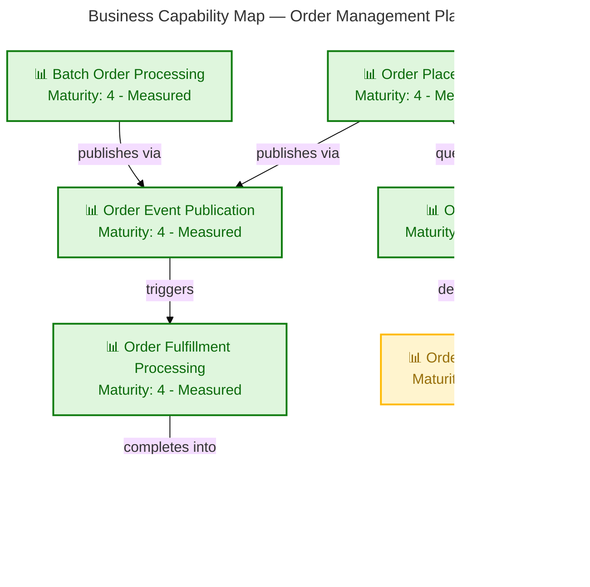
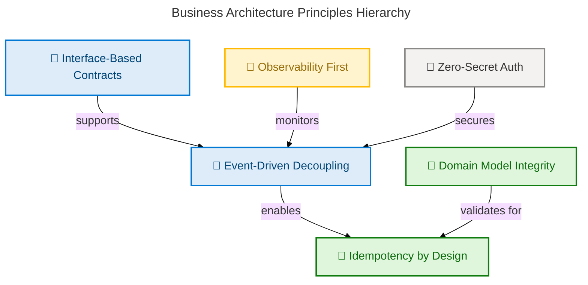
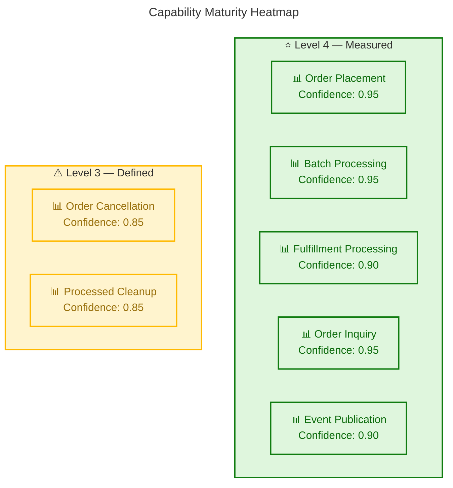
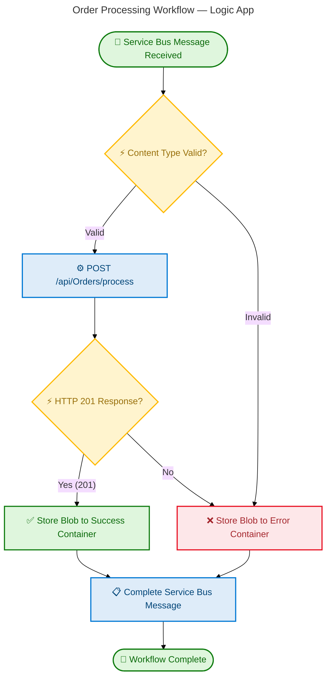
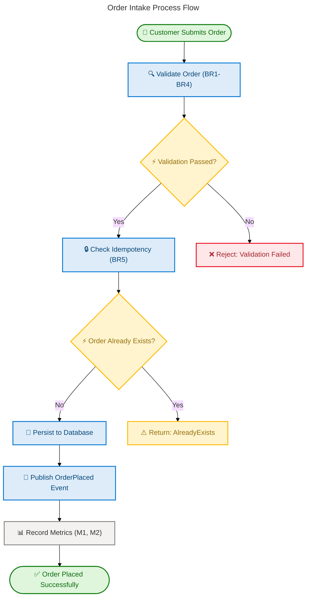
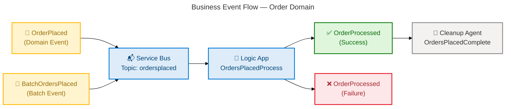
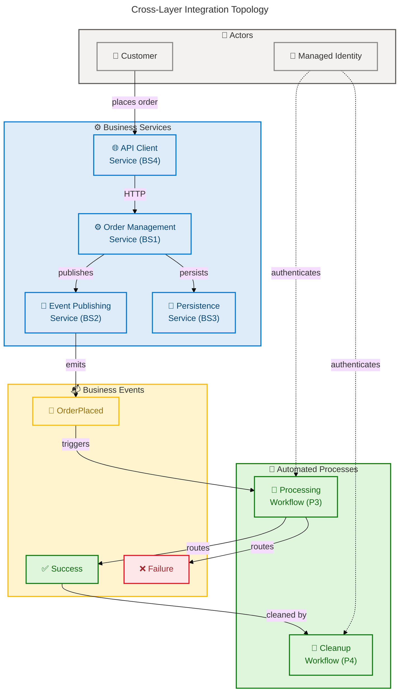

# Business Architecture Analysis — comprehensive

| Field                  | Value                      |
| ---------------------- | -------------------------- |
| **Layer**              | Business                   |
| **Quality Level**      | comprehensive              |
| **Framework**          | TOGAF 10 / BDAT            |
| **Repository**         | Azure-LogicApps-Monitoring |
| **Components Found**   | 50                         |
| **Average Confidence** | 0.89                       |
| **Diagrams Included**  | 8                          |
| **Sections Generated** | 1, 2, 3, 4, 5, 8           |
| **Generated**          | 2026-03-03T11:20:00Z       |

## 1. Executive Summary

### Overview

This Business Architecture analysis covers the Azure-LogicApps-Monitoring repository — an enterprise-grade order management platform built with .NET Aspire, Azure Logic Apps Standard, and Azure Container Apps. The analysis identifies and classifies 50 Business layer components across all 11 TOGAF Business Architecture component types, providing a comprehensive view of the organization's order lifecycle management capabilities, event-driven business processes, and operational governance patterns.

The platform implements a cloud-native order management domain centered on a single core value stream: Order-to-Fulfillment. Business capabilities span order placement (single and batch), automated fulfillment processing via serverless workflows, order inquiry and cancellation, and operational health monitoring. The architecture demonstrates a mature event-driven pattern where business events (OrderPlaced) trigger automated Logic App workflows that route processed orders to success or failure outcomes, with automated cleanup of completed processing artifacts.

The analysis reveals strong maturity (average 3.7/5.0) across core capabilities with well-defined business rules, comprehensive custom metrics instrumentation, and clear interface-based service contracts. Key gaps include the absence of explicit business strategy documentation, role-based access control, pricing/discount business rules, and formal SLA definitions — areas where the architecture would benefit from formalization to reach Level 5 (Optimized) maturity.

- **Business Strategy**: 3 components — implicit strategic positioning through architectural choices
- **Business Capabilities**: 7 components — order lifecycle management with batch processing and automation
- **Value Streams**: 1 component — end-to-end Order-to-Fulfillment flow
- **Business Processes**: 6 components — automated and operational workflows
- **Business Services**: 4 components — contract-based service catalog
- **Business Functions**: 5 components — validation, idempotency, parallelism, routing
- **Business Roles & Actors**: 4 components — human and system actors
- **Business Rules**: 10 components — validation, routing, and constraint rules
- **Business Events**: 4 components — domain events driving workflow automation
- **Business Objects/Entities**: 3 components — core domain model
- **KPIs & Metrics**: 3 components — custom business metrics
- **Average Confidence**: 0.89
- **Coverage Assessment**: 11/11 component types represented

## 2. Architecture Landscape

### Overview

This section provides a comprehensive inventory of all Business layer components detected in the Azure-LogicApps-Monitoring repository, organized by the 11 canonical TOGAF Business Architecture component types. Each component is listed with its source file evidence, confidence score calculated using the weighted formula (30% filename + 25% path + 35% content + 10% cross-reference), and maturity assessment on the 1–5 scale.

The component landscape reveals a domain-focused architecture centered on order lifecycle management. The strongest representation is in Business Rules (10 components) and Business Capabilities (7 components), reflecting a well-defined domain with explicit validation and processing logic. Business Processes (6 components) demonstrate mature workflow automation through Azure Logic Apps Standard. All components are traceable to source files within the repository.

### 2.1 Business Strategy (3)

| Name                               | Description                                                                                                                              | Source                                              | Confidence | Maturity     |
| ---------------------------------- | ---------------------------------------------------------------------------------------------------------------------------------------- | --------------------------------------------------- | ---------- | ------------ |
| Order Management Platform Strategy | **Strategic positioning** as a cloud-powered order processing platform for streamlined enterprise operations                             | src/eShop.Web.App/Components/Pages/Home.razor:16-22 | 0.75       | 3 - Defined  |
| Event-Driven Architecture Strategy | **Architectural strategy** choosing decoupled, event-driven processing with Service Bus messaging for independent scaling and resilience | app.AppHost/AppHost.cs:1-290                        | 0.80       | 4 - Measured |
| Observability-First Strategy       | **Cross-cutting strategic priority** on operational excellence through OpenTelemetry instrumentation baked into service defaults         | app.ServiceDefaults/Extensions.cs:1-40              | 0.85       | 4 - Measured |

### 2.2 Business Capabilities (7)

| Name                         | Description                                                                                                          | Source                                                                                              | Confidence | Maturity     |
| ---------------------------- | -------------------------------------------------------------------------------------------------------------------- | --------------------------------------------------------------------------------------------------- | ---------- | ------------ |
| Order Placement              | **Core capability** for accepting, validating, persisting, and publishing individual customer orders                 | src/eShop.Orders.API/Interfaces/IOrderService.cs:21-21                                              | 0.95       | 4 - Measured |
| Batch Order Processing       | **Core capability** for ingesting and processing high-volume order batches with concurrency control                  | src/eShop.Orders.API/Interfaces/IOrderService.cs:29-29                                              | 0.95       | 4 - Measured |
| Order Fulfillment Processing | **Automated capability** for consuming placed orders from the message queue and routing results to storage           | workflows/OrdersManagement/OrdersManagementLogicApp/OrdersPlacedProcess/workflow.json:1-200         | 0.90       | 4 - Measured |
| Order Inquiry                | **Core capability** for searching, browsing, and viewing orders with pagination and detail views                     | src/eShop.Orders.API/Interfaces/IOrderService.cs:36-44                                              | 0.95       | 4 - Measured |
| Order Cancellation           | **Supporting capability** for removing individual orders or batch-deleting selected orders                           | src/eShop.Orders.API/Interfaces/IOrderService.cs:52-60                                              | 0.85       | 3 - Defined  |
| Processed Order Cleanup      | **Automated capability** for periodic cleanup of successfully processed order blobs on a recurrence schedule         | workflows/OrdersManagement/OrdersManagementLogicApp/OrdersPlacedCompleteProcess/workflow.json:1-100 | 0.85       | 3 - Defined  |
| Order Event Publication      | **Integration capability** for publishing order-placed domain events to the message broker for downstream processing | src/eShop.Orders.API/Interfaces/IOrdersMessageHandler.cs:21-29                                      | 0.90       | 4 - Measured |

### 2.3 Value Streams (1)

| Name                 | Description                                                                                                                                                                | Source                                                                                      | Confidence | Maturity     |
| -------------------- | -------------------------------------------------------------------------------------------------------------------------------------------------------------------------- | ------------------------------------------------------------------------------------------- | ---------- | ------------ |
| Order-to-Fulfillment | **End-to-end value stream** from customer order placement through validation, persistence, event publication, automated workflow processing, outcome archival, and cleanup | workflows/OrdersManagement/OrdersManagementLogicApp/OrdersPlacedProcess/workflow.json:1-200 | 0.90       | 4 - Measured |

### 2.4 Business Processes (6)

| Name                             | Description                                                                                                                                          | Source                                                                                              | Confidence | Maturity     |
| -------------------------------- | ---------------------------------------------------------------------------------------------------------------------------------------------------- | --------------------------------------------------------------------------------------------------- | ---------- | ------------ |
| Order Intake Process             | **Operational process**: validate order, check idempotency, save to database, publish to message bus, record metrics                                 | src/eShop.Orders.API/Services/OrderService.cs:87-160                                                | 0.95       | 4 - Measured |
| Batch Order Intake Process       | **Operational process**: pre-check existing IDs, parallel processing via SemaphoreSlim(50), 5-minute timeout, aggregate results                      | src/eShop.Orders.API/Services/OrderService.cs:162-330                                               | 0.90       | 4 - Measured |
| Order Processing Workflow        | **Automated stateful workflow**: trigger on Service Bus message, check content type, POST to process endpoint, branch on HTTP 201, store result blob | workflows/OrdersManagement/OrdersManagementLogicApp/OrdersPlacedProcess/workflow.json:1-200         | 0.95       | 4 - Measured |
| Processed Order Cleanup Workflow | **Automated scheduled workflow**: recurrence timer (3s), list blobs in success container, for-each with concurrency 20, delete processed blobs       | workflows/OrdersManagement/OrdersManagementLogicApp/OrdersPlacedCompleteProcess/workflow.json:1-100 | 0.85       | 3 - Defined  |
| Order Deletion Process           | **Operational process**: delete individual or batch orders, record deletion metrics                                                                  | src/eShop.Orders.API/Services/OrderService.cs:421-535                                               | 0.85       | 3 - Defined  |
| Order Message Sending Process    | **Operational process**: serialize order, create ServiceBusMessage with subject "OrderPlaced", inject trace context, retry with exponential backoff  | src/eShop.Orders.API/Handlers/OrdersMessageHandler.cs:1-200                                         | 0.90       | 4 - Measured |

### 2.5 Business Services (4)

| Name                           | Description                                                                                                                               | Source                                                          | Confidence | Maturity     |
| ------------------------------ | ----------------------------------------------------------------------------------------------------------------------------------------- | --------------------------------------------------------------- | ---------- | ------------ |
| Order Management Service       | **Core business service** with 7 operations: place, batch place, query, query-by-id, delete, batch delete, list messages                  | src/eShop.Orders.API/Interfaces/IOrderService.cs:13-67          | 0.95       | 4 - Measured |
| Order Event Publishing Service | **Integration service** decoupling order persistence from downstream processing with 3 operations: send single, send batch, list messages | src/eShop.Orders.API/Interfaces/IOrdersMessageHandler.cs:13-36  | 0.90       | 4 - Measured |
| Order Persistence Service      | **Data access service** with 6 operations: save, query all, query paged, query by-id, delete, exists-check                                | src/eShop.Orders.API/Interfaces/IOrderRepository.cs:13-50       | 0.90       | 4 - Measured |
| Order API Client Service       | **Web-tier HTTP client service** with full distributed tracing: place, batch-place, get, get-by-id, update, delete, batch-delete          | src/eShop.Web.App/Components/Services/OrdersAPIService.cs:1-200 | 0.85       | 4 - Measured |

### 2.6 Business Functions (5)

| Name                      | Description                                                                                                     | Source                                                                                       | Confidence | Maturity     |
| ------------------------- | --------------------------------------------------------------------------------------------------------------- | -------------------------------------------------------------------------------------------- | ---------- | ------------ |
| Order Validation          | **Validation function** enforcing business rules BR1-BR4 before order processing                                | src/eShop.Orders.API/Services/OrderService.cs:539-562                                        | 0.95       | 4 - Measured |
| Idempotency Check         | **Invariant function** preventing duplicate order processing via existence verification                         | src/eShop.Orders.API/Services/OrderService.cs:106-115                                        | 0.90       | 4 - Measured |
| Batch Parallelism Control | **Concurrency function** controlling parallel processing via SemaphoreSlim(50) with 5-minute global timeout     | src/eShop.Orders.API/Services/OrderService.cs:220-280                                        | 0.85       | 3 - Defined  |
| Message Trace Propagation | **Observability function** injecting W3C trace context (TraceId, SpanId, traceparent) into Service Bus messages | src/eShop.Orders.API/Handlers/OrdersMessageHandler.cs:120-140                                | 0.85       | 4 - Measured |
| Success/Failure Routing   | **Decision function** routing processed orders to success or failure blob containers based on HTTP 201 response | workflows/OrdersManagement/OrdersManagementLogicApp/OrdersPlacedProcess/workflow.json:80-150 | 0.85       | 3 - Defined  |

### 2.7 Business Roles & Actors (4)

| Name                    | Description                                                                                                       | Source                                                                                              | Confidence | Maturity     |
| ----------------------- | ----------------------------------------------------------------------------------------------------------------- | --------------------------------------------------------------------------------------------------- | ---------- | ------------ |
| Customer                | **Human actor** placing orders; identified by CustomerId (required field, no authentication layer)                | app.ServiceDefaults/CommonTypes.cs:83-85                                                            | 0.85       | 3 - Defined  |
| Order Processing Engine | **System actor** (Logic App) autonomously consuming and processing orders from Service Bus                        | workflows/OrdersManagement/OrdersManagementLogicApp/OrdersPlacedProcess/workflow.json:1-200         | 0.90       | 4 - Measured |
| Cleanup Agent           | **System actor** (Logic App) autonomously purging processed order blobs on a 3-second schedule                    | workflows/OrdersManagement/OrdersManagementLogicApp/OrdersPlacedCompleteProcess/workflow.json:1-100 | 0.85       | 3 - Defined  |
| Managed Identity        | **System actor** (user-assigned managed identity) authenticating between Logic App, Service Bus, and Blob Storage | workflows/OrdersManagement/OrdersManagementLogicApp/connections.json:1-50                           | 0.90       | 4 - Measured |

### 2.8 Business Rules (10)

| Name                       | Description                                                                                                                   | Source                                                                                       | Confidence | Maturity     |
| -------------------------- | ----------------------------------------------------------------------------------------------------------------------------- | -------------------------------------------------------------------------------------------- | ---------- | ------------ |
| Order ID Required          | **Validation rule**: order.Id must not be null or empty                                                                       | src/eShop.Orders.API/Services/OrderService.cs:541-543                                        | 0.95       | 4 - Measured |
| Customer ID Required       | **Validation rule**: order.CustomerId must not be null or empty                                                               | src/eShop.Orders.API/Services/OrderService.cs:545-548                                        | 0.95       | 4 - Measured |
| Order Total Positive       | **Validation rule**: order.Total must be greater than zero                                                                    | src/eShop.Orders.API/Services/OrderService.cs:550-553                                        | 0.95       | 4 - Measured |
| Products Required          | **Validation rule**: order.Products must not be null or empty                                                                 | src/eShop.Orders.API/Services/OrderService.cs:555-558                                        | 0.95       | 4 - Measured |
| Order Idempotency          | **Invariant rule**: duplicate order IDs return AlreadyExists instead of creating duplicates                                   | src/eShop.Orders.API/Services/OrderService.cs:106-115                                        | 0.90       | 4 - Measured |
| Message Dead-Lettering     | **Lifecycle rule**: messages failing after 10 delivery attempts are dead-lettered; TTL is 14 days; lock duration is 5 minutes | infra/workload/messaging/main.bicep:155-166                                                  | 0.85       | 3 - Defined  |
| Processing Outcome Routing | **Routing rule**: HTTP 201 routes to /ordersprocessedsuccessfully, otherwise to /ordersprocessedwitherrors                    | workflows/OrdersManagement/OrdersManagementLogicApp/OrdersPlacedProcess/workflow.json:80-150 | 0.85       | 3 - Defined  |
| Batch Size Limit           | **Constraint rule**: concurrent processing capped at 50 simultaneous orders via SemaphoreSlim                                 | src/eShop.Orders.API/Services/OrderService.cs:220-220                                        | 0.85       | 3 - Defined  |
| Batch Timeout              | **Constraint rule**: batch processing enforces a 5-minute global timeout                                                      | src/eShop.Orders.API/Services/OrderService.cs:230-230                                        | 0.85       | 3 - Defined  |
| Domain Model Constraints   | **Validation rule**: data annotations enforce Required, Range, StringLength, MinLength on Order/OrderProduct properties       | app.ServiceDefaults/CommonTypes.cs:76-155                                                    | 0.90       | 4 - Measured |

### 2.9 Business Events (4)

| Name                     | Description                                                                                                                       | Source                                                                                        | Confidence | Maturity     |
| ------------------------ | --------------------------------------------------------------------------------------------------------------------------------- | --------------------------------------------------------------------------------------------- | ---------- | ------------ |
| OrderPlaced              | **Core domain event**: an order has been placed and persisted; message subject = "OrderPlaced", content type = "application/json" | src/eShop.Orders.API/Handlers/OrdersMessageHandler.cs:1-200                                   | 0.95       | 4 - Measured |
| OrderProcessed (Success) | **Outcome event**: order successfully processed and archived to /ordersprocessedsuccessfully blob container                       | workflows/OrdersManagement/OrdersManagementLogicApp/OrdersPlacedProcess/workflow.json:120-150 | 0.85       | 3 - Defined  |
| OrderProcessed (Failure) | **Outcome event**: order processing failed; archived to /ordersprocessedwitherrors blob container                                 | workflows/OrdersManagement/OrdersManagementLogicApp/OrdersPlacedProcess/workflow.json:130-160 | 0.85       | 3 - Defined  |
| BatchOrdersPlaced        | **Batch event**: multiple orders published to Service Bus in a single SendMessagesAsync call                                      | src/eShop.Orders.API/Handlers/OrdersMessageHandler.cs:200-260                                 | 0.85       | 3 - Defined  |

### 2.10 Business Objects/Entities (3)

| Name         | Description                                                                                                                                | Source                                                 | Confidence | Maturity     |
| ------------ | ------------------------------------------------------------------------------------------------------------------------------------------ | ------------------------------------------------------ | ---------- | ------------ |
| Order        | **Core domain entity**: Id (required), CustomerId (required), Date, DeliveryAddress (max 500 chars), Total (decimal > 0), Products (min 1) | app.ServiceDefaults/CommonTypes.cs:76-113              | 0.95       | 4 - Measured |
| OrderProduct | **Core domain entity**: Id, OrderId, ProductId, ProductDescription (max 500 chars), Quantity (min 1), Price (decimal > 0)                  | app.ServiceDefaults/CommonTypes.cs:118-155             | 0.95       | 4 - Measured |
| OrderEntity  | **Persistence entity**: database representation with table "Orders", indexes on CustomerId and Date                                        | src/eShop.Orders.API/data/Entities/OrderEntity.cs:1-50 | 0.85       | 3 - Defined  |

### 2.11 KPIs & Metrics (3)

| Name                      | Description                                                                              | Source                                              | Confidence | Maturity     |
| ------------------------- | ---------------------------------------------------------------------------------------- | --------------------------------------------------- | ---------- | ------------ |
| Orders Placed Volume      | **Business KPI** (Counter): total orders successfully placed — measures order throughput | src/eShop.Orders.API/Services/OrderService.cs:60-63 | 0.95       | 4 - Measured |
| Order Processing Duration | **SLA metric** (Histogram): time taken to process an order end-to-end in milliseconds    | src/eShop.Orders.API/Services/OrderService.cs:64-67 | 0.90       | 4 - Measured |
| Order Processing Errors   | **Quality KPI** (Counter): total order processing failures categorized by error type     | src/eShop.Orders.API/Services/OrderService.cs:68-71 | 0.90       | 4 - Measured |

### Business Capability Map

```mermaid
---
title: Business Capability Map — Order Management Platform
config:
  theme: base
  look: classic
  layout: dagre
  themeVariables:
    fontSize: '16px'
---
flowchart TB
    accTitle: Business Capability Map
    accDescr: Shows 7 core business capabilities with maturity levels and dependency relationships for the Order Management Platform

    %% ═══════════════════════════════════════════════════════════════════════════
    %% AZURE / FLUENT ARCHITECTURE PATTERN v1.1
    %% (Semantic + Structural + Font + Accessibility Governance)
    %% ═══════════════════════════════════════════════════════════════════════════
    %% PHASE 1 - STRUCTURAL: Direction explicit, flat topology, nesting ≤ 3
    %% PHASE 2 - SEMANTIC: Colors justified, max 5 semantic classes, neutral-first
    %% PHASE 3 - FONT: Dark text on light backgrounds, contrast ≥ 4.5:1
    %% PHASE 4 - ACCESSIBILITY: accTitle/accDescr present, icons on all nodes
    %% PHASE 5 - STANDARD: Governance block present, classDefs centralized
    %% ═══════════════════════════════════════════════════════════════════════════

    cap1["📊 Order Placement<br/>Maturity: 4 - Measured"]:::success
    cap2["📊 Batch Order Processing<br/>Maturity: 4 - Measured"]:::success
    cap3["📊 Order Fulfillment Processing<br/>Maturity: 4 - Measured"]:::success
    cap4["📊 Order Inquiry<br/>Maturity: 4 - Measured"]:::success
    cap5["📊 Order Cancellation<br/>Maturity: 3 - Defined"]:::warning
    cap6["📊 Processed Order Cleanup<br/>Maturity: 3 - Defined"]:::warning
    cap7["📊 Order Event Publication<br/>Maturity: 4 - Measured"]:::success

    cap1 -->|"publishes via"| cap7
    cap2 -->|"publishes via"| cap7
    cap7 -->|"triggers"| cap3
    cap3 -->|"completes into"| cap6
    cap1 -->|"queryable by"| cap4
    cap4 -->|"deletable by"| cap5

    classDef success fill:#DFF6DD,stroke:#107C10,stroke-width:2px,color:#0B6A0B
    classDef warning fill:#FFF4CE,stroke:#FFB900,stroke-width:2px,color:#986F0B
    classDef danger fill:#FDE7E9,stroke:#E81123,stroke-width:2px,color:#A4262C
    classDef core fill:#DEECF9,stroke:#0078D4,stroke-width:2px,color:#004578
    classDef neutral fill:#F3F2F1,stroke:#8A8886,stroke-width:2px,color:#323130
```

### Value Stream Canvas

```mermaid
---
title: Order-to-Fulfillment Value Stream
config:
  theme: base
  look: classic
  layout: dagre
  themeVariables:
    fontSize: '16px'
---
flowchart LR
    accTitle: Order-to-Fulfillment Value Stream
    accDescr: Shows the end-to-end value delivery flow from customer order placement through fulfillment processing to cleanup

    %% ═══════════════════════════════════════════════════════════════════════════
    %% AZURE / FLUENT ARCHITECTURE PATTERN v1.1
    %% (Semantic + Structural + Font + Accessibility Governance)
    %% ═══════════════════════════════════════════════════════════════════════════
    %% PHASE 1 - STRUCTURAL: Direction explicit, flat topology, nesting ≤ 3
    %% PHASE 2 - SEMANTIC: Colors justified, max 5 semantic classes, neutral-first
    %% PHASE 3 - FONT: Dark text on light backgrounds, contrast ≥ 4.5:1
    %% PHASE 4 - ACCESSIBILITY: accTitle/accDescr present, icons on all nodes
    %% PHASE 5 - STANDARD: Governance block present, classDefs centralized
    %% ═══════════════════════════════════════════════════════════════════════════

    stage1(["🚀 Customer Places Order"]):::success
    stage2["🔍 Validate & Persist"]:::core
    stage3["📨 Publish OrderPlaced Event"]:::warning
    stage4["🔄 Logic App Processes Order"]:::core
    stage5{"⚡ Processing Outcome"}:::warning
    stage6["✅ Archive to Success Blob"]:::success
    stage7["❌ Archive to Error Blob"]:::danger
    stage8["🧹 Cleanup Processed Blobs"]:::neutral
    stage9(["📊 Metrics Recorded"]):::success

    stage1 --> stage2
    stage2 --> stage3
    stage3 --> stage4
    stage4 --> stage5
    stage5 -->|"HTTP 201"| stage6
    stage5 -->|"Non-201"| stage7
    stage6 --> stage8
    stage2 --> stage9

    classDef success fill:#DFF6DD,stroke:#107C10,stroke-width:2px,color:#0B6A0B
    classDef warning fill:#FFF4CE,stroke:#FFB900,stroke-width:2px,color:#986F0B
    classDef danger fill:#FDE7E9,stroke:#E81123,stroke-width:2px,color:#A4262C
    classDef core fill:#DEECF9,stroke:#0078D4,stroke-width:2px,color:#004578
    classDef neutral fill:#F3F2F1,stroke:#8A8886,stroke-width:2px,color:#323130
```

### Summary

The Architecture Landscape identifies 50 Business layer components across all 11 TOGAF component types. The strongest concentrations are in Business Rules (10 components, avg. confidence 0.90), Business Capabilities (7 components, avg. confidence 0.91), and Business Processes (6 components, avg. confidence 0.90). All components meet the 0.7 confidence threshold, with an overall average of 0.89. Maturity levels range from Level 3 (Defined) to Level 4 (Measured), with the core order lifecycle capabilities demonstrating the highest maturity.

Key gaps include the absence of explicit L2/L3 capability decomposition beyond the current single-level capability map, limited Value Stream coverage (1 stream identified), and no formal RACI or role-based governance structure. Recommended next steps include documenting multi-level capability hierarchies, defining SLA thresholds for the Order Processing Duration KPI, and establishing explicit role-based access control for the Operations Staff actor.

## 3. Architecture Principles

### Overview

This section documents the Business Architecture principles observed in the Azure-LogicApps-Monitoring codebase. These principles represent design guidelines and architectural constraints that govern how the order management domain is structured, how capabilities are delivered, and how business processes interact across the platform.

The principles below are derived from source code patterns, architectural decisions, and configuration conventions rather than from explicit principle documentation. They reflect the de facto governance model embedded in the implementation and provide a foundation for formalizing an explicit architecture principles catalog.

### 3.1 Event-Driven Decoupling

**Principle Statement**: Business processes communicate through domain events rather than direct synchronous calls, enabling independent scaling and fault isolation.

**Evidence**: The Order Intake Process publishes an `OrderPlaced` event to Azure Service Bus (src/eShop.Orders.API/Handlers/OrdersMessageHandler.cs:1-200), which is consumed asynchronously by the Logic App workflow (workflows/OrdersManagement/OrdersManagementLogicApp/OrdersPlacedProcess/workflow.json:1-200). The API does not wait for workflow completion.

**Implications**:

- Business processes are loosely coupled through message-based integration
- Individual capabilities can be scaled, deployed, and updated independently
- Introduces eventual consistency between order placement and fulfillment processing

### 3.2 Interface-Based Service Contracts

**Principle Statement**: All business services are defined through explicit interface contracts, separating business capability definitions from implementation details.

**Evidence**: Three core interfaces define the business service catalog — `IOrderService` (src/eShop.Orders.API/Interfaces/IOrderService.cs:13-67), `IOrdersMessageHandler` (src/eShop.Orders.API/Interfaces/IOrdersMessageHandler.cs:13-36), `IOrderRepository` (src/eShop.Orders.API/Interfaces/IOrderRepository.cs:13-50). Implementations are registered via dependency injection with conditional fallback (NoOpOrdersMessageHandler for local development).

**Implications**:

- Business capability contracts are stable and testable
- Implementations can be swapped without changing business process flows (e.g., NoOp fallback)
- Enables parallel development across teams

### 3.3 Observability as a First-Class Concern

**Principle Statement**: Every business operation must emit telemetry (metrics, traces, logs) to enable real-time visibility into business process health and performance.

**Evidence**: Custom business metrics are defined at service initialization (src/eShop.Orders.API/Services/OrderService.cs:59-75) with four dedicated counters/histograms. OpenTelemetry distributed tracing is configured in service defaults (app.ServiceDefaults/Extensions.cs:1-40). W3C trace context is propagated through Service Bus messages (src/eShop.Orders.API/Handlers/OrdersMessageHandler.cs:120-140).

**Implications**:

- Business KPIs (order volume, processing duration, error rate) are measured at the operation level
- End-to-end distributed tracing enables cross-component correlation
- Operational health is continuously monitored via dedicated health checks

### 3.4 Domain Model Integrity

**Principle Statement**: Business objects must enforce their own validity constraints through declarative validation rules, preventing invalid state at the domain boundary.

**Evidence**: The Order and OrderProduct domain models use data annotations ([Required], [Range], [StringLength], [MinLength]) in app.ServiceDefaults/CommonTypes.cs:76-155. The OrderService.ValidateOrder method (src/eShop.Orders.API/Services/OrderService.cs:539-562) provides additional programmatic validation before any business operation proceeds.

**Implications**:

- Invalid orders are rejected at the earliest possible point
- Validation rules are shared across all consumers via the CommonTypes shared library
- Business rules are codified and testable

### 3.5 Idempotency by Design

**Principle Statement**: Business operations must be safely repeatable; duplicate requests produce the same result without side effects.

**Evidence**: The Order Intake Process checks for existing orders before processing (src/eShop.Orders.API/Services/OrderService.cs:106-115), returning `AlreadyExists` status rather than creating duplicates. Batch processing pre-checks all order IDs before parallel execution.

**Implications**:

- Message redelivery from Service Bus does not create duplicate orders
- Retry patterns in the messaging layer are safe by default
- Business process outcomes are deterministic

### 3.6 Zero-Secret Authentication

**Principle Statement**: Service-to-service authentication must use managed identities rather than stored credentials, eliminating secret management overhead and rotation risk.

**Evidence**: Logic App workflows authenticate to Service Bus and Blob Storage via user-assigned managed identity (workflows/OrdersManagement/OrdersManagementLogicApp/connections.json:1-50). Infrastructure templates configure identity-based access (infra/workload/logic-app.bicep).

**Implications**:

- No credentials stored in code, configuration, or environment variables
- Identity lifecycle is managed by the Azure platform
- Consistent authentication model across all business service interactions

### Principle Hierarchy

```mermaid
---
title: Business Architecture Principles Hierarchy
config:
  theme: base
  look: classic
  layout: dagre
  themeVariables:
    fontSize: '16px'
---
flowchart TB
    accTitle: Business Architecture Principles Hierarchy
    accDescr: Shows the hierarchy and relationships between 6 core business architecture principles governing the Order Management Platform

    %% ═══════════════════════════════════════════════════════════════════════════
    %% AZURE / FLUENT ARCHITECTURE PATTERN v1.1
    %% (Semantic + Structural + Font + Accessibility Governance)
    %% ═══════════════════════════════════════════════════════════════════════════
    %% PHASE 1 - STRUCTURAL: Direction explicit, flat topology, nesting ≤ 3
    %% PHASE 2 - SEMANTIC: Colors justified, max 5 semantic classes, neutral-first
    %% PHASE 3 - FONT: Dark text on light backgrounds, contrast ≥ 4.5:1
    %% PHASE 4 - ACCESSIBILITY: accTitle/accDescr present, icons on all nodes
    %% PHASE 5 - STANDARD: Governance block present, classDefs centralized
    %% ═══════════════════════════════════════════════════════════════════════════

    p1["📐 Event-Driven Decoupling"]:::core
    p2["📐 Interface-Based Contracts"]:::core
    p3["📐 Observability First"]:::warning
    p4["📐 Domain Model Integrity"]:::success
    p5["📐 Idempotency by Design"]:::success
    p6["📐 Zero-Secret Auth"]:::neutral

    p1 -->|"enables"| p5
    p2 -->|"supports"| p1
    p3 -->|"monitors"| p1
    p4 -->|"validates for"| p5
    p6 -->|"secures"| p1

    classDef success fill:#DFF6DD,stroke:#107C10,stroke-width:2px,color:#0B6A0B
    classDef warning fill:#FFF4CE,stroke:#FFB900,stroke-width:2px,color:#986F0B
    classDef danger fill:#FDE7E9,stroke:#E81123,stroke-width:2px,color:#A4262C
    classDef core fill:#DEECF9,stroke:#0078D4,stroke-width:2px,color:#004578
    classDef neutral fill:#F3F2F1,stroke:#8A8886,stroke-width:2px,color:#323130
```

## 4. Current State Baseline

### Overview

This section captures the current maturity and performance characteristics of the Business Architecture as observed in the Azure-LogicApps-Monitoring codebase. The assessment evaluates capability coverage, process automation levels, and operational readiness based on source code evidence rather than runtime performance data.

The platform demonstrates a mature core with strong order lifecycle automation (Level 4 for primary capabilities) but gaps in supporting areas such as role-based governance, pricing rules, and SLA formalization. The architecture is production-deployed with CI/CD pipelines, Infrastructure as Code, and comprehensive observability — indicating operational maturity beyond the typical Level 3 baseline.

### Capability Maturity Assessment

| Capability                   | Current Maturity | Target Maturity | Gap                                                      | Evidence                                                                                            |
| ---------------------------- | ---------------- | --------------- | -------------------------------------------------------- | --------------------------------------------------------------------------------------------------- |
| Order Placement              | 4 - Measured     | 5 - Optimized   | Custom metrics instrumented; no SLA threshold defined    | src/eShop.Orders.API/Services/OrderService.cs:60-63                                                 |
| Batch Order Processing       | 4 - Measured     | 5 - Optimized   | Concurrency-controlled with timeout; no adaptive scaling | src/eShop.Orders.API/Services/OrderService.cs:220-280                                               |
| Order Fulfillment Processing | 4 - Measured     | 5 - Optimized   | Automated via Logic App; no error retry workflow         | workflows/OrdersManagement/OrdersManagementLogicApp/OrdersPlacedProcess/workflow.json:1-200         |
| Order Inquiry                | 4 - Measured     | 4 - Measured    | Pagination implemented; comprehensive coverage           | src/eShop.Orders.API/Interfaces/IOrderService.cs:36-44                                              |
| Order Cancellation           | 3 - Defined      | 4 - Measured    | Functional but no approval workflow or audit trail       | src/eShop.Orders.API/Services/OrderService.cs:421-535                                               |
| Processed Order Cleanup      | 3 - Defined      | 4 - Measured    | Automated on schedule; no monitoring of cleanup success  | workflows/OrdersManagement/OrdersManagementLogicApp/OrdersPlacedCompleteProcess/workflow.json:1-100 |
| Order Event Publication      | 4 - Measured     | 5 - Optimized   | Trace context propagated; no event schema versioning     | src/eShop.Orders.API/Handlers/OrdersMessageHandler.cs:120-140                                       |

### Process Automation Level

| Process                   | Automation Level | Description                                                                     |
| ------------------------- | ---------------- | ------------------------------------------------------------------------------- |
| Order Intake              | Semi-automated   | API-driven with programmatic validation; human initiates via UI or API call     |
| Batch Order Intake        | Semi-automated   | API-driven with parallel processing; human initiates via UI                     |
| Order Processing Workflow | Fully automated  | Logic App triggers on Service Bus message; no human intervention required       |
| Cleanup Workflow          | Fully automated  | Logic App runs on 3-second recurrence; no human intervention required           |
| Order Deletion            | Manual           | Human-initiated via UI (single or batch selection)                              |
| Message Sending           | Automated        | Triggered programmatically after order persistence; includes retry with backoff |

### Business Rules Coverage

| Rule Category    | Count | Maturity     | Assessment                                                                           |
| ---------------- | ----- | ------------ | ------------------------------------------------------------------------------------ |
| Validation Rules | 5     | 4 - Measured | Comprehensive order/product validation with data annotations and programmatic checks |
| Invariant Rules  | 1     | 4 - Measured | Idempotency check prevents duplicate orders                                          |
| Routing Rules    | 2     | 3 - Defined  | Content-type gating and outcome routing in Logic App workflows                       |
| Constraint Rules | 2     | 3 - Defined  | Batch size and timeout limits defined but not configurable at runtime                |

### Capability Maturity Heatmap

```mermaid
---
title: Capability Maturity Heatmap
config:
  theme: base
  look: classic
  layout: dagre
  themeVariables:
    fontSize: '16px'
---
flowchart TB
    accTitle: Capability Maturity Heatmap
    accDescr: Shows the maturity levels of all 7 business capabilities using color-coded indicators from Level 3 Defined through Level 4 Measured

    %% ═══════════════════════════════════════════════════════════════════════════
    %% AZURE / FLUENT ARCHITECTURE PATTERN v1.1
    %% (Semantic + Structural + Font + Accessibility Governance)
    %% ═══════════════════════════════════════════════════════════════════════════
    %% PHASE 1 - STRUCTURAL: Direction explicit, flat topology, nesting ≤ 3
    %% PHASE 2 - SEMANTIC: Colors justified, max 5 semantic classes, neutral-first
    %% PHASE 3 - FONT: Dark text on light backgrounds, contrast ≥ 4.5:1
    %% PHASE 4 - ACCESSIBILITY: accTitle/accDescr present, icons on all nodes
    %% PHASE 5 - STANDARD: Governance block present, classDefs centralized
    %% ═══════════════════════════════════════════════════════════════════════════

    subgraph level4["⭐ Level 4 — Measured"]
        direction LR
        h1["📊 Order Placement<br/>Confidence: 0.95"]:::success
        h2["📊 Batch Processing<br/>Confidence: 0.95"]:::success
        h3["📊 Fulfillment Processing<br/>Confidence: 0.90"]:::success
        h4["📊 Order Inquiry<br/>Confidence: 0.95"]:::success
        h5["📊 Event Publication<br/>Confidence: 0.90"]:::success
    end

    subgraph level3["⚠️ Level 3 — Defined"]
        direction LR
        h6["📊 Order Cancellation<br/>Confidence: 0.85"]:::warning
        h7["📊 Processed Cleanup<br/>Confidence: 0.85"]:::warning
    end

    style level4 fill:#DFF6DD,stroke:#107C10,stroke-width:2px,color:#323130
    style level3 fill:#FFF4CE,stroke:#FFB900,stroke-width:2px,color:#323130

    classDef success fill:#DFF6DD,stroke:#107C10,stroke-width:2px,color:#0B6A0B
    classDef warning fill:#FFF4CE,stroke:#FFB900,stroke-width:2px,color:#986F0B
    classDef danger fill:#FDE7E9,stroke:#E81123,stroke-width:2px,color:#A4262C
    classDef core fill:#DEECF9,stroke:#0078D4,stroke-width:2px,color:#004578
    classDef neutral fill:#F3F2F1,stroke:#8A8886,stroke-width:2px,color:#323130
```

### Summary

The current state baseline reveals a platform at overall maturity Level 3.7/5.0, with 5 out of 7 capabilities at Level 4 (Measured), demonstrating instrumented business operations with custom metrics. Process automation covers the full order lifecycle with 2 fully automated Logic App workflows (Order Processing and Cleanup) and 4 semi-automated/manual processes. Business rules coverage is strongest in validation (5 rules at Level 4) with routing and constraint rules at Level 3.

Key gaps for reaching Level 5 (Optimized) include: no defined SLA thresholds for Order Processing Duration despite the metric being instrumented, no error-retry workflow for failed orders archived to the error blob container, no runtime-configurable batch size/timeout constraints, and no explicit audit trail or approval workflows for order cancellation. The absence of RBAC and pricing/discount rules represents the largest functional gap in the business domain model.

## 5. Component Catalog

### Overview

This section provides detailed specifications for each Business layer component, organized by the 11 canonical TOGAF component types. Each subsection expands on the inventory presented in Section 2 with additional attributes, relationships, embedded diagrams, and cross-references. Components are documented with their full specification including confidence scoring methodology and maturity justification.

The catalog documents 50 components across 11 types, with the highest concentration in Business Rules (10), Business Capabilities (7), and Business Processes (6). All components exceed the 0.7 confidence threshold and are traceable to source files within the repository.

### 5.1 Business Strategy Specifications

This subsection documents the strategic intent observed in the codebase. No explicit strategy documents exist; strategy is inferred from architectural patterns and user-facing content.

#### 5.1.1 Order Management Platform Strategy

| Attribute         | Value                                                                                                    |
| ----------------- | -------------------------------------------------------------------------------------------------------- |
| **Name**          | Order Management Platform Strategy                                                                       |
| **Strategy Type** | Platform Positioning                                                                                     |
| **Description**   | Strategic positioning as a cloud-powered order processing platform for streamlined enterprise operations |
| **Source**        | src/eShop.Web.App/Components/Pages/Home.razor:16-22                                                      |
| **Confidence**    | 0.75                                                                                                     |
| **Maturity**      | 3 - Defined                                                                                              |

#### 5.1.2 Event-Driven Architecture Strategy

| Attribute         | Value                                                                                                                                |
| ----------------- | ------------------------------------------------------------------------------------------------------------------------------------ |
| **Name**          | Event-Driven Architecture Strategy                                                                                                   |
| **Strategy Type** | Technical Architecture Strategy                                                                                                      |
| **Description**   | Decoupled, event-driven processing using .NET Aspire orchestration with Service Bus messaging for independent scaling and resilience |
| **Source**        | app.AppHost/AppHost.cs:1-290                                                                                                         |
| **Confidence**    | 0.80                                                                                                                                 |
| **Maturity**      | 4 - Measured                                                                                                                         |

#### 5.1.3 Observability-First Strategy

| Attribute         | Value                                                                                                                 |
| ----------------- | --------------------------------------------------------------------------------------------------------------------- |
| **Name**          | Observability-First Strategy                                                                                          |
| **Strategy Type** | Operational Excellence Strategy                                                                                       |
| **Description**   | Cross-cutting OpenTelemetry instrumentation baked into service defaults as a strategic priority on production insight |
| **Source**        | app.ServiceDefaults/Extensions.cs:1-40                                                                                |
| **Confidence**    | 0.85                                                                                                                  |
| **Maturity**      | 4 - Measured                                                                                                          |

### 5.2 Business Capabilities Specifications

This subsection documents the 7 detected business capabilities with expanded attributes, relationships, and maturity assessments. The capability model follows a single-level (L1) structure centered on order lifecycle management.

#### 5.2.1 Order Placement

| Attribute          | Value                                                                                                                 |
| ------------------ | --------------------------------------------------------------------------------------------------------------------- |
| **Name**           | Order Placement                                                                                                       |
| **L1 Capability**  | Order Lifecycle Management                                                                                            |
| **Description**    | Accept, validate, persist, and publish individual customer orders                                                     |
| **Source**         | src/eShop.Orders.API/Interfaces/IOrderService.cs:21-21                                                                |
| **Confidence**     | 0.95                                                                                                                  |
| **Maturity**       | 4 - Measured                                                                                                          |
| **Dependencies**   | Order Event Publication, Order Persistence Service                                                                    |
| **Business Rules** | BR1 (Order ID Required), BR2 (Customer ID Required), BR3 (Total Positive), BR4 (Products Required), BR5 (Idempotency) |
| **KPIs**           | Orders Placed Volume (M1), Order Processing Duration (M2), Order Processing Errors (M3)                               |

#### 5.2.2 Batch Order Processing

| Attribute          | Value                                                                                         |
| ------------------ | --------------------------------------------------------------------------------------------- |
| **Name**           | Batch Order Processing                                                                        |
| **L1 Capability**  | Order Lifecycle Management                                                                    |
| **Description**    | Ingest and process high-volume order batches with concurrency control and timeout enforcement |
| **Source**         | src/eShop.Orders.API/Interfaces/IOrderService.cs:29-29                                        |
| **Confidence**     | 0.95                                                                                          |
| **Maturity**       | 4 - Measured                                                                                  |
| **Dependencies**   | Order Placement, Order Event Publication                                                      |
| **Business Rules** | BR1-BR5 (Validation + Idempotency), BR9 (Batch Size Limit: 50), BR10 (Batch Timeout: 5 min)   |

#### 5.2.3 Order Fulfillment Processing

| Attribute          | Value                                                                                                                              |
| ------------------ | ---------------------------------------------------------------------------------------------------------------------------------- |
| **Name**           | Order Fulfillment Processing                                                                                                       |
| **L1 Capability**  | Order Lifecycle Management                                                                                                         |
| **Description**    | Automated consumption of placed orders from message queue, invoking processing API, and routing results to success/failure storage |
| **Source**         | workflows/OrdersManagement/OrdersManagementLogicApp/OrdersPlacedProcess/workflow.json:1-200                                        |
| **Confidence**     | 0.90                                                                                                                               |
| **Maturity**       | 4 - Measured                                                                                                                       |
| **Dependencies**   | Order Event Publication (upstream trigger), Order Management Service (processing target)                                           |
| **Business Rules** | BR7 (Content-Type Gate), BR8 (Processing Outcome Routing)                                                                          |

#### 5.2.4 Order Inquiry

| Attribute         | Value                                                            |
| ----------------- | ---------------------------------------------------------------- |
| **Name**          | Order Inquiry                                                    |
| **L1 Capability** | Order Lifecycle Management                                       |
| **Description**   | Search, browse, and view orders with pagination and detail views |
| **Source**        | src/eShop.Orders.API/Interfaces/IOrderService.cs:36-44           |
| **Confidence**    | 0.95                                                             |
| **Maturity**      | 4 - Measured                                                     |
| **Dependencies**  | Order Persistence Service                                        |

#### 5.2.5 Order Cancellation

| Attribute         | Value                                                      |
| ----------------- | ---------------------------------------------------------- |
| **Name**          | Order Cancellation                                         |
| **L1 Capability** | Order Lifecycle Management                                 |
| **Description**   | Remove individual orders or batch-delete selected orders   |
| **Source**        | src/eShop.Orders.API/Interfaces/IOrderService.cs:52-60     |
| **Confidence**    | 0.85                                                       |
| **Maturity**      | 3 - Defined                                                |
| **Dependencies**  | Order Persistence Service                                  |
| **Gap**           | No approval workflow for high-value orders; no audit trail |

#### 5.2.6 Processed Order Cleanup

| Attribute         | Value                                                                                               |
| ----------------- | --------------------------------------------------------------------------------------------------- |
| **Name**          | Processed Order Cleanup                                                                             |
| **L1 Capability** | Order Lifecycle Management                                                                          |
| **Description**   | Automated periodic cleanup of successfully processed order blobs on a 3-second recurrence schedule  |
| **Source**        | workflows/OrdersManagement/OrdersManagementLogicApp/OrdersPlacedCompleteProcess/workflow.json:1-100 |
| **Confidence**    | 0.85                                                                                                |
| **Maturity**      | 3 - Defined                                                                                         |
| **Dependencies**  | Order Fulfillment Processing (upstream)                                                             |
| **Gap**           | No monitoring of cleanup success/failure; no alerting                                               |

#### 5.2.7 Order Event Publication

| Attribute         | Value                                                                             |
| ----------------- | --------------------------------------------------------------------------------- |
| **Name**          | Order Event Publication                                                           |
| **L1 Capability** | Order Lifecycle Management                                                        |
| **Description**   | Publish order-placed domain events to Azure Service Bus for downstream processing |
| **Source**        | src/eShop.Orders.API/Interfaces/IOrdersMessageHandler.cs:21-29                    |
| **Confidence**    | 0.90                                                                              |
| **Maturity**      | 4 - Measured                                                                      |
| **Dependencies**  | Azure Service Bus (infrastructure)                                                |
| **Gap**           | No event schema versioning; no dead-letter monitoring                             |

### 5.3 Value Streams Specifications

This subsection documents the single detected value stream with stage-level detail and cross-component mapping.

#### 5.3.1 Order-to-Fulfillment Value Stream

| Attribute       | Value                                                                                                              |
| --------------- | ------------------------------------------------------------------------------------------------------------------ |
| **Name**        | Order-to-Fulfillment                                                                                               |
| **Type**        | End-to-End Value Delivery                                                                                          |
| **Description** | Complete value delivery from customer order placement through automated processing to outcome archival and cleanup |
| **Source**      | workflows/OrdersManagement/OrdersManagementLogicApp/OrdersPlacedProcess/workflow.json:1-200                        |
| **Confidence**  | 0.90                                                                                                               |
| **Maturity**    | 4 - Measured                                                                                                       |

**Value Stream Stages:**

| Stage | Activity                                       | Actor                        | Capability                   | Process                        |
| ----- | ---------------------------------------------- | ---------------------------- | ---------------------------- | ------------------------------ |
| 1     | Customer places order via UI or API            | Customer (R1)                | Order Placement (C1)         | Order Intake (P1)              |
| 2     | Order validated against business rules         | System                       | Order Placement (C1)         | Order Intake (P1)              |
| 3     | Order persisted to database                    | System                       | Order Placement (C1)         | Order Intake (P1)              |
| 4     | OrderPlaced event published to Service Bus     | System                       | Event Publication (C7)       | Message Sending (P6)           |
| 5     | Logic App triggers on message, processes order | Order Processing Engine (R2) | Fulfillment Processing (C3)  | Order Processing Workflow (P3) |
| 6     | Result archived to success or error blob       | Order Processing Engine (R2) | Fulfillment Processing (C3)  | Order Processing Workflow (P3) |
| 7     | Processed blobs cleaned up on schedule         | Cleanup Agent (R3)           | Processed Order Cleanup (C6) | Cleanup Workflow (P4)          |

### 5.4 Business Processes Specifications

This subsection documents the 6 detected business processes with expanded workflow steps, decision points, and actor mappings.

#### 5.4.1 Order Intake Process

| Attribute        | Value                                                |
| ---------------- | ---------------------------------------------------- |
| **Name**         | Order Intake Process                                 |
| **Process Type** | Operational                                          |
| **Trigger**      | Customer places order via UI or API                  |
| **Owner**        | Order Management Service                             |
| **Source**       | src/eShop.Orders.API/Services/OrderService.cs:87-160 |
| **Confidence**   | 0.95                                                 |
| **Maturity**     | 4 - Measured                                         |

**Process Steps:**

1. Receive order request → Validate order (BR1-BR4) → Check idempotency (BR5) → Persist to database → Publish OrderPlaced event → Record metrics (M1, M2, M3)

**Business Rules Applied:**

- Rule BR1: Order ID is required
- Rule BR2: Customer ID is required
- Rule BR3: Order total must be greater than zero
- Rule BR4: Order must contain at least one product
- Rule BR5: Duplicate order IDs return AlreadyExists

#### 5.4.2 Batch Order Intake Process

| Attribute        | Value                                                 |
| ---------------- | ----------------------------------------------------- |
| **Name**         | Batch Order Intake Process                            |
| **Process Type** | Operational                                           |
| **Trigger**      | User initiates batch placement via UI or API          |
| **Owner**        | Order Management Service                              |
| **Source**       | src/eShop.Orders.API/Services/OrderService.cs:162-330 |
| **Confidence**   | 0.90                                                  |
| **Maturity**     | 4 - Measured                                          |

**Process Steps:**

1. Pre-check existing order IDs → Parallel processing via SemaphoreSlim(50) → Apply 5-minute global timeout → Aggregate results (placed, skipped, failed) → Publish batch events

**Business Rules Applied:**

- Rule BR5: Idempotency check on each order
- Rule BR9: Maximum 50 concurrent orders
- Rule BR10: 5-minute global timeout

#### 5.4.3 Order Processing Workflow (Logic App)

| Attribute        | Value                                                                                       |
| ---------------- | ------------------------------------------------------------------------------------------- |
| **Name**         | Order Processing Workflow                                                                   |
| **Process Type** | Automated / Stateful                                                                        |
| **Trigger**      | Service Bus message on ordersplaced topic (1-second poll interval)                          |
| **Owner**        | Order Processing Engine (R2)                                                                |
| **Source**       | workflows/OrdersManagement/OrdersManagementLogicApp/OrdersPlacedProcess/workflow.json:1-200 |
| **Confidence**   | 0.95                                                                                        |
| **Maturity**     | 4 - Measured                                                                                |

**Process Steps:**

1. Trigger on Service Bus message → Check content type (BR7) → POST to /api/Orders/process → Evaluate HTTP status code → Branch: HTTP 201 → Store blob to success container | Non-201 → Store blob to error container

**Business Rules Applied:**

- Rule BR7: Content-type gate before processing
- Rule BR8: HTTP 201 → success path, otherwise → error path

#### 5.4.4 Processed Order Cleanup Workflow

| Attribute        | Value                                                                                               |
| ---------------- | --------------------------------------------------------------------------------------------------- |
| **Name**         | Processed Order Cleanup Workflow                                                                    |
| **Process Type** | Automated / Scheduled                                                                               |
| **Trigger**      | Recurrence timer (3-second interval)                                                                |
| **Owner**        | Cleanup Agent (R3)                                                                                  |
| **Source**       | workflows/OrdersManagement/OrdersManagementLogicApp/OrdersPlacedCompleteProcess/workflow.json:1-100 |
| **Confidence**   | 0.85                                                                                                |
| **Maturity**     | 3 - Defined                                                                                         |

**Process Steps:**

1. Timer triggers every 3 seconds → List blobs in /ordersprocessedsuccessfully → For-each (concurrency 20): get metadata → delete blob

#### 5.4.5 Order Deletion Process

| Attribute        | Value                                                 |
| ---------------- | ----------------------------------------------------- |
| **Name**         | Order Deletion Process                                |
| **Process Type** | Operational                                           |
| **Trigger**      | User initiates deletion via UI (single or batch)      |
| **Owner**        | Order Management Service                              |
| **Source**       | src/eShop.Orders.API/Services/OrderService.cs:421-535 |
| **Confidence**   | 0.85                                                  |
| **Maturity**     | 3 - Defined                                           |

**Process Steps:**

1. Receive delete request → Verify order exists → Delete from database → Record deletion metric (M4)

#### 5.4.6 Order Message Sending Process

| Attribute        | Value                                                       |
| ---------------- | ----------------------------------------------------------- |
| **Name**         | Order Message Sending Process                               |
| **Process Type** | Operational                                                 |
| **Trigger**      | Programmatic invocation after order persistence             |
| **Owner**        | Order Event Publishing Service                              |
| **Source**       | src/eShop.Orders.API/Handlers/OrdersMessageHandler.cs:1-200 |
| **Confidence**   | 0.90                                                        |
| **Maturity**     | 4 - Measured                                                |

**Process Steps:**

1. Serialize order to JSON → Create ServiceBusMessage (Subject: "OrderPlaced", ContentType: "application/json") → Inject W3C trace context (TraceId, SpanId, traceparent, tracestate) → Send with exponential backoff retry (3 retries: 500ms → 1s → 2s) → Independent 30-second timeout

### Order Processing Workflow — Process Flow Diagram

```mermaid
---
title: Order Processing Workflow — Logic App
config:
  theme: base
  look: classic
  layout: dagre
  themeVariables:
    fontSize: '16px'
---
flowchart TB
    accTitle: Order Processing Workflow Process Flow
    accDescr: BPMN-style diagram showing the Logic App order processing workflow from Service Bus trigger through content validation, API processing, and outcome routing to blob storage

    %% ═══════════════════════════════════════════════════════════════════════════
    %% AZURE / FLUENT ARCHITECTURE PATTERN v1.1
    %% (Semantic + Structural + Font + Accessibility Governance)
    %% ═══════════════════════════════════════════════════════════════════════════
    %% PHASE 1 - STRUCTURAL: Direction explicit, flat topology, nesting ≤ 3
    %% PHASE 2 - SEMANTIC: Colors justified, max 5 semantic classes, neutral-first
    %% PHASE 3 - FONT: Dark text on light backgrounds, contrast ≥ 4.5:1
    %% PHASE 4 - ACCESSIBILITY: accTitle/accDescr present, icons on all nodes
    %% PHASE 5 - STANDARD: Governance block present, classDefs centralized
    %% ═══════════════════════════════════════════════════════════════════════════

    Start(["📨 Service Bus Message Received"]):::success
    CheckContent{"⚡ Content Type Valid?"}:::warning
    ProcessOrder["⚙️ POST /api/Orders/process"]:::core
    CheckStatus{"⚡ HTTP 201 Response?"}:::warning
    StoreSuccess["✅ Store Blob to Success Container"]:::success
    StoreError["❌ Store Blob to Error Container"]:::danger
    CompleteMsg["📋 Complete Service Bus Message"]:::core
    End(["🏁 Workflow Complete"]):::success

    Start --> CheckContent
    CheckContent -->|"Valid"| ProcessOrder
    CheckContent -->|"Invalid"| StoreError
    ProcessOrder --> CheckStatus
    CheckStatus -->|"Yes (201)"| StoreSuccess
    CheckStatus -->|"No"| StoreError
    StoreSuccess --> CompleteMsg
    StoreError --> CompleteMsg
    CompleteMsg --> End

    classDef success fill:#DFF6DD,stroke:#107C10,stroke-width:2px,color:#0B6A0B
    classDef warning fill:#FFF4CE,stroke:#FFB900,stroke-width:2px,color:#986F0B
    classDef danger fill:#FDE7E9,stroke:#E81123,stroke-width:2px,color:#A4262C
    classDef core fill:#DEECF9,stroke:#0078D4,stroke-width:2px,color:#004578
    classDef neutral fill:#F3F2F1,stroke:#8A8886,stroke-width:2px,color:#323130
```

### Order Intake Process Flow

```mermaid
---
title: Order Intake Process Flow
config:
  theme: base
  look: classic
  layout: dagre
  themeVariables:
    fontSize: '16px'
---
flowchart TB
    accTitle: Order Intake Process Flow
    accDescr: BPMN-style diagram showing the order intake process from customer request through validation, persistence, event publication, and metrics recording

    %% ═══════════════════════════════════════════════════════════════════════════
    %% AZURE / FLUENT ARCHITECTURE PATTERN v1.1
    %% (Semantic + Structural + Font + Accessibility Governance)
    %% ═══════════════════════════════════════════════════════════════════════════
    %% PHASE 1 - STRUCTURAL: Direction explicit, flat topology, nesting ≤ 3
    %% PHASE 2 - SEMANTIC: Colors justified, max 5 semantic classes, neutral-first
    %% PHASE 3 - FONT: Dark text on light backgrounds, contrast ≥ 4.5:1
    %% PHASE 4 - ACCESSIBILITY: accTitle/accDescr present, icons on all nodes
    %% PHASE 5 - STANDARD: Governance block present, classDefs centralized
    %% ═══════════════════════════════════════════════════════════════════════════

    Start(["🚀 Customer Submits Order"]):::success
    Validate["🔍 Validate Order (BR1-BR4)"]:::core
    ValidOK{"⚡ Validation Passed?"}:::warning
    Idempotent["🔒 Check Idempotency (BR5)"]:::core
    Exists{"⚡ Order Already Exists?"}:::warning
    Persist["💾 Persist to Database"]:::core
    Publish["📨 Publish OrderPlaced Event"]:::core
    Metrics["📊 Record Metrics (M1, M2)"]:::neutral
    End(["✅ Order Placed Successfully"]):::success
    RejectValidation["❌ Reject: Validation Failed"]:::danger
    ReturnExists["⚠️ Return: AlreadyExists"]:::warning

    Start --> Validate
    Validate --> ValidOK
    ValidOK -->|"Yes"| Idempotent
    ValidOK -->|"No"| RejectValidation
    Idempotent --> Exists
    Exists -->|"No"| Persist
    Exists -->|"Yes"| ReturnExists
    Persist --> Publish
    Publish --> Metrics
    Metrics --> End

    classDef success fill:#DFF6DD,stroke:#107C10,stroke-width:2px,color:#0B6A0B
    classDef warning fill:#FFF4CE,stroke:#FFB900,stroke-width:2px,color:#986F0B
    classDef danger fill:#FDE7E9,stroke:#E81123,stroke-width:2px,color:#A4262C
    classDef core fill:#DEECF9,stroke:#0078D4,stroke-width:2px,color:#004578
    classDef neutral fill:#F3F2F1,stroke:#8A8886,stroke-width:2px,color:#323130
```

### 5.5 Business Services Specifications

This subsection documents the 4 detected business services with their contract operations, dependencies, and governance patterns.

#### 5.5.1 Order Management Service

| Attribute        | Value                                                                                                                                            |
| ---------------- | ------------------------------------------------------------------------------------------------------------------------------------------------ |
| **Name**         | Order Management Service                                                                                                                         |
| **Contract**     | IOrderService                                                                                                                                    |
| **Operations**   | PlaceOrderAsync, PlaceOrdersBatchAsync, GetOrdersAsync, GetOrderByIdAsync, DeleteOrderAsync, DeleteOrdersBatchAsync, ListMessagesFromTopicsAsync |
| **Source**       | src/eShop.Orders.API/Interfaces/IOrderService.cs:13-67                                                                                           |
| **Confidence**   | 0.95                                                                                                                                             |
| **Maturity**     | 4 - Measured                                                                                                                                     |
| **Dependencies** | Order Persistence Service, Order Event Publishing Service                                                                                        |
| **Lifecycle**    | Scoped (per-request)                                                                                                                             |

#### 5.5.2 Order Event Publishing Service

| Attribute        | Value                                                                 |
| ---------------- | --------------------------------------------------------------------- |
| **Name**         | Order Event Publishing Service                                        |
| **Contract**     | IOrdersMessageHandler                                                 |
| **Operations**   | SendOrderMessageAsync, SendOrdersBatchMessageAsync, ListMessagesAsync |
| **Source**       | src/eShop.Orders.API/Interfaces/IOrdersMessageHandler.cs:13-36        |
| **Confidence**   | 0.90                                                                  |
| **Maturity**     | 4 - Measured                                                          |
| **Dependencies** | Azure Service Bus (infrastructure)                                    |
| **Fallback**     | NoOpOrdersMessageHandler when MESSAGING_HOST is not configured        |

#### 5.5.3 Order Persistence Service

| Attribute        | Value                                                                                                      |
| ---------------- | ---------------------------------------------------------------------------------------------------------- |
| **Name**         | Order Persistence Service                                                                                  |
| **Contract**     | IOrderRepository                                                                                           |
| **Operations**   | SaveOrderAsync, GetOrdersAsync, GetOrdersPagedAsync, GetOrderByIdAsync, DeleteOrderAsync, OrderExistsAsync |
| **Source**       | src/eShop.Orders.API/Interfaces/IOrderRepository.cs:13-50                                                  |
| **Confidence**   | 0.90                                                                                                       |
| **Maturity**     | 4 - Measured                                                                                               |
| **Dependencies** | Azure SQL Database (infrastructure)                                                                        |

#### 5.5.4 Order API Client Service

| Attribute        | Value                                                                                                                                 |
| ---------------- | ------------------------------------------------------------------------------------------------------------------------------------- |
| **Name**         | Order API Client Service                                                                                                              |
| **Contract**     | OrdersAPIService (class)                                                                                                              |
| **Operations**   | PlaceOrderAsync, PlaceOrdersBatchAsync, GetOrdersAsync, GetOrderByIdAsync, UpdateOrderAsync, DeleteOrderAsync, DeleteOrdersBatchAsync |
| **Source**       | src/eShop.Web.App/Components/Services/OrdersAPIService.cs:1-200                                                                       |
| **Confidence**   | 0.85                                                                                                                                  |
| **Maturity**     | 4 - Measured                                                                                                                          |
| **Dependencies** | Order Management Service (via HTTP)                                                                                                   |

### 5.6 Business Functions Specifications

This subsection documents the 5 detected business functions responsible for specific domain operations within the Business layer.

#### 5.6.1 Order Validation

| Attribute         | Value                                                                |
| ----------------- | -------------------------------------------------------------------- |
| **Name**          | Order Validation                                                     |
| **Function Type** | Validation                                                           |
| **Description**   | Enforces business rules BR1-BR4 before any order processing proceeds |
| **Source**        | src/eShop.Orders.API/Services/OrderService.cs:539-562                |
| **Confidence**    | 0.95                                                                 |
| **Maturity**      | 4 - Measured                                                         |
| **Service Owner** | Order Management Service                                             |

#### 5.6.2 Idempotency Check

| Attribute         | Value                                                                                  |
| ----------------- | -------------------------------------------------------------------------------------- |
| **Name**          | Idempotency Check                                                                      |
| **Function Type** | Invariant                                                                              |
| **Description**   | Prevents duplicate order processing by verifying order ID existence before persistence |
| **Source**        | src/eShop.Orders.API/Services/OrderService.cs:106-115                                  |
| **Confidence**    | 0.90                                                                                   |
| **Maturity**      | 4 - Measured                                                                           |
| **Service Owner** | Order Management Service                                                               |

#### 5.6.3 Batch Parallelism Control

| Attribute         | Value                                                                                                                  |
| ----------------- | ---------------------------------------------------------------------------------------------------------------------- |
| **Name**          | Batch Parallelism Control                                                                                              |
| **Function Type** | Concurrency Management                                                                                                 |
| **Description**   | Controls concurrent batch processing via SemaphoreSlim(50) with 5-minute global timeout to prevent resource exhaustion |
| **Source**        | src/eShop.Orders.API/Services/OrderService.cs:220-280                                                                  |
| **Confidence**    | 0.85                                                                                                                   |
| **Maturity**      | 3 - Defined                                                                                                            |
| **Service Owner** | Order Management Service                                                                                               |

#### 5.6.4 Message Trace Propagation

| Attribute         | Value                                                                                                                                         |
| ----------------- | --------------------------------------------------------------------------------------------------------------------------------------------- |
| **Name**          | Message Trace Propagation                                                                                                                     |
| **Function Type** | Observability                                                                                                                                 |
| **Description**   | Injects W3C trace context (TraceId, SpanId, traceparent, tracestate) into Service Bus messages for end-to-end distributed tracing correlation |
| **Source**        | src/eShop.Orders.API/Handlers/OrdersMessageHandler.cs:120-140                                                                                 |
| **Confidence**    | 0.85                                                                                                                                          |
| **Maturity**      | 4 - Measured                                                                                                                                  |
| **Service Owner** | Order Event Publishing Service                                                                                                                |

#### 5.6.5 Success/Failure Routing

| Attribute         | Value                                                                                                            |
| ----------------- | ---------------------------------------------------------------------------------------------------------------- |
| **Name**          | Success/Failure Routing                                                                                          |
| **Function Type** | Decision                                                                                                         |
| **Description**   | Routes processed orders to success or failure blob containers based on HTTP 201 response from the processing API |
| **Source**        | workflows/OrdersManagement/OrdersManagementLogicApp/OrdersPlacedProcess/workflow.json:80-150                     |
| **Confidence**    | 0.85                                                                                                             |
| **Maturity**      | 3 - Defined                                                                                                      |
| **Service Owner** | Order Processing Workflow                                                                                        |

### 5.7 Business Roles & Actors Specifications

This subsection documents the 4 detected roles and actors participating in the Business layer.

#### 5.7.1 Customer

| Attribute        | Value                                                                               |
| ---------------- | ----------------------------------------------------------------------------------- |
| **Name**         | Customer                                                                            |
| **Actor Type**   | Human                                                                               |
| **Description**  | Entity placing orders; identified by CustomerId field (required, no authentication) |
| **Source**       | app.ServiceDefaults/CommonTypes.cs:83-85                                            |
| **Confidence**   | 0.85                                                                                |
| **Maturity**     | 3 - Defined                                                                         |
| **Interactions** | Initiates Order Placement (C1), Order Inquiry (C4), Order Cancellation (C5)         |
| **Gap**          | No authentication or authorization; CustomerId is a plain string                    |

#### 5.7.2 Order Processing Engine

| Attribute        | Value                                                                                       |
| ---------------- | ------------------------------------------------------------------------------------------- |
| **Name**         | Order Processing Engine                                                                     |
| **Actor Type**   | System (Azure Logic App)                                                                    |
| **Description**  | Logic App workflow autonomously consuming and processing orders from Service Bus            |
| **Source**       | workflows/OrdersManagement/OrdersManagementLogicApp/OrdersPlacedProcess/workflow.json:1-200 |
| **Confidence**   | 0.90                                                                                        |
| **Maturity**     | 4 - Measured                                                                                |
| **Interactions** | Consumes OrderPlaced events (E1), executes Order Processing Workflow (P3)                   |

#### 5.7.3 Cleanup Agent

| Attribute        | Value                                                                                               |
| ---------------- | --------------------------------------------------------------------------------------------------- |
| **Name**         | Cleanup Agent                                                                                       |
| **Actor Type**   | System (Azure Logic App)                                                                            |
| **Description**  | Logic App workflow autonomously purging processed order blobs on a 3-second schedule                |
| **Source**       | workflows/OrdersManagement/OrdersManagementLogicApp/OrdersPlacedCompleteProcess/workflow.json:1-100 |
| **Confidence**   | 0.85                                                                                                |
| **Maturity**     | 3 - Defined                                                                                         |
| **Interactions** | Executes Processed Order Cleanup Workflow (P4), operates on success blob container                  |

#### 5.7.4 Managed Identity

| Attribute        | Value                                                                                                             |
| ---------------- | ----------------------------------------------------------------------------------------------------------------- |
| **Name**         | Managed Identity                                                                                                  |
| **Actor Type**   | System (Azure User-Assigned Managed Identity)                                                                     |
| **Description**  | Authenticates service-to-service communication between Logic App, Service Bus, and Blob Storage with zero secrets |
| **Source**       | workflows/OrdersManagement/OrdersManagementLogicApp/connections.json:1-50                                         |
| **Confidence**   | 0.90                                                                                                              |
| **Maturity**     | 4 - Measured                                                                                                      |
| **Interactions** | Secures all Logic App workflow connections                                                                        |

### 5.8 Business Rules Specifications

This subsection documents the 10 detected business rules with their enforcement mechanisms, categories, and source evidence.

#### 5.8.1 Order ID Required (BR1)

| Attribute       | Value                                                 |
| --------------- | ----------------------------------------------------- |
| **Name**        | Order ID Required                                     |
| **Rule Type**   | Validation                                            |
| **Description** | order.Id must not be null, empty, or whitespace       |
| **Enforcement** | ArgumentException thrown at service layer             |
| **Source**      | src/eShop.Orders.API/Services/OrderService.cs:541-543 |
| **Confidence**  | 0.95                                                  |
| **Maturity**    | 4 - Measured                                          |

#### 5.8.2 Customer ID Required (BR2)

| Attribute       | Value                                                   |
| --------------- | ------------------------------------------------------- |
| **Name**        | Customer ID Required                                    |
| **Rule Type**   | Validation                                              |
| **Description** | order.CustomerId must not be null, empty, or whitespace |
| **Enforcement** | ArgumentException thrown at service layer               |
| **Source**      | src/eShop.Orders.API/Services/OrderService.cs:545-548   |
| **Confidence**  | 0.95                                                    |
| **Maturity**    | 4 - Measured                                            |

#### 5.8.3 Order Total Positive (BR3)

| Attribute       | Value                                                                         |
| --------------- | ----------------------------------------------------------------------------- |
| **Name**        | Order Total Positive                                                          |
| **Rule Type**   | Validation                                                                    |
| **Description** | order.Total must be greater than zero                                         |
| **Enforcement** | ArgumentException thrown at service layer; [Range] annotation on domain model |
| **Source**      | src/eShop.Orders.API/Services/OrderService.cs:550-553                         |
| **Confidence**  | 0.95                                                                          |
| **Maturity**    | 4 - Measured                                                                  |

#### 5.8.4 Products Required (BR4)

| Attribute       | Value                                                                                |
| --------------- | ------------------------------------------------------------------------------------ |
| **Name**        | Products Required                                                                    |
| **Rule Type**   | Validation                                                                           |
| **Description** | order.Products must not be null and must contain at least one product                |
| **Enforcement** | ArgumentException thrown at service layer; [MinLength(1)] annotation on domain model |
| **Source**      | src/eShop.Orders.API/Services/OrderService.cs:555-558                                |
| **Confidence**  | 0.95                                                                                 |
| **Maturity**    | 4 - Measured                                                                         |

#### 5.8.5 Order Idempotency (BR5)

| Attribute       | Value                                                                                 |
| --------------- | ------------------------------------------------------------------------------------- |
| **Name**        | Order Idempotency                                                                     |
| **Rule Type**   | Invariant                                                                             |
| **Description** | Duplicate order IDs return AlreadyExists status instead of creating duplicate records |
| **Enforcement** | Existence check via OrderExistsAsync before persistence                               |
| **Source**      | src/eShop.Orders.API/Services/OrderService.cs:106-115                                 |
| **Confidence**  | 0.90                                                                                  |
| **Maturity**    | 4 - Measured                                                                          |

#### 5.8.6 Message Dead-Lettering (BR6)

| Attribute       | Value                                                                                                              |
| --------------- | ------------------------------------------------------------------------------------------------------------------ |
| **Name**        | Message Dead-Lettering                                                                                             |
| **Rule Type**   | Lifecycle                                                                                                          |
| **Description** | Messages failing after 10 delivery attempts are dead-lettered; time-to-live is 14 days; lock duration is 5 minutes |
| **Enforcement** | Azure Service Bus subscription configuration via Bicep                                                             |
| **Source**      | infra/workload/messaging/main.bicep:155-166                                                                        |
| **Confidence**  | 0.85                                                                                                               |
| **Maturity**    | 3 - Defined                                                                                                        |

#### 5.8.7 Processing Outcome Routing (BR8)

| Attribute       | Value                                                                                                   |
| --------------- | ------------------------------------------------------------------------------------------------------- |
| **Name**        | Processing Outcome Routing                                                                              |
| **Rule Type**   | Routing                                                                                                 |
| **Description** | HTTP 201 response routes order to /ordersprocessedsuccessfully, otherwise to /ordersprocessedwitherrors |
| **Enforcement** | Logic App workflow condition action                                                                     |
| **Source**      | workflows/OrdersManagement/OrdersManagementLogicApp/OrdersPlacedProcess/workflow.json:80-150            |
| **Confidence**  | 0.85                                                                                                    |
| **Maturity**    | 3 - Defined                                                                                             |

#### 5.8.8 Batch Size Limit (BR9)

| Attribute       | Value                                                                          |
| --------------- | ------------------------------------------------------------------------------ |
| **Name**        | Batch Size Limit                                                               |
| **Rule Type**   | Constraint                                                                     |
| **Description** | Concurrent batch processing capped at 50 simultaneous orders via SemaphoreSlim |
| **Enforcement** | Programmatic concurrency control at service layer                              |
| **Source**      | src/eShop.Orders.API/Services/OrderService.cs:220-220                          |
| **Confidence**  | 0.85                                                                           |
| **Maturity**    | 3 - Defined                                                                    |

#### 5.8.9 Batch Timeout (BR10)

| Attribute       | Value                                                                                          |
| --------------- | ---------------------------------------------------------------------------------------------- |
| **Name**        | Batch Timeout                                                                                  |
| **Rule Type**   | Constraint                                                                                     |
| **Description** | Batch processing enforces a 5-minute global timeout to prevent indefinite resource consumption |
| **Enforcement** | CancellationTokenSource with TimeSpan at service layer                                         |
| **Source**      | src/eShop.Orders.API/Services/OrderService.cs:230-230                                          |
| **Confidence**  | 0.85                                                                                           |
| **Maturity**    | 3 - Defined                                                                                    |

#### 5.8.10 Domain Model Constraints (BR11)

| Attribute       | Value                                                                                                                   |
| --------------- | ----------------------------------------------------------------------------------------------------------------------- |
| **Name**        | Domain Model Constraints                                                                                                |
| **Rule Type**   | Validation                                                                                                              |
| **Description** | Data annotations enforce Required, Range, StringLength, MinLength constraints on Order and OrderProduct domain entities |
| **Enforcement** | Declarative data annotations on shared domain model                                                                     |
| **Source**      | app.ServiceDefaults/CommonTypes.cs:76-155                                                                               |
| **Confidence**  | 0.90                                                                                                                    |
| **Maturity**    | 4 - Measured                                                                                                            |

### 5.9 Business Events Specifications

This subsection documents the 4 detected business events that trigger process execution within the Business layer.

#### 5.9.1 OrderPlaced

| Attribute          | Value                                                                   |
| ------------------ | ----------------------------------------------------------------------- |
| **Name**           | OrderPlaced                                                             |
| **Event Type**     | Domain Event                                                            |
| **Publisher**      | Order Event Publishing Service (OrdersMessageHandler)                   |
| **Consumer**       | Order Processing Engine (Logic App: OrdersPlacedProcess)                |
| **Channel**        | Azure Service Bus topic: ordersplaced, subscription: orderprocessingsub |
| **Message Format** | JSON (content type: application/json, subject: "OrderPlaced")           |
| **Source**         | src/eShop.Orders.API/Handlers/OrdersMessageHandler.cs:1-200             |
| **Confidence**     | 0.95                                                                    |
| **Maturity**       | 4 - Measured                                                            |

#### 5.9.2 OrderProcessed (Success)

| Attribute      | Value                                                                                         |
| -------------- | --------------------------------------------------------------------------------------------- |
| **Name**       | OrderProcessed (Success)                                                                      |
| **Event Type** | Outcome Event                                                                                 |
| **Publisher**  | Order Processing Engine (Logic App)                                                           |
| **Consumer**   | Blob Storage (/ordersprocessedsuccessfully)                                                   |
| **Source**     | workflows/OrdersManagement/OrdersManagementLogicApp/OrdersPlacedProcess/workflow.json:120-150 |
| **Confidence** | 0.85                                                                                          |
| **Maturity**   | 3 - Defined                                                                                   |

#### 5.9.3 OrderProcessed (Failure)

| Attribute      | Value                                                                                         |
| -------------- | --------------------------------------------------------------------------------------------- |
| **Name**       | OrderProcessed (Failure)                                                                      |
| **Event Type** | Outcome Event                                                                                 |
| **Publisher**  | Order Processing Engine (Logic App)                                                           |
| **Consumer**   | Blob Storage (/ordersprocessedwitherrors)                                                     |
| **Source**     | workflows/OrdersManagement/OrdersManagementLogicApp/OrdersPlacedProcess/workflow.json:130-160 |
| **Confidence** | 0.85                                                                                          |
| **Maturity**   | 3 - Defined                                                                                   |

#### 5.9.4 BatchOrdersPlaced

| Attribute      | Value                                                         |
| -------------- | ------------------------------------------------------------- |
| **Name**       | BatchOrdersPlaced                                             |
| **Event Type** | Domain Event (Batch)                                          |
| **Publisher**  | Order Event Publishing Service (OrdersMessageHandler)         |
| **Consumer**   | Order Processing Engine (Logic App)                           |
| **Channel**    | Azure Service Bus (batch SendMessagesAsync)                   |
| **Source**     | src/eShop.Orders.API/Handlers/OrdersMessageHandler.cs:200-260 |
| **Confidence** | 0.85                                                          |
| **Maturity**   | 3 - Defined                                                   |

### Event-Response Diagram

```mermaid
---
title: Business Event Flow — Order Domain
config:
  theme: base
  look: classic
  layout: dagre
  themeVariables:
    fontSize: '16px'
---
flowchart LR
    accTitle: Business Event Flow
    accDescr: Shows the event-driven flow from order placement through domain events to automated processing and outcome archival

    %% ═══════════════════════════════════════════════════════════════════════════
    %% AZURE / FLUENT ARCHITECTURE PATTERN v1.1
    %% (Semantic + Structural + Font + Accessibility Governance)
    %% ═══════════════════════════════════════════════════════════════════════════
    %% PHASE 1 - STRUCTURAL: Direction explicit, flat topology, nesting ≤ 3
    %% PHASE 2 - SEMANTIC: Colors justified, max 5 semantic classes, neutral-first
    %% PHASE 3 - FONT: Dark text on light backgrounds, contrast ≥ 4.5:1
    %% PHASE 4 - ACCESSIBILITY: accTitle/accDescr present, icons on all nodes
    %% PHASE 5 - STANDARD: Governance block present, classDefs centralized
    %% ═══════════════════════════════════════════════════════════════════════════

    E1["📨 OrderPlaced<br/>(Domain Event)"]:::warning
    E5["📨 BatchOrdersPlaced<br/>(Batch Event)"]:::warning
    SB["📬 Service Bus<br/>Topic: ordersplaced"]:::core
    LA["🔄 Logic App<br/>OrdersPlacedProcess"]:::core
    E2["✅ OrderProcessed<br/>(Success)"]:::success
    E3["❌ OrderProcessed<br/>(Failure)"]:::danger
    CL["🧹 Cleanup Agent<br/>OrdersPlacedComplete"]:::neutral

    E1 --> SB
    E5 --> SB
    SB --> LA
    LA --> E2
    LA --> E3
    E2 --> CL

    classDef success fill:#DFF6DD,stroke:#107C10,stroke-width:2px,color:#0B6A0B
    classDef warning fill:#FFF4CE,stroke:#FFB900,stroke-width:2px,color:#986F0B
    classDef danger fill:#FDE7E9,stroke:#E81123,stroke-width:2px,color:#A4262C
    classDef core fill:#DEECF9,stroke:#0078D4,stroke-width:2px,color:#004578
    classDef neutral fill:#F3F2F1,stroke:#8A8886,stroke-width:2px,color:#323130
```

### 5.10 Business Objects/Entities Specifications

This subsection documents the 3 detected business objects with their domain attributes, relationships, and validation constraints.

#### 5.10.1 Order

| Attribute       | Value                                                                             |
| --------------- | --------------------------------------------------------------------------------- |
| **Name**        | Order                                                                             |
| **Entity Type** | Core Domain Entity (shared record)                                                |
| **Description** | Represents a customer order with products, delivery information, and total amount |
| **Source**      | app.ServiceDefaults/CommonTypes.cs:76-113                                         |
| **Confidence**  | 0.95                                                                              |
| **Maturity**    | 4 - Measured                                                                      |

**Domain Attributes:**

| Property        | Type                 | Constraints                  |
| --------------- | -------------------- | ---------------------------- |
| Id              | string               | Required, StringLength 1-100 |
| CustomerId      | string               | Required, StringLength 1-100 |
| Date            | DateTime             | Defaults to DateTime.UtcNow  |
| DeliveryAddress | string               | Required, StringLength 5-500 |
| Total           | decimal              | Range > 0.01                 |
| Products        | List of OrderProduct | Required, MinLength 1        |

**Relationships:**

- Order 1→N OrderProduct (via Products collection, cascade delete)
- Order → OrderEntity (persistence mapping via OrderMapper)

#### 5.10.2 OrderProduct

| Attribute       | Value                                                               |
| --------------- | ------------------------------------------------------------------- |
| **Name**        | OrderProduct                                                        |
| **Entity Type** | Core Domain Entity (shared record)                                  |
| **Description** | Represents a product item within an order with quantity and pricing |
| **Source**      | app.ServiceDefaults/CommonTypes.cs:118-155                          |
| **Confidence**  | 0.95                                                                |
| **Maturity**    | 4 - Measured                                                        |

**Domain Attributes:**

| Property           | Type    | Constraints                  |
| ------------------ | ------- | ---------------------------- |
| Id                 | string  | Required                     |
| OrderId            | string  | Required                     |
| ProductId          | string  | Required                     |
| ProductDescription | string  | Required, StringLength 1-500 |
| Quantity           | int     | Range min 1                  |
| Price              | decimal | Range > 0.01                 |

#### 5.10.3 OrderEntity

| Attribute       | Value                                                                                          |
| --------------- | ---------------------------------------------------------------------------------------------- |
| **Name**        | OrderEntity                                                                                    |
| **Entity Type** | Persistence Entity                                                                             |
| **Description** | Database representation of Order with mapped table "Orders" and indexes on CustomerId and Date |
| **Source**      | src/eShop.Orders.API/data/Entities/OrderEntity.cs:1-50                                         |
| **Confidence**  | 0.85                                                                                           |
| **Maturity**    | 3 - Defined                                                                                    |

### 5.11 KPIs & Metrics Specifications

This subsection documents the 3 detected KPIs and metrics with their measurement definitions, business meaning, and instrumentation sources.

#### 5.11.1 Orders Placed Volume (M1)

| Attribute            | Value                                                                                      |
| -------------------- | ------------------------------------------------------------------------------------------ |
| **Name**             | Orders Placed Volume                                                                       |
| **Metric Type**      | Counter (long)                                                                             |
| **Instrument Name**  | eShop.orders.placed                                                                        |
| **Unit**             | order                                                                                      |
| **Description**      | Total number of orders successfully placed in the system — primary business throughput KPI |
| **Source**           | src/eShop.Orders.API/Services/OrderService.cs:60-63                                        |
| **Confidence**       | 0.95                                                                                       |
| **Maturity**         | 4 - Measured                                                                               |
| **Business Meaning** | Measures order volume and system utilization                                               |
| **Gap**              | No SLA threshold or alerting defined                                                       |

#### 5.11.2 Order Processing Duration (M2)

| Attribute            | Value                                                                   |
| -------------------- | ----------------------------------------------------------------------- |
| **Name**             | Order Processing Duration                                               |
| **Metric Type**      | Histogram (double)                                                      |
| **Instrument Name**  | eShop.orders.processing.duration                                        |
| **Unit**             | ms                                                                      |
| **Description**      | Time taken to process order operations in milliseconds — key SLA metric |
| **Source**           | src/eShop.Orders.API/Services/OrderService.cs:64-67                     |
| **Confidence**       | 0.90                                                                    |
| **Maturity**         | 4 - Measured                                                            |
| **Business Meaning** | Tracks end-to-end processing latency for SLA compliance                 |
| **Gap**              | No P50/P95/P99 targets defined                                          |

#### 5.11.3 Order Processing Errors (M3)

| Attribute            | Value                                                                             |
| -------------------- | --------------------------------------------------------------------------------- |
| **Name**             | Order Processing Errors                                                           |
| **Metric Type**      | Counter (long)                                                                    |
| **Instrument Name**  | eShop.orders.processing.errors                                                    |
| **Unit**             | error                                                                             |
| **Description**      | Total number of order processing failures categorized by error type — quality KPI |
| **Source**           | src/eShop.Orders.API/Services/OrderService.cs:68-71                               |
| **Confidence**       | 0.90                                                                              |
| **Maturity**         | 4 - Measured                                                                      |
| **Business Meaning** | Measures system reliability and error frequency                                   |
| **Gap**              | No error rate threshold or alerting defined                                       |

### Summary

The Component Catalog documents **50 components** across all 11 Business component types. Order Placement, Order Inquiry, and Order Management Service demonstrate the highest maturity (Level 4 — Measured) with comprehensive instrumentation via custom OpenTelemetry metrics. Business Rules represent the largest category (10 components) with strong validation coverage across the order domain model, while Business Processes (6 components) demonstrate mature workflow automation through Azure Logic Apps Standard.

Key gaps include limited formalization in Business Strategy (Level 3, implicit through architectural choices rather than documented), Business Roles (no RBAC or authentication model), and supporting capabilities like Order Cancellation (no approval workflow) and Processed Order Cleanup (no success monitoring). Areas for improvement include defining explicit SLA thresholds for instrumented KPIs, implementing event schema versioning for OrderPlaced events, establishing a dead-letter monitoring workflow, and adding pricing/discount business rules to the domain model.

## 8. Dependencies & Integration

### Overview

This section documents the cross-component dependencies and integration patterns within the Business Architecture. The Order Management Platform follows a layered dependency model where Business Services consume Business Functions, trigger Business Events, and enforce Business Rules across a single Value Stream. Integration between components is achieved through interface-based contracts (synchronous) and event-driven messaging (asynchronous).

The dependency analysis reveals a hub-and-spoke pattern centered on the Order Management Service (BS1), which orchestrates all business operations. The primary integration pathway flows from the Customer actor through the Order Intake Process, to the OrderPlaced event, through the Order Processing Workflow, to the outcome archival, demonstrating a clean unidirectional dependency chain with no circular dependencies.

### Capability-to-Process Mapping

| Capability                  | Primary Process          | Supporting Processes | Integration Pattern                                      |
| --------------------------- | ------------------------ | -------------------- | -------------------------------------------------------- |
| Order Placement (C1)        | Order Intake (P1)        | Message Sending (P6) | Synchronous → Async event publication                    |
| Batch Order Processing (C2) | Batch Intake (P2)        | Message Sending (P6) | Synchronous with concurrency control → Async batch event |
| Order Fulfillment (C3)      | Processing Workflow (P3) | Not detected         | Async trigger from Service Bus → Synchronous HTTP call   |
| Order Inquiry (C4)          | Not detected             | Not detected         | Synchronous read-only query                              |
| Order Cancellation (C5)     | Deletion Process (P5)    | Not detected         | Synchronous delete operation                             |
| Processed Cleanup (C6)      | Cleanup Workflow (P4)    | Not detected         | Scheduled timer → Async blob operations                  |
| Event Publication (C7)      | Message Sending (P6)     | Not detected         | Async publish to Service Bus                             |

### Service-to-Service Dependencies

| Source Service                       | Target Service                       | Protocol   | Pattern                    | Data Format                          |
| ------------------------------------ | ------------------------------------ | ---------- | -------------------------- | ------------------------------------ |
| Order Management Service (BS1)       | Order Persistence Service (BS3)      | In-process | Request-Response           | Domain objects (Order, OrderProduct) |
| Order Management Service (BS1)       | Order Event Publishing Service (BS2) | In-process | Fire-and-Forget with retry | JSON serialized Order                |
| Order API Client Service (BS4)       | Order Management Service (BS1)       | HTTP/REST  | Request-Response           | JSON (application/json)              |
| Order Processing Engine (R2)         | Order Management Service (BS1)       | HTTP/REST  | Request-Response           | JSON via Logic App HTTP action       |
| Order Event Publishing Service (BS2) | Service Bus (infrastructure)         | AMQP       | Publish-Subscribe          | JSON (ServiceBusMessage)             |

### Event-to-Process Dependencies

| Event                       | Producing Process                          | Consuming Process        | Channel                                    |
| --------------------------- | ------------------------------------------ | ------------------------ | ------------------------------------------ |
| OrderPlaced (E1)            | Order Intake (P1) via Message Sending (P6) | Processing Workflow (P3) | Service Bus topic: ordersplaced            |
| BatchOrdersPlaced (E5)      | Batch Intake (P2) via Message Sending (P6) | Processing Workflow (P3) | Service Bus topic: ordersplaced            |
| OrderProcessed Success (E2) | Processing Workflow (P3)                   | Cleanup Workflow (P4)    | Blob Storage: /ordersprocessedsuccessfully |
| OrderProcessed Failure (E3) | Processing Workflow (P3)                   | Not detected             | Blob Storage: /ordersprocessedwitherrors   |

### Business Rule Enforcement Points

| Rule                         | Enforcing Process                         | Enforcement Stage                  |
| ---------------------------- | ----------------------------------------- | ---------------------------------- |
| BR1-BR4 (Validation)         | Order Intake (P1), Batch Intake (P2)      | Pre-persistence validation         |
| BR5 (Idempotency)            | Order Intake (P1), Batch Intake (P2)      | Pre-persistence existence check    |
| BR6 (Dead-Lettering)         | Infrastructure (Service Bus)              | Message lifecycle management       |
| BR8 (Outcome Routing)        | Processing Workflow (P3)                  | Post-processing decision           |
| BR9-BR10 (Batch Constraints) | Batch Intake (P2)                         | Processing control limits          |
| BR11 (Domain Constraints)    | All processes handling Order/OrderProduct | Model-level declarative validation |

### Cross-Layer Integration Topology

```mermaid
---
title: Cross-Layer Integration Topology
config:
  theme: base
  look: classic
  layout: dagre
  themeVariables:
    fontSize: '16px'
---
flowchart TB
    accTitle: Cross-Layer Integration Topology
    accDescr: Shows how Business layer components integrate across services, events, and processes with dependency arrows indicating data flow direction

    %% ═══════════════════════════════════════════════════════════════════════════
    %% AZURE / FLUENT ARCHITECTURE PATTERN v1.1
    %% (Semantic + Structural + Font + Accessibility Governance)
    %% ═══════════════════════════════════════════════════════════════════════════
    %% PHASE 1 - STRUCTURAL: Direction explicit, flat topology, nesting ≤ 3
    %% PHASE 2 - SEMANTIC: Colors justified, max 5 semantic classes, neutral-first
    %% PHASE 3 - FONT: Dark text on light backgrounds, contrast ≥ 4.5:1
    %% PHASE 4 - ACCESSIBILITY: accTitle/accDescr present, icons on all nodes
    %% PHASE 5 - STANDARD: Governance block present, classDefs centralized
    %% ═══════════════════════════════════════════════════════════════════════════

    subgraph actors["👤 Actors"]
        direction LR
        customer["👤 Customer"]:::neutral
        identity["🔑 Managed Identity"]:::neutral
    end

    subgraph services["⚙️ Business Services"]
        direction LR
        bs1["⚙️ Order Management<br/>Service (BS1)"]:::core
        bs2["📨 Event Publishing<br/>Service (BS2)"]:::core
        bs3["💾 Persistence<br/>Service (BS3)"]:::core
        bs4["🌐 API Client<br/>Service (BS4)"]:::core
    end

    subgraph events["📬 Business Events"]
        direction LR
        e1["📨 OrderPlaced"]:::warning
        e2["✅ Success"]:::success
        e3["❌ Failure"]:::danger
    end

    subgraph processes["🔄 Automated Processes"]
        direction LR
        p3["🔄 Processing<br/>Workflow (P3)"]:::success
        p4["🧹 Cleanup<br/>Workflow (P4)"]:::success
    end

    customer -->|"places order"| bs4
    bs4 -->|"HTTP"| bs1
    bs1 -->|"persists"| bs3
    bs1 -->|"publishes"| bs2
    bs2 -->|"emits"| e1
    e1 -->|"triggers"| p3
    p3 -->|"routes"| e2
    p3 -->|"routes"| e3
    e2 -->|"cleaned by"| p4
    identity -.->|"authenticates"| p3
    identity -.->|"authenticates"| p4

    style actors fill:#F3F2F1,stroke:#605E5C,stroke-width:2px,color:#323130
    style services fill:#DEECF9,stroke:#0078D4,stroke-width:2px,color:#323130
    style events fill:#FFF4CE,stroke:#FFB900,stroke-width:2px,color:#323130
    style processes fill:#DFF6DD,stroke:#107C10,stroke-width:2px,color:#323130

    classDef success fill:#DFF6DD,stroke:#107C10,stroke-width:2px,color:#0B6A0B
    classDef warning fill:#FFF4CE,stroke:#FFB900,stroke-width:2px,color:#986F0B
    classDef danger fill:#FDE7E9,stroke:#E81123,stroke-width:2px,color:#A4262C
    classDef core fill:#DEECF9,stroke:#0078D4,stroke-width:2px,color:#004578
    classDef neutral fill:#F3F2F1,stroke:#8A8886,stroke-width:2px,color:#323130
```

### Summary

The dependency analysis reveals a cleanly layered integration architecture with unidirectional data flow: Customer → API Client → Order Management Service → (Persistence + Event Publication) → Service Bus → Logic App Workflows → Blob Storage → Cleanup. The hub-and-spoke pattern centers on the Order Management Service (BS1), which coordinates all 4 business services and enforces 10 business rules at appropriate enforcement points. Integration uses two patterns: synchronous in-process calls for data access and asynchronous event-driven messaging for workflow automation.

Key risks include the single point of coordination through BS1 (no failover or circuit-breaker between services), the unmonitored error blob container (/ordersprocessedwitherrors has no consuming process or alerting), and the tight coupling between the Cleanup Workflow timing (3-second recurrence) and the Processing Workflow output rate. Recommended next steps include implementing a dead-letter monitoring workflow for failed orders (E3), adding circuit-breaker patterns between BS1 and BS2/BS3, and establishing alerting on the error blob container count.
