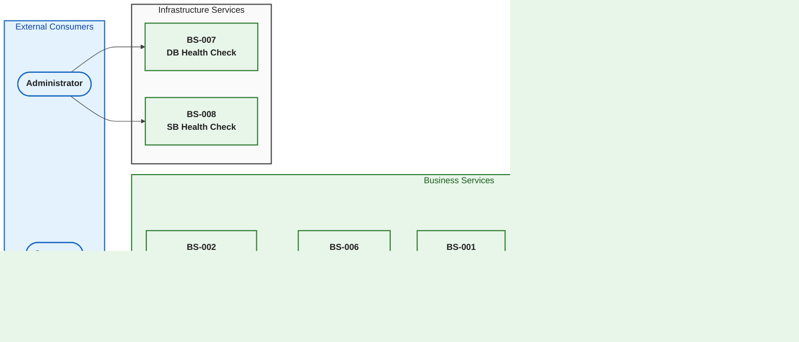

# Business Architecture Document

## Document Control

| Attribute            | Value                                           |
| -------------------- | ----------------------------------------------- |
| **Document Title**   | Business Architecture — eShop Orders Management |
| **Version**          | 1.0                                             |
| **Date**             | 2026-01-29                                      |
| **Author**           | GitHub Copilot (AI-Generated)                   |
| **Framework**        | TOGAF 10 — Business Architecture Domain         |
| **Status**           | Draft                                           |
| **Repository**       | Azure-LogicApps-Monitoring                      |
| **Discovery Source** | ./docs/architecture/discovery-report.md         |

---

## Executive Summary

The eShop Orders Management system is a cloud-native, distributed application built on Microsoft Azure and .NET Aspire that enables customers to place, track, and manage orders through a modern web interface. The architecture follows clean architecture principles with a REST API backend, Blazor Server frontend, and asynchronous event-driven processing via Azure Service Bus and Logic Apps Standard workflows. The system leverages Azure's managed services including SQL Database for persistence, Application Insights for observability, and Container Apps for scalable deployment. This Business Architecture Document catalogs the key business capabilities, services, processes, actors, events, rules, and entities that comprise the solution.

---

## Table of Contents

1. [Business Capability Model](#1-business-capability-model)
2. [Business Services Catalog](#2-business-services-catalog)
3. [Business Processes](#3-business-processes)
4. [Business Actors and Roles](#4-business-actors-and-roles)
5. [Business Events](#5-business-events)
6. [Business Rules](#6-business-rules)
7. [Domain Entities](#7-domain-entities)
8. [Value Streams](#8-value-streams)
9. [Organization Mapping](#9-organization-mapping)
10. [Architecture Overview](#10-architecture-overview)
11. [Appendices](#11-appendices)
12. [Source File Index](#12-source-file-index)

---

## 1. Business Capability Model

### Overview

The eShop Orders Management system delivers seven core business capabilities spanning order management, processing, tracking, messaging, monitoring, and infrastructure. These capabilities are implemented through a layered architecture with clear separation of concerns between presentation, business logic, data access, and messaging layers.

### Capability Diagram

### Capability Inventory

| ID     | Capability Name              | Description                                                                   | Source File                                           |
| ------ | ---------------------------- | ----------------------------------------------------------------------------- | ----------------------------------------------------- |
| BC-001 | Order Management             | Core capability for creating, reading, updating, and deleting customer orders | src/eShop.Orders.API/                                 |
| BC-002 | Order Processing             | Asynchronous order processing through workflows and message handlers          | workflows/OrdersManagement/                           |
| BC-003 | Order Tracking               | Customer-facing order search and status viewing functionality                 | src/eShop.Web.App/Components/Pages/ViewOrder.razor    |
| BC-004 | Customer Order Placement     | UI and API capabilities for customers to submit new orders                    | src/eShop.Web.App/Components/Pages/PlaceOrder.razor   |
| BC-005 | Messaging & Event Publishing | Event-driven communication via Azure Service Bus topics                       | src/eShop.Orders.API/Handlers/OrdersMessageHandler.cs |
| BC-006 | Application Monitoring       | Observability through OpenTelemetry, Application Insights, and health checks  | app.ServiceDefaults/Extensions.cs                     |
| BC-007 | Infrastructure Provisioning  | Azure infrastructure deployment via Bicep IaC templates                       | infra/                                                |

---

## 2. Business Services Catalog

### Overview

The system comprises eight business services organized across API, web application, business logic, data access, messaging, and health monitoring layers. Each service has well-defined interfaces and responsibilities following dependency injection patterns.

### Services Architecture Diagram

### Services Inventory

| ID     | Service Name             | Type     | Interface             | Description                                                                                | Source File                                                |
| ------ | ------------------------ | -------- | --------------------- | ------------------------------------------------------------------------------------------ | ---------------------------------------------------------- |
| BS-001 | Orders API               | Internal | REST/HTTP             | RESTful API exposing order CRUD operations with OpenAPI/Swagger documentation              | src/eShop.Orders.API/Program.cs                            |
| BS-002 | Web Application          | Internal | HTTP/Blazor           | Blazor Server interactive web application for order management UI                          | src/eShop.Web.App/Program.cs                               |
| BS-003 | Order Service            | Internal | IOrderService         | Business logic layer implementing order validation, persistence orchestration, and metrics | src/eShop.Orders.API/Services/OrderService.cs              |
| BS-004 | Order Repository         | Internal | IOrderRepository      | Data access layer for Entity Framework Core operations against Azure SQL                   | src/eShop.Orders.API/Repositories/OrderRepository.cs       |
| BS-005 | Orders Message Handler   | Internal | IOrdersMessageHandler | Service Bus message publishing with retry logic and distributed tracing                    | src/eShop.Orders.API/Handlers/OrdersMessageHandler.cs      |
| BS-006 | Orders API HTTP Client   | Internal | OrdersAPIService      | Typed HTTP client for web app to API communication with resilience policies                | src/eShop.Web.App/Components/Services/OrdersAPIService.cs  |
| BS-007 | Database Health Check    | Internal | IHealthCheck          | SQL Server/Azure SQL Database connectivity monitoring                                      | src/eShop.Orders.API/HealthChecks/DbContextHealthCheck.cs  |
| BS-008 | Service Bus Health Check | Internal | IHealthCheck          | Azure Service Bus namespace connectivity monitoring                                        | src/eShop.Orders.API/HealthChecks/ServiceBusHealthCheck.cs |

---

## 3. Business Processes

### Overview

The system implements eight key business processes spanning order lifecycle operations from placement through async processing. Processes are triggered by HTTP requests, application events, or scheduled recurrence patterns.

### Process Flow Diagram

### Process Sequence Diagram — Order Placement

### Process Inventory

| ID     | Process Name              | Trigger                        | Outcome                                                                   | Source File                                                                                   |
| ------ | ------------------------- | ------------------------------ | ------------------------------------------------------------------------- | --------------------------------------------------------------------------------------------- |
| BP-001 | Place Order               | HTTP POST /api/orders          | Order persisted to database, OrderPlaced message published to Service Bus | src/eShop.Orders.API/Controllers/OrdersController.cs                                          |
| BP-002 | Place Orders Batch        | HTTP POST /api/orders/batch    | Multiple orders persisted, batch messages published                       | src/eShop.Orders.API/Controllers/OrdersController.cs                                          |
| BP-003 | Get Order By ID           | HTTP GET /api/orders/{id}      | Single order details retrieved from database                              | src/eShop.Orders.API/Controllers/OrdersController.cs                                          |
| BP-004 | Get All Orders            | HTTP GET /api/orders           | All orders retrieved from database                                        | src/eShop.Orders.API/Controllers/OrdersController.cs                                          |
| BP-005 | Delete Order              | HTTP DELETE /api/orders/{id}   | Order removed from database                                               | src/eShop.Orders.API/Controllers/OrdersController.cs                                          |
| BP-006 | Process Order Message     | Service Bus message trigger    | HTTP call to process endpoint, result stored in Blob Storage              | workflows/OrdersManagement/OrdersManagementLogicApp/OrdersPlacedProcess/workflow.json         |
| BP-007 | Complete Order Processing | Recurrence trigger (3 seconds) | List and delete processed order blobs from storage                        | workflows/OrdersManagement/OrdersManagementLogicApp/OrdersPlacedCompleteProcess/workflow.json |
| BP-008 | Database Initialization   | Application startup event      | Database migrations applied, connectivity verified                        | src/eShop.Orders.API/Program.cs                                                               |

---

## 4. Business Actors and Roles

### Overview

The system interacts with seven distinct actors including external users (customers, administrators), internal system components (API, Logic Apps engine), and infrastructure services (Service Bus, SQL Database).

### Actor Relationships Diagram

### Actor Inventory

| ID     | Actor/Role Name            | Type           | Responsibilities                                                                | Source File                         |
| ------ | -------------------------- | -------------- | ------------------------------------------------------------------------------- | ----------------------------------- |
| BA-001 | Customer                   | External       | Places orders, provides delivery information, tracks order status               | Inferred from Order.CustomerId      |
| BA-002 | Web Application User       | External       | Interacts with eShop Web App UI to search, view, and place orders               | src/eShop.Web.App/Components/Pages/ |
| BA-003 | System Administrator       | External       | Deploys infrastructure, monitors health, manages Azure resources                | infra/, hooks/                      |
| BA-004 | Orders API System          | Internal       | Processes HTTP requests, validates data, orchestrates persistence and messaging | src/eShop.Orders.API/               |
| BA-005 | Logic Apps Workflow Engine | Internal       | Executes async order processing workflows triggered by Service Bus              | workflows/OrdersManagement/         |
| BA-006 | Azure Service Bus          | Infrastructure | Provides pub-sub messaging for event-driven order processing                    | Configured in AppHost.cs            |
| BA-007 | Azure SQL Database         | Infrastructure | Stores order data persistently with transactional integrity                     | Configured in OrderDbContext.cs     |

---

## 5. Business Events

### Overview

The system produces three key business events related to order lifecycle. Events are published to Azure Service Bus topics and consumed by Logic Apps workflows for async processing.

### Event Flow Diagram

### Event Inventory

| ID     | Event Name         | Producer             | Consumer(s)                     | Payload                                                             | Source File                                           |
| ------ | ------------------ | -------------------- | ------------------------------- | ------------------------------------------------------------------- | ----------------------------------------------------- |
| BE-001 | OrderPlaced        | OrdersMessageHandler | Logic Apps OrdersPlacedProcess  | Order JSON (Id, CustomerId, Date, DeliveryAddress, Total, Products) | src/eShop.Orders.API/Handlers/OrdersMessageHandler.cs |
| BE-002 | OrderBatchPlaced   | OrdersMessageHandler | Logic Apps workflows            | Multiple Order JSON messages                                        | src/eShop.Orders.API/Handlers/OrdersMessageHandler.cs |
| BE-003 | ApplicationStarted | WebApplication       | Database initialization process | None                                                                | src/eShop.Orders.API/Program.cs                       |

---

## 6. Business Rules

### Overview

The system enforces ten business rules spanning data validation, uniqueness constraints, and configuration requirements. Rules are enforced through data annotations on domain models and runtime validation in services.

### Rule Enforcement Diagram

### Rule Inventory

| ID     | Rule Name                    | Description                                                | Enforcement Point                               | Source File                                   |
| ------ | ---------------------------- | ---------------------------------------------------------- | ----------------------------------------------- | --------------------------------------------- |
| BR-001 | Order ID Required            | Order must have a non-empty ID (1-100 characters)          | [Required], [StringLength] attribute            | app.ServiceDefaults/CommonTypes.cs            |
| BR-002 | Customer ID Required         | Order must have a non-empty customer ID (1-100 characters) | [Required], [StringLength] attribute            | app.ServiceDefaults/CommonTypes.cs            |
| BR-003 | Delivery Address Required    | Delivery address must be 5-500 characters                  | [Required], [StringLength] attribute            | app.ServiceDefaults/CommonTypes.cs            |
| BR-004 | Order Total Must Be Positive | Order total must be greater than 0.01                      | [Range(0.01, double.MaxValue)] attribute        | app.ServiceDefaults/CommonTypes.cs            |
| BR-005 | Order Must Have Products     | Order must contain at least one product                    | [Required], [MinLength(1)] attribute            | app.ServiceDefaults/CommonTypes.cs            |
| BR-006 | Product Quantity Positive    | Product quantity must be at least 1                        | [Range(1, int.MaxValue)] attribute              | app.ServiceDefaults/CommonTypes.cs            |
| BR-007 | Product Price Positive       | Product price must be greater than 0.01                    | [Range(0.01, double.MaxValue)] attribute        | app.ServiceDefaults/CommonTypes.cs            |
| BR-008 | Duplicate Order Prevention   | Cannot create order with existing ID                       | Runtime check in OrderService.PlaceOrderAsync() | src/eShop.Orders.API/Services/OrderService.cs |
| BR-009 | Temperature Range Valid      | Weather temperature must be -273°C to 200°C                | [Range(-273, 200)] attribute                    | app.ServiceDefaults/CommonTypes.cs            |
| BR-010 | Connection String Required   | Database and Service Bus connections must be configured    | Runtime validation on startup                   | src/eShop.Orders.API/Program.cs               |

---

## 7. Domain Entities

### Overview

The domain model consists of five entities: two domain models (Order, OrderProduct), two database entities (OrderEntity, OrderProductEntity), and one utility model (WeatherForecast). Entities follow a clean separation between domain and persistence concerns.

### Entity Relationship Diagram

### Entity Inventory

| ID     | Entity Name        | Key Attributes                                              | Relationships               | Purpose                                   | Source File                                              |
| ------ | ------------------ | ----------------------------------------------------------- | --------------------------- | ----------------------------------------- | -------------------------------------------------------- |
| BO-001 | Order              | Id, CustomerId, Date, DeliveryAddress, Total, Products      | Has many OrderProducts      | Domain model for customer orders          | app.ServiceDefaults/CommonTypes.cs                       |
| BO-002 | OrderProduct       | Id, OrderId, ProductId, ProductDescription, Quantity, Price | Belongs to Order            | Domain model for order line items         | app.ServiceDefaults/CommonTypes.cs                       |
| BO-003 | OrderEntity        | Id, CustomerId, Date, DeliveryAddress, Total, Products      | Has many OrderProductEntity | EF Core entity for database persistence   | src/eShop.Orders.API/data/Entities/OrderEntity.cs        |
| BO-004 | OrderProductEntity | Id, OrderId, ProductId, ProductDescription, Quantity, Price | Belongs to OrderEntity      | EF Core entity for product persistence    | src/eShop.Orders.API/data/Entities/OrderProductEntity.cs |
| BO-005 | WeatherForecast    | Date, TemperatureC, TemperatureF, Summary                   | None                        | Utility model for demos and health checks | app.ServiceDefaults/CommonTypes.cs                       |

---

## 8. Value Streams

### Overview

The primary value stream is the Order Fulfillment process, which traces the customer journey from order placement through async processing and completion. The value stream spans seven stages across multiple services and Azure components.

### Value Stream Diagram

### Value Stream Inventory

| ID     | Value Stream Name | Stages                                                                                                                                                                                                                                                                                                              | Source Files |
| ------ | ----------------- | ------------------------------------------------------------------------------------------------------------------------------------------------------------------------------------------------------------------------------------------------------------------------------------------------------------------- | ------------ |
| VS-001 | Order Fulfillment | 1. Order Placement (PlaceOrder.razor) → 2. Validation (CommonTypes.cs) → 3. Persistence (OrderRepository.cs) → 4. Event Publishing (OrdersMessageHandler.cs) → 5. Async Processing (OrdersPlacedProcess/workflow.json) → 6. Result Storage (workflow.json) → 7. Cleanup (OrdersPlacedCompleteProcess/workflow.json) | Multiple     |

---

## 9. Organization Mapping

### Overview

Organization units are inferred from infrastructure tags in the Bicep templates. The Platform-Team owns infrastructure provisioning while Engineering serves as the cost center for all application capabilities.

### Organization Diagram

### Organization Inventory

| ID     | Org Unit Name | Type        | Owned Capabilities                                   | Source File      |
| ------ | ------------- | ----------- | ---------------------------------------------------- | ---------------- |
| OU-001 | Platform-Team | Owner       | BC-007 (Infrastructure Provisioning)                 | infra/main.bicep |
| OU-002 | Engineering   | Cost Center | BC-001 through BC-006 (All Application Capabilities) | infra/main.bicep |

---

## 10. Architecture Overview

### Overview

The complete architecture integrates all business architecture elements across four layers: Actors, Services, Capabilities, and Entities. The diagram shows the primary flows from external actors through internal services to data persistence.

### Architecture Overview Diagram

---

## 11. Appendices

### Appendix A: Glossary of Business Terms

| Term               | Definition                                                                   | Source File                                       |
| ------------------ | ---------------------------------------------------------------------------- | ------------------------------------------------- |
| Order              | A customer order containing products, delivery information, and total amount | app.ServiceDefaults/CommonTypes.cs                |
| OrderProduct       | An individual product item within an order with quantity and pricing         | app.ServiceDefaults/CommonTypes.cs                |
| OrderEntity        | Database representation of an Order entity in Entity Framework Core          | src/eShop.Orders.API/data/Entities/OrderEntity.cs |
| OrderDbContext     | Entity Framework Core database context for order management                  | src/eShop.Orders.API/data/OrderDbContext.cs       |
| Service Defaults   | Shared configurations for OpenTelemetry, health checks, and resilience       | app.ServiceDefaults/Extensions.cs                 |
| AppHost            | .NET Aspire distributed application orchestrator                             | app.AppHost/AppHost.cs                            |
| Activity Source    | OpenTelemetry distributed tracing instrumentation component                  | Multiple files                                    |
| Managed Identity   | Azure AD identity for service-to-service authentication without secrets      | infra/main.bicep                                  |
| Service Bus Topic  | Azure Service Bus topic "ordersplaced" for publish-subscribe messaging       | Configured in OrdersMessageHandler.cs             |
| Logic App Workflow | Azure Logic Apps Standard serverless workflow for async processing           | workflows/OrdersManagement/                       |
| Health Check       | Kubernetes/Container Apps compatible health monitoring endpoint              | src/eShop.Orders.API/HealthChecks/                |
| Resilience Handler | HTTP client retry, timeout, and circuit breaker policies                     | app.ServiceDefaults/Extensions.cs                 |
| Bicep              | Azure Infrastructure as Code declarative language                            | infra/\*.bicep                                    |
| azd                | Azure Developer CLI for deployment orchestration                             | azure.yaml                                        |

### Appendix B: TOGAF Compliance Matrix

| TOGAF Element           | Document Section | Coverage                        |
| ----------------------- | ---------------- | ------------------------------- |
| Business Capabilities   | Section 1        | ✅ Complete                     |
| Business Services       | Section 2        | ✅ Complete                     |
| Business Processes      | Section 3        | ✅ Complete                     |
| Business Actors & Roles | Section 4        | ✅ Complete                     |
| Business Events         | Section 5        | ✅ Complete                     |
| Business Rules          | Section 6        | ✅ Complete                     |
| Domain Entities         | Section 7        | ✅ Complete                     |
| Value Streams           | Section 8        | ✅ Complete                     |
| Organization Units      | Section 9        | ⚠️ Partial (inferred from tags) |
| Architecture Overview   | Section 10       | ✅ Complete                     |

### Appendix C: Diagram Verification Report

_To be completed during Phase 3: Documentation Validation_

### Appendix D: Enterprise Style Reference

#### Color Palette

| Element Type | Fill Color   | Border Color | Hex Codes         |
| ------------ | ------------ | ------------ | ----------------- |
| Actor        | Light Blue   | Blue         | #E3F2FD / #1565C0 |
| Service      | Light Green  | Green        | #E8F5E9 / #2E7D32 |
| Capability   | Light Purple | Purple       | #F3E5F5 / #6A1B9A |
| Process      | Light Orange | Orange       | #FFF3E0 / #E65100 |
| Event        | Light Cyan   | Cyan         | #E0F7FA / #00838F |
| Rule         | Light Red    | Red          | #FFEBEE / #C62828 |
| Entity       | Light Yellow | Yellow       | #FFFDE7 / #F9A825 |
| Organization | Light Gray   | Gray         | #FAFAFA / #424242 |
| Value Stream | Light Teal   | Teal         | #E0F2F1 / #00695C |

#### Node Shapes

| Element Type           | Mermaid Shape | Syntax     |
| ---------------------- | ------------- | ---------- |
| Actor/Stakeholder      | Stadium/Pill  | `([text])` |
| Business Service       | Rectangle     | `[text]`   |
| Business Capability    | Rectangle     | `[text]`   |
| Business Process       | Rectangle     | `[text]`   |
| Business Event         | Circle        | `((text))` |
| Business Rule/Decision | Hexagon       | `{{text}}` |
| Domain Entity          | Cylinder      | `[(text)]` |
| Organization Unit      | Rectangle     | `[text]`   |

---

## 12. Source File Index

| File Path                                                                                     | Elements Documented                           |
| --------------------------------------------------------------------------------------------- | --------------------------------------------- |
| app.AppHost/AppHost.cs                                                                        | BC-006, BS-001, BS-002, BA-006, BA-007        |
| app.ServiceDefaults/Extensions.cs                                                             | BC-006, BS-007, BS-008, BR-010                |
| app.ServiceDefaults/CommonTypes.cs                                                            | BO-001, BO-002, BO-005, BR-001 through BR-009 |
| src/eShop.Orders.API/Program.cs                                                               | BS-001, BP-008, BR-010, BE-003                |
| src/eShop.Orders.API/Controllers/OrdersController.cs                                          | BC-001, BP-001 through BP-005                 |
| src/eShop.Orders.API/Services/OrderService.cs                                                 | BS-003, BR-008                                |
| src/eShop.Orders.API/Repositories/OrderRepository.cs                                          | BS-004                                        |
| src/eShop.Orders.API/Handlers/OrdersMessageHandler.cs                                         | BS-005, BC-005, BE-001, BE-002                |
| src/eShop.Orders.API/Handlers/NoOpOrdersMessageHandler.cs                                     | BS-005 (stub implementation)                  |
| src/eShop.Orders.API/Interfaces/IOrderService.cs                                              | BS-003 (contract)                             |
| src/eShop.Orders.API/Interfaces/IOrderRepository.cs                                           | BS-004 (contract)                             |
| src/eShop.Orders.API/Interfaces/IOrdersMessageHandler.cs                                      | BS-005 (contract)                             |
| src/eShop.Orders.API/data/OrderDbContext.cs                                                   | BO-003, BO-004                                |
| src/eShop.Orders.API/data/Entities/OrderEntity.cs                                             | BO-003                                        |
| src/eShop.Orders.API/data/Entities/OrderProductEntity.cs                                      | BO-004                                        |
| src/eShop.Orders.API/data/OrderMapper.cs                                                      | BO-001 ↔ BO-003 mapping                       |
| src/eShop.Orders.API/HealthChecks/DbContextHealthCheck.cs                                     | BS-007                                        |
| src/eShop.Orders.API/HealthChecks/ServiceBusHealthCheck.cs                                    | BS-008                                        |
| src/eShop.Web.App/Program.cs                                                                  | BS-002, BS-006                                |
| src/eShop.Web.App/Components/Services/OrdersAPIService.cs                                     | BS-006                                        |
| src/eShop.Web.App/Components/Pages/Home.razor                                                 | BC-003, BC-004 (UI)                           |
| src/eShop.Web.App/Components/Pages/ViewOrder.razor                                            | BC-003 (UI)                                   |
| src/eShop.Web.App/Components/Pages/PlaceOrder.razor                                           | BC-004 (UI)                                   |
| src/eShop.Web.App/Components/Pages/PlaceOrdersBatch.razor                                     | BC-004 (UI)                                   |
| src/eShop.Web.App/Components/Pages/ListAllOrders.razor                                        | BC-003 (UI)                                   |
| workflows/OrdersManagement/OrdersManagementLogicApp/OrdersPlacedProcess/workflow.json         | BP-006, BA-005                                |
| workflows/OrdersManagement/OrdersManagementLogicApp/OrdersPlacedCompleteProcess/workflow.json | BP-007, BA-005                                |
| infra/main.bicep                                                                              | BC-007, OU-001, OU-002                        |
| infra/workload/main.bicep                                                                     | BC-007                                        |
| azure.yaml                                                                                    | BC-007 (deployment config)                    |

---

_End of Business Architecture Document_
